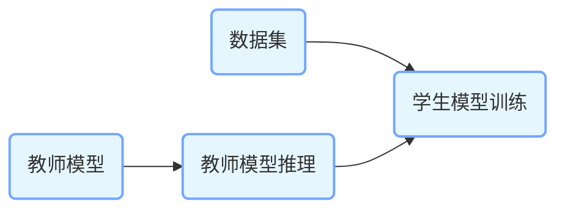

# 大规模语言模型的知识蒸馏技术研究

> 关键词：大规模语言模型、知识蒸馏技术、模型压缩、教师模型、学生模型、迁移学习、泛化能力

> 摘要：本文围绕大规模语言模型的知识蒸馏技术展开深入研究。首先介绍了该技术的背景，包括其目的、适用读者和文档结构等。详细阐述了知识蒸馏的核心概念与联系，通过文本示意图和 Mermaid 流程图清晰呈现其原理和架构。深入讲解了核心算法原理并给出 Python 源代码示例，同时介绍了相关的数学模型和公式。通过项目实战，展示了代码的实际案例并进行详细解释。探讨了知识蒸馏技术在不同场景下的实际应用，推荐了学习、开发相关的工具和资源，以及相关论文著作。最后总结了该技术的未来发展趋势与挑战，并提供了常见问题解答和扩展阅读参考资料，旨在全面深入地剖析大规模语言模型的知识蒸馏技术，为相关研究和实践提供有价值的参考。

## 1. 背景介绍 
### 1.1 目的和范围
大规模语言模型在自然语言处理领域取得了显著的成果，如 GPT 系列、BERT 等模型在文本生成、机器翻译、问答系统等任务中表现出色。然而，这些模型通常具有庞大的参数数量，导致计算资源需求高、推理速度慢，难以在资源受限的设备上部署，如移动设备、嵌入式系统等。知识蒸馏技术的目的就是解决这些问题，通过将大规模模型（教师模型）的知识迁移到较小的模型（学生模型）中，实现模型的压缩和加速，同时尽可能保留教师模型的性能。

本研究的范围涵盖知识蒸馏技术的基本原理、核心算法、数学模型，以及在实际项目中的应用案例。同时，还会探讨该技术在不同场景下的应用和未来发展趋势。

### 1.2 预期读者
本文预期读者包括自然语言处理领域的研究人员、工程师、学生等。对于想要深入了解大规模语言模型优化技术、模型压缩方法的专业人士，以及对人工智能技术有兴趣并希望学习相关知识的爱好者都具有参考价值。

### 1.3 文档结构概述
本文首先介绍背景信息，包括目的、读者和文档结构。接着阐述知识蒸馏的核心概念与联系，通过示意图和流程图展示其原理和架构。然后讲解核心算法原理并给出 Python 代码示例，介绍相关数学模型和公式。通过项目实战展示代码的实际应用和详细解释。探讨知识蒸馏技术的实际应用场景，推荐相关工具和资源以及论文著作。最后总结未来发展趋势与挑战，提供常见问题解答和扩展阅读参考资料。

### 1.4 术语表
#### 1.4.1 核心术语定义
- **大规模语言模型**：具有大量参数（通常数十亿甚至上万亿）的语言模型，如 GPT - 3、BLOOM 等，在自然语言处理任务中表现优异，但计算和存储成本高。
- **知识蒸馏**：一种模型压缩技术，通过将教师模型的知识迁移到学生模型中，使学生模型学习到教师模型的泛化能力。
- **教师模型**：知识蒸馏中的源模型，通常是一个大规模、性能良好的预训练语言模型。
- **学生模型**：知识蒸馏中的目标模型，规模较小，通过学习教师模型的知识来提升性能。
- **软标签**：教师模型输出的概率分布，包含了比硬标签（类别标签）更多的信息，用于指导学生模型的学习。

#### 1.4.2 相关概念解释
- **模型压缩**：通过各种技术减少模型的参数数量和计算量，同时保持或提高模型的性能，知识蒸馏是其中一种方法。
- **迁移学习**：将在一个任务或领域中学习到的知识迁移到另一个任务或领域中，知识蒸馏可以看作是一种特殊的迁移学习，将教师模型的知识迁移到学生模型中。
- **泛化能力**：模型在未见过的数据上的表现能力，知识蒸馏的目标之一是让学生模型学习到教师模型的泛化能力。

#### 1.4.3 缩略词列表
- **NLP**：Natural Language Processing，自然语言处理
- **LM**：Language Model，语言模型
- **KD**：Knowledge Distillation，知识蒸馏

## 2. 核心概念与联系 

### 知识蒸馏的基本原理
知识蒸馏的基本思想是让一个较小的学生模型学习一个较大的教师模型的行为。教师模型通常是一个在大规模数据集上预训练的模型，具有较好的性能。学生模型则是一个相对较小的模型，通过模仿教师模型的输出，学习到教师模型的知识。

具体来说，知识蒸馏的过程包括以下几个步骤：
1. **数据准备**：准备用于训练的数据集，该数据集可以是与教师模型预训练数据集相同或相关的数据集。
2. **教师模型推理**：将数据输入到教师模型中，得到教师模型的输出，通常是一个概率分布（软标签）。
3. **学生模型训练**：将相同的数据输入到学生模型中，同时使用教师模型的软标签作为监督信号，训练学生模型。在训练过程中，通常会结合学生模型的预测结果与真实标签（硬标签）的损失，以及学生模型的预测结果与教师模型的软标签的损失，来更新学生模型的参数。

### 知识蒸馏的架构示意图
下面是知识蒸馏的架构文本示意图：

```plaintext
+----------------+          +----------------+
|    数据集      |          |  教师模型      |
+----------------+          +----------------+
       |                          |
       |                          |
       v                          v
+----------------+          +----------------+
|  学生模型训练  |<--------|  教师模型推理  |
+----------------+          +----------------+
```

### Mermaid 流程图


## 3. 核心算法原理 & 具体操作步骤 

### 核心算法原理
知识蒸馏的核心算法是通过最小化学生模型的预测结果与教师模型的软标签之间的损失，以及学生模型的预测结果与真实标签之间的损失，来训练学生模型。常用的损失函数包括交叉熵损失。

设 $x$ 是输入数据，$y$ 是真实标签，$p_t(x)$ 是教师模型的输出概率分布，$p_s(x)$ 是学生模型的输出概率分布。知识蒸馏的损失函数可以表示为：

$L_{KD} = \alpha L_{CE}(p_s(x), y) + (1 - \alpha) L_{KL}(p_s(x), p_t(x))$

其中，$L_{CE}$ 是交叉熵损失函数，$L_{KL}$ 是 KL 散度损失函数，$\alpha$ 是一个超参数，用于平衡两种损失的权重。

### 具体操作步骤
1. **加载教师模型和学生模型**：选择合适的大规模语言模型作为教师模型，选择一个较小的模型作为学生模型。
2. **数据加载和预处理**：加载训练数据集，并进行必要的预处理，如分词、编码等。
3. **定义损失函数和优化器**：定义知识蒸馏的损失函数和优化器，用于训练学生模型。
4. **训练学生模型**：在训练过程中，将数据输入到教师模型和学生模型中，计算损失并更新学生模型的参数。
5. **评估学生模型**：在验证集或测试集上评估学生模型的性能。

### Python 源代码示例
```python
import torch
import torch.nn as nn
import torch.optim as optim
from transformers import AutoModelForSequenceClassification, AutoTokenizer

# 加载教师模型和学生模型
teacher_model = AutoModelForSequenceClassification.from_pretrained('bert-large-uncased')
student_model = AutoModelForSequenceClassification.from_pretrained('bert-base-uncased')

# 加载分词器
tokenizer = AutoTokenizer.from_pretrained('bert-base-uncased')

# 定义损失函数和优化器
alpha = 0.5
criterion_ce = nn.CrossEntropyLoss()
criterion_kl = nn.KLDivLoss(reduction='batchmean')
optimizer = optim.Adam(student_model.parameters(), lr=1e-5)

# 模拟训练数据
texts = ["This is a sample sentence.", "Another sample sentence."]
labels = [0, 1]

# 数据预处理
inputs = tokenizer(texts, return_tensors='pt', padding=True, truncation=True)
labels = torch.tensor(labels)

# 训练学生模型
for epoch in range(10):
    # 教师模型推理
    with torch.no_grad():
        teacher_outputs = teacher_model(**inputs)
        teacher_logits = teacher_outputs.logits
        teacher_probs = torch.softmax(teacher_logits, dim=-1)
    
    # 学生模型前向传播
    student_outputs = student_model(**inputs)
    student_logits = student_outputs.logits
    student_probs = torch.softmax(student_logits, dim=-1)
    
    # 计算损失
    loss_ce = criterion_ce(student_logits, labels)
    loss_kl = criterion_kl(torch.log(student_probs), teacher_probs)
    loss = alpha * loss_ce + (1 - alpha) * loss_kl
    
    # 反向传播和参数更新
    optimizer.zero_grad()
    loss.backward()
    optimizer.step()
    
    print(f'Epoch {epoch + 1}, Loss: {loss.item()}')
```

## 4. 数学模型和公式 & 详细讲解 & 举例说明 

### 交叉熵损失函数
交叉熵损失函数用于衡量学生模型的预测结果与真实标签之间的差异。对于一个多分类问题，设 $y$ 是真实标签的 one - hot 编码，$p_s(x)$ 是学生模型的输出概率分布，则交叉熵损失函数可以表示为：

$$L_{CE}(p_s(x), y) = -\sum_{i = 1}^{C} y_i \log(p_{s_i}(x))$$

其中，$C$ 是类别数，$y_i$ 是真实标签的第 $i$ 个分量，$p_{s_i}(x)$ 是学生模型输出概率分布的第 $i$ 个分量。

**举例说明**：假设一个二分类问题，真实标签 $y = [1, 0]$，学生模型的输出概率分布 $p_s(x) = [0.8, 0.2]$，则交叉熵损失为：

$L_{CE}(p_s(x), y) = -(1 \times \log(0.8) + 0 \times \log(0.2)) \approx 0.223$

### KL 散度损失函数
KL 散度损失函数用于衡量学生模型的预测结果与教师模型的软标签之间的差异。设 $p_t(x)$ 是教师模型的输出概率分布，$p_s(x)$ 是学生模型的输出概率分布，则 KL 散度损失函数可以表示为：

$$L_{KL}(p_s(x), p_t(x)) = \sum_{i = 1}^{C} p_{t_i}(x) \log\left(\frac{p_{t_i}(x)}{p_{s_i}(x)}\right)$$

**举例说明**：假设教师模型的输出概率分布 $p_t(x) = [0.9, 0.1]$，学生模型的输出概率分布 $p_s(x) = [0.8, 0.2]$，则 KL 散度损失为：

$L_{KL}(p_s(x), p_t(x)) = 0.9 \times \log\left(\frac{0.9}{0.8}\right) + 0.1 \times \log\left(\frac{0.1}{0.2}\right) \approx 0.025$

### 知识蒸馏损失函数
知识蒸馏的损失函数是交叉熵损失和 KL 散度损失的加权和：

$L_{KD} = \alpha L_{CE}(p_s(x), y) + (1 - \alpha) L_{KL}(p_s(x), p_t(x))$

**举例说明**：假设 $\alpha = 0.5$，$L_{CE}(p_s(x), y) = 0.223$，$L_{KL}(p_s(x), p_t(x)) = 0.025$，则知识蒸馏损失为：

$L_{KD} = 0.5 \times 0.223 + 0.5 \times 0.025 = 0.124$

## 5. 项目实战：代码实际案例和详细解释说明 

### 5.1  开发环境搭建
1. **安装 Python**：建议使用 Python 3.7 及以上版本。
2. **安装 PyTorch**：根据自己的 CUDA 版本选择合适的 PyTorch 安装命令，例如：
```bash
pip install torch torchvision torchaudio
```
3. **安装 Transformers 库**：用于加载预训练的语言模型和分词器。
```bash
pip install transformers
```

### 5.2  源代码详细实现和代码解读
```python
import torch
import torch.nn as nn
import torch.optim as optim
from transformers import AutoModelForSequenceClassification, AutoTokenizer

# 加载教师模型和学生模型
teacher_model = AutoModelForSequenceClassification.from_pretrained('bert-large-uncased')
student_model = AutoModelForSequenceClassification.from_pretrained('bert-base-uncased')

# 加载分词器
tokenizer = AutoTokenizer.from_pretrained('bert-base-uncased')

# 定义损失函数和优化器
alpha = 0.5
criterion_ce = nn.CrossEntropyLoss()
criterion_kl = nn.KLDivLoss(reduction='batchmean')
optimizer = optim.Adam(student_model.parameters(), lr=1e-5)

# 模拟训练数据
texts = ["This is a sample sentence.", "Another sample sentence."]
labels = [0, 1]

# 数据预处理
inputs = tokenizer(texts, return_tensors='pt', padding=True, truncation=True)
labels = torch.tensor(labels)

# 训练学生模型
for epoch in range(10):
    # 教师模型推理
    with torch.no_grad():
        teacher_outputs = teacher_model(**inputs)
        teacher_logits = teacher_outputs.logits
        teacher_probs = torch.softmax(teacher_logits, dim=-1)
    
    # 学生模型前向传播
    student_outputs = student_model(**inputs)
    student_logits = student_outputs.logits
    student_probs = torch.softmax(student_logits, dim=-1)
    
    # 计算损失
    loss_ce = criterion_ce(student_logits, labels)
    loss_kl = criterion_kl(torch.log(student_probs), teacher_probs)
    loss = alpha * loss_ce + (1 - alpha) * loss_kl
    
    # 反向传播和参数更新
    optimizer.zero_grad()
    loss.backward()
    optimizer.step()
    
    print(f'Epoch {epoch + 1}, Loss: {loss.item()}')
```

### 代码解读与分析
1. **模型加载**：使用 `AutoModelForSequenceClassification.from_pretrained` 函数加载预训练的教师模型和学生模型，`bert-large-uncased` 是一个较大的 BERT 模型作为教师模型，`bert-base-uncased` 是一个较小的 BERT 模型作为学生模型。
2. **分词器加载**：使用 `AutoTokenizer.from_pretrained` 函数加载与学生模型对应的分词器。
3. **损失函数和优化器定义**：定义交叉熵损失函数 `criterion_ce` 和 KL 散度损失函数 `criterion_kl`，以及 Adam 优化器。
4. **数据预处理**：使用分词器对输入文本进行分词和编码，将标签转换为 PyTorch 张量。
5. **训练过程**：
    - **教师模型推理**：在不计算梯度的情况下，将数据输入到教师模型中，得到教师模型的输出概率分布。
    - **学生模型前向传播**：将相同的数据输入到学生模型中，得到学生模型的输出概率分布。
    - **损失计算**：计算交叉熵损失和 KL 散度损失，并根据超参数 $\alpha$ 计算知识蒸馏损失。
    - **反向传播和参数更新**：调用 `loss.backward()` 进行反向传播，`optimizer.step()` 更新学生模型的参数。

## 6. 实际应用场景 
### 移动设备端应用
在移动设备上，由于计算资源和存储容量有限，难以部署大规模语言模型。知识蒸馏技术可以将大规模语言模型的知识迁移到较小的模型中，使得模型可以在移动设备上运行，实现实时的自然语言处理任务，如语音识别、文本分类、机器翻译等。

### 嵌入式系统应用
在嵌入式系统中，如智能手表、智能家居设备等，对模型的计算效率和功耗有较高的要求。知识蒸馏技术可以压缩模型的规模，降低计算量和功耗，同时保持模型的性能，实现嵌入式系统的自然语言交互功能。

### 大规模部署应用
在大规模的云计算平台上，部署大量的大规模语言模型会占用大量的计算资源和成本。知识蒸馏技术可以将大规模模型压缩为较小的模型，提高模型的部署效率和资源利用率，降低成本。

### 教育领域应用
在教育领域，学生可能没有足够的计算资源来训练和使用大规模语言模型。知识蒸馏技术可以提供一种轻量级的模型，让学生在自己的设备上进行自然语言处理实验和学习，促进教育的普及和发展。

## 7. 工具和资源推荐
### 7.1 学习资源推荐
#### 7.1.1