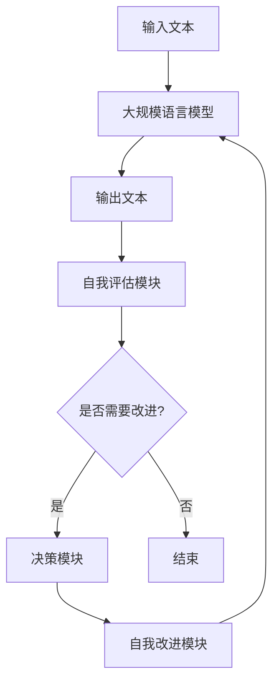

# 大规模语言模型的自我评估与改进能力研究

> 关键词：大规模语言模型、自我评估、自我改进、评估指标、改进策略

> 摘要：本文聚焦于大规模语言模型的自我评估与改进能力。首先介绍了研究的背景、目的、预期读者和文档结构等内容。接着阐述了大规模语言模型自我评估与改进的核心概念及联系，包括其原理和架构，并给出了相应的示意图和流程图。详细讲解了核心算法原理，通过 Python 源代码进行了说明，同时介绍了相关的数学模型和公式。在项目实战部分，给出了开发环境搭建、源代码实现及解读。探讨了大规模语言模型自我评估与改进能力在实际中的应用场景，推荐了学习资源、开发工具框架和相关论文著作。最后总结了未来发展趋势与挑战，解答了常见问题并提供了扩展阅读和参考资料。

## 1. 背景介绍 
### 1.1 目的和范围
大规模语言模型（LLMs）在自然语言处理领域取得了显著的成果，被广泛应用于各种任务，如文本生成、问答系统、机器翻译等。然而，这些模型在实际应用中仍存在一些问题，如回答不准确、缺乏常识、生成内容存在偏见等。为了提高模型的性能和可靠性，研究大规模语言模型的自我评估与改进能力具有重要意义。

本研究的目的是深入探讨大规模语言模型如何进行自我评估以及如何根据评估结果进行自我改进。研究范围涵盖了常见的评估指标、自我评估的方法、改进策略以及实际应用中的挑战和解决方案。

### 1.2 预期读者
本文的预期读者包括自然语言处理领域的研究人员、开发人员、机器学习工程师以及对大规模语言模型感兴趣的技术爱好者。对于研究人员，本文可以提供新的研究思路和方法；对于开发人员和工程师，本文可以帮助他们在实际项目中更好地应用和优化大规模语言模型；对于技术爱好者，本文可以帮助他们了解大规模语言模型的前沿技术。

### 1.3 文档结构概述
本文将按照以下结构进行组织：
- 核心概念与联系：介绍大规模语言模型自我评估与改进的核心概念、原理和架构。
- 核心算法原理 & 具体操作步骤：详细讲解自我评估和改进的核心算法，并给出 Python 源代码示例。
- 数学模型和公式 & 详细讲解 & 举例说明：介绍相关的数学模型和公式，并通过具体例子进行说明。
- 项目实战：代码实际案例和详细解释说明：通过一个实际项目，展示如何实现大规模语言模型的自我评估与改进。
- 实际应用场景：探讨大规模语言模型自我评估与改进能力在实际中的应用场景。
- 工具和资源推荐：推荐学习资源、开发工具框架和相关论文著作。
- 总结：未来发展趋势与挑战：总结大规模语言模型自我评估与改进能力的未来发展趋势和面临的挑战。
- 附录：常见问题与解答：解答读者可能遇到的常见问题。
- 扩展阅读 & 参考资料：提供扩展阅读的建议和参考资料。

### 1.4 术语表
#### 1.4.1 核心术语定义
- 大规模语言模型（Large Language Model, LLM）：基于深度学习技术，通过在大规模文本数据上进行训练得到的语言模型，具有强大的语言理解和生成能力。
- 自我评估（Self - evaluation）：模型对自身输出结果的质量进行评估的过程。
- 自我改进（Self - improvement）：模型根据自我评估的结果，调整自身参数或策略以提高性能的过程。
- 评估指标（Evaluation Metrics）：用于衡量模型输出结果质量的量化指标。

#### 1.4.2 相关概念解释
- 无监督评估：在没有人工标注数据的情况下，模型通过自身的机制对输出进行评估。
- 有监督评估：利用人工标注的数据，将模型的输出与标注结果进行比较，从而评估模型的性能。
- 强化学习改进：通过强化学习算法，根据评估结果对模型进行奖励或惩罚，以引导模型进行改进。

#### 1.4.3 缩略词列表
- LLM：Large Language Model（大规模语言模型）
- NLP：Natural Language Processing（自然语言处理）
- RL：Reinforcement Learning（强化学习）

## 2. 核心概念与联系 

### 核心概念原理
大规模语言模型的自我评估与改进能力基于以下几个核心原理：

#### 自我评估原理
自我评估的核心在于定义合适的评估指标，这些指标可以从不同的维度衡量模型输出的质量。例如，在文本生成任务中，可以使用语法正确性、语义连贯性、信息准确性等指标。模型通过对自身输出进行分析和计算，得出这些指标的值，从而评估输出的质量。

#### 自我改进原理
自我改进是根据自我评估的结果来调整模型的参数或策略。如果评估结果表明模型的输出质量较低，模型可以通过调整参数、增加训练数据、改变训练策略等方式来提高性能。例如，在强化学习中，模型根据奖励信号来调整自身的行为，以最大化累积奖励。

### 架构示意图
以下是大规模语言模型自我评估与改进的架构示意图：

```plaintext
+---------------------+
| 大规模语言模型      |
+---------------------+
| 输入文本            |
| 输出文本            |
+---------------------+
           |
           v
+---------------------+
| 自我评估模块        |
| - 评估指标计算      |
| - 质量评估          |
+---------------------+
           |
           v
+---------------------+
| 决策模块            |
| - 判断是否需要改进  |
| - 选择改进策略      |
+---------------------+
           |
           v
+---------------------+
| 自我改进模块        |
| - 参数调整          |
| - 策略更新          |
+---------------------+
```

### Mermaid 流程图


这个流程图展示了大规模语言模型自我评估与改进的基本流程。首先，输入文本经过大规模语言模型得到输出文本。然后，自我评估模块对输出文本进行评估，决策模块根据评估结果判断是否需要改进。如果需要改进，选择合适的改进策略并通过自我改进模块对模型进行更新；如果不需要改进，则流程结束。

## 3. 核心算法原理 & 具体操作步骤 

### 自我评估算法原理及 Python 实现
#### 语法正确性评估
一种简单的语法正确性评估方法是使用语言工具库，如 `language-tool-python`。以下是一个示例代码：
```python
import language_tool_python

def grammar_evaluation(text):
    tool = language_tool_python.LanguageTool('en-US')
    matches = tool.check(text)
    error_count = len(matches)
    return error_count

# 示例文本
text = "I is a student."
error_count = grammar_evaluation(text)
print(f"语法错误数量: {error_count}")
```
在这个示例中，我们使用 `language-tool-python` 库检查文本中的语法错误，并返回错误的数量。错误数量越少，说明文本的语法正确性越高。

#### 语义连贯性评估
语义连贯性可以通过计算文本中句子之间的语义相似度来评估。我们可以使用预训练的语言模型，如 `sentence-transformers` 来实现。以下是一个示例代码：
```python
from sentence_transformers import SentenceTransformer
import numpy as np
from sklearn.metrics.pairwise import cosine_similarity

def semantic_coherence_evaluation(text):
    model = SentenceTransformer('all-MiniLM-L6-v2')
    sentences = text.split('.')
    sentence_embeddings = model.encode(sentences)
    similarity_matrix = cosine_similarity(sentence_embeddings)
    mean_similarity = np.mean(similarity_matrix[np.triu_indices(len(sentences), k = 1)])
    return mean_similarity

# 示例文本
text = "The sun rises in the east. It gives us light and heat."
coherence_score = semantic_coherence_evaluation(text)
print(f"语义连贯性得分: {coherence_score}")
```
在这个示例中，我们使用 `sentence-transformers` 库将句子转换为向量表示，然后计算句子之间的余弦相似度。最后，取所有非对角线元素的平均值作为语义连贯性得分。得分越高，说明文本的语义连贯性越好。

### 自我改进算法原理及 Python 实现
#### 基于强化学习的改进
在强化学习中，我们可以使用策略梯度算法，如 `Proximal Policy Optimization (PPO)` 来改进模型。以下是一个简化的示例代码：
```python
import torch
import torch.nn as nn
import torch.optim as optim
from torch.distributions import Categorical

# 定义一个简单的策略网络
class PolicyNetwork(nn.Module):
    def __init__(self, input_size, output_size):
        super(PolicyNetwork, self).__init__()
        self.fc1 = nn.Linear(input_size, 128)
        self.fc2 = nn.Linear(128, output_size)

    def forward(self, x):
        x = torch.relu(self.fc1(x))
        x = torch.softmax(self.fc2(x), dim = -1)
        return x

# 训练过程
def train_ppo(policy_network, optimizer, states, actions, rewards, gamma = 0.99):
    log_probs = []
    for state, action in zip(states, actions):
        state = torch.FloatTensor(state).unsqueeze(0)
        probs = policy_network(state)
        dist = Categorical(probs)
        log_prob = dist.log_prob(torch.tensor(action))
        log_probs.append(log_prob)
    log_probs = torch.cat(log_probs)

    returns = []
    discounted_return = 0
    for reward in reversed(rewards):
        discounted_return = reward + gamma * discounted_return
        returns.insert(0, discounted_return)
    returns = torch.FloatTensor(returns)

    loss = -(log_probs * returns).mean()

    optimizer.zero_grad()
    loss.backward()
    optimizer.step()

# 示例参数
input_size = 10
output_size = 5
policy_network = PolicyNetwork(input_size, output_size)
optimizer = optim.Adam(policy_network.parameters(), lr = 0.001)

# 示例数据
states = [np.random.randn(input_size) for _ in range(10)]
actions = [np.random.randint(0, output_size) for _ in range(10)]
rewards = [np.random.randn() for _ in range(10)]

# 训练
train_ppo(policy_network, optimizer, states, actions, rewards)
```
在这个示例中，我们定义了一个简单的策略网络，使用 PPO 算法进行训练。训练过程中，根据状态和动作计算对数概率，根据奖励计算回报，然后计算损失并更新策略网络的参数。

## 4. 数学模型和公式 & 详细讲解 & 举例说明 

### 评估指标的数学模型
#### 语法错误率
语法错误率可以定义为文本中语法错误的数量与文本总长度的比值。设 $E$ 为语法错误的数量，$L$ 为文本的总长度（例如，单词数量），则语法错误率 $R_{grammar}$ 可以表示为：
$$R_{grammar}=\frac{E}{L}$$
例如，一个文本包含 100 个单词，其中有 5 个语法错误，则语法错误率为：
$$R_{grammar}=\frac{5}{100}=0.05$$

#### 语义连贯性得分
语义连贯性得分可以通过句子之间的余弦相似度来计算。设 $S = \{s_1, s_2, \cdots, s_n\}$ 为文本中的句子集合，$\mathbf{e}_i$ 为句子 $s_i$ 的向量表示，$n$ 为句子的数量。则句子 $s_i$ 和 $s_j$ 之间的余弦相似度 $sim(s_i, s_j)$ 可以表示为：
$$sim(s_i, s_j)=\frac{\mathbf{e}_i\cdot\mathbf{e}_j}{\|\mathbf{e}_i\|\|\mathbf{e}_j\|}$$
语义连贯性得分 $C$ 可以定义为所有非对角线元素的平均值：
$$C=\frac{2}{n(n - 1)}\sum_{1\leq i<j\leq n}sim(s_i, s_j)$$
例如，假设有三个句子 $s_1, s_2, s_3$，它们的向量表示分别为 $\mathbf{e}_1, \mathbf{e}_2, \mathbf{e}_3$。计算得到 $sim(s_1, s_2)=0.8$，$sim(s_1, s_3)=0.7$，$sim(s_2, s_3)=0.9$，则语义连贯性得分 $C$ 为：
$$C=\frac{2}{3\times(3 - 1)}(0.8 + 0.7+0.9)=\frac{2}{6}\times2.4 = 0.8$$

### 强化学习中的数学模型
#### 策略梯度
在强化学习中，策略 $\pi_{\theta}(a|s)$ 表示在状态 $s$ 下采取动作 $a$ 的概率，其中 $\theta$ 为策略网络的参数。策略梯度算法的目标是最大化累积奖励的期望 $J(\theta)$：
$$J(\theta)=\mathbb{E}_{\tau\sim\pi_{\theta}}[R(\tau)]$$
其中 $\tau=(s_0, a_0, r_0, s_1, a_1, r_1, \cdots)$ 为一个轨迹，$R(\tau)=\sum_{t = 0}^{T}\gamma^t r_t$ 为轨迹的累积奖励，$\gamma$ 为折扣因子。

策略梯度定理表明，策略梯度可以表示为：
$$\nabla_{\theta}J(\theta)=\mathbb{E}_{\tau\sim\pi_{\theta}}\left[\sum_{t = 0}^{T}\nabla_{\theta}\log\pi_{\theta}(a_t|s_t)R(\tau)\right]$$
在实际应用中，我们通常使用蒙特卡罗方法来估计策略梯度。例如，在 PPO 算法中，我们使用以下目标函数：
$$L^{CLIP}(\theta)=\mathbb{E}_t\left[\min\left(r_t(\theta)\hat{A}_t, \text{clip}(r_t(\theta), 1 - \epsilon, 1+\epsilon)\hat{A}_t\right)\right]$$
其中 $r_t(\theta)=\frac{\pi_{\theta}(a_t|s_t)}{\pi_{\theta_{old}}(a_t|s_t)}$ 为重要性采样比率，$\hat{A}_t$ 为优势估计，$\epsilon$ 为剪辑参数。

## 5. 项目实战：代码实际案例和详细解释说明 

### 5.1  开发环境搭建
#### 安装必要的库
我们需要安装一些必要的 Python 库，如 `torch`、`language-tool-python`、`sentence-transformers` 等。可以使用以下命令进行安装：
```bash
pip install torch language-tool-python sentence-transformers
```

#### 配置开发环境
确保你的 Python 版本为 3.6 或以上，并且安装了相应的依赖库。可以使用虚拟环境来管理项目的依赖，例如：
```bash
python -m venv myenv
source myenv/bin/activate
pip install -r requirements.txt
```

### 5.2  源代码详细实现和代码解读
#### 完整代码示例
```python
import language_tool_python
from sentence_transformers import SentenceTransformer
import numpy as np
from sklearn.metrics.pairwise import cosine_similarity
import torch
import torch.nn as nn
import torch.optim as optim
from torch.distributions import Categorical

# 语法正确性评估
def grammar_evaluation(text):
    tool = language_tool_python.LanguageTool('en-US')
    matches = tool.check(text)
    error_count = len(matches)
    return error_count

# 语义连贯性评估
def semantic_coherence_evaluation(text):
    model = SentenceTransformer('all-MiniLM-L6-v2')
    sentences = text.split('.')
    sentence_embeddings = model.encode(sentences)
    similarity_matrix = cosine_similarity(sentence_embeddings)
    mean_similarity = np.mean(similarity_matrix[np.triu_indices(len(sentences), k = 1)])
    return mean_similarity

# 定义一个简单的策略网络
class PolicyNetwork(nn.Module):
    def __init__(self, input_size, output_size):
        super(PolicyNetwork, self).__init__()
        self.fc1 = nn.Linear(input_size, 128)
        self.fc2 = nn.Linear(128, output_size)

    def forward(self, x):
        x = torch.relu(self.fc1(x))
        x = torch.softmax(self.fc2(x), dim = -1)
        return x

# 训练过程
def train_ppo(policy_network, optimizer, states, actions, rewards, gamma = 0.99):
    log_probs = []
    for state, action in zip(states, actions):
        state = torch.FloatTensor(state).unsqueeze(0)
        probs = policy_network(state)
        dist = Categorical(probs)
        log_prob = dist.log_prob(torch.tensor(action))
        log_probs.append(log_prob)
    log_probs = torch.cat(log_probs)

    returns = []
    discounted_return = 0
    for reward in reversed(rewards):
        discounted_return = reward + gamma * discounted_return
        returns.insert(0, discounted_return)
    returns = torch.FloatTensor(returns)

    loss = -(log_probs * returns).mean()

    optimizer.zero_grad()
    loss.backward()
    optimizer.step()

# 示例文本
text = "The sun rises in the east. It gives us light and heat."
# 语法评估
grammar_error_count = grammar_evaluation(text)
print(f"语法错误数量: {grammar_error_count}")
# 语义连贯性评估
coherence_score = semantic_coherence_evaluation(text)
print(f"语义连贯性得分: {coherence_score}")

# 示例参数
input_size = 10
output_size = 5
policy_network = PolicyNetwork(input_size, output_size)
optimizer = optim.Adam(policy_network.parameters(), lr = 0.001)

# 示例数据
states = [np.random.randn(input_size) for _ in range(10)]
actions = [np.random.randint(0, output_size) for _ in range(10)]
rewards = [np.random.randn() for _ in range(10)]

# 训练
train_ppo(policy_network, optimizer, states, actions, rewards)
```

#### 代码解读
1. **语法正确性评估**：`grammar_evaluation` 函数使用 `language-tool-python` 库检查文本中的语法错误，并返回错误的数量。
2. **语义连贯性评估**：`semantic_coherence_evaluation` 函数使用 `sentence-transformers` 库将句子转换为向量表示，然后计算句子之间的余弦相似度，最后取平均值作为语义连贯性得分。
3. **策略网络定义**：`PolicyNetwork` 类定义了一个简单的策略网络，包含两个全连接层。
4. **PPO 训练**：`train_ppo` 函数实现了 PPO 算法的训练过程，包括计算对数概率、回报和损失，并更新策略网络的参数。

### 5.3  代码解读与分析
#### 优点
- **模块化设计**：代码采用了模块化设计，将不同的功能封装成独立的函数和类，便于代码的维护和扩展。
- **使用现有的库**：使用了 `language-tool-python`、`sentence-transformers` 等现有的库，减少了开发的工作量。
- **强化学习应用**：引入了强化学习算法（PPO）来实现模型的自我改进，提高了模型的适应性。

#### 缺点
- **简单示例**：代码只是一个简单的示例，实际应用中可能需要更复杂的模型和算法。
- **数据依赖**：语法评估和语义连贯性评估依赖于现有的库，可能存在一定的局限性。
- **强化学习的挑战**：强化学习算法的训练过程可能不稳定，需要调整合适的超参数。

## 6. 实际应用场景 
### 智能写作助手
大规模语言模型的自我评估与改进能力可以应用于智能写作助手。在用户输入文本后，模型可以对文本进行自我评估，检查语法错误、语义连贯性等问题，并给出相应的建议。同时，模型可以根据用户的反馈和评估结果进行自我改进，提高写作建议的质量。

### 对话系统
在对话系统中，模型可以对自己的回复进行自我评估，判断回复是否准确、连贯、合适。如果评估结果不理想，模型可以调整回复策略，重新生成回复。通过不断的自我评估和改进，对话系统可以提供更加优质的交互体验。

### 自动摘要系统
自动摘要系统可以使用自我评估与改进能力来提高摘要的质量。模型可以评估生成的摘要是否涵盖了原文的关键信息、是否语义连贯等。根据评估结果，模型可以调整摘要生成的策略，生成更加准确和有用的摘要。

## 7. 工具和资源推荐
### 7.1 学习资源推荐
#### 7.1.1 书籍推荐
- 《深度学习》（Deep Learning）：由 Ian Goodfellow、Yoshua Bengio 和 Aaron Courville 编写，是深度学习领域的经典教材，涵盖了神经网络、优化算法等基础知识。
- 《自然语言处理入门》（Natural Language Processing with Python）：介绍了使用 Python 进行自然语言处理的基本方法和技术，包括文本处理、词性标注、命名实体识别等。
- 《强化学习：原理与Python实现》：详细介绍了强化学习的基本原理和算法，包括策略梯度、Q - learning 等，并给出了 Python 代码实现。

#### 7.1.2 在线课程
- Coursera 上的“深度学习专项课程”（Deep Learning Specialization）：由 Andrew Ng 教授授课，包括神经网络、卷积神经网络、循环神经网络等内容。
- edX 上的“自然语言处理基础”（Foundations of Natural Language Processing）：介绍了自然语言处理的基本概念和技术，包括语言模型、机器翻译等。
- OpenAI Gym 官方文档和教程：提供了强化学习的实践环境和教程，帮助学习者快速上手强化学习。

#### 7.1.3 技术博客和网站
- arXiv.org：一个预印本平台，提供了大量的机器学习和自然语言处理领域的最新研究论文。
- Medium 上的 Towards Data Science：发布了许多关于数据科学、机器学习和自然语言处理的技术文章和教程。
- Hugging Face Blog：提供了关于大规模语言模型的最新研究成果和应用案例。

### 7.2 开发工具框架推荐
#### 7.2.1 IDE和编辑器
- PyCharm：一款功能强大的 Python 集成开发环境，提供了代码编辑、调试、版本控制等功能。
- Jupyter Notebook：一个交互式的开发环境，适合进行数据分析和模型实验，支持 Python、R 等多种编程语言。
- Visual Studio Code：一款轻量级的代码编辑器，支持多种编程语言和插件扩展，可用于 Python 开发。

#### 7.2.2 调试和性能分析工具
- PyTorch Profiler：PyTorch 提供的性能分析工具，可以帮助开发者分析模型的运行时间、内存使用等情况。
- TensorBoard：一个可视化工具，可用于监控模型的训练过程，包括损失函数、准确率等指标的变化。
- cProfile：Python 内置的性能分析模块，可以分析代码的执行时间和函数调用情况。

#### 7.2.3 相关框架和库
- PyTorch：一个开源的深度学习框架，提供了丰富的神经网络层和优化算法，广泛应用于自然语言处理和计算机视觉领域。
- Hugging Face Transformers：一个用于自然语言处理的开源库，提供了多种预训练的语言模型，如 BERT、GPT - 2 等，方便开发者进行模型的微调。
- Stable Baselines3：一个用于强化学习的开源库，提供了多种强化学习算法的实现，如 PPO、A2C 等。

### 7.3 相关论文著作推荐
#### 7.3.1 经典论文
- “Attention Is All You Need”：提出了 Transformer 架构，是大规模语言模型的基础。
- “Improving Language Understanding by Generative Pre - Training”：介绍了 GPT 模型的预训练方法。
- “BERT: Pre - training of Deep Bidirectional Transformers for Language Understanding”：提出了 BERT 模型，在自然语言处理任务中取得了显著的成果。

#### 7.3.2 最新研究成果
- “Training Language Models to Follow Instructions with Human Feedback”：介绍了使用人类反馈进行语言模型训练的方法。
- “Scaling Laws for Autoregressive Generative Modeling”：研究了大规模语言模型的缩放定律。

#### 7.3.3 应用案例分析
- “ChatGPT: Optimizing Language Models for Dialogue”：介绍了 ChatGPT 的开发和应用，展示了大规模语言模型在对话系统中的应用效果。

## 8. 总结：未来发展趋势与挑战
### 未来发展趋势
#### 更强大的自我评估能力
未来的大规模语言模型将具备更强大的自我评估能力，能够从更多的维度评估自身的输出质量，如情感分析、风格匹配等。同时，评估方法将更加准确和高效，能够实时对输出进行评估。

#### 自动化的自我改进
模型将实现更自动化的自我改进过程，能够根据评估结果自动调整参数、选择合适的改进策略。这将减少人工干预，提高模型的训练效率和性能。

#### 与人类的协作
大规模语言模型将与人类更加紧密地协作，人类可以为模型提供反馈和指导，模型可以根据人类的反馈进行自我改进。这种人机协作将使模型能够更好地满足人类的需求。

### 挑战
#### 评估指标的准确性
目前的评估指标还存在一定的局限性，不能完全准确地衡量模型输出的质量。未来需要研究更加准确和全面的评估指标，以提高自我评估的可靠性。

#### 计算资源的需求
大规模语言模型的自我评估和改进需要大量的计算资源，特别是在进行强化学习训练时。如何在有限的计算资源下实现高效的自我评估和改进是一个挑战。

#### 伦理和安全问题
随着大规模语言模型的自我评估和改进能力的增强，可能会出现一些伦理和安全问题，如模型生成有害信息、偏见加剧等。如何确保模型的安全性和公正性是未来需要解决的重要问题。

## 9. 附录：常见问题与解答
### 1. 大规模语言模型的自我评估与传统评估方法有什么区别？
传统评估方法通常需要人工标注数据，评估过程比较耗时和昂贵。而大规模语言模型的自我评估是模型自身对输出进行评估，不需要人工标注数据，可以实时进行评估。同时，自我评估可以根据模型的特点和任务需求，定义更加灵活的评估指标。

### 2. 自我改进是否会导致模型陷入局部最优解？
在强化学习等自我改进方法中，确实存在模型陷入局部最优解的风险。为了避免这种情况，可以采用一些策略，如增加探索率、使用更复杂的优化算法等。同时，引入人类反馈和多目标优化也可以帮助模型跳出局部最优解。

### 3. 如何选择合适的评估指标？
选择合适的评估指标需要考虑任务的特点和需求。例如，在文本生成任务中，可以选择语法正确性、语义连贯性、信息准确性等指标；在分类任务中，可以选择准确率、召回率、F1 值等指标。同时，也可以根据实际情况自定义评估指标。

### 4. 自我评估和改进对模型的性能提升有多大？
自我评估和改进对模型的性能提升程度取决于多种因素，如评估指标的准确性、改进策略的有效性、模型的复杂度等。在一些实验中，通过自我评估和改进，模型的性能可以得到显著提升，但具体效果需要根据实际情况进行评估。

## 10. 扩展阅读 & 参考资料
### 扩展阅读
- 《人工智能：现代方法》（Artificial Intelligence: A Modern Approach）：全面介绍了人工智能的各个领域，包括机器学习、自然语言处理、计算机视觉等。
- 《动手学深度学习》（Dive into Deep Learning）：提供了深度学习的实践教程，通过大量的代码示例帮助读者理解和掌握深度学习的知识。
- 《自然语言处理：理论与实践》（Natural Language Processing: Theory and Practice）：深入介绍了自然语言处理的理论和技术，包括语言模型、机器翻译、信息检索等。

### 参考资料
- Goodfellow, I., Bengio, Y., & Courville, A. (2016). Deep Learning. MIT Press.
- Bird, S., Klein, E., & Loper, E. (2009). Natural Language Processing with Python. O'Reilly Media.
- Silver, D., Huang, A., Maddison, C. J., Guez, A., Sifre, L., Van Den Driessche, G.,... & Hassabis, D. (2016). Mastering the game of Go with deep neural networks and tree search. Nature, 529(7587), 484-489.
- Vaswani, A., Shazeer, N., Parmar, N., Uszkoreit, J., Jones, L., Gomez, A. N.,... & Polosukhin, I. (2017). Attention is all you need. In Advances in neural information processing systems (pp. 5998-6008).

作者：AI天才研究院/AI Genius Institute & 禅与计算机程序设计艺术 /Zen And The Art of Computer Programming