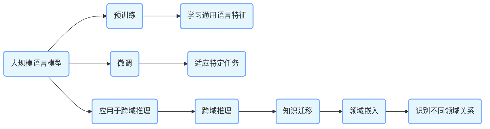

# 大规模语言模型的跨域推理能力研究

> 关键词：大规模语言模型、跨域推理能力、知识迁移、推理算法、应用场景

> 摘要：本文聚焦于大规模语言模型的跨域推理能力研究。首先介绍了研究的背景、目的、预期读者等信息。接着阐述了大规模语言模型及跨域推理的核心概念与联系，给出了相应的原理和架构示意图及流程图。详细讲解了核心算法原理，并通过Python代码进行说明，同时给出了相关的数学模型和公式。通过项目实战，展示了如何实现跨域推理并对代码进行解读。分析了其实际应用场景，推荐了学习、开发相关的工具和资源，包括书籍、在线课程、开发工具、框架和论文等。最后总结了未来发展趋势与挑战，还提供了常见问题解答和扩展阅读参考资料，旨在为深入理解和提升大规模语言模型的跨域推理能力提供全面的指导。

## 1. 背景介绍 
### 1.1 目的和范围
随着人工智能技术的飞速发展，大规模语言模型如GPT - 3、BERT等取得了显著的成果。然而，目前这些模型在单一领域内表现出色，但在跨领域的推理能力方面仍存在不足。本研究的目的在于深入探究大规模语言模型的跨域推理能力，分析其原理、算法和应用，旨在提高模型在不同领域之间进行知识迁移和推理的准确性和效率。研究范围涵盖了大规模语言模型的基本概念、跨域推理的核心算法、实际应用场景以及相关的工具和资源等方面。

### 1.2 预期读者
本文的预期读者包括人工智能领域的研究人员、开发者、学生以及对大规模语言模型和跨域推理感兴趣的技术爱好者。对于研究人员，本文可以为他们的学术研究提供理论基础和研究思路；对于开发者，有助于他们在实际项目中应用和优化大规模语言模型的跨域推理能力；对于学生，能够帮助他们深入理解相关的技术原理和应用场景；对于技术爱好者，则可以拓宽他们的技术视野。

### 1.3 文档结构概述
本文将按照以下结构进行阐述：首先介绍核心概念与联系，包括大规模语言模型和跨域推理的原理和架构；接着讲解核心算法原理和具体操作步骤，并给出Python代码示例；然后介绍相关的数学模型和公式，并举例说明；通过项目实战展示代码的实际应用和详细解释；分析大规模语言模型跨域推理能力的实际应用场景；推荐学习和开发所需的工具和资源；总结未来发展趋势与挑战；提供常见问题解答和扩展阅读参考资料。

### 1.4 术语表
#### 1.4.1 核心术语定义
- **大规模语言模型**：指具有大量参数和强大语言处理能力的深度学习模型，通常在大规模文本数据上进行预训练，能够完成多种自然语言处理任务，如文本生成、问答系统等。
- **跨域推理**：模型在不同领域之间进行知识迁移和逻辑推理的能力，即利用在一个领域学到的知识来解决另一个领域的问题。
- **知识迁移**：将在一个领域中学习到的知识、技能或模式应用到另一个不同但相关的领域中的过程。

#### 1.4.2 相关概念解释
- **预训练**：在大规模无监督数据上对模型进行训练，以学习通用的语言特征和模式。
- **微调**：在预训练模型的基础上，使用特定领域的有监督数据对模型进行进一步训练，以适应特定任务。
- **领域嵌入**：将不同领域的信息表示为低维向量，以便模型能够更好地理解和处理不同领域的知识。

#### 1.4.3 缩略词列表
- **GPT**：Generative Pretrained Transformer，生成式预训练变换器。
- **BERT**：Bidirectional Encoder Representations from Transformers，基于变换器的双向编码器表示。
- **NLP**：Natural Language Processing，自然语言处理。

## 2. 核心概念与联系 

### 大规模语言模型原理
大规模语言模型通常基于深度学习架构，如Transformer。Transformer由编码器和解码器组成，其核心是自注意力机制（Self - Attention）。自注意力机制允许模型在处理序列中的每个元素时，考虑序列中其他元素的信息，从而捕捉长距离依赖关系。

大规模语言模型的训练过程通常分为两个阶段：预训练和微调。在预训练阶段，模型在大规模无监督文本数据上进行训练，学习语言的通用特征和模式。在微调阶段，使用特定领域的有监督数据对预训练模型进行进一步训练，使其适应特定的任务。

### 跨域推理原理
跨域推理的核心在于知识迁移。模型需要将在一个领域学到的知识和推理模式应用到另一个领域。为了实现这一点，通常需要对不同领域的信息进行编码和表示，以便模型能够识别和利用这些信息。领域嵌入是一种常用的方法，它将不同领域的信息表示为低维向量，模型可以通过学习这些向量之间的关系来实现跨域推理。

### 核心概念架构示意图


### 核心概念联系说明
大规模语言模型是跨域推理的基础，其预训练和微调过程为模型提供了强大的语言处理能力和适应特定任务的能力。跨域推理则是大规模语言模型的高级应用，通过知识迁移和领域嵌入等技术，使模型能够在不同领域之间进行有效的推理。两者相互关联，共同推动了自然语言处理技术的发展。

## 3. 核心算法原理 & 具体操作步骤 

### 自注意力机制原理
自注意力机制是大规模语言模型的核心算法之一。给定输入序列 $X = [x_1, x_2, \cdots, x_n]$，其中 $x_i$ 是序列中的第 $i$ 个元素。首先，通过线性变换将输入序列映射到三个不同的空间：查询（Query）、键（Key）和值（Value）。

$$Q = XW_Q$$
$$K = XW_K$$
$$V = XW_V$$

其中 $W_Q$、$W_K$ 和 $W_V$ 是可学习的权重矩阵。

然后，计算查询和键之间的相似度得分：

$$\text{Attention}(Q, K, V) = \text{softmax}\left(\frac{QK^T}{\sqrt{d_k}}\right)V$$

其中 $d_k$ 是键向量的维度，$\text{softmax}$ 函数用于将得分归一化到概率分布。

### Python代码实现自注意力机制
```python
import torch
import torch.nn as nn

class SelfAttention(nn.Module):
    def __init__(self, input_dim, d_k):
        super(SelfAttention, self).__init__()
        self.W_q = nn.Linear(input_dim, d_k)
        self.W_k = nn.Linear(input_dim, d_k)
        self.W_v = nn.Linear(input_dim, d_k)
        self.sqrt_d_k = torch.sqrt(torch.tensor(d_k, dtype=torch.float32))

    def forward(self, x):
        Q = self.W_q(x)
        K = self.W_k(x)
        V = self.W_v(x)
        scores = torch.matmul(Q, K.transpose(-2, -1)) / self.sqrt_d_k
        attention_weights = torch.softmax(scores, dim=-1)
        output = torch.matmul(attention_weights, V)
        return output
```

### 跨域推理的具体操作步骤
1. **数据预处理**：收集不同领域的文本数据，并进行清洗、分词等预处理操作。
2. **领域嵌入**：使用预训练的词向量模型或自定义的嵌入层将不同领域的文本数据转换为向量表示。
3. **模型训练**：使用自注意力机制等核心算法构建大规模语言模型，并在预训练数据上进行训练。
4. **微调**：使用特定领域的有监督数据对预训练模型进行微调，使其适应跨域推理任务。
5. **推理阶段**：输入跨领域的问题，模型利用学到的知识和推理模式进行推理，并输出结果。

## 4. 数学模型和公式 & 详细讲解 & 举例说明 

### 损失函数
在大规模语言模型的训练过程中，通常使用交叉熵损失函数来衡量模型的预测结果与真实标签之间的差异。对于一个分类任务，交叉熵损失函数的定义如下：

$$L = -\sum_{i=1}^{N} y_i \log(p_i)$$

其中 $N$ 是类别数，$y_i$ 是真实标签的第 $i$ 个元素（通常是一个one - hot向量），$p_i$ 是模型预测的第 $i$ 个类别的概率。

### 梯度下降优化算法
为了最小化损失函数，通常使用梯度下降优化算法，如随机梯度下降（SGD）或自适应优化算法（如Adam）。梯度下降算法的基本思想是沿着损失函数的负梯度方向更新模型的参数。

对于参数 $\theta$，更新公式如下：

$$\theta_{t+1} = \theta_t - \alpha \nabla L(\theta_t)$$

其中 $\alpha$ 是学习率，$\nabla L(\theta_t)$ 是损失函数在参数 $\theta_t$ 处的梯度。

### 举例说明
假设我们有一个二分类任务，模型的预测概率为 $p = [0.2, 0.8]$，真实标签为 $y = [0, 1]$。则交叉熵损失为：

$$L = -(0 \times \log(0.2)+ 1\times\log(0.8))=-\log(0.8)\approx 0.223$$

假设模型的参数 $\theta$ 只有一个值，初始值为 $\theta_0 = 1$，学习率 $\alpha = 0.1$，损失函数 $L(\theta)=\theta^2$。则损失函数的梯度为 $\nabla L(\theta) = 2\theta$。在第一次迭代中，$\theta_1=\theta_0-\alpha\nabla L(\theta_0)=1 - 0.1\times2\times1 = 0.8$。

## 5. 项目实战：代码实际案例和详细解释说明 

### 5.1  开发环境搭建
- **操作系统**：推荐使用Linux系统，如Ubuntu 18.04及以上版本。
- **Python版本**：Python 3.7及以上版本。
- **深度学习框架**：使用PyTorch深度学习框架，安装命令如下：
```bash
pip install torch torchvision
```
- **其他依赖库**：安装`transformers`库用于处理大规模语言模型，安装命令如下：
```bash
pip install transformers
```

### 5.2  源代码详细实现和代码解读
以下是一个简单的跨域推理项目示例，使用`transformers`库中的预训练模型进行文本分类任务。

```python
from transformers import AutoTokenizer, AutoModelForSequenceClassification
import torch

# 加载预训练的模型和分词器
model_name = "bert-base-uncased"
tokenizer = AutoTokenizer.from_pretrained(model_name)
model = AutoModelForSequenceClassification.from_pretrained(model_name, num_labels=2)

# 定义输入文本
text1 = "This is a positive sentence from domain A."
text2 = "This is a negative sentence from domain B."

# 对输入文本进行分词
inputs1 = tokenizer(text1, return_tensors="pt")
inputs2 = tokenizer(text2, return_tensors="pt")

# 进行推理
with torch.no_grad():
    outputs1 = model(**inputs1)
    outputs2 = model(**inputs2)

# 获取预测结果
logits1 = outputs1.logits
logits2 = outputs2.logits
predictions1 = torch.argmax(logits1, dim=1).item()
predictions2 = torch.argmax(logits2, dim=1).item()

print(f"Prediction for text1: {predictions1}")
print(f"Prediction for text2: {predictions2}")
```

### 代码解读与分析
1. **加载预训练模型和分词器**：使用`AutoTokenizer`和`AutoModelForSequenceClassification`从Hugging Face的模型库中加载预训练的BERT模型和对应的分词器。`num_labels=2`表示这是一个二分类任务。
2. **定义输入文本**：定义了两个来自不同领域的文本。
3. **分词处理**：使用分词器将输入文本转换为模型可以接受的输入格式。
4. **推理过程**：使用`torch.no_grad()`上下文管理器禁用梯度计算，以提高推理速度。调用模型的前向传播方法得到输出。
5. **获取预测结果**：从模型的输出中获取logits，使用`torch.argmax`函数找到概率最大的类别作为预测结果。

## 6. 实际应用场景 
### 智能客服
在智能客服系统中，大规模语言模型的跨域推理能力可以帮助客服机器人处理来自不同领域的问题，如产品咨询、技术支持、售后服务等。机器人可以利用在不同领域学到的知识进行推理，为用户提供准确的答案。

### 医疗诊断辅助
在医疗领域，跨域推理能力可以帮助医生结合不同科室的知识进行诊断。例如，当患者同时出现多种症状时，模型可以综合内科、外科、皮肤科等多个领域的知识，提供更全面的诊断建议。

### 金融风险评估
在金融领域，跨域推理可以帮助评估不同行业的企业风险。模型可以结合宏观经济、行业动态、企业财务等多个领域的信息，进行综合分析和推理，为金融机构提供更准确的风险评估报告。

### 教育领域
在教育领域，跨域推理能力可以用于智能辅导系统。系统可以根据学生在不同学科的学习情况，提供个性化的学习建议和辅导，帮助学生更好地理解和掌握知识。

## 7. 工具和资源推荐
### 7.1 学习资源推荐
#### 7.1.1 书籍推荐
- 《深度学习》（Deep Learning）：由Ian Goodfellow、Yoshua Bengio和Aaron Courville所著，是深度学习领域的经典教材，涵盖了神经网络、优化算法、深度学习应用等方面的内容。
- 《自然语言处理入门》：详细介绍了自然语言处理的基本概念、算法和应用，适合初学者入门。
- 《Python自然语言处理》（Natural Language Processing with Python）：通过Python代码示例，介绍了自然语言处理的各种技术和工具。

#### 7.1.2 在线课程
- Coursera上的“深度学习专项课程”（Deep Learning Specialization）：由Andrew Ng教授授课，包括神经网络基础、卷积神经网络、循环神经网络等多个课程。
- edX上的“自然语言处理基础”（Foundations of Natural Language Processing）：介绍了自然语言处理的基本概念和算法。
- 哔哩哔哩上有许多关于深度学习和自然语言处理的免费教程，适合初学者学习。

#### 7.1.3 技术博客和网站
- Hugging Face博客：提供了关于大规模语言模型的最新研究成果和应用案例。
- Medium上的Towards Data Science：有许多关于人工智能和机器学习的技术文章。
- 机器之心：专注于人工智能领域的资讯和技术解读。

### 7.2 开发工具框架推荐
#### 7.2.1 IDE和编辑器
- PyCharm：是一款专业的Python集成开发环境，提供了代码编辑、调试、版本控制等功能。
- Jupyter Notebook：适合进行交互式的代码开发和数据分析，方便展示代码和结果。
- Visual Studio Code：轻量级的代码编辑器，支持多种编程语言和插件扩展。

#### 7.2.2 调试和性能分析工具
- TensorBoard：是TensorFlow的可视化工具，可以用于查看模型的训练过程、损失曲线、参数分布等信息。
- PyTorch Profiler：可以帮助分析PyTorch模型的性能瓶颈，如GPU利用率、内存使用情况等。
- cProfile：Python内置的性能分析工具，可以分析代码的运行时间和函数调用次数。

#### 7.2.3 相关框架和库
- Transformers：Hugging Face开发的用于处理大规模语言模型的库，提供了丰富的预训练模型和工具。
- NLTK：自然语言工具包，提供了各种自然语言处理的算法和数据集。
- SpaCy：高效的自然语言处理库，支持多种语言和任务。

### 7.3 相关论文著作推荐
#### 7.3.1 经典论文
- “Attention Is All You Need”：介绍了Transformer架构，是大规模语言模型的基础。
- “BERT: Pre-training of Deep Bidirectional Transformers for Language Understanding”：提出了BERT模型，开创了预训练 - 微调的语言模型训练范式。
- “Generative Pretrained Transformer 3 (GPT - 3): Language Models are Few - Shot Learners”：介绍了GPT - 3模型，展示了大规模语言模型在少样本学习方面的强大能力。

#### 7.3.2 最新研究成果
- 关注顶级学术会议如ACL（Association for Computational Linguistics）、EMNLP（Conference on Empirical Methods in Natural Language Processing）等的最新论文，了解大规模语言模型跨域推理的最新研究进展。
- 各大高校和研究机构的研究报告，如OpenAI、Google AI等的研究成果。

#### 7.3.3 应用案例分析
- 一些企业的技术博客会分享大规模语言模型在实际应用中的案例和经验，如字节跳动、百度等公司的技术文章。
- 相关的行业报告和白皮书，分析了大规模语言模型在不同领域的应用现状和发展趋势。

## 8. 总结：未来发展趋势与挑战
### 未来发展趋势
- **更强的跨域推理能力**：未来的大规模语言模型将不断提高跨域推理的准确性和效率，能够更好地处理复杂的跨领域问题。
- **多模态融合**：将语言信息与图像、音频等多模态信息进行融合，实现更全面的跨域推理。例如，在医疗诊断中结合病历文本和医学影像进行综合分析。
- **个性化推理**：根据用户的偏好、历史记录等信息，提供个性化的跨域推理服务。例如，智能客服可以根据用户的购买历史和使用习惯提供更精准的建议。

### 挑战
- **数据隐私和安全**：大规模语言模型需要大量的数据进行训练，如何保护数据的隐私和安全是一个重要的挑战。
- **可解释性**：目前大规模语言模型的推理过程往往是黑盒的，难以解释模型的决策依据。提高模型的可解释性是未来研究的一个重要方向。
- **计算资源需求**：训练和部署大规模语言模型需要大量的计算资源，如何降低计算成本和提高计算效率是一个亟待解决的问题。

## 9. 附录：常见问题与解答
### 问题1：大规模语言模型的跨域推理能力受哪些因素影响？
答：受训练数据的多样性、模型架构的设计、领域嵌入的质量、预训练和微调的方法等因素影响。训练数据涵盖的领域越广泛，模型的跨域推理能力可能越强；合适的模型架构和高质量的领域嵌入能够更好地捕捉不同领域之间的关系；有效的预训练和微调方法可以提高模型在不同领域的适应性。

### 问题2：如何评估大规模语言模型的跨域推理能力？
答：可以使用一些指标来评估，如准确率、召回率、F1值等，通过在跨领域的测试数据集上进行测试。还可以进行人工评估，让专业人员对模型的推理结果进行评价，考察结果的合理性和实用性。

### 问题3：跨域推理和单领域推理有什么区别？
答：单领域推理是在一个特定领域内进行知识和逻辑的推理，模型只需要关注该领域的信息和规则。而跨域推理需要模型在不同领域之间进行知识迁移，综合考虑多个领域的信息，处理更复杂的问题，对模型的泛化能力和知识整合能力要求更高。

## 10. 扩展阅读 & 参考资料
- 《人工智能：现代方法》（Artificial Intelligence: A Modern Approach）
- 《神经网络与深度学习》（Neural Networks and Deep Learning）
- ACL、EMNLP、ICML（International Conference on Machine Learning）等学术会议的论文集
- Hugging Face官方文档和示例代码
- 各大科技公司的开源项目和技术博客

作者：AI天才研究院/AI Genius Institute & 禅与计算机程序设计艺术 /Zen And The Art of Computer Programming