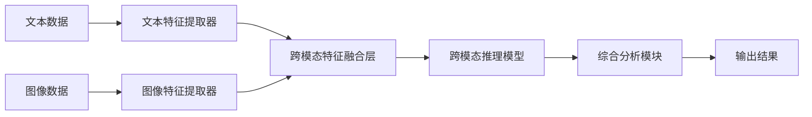

# 大规模语言模型的跨模态推理与综合分析能力评估

> 关键词：大规模语言模型、跨模态推理、综合分析能力评估、多模态数据、评估指标

> 摘要：本文聚焦于大规模语言模型的跨模态推理与综合分析能力评估。随着人工智能技术的发展，大规模语言模型在处理多模态数据方面的需求日益增长，其跨模态推理和综合分析能力变得至关重要。文章首先介绍了相关背景，包括目的、预期读者、文档结构和术语表。接着阐述了核心概念与联系，给出了原理和架构的示意图及流程图。详细讲解了核心算法原理，并用 Python 代码进行说明，同时介绍了相关的数学模型和公式。通过项目实战展示了代码的实际案例和解读。分析了大规模语言模型跨模态推理与综合分析能力的实际应用场景，推荐了学习资源、开发工具框架和相关论文著作。最后总结了未来发展趋势与挑战，提供了常见问题解答和扩展阅读参考资料。

## 1. 背景介绍 
### 1.1 目的和范围
近年来，大规模语言模型如 GPT 系列、BERT 等取得了显著的进展，在自然语言处理领域展现出强大的能力。然而，现实世界中的信息是多模态的，包括文本、图像、音频、视频等。为了使语言模型能够更好地理解和处理现实世界的复杂信息，跨模态推理和综合分析能力的研究变得尤为重要。

本文章的目的在于深入探讨大规模语言模型的跨模态推理与综合分析能力评估的方法和技术。我们将研究如何设计合理的评估指标，如何构建评估数据集，以及如何利用这些指标和数据集对语言模型的跨模态能力进行客观、准确的评估。文章的范围涵盖了跨模态推理的基本概念、相关算法原理、数学模型，以及实际应用案例和评估工具等方面。

### 1.2 预期读者
本文的预期读者包括人工智能领域的研究人员、工程师、学生，以及对大规模语言模型和跨模态技术感兴趣的技术爱好者。对于研究人员，本文可以提供跨模态推理与综合分析能力评估的最新研究进展和方法；对于工程师，文章中的代码实现和工具推荐可以帮助他们在实际项目中更好地评估和应用语言模型；对于学生，本文可以作为学习跨模态技术和评估方法的参考资料；对于技术爱好者，文章可以帮助他们了解大规模语言模型在跨模态领域的发展现状和挑战。

### 1.3 文档结构概述
本文将按照以下结构进行组织：
- 核心概念与联系：介绍跨模态推理和综合分析能力的基本概念，以及它们之间的联系，给出原理和架构的示意图及流程图。
- 核心算法原理 & 具体操作步骤：详细讲解用于跨模态推理和评估的核心算法原理，并用 Python 代码进行说明。
- 数学模型和公式 & 详细讲解 & 举例说明：介绍相关的数学模型和公式，通过具体例子进行详细讲解。
- 项目实战：代码实际案例和详细解释说明：通过一个实际项目，展示如何使用代码进行跨模态推理和能力评估，并对代码进行详细解读。
- 实际应用场景：分析大规模语言模型跨模态推理与综合分析能力在不同领域的实际应用场景。
- 工具和资源推荐：推荐学习资源、开发工具框架和相关论文著作。
- 总结：未来发展趋势与挑战：总结大规模语言模型跨模态推理与综合分析能力评估的未来发展趋势和面临的挑战。
- 附录：常见问题与解答：提供常见问题的解答，帮助读者更好地理解文章内容。
- 扩展阅读 & 参考资料：提供扩展阅读的建议和参考资料，方便读者进一步深入研究。

### 1.4 术语表
#### 1.4.1 核心术语定义
- **大规模语言模型（Large Language Model）**：指具有大量参数和强大语言处理能力的深度学习模型，如 GPT - 3、BERT 等。
- **跨模态推理（Cross - Modal Reasoning）**：指模型能够在不同模态的数据（如文本和图像）之间进行信息融合和推理的能力。
- **综合分析能力（Comprehensive Analysis Ability）**：指模型能够对多模态数据进行全面、深入分析，并得出有价值结论的能力。
- **多模态数据（Multi - Modal Data）**：指包含多种不同模态信息的数据，如文本、图像、音频、视频等。
- **评估指标（Evaluation Metrics）**：用于衡量模型跨模态推理和综合分析能力的量化指标。

#### 1.4.2 相关概念解释
- **模态（Modality）**：在信息处理中，模态是指信息的表现形式，如视觉模态（图像、视频）、听觉模态（音频）、语言模态（文本）等。
- **信息融合（Information Fusion）**：将来自不同模态的数据进行整合，以获取更全面、准确的信息的过程。
- **特征提取（Feature Extraction）**：从原始数据中提取出能够代表数据特征的向量或矩阵的过程，是跨模态处理的重要步骤。

#### 1.4.3 缩略词列表
- **NLP**：自然语言处理（Natural Language Processing）
- **CV**：计算机视觉（Computer Vision）
- **CNN**：卷积神经网络（Convolutional Neural Network）
- **RNN**：循环神经网络（Recurrent Neural Network）
- **Transformer**：一种基于注意力机制的深度学习模型架构

## 2. 核心概念与联系 

### 2.1 跨模态推理的概念
跨模态推理是指模型能够在不同模态的数据之间进行信息交互和推理的能力。例如，给定一张图像和一段文本描述，模型需要能够理解图像和文本之间的关联，并根据图像内容对文本进行推理，或者根据文本描述对图像进行分析。跨模态推理的关键在于如何将不同模态的数据进行有效的融合和表示，以便模型能够在这些数据之间进行推理。

### 2.2 综合分析能力的概念
综合分析能力是指模型能够对多模态数据进行全面、深入的分析，并得出有价值结论的能力。这不仅要求模型能够理解不同模态数据的内容，还需要能够将这些数据进行整合和关联，从多个角度对数据进行分析。例如，在医疗领域，模型需要结合患者的病历文本、医学影像等多模态数据，对患者的病情进行准确的诊断和分析。

### 2.3 核心概念的联系
跨模态推理是综合分析能力的基础，只有具备了跨模态推理的能力，模型才能够在不同模态的数据之间进行信息交互，从而实现对多模态数据的综合分析。而综合分析能力则是跨模态推理的进一步拓展和深化，它要求模型不仅能够进行简单的推理，还需要能够对多模态数据进行全面、系统的分析，以得出更有价值的结论。

### 2.4 核心概念原理和架构的文本示意图
```plaintext
+----------------+       +----------------+
|    文本数据    |       |    图像数据    |
+----------------+       +----------------+
       |                        |
       v                        v
+----------------+       +----------------+
| 文本特征提取器 |       | 图像特征提取器 |
+----------------+       +----------------+
       |                        |
       v                        v
+------------------------------+
|        跨模态特征融合层      |
+------------------------------+
       |
       v
+----------------+
| 跨模态推理模型 |
+----------------+
       |
       v
+----------------+
| 综合分析模块   |
+----------------+
       |
       v
+----------------+
|  输出结果      |
+----------------+
```

### 2.5 Mermaid 流程图


## 3. 核心算法原理 & 具体操作步骤 

### 3.1 文本特征提取算法
在跨模态推理中，首先需要从文本数据中提取特征。常用的文本特征提取算法有 Word2Vec、GloVe 和 BERT 等。这里我们以 BERT 为例进行介绍。

BERT（Bidirectional Encoder Representations from Transformers）是一种基于 Transformer 架构的预训练语言模型，它能够学习到文本的上下文信息，从而得到高质量的文本特征表示。以下是使用 Python 和 Hugging Face 的 Transformers 库进行文本特征提取的代码示例：

```python
from transformers import BertTokenizer, BertModel
import torch

# 加载预训练的 BERT 模型和分词器
tokenizer = BertTokenizer.from_pretrained('bert-base-uncased')
model = BertModel.from_pretrained('bert-base-uncased')

# 输入文本
text = "This is an example sentence."

# 对文本进行分词
inputs = tokenizer(text, return_tensors='pt')

# 提取文本特征
with torch.no_grad():
    outputs = model(**inputs)

# 获取最后一层的隐藏状态作为文本特征
text_features = outputs.last_hidden_state.mean(dim=1)

print(text_features.shape)
```

### 3.2 图像特征提取算法
对于图像数据，常用的特征提取算法有卷积神经网络（CNN），如 ResNet、VGG 等。以下是使用 PyTorch 加载预训练的 ResNet 模型进行图像特征提取的代码示例：

```python
import torch
import torchvision.models as models
import torchvision.transforms as transforms
from PIL import Image

# 加载预训练的 ResNet 模型
resnet = models.resnet18(pretrained=True)
resnet.eval()

# 定义图像预处理步骤
preprocess = transforms.Compose([
    transforms.Resize(256),
    transforms.CenterCrop(224),
    transforms.ToTensor(),
    transforms.Normalize(mean=[0.485, 0.456, 0.406], std=[0.229, 0.224, 0.225])
])

# 加载图像
image = Image.open('example.jpg')

# 对图像进行预处理
input_tensor = preprocess(image)
input_batch = input_tensor.unsqueeze(0)

# 提取图像特征
with torch.no_grad():
    features = resnet(input_batch)

print(features.shape)
```

### 3.3 跨模态特征融合算法
在得到文本和图像的特征表示后，需要将它们进行融合。常用的融合方法有拼接（Concatenation）、逐元素相乘（Element - wise Multiplication）等。以下是使用拼接方法进行特征融合的代码示例：

```python
import torch

# 假设 text_features 和 image_features 分别是文本和图像的特征
text_features = torch.randn(1, 768)
image_features = torch.randn(1, 512)

# 拼接特征
fused_features = torch.cat((text_features, image_features), dim=1)

print(fused_features.shape)
```

### 3.4 跨模态推理模型
跨模态推理模型可以使用全连接神经网络（FCN）、循环神经网络（RNN）或 Transformer 等。以下是一个简单的全连接神经网络作为跨模态推理模型的代码示例：

```python
import torch
import torch.nn as nn

class CrossModalReasoningModel(nn.Module):
    def __init__(self, input_size, hidden_size, output_size):
        super(CrossModalReasoningModel, self).__init__()
        self.fc1 = nn.Linear(input_size, hidden_size)
        self.relu = nn.ReLU()
        self.fc2 = nn.Linear(hidden_size, output_size)

    def forward(self, x):
        out = self.fc1(x)
        out = self.relu(out)
        out = self.fc2(out)
        return out

# 定义模型参数
input_size = 768 + 512  # 拼接后的特征维度
hidden_size = 256
output_size = 10

# 初始化模型
model = CrossModalReasoningModel(input_size, hidden_size, output_size)

# 随机输入数据
input_data = torch.randn(1, input_size)

# 前向传播
output = model(input_data)

print(output.shape)
```

## 4. 数学模型和公式 & 详细讲解 & 举例说明 

### 4.1 文本特征提取的数学模型
以 BERT 为例，BERT 模型基于 Transformer 架构，其核心是多头注意力机制（Multi - Head Attention）。多头注意力机制的数学公式如下：

$$
\text{MultiHead}(Q, K, V) = \text{Concat}(\text{head}_1, \cdots, \text{head}_h)W^O
$$

其中，

$$
\text{head}_i = \text{Attention}(QW_i^Q, KW_i^K, VW_i^V)
$$

$$
\text{Attention}(Q, K, V) = \text{softmax}(\frac{QK^T}{\sqrt{d_k}})V
$$

这里，$Q$、$K$、$V$ 分别是查询（Query）、键（Key）和值（Value）矩阵，$W_i^Q$、$W_i^K$、$W_i^V$ 是可学习的权重矩阵，$d_k$ 是键的维度，$W^O$ 是输出的权重矩阵。

举例说明：假设输入的文本序列长度为 $n$，词嵌入维度为 $d$，则 $Q$、$K$、$V$ 的维度分别为 $n \times d$。通过多头注意力机制，模型可以学习到不同位置的词之间的关系，从而得到更丰富的文本特征表示。

### 4.2 图像特征提取的数学模型
以 ResNet 为例，ResNet 是一种深度卷积神经网络，其核心是残差块（Residual Block）。残差块的数学公式如下：

$$
y = F(x, \{W_i\}) + x
$$

其中，$x$ 是输入特征图，$F(x, \{W_i\})$ 是残差函数，由卷积层、批量归一化层和激活函数组成。

举例说明：假设输入的图像大小为 $H \times W \times C$，经过一个残差块后，输出的特征图大小仍然为 $H \times W \times C$，但特征的表示能力得到了增强。

### 4.3 跨模态特征融合的数学模型
以拼接方法为例，假设文本特征向量为 $\mathbf{x}_t \in \mathbb{R}^{d_t}$，图像特征向量为 $\mathbf{x}_i \in \mathbb{R}^{d_i}$，则融合后的特征向量为：

$$
\mathbf{x}_f = [\mathbf{x}_t; \mathbf{x}_i] \in \mathbb{R}^{d_t + d_i}
$$

举例说明：如果文本特征维度 $d_t = 768$，图像特征维度 $d_i = 512$，则融合后的特征维度为 $768 + 512 = 1280$。

### 4.4 跨模态推理模型的数学模型
以全连接神经网络为例，假设输入特征向量为 $\mathbf{x} \in \mathbb{R}^{d_{in}}$，隐藏层神经元数量为 $d_{hidden}$，输出层神经元数量为 $d_{out}$。则第一层全连接层的输出为：

$$
\mathbf{h}_1 = \text{ReLU}(W_1\mathbf{x} + b_1)
$$

其中，$W_1 \in \mathbb{R}^{d_{hidden} \times d_{in}}$ 是权重矩阵，$b_1 \in \mathbb{R}^{d_{hidden}}$ 是偏置向量，$\text{ReLU}$ 是激活函数。

第二层全连接层的输出为：

$$
\mathbf{y} = W_2\mathbf{h}_1 + b_2
$$

其中，$W_2 \in \mathbb{R}^{d_{out} \times d_{hidden}}$ 是权重矩阵，$b_2 \in \mathbb{R}^{d_{out}}$ 是偏置向量。

举例说明：如果输入特征维度 $d_{in} = 1280$，隐藏层神经元数量 $d_{hidden} = 256$，输出层神经元数量 $d_{out} = 10$，则 $W_1$ 的维度为 $256 \times 1280$，$b_1$ 的维度为 $256$，$W_2$ 的维度为 $10 \times 256$，$b_2$ 的维度为 $10$。

## 5. 项目实战：代码实际案例和详细解释说明 

### 5.1  开发环境搭建
#### 5.1.1 安装 Python
首先，确保你已经安装了 Python 3.6 或更高版本。你可以从 Python 官方网站（https://www.python.org/downloads/）下载并安装 Python。

#### 5.1.2 创建虚拟环境
为了避免不同项目之间的依赖冲突，建议使用虚拟环境。可以使用 `venv` 或 `conda` 来创建虚拟环境。以下是使用 `venv` 创建虚拟环境的示例：

```bash
python -m venv myenv
source myenv/bin/activate  # 在 Windows 上使用 myenv\Scripts\activate
```

#### 5.1.3 安装依赖库
在虚拟环境中安装所需的依赖库，包括 `torch`、`torchvision`、`transformers` 等。可以使用 `pip` 进行安装：

```bash
pip install torch torchvision transformers
```

### 5.2  源代码详细实现和代码解读
以下是一个完整的项目示例，用于实现跨模态推理和评估。

```python
import torch
import torch.nn as nn
import torch.optim as optim
from transformers import BertTokenizer, BertModel
import torchvision.models as models
import torchvision.transforms as transforms
from PIL import Image
import numpy as np

# 文本特征提取类
class TextFeatureExtractor:
    def __init__(self):
        self.tokenizer = BertTokenizer.from_pretrained('bert-base-uncased')
        self.model = BertModel.from_pretrained('bert-base-uncased')

    def extract_features(self, text):
        inputs = self.tokenizer(text, return_tensors='pt')
        with torch.no_grad():
            outputs = self.model(**inputs)
        text_features = outputs.last_hidden_state.mean(dim=1)
        return text_features

# 图像特征提取类
class ImageFeatureExtractor:
    def __init__(self):
        self.resnet = models.resnet18(pretrained=True)
        self.resnet.eval()
        self.preprocess = transforms.Compose([
            transforms.Resize(256),
            transforms.CenterCrop(224),
            transforms.ToTensor(),
            transforms.Normalize(mean=[0.485, 0.456, 0.406], std=[0.229, 0.224, 0.225])
        ])

    def extract_features(self, image_path):
        image = Image.open(image_path)
        input_tensor = self.preprocess(image)
        input_batch = input_tensor.unsqueeze(0)
        with torch.no_grad():
            features = self.resnet(input_batch)
        return features

# 跨模态推理模型类
class CrossModalReasoningModel(nn.Module):
    def __init__(self, input_size, hidden_size, output_size):
        super(CrossModalReasoningModel, self).__init__()
        self.fc1 = nn.Linear(input_size, hidden_size)
        self.relu = nn.ReLU()
        self.fc2 = nn.Linear(hidden_size, output_size)

    def forward(self, x):
        out = self.fc1(x)
        out = self.relu(out)
        out = self.fc2(out)
        return out

# 主函数
def main():
    # 初始化特征提取器
    text_extractor = TextFeatureExtractor()
    image_extractor = ImageFeatureExtractor()

    # 输入文本和图像
    text = "This is an example sentence."
    image_path = "example.jpg"

    # 提取文本和图像特征
    text_features = text_extractor.extract_features(text)
    image_features = image_extractor.extract_features(image_path)

    # 特征融合
    fused_features = torch.cat((text_features, image_features), dim=1)

    # 定义模型参数
    input_size = text_features.shape[1] + image_features.shape[1]
    hidden_size = 256
    output_size = 10

    # 初始化模型
    model = CrossModalReasoningModel(input_size, hidden_size, output_size)

    # 定义损失函数和优化器
    criterion = nn.CrossEntropyLoss()
    optimizer = optim.Adam(model.parameters(), lr=0.001)

    # 模拟训练过程
    for epoch in range(10):
        optimizer.zero_grad()
        outputs = model(fused_features)
        labels = torch.randint(0, output_size, (1,))
        loss = criterion(outputs, labels)
        loss.backward()
        optimizer.step()
        print(f'Epoch {epoch + 1}, Loss: {loss.item()}')

if __name__ == "__main__":
    main()
```

### 5.3  代码解读与分析
- **文本特征提取类 `TextFeatureExtractor`**：使用 BERT 模型提取文本特征。在初始化时，加载预训练的 BERT 模型和分词器。`extract_features` 方法接受一个文本字符串作为输入，对文本进行分词，然后通过 BERT 模型提取特征，最后取最后一层隐藏状态的均值作为文本特征。
- **图像特征提取类 `ImageFeatureExtractor`**：使用预训练的 ResNet 模型提取图像特征。在初始化时，加载 ResNet 模型并定义图像预处理步骤。`extract_features` 方法接受一个图像文件路径作为输入，读取图像并进行预处理，然后通过 ResNet 模型提取特征。
- **跨模态推理模型类 `CrossModalReasoningModel`**：定义了一个简单的全连接神经网络作为跨模态推理模型。包含两个全连接层和一个 ReLU 激活函数。
- **主函数 `main`**：初始化文本和图像特征提取器，提取文本和图像特征，将它们进行融合。定义跨模态推理模型、损失函数和优化器，模拟训练过程，输出每个 epoch 的损失值。

## 6. 实际应用场景 
### 6.1 智能医疗领域
在智能医疗领域，大规模语言模型的跨模态推理与综合分析能力可以发挥重要作用。例如，结合患者的病历文本、医学影像（如 X 光、CT 等）和基因数据等多模态信息，模型可以进行更准确的疾病诊断和治疗方案推荐。医生可以输入患者的症状描述和相关检查报告，模型通过分析文本信息和图像特征，给出可能的疾病诊断结果，并提供相应的治疗建议。

### 6.2 智能安防领域
在智能安防领域，跨模态推理可以用于监控视频和报警文本的综合分析。例如，监控摄像头捕捉到的视频画面和报警系统发出的文本信息可以被模型同时处理。模型可以根据视频中的人物行为、物体特征和文本描述的报警信息，判断是否存在安全威胁，并及时发出警报。同时，模型还可以对历史数据进行分析，预测可能出现的安全问题，提前采取防范措施。

### 6.3 智能教育领域
在智能教育领域，跨模态推理可以用于教学资源的整合和学生学习情况的评估。例如，将教材文本、教学视频和学生的作业答案等多模态数据进行综合分析，模型可以了解学生的学习进度和掌握情况，为学生提供个性化的学习建议。同时，模型还可以根据教学视频和文本内容，生成更生动、易懂的教学材料，提高教学效果。

### 6.4 智能交通领域
在智能交通领域，跨模态推理可以用于交通流量监测和交通事故预警。例如，结合交通摄像头拍摄的视频画面、交通传感器采集的数据和交通新闻文本等多模态信息，模型可以实时监测交通流量，预测拥堵情况，并提前发出预警。同时，在发生交通事故时，模型可以根据视频画面和相关文本信息，快速判断事故的严重程度和影响范围，为救援和交通疏导提供决策支持。

## 7. 工具和资源推荐
### 7.1 学习资源推荐
#### 7.1.1 书籍推荐
- 《深度学习》（Deep Learning）：由 Ian Goodfellow、Yoshua Bengio 和 Aaron Courville 撰写，是深度学习领域的经典教材，涵盖了深度学习的基本概念、算法和应用。
- 《自然语言处理入门》：帮助读者快速入门自然语言处理领域，了解常见的自然语言处理任务和算法。
- 《计算机视觉：算法与应用》：全面介绍了计算机视觉的基本原理、算法和应用，适合对计算机视觉感兴趣的读者。

#### 7.1.2 在线课程
- Coursera 上的“深度学习专项课程”（Deep Learning Specialization）：由 Andrew Ng 教授授课，包括深度学习的基础、卷积神经网络、循环神经网络等内容。
- edX 上的“自然语言处理基础”（Foundations of Natural Language Processing）：介绍了自然语言处理的基本概念、算法和工具。
- Udemy 上的“计算机视觉 A-Z：使用 OpenCV 和深度学习构建项目”（Computer Vision A-Z™: Build Modern Computer Vision Apps with Python）：通过实际项目学习计算机视觉的应用。

#### 7.1.3 技术博客和网站
- arXiv（https://arxiv.org/）：提供最新的学术论文预印本，涵盖了人工智能、机器学习、计算机视觉等多个领域。
- Medium（https://medium.com/）：有许多人工智能领域的技术博客和文章，作者包括研究人员、工程师和爱好者。
- Towards Data Science（https://towardsdatascience.com/）：专注于数据科学和人工智能领域的技术文章和教程。

### 7.2 开发工具框架推荐
#### 7.2.1 IDE和编辑器
- PyCharm：是一款专门为 Python 开发设计的集成开发环境（IDE），提供了丰富的代码编辑、调试和项目管理功能。
- Jupyter Notebook：是一个交互式的开发环境，适合进行数据探索、模型训练和实验验证。
- Visual Studio Code：是一款轻量级的代码编辑器，支持多种编程语言和插件扩展，可用于 Python 开发和跨模态项目的开发。

#### 7.2.2 调试和性能分析工具
- PyTorch Profiler：是 PyTorch 提供的性能分析工具，可以帮助开发者分析模型的训练和推理时间，找出性能瓶颈。
- TensorBoard：是 TensorFlow 提供的可视化工具，也可以与 PyTorch 结合使用，用于可视化模型的训练过程、损失曲线和性能指标等。
- VS Code Debugger：可以方便地对 Python 代码进行调试，设置断点、查看变量值等。

#### 7.2.3 相关框架和库
- PyTorch：是一个开源的深度学习框架，提供了丰富的神经网络层和优化算法，支持 GPU 加速，广泛应用于自然语言处理、计算机视觉等领域。
- Hugging Face Transformers：是一个用于自然语言处理的开源库，提供了多种预训练的语言模型，如 BERT、GPT 等，方便开发者进行文本特征提取和模型训练。
- OpenCV：是一个开源的计算机视觉库，提供了丰富的图像处理和计算机视觉算法，可用于图像特征提取、目标检测等任务。

### 7.3 相关论文著作推荐
#### 7.3.1 经典论文
- “Attention Is All You Need”：介绍了 Transformer 架构，是自然语言处理领域的重要突破。
- “Deep Residual Learning for Image Recognition”：提出了 ResNet 模型，解决了深度神经网络训练中的梯度消失问题。
- “BERT: Pre - training of Deep Bidirectional Transformers for Language Understanding”：介绍了 BERT 模型，在自然语言处理任务中取得了优异的成绩。

#### 7.3.2 最新研究成果
- 关注 arXiv 上关于跨模态推理和多模态学习的最新论文，了解该领域的最新研究进展。
- 参加人工智能领域的顶级学术会议，如 NeurIPS、ICML、CVPR 等，获取最新的研究成果和趋势。

#### 7.3.3 应用案例分析
- 研究一些跨模态推理在实际应用中的案例分析论文，了解如何将跨模态技术应用到具体的领域中，以及遇到的问题和解决方案。

## 8. 总结：未来发展趋势与挑战
### 8.1 未来发展趋势
- **更强大的多模态融合能力**：未来的大规模语言模型将具备更强大的多模态融合能力，能够更好地处理文本、图像、音频、视频等多种模态的数据，实现更高效的信息交互和推理。
- **跨领域应用拓展**：跨模态推理技术将在更多领域得到应用，如金融、农业、文化娱乐等，为这些领域带来新的发展机遇。
- **个性化和智能化服务**：基于跨模态推理和综合分析能力，模型可以为用户提供更个性化、智能化的服务，如智能客服、智能推荐等。
- **与硬件的深度融合**：随着硬件技术的发展，大规模语言模型将与硬件进行更深度的融合，实现更高效的计算和推理，提高系统的性能和响应速度。

### 8.2 挑战
- **数据获取和标注困难**：跨模态数据的获取和标注是一个挑战，不同模态的数据来源不同，格式和特点也不同，需要花费大量的时间和精力进行数据收集和标注。
- **计算资源需求大**：大规模语言模型的训练和推理需要大量的计算资源，包括 GPU 等硬件设备，这增加了研究和应用的成本。
- **模型解释性和可解释性差**：目前的跨模态推理模型大多是黑盒模型，缺乏良好的解释性和可解释性，这在一些对安全性和可靠性要求较高的领域（如医疗、金融）应用时会受到限制。
- **伦理和法律问题**：跨模态推理技术的应用可能会带来一些伦理和法律问题，如数据隐私保护、算法偏见等，需要制定相应的政策和法规来规范其发展。

## 9. 附录：常见问题与解答
### 9.1 跨模态推理和单模态推理有什么区别？
单模态推理是指模型仅基于一种模态的数据进行推理，如仅使用文本数据进行自然语言处理任务。而跨模态推理则是指模型能够在不同模态的数据之间进行信息交互和推理，结合多种模态的数据进行综合分析，以得到更准确、全面的结论。

### 9.2 如何评估大规模语言模型的跨模态推理能力？
可以从多个方面评估大规模语言模型的跨模态推理能力，如准确性、召回率、F1 值等指标。还可以设计一些特定的任务和数据集，如跨模态问答、图像文本匹配等，通过模型在这些任务上的表现来评估其跨模态推理能力。

### 9.3 跨模态推理模型的训练过程有哪些挑战？
跨模态推理模型的训练过程面临一些挑战，如不同模态数据的特征表示不一致，需要进行有效的特征融合；训练数据的获取和标注困难；模型的复杂度较高，训练时间和计算资源需求大等。

### 9.4 跨模态推理技术在实际应用中需要注意什么？
在实际应用中，需要注意数据的质量和安全性，确保不同模态的数据来源可靠、准确。同时，要考虑模型的解释性和可解释性，特别是在一些对安全性和可靠性要求较高的领域。此外，还需要遵守相关的伦理和法律规定，保护用户的隐私和权益。

## 10. 扩展阅读 & 参考资料
### 10.1 扩展阅读
- 《人工智能：现代方法》（Artificial Intelligence: A Modern Approach）：全面介绍了人工智能的基本概念、算法和应用，是人工智能领域的经典教材。
- 《多模态机器学习：综述与分类》（Multimodal Machine Learning: A Survey and Taxonomy）：对多模态机器学习进行了系统的综述和分类，适合深入学习跨模态推理和多模态学习的读者。
- 《深度学习中的注意力机制》（Attention Mechanisms in Deep Learning）：详细介绍了深度学习中的注意力机制，包括多头注意力机制、自注意力机制等，对理解跨模态推理中的注意力机制有很大帮助。

### 10.2 参考资料
- Hugging Face 官方文档（https://huggingface.co/docs/transformers/index）：提供了 Transformers 库的详细文档和使用教程。
- PyTorch 官方文档（https://pytorch.org/docs/stable/index.html）：提供了 PyTorch 框架的详细文档和示例代码。
- OpenCV 官方文档（https://docs.opencv.org/）：提供了 OpenCV 库的详细文档和使用教程。

作者：AI天才研究院/AI Genius Institute & 禅与计算机程序设计艺术 /Zen And The Art of Computer Programming