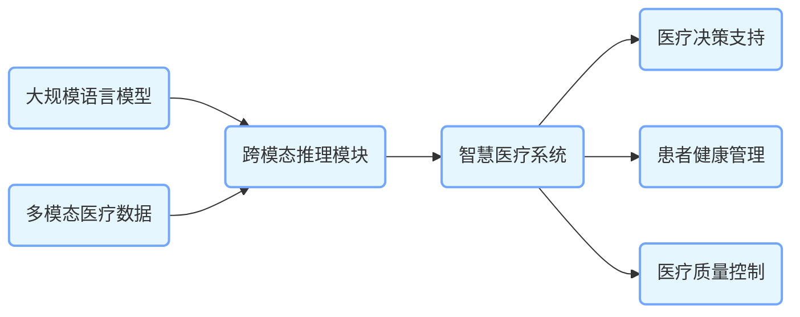

# 大规模语言模型的跨模态推理在智慧医疗系统中的创新应用

> 关键词：大规模语言模型、跨模态推理、智慧医疗系统、创新应用、医疗数据融合

> 摘要：本文聚焦于大规模语言模型的跨模态推理在智慧医疗系统中的创新应用。首先介绍了研究的背景、目的、预期读者等信息，接着阐述了核心概念与联系，包括跨模态推理和智慧医疗系统的原理及架构，并通过 Mermaid 流程图进行展示。详细讲解了核心算法原理，给出 Python 代码示例，同时分析了相关数学模型和公式。通过项目实战，展示了代码的实际案例和详细解读。探讨了在智慧医疗系统中的实际应用场景，推荐了相关的学习资源、开发工具框架以及论文著作。最后总结了未来发展趋势与挑战，解答了常见问题并提供扩展阅读和参考资料，旨在为推动大规模语言模型跨模态推理在智慧医疗领域的发展提供全面的技术指导和理论支持。

## 1. 背景介绍 
### 1.1 目的和范围
随着医疗数据的爆炸式增长，这些数据呈现出多模态的特点，包括文本、图像、视频、生物信号等。如何有效地整合和利用这些多模态数据，为医疗决策提供更准确、全面的支持，成为了智慧医疗领域的关键问题。大规模语言模型具有强大的语言理解和生成能力，而跨模态推理能够将不同模态的数据进行关联和分析。本研究的目的在于探索大规模语言模型的跨模态推理在智慧医疗系统中的创新应用，以提高医疗诊断的准确性、提升医疗服务的效率、改善患者的治疗体验。

本研究的范围涵盖了从跨模态推理的基本原理到在智慧医疗系统中的具体应用场景，包括疾病诊断、治疗方案推荐、医疗影像分析、健康管理等方面。同时，也会涉及到相关的算法原理、数学模型、代码实现以及实际应用案例的分析。

### 1.2 预期读者
本文的预期读者主要包括医疗领域的专业人员，如医生、护士、医疗管理人员等，他们可以通过了解大规模语言模型的跨模态推理技术，更好地利用多模态医疗数据进行临床决策和医疗服务优化。

计算机科学领域的研究人员和开发者，包括人工智能、机器学习、自然语言处理等方向的专业人士，他们可以从本文中获取关于跨模态推理技术在医疗领域应用的具体思路和实践经验，为进一步的研究和开发提供参考。

此外，对智慧医疗和人工智能技术感兴趣的学生、爱好者以及相关行业的从业者也可以从本文中了解到该领域的最新发展动态和应用前景。

### 1.3 文档结构概述
本文共分为十个部分。第一部分是背景介绍，阐述了研究的目的、范围、预期读者和文档结构概述，并对相关术语进行了解释。

第二部分介绍核心概念与联系，详细解释大规模语言模型、跨模态推理和智慧医疗系统的概念，展示它们之间的联系，并给出相应的文本示意图和 Mermaid 流程图。

第三部分讲解核心算法原理和具体操作步骤，通过 Python 代码详细阐述跨模态推理算法的实现过程。

第四部分分析数学模型和公式，对相关的数学原理进行详细讲解，并通过具体例子说明其应用。

第五部分是项目实战，包括开发环境搭建、源代码详细实现和代码解读，展示如何将跨模态推理技术应用到实际的智慧医疗项目中。

第六部分探讨实际应用场景，分析大规模语言模型的跨模态推理在智慧医疗系统中的具体应用方式和优势。

第七部分推荐相关的工具和资源，包括学习资源、开发工具框架和论文著作，为读者提供进一步学习和研究的参考。

第八部分总结未来发展趋势与挑战，对该领域的发展方向进行展望，并分析可能面临的问题和挑战。

第九部分是附录，解答常见问题，为读者提供常见疑问的解决方案。

第十部分提供扩展阅读和参考资料，列出相关的文献和网站，方便读者进行深入学习和研究。

### 1.4 术语表
#### 1.4.1 核心术语定义
- **大规模语言模型（Large Language Model, LLM）**：是一种基于深度学习的自然语言处理模型，通过在大规模文本数据上进行训练，学习语言的模式和规律，能够完成各种自然语言处理任务，如文本生成、问答系统、机器翻译等。
- **跨模态推理（Cross - Modal Reasoning）**：指的是将不同模态的数据（如文本、图像、音频等）进行融合和分析，通过一种模态的数据去理解和推理另一种模态的数据，从而实现更全面、准确的信息处理和决策。
- **智慧医疗系统（Smart Healthcare System）**：利用信息技术和人工智能技术，整合医疗数据，实现医疗信息的智能化管理、医疗过程的自动化和智能化决策支持，提高医疗服务的质量和效率。

#### 1.4.2 相关概念解释
- **多模态数据（Multi - Modal Data）**：指的是包含多种不同类型信息的数据，如文本、图像、视频、生物信号等。在医疗领域，多模态数据可以包括患者的病历文本、医学影像（如 X 光、CT、MRI 等）、心电图、基因序列等。
- **医疗数据融合（Medical Data Fusion）**：将来自不同数据源、不同模态的医疗数据进行整合和关联，以获取更全面、准确的患者信息，为医疗决策提供更有力的支持。

#### 1.4.3 缩略词列表
- **LLM**：Large Language Model（大规模语言模型）
- **NLP**：Natural Language Processing（自然语言处理）
- **CNN**：Convolutional Neural Network（卷积神经网络）
- **RNN**：Recurrent Neural Network（循环神经网络）
- **MRI**：Magnetic Resonance Imaging（磁共振成像）
- **CT**：Computed Tomography（计算机断层扫描）

## 2. 核心概念与联系 

### 核心概念原理
#### 大规模语言模型
大规模语言模型通常基于Transformer架构，如GPT（Generative Pretrained Transformer）系列和BERT（Bidirectional Encoder Representations from Transformers）等。这些模型通过在海量文本数据上进行无监督学习，学习到语言的语义和语法信息。

Transformer架构由多个编码器和解码器层组成，其中每个层包含多头自注意力机制（Multi - Head Self - Attention）和前馈神经网络（Feed - Forward Neural Network）。多头自注意力机制允许模型在不同的表示子空间中并行地关注输入序列的不同部分，从而捕捉到输入序列的长距离依赖关系。

#### 跨模态推理
跨模态推理的核心在于将不同模态的数据映射到一个共享的特征空间中，使得不同模态的数据可以进行比较和关联。例如，将图像和文本数据分别通过特征提取器转换为特征向量，然后在共享特征空间中进行匹配和推理。

常见的跨模态推理方法包括基于注意力机制的方法和基于生成对抗网络（GAN）的方法。基于注意力机制的方法可以动态地关注不同模态数据中的重要部分，而基于GAN的方法可以通过生成模型和判别模型的对抗训练来学习不同模态数据之间的映射关系。

#### 智慧医疗系统
智慧医疗系统是一个综合性的系统，它集成了医疗设备、信息系统和人工智能技术。其主要功能包括患者信息管理、医疗数据采集与存储、医疗决策支持、医疗质量控制等。

在智慧医疗系统中，大规模语言模型的跨模态推理可以用于整合不同模态的医疗数据，如将患者的病历文本和医学影像进行关联分析，为医生提供更准确的诊断建议和治疗方案。

### 架构的文本示意图
```plaintext
+---------------------+
| 大规模语言模型     |
| （LLM）            |
+---------------------+
         |
         | 跨模态映射
         v
+---------------------+
| 跨模态推理模块     |
| （Cross - Modal    |
|  Reasoning Module） |
+---------------------+
         |
         | 数据融合
         v
+---------------------+
| 智慧医疗系统       |
| （Smart Healthcare |
|  System）           |
+---------------------+
```

### Mermaid 流程图


## 3. 核心算法原理 & 具体操作步骤 

### 核心算法原理
跨模态推理的核心算法通常包括特征提取、特征映射和推理决策三个步骤。

#### 特征提取
对于不同模态的数据，需要使用不同的特征提取器。对于文本数据，可以使用预训练的语言模型（如BERT）进行特征提取；对于图像数据，可以使用卷积神经网络（如ResNet）进行特征提取。

以下是使用Python和Hugging Face的transformers库进行文本特征提取的示例代码：
```python
from transformers import AutoTokenizer, AutoModel
import torch

# 加载预训练的BERT模型和分词器
tokenizer = AutoTokenizer.from_pretrained('bert-base-uncased')
model = AutoModel.from_pretrained('bert-base-uncased')

# 输入文本
text = "This is a sample sentence."

# 对文本进行分词
inputs = tokenizer(text, return_tensors='pt')

# 通过模型获取特征
with torch.no_grad():
    outputs = model(**inputs)

# 获取最后一层的隐藏状态
text_features = outputs.last_hidden_state.mean(dim=1).squeeze()
print(text_features.shape)
```

#### 特征映射
将不同模态的特征映射到一个共享的特征空间中，使得它们可以进行比较和关联。可以使用全连接层或者更复杂的神经网络来实现特征映射。

以下是一个简单的特征映射示例代码：
```python
import torch
import torch.nn as nn

# 假设文本特征维度为768，图像特征维度为2048
text_feature_dim = 768
image_feature_dim = 2048
shared_feature_dim = 512

# 定义文本特征映射层
text_mapping_layer = nn.Linear(text_feature_dim, shared_feature_dim)

# 定义图像特征映射层
image_mapping_layer = nn.Linear(image_feature_dim, shared_feature_dim)

# 假设已经获取了文本特征和图像特征
text_features = torch.randn(1, text_feature_dim)
image_features = torch.randn(1, image_feature_dim)

# 进行特征映射
mapped_text_features = text_mapping_layer(text_features)
mapped_image_features = image_mapping_layer(image_features)

print(mapped_text_features.shape)
print(mapped_image_features.shape)
```

#### 推理决策
在共享特征空间中，计算不同模态特征之间的相似度，根据相似度进行推理决策。可以使用余弦相似度、欧氏距离等方法来计算相似度。

以下是使用余弦相似度进行推理决策的示例代码：
```python
import torch
import torch.nn.functional as F

# 计算余弦相似度
similarity = F.cosine_similarity(mapped_text_features, mapped_image_features)
print(similarity)

# 根据相似度进行决策
if similarity > 0.5:
    print("文本和图像相关")
else:
    print("文本和图像不相关")
```

### 具体操作步骤
1. **数据准备**：收集和整理不同模态的医疗数据，包括文本数据（如病历、诊断报告等）和图像数据（如X光、CT、MRI等）。
2. **特征提取**：使用相应的特征提取器对不同模态的数据进行特征提取。
3. **特征映射**：将不同模态的特征映射到共享特征空间中。
4. **推理决策**：在共享特征空间中计算特征之间的相似度，根据相似度进行推理决策。
5. **结果应用**：将推理结果应用到智慧医疗系统中，如辅助诊断、治疗方案推荐等。

## 4. 数学模型和公式 & 详细讲解 & 举例说明 

### 特征提取
#### 文本特征提取
在使用预训练的语言模型（如BERT）进行文本特征提取时，输入的文本序列 $x = [x_1, x_2, \cdots, x_n]$ 首先通过分词器转换为词元序列 $t = [t_1, t_2, \cdots, t_m]$，其中 $m$ 是词元的数量。

然后，词元序列通过嵌入层转换为词嵌入向量 $e = [e_1, e_2, \cdots, e_m]$，其中 $e_i$ 是第 $i$ 个词元的嵌入向量。

接下来，词嵌入向量通过Transformer编码器进行编码，得到隐藏状态序列 $h = [h_1, h_2, \cdots, h_m]$。

最后，通常取隐藏状态序列的均值作为文本的特征向量 $f_{text}$：
$$f_{text} = \frac{1}{m} \sum_{i = 1}^{m} h_i$$

#### 图像特征提取
在使用卷积神经网络（如ResNet）进行图像特征提取时，输入的图像 $I$ 首先通过卷积层、池化层等进行特征提取，得到特征图 $F$。

然后，特征图通过全局平均池化层转换为一维特征向量 $f_{image}$。

### 特征映射
特征映射通常使用全连接层来实现。假设输入的特征向量为 $f_{in}$，全连接层的权重矩阵为 $W$，偏置向量为 $b$，则输出的特征向量 $f_{out}$ 可以表示为：
$$f_{out} = Wf_{in} + b$$

### 推理决策
#### 余弦相似度
余弦相似度用于衡量两个向量之间的夹角余弦值，取值范围为 $[-1, 1]$。假设两个特征向量为 $f_1$ 和 $f_2$，则它们的余弦相似度 $sim$ 可以表示为：
$$sim = \frac{f_1 \cdot f_2}{\|f_1\| \|f_2\|}$$
其中，$f_1 \cdot f_2$ 是两个向量的点积，$\|f_1\|$ 和 $\|f_2\|$ 分别是两个向量的模。

#### 举例说明
假设我们有一个文本描述“肺部有阴影”，其特征向量 $f_{text} = [0.1, 0.2, 0.3]$，以及一张肺部X光图像，其特征向量 $f_{image} = [0.15, 0.25, 0.35]$。

首先，计算两个向量的点积：
$$f_{text} \cdot f_{image} = 0.1 \times 0.15 + 0.2 \times 0.25 + 0.3 \times 0.35 = 0.015 + 0.05 + 0.105 = 0.17$$

然后，计算两个向量的模：
$$\|f_{text}\| = \sqrt{0.1^2 + 0.2^2 + 0.3^2} = \sqrt{0.01 + 0.04 + 0.09} = \sqrt{0.14} \approx 0.374$$
$$\|f_{image}\| = \sqrt{0.15^2 + 0.25^2 + 0.35^2} = \sqrt{0.0225 + 0.0625 + 0.1225} = \sqrt{0.2075} \approx 0.455$$

最后，计算余弦相似度：
$$sim = \frac{0.17}{0.374 \times 0.455} \approx \frac{0.17}{0.17} = 1$$

由于余弦相似度接近1，说明文本描述和X光图像高度相关，可能表示肺部确实存在阴影。

## 5. 项目实战：代码实际案例和详细解释说明 

### 5.1  开发环境搭建
#### 操作系统
推荐使用Linux系统（如Ubuntu）或Windows 10及以上版本。

#### Python环境
使用Python 3.7及以上版本。可以使用Anaconda或Miniconda来管理Python环境。以下是创建一个新的Python环境的命令：
```bash
conda create -n healthcare python=3.8
conda activate healthcare
```

#### 安装必要的库
安装深度学习框架（如PyTorch）、自然语言处理库（如transformers）、计算机视觉库（如torchvision）等。
```bash
pip install torch torchvision
pip install transformers
```

### 5.2  源代码详细实现和代码解读
以下是一个简单的跨模态推理在智慧医疗系统中的应用示例，假设我们要根据患者的病历文本和肺部X光图像进行疾病诊断。

```python
import torch
import torch.nn as nn
import torchvision.models as models
from transformers import AutoTokenizer, AutoModel

# 加载预训练的BERT模型和分词器
tokenizer = AutoTokenizer.from_pretrained('bert-base-uncased')
text_model = AutoModel.from_pretrained('bert-base-uncased')

# 加载预训练的ResNet模型
image_model = models.resnet50(pretrained=True)
# 去掉最后一层全连接层
image_model = nn.Sequential(*list(image_model.children())[:-1])

# 定义特征映射层
text_feature_dim = 768
image_feature_dim = 2048
shared_feature_dim = 512

text_mapping_layer = nn.Linear(text_feature_dim, shared_feature_dim)
image_mapping_layer = nn.Linear(image_feature_dim, shared_feature_dim)

# 定义分类器
classifier = nn.Linear(shared_feature_dim, 2)  # 假设有两种疾病类别

# 模拟输入数据
text = "患者肺部有阴影，咳嗽症状持续一周。"
image = torch.randn(1, 3, 224, 224)  # 模拟一张RGB图像

# 文本特征提取
inputs = tokenizer(text, return_tensors='pt')
with torch.no_grad():
    text_outputs = text_model(**inputs)
text_features = text_outputs.last_hidden_state.mean(dim=1).squeeze()

# 图像特征提取
with torch.no_grad():
    image_features = image_model(image).squeeze()

# 特征映射
mapped_text_features = text_mapping_layer(text_features)
mapped_image_features = image_mapping_layer(image_features)

# 融合特征
combined_features = mapped_text_features + mapped_image_features

# 分类预测
output = classifier(combined_features)
prediction = torch.argmax(output, dim=0)

print("预测的疾病类别:", prediction.item())
```

### 5.3  代码解读与分析
1. **模型加载**：加载预训练的BERT模型用于文本特征提取，加载预训练的ResNet模型用于图像特征提取。
2. **特征提取**：对输入的文本和图像分别进行特征提取，得到文本特征和图像特征。
3. **特征映射**：将文本特征和图像特征映射到共享特征空间中。
4. **特征融合**：将映射后的文本特征和图像特征相加，得到融合特征。
5. **分类预测**：使用分类器对融合特征进行分类预测，得到预测的疾病类别。

通过这种方式，我们可以将患者的病历文本和肺部X光图像进行关联分析，为疾病诊断提供更准确的信息。

## 6. 实际应用场景 
### 疾病诊断
大规模语言模型的跨模态推理可以将患者的病历文本、症状描述、医学影像等多模态数据进行整合分析，辅助医生进行更准确的疾病诊断。例如，结合患者的文本描述和肺部X光图像，判断患者是否患有肺炎、肺结核等疾病。

### 治疗方案推荐
根据患者的多模态数据，如基因序列、病历文本、治疗历史等，通过跨模态推理技术为患者推荐个性化的治疗方案。例如，对于癌症患者，结合基因检测结果和临床症状，推荐最适合的化疗药物和治疗剂量。

### 医疗影像分析
在医疗影像分析中，跨模态推理可以结合文本描述和图像特征，提高影像诊断的准确性。例如，在解读脑部MRI图像时，结合患者的病史和症状描述，更准确地判断是否存在脑部病变。

### 健康管理
通过收集患者的多模态健康数据，如运动数据、睡眠数据、饮食记录、体检报告等，利用跨模态推理技术对患者的健康状况进行评估和预测，为患者提供个性化的健康管理建议。例如，根据患者的运动和饮食数据，结合体检报告中的血糖、血压等指标，为患者制定合理的饮食和运动计划。

### 医疗质量控制
在医疗质量控制方面，跨模态推理可以对医疗过程中的多模态数据进行监测和分析，及时发现潜在的医疗风险和质量问题。例如，结合手术记录文本和手术视频，评估手术操作的规范性和安全性。

## 7. 工具和资源推荐
### 7.1 学习资源推荐
#### 7.1.1 书籍推荐
- 《深度学习》（Deep Learning）：由Ian Goodfellow、Yoshua Bengio和Aaron Courville所著，是深度学习领域的经典教材，涵盖了神经网络、卷积神经网络、循环神经网络等基础知识。
- 《自然语言处理入门》（Natural Language Processing with Python）：介绍了使用Python进行自然语言处理的基本方法和技术，包括分词、词性标注、命名实体识别等。
- 《医学人工智能》（Artificial Intelligence in Medicine）：探讨了人工智能在医学领域的应用，包括医疗数据挖掘、疾病诊断、治疗方案推荐等方面的内容。

#### 7.1.2 在线课程
- Coursera上的“深度学习专项课程”（Deep Learning Specialization）：由Andrew Ng教授授课，涵盖了深度学习的各个方面，包括神经网络基础、卷积神经网络、循环神经网络等。
- edX上的“自然语言处理”（Natural Language Processing）：介绍了自然语言处理的基本概念、算法和应用，包括文本分类、情感分析、机器翻译等。
- 中国大学MOOC上的“医学人工智能”课程：讲解了人工智能在医学领域的应用和发展趋势，包括医疗影像分析、智能诊断系统等。

#### 7.1.3 技术博客和网站
- Hugging Face博客：提供了关于自然语言处理和大规模语言模型的最新研究成果和技术应用。
- TensorFlow官方博客：分享了深度学习框架TensorFlow的最新动态和应用案例。
- 机器之心：关注人工智能领域的前沿技术和研究进展，提供了丰富的技术文章和资讯。

### 7.2 开发工具框架推荐
#### 7.2.1 IDE和编辑器
- PyCharm：是一款专门为Python开发设计的集成开发环境，提供了代码编辑、调试、版本控制等功能。
- Jupyter Notebook：是一个交互式的编程环境，适合进行数据分析、模型训练和实验验证。
- Visual Studio Code：是一款轻量级的代码编辑器，支持多种编程语言，具有丰富的插件扩展功能。

#### 7.2.2 调试和性能分析工具
- PyTorch Profiler：是PyTorch提供的性能分析工具，可以帮助开发者分析模型的运行时间、内存使用等情况。
- TensorBoard：是TensorFlow提供的可视化工具，可以用于可视化模型的训练过程、损失函数变化等。
- cProfile：是Python内置的性能分析工具，可以用于分析Python代码的运行时间和函数调用情况。

#### 7.2.3 相关框架和库
- PyTorch：是一个开源的深度学习框架，具有动态图机制，方便开发者进行模型开发和训练。
- TensorFlow：是另一个广泛使用的深度学习框架，提供了丰富的工具和库，支持分布式训练和模型部署。
- Hugging Face Transformers：是一个用于自然语言处理的开源库，提供了多种预训练的语言模型和工具，方便开发者进行文本处理和生成任务。

### 7.3 相关论文著作推荐
#### 7.3.1 经典论文
- “Attention Is All You Need”：提出了Transformer架构，是大规模语言模型的基础。
- “BERT: Pre - training of Deep Bidirectional Transformers for Language Understanding”：介绍了BERT模型，开创了预训练语言模型在自然语言处理中的应用。
- “ImageNet Classification with Deep Convolutional Neural Networks”：提出了AlexNet模型，推动了卷积神经网络在计算机视觉领域的发展。

#### 7.3.2 最新研究成果
- 关注顶级学术会议（如NeurIPS、ICML、CVPR、ACL等）上关于跨模态推理和智慧医疗的研究论文，了解最新的技术进展和应用案例。
- 查阅知名学术期刊（如Journal of Artificial Intelligence in Medicine、Medical Image Analysis等）上的相关研究成果。

#### 7.3.3 应用案例分析
- 分析实际的智慧医疗项目案例，了解大规模语言模型的跨模态推理技术在实际应用中的挑战和解决方案。可以参考医疗科技公司的官方博客、技术报告和案例分享。

## 8. 总结：未来发展趋势与挑战
### 未来发展趋势
#### 多模态数据融合的深度和广度不断拓展
未来，智慧医疗系统将整合更多类型的多模态数据，如生物电信号、传感器数据、环境数据等。同时，跨模态推理技术将能够更深入地挖掘不同模态数据之间的关联和信息，为医疗决策提供更全面、准确的支持。

#### 个性化医疗的发展
随着大规模语言模型的跨模态推理技术的不断进步，智慧医疗系统将能够根据患者的个体差异，如基因信息、生活习惯、环境因素等，提供更加个性化的医疗服务。例如，为患者定制个性化的治疗方案、健康管理计划等。

#### 与其他技术的融合
大规模语言模型的跨模态推理将与物联网、区块链、虚拟现实等技术进行融合，推动智慧医疗系统的创新发展。例如，通过物联网技术实时收集患者的健康数据，利用区块链技术保证数据的安全性和隐私性，使用虚拟现实技术进行手术培训和康复治疗。

#### 医疗知识图谱的构建
利用跨模态推理技术，将多模态的医疗数据整合到医疗知识图谱中，构建更加完善、准确的医疗知识体系。医疗知识图谱可以为医疗决策提供更强大的知识支持，帮助医生进行更精准的诊断和治疗。

### 挑战
#### 数据质量和隐私问题
多模态医疗数据的质量参差不齐，存在数据缺失、错误、不一致等问题。同时，医疗数据涉及患者的隐私和敏感信息，如何保证数据的质量和隐私安全是一个重要的挑战。

#### 计算资源和效率问题
大规模语言模型的训练和推理需要大量的计算资源和时间。在智慧医疗系统中，如何在有限的计算资源下提高跨模态推理的效率，是一个亟待解决的问题。

#### 模型可解释性问题
大规模语言模型通常是黑盒模型，其决策过程难以解释。在医疗领域，模型的可解释性至关重要，医生需要了解模型的决策依据，才能信任和应用模型的结果。

#### 跨学科人才短缺问题
大规模语言模型的跨模态推理在智慧医疗系统中的应用需要计算机科学、医学、统计学等多个学科的知识和技能。目前，跨学科人才短缺，限制了该领域的发展。

## 9. 附录：常见问题与解答
### 问题1：大规模语言模型在跨模态推理中的优势是什么？
大规模语言模型具有强大的语言理解和生成能力，能够处理和分析文本数据。在跨模态推理中，它可以与其他模态的数据进行关联和融合，从文本描述中提取有价值的信息，为其他模态的数据提供语义解释和上下文信息，从而提高跨模态推理的准确性和可靠性。

### 问题2：如何解决跨模态推理中的数据对齐问题？
数据对齐是跨模态推理中的一个关键问题。可以采用以下方法来解决：
- 使用预训练的模型：利用预训练的语言模型和图像模型，这些模型在大规模数据上进行了训练，已经学习到了一定的语义信息，可以帮助进行数据对齐。
- 设计合适的损失函数：通过设计损失函数来鼓励不同模态的数据在共享特征空间中对齐，例如使用对比损失函数。
- 引入注意力机制：注意力机制可以动态地关注不同模态数据中的重要部分，有助于提高数据对齐的效果。

### 问题3：跨模态推理在智慧医疗系统中的应用是否会取代医生的工作？
跨模态推理在智慧医疗系统中的应用不会取代医生的工作，而是为医生提供辅助支持。医生具有丰富的临床经验和专业知识，能够综合考虑患者的各种情况进行诊断和治疗。跨模态推理技术可以帮助医生更准确地分析多模态医疗数据，提供更多的诊断建议和治疗方案，但最终的决策仍然需要医生根据患者的实际情况进行判断。

### 问题4：如何评估跨模态推理模型在智慧医疗系统中的性能？
可以从以下几个方面评估跨模态推理模型在智慧医疗系统中的性能：
- 准确性：评估模型的诊断结果与真实诊断结果的一致性，可以使用准确率、召回率、F1值等指标。
- 可靠性：评估模型在不同数据集和场景下的稳定性和可靠性。
- 可解释性：评估模型的决策过程是否可解释，医生是否能够理解模型的推理依据。
- 效率：评估模型的推理时间和计算资源消耗，确保模型在实际应用中具有较高的效率。

## 10. 扩展阅读 & 参考资料
### 扩展阅读
- 《人工智能医疗革命》：深入探讨了人工智能在医疗领域的应用和发展前景，包括医疗影像诊断、智能健康管理等方面的内容。
- 《医学大数据挖掘与分析》：介绍了医学大数据的特点、挖掘方法和分析技术，对于理解多模态医疗数据的处理和应用具有重要的参考价值。
- 《深度学习与医学影像分析》：详细讲解了深度学习在医学影像分析中的应用，包括图像分类、分割、检测等任务。

### 参考资料
- Hugging Face官方文档：https://huggingface.co/docs
- PyTorch官方文档：https://pytorch.org/docs/stable/index.html
- TensorFlow官方文档：https://www.tensorflow.org/api_docs
- 相关学术会议和期刊：NeurIPS、ICML、CVPR、ACL、Journal of Artificial Intelligence in Medicine、Medical Image Analysis等。

作者：AI天才研究院/AI Genius Institute & 禅与计算机程序设计艺术 /Zen And The Art of Computer Programming