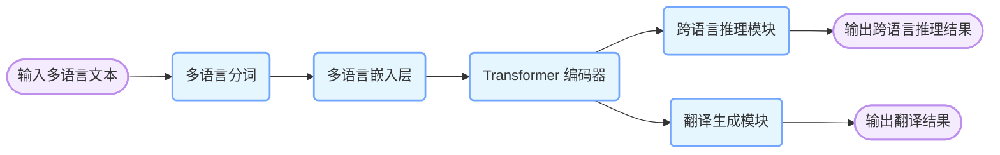

# 大规模语言模型的跨语言推理与翻译能力

> 关键词：大规模语言模型、跨语言推理、翻译能力、多语言处理、语义理解

> 摘要：本文聚焦于大规模语言模型的跨语言推理与翻译能力。首先介绍了相关背景，包括研究目的、预期读者、文档结构和术语定义。接着阐述了核心概念及联系，通过文本示意图和 Mermaid 流程图呈现原理和架构。详细讲解了核心算法原理，结合 Python 代码进行说明，并给出数学模型和公式及实例。通过项目实战，展示了代码实现和解读。分析了实际应用场景，推荐了学习资源、开发工具框架和相关论文著作。最后总结了未来发展趋势与挑战，提供常见问题解答和扩展阅读参考资料，旨在全面深入地探讨大规模语言模型在跨语言推理与翻译方面的能力。

## 1. 背景介绍 
### 1.1 目的和范围
随着全球化的发展，不同语言之间的交流和信息传递变得愈发重要。大规模语言模型在自然语言处理领域展现出了强大的能力，其跨语言推理与翻译能力成为研究的热点。本文章的目的在于深入探讨大规模语言模型在跨语言推理和翻译方面的技术原理、应用场景以及未来发展趋势。研究范围涵盖了从基础概念到实际应用的多个层面，包括核心算法、数学模型、项目实战等。

### 1.2 预期读者
本文预期读者包括自然语言处理领域的研究人员、开发者、对人工智能和语言技术感兴趣的学生以及相关行业的从业者。对于希望了解大规模语言模型跨语言能力的技术细节和应用方法的读者，本文将提供有价值的参考。

### 1.3 文档结构概述
本文共分为十个部分。第一部分为背景介绍，阐述研究目的、预期读者、文档结构和术语定义。第二部分介绍核心概念与联系，通过文本示意图和 Mermaid 流程图展示原理和架构。第三部分讲解核心算法原理，并使用 Python 代码详细阐述。第四部分给出数学模型和公式，并进行详细讲解和举例说明。第五部分进行项目实战，包括开发环境搭建、源代码实现和代码解读。第六部分分析实际应用场景。第七部分推荐学习资源、开发工具框架和相关论文著作。第八部分总结未来发展趋势与挑战。第九部分为附录，提供常见问题与解答。第十部分列出扩展阅读和参考资料。

### 1.4 术语表
#### 1.4.1 核心术语定义
- **大规模语言模型（Large Language Model）**：基于深度学习技术，在大规模文本数据上进行训练的语言模型，通常具有数十亿甚至数万亿的参数，能够学习到丰富的语言知识和语义信息。
- **跨语言推理（Cross - Lingual Reasoning）**：指语言模型在不同语言之间进行逻辑推理和知识迁移的能力，能够理解不同语言表达的相同语义，并基于此进行推理和判断。
- **翻译能力（Translation Ability）**：语言模型将一种语言的文本准确、流畅地转换为另一种语言的能力，包括语法、语义和语用层面的转换。

#### 1.4.2 相关概念解释
- **多语言嵌入（Multilingual Embedding）**：将不同语言的词汇或文本映射到同一个低维向量空间中，使得语义相近的词汇在向量空间中距离较近，从而实现跨语言的语义理解和处理。
- **零样本学习（Zero - Shot Learning）**：模型在没有见过目标任务的训练样本的情况下，能够利用已有的知识和语义信息完成任务的能力，在跨语言场景中表现为无需特定语言对的训练数据即可进行翻译和推理。

#### 1.4.3 缩略词列表
- **NLP**：自然语言处理（Natural Language Processing）
- **BERT**：双向编码器表示来自变换器（Bidirectional Encoder Representations from Transformers）
- **GPT**：生成式预训练变换器（Generative Pretrained Transformer）

## 2. 核心概念与联系 
### 核心概念原理
大规模语言模型的跨语言推理与翻译能力基于多语言语义理解和表示。通过在大规模多语言文本数据上进行预训练，模型学习到不同语言之间的语义关联和语法结构。多语言嵌入技术是实现跨语言能力的关键，它将不同语言的词汇和句子映射到同一个向量空间中，使得模型能够在这个空间中进行跨语言的比较和推理。

例如，在多语言嵌入空间中，英语的“cat”和法语的“chat”会被映射到相近的向量位置，因为它们具有相同的语义。这样，当模型接收到一个英语句子并需要将其翻译成法语时，它可以在嵌入空间中找到对应的法语词汇和表达方式。

### 架构示意图
以下是一个简化的大规模语言模型跨语言推理与翻译的架构示意图：



### 架构解释
- **输入多语言文本**：模型可以接收不同语言的文本作为输入。
- **多语言分词**：将输入的文本按照词汇或子词进行分割，以便后续处理。
- **多语言嵌入层**：将分词后的文本映射到多语言嵌入空间中，为后续的处理提供语义表示。
- **Transformer 编码器**：对嵌入后的文本进行特征提取和编码，学习文本的语义和语法信息。
- **跨语言推理模块**：基于编码后的特征进行逻辑推理和知识迁移，输出跨语言推理结果。
- **翻译生成模块**：根据编码后的特征生成目标语言的翻译文本。
- **输出结果**：分别输出跨语言推理结果和翻译结果。

## 3. 核心算法原理 & 具体操作步骤 
### 核心算法原理
大规模语言模型的跨语言推理与翻译能力主要基于 Transformer 架构。Transformer 是一种基于自注意力机制的深度学习模型，能够有效地处理序列数据。在多语言处理中，Transformer 模型通过在大规模多语言文本数据上进行预训练，学习到不同语言之间的语义关联和语法结构。

自注意力机制允许模型在处理每个词汇时，关注输入序列中的其他词汇，从而捕捉到长距离的依赖关系。具体来说，对于输入序列 $X = [x_1, x_2, \cdots, x_n]$，自注意力机制计算每个词汇的表示 $h_i$ 如下：

$$
h_i = \text{Attention}(Q_i, K, V) = \text{softmax}\left(\frac{Q_iK^T}{\sqrt{d_k}}\right)V
$$

其中，$Q_i$ 是第 $i$ 个词汇的查询向量，$K$ 是所有词汇的键向量，$V$ 是所有词汇的值向量，$d_k$ 是键向量的维度。

### 具体操作步骤
#### 步骤 1：数据预处理
- 收集大规模的多语言文本数据，包括不同领域和体裁的文本。
- 对数据进行清洗和预处理，去除噪声和无效信息。
- 使用多语言分词器对文本进行分词，将其转换为词汇或子词序列。

#### 步骤 2：模型预训练
- 构建 Transformer 模型，设置模型的层数、头数和隐藏层维度等参数。
- 在大规模多语言文本数据上进行无监督预训练，使用掩码语言模型（Masked Language Model，MLM）和下一句预测（Next Sentence Prediction，NSP）等任务。
- 通过反向传播算法更新模型的参数，使模型学习到多语言的语义和语法信息。

#### 步骤 3：跨语言推理和翻译微调
- 收集跨语言推理和翻译的任务数据，包括训练集、验证集和测试集。
- 在预训练模型的基础上，使用任务数据进行微调，调整模型的参数以适应特定的任务。
- 在微调过程中，使用适当的损失函数，如交叉熵损失函数，来优化模型的性能。

#### 步骤 4：模型评估和优化
- 使用测试集对微调后的模型进行评估，计算评估指标，如准确率、召回率、F1 值和 BLEU 分数等。
- 根据评估结果，对模型进行优化，如调整模型参数、增加训练数据或改进训练方法等。

### Python 代码实现
以下是一个使用 Hugging Face 的 Transformers 库实现跨语言翻译的示例代码：

```python
from transformers import AutoTokenizer, AutoModelForSeq2SeqLM

# 加载预训练的翻译模型和分词器
model_name = "Helsinki-NLP/opus-mt-en-fr"
tokenizer = AutoTokenizer.from_pretrained(model_name)
model = AutoModelForSeq2SeqLM.from_pretrained(model_name)

# 输入英语句子
input_text = "Hello, how are you?"

# 对输入句子进行分词
input_ids = tokenizer(input_text, return_tensors="pt").input_ids

# 生成法语翻译
outputs = model.generate(input_ids)

# 将生成的翻译结果解码为文本
translation = tokenizer.decode(outputs[0], skip_special_tokens=True)

print(f"英语输入: {input_text}")
print(f"法语翻译: {translation}")
```

### 代码解释
- 首先，使用 `AutoTokenizer` 和 `AutoModelForSeq2SeqLM` 从 Hugging Face 的模型库中加载预训练的翻译模型和分词器。
- 然后，定义一个英语句子作为输入，并使用分词器将其转换为输入 ID。
- 接着，使用模型的 `generate` 方法生成法语翻译的输出 ID。
- 最后，使用分词器将输出 ID 解码为文本，并打印出英语输入和法语翻译结果。

## 4. 数学模型和公式 & 详细讲解 & 举例说明 
### 多语言嵌入模型
多语言嵌入模型的目标是将不同语言的词汇或文本映射到同一个低维向量空间中，使得语义相近的词汇在向量空间中距离较近。常用的多语言嵌入方法包括基于神经网络的方法和基于矩阵分解的方法。

#### 基于神经网络的多语言嵌入
以 Word2Vec 为例，它是一种基于神经网络的词嵌入模型。在多语言场景中，可以使用联合训练的方式，将不同语言的词汇一起训练，使得它们共享同一个嵌入空间。

Word2Vec 有两种训练方式：连续词袋模型（Continuous Bag - of - Words，CBOW）和跳字模型（Skip - Gram）。以 CBOW 为例，其目标是根据上下文词汇预测中心词汇。

设输入的上下文词汇为 $x_{i - c}, \cdots, x_{i - 1}, x_{i + 1}, \cdots, x_{i + c}$，中心词汇为 $x_i$，其中 $c$ 是上下文窗口的大小。CBOW 模型的目标是最大化以下概率：

$$
P(x_i|x_{i - c}, \cdots, x_{i - 1}, x_{i + 1}, \cdots, x_{i + c})
$$

通过神经网络的训练，得到每个词汇的嵌入向量。

#### 基于矩阵分解的多语言嵌入
另一种常见的多语言嵌入方法是基于矩阵分解的方法，如奇异值分解（Singular Value Decomposition，SVD）。假设我们有一个多语言的共现矩阵 $M$，其中 $M_{ij}$ 表示词汇 $i$ 和词汇 $j$ 在多语言文本中共同出现的次数。

对矩阵 $M$ 进行 SVD 分解：

$$
M = U\Sigma V^T
$$

其中，$U$ 和 $V$ 是正交矩阵，$\Sigma$ 是对角矩阵。可以选择前 $k$ 个奇异值和对应的奇异向量，得到每个词汇的 $k$ 维嵌入向量。

### 跨语言推理的数学模型
跨语言推理可以看作是在多语言嵌入空间中进行逻辑推理和知识迁移。假设我们有两个不同语言的句子 $s_1$ 和 $s_2$，它们的嵌入向量分别为 $v_1$ 和 $v_2$。

#### 语义相似度计算
可以使用余弦相似度来计算两个句子的语义相似度：

$$
\text{sim}(v_1, v_2) = \frac{v_1 \cdot v_2}{\|v_1\|\|v_2\|}
$$

如果相似度超过某个阈值，则可以认为两个句子具有相似的语义。

#### 跨语言推理规则
在跨语言推理中，可以定义一些推理规则，例如：如果句子 $s_1$ 蕴含句子 $s_2$，且 $s_1$ 和 $s_2$ 的语义相似度较高，则可以认为在另一种语言中也存在类似的蕴含关系。

### 举例说明
#### 多语言嵌入示例
假设我们有英语句子 “cat” 和法语句子 “chat”，在经过多语言嵌入后，它们的嵌入向量分别为 $v_{cat}$ 和 $v_{chat}$。通过计算它们的余弦相似度：

$$
\text{sim}(v_{cat}, v_{chat}) = \frac{v_{cat} \cdot v_{chat}}{\|v_{cat}\|\|v_{chat}\|}
$$

如果相似度较高，说明在多语言嵌入空间中，“cat” 和 “chat” 具有相似的语义。

#### 跨语言推理示例
假设我们有英语句子 “All dogs are animals” 和法语句子 “Tous les chiens sont des animaux”。首先将它们转换为嵌入向量 $v_{eng}$ 和 $v_{fra}$，计算它们的相似度：

$$
\text{sim}(v_{eng}, v_{fra}) = \frac{v_{eng} \cdot v_{fra}}{\|v_{eng}\|\|v_{fra}\|}
$$

如果相似度超过阈值，并且我们知道在英语中 “All dogs are animals” 蕴含 “Some animals are dogs”，那么可以通过跨语言推理认为在法语中 “Tous les chiens sont des animaux” 也蕴含类似的关系。

## 5. 项目实战：代码实际案例和详细解释说明 
### 5.1  开发环境搭建
#### 安装 Python
首先，确保你已经安装了 Python 3.6 或更高版本。可以从 Python 官方网站（https://www.python.org/downloads/）下载并安装适合你操作系统的 Python 版本。

#### 创建虚拟环境
为了避免不同项目之间的依赖冲突，建议使用虚拟环境。可以使用 `venv` 模块创建虚拟环境：

```bash
python -m venv myenv
```

激活虚拟环境：

- 在 Windows 上：
```bash
myenv\Scripts\activate
```
- 在 Linux 或 macOS 上：
```bash
source myenv/bin/activate
```

#### 安装必要的库
在虚拟环境中安装 Hugging Face 的 Transformers 库和其他必要的库：

```bash
pip install transformers torch
```

### 5.2  源代码详细实现和代码解读
以下是一个完整的跨语言推理和翻译项目的代码示例：

```python
from transformers import AutoTokenizer, AutoModelForSeq2SeqLM, AutoModelForSequenceClassification
import torch

# 加载翻译模型和分词器
translation_model_name = "Helsinki-NLP/opus-mt-en-fr"
translation_tokenizer = AutoTokenizer.from_pretrained(translation_model_name)
translation_model = AutoModelForSeq2SeqLM.from_pretrained(translation_model_name)

# 加载跨语言推理模型和分词器
inference_model_name = "cross-encoder/nli-deberta-v3-base"
inference_tokenizer = AutoTokenizer.from_pretrained(inference_model_name)
inference_model = AutoModelForSequenceClassification.from_pretrained(inference_model_name)

# 定义英语输入句子
english_sentence_1 = "The cat is on the mat."
english_sentence_2 = "There is a feline on the mat."

# 翻译英语句子到法语
input_ids_1 = translation_tokenizer(english_sentence_1, return_tensors="pt").input_ids
input_ids_2 = translation_tokenizer(english_sentence_2, return_tensors="pt").input_ids

outputs_1 = translation_model.generate(input_ids_1)
outputs_2 = translation_model.generate(input_ids_2)

french_sentence_1 = translation_tokenizer.decode(outputs_1[0], skip_special_tokens=True)
french_sentence_2 = translation_tokenizer.decode(outputs_2[0], skip_special_tokens=True)

print(f"英语句子 1: {english_sentence_1}")
print(f"法语翻译 1: {french_sentence_1}")
print(f"英语句子 2: {english_sentence_2}")
print(f"法语翻译 2: {french_sentence_2}")

# 进行跨语言推理
input_pair = [english_sentence_1, english_sentence_2]
inputs = inference_tokenizer(input_pair, return_tensors="pt", padding=True, truncation=True)

with torch.no_grad():
    outputs = inference_model(**inputs)
    logits = outputs.logits
    predicted_class_id = torch.argmax(logits, dim=-1).item()

label_mapping = ['contradiction', 'entailment', 'neutral']
print(f"跨语言推理结果: {label_mapping[predicted_class_id]}")
```

### 5.3  代码解读与分析
#### 翻译部分
- 首先，使用 `AutoTokenizer` 和 `AutoModelForSeq2SeqLM` 加载预训练的翻译模型和分词器。
- 定义两个英语句子 `english_sentence_1` 和 `english_sentence_2`。
- 使用分词器将英语句子转换为输入 ID，并使用翻译模型的 `generate` 方法生成法语翻译的输出 ID。
- 最后，使用分词器将输出 ID 解码为法语句子并打印。

#### 跨语言推理部分
- 使用 `AutoTokenizer` 和 `AutoModelForSequenceClassification` 加载预训练的跨语言推理模型和分词器。
- 将两个英语句子作为输入对，使用分词器进行分词和处理。
- 使用推理模型进行推理，得到预测的类别 ID。
- 根据类别 ID 映射到对应的标签（矛盾、蕴含、中立）并打印推理结果。

## 6. 实际应用场景 
### 国际商务交流
在国际商务活动中，不同语言的企业之间需要进行有效的沟通和合作。大规模语言模型的跨语言推理与翻译能力可以帮助企业快速准确地翻译商务文件、合同、邮件等，同时还能进行跨语言的信息理解和推理，例如分析市场趋势、竞争对手信息等。

### 跨文化教育
在教育领域，跨语言推理和翻译能力可以促进不同国家和地区之间的教育资源共享和交流。学生可以通过翻译工具学习不同语言的教材和学术文献，教师也可以利用跨语言推理能力进行教学评估和知识拓展。

### 旅游和文化交流
在旅游和文化交流中，语言障碍是一个常见的问题。大规模语言模型可以为游客提供实时的翻译服务，帮助他们更好地了解当地的文化和风俗习惯。同时，跨语言推理能力可以帮助游客理解不同文化背景下的信息和意图。

### 国际新闻和媒体
在国际新闻和媒体领域，需要及时准确地传播不同语言的新闻和信息。语言模型的跨语言翻译能力可以实现新闻的快速翻译和传播，而跨语言推理能力可以帮助媒体分析不同国家和地区的政治、经济和社会情况。

## 7. 工具和资源推荐
### 7.1 学习资源推荐
#### 7.1.1 书籍推荐
- 《自然语言处理入门》：介绍了自然语言处理的基础知识和常用技术，适合初学者入门。
- 《深度学习》：详细讲解了深度学习的原理和方法，对于理解大规模语言模型的技术基础有很大帮助。
- 《Transformers 从入门到实战》：专门介绍了 Transformer 架构和相关的自然语言处理应用，是学习大规模语言模型的重要参考书籍。

#### 7.1.2 在线课程
- Coursera 上的“Natural Language Processing Specialization”：由知名大学的教授授课，系统地介绍了自然语言处理的各个方面。
- edX 上的“Deep Learning for Natural Language Processing”：深入讲解了深度学习在自然语言处理中的应用，包括大规模语言模型的训练和优化。
- 哔哩哔哩上的一些自然语言处理相关的教程：有很多博主分享了自己的学习经验和代码实现，适合自学和实践。

#### 7.1.3 技术博客和网站
- Hugging Face Blog：提供了关于大规模语言模型的最新研究成果和应用案例，是了解行业动态的重要渠道。
- Towards Data Science：发表了很多关于自然语言处理和机器学习的技术文章，内容丰富多样。
- arXiv：是一个预印本数据库，包含了大量的学术论文，对于了解最新的研究趋势和技术进展非常有帮助。

### 7.2 开发工具框架推荐
#### 7.2.1 IDE和编辑器
- PyCharm：是一款专业的 Python 集成开发环境，提供了丰富的代码编辑、调试和项目管理功能。
- Visual Studio Code：是一款轻量级的代码编辑器，支持多种编程语言和插件扩展，非常适合快速开发和调试。

#### 7.2.2 调试和性能分析工具
- TensorBoard：是 TensorFlow 提供的可视化工具，可以用于监控模型的训练过程、分析模型的性能和可视化模型的结构。
- Py-Spy：是一个 Python 性能分析工具，可以实时监测 Python 程序的运行状态和性能瓶颈。

#### 7.2.3 相关框架和库
- Hugging Face Transformers：是一个广泛使用的自然语言处理库，提供了丰富的预训练模型和工具，方便进行大规模语言模型的开发和应用。
- PyTorch：是一个深度学习框架，具有简洁易用的 API 和高效的计算性能，被广泛应用于自然语言处理和大规模语言模型的研究和开发。

### 7.3 相关论文著作推荐
#### 7.3.1 经典论文
- “Attention Is All You Need”：介绍了 Transformer 架构，是大规模语言模型的基础论文。
- “BERT: Pre-training of Deep Bidirectional Transformers for Language Understanding”：提出了 BERT 模型，开启了预训练语言模型的新时代。
- “GPT: Generative Pretrained Transformer”：介绍了 GPT 系列模型，展示了生成式预训练模型的强大能力。

#### 7.3.2 最新研究成果
- 关注 arXiv 上关于大规模语言模型跨语言能力的最新论文，了解最新的研究方法和技术进展。
- 参加国际自然语言处理会议，如 ACL、EMNLP 等，获取最新的研究成果和行业动态。

#### 7.3.3 应用案例分析
- 研究一些实际应用案例，如谷歌翻译、DeepL 等，了解大规模语言模型在跨语言翻译领域的应用和优化方法。

## 8. 总结：未来发展趋势与挑战
### 未来发展趋势
#### 多模态跨语言处理
未来的大规模语言模型将不仅仅局限于文本处理，还将结合图像、音频等多模态信息进行跨语言处理。例如，在图像描述生成中，可以实现不同语言的图像描述，增强跨语言的信息交流和理解。

#### 个性化跨语言服务
根据用户的语言习惯、兴趣和需求，提供个性化的跨语言推理和翻译服务。例如，为不同行业的用户提供专业领域的翻译和推理，提高服务的准确性和实用性。

#### 跨语言知识图谱构建
利用大规模语言模型的跨语言能力，构建跨语言的知识图谱，整合不同语言的知识和信息，为智能问答、知识推理等应用提供更强大的支持。

### 挑战
#### 数据质量和多样性
大规模语言模型的训练需要大量的高质量多语言数据。然而，不同语言的数据质量和多样性存在差异，如何获取和处理这些数据是一个挑战。

#### 计算资源和效率
训练和部署大规模语言模型需要巨大的计算资源和时间成本。如何提高模型的训练效率和推理速度，降低计算成本，是未来需要解决的问题。

#### 语义理解和文化差异
不同语言之间存在着丰富的语义和文化差异，如何让大规模语言模型更好地理解和处理这些差异，实现准确的跨语言推理和翻译，是一个具有挑战性的任务。

## 9. 附录：常见问题与解答
### 问题 1：大规模语言模型的跨语言推理和翻译能力受哪些因素影响？
解答：受数据质量和多样性、模型架构和参数、训练方法和优化策略等因素影响。数据质量和多样性决定了模型学习到的语言知识和语义信息；模型架构和参数影响模型的表达能力和性能；训练方法和优化策略影响模型的收敛速度和泛化能力。

### 问题 2：如何评估大规模语言模型的跨语言推理和翻译能力？
解答：可以使用准确率、召回率、F1 值、BLEU 分数等评估指标。对于跨语言推理，可以使用准确率等指标评估推理结果的正确性；对于翻译能力，可以使用 BLEU 分数等指标评估翻译结果的质量。

### 问题 3：大规模语言模型在跨语言处理中存在哪些局限性？
解答：存在语义理解不准确、文化差异处理不当、缺乏常识推理能力等局限性。由于不同语言之间的语义和文化差异，模型可能无法准确理解和翻译一些复杂的句子；同时，模型在常识推理方面的能力还比较有限。

## 10. 扩展阅读 & 参考资料
### 扩展阅读
- 《人工智能：现代方法》：全面介绍了人工智能的各个领域，包括自然语言处理和机器学习，对于深入理解大规模语言模型的背景和技术有很大帮助。
- 《机器翻译：统计建模与深度学习方法》：详细讲解了机器翻译的原理和方法，包括传统的统计机器翻译和现代的深度学习机器翻译。

### 参考资料
- Hugging Face 官方文档：https://huggingface.co/docs
- PyTorch 官方文档：https://pytorch.org/docs/stable/index.html
- arXiv 预印本数据库：https://arxiv.org/

作者：AI天才研究院/AI Genius Institute & 禅与计算机程序设计艺术 /Zen And The Art of Computer Programming