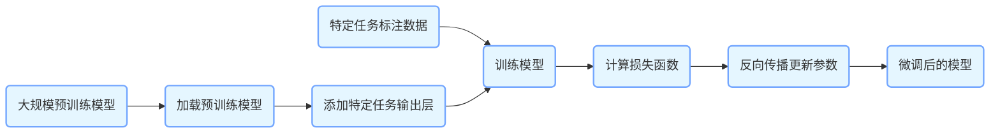

# 大规模预训练模型在特定推理任务中的微调技术

> 关键词：大规模预训练模型、特定推理任务、微调技术、迁移学习、自然语言处理

> 摘要：本文聚焦于大规模预训练模型在特定推理任务中的微调技术。首先介绍了该技术的背景，包括目的、预期读者、文档结构和相关术语。接着阐述了核心概念与联系，通过文本示意图和 Mermaid 流程图展示原理和架构。详细讲解了核心算法原理及具体操作步骤，结合 Python 代码进行说明。深入探讨了数学模型和公式，并举例分析。通过项目实战给出代码实际案例和详细解释。列举了实际应用场景，推荐了学习资源、开发工具框架和相关论文著作。最后总结了未来发展趋势与挑战，提供常见问题解答和扩展阅读参考资料，旨在帮助读者全面理解和应用大规模预训练模型的微调技术。

## 1. 背景介绍 
### 1.1 目的和范围
在当今人工智能领域，大规模预训练模型如 BERT、GPT 等取得了显著的成果。这些模型在大规模无监督数据上进行预训练，学习到了丰富的语言知识和通用特征。然而，在面对特定的推理任务时，直接使用预训练模型往往无法达到最优性能。因此，微调技术应运而生，其目的是将预训练模型的知识迁移到特定推理任务中，通过在特定任务的标注数据上进行进一步训练，调整模型的参数，以提高模型在该任务上的性能。

本文的范围涵盖了大规模预训练模型微调技术的各个方面，包括核心概念、算法原理、数学模型、项目实战、应用场景以及相关的工具和资源等，旨在为读者提供一个全面、深入的了解。

### 1.2 预期读者
本文的预期读者包括人工智能领域的研究人员、开发者、学生以及对大规模预训练模型和微调技术感兴趣的技术爱好者。对于有一定机器学习和深度学习基础的读者，本文可以帮助他们深入理解和应用微调技术；对于初学者，也可以作为一个系统的学习资料，逐步建立相关知识体系。

### 1.3 文档结构概述
本文将按照以下结构进行组织：
- 核心概念与联系：介绍大规模预训练模型和微调技术的核心概念，以及它们之间的联系，并通过文本示意图和 Mermaid 流程图进行直观展示。
- 核心算法原理 & 具体操作步骤：详细讲解微调技术的核心算法原理，并给出具体的操作步骤，同时使用 Python 代码进行示例。
- 数学模型和公式 & 详细讲解 & 举例说明：阐述微调技术背后的数学模型和公式，并通过具体例子进行详细说明。
- 项目实战：给出一个实际的项目案例，包括开发环境搭建、源代码实现和代码解读。
- 实际应用场景：列举大规模预训练模型微调技术在不同领域的实际应用场景。
- 工具和资源推荐：推荐学习资源、开发工具框架和相关论文著作。
- 总结：总结未来发展趋势与挑战。
- 附录：提供常见问题与解答。
- 扩展阅读 & 参考资料：列出相关的扩展阅读材料和参考资料。

### 1.4 术语表
#### 1.4.1 核心术语定义
- **大规模预训练模型**：在大规模无监督数据上进行预训练的深度学习模型，如 BERT（Bidirectional Encoder Representations from Transformers）、GPT（Generative Pretrained Transformer）等，这些模型学习到了丰富的语言知识和通用特征。
- **微调（Fine-tuning）**：在预训练模型的基础上，使用特定任务的标注数据对模型进行进一步训练，调整模型的参数，以提高模型在该任务上的性能。
- **特定推理任务**：指具体的、有明确目标的推理任务，如文本分类、情感分析、命名实体识别等。
- **迁移学习**：将在一个任务上学习到的知识迁移到另一个相关任务上的机器学习技术，微调技术是迁移学习的一种具体应用。

#### 1.4.2 相关概念解释
- **预训练**：在大规模无监督数据上对模型进行训练，让模型学习到通用的语言知识和特征。预训练通常使用自监督学习方法，如掩码语言模型（Masked Language Model）等。
- **监督学习**：使用标注数据对模型进行训练，模型的目标是学习输入数据和标注之间的映射关系。在微调过程中，使用特定任务的标注数据进行监督学习。
- **Transformer 架构**：一种基于注意力机制的深度学习架构，被广泛应用于大规模预训练模型中。Transformer 架构具有并行计算能力强、长序列处理能力好等优点。

#### 1.4.3 缩略词列表
- **BERT**：Bidirectional Encoder Representations from Transformers
- **GPT**：Generative Pretrained Transformer
- **MLM**：Masked Language Model
- **NLP**：Natural Language Processing

## 2. 核心概念与联系 

### 核心概念原理
大规模预训练模型的核心思想是在大规模无监督数据上进行预训练，让模型学习到通用的语言知识和特征。这些模型通常采用 Transformer 架构，利用自监督学习方法，如掩码语言模型（MLM），让模型预测被掩码的单词，从而学习到单词之间的语义关系。

微调技术则是在预训练模型的基础上，使用特定任务的标注数据对模型进行进一步训练。在微调过程中，模型的大部分参数保持不变，只对部分层或全部层的参数进行微小的调整，以适应特定任务的需求。微调的本质是将预训练模型学习到的通用知识迁移到特定任务中，从而提高模型在该任务上的性能。

### 架构的文本示意图
```plaintext
大规模预训练模型
|
|-- 输入层（处理输入文本）
|-- Transformer 层（多层堆叠）
|   |-- 多头注意力机制
|   |-- 前馈神经网络
|-- 输出层（根据任务输出结果）

微调过程
|
|-- 加载预训练模型
|-- 添加特定任务的输出层
|-- 使用特定任务的标注数据进行训练
|   |-- 计算损失函数
|   |-- 反向传播更新参数
```

### Mermaid 流程图


## 3. 核心算法原理 & 具体操作步骤 

### 核心算法原理
微调技术的核心算法基于梯度下降优化算法，通过最小化特定任务的损失函数来更新模型的参数。在微调过程中，通常使用随机梯度下降（SGD）或其变种，如 Adam 优化器。

损失函数的选择取决于具体的任务。例如，对于文本分类任务，常用的损失函数是交叉熵损失函数；对于回归任务，常用的损失函数是均方误差损失函数。

### 具体操作步骤
1. **加载预训练模型**：使用深度学习框架（如 PyTorch 或 TensorFlow）提供的接口加载预训练模型的权重。
2. **添加特定任务的输出层**：根据具体任务的需求，在预训练模型的基础上添加特定任务的输出层。例如，对于文本分类任务，可以添加一个全连接层作为输出层，输出类别数等于任务的类别数。
3. **准备特定任务的标注数据**：将特定任务的标注数据进行预处理，包括分词、编码等操作，使其适合模型的输入。
4. **定义损失函数和优化器**：根据具体任务选择合适的损失函数，并使用梯度下降优化算法定义优化器。
5. **训练模型**：将预处理后的标注数据输入到模型中，计算损失函数，并使用优化器更新模型的参数。通常需要进行多个 epoch 的训练，直到模型的性能达到满意的程度。
6. **评估模型**：使用验证集或测试集对微调后的模型进行评估，计算模型在该任务上的性能指标，如准确率、召回率、F1 值等。

### Python 代码示例
以下是一个使用 PyTorch 和 Hugging Face Transformers 库进行文本分类任务微调的示例代码：

```python
import torch
from torch.utils.data import DataLoader, Dataset
from transformers import BertTokenizer, BertForSequenceClassification, AdamW
from sklearn.model_selection import train_test_split
import numpy as np

# 定义数据集类
class TextClassificationDataset(Dataset):
    def __init__(self, texts, labels, tokenizer, max_length):
        self.texts = texts
        self.labels = labels
        self.tokenizer = tokenizer
        self.max_length = max_length

    def __len__(self):
        return len(self.texts)

    def __getitem__(self, idx):
        text = self.texts[idx]
        label = self.labels[idx]
        encoding = self.tokenizer.encode_plus(
            text,
            add_special_tokens=True,
            max_length=self.max_length,
            padding='max_length',
            truncation=True,
            return_tensors='pt'
        )
        return {
            'input_ids': encoding['input_ids'].flatten(),
            'attention_mask': encoding['attention_mask'].flatten(),
            'labels': torch.tensor(label, dtype=torch.long)
        }

# 加载预训练模型和分词器
tokenizer = BertTokenizer.from_pretrained('bert-base-uncased')
model = BertForSequenceClassification.from_pretrained('bert-base-uncased', num_labels=2)

# 准备数据
texts = ["This is a positive sentence.", "This is a negative sentence."]
labels = [1, 0]
train_texts, val_texts, train_labels, val_labels = train_test_split(texts, labels, test_size=0.2)

# 创建数据集和数据加载器
train_dataset = TextClassificationDataset(train_texts, train_labels, tokenizer, max_length=128)
val_dataset = TextClassificationDataset(val_texts, val_labels, tokenizer, max_length=128)
train_dataloader = DataLoader(train_dataset, batch_size=2, shuffle=True)
val_dataloader = DataLoader(val_dataset, batch_size=2, shuffle=False)

# 定义优化器和损失函数
optimizer = AdamW(model.parameters(), lr=2e-5)
criterion = torch.nn.CrossEntropyLoss()

# 训练模型
device = torch.device('cuda' if torch.cuda.is_available() else 'cpu')
model.to(device)

num_epochs = 3
for epoch in range(num_epochs):
    model.train()
    total_loss = 0
    for batch in train_dataloader:
        input_ids = batch['input_ids'].to(device)
        attention_mask = batch['attention_mask'].to(device)
        labels = batch['labels'].to(device)

        optimizer.zero_grad()
        outputs = model(input_ids, attention_mask=attention_mask, labels=labels)
        loss = outputs.loss
        total_loss += loss.item()

        loss.backward()
        optimizer.step()

    print(f'Epoch {epoch + 1}, Loss: {total_loss / len(train_dataloader)}')

    # 评估模型
    model.eval()
    total_correct = 0
    total_samples = 0
    with torch.no_grad():
        for batch in val_dataloader:
            input_ids = batch['input_ids'].to(device)
            attention_mask = batch['attention_mask'].to(device)
            labels = batch['labels'].to(device)

            outputs = model(input_ids, attention_mask=attention_mask)
            logits = outputs.logits
            predictions = torch.argmax(logits, dim=1)
            total_correct += (predictions == labels).sum().item()
            total_samples += labels.size(0)

    accuracy = total_correct / total_samples
    print(f'Epoch {epoch + 1}, Validation Accuracy: {accuracy}')
```

## 4. 数学模型和公式 & 详细讲解 & 举例说明 

### 数学模型
微调技术的数学模型基于神经网络的前向传播和反向传播算法。假设预训练模型的参数为 $\theta_{pretrained}$，特定任务的输出层参数为 $\theta_{task}$，则微调后的模型参数为 $\theta = [\theta_{pretrained}, \theta_{task}]$。

在训练过程中，模型的输入为 $x$，输出为 $\hat{y} = f(x; \theta)$，其中 $f$ 表示模型的前向传播函数。损失函数 $L(\hat{y}, y)$ 衡量了模型输出 $\hat{y}$ 与真实标签 $y$ 之间的差异，通常使用交叉熵损失函数或均方误差损失函数。

### 公式
- **交叉熵损失函数**：对于分类任务，假设共有 $C$ 个类别，模型的输出为 $\hat{y} = [\hat{y}_1, \hat{y}_2, \cdots, \hat{y}_C]$，真实标签为 $y = [y_1, y_2, \cdots, y_C]$，其中 $y_i$ 是一个 one-hot 向量。交叉熵损失函数的公式为：
$$
L(\hat{y}, y) = -\sum_{i=1}^{C} y_i \log(\hat{y}_i)
$$

- **均方误差损失函数**：对于回归任务，假设模型的输出为 $\hat{y}$，真实标签为 $y$，均方误差损失函数的公式为：
$$
L(\hat{y}, y) = \frac{1}{n} \sum_{i=1}^{n} (\hat{y}_i - y_i)^2
$$

### 详细讲解
在微调过程中，通过最小化损失函数 $L(\hat{y}, y)$ 来更新模型的参数 $\theta$。使用梯度下降优化算法，更新公式为：
$$
\theta_{new} = \theta_{old} - \alpha \frac{\partial L}{\partial \theta}
$$
其中 $\alpha$ 是学习率，控制参数更新的步长。

### 举例说明
假设我们有一个二分类任务，模型的输出为 $\hat{y} = [0.8, 0.2]$，真实标签为 $y = [1, 0]$。使用交叉熵损失函数计算损失：
$$
L(\hat{y}, y) = - (1 \times \log(0.8) + 0 \times \log(0.2)) \approx 0.223
$$

在训练过程中，根据损失函数的梯度更新模型的参数，使得损失函数逐渐减小，模型的性能逐渐提高。

## 5. 项目实战：代码实际案例和详细解释说明 

### 5.1  开发环境搭建
#### 安装 Python
首先需要安装 Python 环境，建议使用 Python 3.7 及以上版本。可以从 Python 官方网站（https://www.python.org/downloads/）下载并安装。

#### 安装深度学习框架
本文使用 PyTorch 和 Hugging Face Transformers 库，使用以下命令进行安装：
```sh
pip install torch
pip install transformers
```

#### 安装其他依赖库
还需要安装一些其他的依赖库，如 numpy、sklearn 等：
```sh
pip install numpy scikit-learn
```

### 5.2  源代码详细实现和代码解读
以下是一个完整的文本分类任务微调的代码示例：

```python
import torch
from torch.utils.data import DataLoader, Dataset
from transformers import BertTokenizer, BertForSequenceClassification, AdamW
from sklearn.model_selection import train_test_split
import numpy as np

# 定义数据集类
class TextClassificationDataset(Dataset):
    def __init__(self, texts, labels, tokenizer, max_length):
        self.texts = texts
        self.labels = labels
        self.tokenizer = tokenizer
        self.max_length = max_length

    def __len__(self):
        return len(self.texts)

    def __getitem__(self, idx):
        text = self.texts[idx]
        label = self.labels[idx]
        encoding = self.tokenizer.encode_plus(
            text,
            add_special_tokens=True,
            max_length=self.max_length,
            padding='max_length',
            truncation=True,
            return_tensors='pt'
        )
        return {
            'input_ids': encoding['input_ids'].flatten(),
            'attention_mask': encoding['attention_mask'].flatten(),
            'labels': torch.tensor(label, dtype=torch.long)
        }

# 加载预训练模型和分词器
tokenizer = BertTokenizer.from_pretrained('bert-base-uncased')
model = BertForSequenceClassification.from_pretrained('bert-base-uncased', num_labels=2)

# 准备数据
texts = ["This is a positive sentence.", "This is a negative sentence."]
labels = [1, 0]
train_texts, val_texts, train_labels, val_labels = train_test_split(texts, labels, test_size=0.2)

# 创建数据集和数据加载器
train_dataset = TextClassificationDataset(train_texts, train_labels, tokenizer, max_length=128)
val_dataset = TextClassificationDataset(val_texts, val_labels, tokenizer, max_length=128)
train_dataloader = DataLoader(train_dataset, batch_size=2, shuffle=True)
val_dataloader = DataLoader(val_dataset, batch_size=2, shuffle=False)

# 定义优化器和损失函数
optimizer = AdamW(model.parameters(), lr=2e-5)
criterion = torch.nn.CrossEntropyLoss()

# 训练模型
device = torch.device('cuda' if torch.cuda.is_available() else 'cpu')
model.to(device)

num_epochs = 3
for epoch in range(num_epochs):
    model.train()
    total_loss = 0
    for batch in train_dataloader:
        input_ids = batch['input_ids'].to(device)
        attention_mask = batch['attention_mask'].to(device)
        labels = batch['labels'].to(device)

        optimizer.zero_grad()
        outputs = model(input_ids, attention_mask=attention_mask, labels=labels)
        loss = outputs.loss
        total_loss += loss.item()

        loss.backward()
        optimizer.step()

    print(f'Epoch {epoch + 1}, Loss: {total_loss / len(train_dataloader)}')

    # 评估模型
    model.eval()
    total_correct = 0
    total_samples = 0
    with torch.no_grad():
        for batch in val_dataloader:
            input_ids = batch['input_ids'].to(device)
            attention_mask = batch['attention_mask'].to(device)
            labels = batch['labels'].to(device)

            outputs = model(input_ids, attention_mask=attention_mask)
            logits = outputs.logits
            predictions = torch.argmax(logits, dim=1)
            total_correct += (predictions == labels).sum().item()
            total_samples += labels.size(0)

    accuracy = total_correct / total_samples
    print(f'Epoch {epoch + 1}, Validation Accuracy: {accuracy}')
```

### 代码解读与分析
1. **数据集类定义**：`TextClassificationDataset` 类继承自 `torch.utils.data.Dataset`，用于处理文本分类任务的数据集。在 `__getitem__` 方法中，使用 `BertTokenizer` 对文本进行分词和编码，将其转换为模型可以接受的输入格式。
2. **加载预训练模型和分词器**：使用 `BertTokenizer.from_pretrained` 和 `BertForSequenceClassification.from_pretrained` 方法加载预训练的 BERT 模型和分词器，并根据任务的类别数设置输出层的类别数。
3. **数据准备**：将文本数据和标签数据进行划分，分为训练集和验证集，并创建相应的数据集和数据加载器。
4. **定义优化器和损失函数**：使用 `AdamW` 优化器和 `CrossEntropyLoss` 损失函数进行模型训练。
5. **训练模型**：在每个 epoch 中，将模型设置为训练模式，遍历训练数据加载器，计算损失函数并进行反向传播更新参数。
6. **评估模型**：在每个 epoch 结束后，将模型设置为评估模式，遍历验证数据加载器，计算模型的准确率。

## 6. 实际应用场景 
大规模预训练模型的微调技术在自然语言处理领域有广泛的应用，以下是一些常见的应用场景：

### 文本分类
文本分类是将文本分为不同类别的任务，如新闻分类、情感分析、垃圾邮件过滤等。通过微调预训练模型，可以提高模型在特定文本分类任务上的准确率。例如，在情感分析任务中，将预训练模型微调后，可以准确地判断文本的情感倾向（积极、消极或中性）。

### 命名实体识别
命名实体识别是识别文本中特定实体的任务，如人名、地名、组织机构名等。微调预训练模型可以利用其学习到的语言知识，提高命名实体识别的性能。例如，在新闻文本中识别出人物、地点和事件等实体信息。

### 问答系统
问答系统是根据用户的问题从文本中找到答案的任务。微调预训练模型可以使模型更好地理解问题和文本的语义，提高问答系统的准确性和效率。例如，在智能客服系统中，使用微调后的模型回答用户的问题。

### 机器翻译
机器翻译是将一种语言翻译成另一种语言的任务。微调预训练模型可以在大规模平行语料上进行训练，提高机器翻译的质量。例如，将预训练模型微调后用于中英互译任务。

## 7. 工具和资源推荐
### 7.1 学习资源推荐
#### 7.1.1 书籍推荐
- 《深度学习》（Deep Learning）：由 Ian Goodfellow、Yoshua Bengio 和 Aaron Courville 编写，是深度学习领域的经典教材，涵盖了深度学习的基本概念、算法和应用。
- 《自然语言处理入门》：由何晗编写，介绍了自然语言处理的基础知识和常用技术，适合初学者入门。
- 《动手学深度学习》（Dive into Deep Learning）：由 Aston Zhang、Zachary C. Lipton、Mu Li 和 Alexander J. Smola 编写，提供了丰富的代码示例和实践项目，帮助读者快速掌握深度学习的实践技能。

#### 7.1.2 在线课程
- Coursera 上的《深度学习专项课程》（Deep Learning Specialization）：由 Andrew Ng 教授授课，包括深度学习的基础、卷积神经网络、循环神经网络等内容。
- edX 上的《自然语言处理基础》（Foundations of Natural Language Processing）：介绍了自然语言处理的基本概念和技术，如词法分析、句法分析、语义分析等。
- 吴恩达老师在 B 站发布的《机器学习》课程：免费且内容丰富，适合初学者系统学习机器学习的基础知识。

#### 7.1.3 技术博客和网站
- Hugging Face 博客（https://huggingface.co/blog）：提供了关于大规模预训练模型和自然语言处理的最新技术和研究成果。
- Medium 上的 Towards Data Science 博客（https://towardsdatascience.com/）：有很多关于机器学习和深度学习的技术文章和案例分析。
- 机器之心（https://www.alternativedata.org/）：专注于人工智能领域的技术和产业动态，提供了丰富的技术文章和研究报告。

### 7.2 开发工具框架推荐
#### 7.2.1 IDE和编辑器
- PyCharm：是一款专门为 Python 开发设计的集成开发环境（IDE），提供了代码编辑、调试、版本控制等功能，适合专业开发者使用。
- Jupyter Notebook：是一个交互式的开发环境，支持 Python、R 等多种编程语言，适合进行数据分析和模型实验。
- Visual Studio Code：是一款轻量级的代码编辑器，支持多种编程语言和插件扩展，具有丰富的代码编辑和调试功能。

#### 7.2.2 调试和性能分析工具
- PyTorch Profiler：是 PyTorch 提供的性能分析工具，可以帮助开发者分析模型的运行时间、内存使用等情况，优化模型的性能。
- TensorBoard：是 TensorFlow 提供的可视化工具，可以用于可视化模型的训练过程、损失函数曲线、准确率等指标，方便开发者进行调试和优化。
- cProfile：是 Python 内置的性能分析工具，可以分析 Python 代码的运行时间和函数调用情况，帮助开发者找出代码中的性能瓶颈。

#### 7.2.3 相关框架和库
- Hugging Face Transformers：是一个开源的自然语言处理库，提供了丰富的预训练模型和工具，方便开发者进行模型的加载、微调等操作。
- PyTorch：是一个开源的深度学习框架，具有动态图机制、易于使用等优点，被广泛应用于自然语言处理、计算机视觉等领域。
- TensorFlow：是一个开源的深度学习框架，具有强大的分布式训练能力和丰富的工具库，适合大规模的深度学习项目。

### 7.3 相关论文著作推荐
#### 7.3.1 经典论文
- 《Attention Is All You Need》：提出了 Transformer 架构，是大规模预训练模型的基础。
- 《BERT: Pre-training of Deep Bidirectional Transformers for Language Understanding》：介绍了 BERT 模型的预训练和微调方法，在自然语言处理领域取得了显著的成果。
- 《GPT: Generative Pretrained Transformer》：提出了 GPT 模型，开创了基于生成式预训练的自然语言处理方法。

#### 7.3.2 最新研究成果
- 《RoBERTa: A Robustly Optimized BERT Pretraining Approach》：对 BERT 模型的预训练方法进行了优化，提高了模型的性能。
- 《XLNet: Generalized Autoregressive Pretraining for Language Understanding》：提出了 XLNet 模型，结合了自回归和自编码的优点，在多个自然语言处理任务上取得了优异的成绩。
- 《ELECTRA: Pre-training Text Encoders as Discriminators Rather Than Generators》：提出了 ELECTRA 模型，采用了判别式预训练方法，提高了预训练的效率和性能。

#### 7.3.3 应用案例分析
- 《Using BERT for Question Answering on COVID-19 Related Text》：介绍了如何使用 BERT 模型进行 COVID-19 相关文本的问答系统开发。
- 《Fine-tuning BERT for Named Entity Recognition in Medical Text》：探讨了如何微调 BERT 模型进行医学文本的命名实体识别任务。
- 《Machine Translation with Fine-tuned Transformer Models》：研究了如何使用微调后的 Transformer 模型进行机器翻译任务。

## 8. 总结：未来发展趋势与挑战
### 未来发展趋势
- **多模态融合**：未来的大规模预训练模型将不仅仅局限于文本数据，还将融合图像、音频、视频等多模态数据，实现更加全面和深入的理解。例如，在智能客服系统中，除了处理用户的文本问题，还可以识别用户的语音和表情，提供更加个性化的服务。
- **小样本学习**：随着数据标注成本的增加，小样本学习将成为未来的研究热点。通过改进微调技术，使模型能够在少量标注数据上快速学习和适应，提高模型的泛化能力。例如，在医疗领域，由于标注数据的稀缺，小样本学习可以帮助模型在有限的数据上进行疾病诊断和预测。
- **可解释性和可信赖性**：随着人工智能技术的广泛应用，模型的可解释性和可信赖性变得越来越重要。未来的研究将致力于提高大规模预训练模型的可解释性，让用户能够理解模型的决策过程和依据。例如，在金融领域，可解释的模型可以帮助银行和投资者更好地评估风险和做出决策。

### 挑战
- **计算资源需求**：大规模预训练模型的微调需要大量的计算资源，包括 GPU 和内存等。这对于一些小型企业和研究机构来说是一个巨大的挑战。未来需要开发更加高效的算法和硬件，降低计算资源的需求。
- **数据隐私和安全**：在微调过程中，需要使用大量的标注数据，这些数据可能包含用户的隐私信息。如何保护数据的隐私和安全是一个亟待解决的问题。未来需要研究更加安全和可靠的数据处理方法，确保数据的隐私和安全。
- **模型的泛化能力**：虽然微调技术可以提高模型在特定任务上的性能，但模型的泛化能力仍然是一个挑战。在面对新的任务和数据时，模型可能会出现过拟合或性能下降的问题。未来需要研究更加有效的正则化方法和模型架构，提高模型的泛化能力。

## 9. 附录：常见问题与解答
### 问题 1：微调过程中应该冻结哪些层？
解答：在微调过程中，可以根据具体任务和数据的情况选择冻结部分层或不冻结任何层。一般来说，如果标注数据较少，可以冻结预训练模型的底层，只微调顶层和特定任务的输出层，这样可以减少过拟合的风险。如果标注数据较多，可以不冻结任何层，让模型在所有层上进行微调，以充分利用预训练模型的知识。

### 问题 2：微调的学习率应该如何选择？
解答：学习率是微调过程中的一个重要超参数，选择合适的学习率可以提高模型的性能。一般来说，可以先使用较大的学习率进行初步训练，然后逐渐减小学习率。例如，可以使用学习率调度器（如 StepLR、ReduceLROnPlateau 等）来动态调整学习率。具体的学习率值可以通过实验进行调整，通常在 $1e-5$ 到 $1e-3$ 之间选择。

### 问题 3：微调后的模型可以在其他任务上使用吗？
解答：微调后的模型可以在其他相关任务上使用，但需要根据具体情况进行调整。如果其他任务与微调任务相似，可以直接使用微调后的模型，或者在微调后的模型基础上进行少量的微调。如果其他任务与微调任务差异较大，可能需要重新进行预训练或使用更多的标注数据进行微调。

## 10. 扩展阅读 & 参考资料
### 扩展阅读
- 《深度学习进阶：自然语言处理》：深入介绍了自然语言处理的高级技术和算法，包括预训练模型、注意力机制等。
- 《人工智能：现代方法》（Artificial Intelligence: A Modern Approach）：是人工智能领域的经典教材，涵盖了人工智能的各个方面，包括机器学习、自然语言处理、计算机视觉等。
- 《Transformer 模型实战：基于 PyTorch 和 TensorFlow》：详细介绍了 Transformer 模型的原理和实现，包括 BERT、GPT 等模型的代码示例和应用。

### 参考资料
- Hugging Face Transformers 官方文档（https://huggingface.co/docs/transformers/index）：提供了关于 Hugging Face Transformers 库的详细文档和使用指南。
- PyTorch 官方文档（https://pytorch.org/docs/stable/index.html）：是 PyTorch 深度学习框架的官方文档，包含了丰富的 API 文档和教程。
- TensorFlow 官方文档（https://www.tensorflow.org/api_docs）：是 TensorFlow 深度学习框架的官方文档，提供了详细的 API 文档和示例代码。

作者：AI天才研究院/AI Genius Institute & 禅与计算机程序设计艺术 /Zen And The Art of Computer Programming