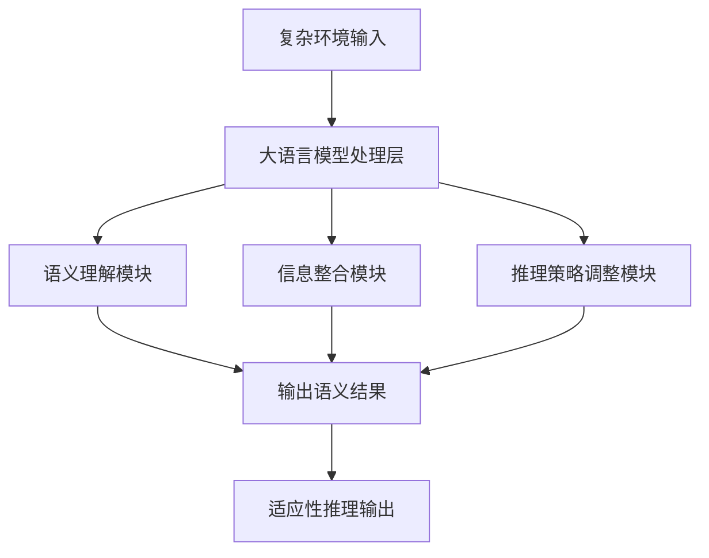

# 大语言模型在复杂环境适应性推理中的表现

> 关键词：大语言模型、复杂环境、适应性推理、推理表现、自然语言处理

> 摘要：本文聚焦于大语言模型在复杂环境适应性推理中的表现。首先介绍了研究的背景、目的、预期读者等内容。接着阐述了大语言模型、复杂环境和适应性推理的核心概念及其联系，给出了相关的原理和架构示意图以及流程图。详细讲解了大语言模型进行适应性推理的核心算法原理，并以Python代码示例说明。通过数学模型和公式深入剖析推理过程，并举例解释。结合项目实战，展示代码实际案例并进行详细解读。探讨了大语言模型在不同实际应用场景中的表现，推荐了学习、开发相关的工具和资源，包括书籍、在线课程、开发工具等。最后总结了大语言模型在复杂环境适应性推理方面的未来发展趋势与挑战，还给出了常见问题解答和扩展阅读参考资料。

## 1. 背景介绍 
### 1.1 目的和范围
随着人工智能技术的飞速发展，大语言模型如GPT - 3、ChatGPT等在自然语言处理领域取得了显著的成果。然而，现实世界中的环境往往是复杂多变的，大语言模型在这种复杂环境下进行适应性推理的能力备受关注。本研究的目的在于深入探讨大语言模型在复杂环境适应性推理中的表现，分析其优势和局限性，为进一步提升大语言模型的性能提供理论和实践依据。研究范围涵盖了不同类型的复杂环境，包括语义复杂、信息不确定、多模态信息融合等环境，以及多种常见的大语言模型。

### 1.2 预期读者
本文预期读者包括人工智能领域的研究人员、自然语言处理工程师、对大语言模型感兴趣的开发者以及相关专业的学生。对于研究人员，本文可以为他们的研究提供新的思路和方向；对于工程师和开发者，有助于他们在实际项目中更好地应用大语言模型；对于学生，则可以帮助他们了解大语言模型在复杂环境中的应用和挑战。

### 1.3 文档结构概述
本文将按照以下结构进行阐述：首先介绍相关核心概念及其联系，为后续内容奠定基础；接着讲解大语言模型进行适应性推理的核心算法原理和具体操作步骤，并给出Python代码示例；通过数学模型和公式进一步深入分析推理过程，并举例说明；结合实际项目，展示代码实现并进行详细解读；探讨大语言模型在不同实际应用场景中的表现；推荐相关的学习、开发工具和资源；最后总结未来发展趋势与挑战，给出常见问题解答和扩展阅读参考资料。

### 1.4 术语表
#### 1.4.1 核心术语定义
- **大语言模型**：是一种基于深度学习的人工智能模型，通过在大规模文本数据上进行训练，学习语言的模式和规律，能够生成自然语言文本、回答问题、进行对话等。
- **复杂环境**：指的是具有多种不确定因素、信息复杂、语义模糊或需要多模态信息融合的环境。例如，在一个包含文本、图像和语音的场景中，或者在一个需要理解隐喻、双关语等复杂语义的文本环境中。
- **适应性推理**：大语言模型根据复杂环境中的信息和任务要求，灵活调整推理策略和方法，以得出合理结论的过程。

#### 1.4.2 相关概念解释
- **自然语言处理**：是人工智能的一个重要分支，研究如何让计算机理解、处理和生成自然语言。大语言模型是自然语言处理领域的重要技术手段。
- **深度学习**：是一种基于人工神经网络的机器学习方法，通过多层神经网络自动学习数据中的特征和模式。大语言模型通常采用深度学习技术进行训练。

#### 1.4.3 缩略词列表
- **NLP**：Natural Language Processing，自然语言处理
- **LLM**：Large Language Model，大语言模型

## 2. 核心概念与联系 

### 核心概念原理
#### 大语言模型
大语言模型通常基于Transformer架构，这是一种具有多头自注意力机制的神经网络结构。Transformer架构使得模型能够捕捉文本中不同位置之间的依赖关系，从而更好地理解文本的语义。在训练过程中，大语言模型使用大规模的无监督学习方法，通过预测下一个单词或句子来学习语言的模式和规律。

#### 复杂环境
复杂环境的特点在于其不确定性和多样性。语义复杂环境可能包含模糊的词汇、隐喻、双关语等，需要模型具备更高的语义理解能力。信息不确定环境中，输入的信息可能不完整、不准确或存在噪声，模型需要能够处理这些不确定性。多模态信息融合环境则要求模型能够同时处理文本、图像、语音等多种模态的信息。

#### 适应性推理
适应性推理要求大语言模型能够根据不同的复杂环境动态调整推理策略。例如，在语义复杂环境中，模型可能需要进行多次推理和验证，以确保对语义的准确理解；在信息不确定环境中，模型需要进行概率推理，给出不同可能性的结果。

### 架构的文本示意图
```plaintext
              +---------------------+
              |   复杂环境输入    |
              +---------------------+
                        |
                        v
              +---------------------+
              |  大语言模型处理层  |
              |  - 语义理解模块    |
              |  - 信息整合模块    |
              |  - 推理策略调整模块|
              +---------------------+
                        |
                        v
              +---------------------+
              |  适应性推理输出    |
              +---------------------+
```

### Mermaid流程图


## 3. 核心算法原理 & 具体操作步骤 

### 核心算法原理
大语言模型进行适应性推理的核心算法主要基于Transformer架构的自注意力机制和预训练 - 微调范式。在预训练阶段，模型在大规模无监督数据上学习语言的通用模式和规律。在微调阶段，模型根据特定的任务和复杂环境进行调整。

自注意力机制允许模型在处理每个位置的输入时，关注输入序列中的其他位置，从而捕捉全局信息。具体来说，对于输入序列 $X = [x_1, x_2,..., x_n]$，自注意力机制计算每个位置的表示 $h_i$ 如下：

1. 计算查询（Query）、键（Key）和值（Value）向量：
   - $Q_i = W_Q x_i$
   - $K_i = W_K x_i$
   - $V_i = W_V x_i$
   其中 $W_Q$、$W_K$ 和 $W_V$ 是可学习的权重矩阵。

2. 计算注意力分数：
   - $s_{ij} = \frac{Q_i^T K_j}{\sqrt{d_k}}$
   其中 $d_k$ 是查询和键向量的维度。

3. 计算注意力权重：
   - $a_{ij} = \frac{\exp(s_{ij})}{\sum_{k=1}^{n} \exp(s_{ik})}$

4. 计算输出表示：
   - $h_i = \sum_{j=1}^{n} a_{ij} V_j$

### 具体操作步骤
#### 步骤1：数据预处理
将复杂环境中的输入数据进行清洗、分词等预处理操作，将其转换为模型可以接受的格式。例如，将文本数据分词为单词序列，并将其转换为对应的词向量。

#### 步骤2：模型加载
加载预训练的大语言模型，如GPT - 3或BERT等。

#### 步骤3：适应性推理
根据输入数据和任务要求，调整模型的推理策略。例如，在语义复杂环境中，可以增加推理的迭代次数；在信息不确定环境中，可以采用概率推理方法。

#### 步骤4：结果输出
将模型的推理结果进行后处理，如将词向量转换为文本，输出最终的推理结果。

### Python代码示例
```python
import torch
from transformers import GPT2LMHeadModel, GPT2Tokenizer

# 加载预训练的模型和分词器
tokenizer = GPT2Tokenizer.from_pretrained('gpt2')
model = GPT2LMHeadModel.from_pretrained('gpt2')

# 输入数据
input_text = "在一个复杂的森林环境中，有一只动物，它的脚印很大，毛发是棕色的，这可能是什么动物？"
input_ids = tokenizer.encode(input_text, return_tensors='pt')

# 进行推理
output = model.generate(input_ids, max_length=100, num_beams=5, no_repeat_ngram_size=2, early_stopping=True)

# 输出结果
output_text = tokenizer.decode(output[0], skip_special_tokens=True)
print(output_text)
```

## 4. 数学模型和公式 & 详细讲解 & 举例说明 

### 数学模型和公式
#### 语言模型概率计算
大语言模型本质上是一个语言概率模型，它可以计算给定输入序列 $x_1, x_2,..., x_n$ 下，下一个单词 $x_{n+1}$ 的概率：

$$P(x_{n+1} | x_1, x_2,..., x_n)$$

在Transformer架构中，这个概率可以通过模型的输出层的softmax函数计算得到：

$$P(x_{n+1} | x_1, x_2,..., x_n) = \frac{\exp(z_{x_{n+1}})}{\sum_{i=1}^{|V|} \exp(z_i)}$$

其中 $z_i$ 是模型输出层的第 $i$ 个神经元的输出，$|V|$ 是词汇表的大小。

#### 注意力机制的数学表示
如前面所述，自注意力机制的计算过程可以用以下公式表示：

1. 查询、键和值向量的计算：
   - $Q = XW_Q$
   - $K = XW_K$
   - $V = XW_V$
   其中 $X$ 是输入序列的矩阵表示。

2. 注意力分数的计算：
   - $S = \frac{QK^T}{\sqrt{d_k}}$

3. 注意力权重的计算：
   - $A = \text{softmax}(S)$

4. 输出表示的计算：
   - $H = AV$

### 详细讲解
语言模型概率计算的公式描述了模型如何根据输入序列预测下一个单词的概率。softmax函数将模型输出层的原始分数转换为概率分布，使得所有单词的概率之和为1。注意力机制的公式则描述了模型如何在处理每个位置的输入时，关注输入序列中的其他位置。通过计算注意力分数和权重，模型可以动态地调整每个位置的输入对当前位置的影响。

### 举例说明
假设输入序列为 "The cat is on the mat"，词汇表大小为10000。模型的输出层有10000个神经元，分别对应词汇表中的每个单词。对于预测下一个单词的任务，模型会计算每个单词的概率。例如，假设 "floor" 这个单词对应的输出层神经元的分数为 $z_{floor} = 3$，其他单词的分数总和为 $\sum_{i \neq floor} \exp(z_i) = 100$，则 "floor" 这个单词的概率为：

$$P(\text{floor} | \text{The cat is on the mat}) = \frac{\exp(3)}{\exp(3) + 100} \approx 0.047$$

在注意力机制中，假设输入序列的长度为 $n = 6$，查询、键和值向量的维度为 $d_k = 64$。则查询矩阵 $Q$ 的形状为 $(6, 64)$，键矩阵 $K$ 的形状为 $(6, 64)$，值矩阵 $V$ 的形状为 $(6, 64)$。注意力分数矩阵 $S$ 的形状为 $(6, 6)$，注意力权重矩阵 $A$ 的形状也为 $(6, 6)$，输出表示矩阵 $H$ 的形状为 $(6, 64)$。

## 5. 项目实战：代码实际案例和详细解释说明 

### 5.1  开发环境搭建
#### 操作系统
可以选择Windows、Linux或macOS操作系统。建议使用Linux系统，因为它在开发和部署方面具有更好的稳定性和兼容性。

#### Python环境
安装Python 3.7及以上版本。可以使用Anaconda来管理Python环境，创建一个新的虚拟环境：

```bash
conda create -n llm_env python=3.8
conda activate llm_env
```

#### 依赖库安装
安装必要的依赖库，如`transformers`、`torch`等：

```bash
pip install transformers torch
```

### 5.2  源代码详细实现和代码解读
以下是一个更完整的代码示例，用于在复杂环境中进行适应性推理：

```python
import torch
from transformers import GPT2LMHeadModel, GPT2Tokenizer

# 加载预训练的模型和分词器
tokenizer = GPT2Tokenizer.from_pretrained('gpt2')
model = GPT2LMHeadModel.from_pretrained('gpt2')

# 定义复杂环境输入
input_text = "在一个神秘的城堡里，有一个房间，里面摆满了古老的书籍和奇怪的器具。突然，灯光闪烁，传来一阵低沉的声音。请推测接下来可能发生的事情。"

# 数据预处理
input_ids = tokenizer.encode(input_text, return_tensors='pt')

# 进行推理
output = model.generate(
    input_ids,
    max_length=200,  # 生成文本的最大长度
    num_beams=5,  # 束搜索的束宽
    no_repeat_ngram_size=2,  # 避免重复的n-gram
    early_stopping=True  # 提前停止搜索
)

# 结果输出
output_text = tokenizer.decode(output[0], skip_special_tokens=True)
print("推理结果：")
print(output_text)
```

### 代码解读与分析
#### 加载模型和分词器
```python
tokenizer = GPT2Tokenizer.from_pretrained('gpt2')
model = GPT2LMHeadModel.from_pretrained('gpt2')
```
这两行代码分别加载了GPT - 2的分词器和语言模型。分词器用于将输入文本转换为模型可以接受的词向量序列，模型则用于进行推理和生成文本。

#### 数据预处理
```python
input_ids = tokenizer.encode(input_text, return_tensors='pt')
```
这行代码将输入文本进行分词，并将分词结果转换为对应的词向量序列。`return_tensors='pt'` 表示返回PyTorch张量。

#### 进行推理
```python
output = model.generate(
    input_ids,
    max_length=200,
    num_beams=5,
    no_repeat_ngram_size=2,
    early_stopping=True
)
```
`model.generate()` 方法用于生成文本。`max_length` 参数指定了生成文本的最大长度；`num_beams` 参数是束搜索的束宽，用于在生成过程中保留多个可能的候选序列；`no_repeat_ngram_size` 参数用于避免生成重复的n - gram；`early_stopping` 参数表示在达到一定条件时提前停止搜索。

#### 结果输出
```python
output_text = tokenizer.decode(output[0], skip_special_tokens=True)
print("推理结果：")
print(output_text)
```
这两行代码将模型生成的词向量序列转换为文本，并输出推理结果。`skip_special_tokens=True` 表示跳过特殊的标记，如开始标记和结束标记。

## 6. 实际应用场景 
### 智能客服
在智能客服场景中，用户的问题往往具有多样性和复杂性。大语言模型可以根据用户的问题，结合知识库和历史对话信息，进行适应性推理，给出准确的回答。例如，当用户询问产品的使用方法时，模型可以根据产品的特点和用户的使用场景，提供详细的操作步骤；当用户的问题存在语义模糊时，模型可以通过追问等方式进一步明确问题，然后进行推理回答。

### 智能写作
在智能写作领域，大语言模型可以根据不同的写作任务和要求，如文章类型、风格、主题等，进行适应性推理，生成高质量的文本。例如，在撰写新闻报道时，模型可以根据新闻事件的背景和关键信息，组织语言，撰写客观、准确的报道；在创作小说时，模型可以根据设定的情节和人物性格，推理出合理的情节发展和对话内容。

### 医疗诊断辅助
在医疗诊断辅助场景中，医生提供的患者信息可能不完整或存在不确定性。大语言模型可以结合医学知识图谱和患者的病历信息，进行适应性推理，为医生提供可能的诊断结果和治疗建议。例如，当患者只提供了部分症状时，模型可以根据这些症状和常见疾病的特征，推理出可能的疾病，并列出需要进一步检查的项目。

### 金融风险评估
在金融领域，评估客户的信用风险和投资风险是一个复杂的任务。大语言模型可以分析客户的财务报表、信用记录、市场信息等多源数据，进行适应性推理，评估客户的风险水平。例如，通过分析企业的财务文本数据，模型可以推理出企业的盈利能力、偿债能力和发展前景，为金融机构提供决策支持。

## 7. 工具和资源推荐
### 7.1 学习资源推荐
#### 7.1.1 书籍推荐
- 《深度学习》（Deep Learning）：由Ian Goodfellow、Yoshua Bengio和Aaron Courville撰写，是深度学习领域的经典教材，涵盖了神经网络、卷积神经网络、循环神经网络等基础知识，对理解大语言模型的原理有很大帮助。
- 《自然语言处理入门》：作者何晗，本书系统介绍了自然语言处理的基本概念、方法和技术，包括分词、词性标注、命名实体识别等，适合初学者入门。
- 《Attention Is All You Need》相关书籍解读：由于Transformer架构是大语言模型的核心，深入理解Transformer的原论文《Attention Is All You Need》及其相关解读书籍可以帮助读者掌握大语言模型的关键技术。

#### 7.1.2 在线课程
- Coursera上的“Natural Language Processing Specialization”：由斯坦福大学的教授授课，涵盖了自然语言处理的多个方面，包括词向量、循环神经网络、Transformer等，课程内容丰富，适合系统学习。
- edX上的“Introduction to Deep Learning”：该课程介绍了深度学习的基本概念和方法，对大语言模型的基础理论有详细讲解，同时提供实践项目，帮助学员巩固所学知识。
- 吴恩达的深度学习系列课程：在网易云课堂等平台可以找到，课程内容深入浅出，对深度学习的各个方面进行了全面的介绍，包括大语言模型的相关技术。

#### 7.1.3 技术博客和网站
- Hugging Face博客：Hugging Face是大语言模型领域的重要平台，其博客上有很多关于大语言模型的最新研究成果、技术应用和开发经验分享。
- arXiv：是一个预印本平台，上面有大量关于人工智能、自然语言处理等领域的最新研究论文，及时关注可以了解大语言模型的前沿动态。
- Medium上的人工智能相关博客：有很多人工智能领域的专家和开发者在Medium上分享他们的研究和实践经验，其中不乏关于大语言模型的优质文章。

### 7.2 开发工具框架推荐
#### 7.2.1 IDE和编辑器
- PyCharm：是一款专门为Python开发设计的集成开发环境，具有强大的代码编辑、调试、代码分析等功能，适合开发大语言模型相关项目。
- Jupyter Notebook：是一个交互式的开发环境，支持Python、R等多种编程语言，方便进行代码编写、实验和文档记录，常用于大语言模型的研究和开发。
- Visual Studio Code：是一款轻量级的代码编辑器，具有丰富的插件生态系统，可以安装Python相关插件，提供良好的开发体验。

#### 7.2.2 调试和性能分析工具
- TensorBoard：是TensorFlow提供的可视化工具，可以用于监控模型的训练过程，如损失函数的变化、准确率的变化等，还可以可视化模型的结构和参数分布。
- PyTorch Profiler：PyTorch自带的性能分析工具，可以帮助开发者分析模型的性能瓶颈，如计算时间、内存使用等，从而进行优化。
- NVIDIA Nsight Systems：是NVIDIA提供的性能分析工具，适用于GPU加速的深度学习模型，可以深入分析GPU的使用情况，提高模型的运行效率。

#### 7.2.3 相关框架和库
- Hugging Face Transformers：是一个开源的自然语言处理库，提供了多种预训练的大语言模型，如GPT - 2、BERT、XLNet等，同时支持模型的微调、推理和部署，大大简化了大语言模型的开发过程。
- PyTorch：是一个开源的深度学习框架，具有动态图机制，易于使用和调试，广泛应用于大语言模型的研究和开发。
- TensorFlow：是另一个流行的深度学习框架，具有强大的分布式训练和部署能力，也可以用于大语言模型的开发。

### 7.3 相关论文著作推荐
#### 7.3.1 经典论文
- 《Attention Is All You Need》：提出了Transformer架构，为大语言模型的发展奠定了基础。
- 《BERT: Pre-training of Deep Bidirectional Transformers for Language Understanding》：介绍了BERT模型，开创了预训练 - 微调的范式，在自然语言处理任务中取得了显著的成果。
- 《Generative Pretrained Transformer 3 (GPT - 3): Language Models are Few - Shot Learners》：详细介绍了GPT - 3模型，展示了大语言模型在少样本学习方面的强大能力。

#### 7.3.2 最新研究成果
- 关注ACL（Association for Computational Linguistics）、EMNLP（Conference on Empirical Methods in Natural Language Processing）等自然语言处理领域的顶级会议，这些会议上的论文代表了大语言模型的最新研究成果。
- 在arXiv上搜索关于大语言模型的最新预印本论文，了解研究人员在模型架构、训练方法、应用场景等方面的创新。

#### 7.3.3 应用案例分析
- 《Natural Language Processing with Python Cookbook》：书中包含了很多自然语言处理的应用案例，其中不乏大语言模型在不同场景下的应用实例，通过分析这些案例可以学习如何将大语言模型应用到实际项目中。
- 一些知名科技公司的技术博客，如Google AI Blog、OpenAI Blog等，会分享他们在大语言模型应用方面的实践经验和案例分析。

## 8. 总结：未来发展趋势与挑战
### 未来发展趋势
#### 模型架构创新
未来大语言模型的架构可能会不断创新，以提高模型的性能和效率。例如，可能会出现更高效的注意力机制，减少模型的计算复杂度；或者将Transformer架构与其他神经网络架构相结合，发挥各自的优势。

#### 多模态融合
随着现实世界中信息的多样性增加，大语言模型将更加注重多模态信息的融合，如文本、图像、语音等。通过融合多模态信息，模型可以更好地理解复杂环境，进行更准确的适应性推理。

#### 个性化和定制化
不同的用户和应用场景对大语言模型的需求可能不同。未来的大语言模型将更加注重个性化和定制化，能够根据用户的需求和偏好进行调整，提供更符合用户期望的推理结果。

#### 可解释性增强
目前大语言模型的决策过程往往是黑盒的，难以解释。未来的研究将致力于提高大语言模型的可解释性，让用户能够理解模型的推理过程和决策依据，增强用户对模型的信任。

### 挑战
#### 数据质量和隐私问题
大语言模型的训练需要大量的数据，但数据的质量和隐私问题是一个挑战。低质量的数据可能会影响模型的性能，而数据隐私问题则涉及到用户的个人信息保护。如何在保证数据质量的同时，保护用户的隐私是一个亟待解决的问题。

#### 计算资源需求
大语言模型的训练和推理需要大量的计算资源，如GPU、TPU等。这不仅增加了开发和部署的成本，也对能源消耗提出了挑战。如何降低大语言模型的计算资源需求，提高模型的效率是一个重要的研究方向。

#### 伦理和社会影响
大语言模型的广泛应用可能会带来一些伦理和社会问题，如虚假信息传播、偏见和歧视等。如何引导大语言模型的正确使用，避免其带来的负面影响，是一个需要全社会共同关注和解决的问题。

## 9. 附录：常见问题与解答
### 问题1：大语言模型在复杂环境中的推理准确率如何提高？
解答：可以从以下几个方面提高大语言模型在复杂环境中的推理准确率：
- 增加训练数据的多样性和质量，让模型学习更多的语言模式和知识。
- 采用更先进的模型架构和训练方法，如改进的注意力机制、强化学习等。
- 结合外部知识图谱，为模型提供更多的背景知识，帮助其进行推理。
- 进行模型微调，根据具体的复杂环境和任务对模型进行优化。

### 问题2：大语言模型在处理多模态信息时存在哪些挑战？
解答：大语言模型在处理多模态信息时存在以下挑战：
- 不同模态信息的表示和融合困难，需要找到合适的方法将文本、图像、语音等信息统一表示。
- 多模态信息之间的语义关联难以捕捉，模型需要理解不同模态信息之间的内在联系。
- 数据标注和训练成本高，多模态数据的标注需要更多的人力和时间，训练模型也需要更多的计算资源。

### 问题3：如何评估大语言模型在复杂环境适应性推理中的表现？
解答：可以从以下几个方面评估大语言模型在复杂环境适应性推理中的表现：
- 准确率：评估模型推理结果的正确性，如在问答任务中，判断模型的回答是否准确。
- 召回率：衡量模型能够覆盖的正确答案的比例。
- F1值：综合考虑准确率和召回率，是一个更全面的评估指标。
- 可解释性：评估模型的推理过程是否可解释，用户能否理解模型的决策依据。
- 鲁棒性：测试模型在面对噪声、不确定信息等复杂情况时的稳定性和可靠性。

## 10. 扩展阅读 & 参考资料
### 扩展阅读
- 《Artificial Intelligence: A Modern Approach》：这本书是人工智能领域的经典教材，全面介绍了人工智能的各个方面，包括自然语言处理、机器学习、知识表示等，对于深入理解大语言模型的背景和相关技术有很大帮助。
- 《The Master Algorithm: How the Quest for the Ultimate Learning Machine Will Remake Our World》：探讨了机器学习的发展趋势和未来的学习算法，对大语言模型的发展方向有一定的启示。

### 参考资料
- Vaswani, A., Shazeer, N., Parmar, N., et al. (2017). Attention Is All You Need. Advances in Neural Information Processing Systems.
- Devlin, J., Chang, M. W., Lee, K., et al. (2019). BERT: Pre-training of Deep Bidirectional Transformers for Language Understanding. Proceedings of the 2019 Conference of the North American Chapter of the Association for Computational Linguistics: Human Language Technologies.
- Brown, T. B., Mann, B., Ryder, N., et al. (2020). Language Models are Few - Shot Learners. Advances in Neural Information Processing Systems.

作者：AI天才研究院/AI Genius Institute & 禅与计算机程序设计艺术 /Zen And The Art of Computer Programming