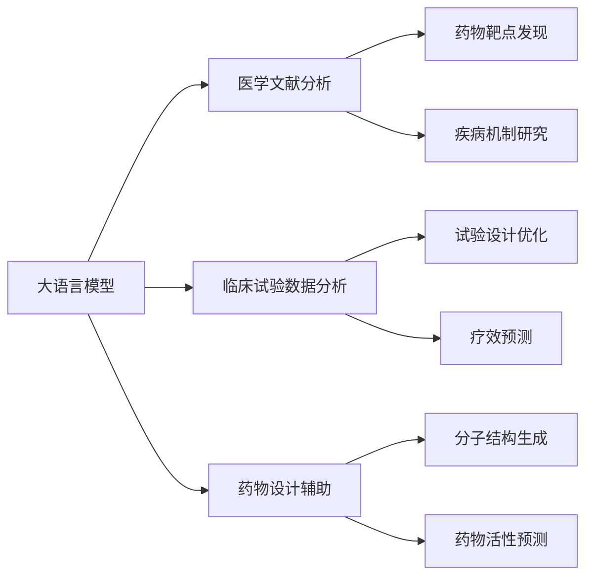

# 大语言模型在新药研发中的推理应用研究

> 关键词：大语言模型、新药研发、推理应用、药物发现、人工智能

> 摘要：本文聚焦于大语言模型在新药研发中的推理应用。随着人工智能技术的飞速发展，大语言模型展现出强大的自然语言处理和推理能力。新药研发是一个复杂且高成本、长周期的过程，大语言模型的引入为其带来了新的机遇和变革。文章深入探讨大语言模型的核心概念、相关算法原理，通过数学模型和公式进行理论支撑，结合项目实战案例展示其在新药研发中的具体应用，分析实际应用场景，推荐相关学习资源、开发工具和论文著作，最后总结未来发展趋势与挑战，以期为大语言模型在新药研发领域的进一步应用提供全面的参考和指导。

## 1. 背景介绍 
### 1.1 目的和范围
新药研发是医药领域的核心工作，旨在寻找和开发能够有效治疗疾病的新型药物。传统的新药研发过程面临诸多挑战，如高成本、长周期、低成功率等。大语言模型作为人工智能领域的重要成果，具有强大的语言理解、知识整合和推理能力。本研究的目的在于探索大语言模型在新药研发各个环节的推理应用，包括药物靶点发现、药物设计、临床试验设计等，以提高新药研发的效率和成功率。研究范围涵盖大语言模型的基本原理、相关算法、在新药研发中的具体应用场景以及未来发展趋势等方面。

### 1.2 预期读者
本文预期读者包括医药研发领域的科研人员、人工智能领域的研究人员和工程师、对新药研发和人工智能交叉领域感兴趣的学者以及相关专业的学生。对于医药研发人员，本文将提供大语言模型在新药研发中应用的新思路和方法；对于人工智能领域的人员，有助于了解医药领域的具体需求和应用场景；对于学生和学者，可作为学习和研究该交叉领域的参考资料。

### 1.3 文档结构概述
本文首先介绍大语言模型和新药研发的背景知识，包括相关术语和概念。接着阐述大语言模型的核心概念、架构和工作原理，并通过流程图展示其工作流程。然后详细讲解大语言模型的核心算法原理，结合Python源代码进行说明，同时给出相关的数学模型和公式，并举例说明。在项目实战部分，展示大语言模型在新药研发中的具体代码实现和详细解读。之后分析大语言模型在新药研发中的实际应用场景。推荐相关的学习资源、开发工具和论文著作。最后总结大语言模型在新药研发中的未来发展趋势与挑战，并提供常见问题解答和扩展阅读参考资料。

### 1.4 术语表
#### 1.4.1 核心术语定义
- **大语言模型**：基于深度学习的人工智能模型，通过在大规模文本数据上进行训练，能够处理自然语言任务，如文本生成、问答系统、知识推理等。
- **新药研发**：从药物靶点的发现和验证，到药物的设计、开发、临床试验，最终获得批准上市的一系列过程。
- **药物靶点**：药物在体内作用的特定分子，如蛋白质、核酸等，药物与靶点的相互作用是药物发挥疗效的基础。
- **药物设计**：根据药物靶点的结构和功能信息，设计出能够与靶点特异性结合并产生预期生物活性的药物分子。
- **临床试验**：在人体上进行的药物研究，以评估药物的安全性和有效性。

#### 1.4.2 相关概念解释
- **自然语言处理**：人工智能的一个分支，研究如何让计算机理解、处理和生成自然语言。大语言模型是自然语言处理领域的重要成果之一。
- **深度学习**：一种基于人工神经网络的机器学习方法，通过多层神经网络自动学习数据中的特征和模式。大语言模型通常采用深度学习技术进行训练。
- **知识图谱**：一种表示实体及其之间关系的语义网络，可用于知识的存储、管理和推理。在新药研发中，知识图谱可用于整合和表示药物相关的知识。

#### 1.4.3 缩略词列表
- **AI**：Artificial Intelligence，人工智能
- **NLP**：Natural Language Processing，自然语言处理
- **DL**：Deep Learning，深度学习
- **ML**：Machine Learning，机器学习

## 2. 核心概念与联系 

### 大语言模型的核心概念
大语言模型是基于Transformer架构的深度学习模型，通过在大规模文本数据上进行无监督学习，学习语言的统计规律和语义信息。其核心原理是利用注意力机制来捕捉文本中不同位置之间的依赖关系。

Transformer架构由编码器和解码器组成。编码器负责对输入的文本进行特征提取和表示，解码器则根据编码器的输出生成目标文本。注意力机制允许模型在处理每个位置的输入时，能够动态地关注其他位置的信息，从而更好地理解文本的上下文。

### 大语言模型与新药研发的联系
大语言模型在新药研发中具有重要的应用价值。它可以帮助科研人员从海量的医学文献、临床试验数据、药物研发报告等文本信息中提取有价值的知识和信息，进行知识推理和整合。例如，通过分析医学文献中的药物靶点信息和疾病相关知识，大语言模型可以辅助药物靶点的发现和验证；在药物设计阶段，大语言模型可以根据药物靶点的结构和功能信息，生成可能的药物分子结构；在临床试验设计方面，大语言模型可以分析历史临床试验数据，提供合理的试验设计方案。

### 文本示意图
大语言模型在新药研发中的应用可以用以下示意图表示：

```plaintext
大语言模型
|
|-- 医学文献分析
|   |-- 药物靶点发现
|   |-- 疾病机制研究
|
|-- 临床试验数据分析
|   |-- 试验设计优化
|   |-- 疗效预测
|
|-- 药物设计辅助
|   |-- 分子结构生成
|   |-- 药物活性预测
```

### Mermaid流程图


## 3. 核心算法原理 & 具体操作步骤 

### 核心算法原理 - Transformer架构
Transformer架构是大语言模型的核心，其主要由多头注意力机制（Multi - Head Attention）、前馈神经网络（Feed - Forward Network）和层归一化（Layer Normalization）等组件组成。

#### 多头注意力机制
多头注意力机制允许模型在不同的表示子空间中并行地关注输入序列的不同部分。对于输入序列 $X = [x_1, x_2, \cdots, x_n]$，首先通过线性变换将其投影到查询（Query）、键（Key）和值（Value）三个空间：

$Q = XW^Q$
$K = XW^K$
$V = XW^V$

其中 $W^Q, W^K, W^V$ 是可学习的权重矩阵。然后计算注意力分数：

$\text{Attention}(Q, K, V) = \text{softmax}(\frac{QK^T}{\sqrt{d_k}})V$

其中 $d_k$ 是查询和键的维度。多头注意力机制将输入分成多个头，每个头独立地计算注意力分数，最后将结果拼接并通过线性变换得到最终的输出：

$\text{MultiHead}(Q, K, V) = \text{Concat}(\text{head}_1, \cdots, \text{head}_h)W^O$

其中 $\text{head}_i = \text{Attention}(QW_i^Q, KW_i^K, VW_i^V)$，$h$ 是头的数量，$W^O$ 是可学习的权重矩阵。

#### 前馈神经网络
前馈神经网络由两个线性层和一个非线性激活函数（通常是ReLU）组成：

$\text{FFN}(x) = \text{max}(0, xW_1 + b_1)W_2 + b_2$

其中 $W_1, W_2$ 是权重矩阵，$b_1, b_2$ 是偏置向量。

#### 层归一化
层归一化对输入的每个样本进行归一化处理，使得每个样本的特征具有相同的均值和方差：

$\text{LayerNorm}(x) = \frac{x - \mu}{\sqrt{\sigma^2 + \epsilon}} \odot \gamma + \beta$

其中 $\mu$ 和 $\sigma^2$ 是输入的均值和方差，$\epsilon$ 是一个小的常数，$\gamma$ 和 $\beta$ 是可学习的参数。

### Python源代码实现
以下是一个简化的Transformer编码器层的Python实现：

```python
import torch
import torch.nn as nn
import torch.nn.functional as F

class MultiHeadAttention(nn.Module):
    def __init__(self, input_dim, num_heads):
        super(MultiHeadAttention, self).__init__()
        self.input_dim = input_dim
        self.num_heads = num_heads
        self.head_dim = input_dim // num_heads

        self.qkv_proj = nn.Linear(input_dim, 3 * input_dim)
        self.out_proj = nn.Linear(input_dim, input_dim)

    def forward(self, x):
        batch_size, seq_len, input_dim = x.size()
        qkv = self.qkv_proj(x)
        q, k, v = qkv.chunk(3, dim=-1)

        q = q.view(batch_size, seq_len, self.num_heads, self.head_dim).transpose(1, 2)
        k = k.view(batch_size, seq_len, self.num_heads, self.head_dim).transpose(1, 2)
        v = v.view(batch_size, seq_len, self.num_heads, self.head_dim).transpose(1, 2)

        attn_scores = torch.matmul(q, k.transpose(-2, -1)) / (self.head_dim ** 0.5)
        attn_probs = F.softmax(attn_scores, dim=-1)
        attn_output = torch.matmul(attn_probs, v)

        attn_output = attn_output.transpose(1, 2).contiguous().view(batch_size, seq_len, input_dim)
        output = self.out_proj(attn_output)
        return output

class FeedForward(nn.Module):
    def __init__(self, input_dim, hidden_dim):
        super(FeedForward, self).__init__()
        self.fc1 = nn.Linear(input_dim, hidden_dim)
        self.fc2 = nn.Linear(hidden_dim, input_dim)
        self.relu = nn.ReLU()

    def forward(self, x):
        x = self.fc1(x)
        x = self.relu(x)
        x = self.fc2(x)
        return x

class TransformerEncoderLayer(nn.Module):
    def __init__(self, input_dim, num_heads, hidden_dim):
        super(TransformerEncoderLayer, self).__init__()
        self.self_attn = MultiHeadAttention(input_dim, num_heads)
        self.feed_forward = FeedForward(input_dim, hidden_dim)
        self.norm1 = nn.LayerNorm(input_dim)
        self.norm2 = nn.LayerNorm(input_dim)

    def forward(self, x):
        attn_output = self.self_attn(x)
        x = self.norm1(x + attn_output)
        ff_output = self.feed_forward(x)
        x = self.norm2(x + ff_output)
        return x
```

### 具体操作步骤
1. **数据预处理**：将医学文献、临床试验数据等文本数据进行清洗、分词、编码等预处理操作，将其转换为适合大语言模型输入的格式。
2. **模型训练**：使用大规模的文本数据对大语言模型进行无监督学习，训练模型的参数。
3. **微调**：在新药研发的特定任务上对预训练的大语言模型进行微调，使其适应具体的应用场景。
4. **推理应用**：将处理好的数据输入到微调后的大语言模型中，进行药物靶点发现、药物设计、临床试验设计等推理任务。

## 4. 数学模型和公式 & 详细讲解 & 举例说明 

### 损失函数
在大语言模型的训练过程中，通常使用交叉熵损失函数来衡量模型预测结果与真实标签之间的差异。对于一个语言模型，给定输入序列 $x = [x_1, x_2, \cdots, x_n]$ 和对应的真实标签序列 $y = [y_1, y_2, \cdots, y_n]$，交叉熵损失函数定义为：

$$L = -\frac{1}{n}\sum_{i = 1}^{n}\log p(y_i|x_1, \cdots, x_i)$$

其中 $p(y_i|x_1, \cdots, x_i)$ 是模型预测第 $i$ 个位置的标签为 $y_i$ 的概率。

### 优化算法
常用的优化算法是随机梯度下降（SGD）及其变种，如Adam优化算法。Adam优化算法结合了动量和自适应学习率的思想，能够更有效地更新模型的参数。其更新公式如下：

$m_{t + 1} = \beta_1m_t + (1 - \beta_1)g_t$
$v_{t + 1} = \beta_2v_t + (1 - \beta_2)g_t^2$

$\hat{m}_{t + 1} = \frac{m_{t + 1}}{1 - \beta_1^{t + 1}}$
$\hat{v}_{t + 1} = \frac{v_{t + 1}}{1 - \beta_2^{t + 1}}$

$\theta_{t + 1} = \theta_t - \frac{\alpha}{\sqrt{\hat{v}_{t + 1}} + \epsilon}\hat{m}_{t + 1}$

其中 $g_t$ 是当前步骤的梯度，$m_t$ 和 $v_t$ 分别是梯度的一阶矩估计和二阶矩估计，$\beta_1$ 和 $\beta_2$ 是衰减率，$\alpha$ 是学习率，$\epsilon$ 是一个小的常数，$\theta_t$ 是模型的参数。

### 举例说明
假设我们有一个简单的语言模型，输入序列为 $x = [\text{“The”}, \text{“dog”}, \text{“runs”}]$，真实标签序列为 $y = [\text{“runs”}, \text{“fast”}, \text{“in”}]$。模型预测每个位置的标签概率如下：

$p(\text{“runs”}|\text{“The”}, \text{“dog”}) = 0.8$
$p(\text{“fast”}|\text{“The”}, \text{“dog”}, \text{“runs”}) = 0.6$
$p(\text{“in”}|\text{“The”}, \text{“dog”}, \text{“runs”}, \text{“fast”}) = 0.7$

则交叉熵损失为：

$L = -\frac{1}{3}(\log 0.8 + \log 0.6 + \log 0.7) \approx 0.39$

## 5. 项目实战：代码实际案例和详细解释说明 

### 5.1  开发环境搭建
1. **安装Python**：推荐使用Python 3.7及以上版本。
2. **安装深度学习框架**：使用PyTorch作为深度学习框架，可以通过以下命令安装：
```sh
pip install torch torchvision
```
3. **安装相关库**：安装自然语言处理相关的库，如`transformers`：
```sh
pip install transformers
```

### 5.2  源代码详细实现和代码解读
以下是一个使用`transformers`库进行文本生成的简单示例，模拟大语言模型在新药研发中的应用，例如根据给定的疾病描述生成可能的药物靶点信息：

```python
from transformers import GPT2LMHeadModel, GPT2Tokenizer

# 加载预训练的GPT - 2模型和分词器
tokenizer = GPT2Tokenizer.from_pretrained('gpt2')
model = GPT2LMHeadModel.from_pretrained('gpt2')

# 疾病描述
disease_description = "A disease characterized by abnormal cell growth in the lungs."

# 对输入文本进行编码
input_ids = tokenizer.encode(disease_description, return_tensors='pt')

# 生成文本
output = model.generate(input_ids, max_length=100, num_beams=5, no_repeat_ngram_size=2, early_stopping=True)

# 解码生成的文本
generated_text = tokenizer.decode(output[0], skip_special_tokens=True)

print("Generated text:")
print(generated_text)
```

### 5.3  代码解读与分析
1. **加载模型和分词器**：使用`GPT2Tokenizer.from_pretrained('gpt2')`加载预训练的GPT - 2分词器，使用`GPT2LMHeadModel.from_pretrained('gpt2')`加载预训练的GPT - 2语言模型。
2. **输入编码**：使用分词器对疾病描述进行编码，将其转换为模型可以接受的输入格式。
3. **文本生成**：使用`model.generate()`方法生成文本，设置了最大长度、束搜索的束数、避免重复的n - gram大小等参数。
4. **解码输出**：使用分词器对生成的文本进行解码，得到可读的文本。

需要注意的是，这个示例只是一个简单的演示，实际应用中需要对模型进行微调，以适应新药研发的具体任务。

## 