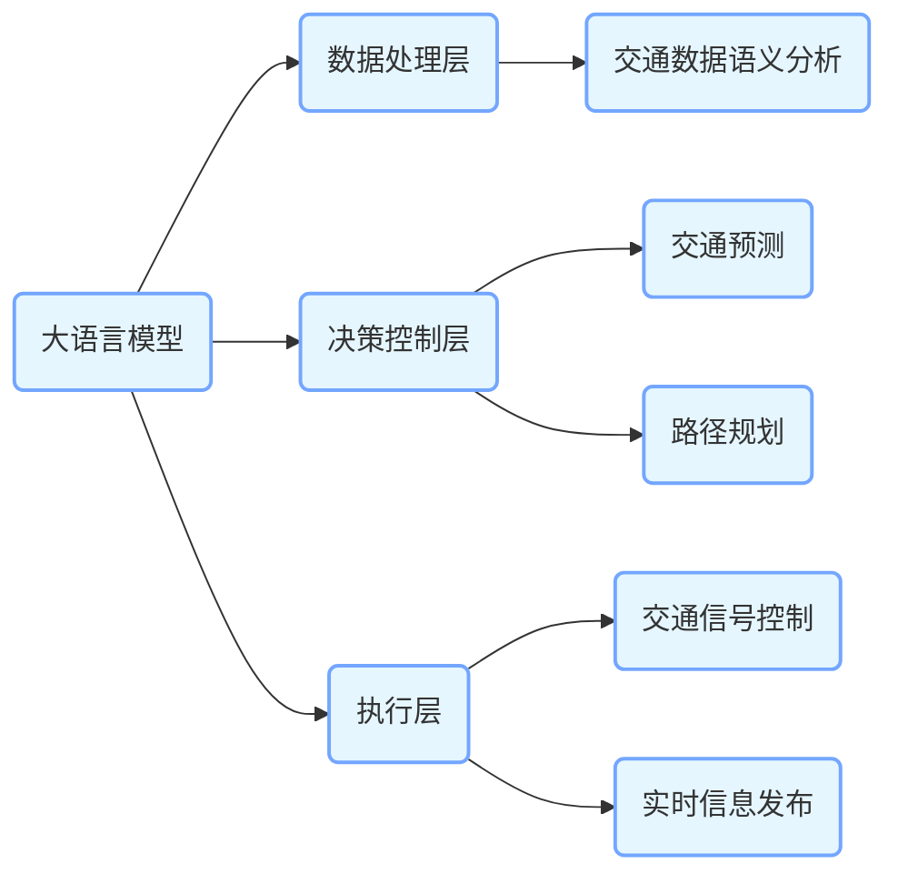

# 大语言模型在智能交通流量优化中的应用探索

> 关键词：大语言模型、智能交通流量优化、交通数据处理、交通预测、路径规划

> 摘要：本文聚焦于大语言模型在智能交通流量优化中的应用探索。首先介绍了研究的背景、目的、预期读者等内容。接着阐述了大语言模型和智能交通流量优化的核心概念及其联系，详细讲解了相关核心算法原理与操作步骤，并给出了数学模型和公式。通过项目实战展示了大语言模型在交通流量优化中的代码实现与分析。探讨了其实际应用场景，推荐了学习资源、开发工具框架以及相关论文著作。最后总结了未来发展趋势与挑战，解答了常见问题，并提供了扩展阅读与参考资料，旨在为大语言模型在智能交通领域的应用提供全面深入的技术指导。

## 1. 背景介绍 
### 1.1 目的和范围
随着城市化进程的加速，交通拥堵问题日益严重，给人们的出行和社会经济发展带来了诸多负面影响。智能交通系统作为解决交通问题的重要手段，不断引入新的技术来提升交通流量的优化效果。大语言模型作为人工智能领域的重要成果，具有强大的语言理解和生成能力，其在智能交通流量优化中的应用潜力巨大。本研究的目的在于探索大语言模型如何应用于智能交通流量优化，包括交通数据处理、交通状况预测、路径规划等方面，以提高交通系统的运行效率和服务质量。研究范围涵盖了大语言模型在智能交通流量优化中的理论基础、算法实现、实际应用案例以及未来发展趋势等方面。

### 1.2 预期读者
本文预期读者包括交通工程领域的研究人员、智能交通系统的开发者、人工智能领域的从业者以及对智能交通和大语言模型应用感兴趣的技术爱好者。通过阅读本文，读者可以了解大语言模型在智能交通流量优化中的基本原理、技术方法和实际应用情况，为相关领域的研究和实践提供参考。

### 1.3 文档结构概述
本文将按照以下结构进行阐述：首先介绍大语言模型和智能交通流量优化的核心概念及其联系；接着详细讲解核心算法原理和具体操作步骤，并给出相关的数学模型和公式；通过项目实战展示大语言模型在智能交通流量优化中的代码实现和详细解释；探讨大语言模型在智能交通中的实际应用场景；推荐学习资源、开发工具框架以及相关论文著作；最后总结未来发展趋势与挑战，解答常见问题，并提供扩展阅读与参考资料。

### 1.4 术语表
#### 1.4.1 核心术语定义
- **大语言模型（Large Language Model）**：基于大规模数据训练得到的深度学习模型，具有强大的语言理解和生成能力，能够处理自然语言文本任务。
- **智能交通系统（Intelligent Transportation System, ITS）**：将先进的信息技术、通信技术、传感器技术、控制技术和计算机技术等有效地集成应用于交通运输管理体系，从而建立起一种在大范围内、全方位发挥作用的实时、准确、高效的综合运输和管理系统。
- **交通流量优化（Traffic Flow Optimization）**：通过各种技术手段和策略，对交通流量进行合理分配和调控，以提高交通系统的运行效率，减少交通拥堵，降低能源消耗和环境污染。
- **交通预测（Traffic Prediction）**：根据历史交通数据和实时交通信息，运用一定的方法和模型，对未来一段时间内的交通状况进行预测，包括交通流量、车速、拥堵程度等。
- **路径规划（Route Planning）**：根据出发地、目的地和交通状况等信息，为出行者规划最优的行驶路径，以节省时间、降低成本和提高出行效率。

#### 1.4.2 相关概念解释
- **深度学习（Deep Learning）**：是一类基于人工神经网络的机器学习技术，通过构建多层神经网络模型，自动从大量数据中学习特征和模式，以实现对数据的分类、预测等任务。
- **自然语言处理（Natural Language Processing, NLP）**：是人工智能领域的一个重要分支，主要研究如何让计算机理解、处理和生成自然语言文本，包括文本分类、情感分析、机器翻译等任务。
- **传感器网络（Sensor Network）**：由大量的传感器节点组成的网络，这些传感器节点可以实时采集各种环境数据，如交通流量、车速、温度、湿度等，并将数据传输到中心节点进行处理和分析。

#### 1.4.3 缩略词列表
- **LLM**：Large Language Model（大语言模型）
- **ITS**：Intelligent Transportation System（智能交通系统）
- **NLP**：Natural Language Processing（自然语言处理）
- **ANN**：Artificial Neural Network（人工神经网络）

## 2. 核心概念与联系 

### 大语言模型原理
大语言模型通常基于Transformer架构，它由多个编码器和解码器层组成。Transformer的核心是自注意力机制（Self - Attention Mechanism），它允许模型在处理输入序列时，动态地关注序列中不同位置的信息。通过多头自注意力（Multi - Head Self - Attention），模型可以从不同的表示子空间中捕捉输入序列的依赖关系。

以GPT（Generative Pretrained Transformer）系列为例，其训练过程分为预训练和微调两个阶段。在预训练阶段，模型在大规模无监督文本数据上进行训练，学习语言的通用模式和语义信息。微调阶段则在特定任务的有监督数据上对模型进行调整，以适应具体的应用需求。

### 智能交通流量优化架构
智能交通流量优化系统通常包括数据采集层、数据处理层、决策控制层和执行层。

数据采集层通过各种传感器（如交通摄像头、地磁传感器、GPS设备等）收集交通流量、车速、车辆位置等实时数据。数据处理层对采集到的数据进行清洗、预处理和特征提取，以便后续分析。决策控制层根据处理后的数据，运用各种算法和模型进行交通预测、路径规划和交通信号控制等决策。执行层将决策结果转化为实际的控制动作，如调整交通信号灯的时间、发布实时交通信息等。

### 大语言模型与智能交通流量优化的联系
大语言模型可以应用于智能交通流量优化的多个环节。在数据处理层，大语言模型可以对交通文本数据（如交通新闻、社交媒体上的交通信息等）进行语义理解和分析，提取有用的信息。在决策控制层，大语言模型可以结合历史交通数据和实时信息，进行交通状况预测和路径规划。例如，通过分析大量的交通文本和历史数据，大语言模型可以预测特定路段在未来某个时间段的拥堵概率，为路径规划提供更准确的信息。

### 文本示意图
```plaintext
+-----------------+
|  大语言模型      |
| (基于Transformer)|
+-----------------+
       |
       | 应用于
       v
+-----------------+
| 智能交通流量优化 |
|  - 数据处理层    |
|  - 决策控制层    |
|  - 执行层        |
+-----------------+
```

### Mermaid流程图


## 3. 核心算法原理 & 具体操作步骤 

### 交通数据语义分析算法
#### 原理
交通数据语义分析的目标是从交通文本数据中提取有用的信息，如交通事件类型（事故、拥堵、施工等）、发生地点和时间等。大语言模型可以通过文本分类和命名实体识别（Named Entity Recognition, NER）等技术实现这一目标。

在文本分类中，模型将输入的交通文本分为不同的类别，如事故类、拥堵类、施工类等。命名实体识别则用于识别文本中的实体，如地点、时间、车辆类型等。

#### Python源代码实现
```python
import torch
from transformers import AutoTokenizer, AutoModelForSequenceClassification

# 加载预训练的大语言模型和分词器
model_name = "bert-base-chinese"
tokenizer = AutoTokenizer.from_pretrained(model_name)
model = AutoModelForSequenceClassification.from_pretrained(model_name, num_labels=3)  # 假设有3个类别

# 定义交通文本数据
traffic_texts = [
    "今天上午在中山路发生了一起交通事故",
    "目前解放路严重拥堵",
    "明天晚上长江路将进行道路施工"
]

# 对文本进行分词和编码
inputs = tokenizer(traffic_texts, padding=True, truncation=True, return_tensors="pt")

# 进行文本分类预测
with torch.no_grad():
    outputs = model(**inputs)
    logits = outputs.logits
    predictions = torch.argmax(logits, dim=1)

# 输出预测结果
class_labels = ["事故", "拥堵", "施工"]
for i, text in enumerate(traffic_texts):
    print(f"文本: {text}，预测类别: {class_labels[predictions[i]]}")


```
#### 操作步骤
1. 加载预训练的大语言模型和分词器。
2. 准备交通文本数据。
3. 对文本进行分词和编码，将其转换为模型可以接受的输入格式。
4. 使用模型进行预测，得到预测结果。
5. 将预测结果转换为具体的类别标签并输出。

### 交通预测算法
#### 原理
交通预测可以基于时间序列分析和机器学习方法。大语言模型可以结合历史交通数据和实时信息，学习交通流量的变化规律，从而预测未来的交通状况。

一种简单的方法是将历史交通数据和相关的文本信息（如天气、日期等）作为输入，输入到经过微调的大语言模型中，模型输出未来某个时间段的交通流量预测值。

#### Python源代码实现
```python
import torch
from transformers import AutoTokenizer, AutoModelForSequenceClassification

# 假设已经有历史交通数据和对应的文本信息
historical_traffic_data = [100, 120, 150, 130, 140]  # 示例数据，交通流量
text_information = ["晴天", "工作日", "上午"]

# 组合数据
input_text = f"历史交通数据: {historical_traffic_data}，文本信息: {text_information}"

# 加载预训练的大语言模型和分词器
model_name = "bert-base-chinese"
tokenizer = AutoTokenizer.from_pretrained(model_name)
model = AutoModelForSequenceClassification.from_pretrained(model_name, num_labels=1)  # 预测一个连续值

# 对输入文本进行分词和编码
inputs = tokenizer(input_text, padding=True, truncation=True, return_tensors="pt")

# 进行预测
with torch.no_grad():
    outputs = model(**inputs)
    prediction = outputs.logits.item()

print(f"预测的交通流量: {prediction}")


```
#### 操作步骤
1. 准备历史交通数据和相关的文本信息。
2. 将数据组合成一个文本字符串。
3. 加载预训练的大语言模型和分词器。
4. 对输入文本进行分词和编码。
5. 使用模型进行预测，得到预测的交通流量值。

## 4. 数学模型和公式 & 详细讲解 & 举例说明 

### 自注意力机制数学模型
自注意力机制是Transformer架构的核心，其数学公式如下：

给定输入序列 $\mathbf{X} = [\mathbf{x}_1, \mathbf{x}_2, \cdots, \mathbf{x}_n]$，其中 $\mathbf{x}_i \in \mathbb{R}^d$ 表示第 $i$ 个输入向量，$d$ 是向量的维度。

首先，通过三个线性变换分别得到查询（Query）矩阵 $\mathbf{Q}$、键（Key）矩阵 $\mathbf{K}$ 和值（Value）矩阵 $\mathbf{V}$：

$$
\mathbf{Q} = \mathbf{X}\mathbf{W}^Q \\
\mathbf{K} = \mathbf{X}\mathbf{W}^K \\
\mathbf{V} = \mathbf{X}\mathbf{W}^V
$$

其中 $\mathbf{W}^Q \in \mathbb{R}^{d \times d_k}$，$\mathbf{W}^K \in \mathbb{R}^{d \times d_k}$，$\mathbf{W}^V \in \mathbb{R}^{d \times d_v}$ 是可学习的权重矩阵，$d_k$ 和 $d_v$ 分别是查询、键和值的维度。

然后，计算注意力分数：

$$
\text{Attention}(\mathbf{Q}, \mathbf{K}, \mathbf{V}) = \text{softmax}\left(\frac{\mathbf{Q}\mathbf{K}^T}{\sqrt{d_k}}\right)\mathbf{V}
$$

其中 $\text{softmax}$ 函数用于将注意力分数归一化，使得每一行的元素之和为 1。$\frac{1}{\sqrt{d_k}}$ 是缩放因子，用于防止点积结果过大。

### 详细讲解
自注意力机制的核心思想是通过计算查询向量和键向量之间的相似度，来确定每个输入向量在生成输出时的重要性。具体来说，对于每个查询向量 $\mathbf{q}_i$，它会与所有的键向量 $\mathbf{k}_j$ 计算相似度，得到注意力分数。然后，通过 $\text{softmax}$ 函数将这些分数归一化，得到每个输入向量的权重。最后，将这些权重应用到值向量上，得到输出向量。

### 举例说明
假设输入序列 $\mathbf{X} = [\mathbf{x}_1, \mathbf{x}_2, \mathbf{x}_3]$，其中 $\mathbf{x}_i \in \mathbb{R}^4$。设 $d_k = d_v = 2$，则 $\mathbf{W}^Q \in \mathbb{R}^{4 \times 2}$，$\mathbf{W}^K \in \mathbb{R}^{4 \times 2}$，$\mathbf{W}^V \in \mathbb{R}^{4 \times 2}$。

计算 $\mathbf{Q} = \mathbf{X}\mathbf{W}^Q$，$\mathbf{K} = \mathbf{X}\mathbf{W}^K$，$\mathbf{V} = \mathbf{X}\mathbf{W}^V$。假设得到的 $\mathbf{Q} = \begin{bmatrix}1 & 2 \\ 3 & 4 \\ 5 & 6\end{bmatrix}$，$\mathbf{K} = \begin{bmatrix}2 & 1 \\ 4 & 3 \\ 6 & 5\end{bmatrix}$，$\mathbf{V} = \begin{bmatrix}7 & 8 \\ 9 & 10 \\ 11 & 12\end{bmatrix}$。

首先计算 $\mathbf{Q}\mathbf{K}^T$：

$$
\mathbf{Q}\mathbf{K}^T = \begin{bmatrix}1 & 2 \\ 3 & 4 \\ 5 & 6\end{bmatrix}\begin{bmatrix}2 & 4 & 6 \\ 1 & 3 & 5\end{bmatrix} = \begin{bmatrix}4 & 10 & 16 \\ 10 & 24 & 38 \\ 16 & 38 & 60\end{bmatrix}
$$

然后计算缩放后的注意力分数：

$$
\frac{\mathbf{Q}\mathbf{K}^T}{\sqrt{d_k}} = \frac{1}{\sqrt{2}}\begin{bmatrix}4 & 10 & 16 \\ 10 & 24 & 38 \\ 16 & 38 & 60\end{bmatrix}
$$

对每一行应用 $\text{softmax}$ 函数进行归一化，得到注意力权重矩阵。最后，将注意力权重矩阵与 $\mathbf{V}$ 相乘，得到输出矩阵。

### 交通预测的数学模型
假设我们使用线性回归模型结合大语言模型进行交通预测。设 $y$ 是预测的交通流量，$x_1, x_2, \cdots, x_n$ 是输入的特征，包括历史交通数据和文本信息编码后的特征。线性回归模型的公式为：

$$
y = \theta_0 + \theta_1x_1 + \theta_2x_2 + \cdots + \theta_nx_n + \epsilon
$$

其中 $\theta_0, \theta_1, \cdots, \theta_n$ 是模型的参数，$\epsilon$ 是误差项。

在训练过程中，我们的目标是最小化损失函数，通常使用均方误差（Mean Squared Error, MSE）作为损失函数：

$$
\text{MSE} = \frac{1}{m}\sum_{i = 1}^{m}(y_i - \hat{y}_i)^2
$$

其中 $m$ 是训练样本的数量，$y_i$ 是真实的交通流量值，$\hat{y}_i$ 是模型预测的交通流量值。

通过梯度下降等优化算法，不断调整模型的参数 $\theta_0, \theta_1, \cdots, \theta_n$，使得损失函数最小化。

## 5. 项目实战：代码实际案例和详细解释说明 

### 5.1  开发环境搭建
#### 操作系统
建议使用 Linux 或 macOS 系统，因为它们对深度学习开发有较好的支持。Windows 系统也可以使用，但可能需要进行一些额外的配置。

#### Python 环境
安装 Python 3.7 及以上版本。可以使用 Anaconda 来管理 Python 环境，以下是创建和激活虚拟环境的命令：

```bash
conda create -n traffic_optimization python=3.8
conda activate traffic_optimization
```

#### 安装依赖库
使用 `pip` 安装所需的深度学习库和其他辅助库：

```bash
pip install torch transformers pandas numpy scikit-learn matplotlib
```

### 5.2  源代码详细实现和代码解读
#### 数据准备
假设我们有一个包含历史交通数据和相关文本信息的 CSV 文件 `traffic_data.csv`，文件结构如下：

| 历史交通流量 | 文本信息 | 实际交通流量 |
| --- | --- | --- |
| 100,120,150 | 晴天，工作日，上午 | 130 |
| 110,130,140 | 阴天，周末，下午 | 120 |

```python
import pandas as pd

# 读取数据
data = pd.read_csv('traffic_data.csv')

# 提取特征和标签
features = data[['历史交通流量', '文本信息']]
labels = data['实际交通流量']

```
#### 数据预处理
```python
from transformers import AutoTokenizer

# 加载分词器
tokenizer = AutoTokenizer.from_pretrained('bert-base-chinese')

# 对文本信息进行分词和编码
encoded_texts = tokenizer(features['文本信息'].tolist(), padding=True, truncation=True, return_tensors='pt')

# 处理历史交通流量数据
historical_traffic = []
for traffic in features['历史交通流量']:
    traffic_values = [int(x) for x in traffic.split(',')]
    historical_traffic.append(traffic_values)

import torch
historical_traffic = torch.tensor(historical_traffic)

```
#### 构建模型
```python
from transformers import AutoModelForSequenceClassification
import torch.nn as nn

# 加载预训练的大语言模型
model = AutoModelForSequenceClassification.from_pretrained('bert-base-chinese', num_labels=1)

# 定义自定义层，将历史交通流量数据和文本信息结合
class TrafficPredictionModel(nn.Module):
    def __init__(self, base_model):
        super(TrafficPredictionModel, self).__init__()
        self.base_model = base_model
        self.fc = nn.Linear(768 + historical_traffic.shape[1], 1)  # 768 是 BERT 模型的输出维度

    def forward(self, input_ids, attention_mask, historical_traffic):
        outputs = self.base_model(input_ids=input_ids, attention_mask=attention_mask)
        text_features = outputs.logits
        combined_features = torch.cat((text_features, historical_traffic), dim=1)
        output = self.fc(combined_features)
        return output

# 初始化自定义模型
traffic_model = TrafficPredictionModel(model)

```
#### 训练模型
```python
import torch.optim as optim
from torch.utils.data import TensorDataset, DataLoader

# 划分训练集和测试集
train_size = int(0.8 * len(encoded_texts['input_ids']))
train_input_ids = encoded_texts['input_ids'][:train_size]
train_attention_mask = encoded_texts['attention_mask'][:train_size]
train_historical_traffic = historical_traffic[:train_size]
train_labels = torch.tensor(labels[:train_size].values).float().unsqueeze(1)

test_input_ids = encoded_texts['input_ids'][train_size:]
test_attention_mask = encoded_texts['attention_mask'][train_size:]
test_historical_traffic = historical_traffic[train_size:]
test_labels = torch.tensor(labels[train_size:].values).float().unsqueeze(1)

# 创建数据集和数据加载器
train_dataset = TensorDataset(train_input_ids, train_attention_mask, train_historical_traffic, train_labels)
train_dataloader = DataLoader(train_dataset, batch_size=16, shuffle=True)

test_dataset = TensorDataset(test_input_ids, test_attention_mask, test_historical_traffic, test_labels)
test_dataloader = DataLoader(test_dataset, batch_size=16, shuffle=False)

# 定义损失函数和优化器
criterion = nn.MSELoss()
optimizer = optim.Adam(traffic_model.parameters(), lr=1e-5)

# 训练模型
num_epochs = 10
for epoch in range(num_epochs):
    traffic_model.train()
    running_loss = 0.0
    for input_ids, attention_mask, historical_traffic_batch, labels_batch in train_dataloader:
        optimizer.zero_grad()
        outputs = traffic_model(input_ids, attention_mask, historical_traffic_batch)
        loss = criterion(outputs, labels_batch)
        loss.backward()
        optimizer.step()
        running_loss += loss.item()
    print(f'Epoch {epoch + 1}/{num_epochs}, Loss: {running_loss / len(train_dataloader)}')

```
#### 模型评估
```python
traffic_model.eval()
test_loss = 0.0
with torch.no_grad():
    for input_ids, attention_mask, historical_traffic_batch, labels_batch in test_dataloader:
        outputs = traffic_model(input_ids, attention_mask, historical_traffic_batch)
        loss = criterion(outputs, labels_batch)
        test_loss += loss.item()
print(f'Test Loss: {test_loss / len(test_dataloader)}')

```

### 5.3  代码解读与分析
#### 数据准备部分
通过 `pandas` 库读取 CSV 文件，提取特征和标签。特征包括历史交通流量和文本信息，标签是实际交通流量。

#### 数据预处理部分
使用 `transformers` 库中的分词器对文本信息进行分词和编码，将其转换为模型可以接受的输入格式。对于历史交通流量数据，将其转换为 `torch.Tensor` 类型。

#### 构建模型部分
加载预训练的大语言模型 `BERT`，并定义一个自定义的模型 `TrafficPredictionModel`，将历史交通流量数据和文本信息结合起来。通过全连接层将特征映射到一个输出值，用于预测交通流量。

#### 训练模型部分
将数据集划分为训练集和测试集，创建 `TensorDataset` 和 `DataLoader` 来管理数据。定义损失函数为均方误差（MSE），优化器为 `Adam`。在训练过程中，通过多次迭代更新模型的参数，使得损失函数逐渐减小。

#### 模型评估部分
在测试集上评估模型的性能，计算测试集上的损失值。通过比较训练集和测试集的损失值，可以判断模型是否过拟合。

## 6. 实际应用场景 

### 交通状况实时监测与预警
大语言模型可以实时分析交通新闻、社交媒体上的交通信息以及传感器采集的数据，及时发现交通拥堵、事故等异常情况，并发出预警。例如，当模型检测到某路段发生严重拥堵时，可以及时通知交通管理部门和周边的驾驶员，以便采取相应的措施。

### 动态路径规划
结合实时交通信息和大语言模型的预测能力，为驾驶员提供动态的路径规划服务。当某条路线出现拥堵时，模型可以快速计算出其他可行的路线，并推荐给驾驶员，帮助他们避开拥堵路段，节省出行时间。

### 交通信号控制优化
大语言模型可以根据交通流量的预测结果，动态调整交通信号灯的时间。例如，在高峰时段，增加主干道的绿灯时间，减少次干道的绿灯时间，以提高交通流量的通行效率。

### 交通需求预测与规划
通过分析历史交通数据和社会经济数据，大语言模型可以预测未来的交通需求，为城市交通规划提供参考。例如，预测某个区域在未来几年的交通流量增长趋势，以便合理规划道路建设和公共交通线路。

## 7. 工具和资源推荐
### 7.1 学习资源推荐
#### 7.1.1 书籍推荐
- 《深度学习》（Deep Learning）：由 Ian Goodfellow、Yoshua Bengio 和 Aaron Courville 所著，是深度学习领域的经典教材，涵盖了深度学习的基本概念、算法和应用。
- 《自然语言处理入门》：何晗著，适合初学者了解自然语言处理的基本技术和方法。
- 《智能交通系统》：介绍了智能交通系统的基本原理、技术和应用，对于理解智能交通流量优化有很大的帮助。

#### 7.1.2 在线课程
- Coursera 上的 “深度学习专项课程”（Deep Learning Specialization）：由 Andrew Ng 教授授课，系统地介绍了深度学习的理论和实践。
- edX 上的 “自然语言处理基础”（Foundations of Natural Language Processing）：帮助学习者掌握自然语言处理的基本概念和技术。
- 中国大学 MOOC 上的 “智能交通系统” 课程：由国内高校的专家授课，详细讲解了智能交通系统的相关知识。

#### 7.1.3 技术博客和网站
- Medium 上的 Towards Data Science：有很多关于深度学习、自然语言处理和智能交通的技术文章和案例分享。
- 机器之心：专注于人工智能领域的资讯和技术解读，提供了大量关于大语言模型和智能交通的最新动态。
- 智东西：关注科技前沿，有很多关于智能交通技术和应用的报道。

### 7.2 开发工具框架推荐
#### 7.2.1 IDE和编辑器
- PyCharm：是一款专门为 Python 开发设计的集成开发环境，具有强大的代码编辑、调试和项目管理功能。
- Jupyter Notebook：以交互式的方式编写和运行代码，非常适合进行数据探索和模型实验。
- Visual Studio Code：轻量级的代码编辑器，支持多种编程语言和插件扩展，可用于深度学习开发。

#### 7.2.2 调试和性能分析工具
- TensorBoard：是 TensorFlow 提供的可视化工具，可以帮助开发者监控模型的训练过程、分析模型的性能。
- PyTorch Profiler：用于分析 PyTorch 模型的性能瓶颈，找出模型运行过程中的耗时操作。
- NVIDIA Nsight Systems：用于对 GPU 加速的深度学习应用进行性能分析和调试。

#### 7.2.3 相关框架和库
- PyTorch：一个开源的深度学习框架，具有动态图计算的优势，易于使用和调试。
- Transformers：Hugging Face 开发的库，提供了大量预训练的大语言模型和相关工具，方便进行自然语言处理任务。
- Scikit-learn：用于机器学习的工具库，提供了各种机器学习算法和数据处理工具，可用于交通数据的分析和建模。

### 7.3 相关论文著作推荐
#### 7.3.1 经典论文
- “Attention Is All You Need”：介绍了 Transformer 架构，是大语言模型的基础。
- “Deep Residual Learning for Image Recognition”：提出了残差网络（ResNet），解决了深度神经网络训练中的梯度消失问题。
- “Long Short-Term Memory”：介绍了长短期记忆网络（LSTM），在处理序列数据方面有很好的效果。

#### 7.3.2 最新研究成果
- 关注 arXiv 上关于大语言模型和智能交通的最新论文，了解该领域的前沿研究动态。
- 参加相关的学术会议，如 ACM SIGKDD、IEEE ITSC 等，获取最新的研究成果和技术报告。

#### 7.3.3 应用案例分析
- 查阅一些知名企业和研究机构发布的智能交通应用案例报告，了解大语言模型在实际项目中的应用方法和效果。例如，百度发布的关于智能交通解决方案的相关报告。

## 8. 总结：未来发展趋势与挑战

### 未来发展趋势
#### 多模态融合
未来大语言模型在智能交通流量优化中的应用将更加注重多模态数据的融合。除了文本数据，还将结合图像、视频、传感器数据等多种模态的数据，以更全面地了解交通状况，提高交通预测和决策的准确性。

#### 强化学习与大语言模型结合
强化学习可以通过与环境的交互不断优化决策策略。将强化学习与大语言模型相结合，可以实现更加智能的交通信号控制、路径规划等任务，使交通系统能够根据实时情况动态调整策略，提高交通流量的优化效果。

#### 边缘计算与大语言模型
随着边缘计算技术的发展，将大语言模型部署在边缘设备上成为可能。这样可以减少数据传输延迟，提高系统的实时性和可靠性。边缘设备可以在本地对交通数据进行处理和分析，将重要信息传输到云端进行进一步的处理和决策。

#### 跨领域应用拓展
大语言模型在智能交通流量优化中的应用将拓展到更多的领域，如物流配送、共享出行等。通过与这些领域的业务系统相结合，可以实现更加高效的资源分配和调度，提高整个社会的交通运行效率。

### 挑战
#### 数据隐私和安全问题
智能交通系统涉及大量的个人和敏感数据，如车辆位置、行驶轨迹等。在使用大语言模型处理这些数据时，需要确保数据的隐私和安全，防止数据泄露和滥用。

#### 模型可解释性
大语言模型通常是黑盒模型，其决策过程难以解释。在智能交通领域，决策的可解释性非常重要，因为交通管理部门和驾驶员需要了解决策的依据。因此，需要研究如何提高大语言模型的可解释性，使其决策更加透明和可信。

#### 计算资源需求
大语言模型的训练和推理需要大量的计算资源，包括高性能的 GPU 和大规模的存储设备。在实际应用中，如何降低计算资源的需求，提高模型的运行效率，是一个亟待解决的问题。

#### 数据质量和标注问题
大语言模型的性能很大程度上依赖于数据的质量和标注的准确性。在智能交通领域，数据的采集和标注存在一定的困难，如数据的不完整性、噪声干扰等。因此，需要建立有效的数据质量评估和标注机制，提高数据的可用性。

## 9. 附录：常见问题与解答

### 大语言模型在智能交通流量优化中的准确性如何保证？
大语言模型的准确性可以通过以下几个方面来保证：
- 数据质量：确保采集到的交通数据准确、完整、无噪声，并进行合理的预处理和特征工程。
- 模型选择和训练：选择合适的大语言模型，并使用大量的标注数据进行训练和微调。
- 模型评估和优化：使用合适的评估指标对模型进行评估，并通过调整模型参数和优化算法来提高模型的性能。
- 多模型融合：可以将大语言模型与其他传统的机器学习模型或深度学习模型相结合，综合利用各种模型的优势，提高预测的准确性。

### 大语言模型在实际应用中的实时性如何？
大语言模型的实时性可以通过以下方法来提高：
- 模型压缩和加速：采用模型剪枝、量化等技术对大语言模型进行压缩，减少模型的计算量和存储需求。同时，使用高效的推理引擎和硬件加速设备（如 GPU、TPU 等）来提高模型的推理速度。
- 边缘计算：将大语言模型部署在边缘设备上，在本地对交通数据进行处理和分析，减少数据传输延迟。
- 异步处理：采用异步处理的方式，在后台进行模型的推理和计算，不影响系统的实时响应。

### 大语言模型在智能交通流量优化中的应用成本如何？
大语言模型的应用成本主要包括以下几个方面：
- 计算资源成本：训练和推理大语言模型需要大量的计算资源，如高性能的 GPU 服务器等，这会带来较高的硬件采购和运行成本。
- 数据采集和标注成本：采集和标注高质量的交通数据需要投入大量的人力和物力。
- 技术研发成本：开发和优化大语言模型在智能交通领域的应用需要专业的技术人员和研发团队，这会带来一定的人力成本。

为了降低应用成本，可以采用以下措施：
- 选择合适的模型：根据实际需求选择合适大小和复杂度的大语言模型，避免使用过于庞大的模型。
- 开源和共享资源：利用开源的大语言模型和相关工具，减少研发成本。同时，与其他机构和企业共享数据和计算资源，降低资源成本。
- 优化算法和架构：不断优化大语言模型的算法和架构，提高模型的效率和性能，降低计算资源的需求。

## 10. 扩展阅读 & 参考资料

### 扩展阅读
- 《人工智能：现代方法》：全面介绍了人工智能的基本概念、算法和应用，对于深入理解大语言模型和智能交通领域有很大的帮助。
- 《交通流理论》：详细阐述了交通流的基本原理和数学模型，为智能交通流量优化提供了理论基础。
- 《深度学习实战》：通过实际案例介绍了深度学习在各个领域的应用，包括自然语言处理和智能交通。

### 参考资料
- Hugging Face 官方文档：提供了 Transformers 库的详细使用说明和示例代码。
- PyTorch 官方文档：是 PyTorch 深度学习框架的权威参考资料。
- 相关学术期刊和会议论文：如 IEEE Transactions on Intelligent Transportation Systems、ACM SIGKDD 会议论文等，包含了智能交通和大语言模型领域的最新研究成果。

作者：AI天才研究院/AI Genius Institute & 禅与计算机程序设计艺术 /Zen And The Art of Computer Programming