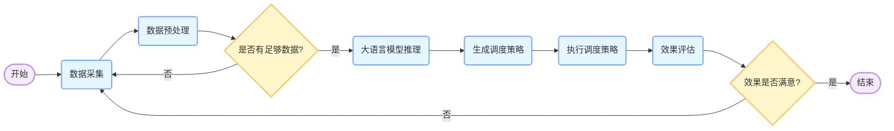

# 大语言模型在智能交通调度中的推理应用

> 关键词：大语言模型、智能交通调度、推理应用、交通优化、数据处理

> 摘要：本文深入探讨了大语言模型在智能交通调度中的推理应用。详细介绍了相关背景知识，包括目的、预期读者、文档结构等。阐述了大语言模型和智能交通调度的核心概念及联系，给出了原理和架构的文本示意图与 Mermaid 流程图。深入讲解了核心算法原理，用 Python 代码进行了详细阐述，同时给出了数学模型和公式并举例说明。通过项目实战，展示了代码实现和详细解读。分析了实际应用场景，推荐了学习资源、开发工具框架以及相关论文著作。最后总结了未来发展趋势与挑战，还设置了附录解答常见问题，并提供了扩展阅读和参考资料，旨在为相关领域的研究者和开发者提供全面且深入的指导。

## 1. 背景介绍 
### 1.1 目的和范围
随着城市化进程的加速和机动车保有量的急剧增加，交通拥堵、交通事故频发等问题日益严重，给人们的生活和经济发展带来了巨大的影响。智能交通调度作为解决交通问题的关键手段，旨在通过合理分配交通资源，优化交通流量，提高交通系统的运行效率和安全性。大语言模型具有强大的语言理解和推理能力，将其应用于智能交通调度中，可以为交通调度提供更智能、更高效的决策支持。

本文的范围主要涵盖大语言模型在智能交通调度中的推理应用的各个方面，包括核心概念、算法原理、数学模型、项目实战、实际应用场景等，旨在全面介绍大语言模型如何为智能交通调度带来创新和变革。

### 1.2 预期读者
本文预期读者包括交通工程领域的研究人员、智能交通系统的开发者、人工智能领域的工程师以及对智能交通和大语言模型感兴趣的爱好者。对于交通工程研究人员，本文可以提供新的研究思路和方法；对于开发者，可作为技术实现的参考；对于爱好者，则可以帮助他们了解相关领域的前沿知识。

### 1.3 文档结构概述
本文共分为十个部分。第一部分是背景介绍，包括目的、预期读者、文档结构概述和术语表；第二部分阐述核心概念与联系，给出相关原理和架构的示意图和流程图；第三部分讲解核心算法原理并给出 Python 代码；第四部分介绍数学模型和公式并举例说明；第五部分进行项目实战，包括开发环境搭建、源代码实现和代码解读；第六部分分析实际应用场景；第七部分推荐工具和资源；第八部分总结未来发展趋势与挑战；第九部分是附录，解答常见问题；第十部分提供扩展阅读和参考资料。

### 1.4 术语表
#### 1.4.1 核心术语定义
- **大语言模型**：基于深度学习技术，通过在大规模文本数据上进行训练，学习语言的模式和规律，能够处理自然语言任务的模型，如 GPT 系列、BERT 等。
- **智能交通调度**：利用先进的信息技术、通信技术、控制技术等手段，对交通系统中的人、车、路等要素进行实时监测、分析和决策，以优化交通流量、提高运输效率和保障交通安全的过程。
- **推理应用**：指大语言模型根据输入的信息，运用其学习到的知识和逻辑，推导出相关结论或解决方案的过程，在智能交通调度中用于交通状况预测、调度决策生成等。

#### 1.4.2 相关概念解释
- **交通流量**：指在单位时间内通过道路某一断面的车辆或行人的数量，是衡量交通拥堵程度和道路使用效率的重要指标。
- **交通拥堵**：由于交通需求超过道路供给能力，导致车辆行驶速度降低、交通延误增加的现象。
- **交通信号控制**：通过设置交通信号灯的时间和相位，对车辆和行人的通行进行有序引导，以提高交叉路口的通行效率和安全性。

#### 1.4.3 缩略词列表
- **AI**：Artificial Intelligence，人工智能
- **ML**：Machine Learning，机器学习
- **NLP**：Natural Language Processing，自然语言处理
- **ITS**：Intelligent Transportation System，智能交通系统

## 2. 核心概念与联系 

### 核心概念原理
#### 大语言模型原理
大语言模型通常基于Transformer架构，它由多个编码器和解码器层组成。Transformer的核心是自注意力机制，它能够让模型在处理输入序列时，关注序列中不同位置的元素之间的关系。例如，在处理一个句子时，模型可以根据自注意力机制确定每个词与其他词的关联程度。

在训练过程中，大语言模型使用大规模的文本数据进行无监督学习。通过预测下一个词的概率，模型不断调整自身的参数，以提高预测的准确性。训练完成后，模型可以接受输入文本，并根据学习到的语言模式生成相应的输出。

#### 智能交通调度原理
智能交通调度的目标是优化交通资源的分配，提高交通系统的运行效率。它主要基于交通数据的采集、分析和决策。首先，通过各种传感器（如摄像头、雷达、地磁传感器等）采集交通流量、车速、占有率等数据。然后，对这些数据进行处理和分析，利用机器学习、数据分析等技术预测交通状况。最后，根据预测结果制定调度策略，如调整交通信号灯的时间、引导车辆选择最优路线等。

### 架构的文本示意图
大语言模型在智能交通调度中的应用架构可以分为数据层、模型层和应用层。

数据层：负责采集和存储交通数据，包括实时交通数据（如交通流量、车速、事故信息等）和历史交通数据。同时，还可以收集其他相关数据，如天气数据、节假日信息等，这些数据可以作为辅助信息，帮助大语言模型更好地理解交通状况。

模型层：大语言模型作为核心组件，接收数据层提供的数据，并进行推理和分析。在这一层，大语言模型可以对交通状况进行预测，如预测未来一段时间内的交通流量、拥堵程度等；还可以根据输入的交通问题，生成相应的调度策略。

应用层：将模型层的输出结果应用到实际的交通调度中。例如，根据大语言模型生成的调度策略，调整交通信号灯的时间、发布交通诱导信息、指挥交警进行现场调度等。

### Mermaid 流程图


该流程图展示了大语言模型在智能交通调度中的应用流程。首先进行数据采集，然后对数据进行预处理。判断是否有足够的数据，如果数据不足则继续采集。有足够数据后，使用大语言模型进行推理，生成调度策略并执行。最后对调度效果进行评估，如果效果不满意则重新开始整个流程。

## 3. 核心算法原理 & 具体操作步骤 

### 核心算法原理
在智能交通调度中，大语言模型的推理应用主要基于其语言理解和生成能力。以下是一个简化的算法步骤：

1. **数据输入**：将交通数据（如当前交通流量、车速、道路状况等）转换为自然语言文本格式，作为大语言模型的输入。例如，“当前路段 A 的交通流量为每小时 500 辆车，车速为 30 公里/小时，道路畅通”。
2. **模型推理**：大语言模型接收输入文本，通过内部的神经网络进行计算，根据学习到的语言模式和知识，对输入进行理解和分析。例如，判断当前交通状况是否正常，是否可能出现拥堵等。
3. **结果生成**：根据推理结果，大语言模型生成相应的输出文本，如调度建议、交通预测等。例如，“建议增加路段 A 的巡逻警力，预计未来 30 分钟内交通流量将增加 20%”。

### 具体操作步骤及 Python 代码示例
以下是一个使用 Python 和 Hugging Face 的 Transformers 库实现大语言模型推理的简单示例。假设我们使用的是 GPT - 2 模型。

```python
from transformers import GPT2LMHeadModel, GPT2Tokenizer

# 加载预训练的 GPT - 2 模型和分词器
tokenizer = GPT2Tokenizer.from_pretrained('gpt2')
model = GPT2LMHeadModel.from_pretrained('gpt2')

# 定义交通数据输入文本
traffic_input = "当前路段 A 的交通流量为每小时 500 辆车，车速为 30 公里/小时，道路畅通"

# 对输入文本进行分词
input_ids = tokenizer.encode(traffic_input, return_tensors='pt')

# 使用模型进行推理
output = model.generate(input_ids, max_length=100, num_beams=5, no_repeat_ngram_size=2, early_stopping=True)

# 将输出的词 ID 转换为文本
output_text = tokenizer.decode(output[0], skip_special_tokens=True)

print("输入文本:", traffic_input)
print("输出文本:", output_text)
```

### 代码解释
1. **加载模型和分词器**：使用 `GPT2Tokenizer.from_pretrained('gpt2')` 加载 GPT - 2 的分词器，用于将文本转换为模型可以处理的词 ID；使用 `GPT2LMHeadModel.from_pretrained('gpt2')` 加载预训练的 GPT - 2 模型。
2. **定义输入文本**：将交通数据转换为自然语言文本 `traffic_input`。
3. **分词**：使用分词器将输入文本转换为词 ID 序列 `input_ids`。
4. **模型推理**：调用 `model.generate()` 方法进行推理，生成输出的词 ID 序列 `output`。可以通过设置参数（如 `max_length`、`num_beams` 等）来控制生成的文本长度和质量。
5. **输出文本转换**：使用分词器将输出的词 ID 序列转换为自然语言文本 `output_text`。

## 4. 数学模型和公式 & 详细讲解 & 举例说明 

### 数学模型和公式
#### 交通流量预测模型
在智能交通调度中，交通流量预测是一个重要的任务。可以使用时间序列分析的方法，如自回归积分滑动平均模型（ARIMA）。ARIMA 模型的一般形式为：

$$
\phi(B)(1 - B)^d Y_t = \theta(B) \epsilon_t
$$

其中：
- $Y_t$ 是时间序列数据，在交通流量预测中表示 $t$ 时刻的交通流量。
- $B$ 是滞后算子，$B Y_t = Y_{t - 1}$。
- $\phi(B) = 1 - \phi_1 B - \phi_2 B^2 - \cdots - \phi_p B^p$ 是自回归多项式，$p$ 是自回归阶数。
- $(1 - B)^d$ 是差分算子，$d$ 是差分阶数。
- $\theta(B) = 1 + \theta_1 B + \theta_2 B^2 + \cdots + \theta_q B^q$ 是移动平均多项式，$q$ 是移动平均阶数。
- $\epsilon_t$ 是白噪声序列。

#### 大语言模型损失函数
大语言模型通常使用交叉熵损失函数进行训练。对于一个包含 $N$ 个样本的数据集，每个样本的输入为 $x_i$，真实标签为 $y_i$，模型预测的概率分布为 $p(y_i|x_i)$，交叉熵损失函数的定义为：

$$
L = - \frac{1}{N} \sum_{i = 1}^{N} \sum_{j = 1}^{V} y_{ij} \log(p_{ij})
$$

其中：
- $V$ 是词汇表的大小。
- $y_{ij}$ 是第 $i$ 个样本的真实标签的第 $j$ 个元素，如果第 $i$ 个样本的真实标签是第 $j$ 个词，则 $y_{ij} = 1$，否则 $y_{ij} = 0$。
- $p_{ij}$ 是模型预测第 $i$ 个样本的第 $j$ 个词的概率。

### 详细讲解
#### ARIMA 模型
ARIMA 模型通过对时间序列数据进行差分处理，使其变得平稳，然后使用自回归和移动平均的方法对平稳序列进行建模。自回归部分考虑了当前时刻的值与过去时刻的值之间的关系，移动平均部分考虑了当前时刻的值与过去时刻的误差之间的关系。通过调整 $p$、$d$、$q$ 三个参数，可以得到不同的 ARIMA 模型，以适应不同的时间序列数据。

#### 交叉熵损失函数
交叉熵损失函数衡量了模型预测的概率分布与真实标签的概率分布之间的差异。在大语言模型的训练中，模型的目标是最小化交叉熵损失函数，即让模型预测的概率分布尽可能接近真实标签的概率分布。通过不断调整模型的参数，使得损失函数的值逐渐减小，从而提高模型的预测能力。

### 举例说明
#### ARIMA 模型举例
假设我们有过去 10 天每天的交通流量数据：$[100, 120, 110, 130, 140, 135, 150, 160, 155, 170]$。我们可以使用 Python 的 `statsmodels` 库来拟合 ARIMA 模型并进行预测。

```python
import pandas as pd
from statsmodels.tsa.arima.model import ARIMA

# 定义交通流量数据
traffic_data = [100, 120, 110, 130, 140, 135, 150, 160, 155, 170]
index = pd.date_range(start='2024-01-01', periods=10, freq='D')
series = pd.Series(traffic_data, index=index)

# 拟合 ARIMA 模型
model = ARIMA(series, order=(1, 1, 1))
model_fit = model.fit()

# 预测未来 1 天的交通流量
forecast = model_fit.forecast(steps=1)
print("预测的未来 1 天的交通流量:", forecast.values[0])
```

#### 交叉熵损失函数举例
假设我们有一个简单的大语言模型，词汇表大小为 3，有两个样本。第一个样本的真实标签是 $[1, 0, 0]$，模型预测的概率分布是 $[0.8, 0.1, 0.1]$；第二个样本的真实标签是 $[0, 1, 0]$，模型预测的概率分布是 $[0.2, 0.7, 0.1]$。则交叉熵损失函数的值为：

$$
L = - \frac{1}{2} \left( (1 \times \log(0.8) + 0 \times \log(0.1) + 0 \times \log(0.1)) + (0 \times \log(0.2) + 1 \times \log(0.7) + 0 \times \log(0.1)) \right)
$$

```python
import numpy as np

# 真实标签
y = np.array([[1, 0, 0], [0, 1, 0]])
# 模型预测的概率分布
p = np.array([[0.8, 0.1, 0.1], [0.2, 0.7, 0.1]])

# 计算交叉熵损失
N = y.shape[0]
L = - (1 / N) * np.sum(y * np.log(p))
print("交叉熵损失:", L)
```

## 5. 项目实战：代码实际案例和详细解释说明 

### 5.1  开发环境搭建
#### 安装 Python
首先需要安装 Python，建议使用 Python 3.7 及以上版本。可以从 Python 官方网站（https://www.python.org/downloads/）下载安装包，按照安装向导进行安装。

#### 创建虚拟环境
为了避免不同项目之间的依赖冲突，建议使用虚拟环境。可以使用 `venv` 模块创建虚拟环境：

```bash
python -m venv traffic_env
```

激活虚拟环境：
- 在 Windows 上：
```bash
traffic_env\Scripts\activate
```
- 在 Linux 或 macOS 上：
```bash
source traffic_env/bin/activate
```

#### 安装必要的库
安装 `transformers`、`pandas`、`statsmodels` 等必要的库：

```bash
pip install transformers pandas statsmodels
```

### 5.2  源代码详细实现和代码解读
以下是一个完整的项目实战代码示例，结合了大语言模型和交通流量预测，实现智能交通调度建议的生成。

```python
import pandas as pd
from statsmodels.tsa.arima.model import ARIMA
from transformers import GPT2LMHeadModel, GPT2Tokenizer

# 加载预训练的 GPT - 2 模型和分词器
tokenizer = GPT2Tokenizer.from_pretrained('gpt2')
model = GPT2LMHeadModel.from_pretrained('gpt2')

# 模拟交通流量数据
traffic_data = [100, 120, 110, 130, 140, 135, 150, 160, 155, 170]
index = pd.date_range(start='2024-01-01', periods=10, freq='D')
series = pd.Series(traffic_data, index=index)

# 拟合 ARIMA 模型
model_arima = ARIMA(series, order=(1, 1, 1))
model_fit = model_arima.fit()

# 预测未来 1 天的交通流量
forecast = model_fit.forecast(steps=1)
forecast_value = forecast.values[0]

# 生成输入文本
input_text = f"当前路段过去 10 天的交通流量分别为 {traffic_data}，预测未来 1 天的交通流量为 {forecast_value}，请给出交通调度建议。"

# 对输入文本进行分词
input_ids = tokenizer.encode(input_text, return_tensors='pt')

# 使用模型进行推理
output = model.generate(input_ids, max_length=100, num_beams=5, no_repeat_ngram_size=2, early_stopping=True)

# 将输出的词 ID 转换为文本
output_text = tokenizer.decode(output[0], skip_special_tokens=True)

print("输入文本:", input_text)
print("预测的未来 1 天的交通流量:", forecast_value)
print("输出的交通调度建议:", output_text)
```

### 代码解读与分析
1. **数据准备**：使用 `pandas` 库创建一个时间序列对象 `series`，模拟过去 10 天的交通流量数据。
2. **交通流量预测**：使用 `statsmodels` 库的 `ARIMA` 模型对交通流量进行预测，得到未来 1 天的交通流量预测值 `forecast_value`。
3. **生成输入文本**：将过去的交通流量数据和预测值组合成自然语言文本 `input_text`，作为大语言模型的输入。
4. **大语言模型推理**：使用 `transformers` 库的 GPT - 2 模型对输入文本进行推理，生成交通调度建议 `output_text`。

通过这个项目实战，我们可以看到如何将交通流量预测和大语言模型结合起来，实现智能交通调度建议的生成。

## 6. 实际应用场景 
### 交通拥堵预测与缓解
大语言模型可以根据历史交通数据、实时交通信息以及其他相关数据（如天气、节假日等），对交通拥堵情况进行预测。例如，在早晚高峰时段，大语言模型可以提前预测哪些路段可能会出现拥堵，并生成相应的调度策略。调度中心可以根据这些建议，调整交通信号灯的时间，引导车辆选择其他路线，从而缓解交通拥堵。

### 交通事故应急处理
当发生交通事故时，大语言模型可以快速分析事故现场的情况，如事故类型、影响范围、周边交通状况等。根据分析结果，生成应急处理方案，如调配救援力量、设置临时交通管制措施等。同时，大语言模型还可以实时更新事故处理进度和周边交通状况，为后续的调度决策提供支持。

### 公共交通调度优化
对于公共交通系统，大语言模型可以根据乘客的出行需求、交通流量等信息，优化公交线路和班次。例如，在客流量较大的时段和路段，增加公交车的班次；在客流量较小的时段和路段，减少不必要的班次，从而提高公共交通的运营效率和服务质量。

### 智能停车管理
大语言模型可以分析停车场的实时车位信息、周边交通状况以及用户的停车需求，为用户提供最佳的停车建议。同时，还可以根据停车场的使用情况，调整停车场的收费策略，提高停车场的利用率。

## 7. 工具和资源推荐
### 7.1 学习资源推荐
#### 7.1.1 书籍推荐
- 《Python 机器学习》：这本书详细介绍了 Python 在机器学习领域的应用，包括各种机器学习算法的原理和实现，对于理解大语言模型和智能交通调度中的机器学习技术有很大帮助。
- 《智能交通系统》：全面介绍了智能交通系统的基本概念、技术和应用，涵盖了交通数据采集、处理、分析以及交通调度等方面的内容。
- 《自然语言处理入门》：对于想要深入了解大语言模型的读者，这本书是一个很好的入门教材，介绍了自然语言处理的基本技术和方法。

#### 7.1.2 在线课程
- Coursera 上的“机器学习”课程：由 Andrew Ng 教授授课，是机器学习领域的经典课程，涵盖了机器学习的基本概念、算法和应用。
- edX 上的“智能交通系统”课程：系统地介绍了智能交通系统的相关知识和技术，包括交通流量预测、交通信号控制等内容。
- 吴恩达老师在 DeepLearning.AI 上的“自然语言处理专项课程”：深入讲解了自然语言处理的各种技术和应用，对于理解大语言模型的原理和应用有很大帮助。

#### 7.1.3 技术博客和网站
- 博客园：有很多开发者分享关于人工智能、机器学习和智能交通的技术文章和实践经验。
- Medium：上面有许多关于大语言模型和智能交通的前沿研究和应用案例。
- arXiv：提供了大量的学术论文，涵盖了人工智能、交通工程等领域的最新研究成果。

### 7.2 开发工具框架推荐
#### 7.2.1 IDE和编辑器
- PyCharm：是一款专门为 Python 开发设计的集成开发环境，具有强大的代码编辑、调试和项目管理功能。
- Visual Studio Code：轻量级的代码编辑器，支持多种编程语言，有丰富的插件可以扩展功能，非常适合 Python 开发。

#### 7.2.2 调试和性能分析工具
- TensorBoard：用于可视化深度学习模型的训练过程和性能指标，可以帮助开发者更好地理解模型的训练情况。
- Py-Spy：一个用于分析 Python 代码性能的工具，可以找出代码中的性能瓶颈。

#### 7.2.3 相关框架和库
- Transformers：Hugging Face 开发的用于自然语言处理的库，提供了各种预训练的大语言模型，方便开发者进行模型的加载和使用。
- scikit-learn：一个常用的机器学习库，提供了各种机器学习算法的实现，可用于交通数据的分析和处理。
- Pandas：用于数据处理和分析的库，在处理交通数据时非常有用，可以方便地进行数据清洗、转换和统计分析。

### 7.3 相关论文著作推荐
#### 7.3.1 经典论文
- “Attention Is All You Need”：介绍了 Transformer 架构，是大语言模型的基础。
- “Long Short-Term Memory”：提出了长短期记忆网络（LSTM），在处理序列数据方面有很好的效果，在交通流量预测等领域有广泛应用。

#### 7.3.2 最新研究成果
- 在 IEEE Transactions on Intelligent Transportation Systems 上发表的关于大语言模型在智能交通调度中应用的研究论文，展示了最新的研究进展和成果。
- 在 NeurIPS、ICML 等顶级人工智能会议上发表的与交通相关的研究论文，涉及到新的算法和技术。

#### 7.3.3 应用案例分析
- 一些实际的智能交通项目案例分析报告，介绍了大语言模型在实际交通调度中的应用场景、实现方法和取得的效果。

## 8. 总结：未来发展趋势与挑战
### 未来发展趋势
#### 多模态融合
未来，大语言模型在智能交通调度中的应用将不仅仅局限于文本数据，还会融合图像、视频、传感器数据等多模态信息。例如，结合交通监控摄像头的图像数据和大语言模型的推理能力，可以更准确地识别交通事故和交通违法行为，提高交通调度的效率和准确性。

#### 强化学习与大语言模型结合
强化学习可以让智能交通调度系统在不断的交互中学习最优的调度策略。将强化学习与大语言模型相结合，可以让模型根据实时的交通状况和调度效果，动态调整调度策略，进一步优化交通系统的运行。

#### 边缘计算与大语言模型
随着边缘计算技术的发展，将大语言模型部署在边缘设备上成为可能。这样可以减少数据传输延迟，提高交通调度的实时性。例如，在交通信号灯控制器上部署大语言模型，实时分析路口的交通状况并调整信号灯时间。

### 挑战
#### 数据隐私和安全
智能交通调度涉及大量的个人和敏感数据，如车辆位置、行驶轨迹等。在使用大语言模型处理这些数据时，需要确保数据的隐私和安全，防止数据泄露和滥用。

#### 模型可解释性
大语言模型通常是黑盒模型，其决策过程难以解释。在智能交通调度中，需要对调度策略的生成过程进行解释，以便交通管理人员和公众理解和接受。

#### 计算资源需求
大语言模型的训练和推理需要大量的计算资源，包括高性能的 GPU 和大规模的存储设备。在实际应用中，需要解决计算资源的限制问题，降低模型的计算成本。

## 9. 附录：常见问题与解答
### 问题 1：大语言模型在智能交通调度中的推理速度如何？
大语言模型的推理速度受到多种因素的影响，如模型的大小、硬件设备的性能、输入数据的长度等。一般来说，较大的模型推理速度较慢，而使用高性能的 GPU 可以显著提高推理速度。在实际应用中，可以通过模型压缩、量化等技术来优化模型，减少推理时间。

### 问题 2：如何选择合适的大语言模型应用于智能交通调度？
选择合适的大语言模型需要考虑多个因素，如模型的性能、可扩展性、训练数据的相关性等。可以根据具体的应用场景和需求，选择预训练的大语言模型，并在交通领域的数据上进行微调。同时，还可以比较不同模型的性能指标，选择最适合的模型。

### 问题 3：大语言模型在处理实时交通数据时会有延迟吗？
由于大语言模型的计算复杂度较高，处理实时交通数据时可能会存在一定的延迟。为了减少延迟，可以采用并行计算、异步处理等技术，提高模型的处理效率。此外，还可以将部分计算任务分配到边缘设备上进行，减少数据传输和处理的时间。

### 问题 4：如何评估大语言模型在智能交通调度中的效果？
可以从多个方面评估大语言模型在智能交通调度中的效果，如交通拥堵缓解程度、交通事故发生率、公共交通运营效率等。可以通过对比使用大语言模型前后的交通指标，评估模型的实际效果。同时，还可以使用模拟实验和实际应用案例来验证模型的性能。

## 10. 扩展阅读 & 参考资料
### 扩展阅读
- 《深度学习》（Deep Learning）：由 Ian Goodfellow、Yoshua Bengio 和 Aaron Courville 所著，深入介绍了深度学习的理论和实践，对于理解大语言模型的原理有很大帮助。
- 《交通工程学》：系统地介绍了交通工程的基本概念、理论和方法，包括交通流量分析、交通规划、交通管理等方面的内容。

### 参考资料
- Hugging Face 官方文档：https://huggingface.co/docs/transformers/index
- statsmodels 官方文档：https://www.statsmodels.org/stable/index.html
- Pandas 官方文档：https://pandas.pydata.org/docs/

作者：AI天才研究院/AI Genius Institute & 禅与计算机程序设计艺术 /Zen And The Art of Computer Programming