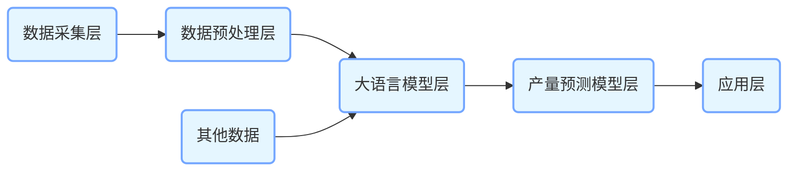

# 大语言模型在智能农业产量预测中的推理应用

> 关键词：大语言模型、智能农业、产量预测、推理应用、数据融合

> 摘要：本文深入探讨了大语言模型在智能农业产量预测中的推理应用。首先介绍了相关背景，包括目的、预期读者、文档结构和术语表。接着阐述了核心概念与联系，给出了原理和架构的文本示意图及 Mermaid 流程图。详细讲解了核心算法原理，并通过 Python 代码进行说明，同时介绍了相关数学模型和公式。通过项目实战，展示了代码实际案例及详细解释。分析了大语言模型在智能农业产量预测中的实际应用场景，推荐了学习资源、开发工具框架和相关论文著作。最后总结了未来发展趋势与挑战，提供了常见问题与解答及扩展阅读和参考资料，旨在为利用大语言模型提升农业产量预测的准确性和智能化水平提供全面的技术指导。

## 1. 背景介绍 
### 1.1 目的和范围
在全球人口持续增长的背景下，确保粮食安全成为了至关重要的问题。准确的农业产量预测对于合理安排农业生产、制定粮食政策、稳定市场供应等方面都具有重要意义。传统的农业产量预测方法往往依赖于有限的数据和简单的统计模型，难以充分考虑到复杂多变的农业环境因素。大语言模型具有强大的语言理解和推理能力，能够处理和分析大量的多源异构数据，为智能农业产量预测提供了新的思路和方法。

本文的目的是探讨大语言模型在智能农业产量预测中的推理应用，详细介绍相关的技术原理、算法实现、实际应用场景等内容。范围涵盖了从数据处理、模型构建到实际应用的整个流程，旨在为农业领域的科研人员、从业者以及对智能农业感兴趣的技术人员提供全面的参考。

### 1.2 预期读者
本文的预期读者包括但不限于以下几类人群：
- **农业科研人员**：希望借助先进的技术手段提升农业产量预测的准确性和科学性，为农业生产决策提供更可靠的依据。
- **农业从业者**：包括农民、农场主等，他们可以通过了解大语言模型在产量预测中的应用，更好地规划农业生产，提高经济效益。
- **人工智能和计算机领域的技术人员**：对跨领域应用感兴趣，希望探索大语言模型在农业领域的具体应用场景和技术挑战。
- **政策制定者**：了解智能农业的发展趋势和技术应用，为制定相关的农业政策提供参考。

### 1.3 文档结构概述
本文将按照以下结构进行组织：
- **核心概念与联系**：介绍大语言模型、智能农业产量预测的核心概念，以及它们之间的联系，同时给出原理和架构的文本示意图及 Mermaid 流程图。
- **核心算法原理 & 具体操作步骤**：详细讲解大语言模型在农业产量预测中所涉及的核心算法原理，并通过 Python 代码进行具体说明。
- **数学模型和公式 & 详细讲解 & 举例说明**：介绍相关的数学模型和公式，对其进行详细讲解，并通过实际例子进行说明。
- **项目实战：代码实际案例和详细解释说明**：通过一个具体的项目实战，展示如何使用大语言模型进行农业产量预测，包括开发环境搭建、源代码实现和代码解读。
- **实际应用场景**：分析大语言模型在智能农业产量预测中的实际应用场景，如精准农业、农产品市场预测等。
- **工具和资源推荐**：推荐学习资源、开发工具框架和相关论文著作，帮助读者进一步深入学习和研究。
- **总结：未来发展趋势与挑战**：总结大语言模型在智能农业产量预测中的应用现状，分析未来的发展趋势和面临的挑战。
- **附录：常见问题与解答**：提供常见问题的解答，帮助读者解决在学习和应用过程中遇到的问题。
- **扩展阅读 & 参考资料**：提供相关的扩展阅读材料和参考资料，方便读者进一步深入研究。

### 1.4 术语表
#### 1.4.1 核心术语定义
- **大语言模型**：基于深度学习技术，通过在大规模文本数据上进行训练，能够学习到语言的模式和语义信息，具有强大的语言理解和生成能力的模型，如 GPT - 3、BERT 等。
- **智能农业**：将物联网、大数据、人工智能等现代信息技术与农业生产、经营、管理和服务全面融合的一种新型农业发展模式，旨在提高农业生产效率、降低成本、提升农产品质量。
- **农业产量预测**：根据历史数据、当前的农业生产条件和环境因素等，对未来一段时间内农作物的产量进行预估的过程。
- **推理应用**：利用已经训练好的模型，根据输入的数据进行计算和判断，得出相应的输出结果的过程。

#### 1.4.2 相关概念解释
- **多源异构数据**：指来自不同数据源、具有不同格式和结构的数据，在智能农业中，多源异构数据可以包括气象数据、土壤数据、作物生长数据、卫星遥感数据等。
- **特征工程**：对原始数据进行预处理、转换和提取，以获取能够更好地表示数据特征和规律的过程，是机器学习和深度学习中非常重要的一个环节。
- **模型融合**：将多个不同的模型组合起来，综合利用它们的优势，以提高预测的准确性和稳定性的方法。

#### 1.4.3 缩略词列表
- **GPT**：Generative Pretrained Transformer，生成式预训练变换器
- **BERT**：Bidirectional Encoder Representations from Transformers，基于变换器的双向编码器表示
- **API**：Application Programming Interface，应用程序编程接口
- **IoT**：Internet of Things，物联网

## 2. 核心概念与联系 

### 核心概念原理
大语言模型的核心原理基于深度学习中的神经网络架构，尤其是 Transformer 架构。Transformer 架构采用了自注意力机制（Self - Attention Mechanism），能够有效地捕捉输入序列中不同位置之间的依赖关系，从而更好地处理长文本和复杂的语义信息。

在训练过程中，大语言模型通常采用无监督学习的方式，在大规模的文本数据上进行预训练，学习语言的通用模式和语义表示。然后，根据具体的任务需求，可以在预训练模型的基础上进行微调，以适应特定的任务。

智能农业产量预测则是综合考虑多种因素，如气象条件、土壤质量、作物品种、种植管理措施等，通过建立合适的模型来预测农作物的产量。传统的产量预测方法主要基于统计模型和机器学习算法，而大语言模型的引入为产量预测提供了新的视角和方法。

大语言模型可以处理和分析多源异构的文本数据，如农业新闻、科研论文、气象报告等，从中提取有用的信息和知识。同时，它还可以与其他数据（如传感器数据、卫星遥感数据等）进行融合，进一步提高产量预测的准确性。

### 架构的文本示意图
大语言模型在智能农业产量预测中的应用架构可以分为以下几个主要部分：
1. **数据采集层**：负责收集各种与农业生产相关的数据，包括气象数据、土壤数据、作物生长数据、卫星遥感数据等。这些数据可以来自不同的数据源，如气象站、传感器网络、卫星影像等。
2. **数据预处理层**：对采集到的数据进行清洗、转换和特征提取，将多源异构的数据统一格式，以便后续的分析和处理。
3. **大语言模型层**：利用预训练的大语言模型对文本数据进行处理和分析，提取有用的信息和知识。同时，可以将其他类型的数据与文本数据进行融合，输入到模型中进行训练和预测。
4. **产量预测模型层**：根据大语言模型提取的信息和其他相关数据，建立产量预测模型。可以采用传统的机器学习算法，如线性回归、决策树等，也可以采用深度学习算法，如神经网络等。
5. **应用层**：将产量预测结果应用到实际的农业生产中，如制定种植计划、优化灌溉方案、预测农产品市场价格等。

### Mermaid 流程图


## 3. 核心算法原理 & 具体操作步骤 

### 核心算法原理
大语言模型在智能农业产量预测中的核心算法主要包括以下几个方面：
1. **自注意力机制**：自注意力机制是 Transformer 架构的核心，它可以让模型在处理输入序列时，自动关注序列中不同位置的信息，并计算它们之间的相关性。具体来说，对于输入序列中的每个位置，自注意力机制会计算该位置与其他位置之间的注意力分数，然后根据这些分数对其他位置的信息进行加权求和，得到该位置的输出。

假设输入序列为 $X = [x_1, x_2, \cdots, x_n]$，其中 $x_i$ 是第 $i$ 个位置的输入向量。自注意力机制的计算步骤如下：
- 计算查询（Query）、键（Key）和值（Value）矩阵：
  - $Q = XW_Q$
  - $K = XW_K$
  - $V = XW_V$
  其中 $W_Q$、$W_K$ 和 $W_V$ 是可学习的权重矩阵。
- 计算注意力分数：
  - $Attention(Q, K, V) = softmax(\frac{QK^T}{\sqrt{d_k}})V$
  其中 $d_k$ 是键向量的维度，$softmax$ 函数用于将注意力分数归一化到 $[0, 1]$ 之间。

2. **预训练和微调**：大语言模型通常采用预训练和微调的方式进行训练。在预训练阶段，模型在大规模的文本数据上进行无监督学习，学习语言的通用模式和语义表示。在微调阶段，根据具体的任务需求，将预训练模型在特定的数据集上进行有监督学习，调整模型的参数，以适应特定的任务。

### 具体操作步骤
以下是使用大语言模型进行智能农业产量预测的具体操作步骤：
1. **数据收集**：收集各种与农业生产相关的数据，包括气象数据、土壤数据、作物生长数据、卫星遥感数据等。同时，收集相关的文本数据，如农业新闻、科研论文、气象报告等。
2. **数据预处理**：
- 清洗数据，去除噪声和缺失值。
- 对数据进行标准化和归一化处理，将不同类型的数据统一到相同的尺度上。
- 对文本数据进行分词、词性标注等处理，提取有用的信息。
3. **大语言模型选择和微调**：选择合适的预训练大语言模型，如 GPT - 3、BERT 等。根据具体的任务需求，在特定的数据集上对模型进行微调。
4. **特征提取**：利用微调后的大语言模型对文本数据进行处理，提取有用的特征。同时，将其他类型的数据与文本特征进行融合，得到最终的特征向量。
5. **产量预测模型训练**：根据提取的特征向量，选择合适的机器学习或深度学习算法，建立产量预测模型。常见的算法包括线性回归、决策树、神经网络等。
6. **模型评估和优化**：使用测试数据集对产量预测模型进行评估，计算模型的准确率、召回率、均方误差等指标。根据评估结果，对模型进行优化，调整模型的参数和结构。
7. **应用和部署**：将训练好的产量预测模型应用到实际的农业生产中，实现对农作物产量的实时预测。可以通过开发 Web 应用、移动应用等方式，将预测结果展示给用户。

### Python 代码实现
以下是一个简单的 Python 代码示例，展示了如何使用 Hugging Face 的 Transformers 库对 BERT 模型进行微调，并进行文本分类任务（可以扩展到农业产量预测中的文本特征提取）：

```python
import torch
from torch.utils.data import Dataset, DataLoader
from transformers import BertTokenizer, BertForSequenceClassification, AdamW
from sklearn.model_selection import train_test_split

# 定义数据集类
class AgricultureDataset(Dataset):
    def __init__(self, texts, labels, tokenizer, max_length):
        self.texts = texts
        self.labels = labels
        self.tokenizer = tokenizer
        self.max_length = max_length

    def __len__(self):
        return len(self.texts)

    def __getitem__(self, idx):
        text = str(self.texts[idx])
        label = self.labels[idx]
        encoding = self.tokenizer.encode_plus(
            text,
            add_special_tokens=True,
            max_length=self.max_length,
            padding='max_length',
            truncation=True,
            return_tensors='pt'
        )
        return {
            'input_ids': encoding['input_ids'].flatten(),
            'attention_mask': encoding['attention_mask'].flatten(),
            'labels': torch.tensor(label, dtype=torch.long)
        }

# 加载数据
texts = ["This is an agricultural news about high - yield crops.", "The weather is bad for crop growth."]
labels = [1, 0]

# 划分训练集和测试集
train_texts, test_texts, train_labels, test_labels = train_test_split(texts, labels, test_size=0.2, random_state=42)

# 加载 tokenizer 和模型
tokenizer = BertTokenizer.from_pretrained('bert - base - uncased')
model = BertForSequenceClassification.from_pretrained('bert - base - uncased', num_labels=2)

# 创建数据集和数据加载器
train_dataset = AgricultureDataset(train_texts, train_labels, tokenizer, max_length=128)
test_dataset = AgricultureDataset(test_texts, test_labels, tokenizer, max_length=128)

train_dataloader = DataLoader(train_dataset, batch_size=2, shuffle=True)
test_dataloader = DataLoader(test_dataset, batch_size=2, shuffle=False)

# 定义优化器和训练参数
optimizer = AdamW(model.parameters(), lr=2e - 5)
device = torch.device('cuda' if torch.cuda.is_available() else 'cpu')
model.to(device)

# 训练模型
epochs = 3
for epoch in range(epochs):
    model.train()
    total_loss = 0
    for batch in train_dataloader:
        input_ids = batch['input_ids'].to(device)
        attention_mask = batch['attention_mask'].to(device)
        labels = batch['labels'].to(device)

        model.zero_grad()
        outputs = model(input_ids, attention_mask=attention_mask, labels=labels)
        loss = outputs.loss
        total_loss += loss.item()
        loss.backward()
        optimizer.step()

    print(f'Epoch {epoch + 1}, Loss: {total_loss / len(train_dataloader)}')

# 评估模型
model.eval()
correct_predictions = 0
total_predictions = 0
with torch.no_grad():
    for batch in test_dataloader:
        input_ids = batch['input_ids'].to(device)
        attention_mask = batch['attention_mask'].to(device)
        labels = batch['labels'].to(device)

        outputs = model(input_ids, attention_mask=attention_mask)
        logits = outputs.logits
        predictions = torch.argmax(logits, dim=1)
        correct_predictions += (predictions == labels).sum().item()
        total_predictions += labels.size(0)

accuracy = correct_predictions / total_predictions
print(f'Accuracy: {accuracy}')
```

## 4. 数学模型和公式 & 详细讲解 & 举例说明 

### 自注意力机制公式
自注意力机制的核心公式为：
$$Attention(Q, K, V) = softmax(\frac{QK^T}{\sqrt{d_k}})V$$
其中：
- $Q$ 是查询矩阵，$K$ 是键矩阵，$V$ 是值矩阵，它们的计算公式分别为 $Q = XW_Q$，$K = XW_K$，$V = XW_V$，$X$ 是输入序列的矩阵表示，$W_Q$、$W_K$ 和 $W_V$ 是可学习的权重矩阵。
- $d_k$ 是键向量的维度，引入 $\sqrt{d_k}$ 是为了防止点积结果过大，导致 softmax 函数的梯度消失。
- $softmax$ 函数用于将注意力分数归一化到 $[0, 1]$ 之间，其定义为：
  $$softmax(x_i)=\frac{e^{x_i}}{\sum_{j = 1}^{n}e^{x_j}}$$
  其中 $x_i$ 是输入向量的第 $i$ 个元素，$n$ 是向量的长度。

### 详细讲解
自注意力机制的作用是让模型在处理输入序列时，能够自动关注序列中不同位置的信息，并计算它们之间的相关性。具体来说，对于输入序列中的每个位置，模型会计算该位置与其他位置之间的注意力分数，注意力分数越高，表示该位置与其他位置的相关性越强。然后，模型会根据这些注意力分数对其他位置的信息进行加权求和，得到该位置的输出。

通过自注意力机制，模型可以捕捉到输入序列中长距离的依赖关系，从而更好地处理复杂的语义信息。例如，在处理农业文本数据时，自注意力机制可以帮助模型理解不同农业术语之间的关系，以及不同句子之间的逻辑联系。

### 举例说明
假设输入序列为 $X = [x_1, x_2, x_3]$，其中 $x_i$ 是一个二维向量，$x_1 = [1, 2]$，$x_2 = [3, 4]$，$x_3 = [5, 6]$。$W_Q$、$W_K$ 和 $W_V$ 是 $2\times2$ 的权重矩阵，假设 $W_Q=\begin{bmatrix}1 & 0\\0 & 1\end{bmatrix}$，$W_K=\begin{bmatrix}1 & 0\\0 & 1\end{bmatrix}$，$W_V=\begin{bmatrix}1 & 0\\0 & 1\end{bmatrix}$。

首先计算查询、键和值矩阵：
- $Q = XW_Q=\begin{bmatrix}1 & 2\\3 & 4\\5 & 6\end{bmatrix}$
- $K = XW_K=\begin{bmatrix}1 & 2\\3 & 4\\5 & 6\end{bmatrix}$
- $V = XW_V=\begin{bmatrix}1 & 2\\3 & 4\\5 & 6\end{bmatrix}$

然后计算注意力分数：
$$QK^T=\begin{bmatrix}1 & 2\\3 & 4\\5 & 6\end{bmatrix}\begin{bmatrix}1 & 3 & 5\\2 & 4 & 6\end{bmatrix}=\begin{bmatrix}5 & 11 & 17\\11 & 25 & 39\\17 & 39 & 61\end{bmatrix}$$
假设 $d_k = 2$，则 $\frac{QK^T}{\sqrt{d_k}}=\frac{1}{\sqrt{2}}\begin{bmatrix}5 & 11 & 17\\11 & 25 & 39\\17 & 39 & 61\end{bmatrix}$。

最后计算注意力输出：
$$Attention(Q, K, V) = softmax(\frac{QK^T}{\sqrt{d_k}})V$$

通过以上计算，模型可以根据输入序列 $X$ 得到每个位置的输出，这些输出包含了输入序列中不同位置之间的相关性信息。

### 产量预测模型公式
在产量预测中，常见的线性回归模型公式为：
$$y=\beta_0+\beta_1x_1+\beta_2x_2+\cdots+\beta_nx_n+\epsilon$$
其中：
- $y$ 是农作物的产量，即预测目标。
- $x_1, x_2, \cdots, x_n$ 是影响产量的特征变量，如气象条件、土壤质量、种植密度等。
- $\beta_0, \beta_1, \cdots, \beta_n$ 是模型的参数，需要通过训练数据进行估计。
- $\epsilon$ 是误差项，表示模型无法解释的随机因素。

### 详细讲解
线性回归模型假设产量 $y$ 与特征变量 $x_1, x_2, \cdots, x_n$ 之间存在线性关系。通过最小化误差项的平方和（即最小二乘法），可以估计出模型的参数 $\beta_0, \beta_1, \cdots, \beta_n$。

在实际应用中，特征变量 $x_i$ 可以是从大语言模型中提取的文本特征，也可以是其他类型的数据，如传感器数据、卫星遥感数据等。通过将这些特征变量输入到线性回归模型中，可以得到农作物产量的预测值。

### 举例说明
假设我们有以下训练数据：
| 气象条件（$x_1$） | 土壤质量（$x_2$） | 产量（$y$） |
| --- | --- | --- |
| 0.8 | 0.7 | 500 |
| 0.6 | 0.8 | 450 |
| 0.9 | 0.6 | 520 |

使用最小二乘法估计线性回归模型的参数 $\beta_0, \beta_1, \beta_2$，可以得到模型的表达式。然后，对于新的气象条件和土壤质量数据，如 $x_1 = 0.7$，$x_2 = 0.7$，可以将其代入模型中，得到产量的预测值。

## 5. 项目实战：代码实际案例和详细解释说明 

### 5.1  开发环境搭建
#### 硬件环境
- **CPU**：建议使用多核处理器，如 Intel Core i7 或 AMD Ryzen 7 及以上，以提高数据处理和模型训练的速度。
- **GPU**：如果进行大规模的模型训练，建议使用 NVIDIA GPU，如 NVIDIA GeForce RTX 3060 或更高版本，以利用 GPU 的并行计算能力加速训练过程。
- **内存**：至少 16GB 内存，以确保能够处理大量的数据和模型参数。

#### 软件环境
- **操作系统**：推荐使用 Linux 系统，如 Ubuntu 20.04 或更高版本，也可以使用 Windows 10 或 macOS。
- **Python 环境**：安装 Python 3.7 或更高版本，可以使用 Anaconda 或 Miniconda 来管理 Python 环境。
- **深度学习框架**：安装 PyTorch 或 TensorFlow 深度学习框架，这里以 PyTorch 为例，可以使用以下命令安装：
```bash
pip install torch torchvision torchaudio
```
- **其他库**：安装 Hugging Face 的 Transformers 库、NumPy、Pandas、Scikit - learn 等库，用于数据处理、模型训练和评估：
```bash
pip install transformers numpy pandas scikit - learn
```

### 5.2  源代码详细实现和代码解读
#### 数据准备
首先，我们需要准备用于训练和测试的数据集。假设我们有一个包含气象数据、土壤数据和产量数据的 CSV 文件 `agriculture_data.csv`，以及一个包含农业文本信息的文本文件 `agriculture_text.txt`。

```python
import pandas as pd

# 加载 CSV 数据
data_csv = pd.read_csv('agriculture_data.csv')
# 加载文本数据
with open('agriculture_text.txt', 'r', encoding='utf - 8') as f:
    texts = f.readlines()

# 提取特征和标签
features_csv = data_csv.drop('yield', axis=1).values
labels = data_csv['yield'].values
```

#### 文本特征提取
使用预训练的 BERT 模型提取文本特征。

```python
from transformers import BertTokenizer, BertModel
import torch

# 加载 tokenizer 和模型
tokenizer = BertTokenizer.from_pretrained('bert - base - uncased')
model = BertModel.from_pretrained('bert - base - uncased')

# 提取文本特征
text_features = []
for text in texts:
    encoding = tokenizer.encode_plus(
        text,
        add_special_tokens=True,
        max_length=128,
        padding='max_length',
        truncation=True,
        return_tensors='pt'
    )
    input_ids = encoding['input_ids']
    attention_mask = encoding['attention_mask']
    with torch.no_grad():
        outputs = model(input_ids, attention_mask=attention_mask)
    last_hidden_state = outputs.last_hidden_state
    # 取 [CLS] 标记的输出作为文本特征
    text_feature = last_hidden_state[:, 0, :].numpy()
    text_features.append(text_feature.flatten())

text_features = np.array(text_features)
```

#### 特征融合
将 CSV 数据的特征和文本特征进行融合。

```python
import numpy as np

# 特征融合
features = np.hstack((features_csv, text_features))
```

#### 模型训练和评估
使用线性回归模型进行产量预测。

```python
from sklearn.model_selection import train_test_split
from sklearn.linear_model import LinearRegression
from sklearn.metrics import mean_squared_error

# 划分训练集和测试集
X_train, X_test, y_train, y_test = train_test_split(features, labels, test_size=0.2, random_state=42)

# 创建线性回归模型
model = LinearRegression()

# 训练模型
model.fit(X_train, y_train)

# 预测
y_pred = model.predict(X_test)

# 评估模型
mse = mean_squared_error(y_test, y_pred)
print(f'Mean Squared Error: {mse}')
```

### 5.3  代码解读与分析
#### 数据准备部分
- 使用 `pandas` 库加载 CSV 数据，并提取特征和标签。
- 使用 Python 的文件操作读取文本数据。

#### 文本特征提取部分
- 使用 Hugging Face 的 Transformers 库加载预训练的 BERT 模型和 tokenizer。
- 对每个文本进行分词和编码，然后输入到 BERT 模型中，提取 `[CLS]` 标记的输出作为文本特征。

#### 特征融合部分
- 使用 `numpy` 库的 `hstack` 函数将 CSV 数据的特征和文本特征进行水平拼接，得到最终的特征矩阵。

#### 模型训练和评估部分
- 使用 `sklearn` 库的 `train_test_split` 函数将数据集划分为训练集和测试集。
- 创建线性回归模型，并使用训练集进行训练。
- 使用测试集进行预测，并计算均方误差（MSE）来评估模型的性能。

通过以上代码，我们可以看到如何使用大语言模型提取文本特征，并将其与其他类型的数据进行融合，用于智能农业产量预测。

## 6. 实际应用场景 
### 精准农业
在精准农业中，大语言模型可以根据气象数据、土壤数据、作物生长数据等多源异构信息，结合农业领域的专业知识，为农民提供精准的种植建议。例如，通过分析历史气象数据和农业新闻报道，预测未来一段时间内的气象变化趋势，为农民提供合理的灌溉、施肥和病虫害防治方案，从而提高农作物的产量和质量。

### 农产品市场预测
大语言模型可以分析农产品市场的供需关系、价格波动趋势等信息，结合农业产量预测结果，为农产品的生产、销售和流通提供决策支持。例如，预测某种农产品的未来市场价格走势，帮助农民合理安排种植计划，避免因市场供需失衡导致的损失。

### 农业灾害预警
通过对气象数据、卫星遥感数据和农业新闻的实时监测和分析，大语言模型可以及时发现潜在的农业灾害，如旱灾、水灾、病虫害等，并提前发出预警。农民可以根据预警信息采取相应的防范措施，减少农业灾害对农作物产量的影响。

### 农业科研辅助
大语言模型可以帮助农业科研人员快速检索和分析大量的农业科研文献，提取有用的信息和知识。同时，它还可以辅助科研人员进行实验设计、数据分析和模型构建，提高科研效率和成果质量。

## 7. 工具和资源推荐
### 7.1 学习资源推荐
#### 7.1.1 书籍推荐
- 《深度学习》（Deep Learning）：由 Ian Goodfellow、Yoshua Bengio 和 Aaron Courville 所著，是深度学习领域的经典教材，涵盖了神经网络、卷积神经网络、循环神经网络等基础知识。
- 《Python 深度学习》（Deep Learning with Python）：由 Francois Chollet 所著，以 Keras 框架为例，介绍了深度学习的基本概念和实践方法，适合初学者入门。
- 《自然语言处理入门》：由何晗所著，系统地介绍了自然语言处理的基本概念、算法和应用，包括分词、词性标注、命名实体识别等内容。

#### 7.1.2 在线课程
- Coursera 上的“深度学习专项课程”（Deep Learning Specialization）：由 Andrew Ng 教授授课，包括神经网络和深度学习、改善深层神经网络、结构化机器学习项目、卷积神经网络、序列模型等五门课程，全面介绍了深度学习的理论和实践。
- edX 上的“自然语言处理基础”（Foundations of Natural Language Processing）：由宾夕法尼亚大学的教授授课，介绍了自然语言处理的基本概念、算法和应用，包括文本分类、情感分析、机器翻译等内容。
- 哔哩哔哩（B 站）上有很多关于深度学习和自然语言处理的教学视频，如李沐老师的“动手学深度学习”系列课程，以 PyTorch 框架为例，详细介绍了深度学习的实践方法。

#### 7.1.3 技术博客和网站
- Hugging Face 官方博客：提供了关于自然语言处理和大语言模型的最新研究成果、技术应用和工具使用等方面的文章。
- Medium 上的 Towards Data Science：是一个专注于数据科学、机器学习和人工智能的技术博客，有很多关于深度学习和自然语言处理的优质文章。
- 机器之心：是一个专注于人工智能领域的科技媒体，提供了最新的技术动态、研究成果和应用案例等内容。

### 7.2 开发工具框架推荐
#### 7.2.1 IDE和编辑器
- PyCharm：是一款专门为 Python 开发设计的集成开发环境（IDE），具有代码自动补全、调试、版本控制等功能，适合专业的 Python 开发者使用。
- Jupyter Notebook：是一个交互式的开发环境，支持 Python、R 等多种编程语言，适合进行数据探索、模型训练和结果展示等工作。
- Visual Studio Code：是一款轻量级的代码编辑器，支持多种编程语言和插件扩展，具有丰富的功能和良好的用户体验。

#### 7.2.2 调试和性能分析工具
- PyTorch Profiler：是 PyTorch 框架自带的性能分析工具，可以帮助开发者分析模型的训练和推理时间、内存使用情况等，找出性能瓶颈。
- TensorBoard：是 TensorFlow 框架的可视化工具，也可以用于 PyTorch 模型的可视化分析，支持查看模型的训练过程、损失曲线、准确率等指标。
- cProfile：是 Python 标准库中的性能分析工具，可以帮助开发者分析 Python 代码的运行时间和函数调用情况，找出代码中的性能瓶颈。

#### 7.2.3 相关框架和库
- Hugging Face Transformers：是一个用于自然语言处理的开源库，提供了多种预训练的大语言模型，如 GPT - 3、BERT、XLNet 等，以及相应的工具和接口，方便开发者进行模型的微调、推理和部署。
- PyTorch：是一个开源的深度学习框架，具有动态图机制、易于使用和调试等优点，广泛应用于自然语言处理、计算机视觉等领域。
- Scikit - learn：是一个用于机器学习的开源库，提供了多种机器学习算法和工具，如分类、回归、聚类等，适合初学者入门和快速开发。

### 7.3 相关论文著作推荐
#### 7.3.1 经典论文
- “Attention Is All You Need”：提出了 Transformer 架构，是大语言模型的基础，为自然语言处理和深度学习领域带来了革命性的变化。
- “BERT: Pre - training of Deep Bidirectional Transformers for Language Understanding”：介绍了 BERT 模型的预训练和微调方法，在多个自然语言处理任务上取得了优异的成绩。
- “Generative Pretrained Transformer 3 (GPT - 3): Its Nature, Scope, Limits, and Consequences”：详细介绍了 GPT - 3 模型的特点、应用和局限性，引发了广泛的关注和讨论。

#### 7.3.2 最新研究成果
- 关注 arXiv 预印本平台上关于大语言模型和智能农业的最新研究论文，了解该领域的最新技术进展和研究趋势。
- 参加相关的学术会议，如 ACL（Association for Computational Linguistics）、NeurIPS（Neural Information Processing Systems）等，获取最新的研究成果和学术动态。

#### 7.3.3 应用案例分析
- 查阅相关的学术期刊和行业报告，了解大语言模型在智能农业产量预测、精准农业、农产品市场预测等方面的实际应用案例，学习他人的经验和做法。

## 8. 总结：未来发展趋势与挑战
### 未来发展趋势
- **多模态融合**：未来，大语言模型将与图像、音频、视频等多模态数据进行更深入的融合，综合利用多种数据源的信息，提高农业产量预测的准确性和可靠性。例如，结合卫星遥感图像和气象文本数据，更全面地了解农作物的生长状况和环境条件。
- **个性化服务**：根据不同地区、不同作物和不同种植户的需求，提供个性化的农业产量预测和决策支持服务。大语言模型可以学习和理解每个用户的特定情况，为其提供定制化的种植方案和建议。
- **边缘计算与物联网结合**：随着物联网技术的发展，大量的传感器设备将部署在农田中，实时收集农作物生长环境的数据。大语言模型可以与边缘计算技术相结合，在本地设备上进行数据处理和模型推理，减少数据传输延迟，提高系统的实时性和响应速度。
- **与区块链技术融合**：利用区块链技术的去中心化、不可篡改和可追溯等特点，确保农业数据的真实性和可靠性。大语言模型可以基于区块链上的可信数据进行训练和预测，提高农业产量预测的公信力。

### 挑战
- **数据质量和隐私问题**：农业数据往往具有多源异构、噪声大、缺失值多等特点，如何提高数据的质量和可用性是一个挑战。同时，农业数据涉及到农民的隐私和商业机密，如何在保证数据安全和隐私的前提下，实现数据的共享和利用也是一个亟待解决的问题。
- **模型可解释性**：大语言模型通常是基于深度学习的黑盒模型，其决策过程和输出结果难以解释。在农业领域，农民和决策者需要了解模型的预测依据和可靠性，因此提高模型的可解释性是一个重要的挑战。
- **计算资源和成本**：大语言模型的训练和推理需要大量的计算资源和时间，成本较高。如何在有限的计算资源和成本下，实现高效的模型训练和推理是一个需要解决的问题。
- **领域知识融合**：农业是一个复杂的领域，涉及到生物学、气象学、土壤学等多个学科的知识。如何将这些领域知识有效地融入到大语言模型中，提高模型的性能和实用性，是一个具有挑战性的问题。

## 9. 附录：常见问题与解答
### 问题 1：大语言模型在农业产量预测中的准确性如何保证？
答：为了保证大语言模型在农业产量预测中的准确性，可以采取以下措施：
- **数据质量控制**：对收集到的农业数据进行清洗、预处理和特征工程，去除噪声和缺失值，提取有用的特征。
- **模型选择和调优**：选择合适的大语言模型，并根据具体的任务需求进行微调。同时，通过交叉验证等方法对模型的参数进行调优，提高模型的性能。
- **多模型融合**：将大语言模型与其他传统的机器学习或深度学习模型进行融合，综合利用它们的优势，提高预测的准确性和稳定性。
- **持续学习和更新**：随着农业生产环境和数据的不断变化，及时更新模型的训练数据和参数，让模型能够适应新的情况。

### 问题 2：如何处理农业数据中的多源异构问题？
答：处理农业数据中的多源异构问题可以采用以下方法：
- **数据标准化和归一化**：将不同类型的数据统一到相同的尺度上，消除数据之间的量纲差异。
- **特征提取和转换**：对不同类型的数据进行特征提取和转换，将其转换为适合模型输入的格式。例如，对文本数据进行分词、词性标注等处理，对图像数据进行特征提取和降维。
- **数据融合技术**：采用合适的数据融合技术，将多源异构的数据进行融合。例如，基于规则的融合方法、基于机器学习的融合方法等。

### 问题 3：大语言模型在农业产量预测中的计算成本高吗？
答：大语言模型的训练和推理通常需要大量的计算资源和时间，计算成本相对较高。但是，可以采取以下方法来降低计算成本：
- **模型压缩**：采用模型压缩技术，如剪枝、量化等，减少模型的参数数量和计算量。
- **分布式计算**：利用分布式计算技术，将模型的训练和推理任务分配到多个计算节点上进行并行处理，提高计算效率。
- **选择合适的硬件**：选择性能高、成本低的硬件设备，如 GPU、TPU 等，加速模型的训练和推理过程。

### 问题 4：如何将大语言模型与现有的农业信息系统集成？
答：将大语言模型与现有的农业信息系统集成可以采用以下步骤：
- **API 接口开发**：为大语言模型开发 API 接口，将模型的功能封装成可供外部调用的服务。
- **系统对接**：在现有的农业信息系统中调用大语言模型的 API 接口，实现数据的传输和交互。
- **数据格式转换**：确保农业信息系统和大语言模型之间的数据格式兼容，对数据进行必要的转换和处理。
- **测试和优化**：对集成后的系统进行测试和优化，确保系统的稳定性和性能。

## 10. 扩展阅读 & 参考资料
### 扩展阅读
- 《智能农业：未来农业的发展方向》：深入探讨了智能农业的概念、技术和应用，为读者提供了全面的智能农业知识体系。
- 《自然语言处理实战：基于 PyTorch 和 Transformers》：详细介绍了自然语言处理的实战方法和技巧，结合 PyTorch 和 Transformers 框架，通过实际案例帮助读者掌握自然语言处理的核心技术。
- 《农业大数据：理论、方法与应用》：介绍了农业大数据的基本概念、数据采集和处理方法，以及在农业生产、管理和决策中的应用。

### 参考资料
- Hugging Face 官方文档：https://huggingface.co/docs
- PyTorch 官方文档：https://pytorch.org/docs/stable/index.html
- Scikit - learn 官方文档：https://scikit - learn.org/stable/documentation.html

作者：AI天才研究院/AI Genius Institute & 禅与计算机程序设计艺术 /Zen And The Art of Computer Programming