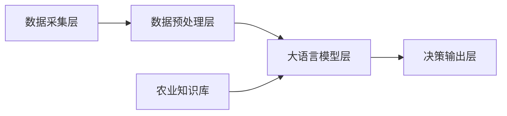

# 大语言模型在智能农业决策中的推理应用

> 关键词：大语言模型、智能农业决策、推理应用、农业数据处理、农业预测

> 摘要：本文深入探讨了大语言模型在智能农业决策中的推理应用。首先介绍了研究的背景、目的、预期读者和文档结构，明确了相关术语。接着阐述了大语言模型与智能农业决策的核心概念及联系，给出了原理和架构的文本示意图与Mermaid流程图。详细讲解了核心算法原理，并用Python源代码进行了说明。通过数学模型和公式进一步剖析了其在农业决策中的应用。以项目实战案例展示了代码实现和解读。分析了大语言模型在智能农业决策中的实际应用场景，推荐了相关的学习资源、开发工具框架和论文著作。最后总结了未来发展趋势与挑战，并对常见问题进行了解答，提供了扩展阅读和参考资料。

## 1. 背景介绍 
### 1.1 目的和范围
智能农业是农业发展的未来趋势，它旨在通过信息技术提高农业生产效率、降低成本、减少资源浪费。大语言模型作为人工智能领域的重要成果，具有强大的语言理解和推理能力。本研究的目的是探讨如何将大语言模型的推理能力应用于智能农业决策中，以提高农业决策的科学性和准确性。研究范围涵盖了大语言模型在农业生产的各个环节，如种植规划、病虫害防治、农产品销售等方面的推理应用。

### 1.2 预期读者
本文的预期读者包括农业领域的从业者，如农民、农业企业管理人员、农业技术推广人员等，他们可以通过了解大语言模型在农业决策中的应用，提高自身的决策水平和生产效率。同时，也适合人工智能领域的研究人员和开发者，为他们在农业领域的应用研究提供参考。此外，对智能农业和大语言模型感兴趣的普通读者也可以从中获取相关知识。

### 1.3 文档结构概述
本文将按照以下结构进行组织：首先介绍大语言模型和智能农业决策的核心概念及联系，包括原理和架构的示意图和流程图；然后详细讲解核心算法原理，并给出Python源代码；接着通过数学模型和公式进一步说明其在农业决策中的应用；通过项目实战案例展示代码实现和解读；分析实际应用场景；推荐相关的学习资源、开发工具框架和论文著作；最后总结未来发展趋势与挑战，解答常见问题，并提供扩展阅读和参考资料。

### 1.4 术语表
#### 1.4.1 核心术语定义
- **大语言模型**：是一种基于深度学习的自然语言处理模型，通过大规模的文本数据进行训练，能够理解和生成自然语言文本，具有强大的语言推理和知识表达能力。
- **智能农业决策**：指利用信息技术和数据分析方法，对农业生产过程中的各种问题进行分析和决策，以实现农业生产的高效、可持续发展。
- **推理应用**：指将大语言模型的推理能力应用于具体的领域，通过对输入信息的分析和处理，得出合理的结论和建议。

#### 1.4.2 相关概念解释
- **农业数据**：包括气象数据、土壤数据、作物生长数据、病虫害数据等，是智能农业决策的重要依据。
- **农业知识库**：是一个包含农业领域各种知识的数据库，如作物种植技术、病虫害防治方法、农产品市场信息等，为大语言模型的推理提供知识支持。

#### 1.4.3 缩略词列表
- **LLM**：Large Language Model，大语言模型
- **AI**：Artificial Intelligence，人工智能
- **IoT**：Internet of Things，物联网

## 2. 核心概念与联系 

### 核心概念原理
大语言模型的核心原理是基于Transformer架构，通过自注意力机制来捕捉文本中的上下文信息。它在大规模的文本数据上进行预训练，学习到语言的模式和语义信息。在智能农业决策中，大语言模型可以接收农业相关的文本信息，如气象预报、土壤检测报告、作物生长状况等，然后利用其推理能力对这些信息进行分析和处理，给出合理的决策建议。

### 架构的文本示意图
大语言模型在智能农业决策中的应用架构主要包括以下几个部分：
1. **数据采集层**：通过物联网设备、传感器等采集农业生产过程中的各种数据，如气象数据、土壤湿度、作物生长图像等。
2. **数据预处理层**：对采集到的数据进行清洗、转换和特征提取，将其转换为适合大语言模型处理的文本格式。
3. **大语言模型层**：使用预训练的大语言模型对处理后的数据进行推理，结合农业知识库中的知识，生成决策建议。
4. **决策输出层**：将大语言模型生成的决策建议以可视化的方式呈现给用户，如网页界面、移动应用等。

### Mermaid流程图


## 3. 核心算法原理 & 具体操作步骤 

### 核心算法原理
大语言模型的核心算法是Transformer架构，它由多个编码器和解码器层组成。编码器层用于对输入的文本进行编码，提取其特征表示；解码器层用于根据编码器的输出和之前生成的文本，生成下一个词。在智能农业决策中，我们可以使用预训练的大语言模型，如GPT系列、BERT等，对农业数据进行推理。

### 具体操作步骤
1. **数据准备**：收集农业相关的数据，如气象数据、土壤数据、作物生长数据等，并将其转换为文本格式。
2. **模型选择**：选择适合的大语言模型，如GPT-3、BERT等，并加载预训练的模型权重。
3. **输入处理**：将准备好的数据输入到模型中，进行编码处理。
4. **推理过程**：模型根据输入的信息和自身的知识，进行推理计算，生成决策建议。
5. **输出结果**：将推理结果以文本形式输出，并进行可视化展示。

### Python源代码示例
```python
import torch
from transformers import GPT2LMHeadModel, GPT2Tokenizer

# 加载预训练的模型和分词器
tokenizer = GPT2Tokenizer.from_pretrained('gpt2')
model = GPT2LMHeadModel.from_pretrained('gpt2')

# 准备输入数据
input_text = "今天气温25摄氏度，土壤湿度为60%，请问适合种植什么作物？"
input_ids = tokenizer.encode(input_text, return_tensors='pt')

# 进行推理
output = model.generate(input_ids, max_length=100, num_return_sequences=1)

# 解码输出结果
output_text = tokenizer.decode(output[0], skip_special_tokens=True)
print(output_text)
```

## 4. 数学模型和公式 & 详细讲解 & 举例说明 

### 数学模型
大语言模型的训练通常基于最大似然估计，目标是最大化训练数据的概率。设训练数据为 $D = \{x_1, x_2, \cdots, x_N\}$，模型的参数为 $\theta$，则训练目标可以表示为：
$$\max_{\theta} \sum_{i=1}^{N} \log P(x_i|\theta)$$

### 详细讲解
在大语言模型中，$P(x_i|\theta)$ 表示在给定模型参数 $\theta$ 的情况下，生成文本 $x_i$ 的概率。通过最大化这个概率，模型可以学习到语言的模式和语义信息。在推理阶段，模型根据输入的文本 $x$，计算生成下一个词 $y$ 的概率 $P(y|x, \theta)$，并选择概率最大的词作为输出。

### 举例说明
假设我们有一个简单的语言模型，输入文本为 "今天天气"，模型需要预测下一个词。模型会计算每个可能的词的概率，如 "晴朗"、"多云"、"下雨" 等，然后选择概率最大的词作为输出。如果 "晴朗" 的概率最大，则模型输出 "今天天气晴朗"。

## 5. 项目实战：代码实际案例和详细解释说明 

### 5.1  开发环境搭建
1. **安装Python**：确保你的系统中安装了Python 3.6及以上版本。
2. **安装依赖库**：使用pip安装必要的库，如`transformers`、`torch`等。
```bash
pip install transformers torch
```

### 5.2  源代码详细实现和代码解读
```python
import torch
from transformers import GPT2LMHeadModel, GPT2Tokenizer

# 加载预训练的模型和分词器
tokenizer = GPT2Tokenizer.from_pretrained('gpt2')
model = GPT2LMHeadModel.from_pretrained('gpt2')

# 定义农业问题
question = "最近一周降雨较多，小麦田出现了黄叶现象，应该如何处理？"

# 对问题进行编码
input_ids = tokenizer.encode(question, return_tensors='pt')

# 进行推理
output = model.generate(input_ids, max_length=200, num_return_sequences=1)

# 解码输出结果
answer = tokenizer.decode(output[0], skip_special_tokens=True)

# 打印结果
print("问题：", question)
print("答案：", answer)
```
### 代码解读与分析
1. **加载模型和分词器**：使用`transformers`库加载预训练的GPT-2模型和分词器。
2. **定义农业问题**：将需要咨询的农业问题定义为一个字符串。
3. **编码问题**：使用分词器将问题编码为模型可以接受的输入格式。
4. **进行推理**：调用模型的`generate`方法进行推理，生成答案。
5. **解码结果**：使用分词器将模型输出的编码结果解码为文本格式。
6. **打印结果**：将问题和答案打印输出。

## 6. 实际应用场景 
### 种植规划
大语言模型可以根据气象数据、土壤条件、市场需求等信息，为农民提供合理的种植规划建议。例如，根据当地的气候特点和土壤肥力，推荐适合种植的作物品种和种植时间。

### 病虫害防治
通过分析作物的症状、病虫害的发生规律等信息，大语言模型可以诊断作物的病虫害问题，并提供相应的防治措施。例如，根据小麦叶片上的病斑特征，判断是哪种病害，并给出防治药剂和使用方法。

### 农产品销售
大语言模型可以分析农产品市场的供求关系、价格走势等信息，为农民提供销售策略建议。例如，根据市场需求和价格波动，建议农民选择合适的销售时间和销售渠道。

### 农业资源管理
根据农业生产过程中的资源使用情况，如水资源、肥料、农药等，大语言模型可以提供资源优化管理的建议。例如，根据土壤湿度和作物需水量，制定合理的灌溉计划。

## 7. 工具和资源推荐
### 7.1 学习资源推荐
#### 7.1.1 书籍推荐
- 《深度学习》：由Ian Goodfellow、Yoshua Bengio和Aaron Courville所著，是深度学习领域的经典教材，涵盖了大语言模型的基础理论和算法。
- 《自然语言处理入门》：作者何晗，系统介绍了自然语言处理的基本概念、方法和技术，对大语言模型的学习有很大帮助。

#### 7.1.2 在线课程
- Coursera上的“Deep Learning Specialization”：由Andrew Ng教授授课，包含了深度学习的各个方面，包括大语言模型的训练和应用。
- 哔哩哔哩上的“自然语言处理从入门到实战”：由博主“霹雳吧啦Wz”发布，详细讲解了自然语言处理的基础知识和实践项目。

#### 7.1.3 技术博客和网站
- Hugging Face：是一个专注于自然语言处理的开源社区，提供了大量的预训练模型和工具，以及相关的技术文档和教程。
- Medium：上面有很多关于大语言模型和人工智能的技术文章，作者来自世界各地的专家和从业者。

### 7.2 开发工具框架推荐
#### 7.2.1 IDE和编辑器
- PyCharm：是一款专业的Python集成开发环境，提供了丰富的代码编辑、调试和项目管理功能。
- Visual Studio Code：是一款轻量级的代码编辑器，支持多种编程语言，并且有大量的扩展插件可供使用。

#### 7.2.2 调试和性能分析工具
- TensorBoard：是TensorFlow提供的可视化工具，可以用于监控模型的训练过程、分析模型的性能。
- Py-Spy：是一个用于Python程序的性能分析工具，可以帮助开发者找出程序中的性能瓶颈。

#### 7.2.3 相关框架和库
- Transformers：由Hugging Face开发的自然语言处理框架，提供了各种预训练的大语言模型和相关工具。
- PyTorch：是一个开源的深度学习框架，具有高效的计算性能和丰富的工具库，广泛应用于大语言模型的开发。

### 7.3 相关论文著作推荐
#### 7.3.1 经典论文
- “Attention Is All You Need”：提出了Transformer架构，是大语言模型的基础。
- “BERT: Pre-training of Deep Bidirectional Transformers for Language Understanding”：介绍了BERT模型，开启了预训练语言模型的新时代。

#### 7.3.2 最新研究成果
- 关注顶级学术会议，如ACL、EMNLP等，上面会有关于大语言模型在农业领域应用的最新研究成果。
- ArXiv上也有很多关于大语言模型的预印本论文，可以及时了解最新的研究动态。

#### 7.3.3 应用案例分析
- 一些农业科技公司的官方网站会发布大语言模型在农业决策中的应用案例，可以从中学习到实际应用的经验和方法。

## 8. 总结：未来发展趋势与挑战
### 未来发展趋势
- **与物联网深度融合**：大语言模型将与物联网技术更加紧密地结合，实时获取农业生产现场的数据，提供更加精准的决策建议。
- **多模态融合**：除了文本信息，大语言模型将能够处理图像、视频等多模态信息，提高对农业问题的理解和分析能力。
- **个性化服务**：根据不同用户的需求和偏好，提供个性化的农业决策服务，满足多样化的农业生产需求。

### 挑战
- **数据质量和隐私问题**：农业数据的质量参差不齐，并且涉及到大量的隐私信息，如何保证数据的质量和安全是一个挑战。
- **计算资源需求**：大语言模型的训练和推理需要大量的计算资源，如何降低计算成本，提高计算效率是一个亟待解决的问题。
- **模型可解释性**：大语言模型的决策过程往往是黑盒的，如何提高模型的可解释性，让用户理解决策的依据是一个重要的研究方向。

## 9. 附录：常见问题与解答
### 大语言模型在农业决策中的准确性如何保证？
大语言模型的准确性可以通过以下几个方面来保证：一是使用高质量的农业数据进行训练和微调；二是结合农业知识库和专家经验，对模型的输出进行验证和修正；三是不断进行模型评估和优化，提高模型的性能。

### 大语言模型的计算成本高，如何降低？
可以采用以下方法降低计算成本：一是选择合适的模型架构和参数，避免使用过于庞大的模型；二是采用模型压缩技术，如剪枝、量化等，减少模型的参数量；三是利用云计算和边缘计算技术，将计算任务分配到不同的设备上，提高计算效率。

### 大语言模型能否完全替代农业专家的决策？
目前大语言模型还不能完全替代农业专家的决策。虽然大语言模型具有强大的推理能力，但它缺乏实际的农业生产经验和判断力。在实际应用中，大语言模型可以作为农业专家的辅助工具，为他们提供决策建议，最终的决策还需要结合专家的经验和判断。

## 10. 扩展阅读 & 参考资料
### 扩展阅读
- 《人工智能时代的农业变革》：探讨了人工智能技术在农业领域的应用和发展趋势。
- 《智能农业技术与应用》：介绍了智能农业的各种技术和应用案例。

### 参考资料
- 相关的学术论文和研究报告。
- 农业科技公司的官方文档和技术资料。
- 开源代码库和项目文档。

作者：AI天才研究院/AI Genius Institute & 禅与计算机程序设计艺术 /Zen And The Art of Computer Programming