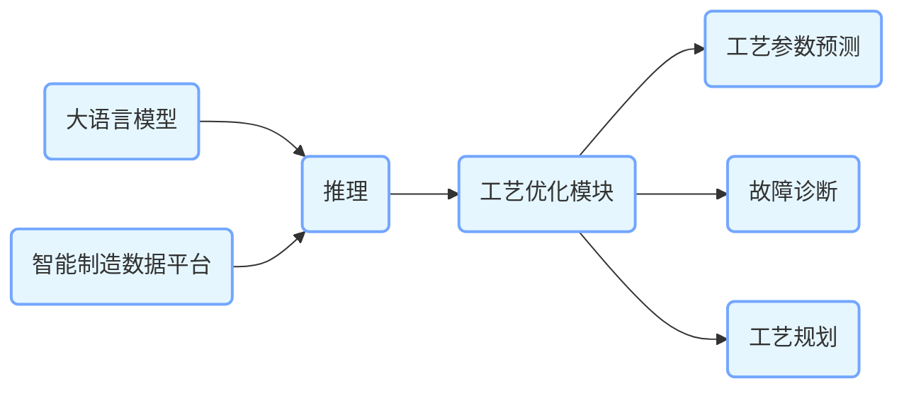

# 大语言模型在智能制造工艺优化中的推理应用

> 关键词：大语言模型、智能制造、工艺优化、推理应用、工业智能化

> 摘要：本文聚焦于大语言模型在智能制造工艺优化中的推理应用。首先介绍了研究背景，包括目的、预期读者、文档结构和相关术语。接着阐述了大语言模型和智能制造工艺优化的核心概念及其联系，给出了原理和架构的示意图与流程图。详细讲解了核心算法原理，并用 Python 代码进行说明，同时介绍了相关数学模型和公式。通过项目实战展示了代码的实际应用和解读分析。探讨了大语言模型在智能制造工艺优化中的实际应用场景，推荐了学习资源、开发工具框架和相关论文著作。最后总结了未来发展趋势与挑战，解答了常见问题并提供了扩展阅读和参考资料，旨在为推动大语言模型在智能制造领域的应用提供全面的技术指导。

## 1. 背景介绍 
### 1.1 目的和范围
随着智能制造的快速发展，对工艺优化的需求日益增长。传统的工艺优化方法往往依赖于专家经验和大量的实验，效率较低且成本较高。大语言模型具有强大的语言理解和推理能力，能够处理和分析大量的文本数据，为智能制造工艺优化提供了新的思路和方法。本文的目的是探讨大语言模型在智能制造工艺优化中的推理应用，包括如何利用大语言模型进行工艺参数预测、故障诊断、工艺规划等，以提高智能制造的效率和质量。本文的范围主要涵盖大语言模型的基本原理、在智能制造工艺优化中的具体应用场景、相关算法和数学模型，以及实际项目案例的分析。

### 1.2 预期读者
本文预期读者包括智能制造领域的工程师、研究人员、技术管理人员，以及对大语言模型和人工智能在工业应用感兴趣的相关人员。对于从事智能制造工艺优化工作的专业人士，本文可以提供新的技术思路和方法；对于研究人员，有助于了解大语言模型在工业领域的应用现状和发展趋势；对于技术管理人员，可作为评估和决策是否引入大语言模型技术的参考资料。

### 1.3 文档结构概述
本文将按照以下结构进行组织：首先介绍大语言模型和智能制造工艺优化的核心概念及其联系，通过示意图和流程图展示其原理和架构；接着详细讲解核心算法原理，并使用 Python 代码进行具体实现；介绍相关的数学模型和公式，并举例说明；通过项目实战展示代码的实际应用，包括开发环境搭建、源代码实现和代码解读分析；探讨大语言模型在智能制造工艺优化中的实际应用场景；推荐学习资源、开发工具框架和相关论文著作；最后总结未来发展趋势与挑战，解答常见问题并提供扩展阅读和参考资料。

### 1.4 术语表
#### 1.4.1 核心术语定义
- **大语言模型（Large Language Model）**：基于深度学习技术，通过在大规模文本数据上进行训练，能够学习到语言的模式和规律，具备强大的语言理解和生成能力的模型。例如 GPT - 3、BERT 等。
- **智能制造（Intelligent Manufacturing）**：将先进的信息技术、自动化技术、人工智能技术等与制造技术相结合，实现生产过程的智能化、自动化和柔性化的制造模式。
- **工艺优化（Process Optimization）**：通过对制造工艺进行分析、改进和调整，以提高产品质量、生产效率、降低成本等为目标的过程。
- **推理（Inference）**：在大语言模型中，推理是指利用训练好的模型对输入数据进行处理，生成相应输出结果的过程。

#### 1.4.2 相关概念解释
- **自然语言处理（Natural Language Processing, NLP）**：是计算机科学与语言学的交叉领域，旨在让计算机能够理解、处理和生成人类语言。大语言模型是自然语言处理的重要研究成果之一。
- **工业物联网（Industrial Internet of Things, IIoT）**：将物联网技术应用于工业领域，实现设备之间、设备与系统之间的互联互通，收集和传输生产过程中的各种数据，为智能制造提供数据支持。
- **机器学习（Machine Learning）**：是一门多领域交叉学科，涉及概率论、统计学、逼近论、凸分析、算法复杂度理论等多门学科。它专门研究计算机怎样模拟或实现人类的学习行为，以获取新的知识或技能，重新组织已有的知识结构使之不断改善自身的性能。大语言模型基于机器学习的深度学习技术发展而来。

#### 1.4.3 缩略词列表
- **NLP**：Natural Language Processing（自然语言处理）
- **IIoT**：Industrial Internet of Things（工业物联网）
- **GPT**：Generative Pretrained Transformer（生成式预训练变换器）
- **BERT**：Bidirectional Encoder Representations from Transformers（基于变换器的双向编码器表征）

## 2. 核心概念与联系 

### 核心概念原理
#### 大语言模型原理
大语言模型通常基于深度学习中的变换器（Transformer）架构。Transformer 架构由编码器和解码器组成，其核心是自注意力机制（Self - Attention Mechanism）。自注意力机制能够让模型在处理输入序列时，关注序列中不同位置的元素之间的关系，从而捕捉到长距离的依赖信息。

大语言模型的训练过程分为预训练和微调两个阶段。在预训练阶段，模型在大规模的无监督文本数据上进行训练，学习语言的通用模式和规律。例如，GPT 系列模型通过预测下一个单词来进行预训练。在微调阶段，模型在特定的有监督数据集上进行训练，以适应具体的任务，如文本分类、问答系统等。

#### 智能制造工艺优化原理
智能制造工艺优化的目标是通过对制造过程中的各种参数和变量进行分析和调整，以提高产品质量、生产效率和降低成本。其原理主要基于数据驱动和模型驱动的方法。

数据驱动方法通过收集和分析生产过程中的大量数据，如设备运行数据、工艺参数数据、产品质量数据等，发现数据中的规律和模式，从而为工艺优化提供依据。例如，通过分析设备的振动数据可以预测设备的故障，提前进行维护，避免生产中断。

模型驱动方法则是建立制造过程的数学模型，如物理模型、统计模型、机器学习模型等，通过对模型的优化和仿真，来优化工艺参数。例如，利用有限元分析模型优化零件的加工工艺。

### 架构的文本示意图
```plaintext
大语言模型在智能制造工艺优化中的应用架构

|---------------------|           |---------------------|
|  大语言模型         |           |  智能制造数据平台   |
|---------------------|           |---------------------|
|  - 预训练模型       |           |  - 设备数据采集      |
|  - 微调模型         |           |  - 工艺参数存储      |
|  - 推理引擎         |           |  - 产品质量数据      |
|---------------------|           |---------------------|
                |                             |
                |                             |
                |-----------------------------|
                              |
                   |---------------------|
                   |  工艺优化模块       |
                   |---------------------|
                   |  - 工艺参数预测     |
                   |  - 故障诊断        |
                   |  - 工艺规划        |
                   |---------------------|
```

### Mermaid 流程图


### 核心概念联系
大语言模型与智能制造工艺优化之间存在着紧密的联系。大语言模型可以处理和分析智能制造数据平台中的文本数据，如工艺文档、设备维护手册、质量报告等，从中提取有用的信息和知识。通过推理引擎，大语言模型可以对这些信息进行处理，为工艺优化模块提供决策支持。

例如，在工艺参数预测方面，大语言模型可以根据历史工艺数据和相关文档，预测不同工艺参数组合下的产品质量和生产效率，从而帮助工程师选择最优的工艺参数。在故障诊断方面，大语言模型可以分析设备故障报告和维护记录，快速定位故障原因，并提供相应的解决方案。在工艺规划方面，大语言模型可以根据产品需求和生产资源，生成合理的工艺规划方案。

## 3. 核心算法原理 & 具体操作步骤 

### 核心算法原理
在大语言模型用于智能制造工艺优化的推理应用中，主要涉及到的算法包括自注意力机制、Transformer 架构和微调算法。

#### 自注意力机制
自注意力机制是 Transformer 架构的核心，它允许模型在处理输入序列时，为序列中的每个位置分配不同的权重，从而关注序列中不同位置的元素之间的关系。自注意力机制的计算步骤如下：

1. 对于输入序列 $\mathbf{X} = [\mathbf{x}_1, \mathbf{x}_2, \cdots, \mathbf{x}_n]$，其中 $\mathbf{x}_i \in \mathbb{R}^d$ 是第 $i$ 个位置的输入向量，$d$ 是向量的维度。
2. 分别计算查询矩阵 $\mathbf{Q}$、键矩阵 $\mathbf{K}$ 和值矩阵 $\mathbf{V}$：
    - $\mathbf{Q} = \mathbf{X} \mathbf{W}^Q$
    - $\mathbf{K} = \mathbf{X} \mathbf{W}^K$
    - $\mathbf{V} = \mathbf{X} \mathbf{W}^V$
    其中 $\mathbf{W}^Q \in \mathbb{R}^{d \times d_k}$，$\mathbf{W}^K \in \mathbb{R}^{d \times d_k}$，$\mathbf{W}^V \in \mathbb{R}^{d \times d_v}$ 是可学习的权重矩阵，$d_k$ 和 $d_v$ 分别是查询、键和值的维度。
3. 计算注意力分数：
    - $\mathbf{Attention}(\mathbf{Q}, \mathbf{K}, \mathbf{V}) = \text{softmax}\left(\frac{\mathbf{Q} \mathbf{K}^T}{\sqrt{d_k}}\right) \mathbf{V}$

#### Transformer 架构
Transformer 架构由编码器和解码器组成。编码器负责对输入序列进行编码，提取序列的特征表示；解码器负责根据编码器的输出和之前生成的输出，生成下一个输出。

编码器由多个相同的编码层组成，每个编码层包含一个多头自注意力子层和一个前馈神经网络子层。解码器由多个相同的解码层组成，每个解码层包含一个多头自注意力子层、一个编码器 - 解码器注意力子层和一个前馈神经网络子层。

#### 微调算法
微调是在预训练模型的基础上，在特定的有监督数据集上进行训练，以适应具体的任务。微调的过程通常使用反向传播算法和随机梯度下降优化算法，通过最小化损失函数来更新模型的参数。

### 具体操作步骤

#### 步骤 1：数据准备
收集智能制造领域的相关文本数据，如工艺文档、设备维护记录、质量报告等，并进行预处理，包括清洗、分词、标注等。

#### 步骤 2：模型选择与加载
选择合适的预训练大语言模型，如 GPT - 3、BERT 等，并加载模型的权重。

#### 步骤 3：微调模型
使用预处理后的数据集对预训练模型进行微调，设置合适的超参数，如学习率、批量大小、训练轮数等。

#### 步骤 4：推理过程
将待处理的输入数据输入到微调后的模型中，通过推理引擎得到输出结果。

### Python 源代码实现

```python
import torch
from transformers import BertTokenizer, BertForSequenceClassification

# 步骤 1：数据准备
text = "某设备最近运行时出现异常振动，可能是什么原因？"
label = 1  # 假设这是一个故障诊断任务的标签

# 步骤 2：模型选择与加载
tokenizer = BertTokenizer.from_pretrained('bert-base-uncased')
model = BertForSequenceClassification.from_pretrained('bert-base-uncased', num_labels=2)

# 步骤 3：数据预处理
inputs = tokenizer(text, return_tensors='pt')
labels = torch.tensor([label]).unsqueeze(0)  # 增加一个维度

# 步骤 4：微调模型（简化示例，实际需要更多数据和训练步骤）
optimizer = torch.optim.Adam(model.parameters(), lr=1e-5)
model.train()
for _ in range(3):  # 训练 3 轮
    outputs = model(**inputs, labels=labels)
    loss = outputs.loss
    loss.backward()
    optimizer.step()
    optimizer.zero_grad()

# 步骤 5：推理过程
model.eval()
with torch.no_grad():
    outputs = model(**inputs)
    logits = outputs.logits
    predicted_class_id = logits.argmax().item()
    print(f"预测的类别 ID: {predicted_class_id}")
```

### 代码解释
1. **数据准备**：定义了一个文本输入和对应的标签，用于模拟故障诊断任务。
2. **模型选择与加载**：使用 `transformers` 库加载预训练的 BERT 模型和对应的分词器。
3. **数据预处理**：使用分词器将文本转换为模型可以接受的输入格式，并将标签转换为 PyTorch 张量。
4. **微调模型**：定义优化器，将模型设置为训练模式，进行多轮训练，通过反向传播更新模型的参数。
5. **推理过程**：将模型设置为评估模式，使用训练好的模型对输入数据进行推理，得到预测的类别 ID。

## 4. 数学模型和公式 & 详细讲解 & 举例说明 

### 自注意力机制数学模型和公式
自注意力机制的核心公式为：

$$\mathbf{Attention}(\mathbf{Q}, \mathbf{K}, \mathbf{V}) = \text{softmax}\left(\frac{\mathbf{Q} \mathbf{K}^T}{\sqrt{d_k}}\right) \mathbf{V}$$

其中：
- $\mathbf{Q} = \mathbf{X} \mathbf{W}^Q$ 是查询矩阵，$\mathbf{K} = \mathbf{X} \mathbf{W}^K$ 是键矩阵，$\mathbf{V} = \mathbf{X} \mathbf{W}^V$ 是值矩阵。
- $\mathbf{X} \in \mathbb{R}^{n \times d}$ 是输入序列矩阵，$n$ 是序列的长度，$d$ 是输入向量的维度。
- $\mathbf{W}^Q \in \mathbb{R}^{d \times d_k}$，$\mathbf{W}^K \in \mathbb{R}^{d \times d_k}$，$\mathbf{W}^V \in \mathbb{R}^{d \times d_v}$ 是可学习的权重矩阵，$d_k$ 和 $d_v$ 分别是查询、键和值的维度。
- $\text{softmax}$ 函数用于将注意力分数归一化到 $[0, 1]$ 范围内，公式为：

$$\text{softmax}(z_i) = \frac{e^{z_i}}{\sum_{j=1}^{n} e^{z_j}}$$

### 详细讲解
自注意力机制的作用是计算输入序列中每个位置与其他位置之间的相关性。具体来说，对于每个位置的查询向量 $\mathbf{q}_i$，通过与所有位置的键向量 $\mathbf{k}_j$ 进行点积运算，得到注意力分数 $z_{ij} = \mathbf{q}_i^T \mathbf{k}_j$。然后，将注意力分数除以 $\sqrt{d_k}$ 进行缩放，以避免点积结果过大导致梯度消失或爆炸。最后，使用 $\text{softmax}$ 函数将注意力分数归一化，得到每个位置的注意力权重。这些权重用于对值矩阵 $\mathbf{V}$ 进行加权求和，得到该位置的输出向量。

### 举例说明
假设输入序列为 $\mathbf{X} = [\mathbf{x}_1, \mathbf{x}_2, \mathbf{x}_3]$，其中 $\mathbf{x}_i \in \mathbb{R}^4$，$d = 4$。设置 $d_k = d_v = 2$。

首先计算查询矩阵 $\mathbf{Q}$、键矩阵 $\mathbf{K}$ 和值矩阵 $\mathbf{V}$：

$$\mathbf{Q} = \mathbf{X} \mathbf{W}^Q = \begin{bmatrix}
\mathbf{x}_1^T \mathbf{w}_1^Q & \mathbf{x}_1^T \mathbf{w}_2^Q \\
\mathbf{x}_2^T \mathbf{w}_1^Q & \mathbf{x}_2^T \mathbf{w}_2^Q \\
\mathbf{x}_3^T \mathbf{w}_1^Q & \mathbf{x}_3^T \mathbf{w}_2^Q
\end{bmatrix}$$

$$\mathbf{K} = \mathbf{X} \mathbf{W}^K = \begin{bmatrix}
\mathbf{x}_1^T \mathbf{w}_1^K & \mathbf{x}_1^T \mathbf{w}_2^K \\
\mathbf{x}_2^T \mathbf{w}_1^K & \mathbf{x}_2^T \mathbf{w}_2^K \\
\mathbf{x}_3^T \mathbf{w}_1^K & \mathbf{x}_3^T \mathbf{w}_2^K
\end{bmatrix}$$

$$\mathbf{V} = \mathbf{X} \mathbf{W}^V = \begin{bmatrix}
\mathbf{x}_1^T \mathbf{w}_1^V & \mathbf{x}_1^T \mathbf{w}_2^V \\
\mathbf{x}_2^T \mathbf{w}_1^V & \mathbf{x}_2^T \mathbf{w}_2^V \\
\mathbf{x}_3^T \mathbf{w}_1^V & \mathbf{x}_3^T \mathbf{w}_2^V
\end{bmatrix}$$

其中 $\mathbf{w}_i^Q, \mathbf{w}_i^K, \mathbf{w}_i^V \in \mathbb{R}^4$ 是权重向量。

然后计算注意力分数矩阵 $\mathbf{S} = \frac{\mathbf{Q} \mathbf{K}^T}{\sqrt{d_k}}$：

$$\mathbf{S} = \frac{1}{\sqrt{2}} \begin{bmatrix}
\mathbf{q}_1^T \mathbf{k}_1 & \mathbf{q}_1^T \mathbf{k}_2 & \mathbf{q}_1^T \mathbf{k}_3 \\
\mathbf{q}_2^T \mathbf{k}_1 & \mathbf{q}_2^T \mathbf{k}_2 & \mathbf{q}_2^T \mathbf{k}_3 \\
\mathbf{q}_3^T \mathbf{k}_1 & \mathbf{q}_3^T \mathbf{k}_2 & \mathbf{q}_3^T \mathbf{k}_3
\end{bmatrix}$$

最后，使用 $\text{softmax}$ 函数对 $\mathbf{S}$ 的每一行进行归一化，得到注意力权重矩阵 $\mathbf{A}$，并计算输出矩阵 $\mathbf{O} = \mathbf{A} \mathbf{V}$。

### 微调算法数学模型和公式
微调算法通常使用交叉熵损失函数来衡量模型的预测结果与真实标签之间的差异。对于一个多分类任务，交叉熵损失函数的公式为：

$$L(\theta) = -\frac{1}{N} \sum_{i=1}^{N} \sum_{j=1}^{C} y_{ij} \log(p_{ij})$$

其中：
- $N$ 是样本数量，$C$ 是类别数量。
- $y_{ij}$ 是第 $i$ 个样本的真实标签的第 $j$ 个分量，通常是一个 one - hot 向量。
- $p_{ij}$ 是模型对第 $i$ 个样本的第 $j$ 个类别的预测概率。
- $\theta$ 是模型的参数。

### 详细讲解
交叉熵损失函数的目的是最小化模型的预测概率分布与真实标签分布之间的差异。当模型的预测结果与真实标签完全一致时，交叉熵损失函数的值为 0；当模型的预测结果与真实标签差异较大时，交叉熵损失函数的值会增大。通过反向传播算法，计算损失函数对模型参数的梯度，并使用优化算法（如随机梯度下降）更新模型的参数，使得损失函数的值逐渐减小。

### 举例说明
假设我们有一个二分类任务，有 3 个样本，真实标签分别为 $[1, 0, 1]$，模型的预测概率分别为 $[0.8, 0.2, 0.3]$。将真实标签转换为 one - hot 向量：$[[0, 1], [1, 0], [0, 1]]$，预测概率矩阵为 $\begin{bmatrix}0.2 & 0.8 \\ 0.3 & 0.7 \\ 0.7 & 0.3\end{bmatrix}$。

根据交叉熵损失函数的公式：

$$L(\theta) = -\frac{1}{3} \left(0 \times \log(0.2) + 1 \times \log(0.8) + 1 \times \log(0.3) + 0 \times \log(0.7) + 0 \times \log(0.7) + 1 \times \log(0.3)\right)$$

通过计算可以得到损失函数的值，然后使用反向传播算法更新模型的参数。

## 5. 项目实战：代码实际案例和详细解释说明 

### 5.1  开发环境搭建
#### 操作系统
推荐使用 Linux 系统，如 Ubuntu 18.04 或更高版本，因为 Linux 系统在深度学习开发中具有更好的稳定性和兼容性。也可以使用 Windows 10 或 macOS 系统，但可能需要进行一些额外的配置。

#### Python 环境
安装 Python 3.7 或更高版本。可以使用 Anaconda 来管理 Python 环境，它可以方便地创建和管理虚拟环境。以下是创建和激活虚拟环境的命令：

```bash
conda create -n llm_manufacturing python=3.8
conda activate llm_manufacturing
```

#### 深度学习框架
安装 PyTorch 和 Transformers 库。可以使用以下命令进行安装：

```bash
pip install torch torchvision torchaudio
pip install transformers
```

#### 其他依赖库
根据具体的项目需求，可能还需要安装其他依赖库，如 NumPy、Pandas、Scikit - learn 等。可以使用以下命令进行安装：

```bash
pip install numpy pandas scikit-learn
```

### 5.2  源代码详细实现和代码解读
以下是一个完整的项目实战案例，使用大语言模型进行智能制造工艺优化中的故障诊断。

```python
import torch
from transformers import BertTokenizer, BertForSequenceClassification
import pandas as pd
from sklearn.model_selection import train_test_split
from torch.utils.data import Dataset, DataLoader

# 定义数据集类
class ManufacturingDataset(Dataset):
    def __init__(self, texts, labels, tokenizer, max_length):
        self.texts = texts
        self.labels = labels
        self.tokenizer = tokenizer
        self.max_length = max_length

    def __len__(self):
        return len(self.texts)

    def __getitem__(self, idx):
        text = str(self.texts[idx])
        label = self.labels[idx]
        encoding = self.tokenizer.encode_plus(
            text,
            add_special_tokens=True,
            max_length=self.max_length,
            padding='max_length',
            truncation=True,
            return_tensors='pt'
        )
        return {
            'input_ids': encoding['input_ids'].flatten(),
            'attention_mask': encoding['attention_mask'].flatten(),
            'labels': torch.tensor(label, dtype=torch.long)
        }

# 加载数据
def load_data(file_path):
    data = pd.read_csv(file_path)
    texts = data['text'].tolist()
    labels = data['label'].tolist()
    return texts, labels

# 训练模型
def train_model(model, train_dataloader, optimizer, device, epochs):
    model.train()
    for epoch in range(epochs):
        total_loss = 0
        for batch in train_dataloader:
            input_ids = batch['input_ids'].to(device)
            attention_mask = batch['attention_mask'].to(device)
            labels = batch['labels'].to(device)

            optimizer.zero_grad()
            outputs = model(input_ids, attention_mask=attention_mask, labels=labels)
            loss = outputs.loss
            total_loss += loss.item()

            loss.backward()
            optimizer.step()

        print(f'Epoch {epoch + 1}/{epochs}, Loss: {total_loss / len(train_dataloader)}')

# 评估模型
def evaluate_model(model, test_dataloader, device):
    model.eval()
    correct_predictions = 0
    total_predictions = 0
    with torch.no_grad():
        for batch in test_dataloader:
            input_ids = batch['input_ids'].to(device)
            attention_mask = batch['attention_mask'].to(device)
            labels = batch['labels'].to(device)

            outputs = model(input_ids, attention_mask=attention_mask)
            logits = outputs.logits
            predictions = torch.argmax(logits, dim=1)

            correct_predictions += (predictions == labels).sum().item()
            total_predictions += labels.size(0)

    accuracy = correct_predictions / total_predictions
    print(f'Accuracy: {accuracy}')

# 主函数
def main():
    # 数据文件路径
    file_path = 'manufacturing_data.csv'
    # 加载数据
    texts, labels = load_data(file_path)

    # 划分训练集和测试集
    train_texts, test_texts, train_labels, test_labels = train_test_split(texts, labels, test_size=0.2, random_state=42)

    # 加载分词器和模型
    tokenizer = BertTokenizer.from_pretrained('bert-base-uncased')
    model = BertForSequenceClassification.from_pretrained('bert-base-uncased', num_labels=2)

    # 数据集参数
    max_length = 128
    batch_size = 16

    # 创建数据集和数据加载器
    train_dataset = ManufacturingDataset(train_texts, train_labels, tokenizer, max_length)
    test_dataset = ManufacturingDataset(test_texts, test_labels, tokenizer, max_length)
    train_dataloader = DataLoader(train_dataset, batch_size=batch_size, shuffle=True)
    test_dataloader = DataLoader(test_dataset, batch_size=batch_size, shuffle=False)

    # 设备设置
    device = torch.device('cuda' if torch.cuda.is_available() else 'cpu')
    model.to(device)

    # 优化器设置
    optimizer = torch.optim.Adam(model.parameters(), lr=1e-5)

    # 训练模型
    epochs = 3
    train_model(model, train_dataloader, optimizer, device, epochs)

    # 评估模型
    evaluate_model(model, test_dataloader, device)

if __name__ == "__main__":
    main()
```

### 代码解读
1. **数据集类 `ManufacturingDataset`**：继承自 `torch.utils.data.Dataset` 类，用于封装数据集。在 `__getitem__` 方法中，使用分词器将文本转换为模型可以接受的输入格式，并返回输入 ID、注意力掩码和标签。
2. **数据加载函数 `load_data`**：使用 Pandas 库读取 CSV 文件，将文本和标签分别存储在列表中。
3. **训练函数 `train_model`**：将模型设置为训练模式，遍历训练数据加载器，计算损失并进行反向传播更新模型的参数。
4. **评估函数 `evaluate_model`**：将模型设置为评估模式，遍历测试数据加载器，计算模型的准确率。
5. **主函数 `main`**：加载数据，划分训练集和测试集，加载分词器和模型，创建数据集和数据加载器，设置设备和优化器，训练模型并评估模型。

### 5.3  代码解读与分析
#### 优点
- **模块化设计**：代码采用模块化设计，将不同的功能封装在不同的函数和类中，提高了代码的可读性和可维护性。
- **数据处理**：使用 `torch.utils.data.Dataset` 和 `torch.utils.data.DataLoader` 来处理数据集，方便进行批量训练和测试。
- **模型选择**：使用预训练的 BERT 模型，利用了大规模无监督学习的优势，能够快速适应特定的任务。

#### 缺点
- **训练时间**：由于 BERT 模型的参数较多，训练时间可能较长，尤其是在使用 CPU 进行训练时。
- **数据依赖**：模型的性能高度依赖于训练数据的质量和数量，如果数据不足或质量不高，模型的性能可能会受到影响。

#### 改进建议
- **模型优化**：可以尝试使用更轻量级的预训练模型，如 DistilBERT，以减少训练时间和计算资源的消耗。
- **数据增强**：使用数据增强技术，如随机替换、插入、删除等，增加训练数据的多样性，提高模型的泛化能力。

## 6. 实际应用场景 
### 工艺参数预测
在智能制造中，工艺参数的选择直接影响产品的质量和生产效率。大语言模型可以分析历史工艺数据和相关文档，预测不同工艺参数组合下的产品质量和生产效率。例如，在注塑成型工艺中，大语言模型可以根据塑料材料的特性、模具设计、注塑机的参数等信息，预测不同注塑温度、压力、速度等工艺参数下的产品尺寸精度、表面质量等指标，从而帮助工程师选择最优的工艺参数。

### 故障诊断
设备故障是影响智能制造生产效率的重要因素之一。大语言模型可以分析设备故障报告、维护记录、传感器数据等文本信息，快速定位故障原因，并提供相应的解决方案。例如，当设备出现异常振动时，大语言模型可以根据振动的频率、幅度、持续时间等信息，结合设备的结构和工作原理，判断可能的故障原因，如轴承磨损、转子不平衡等，并给出相应的维修建议。

### 工艺规划
工艺规划是智能制造中的关键环节，它涉及到产品的生产流程、工艺路线、设备选择等方面。大语言模型可以根据产品需求、生产资源、工艺知识等信息，生成合理的工艺规划方案。例如，对于一个机械零件的加工，大语言模型可以根据零件的设计图纸、材料要求、精度要求等信息，结合工厂的设备状况和人员技能，制定出最优的加工工艺路线，包括粗加工、精加工、热处理等工序的安排，以及设备和刀具的选择。

### 质量控制
质量控制是确保产品质量符合标准的重要手段。大语言模型可以分析产品质量数据、检验报告、客户反馈等文本信息，及时发现质量问题，并提出改进措施。例如，通过分析产品的缺陷数据，大语言模型可以找出质量问题的根源，如原材料质量、工艺参数不稳定等，并提供相应的改进建议，如更换原材料供应商、调整工艺参数等。

### 供应链管理
在智能制造中，供应链管理对于保证生产的连续性和降低成本至关重要。大语言模型可以分析供应链中的各种文本信息，如采购订单、物流信息、供应商评价等，优化供应链的决策。例如，大语言模型可以根据市场需求预测、库存水平、供应商的交货期和价格等信息，制定合理的采购计划，选择最优的供应商，降低采购成本和库存风险。

## 7. 工具和资源推荐
### 7.1 学习资源推荐
#### 7.1.1 书籍推荐
- 《深度学习》（Deep Learning）：由 Ian Goodfellow、Yoshua Bengio 和 Aaron Courville 所著，是深度学习领域的经典教材，涵盖了深度学习的基本原理、算法和应用。
- 《自然语言处理入门》：何晗所著，适合初学者入门自然语言处理领域，介绍了自然语言处理的基本概念、方法和技术。
- 《Python 深度学习》（Deep Learning with Python）：由 Francois Chollet 所著，通过大量的代码示例，介绍了如何使用 Python 和 Keras 进行深度学习模型的开发。

#### 7.1.2 在线课程
- Coursera 上的“深度学习专项课程”（Deep Learning Specialization）：由 Andrew Ng 教授授课，涵盖了深度学习的各个方面，包括神经网络、卷积神经网络、循环神经网络等。
- edX 上的“自然语言处理基础”（Foundations of Natural Language Processing）：介绍了自然语言处理的基本概念、算法和应用，适合初学者。
- 哔哩哔哩（B 站）上有许多关于深度学习和自然语言处理的免费视频教程，可以根据自己的需求进行选择。

#### 7.1.3 技术博客和网站
- Medium：是一个技术博客平台，有许多关于深度学习、自然语言处理和智能制造的优质文章。
- arXiv：是一个预印本服务器，提供了大量的学术论文，包括大语言模型和智能制造领域的最新研究成果。
- Hugging Face Blog：Hugging Face 是一个专注于自然语言处理的开源组织，其博客上有许多关于大语言模型的技术文章和应用案例。

### 7.2 开发工具框架推荐
#### 7.2.1 IDE和编辑器
- PyCharm：是一款专业的 Python 集成开发环境（IDE），具有代码编辑、调试、版本控制等功能，适合开发深度学习项目。
- Visual Studio Code（VS Code）：是一款轻量级的代码编辑器，支持多种编程语言，通过安装插件可以实现代码调试、代码格式化等功能，是很多开发者喜欢的工具之一。
- Jupyter Notebook：是一个交互式的开发环境，适合进行数据分析和模型开发。可以在浏览器中编写和运行代码，方便展示和分享。

#### 7.2.2 调试和性能分析工具
- PyTorch Profiler：是 PyTorch 自带的性能分析工具，可以帮助开发者分析模型的运行时间、内存使用情况等，找出性能瓶颈。
- TensorBoard：是 TensorFlow 提供的可视化工具，也可以与 PyTorch 结合使用。可以可视化模型的训练过程、损失曲线、准确率等指标，方便开发者进行模型调优。
- cProfile：是 Python 自带的性能分析模块，可以分析代码的执行时间和函数调用次数，帮助开发者找出代码中的性能问题。

#### 7.2.3 相关框架和库
- Transformers：是 Hugging Face 开发的一个自然语言处理框架，提供了多种预训练的大语言模型，如 GPT - 3、BERT 等，方便开发者进行模型的加载、微调和解码。
- PyTorch：是一个开源的深度学习框架，具有动态图机制，方便开发者进行模型的开发和调试。在自然语言处理和智能制造领域有广泛的应用。
- Scikit - learn：是一个用于机器学习的 Python 库，提供了各种机器学习算法和工具，如分类、回归、聚类等，可用于数据预处理、特征提取和模型评估。

### 7.3 相关论文著作推荐
#### 7.3.1 经典论文
- “Attention Is All You Need”：提出了 Transformer 架构，是大语言模型的基础。
- “BERT: Pre-training of Deep Bidirectional Transformers for Language Understanding”：介绍了 BERT 模型的预训练和微调方法，开启了自然语言处理领域的预训练模型时代。
- “Generative Pretrained Transformer 3 (GPT - 3): Language Models are Few - Shot Learners”：介绍了 GPT - 3 模型的强大语言生成能力和少样本学习能力。

#### 7.3.2 最新研究成果
- 可以关注 arXiv 上关于大语言模型和智能制造的最新论文，了解该领域的前沿研究动态。
- 一些顶级学术会议，如 NeurIPS（神经信息处理系统大会）、ICML（国际机器学习会议）、ACL（计算语言学协会年会）等，也会发表许多关于大语言模型和智能制造的最新研究成果。

#### 7.3.3 应用案例分析
- 一些工业界的研究报告和案例分享，如西门子、博世等公司的智能制造案例，可以了解大语言模型在实际工业生产中的应用情况和效果。
- 一些学术期刊，如《IEEE Transactions on Industrial Informatics》《Journal of Manufacturing Systems》等，也会发表大语言模型在智能制造领域的应用案例和研究成果。

## 8. 总结：未来发展趋势与挑战
### 未来发展趋势
#### 模型小型化和高效化
目前的大语言模型通常具有数十亿甚至数万亿的参数，需要大量的计算资源和时间进行训练和推理。未来，研究人员将致力于开发小型化、高效化的大语言模型，以降低计算成本，提高模型的部署效率。例如，通过模型压缩、知识蒸馏等技术，将大模型的知识迁移到小模型中，使小模型具有接近大模型的性能。

#### 多模态融合
未来的大语言模型将不仅仅局限于处理文本数据，还将融合图像、音频、视频等多种模态的数据，实现更加全面和深入的信息理解和分析。在智能制造中，多模态融合的大语言模型可以结合设备的图像数据、传感器的音频数据和工艺文档的文本数据，更准确地进行故障诊断和工艺优化。

#### 与工业软件深度集成
大语言模型将与工业软件，如计算机辅助设计（CAD）、计算机辅助制造（CAM）、企业资源规划（ERP）等进行深度集成，为工业软件提供智能决策支持。例如，在 CAD 软件中，大语言模型可以根据设计要求和工艺知识，自动生成优化的设计方案；在 ERP 系统中，大语言模型可以分析供应链数据，提供精准的采购和生产计划。

#### 自主学习和持续进化
未来的大语言模型将具备自主学习和持续进化的能力，能够在不断变化的工业环境中自动学习新的知识和技能，优化自身的性能。例如，当出现新的工艺问题或设备故障时，大语言模型可以通过自我学习和推理，快速找到解决方案，并将经验积累到模型中，为后续的应用提供更好的支持。

### 挑战
#### 数据隐私和安全问题
在智能制造中，涉及到大量的敏感数据，如产品设计图纸、工艺参数、客户信息等。大语言模型的训练和推理需要使用这些数据，如何保证数据的隐私和安全是一个重要的挑战。需要采取有效的数据加密、访问控制、匿名化等技术手段，防止数据泄露和滥用。

#### 模型可解释性问题
大语言模型通常是一个黑盒模型，其决策过程和推理机制难以解释。在智能制造中，对于一些关键的决策，如工艺参数调整、设备维修方案等，需要模型能够给出可解释的结果，以便工程师和管理人员理解和信任。提高大语言模型的可解释性是当前研究的热点和难点之一。

#### 工业数据质量问题
工业数据往往存在噪声、缺失值、不一致等问题，这些问题会影响大语言模型的性能和准确性。需要对工业数据进行有效的清洗、预处理和特征工程，提高数据的质量。同时，需要建立工业数据标准和规范，促进数据的共享和交换。

#### 人才短缺问题
大语言模型在智能制造中的应用需要既懂人工智能技术又懂工业制造的复合型人才。目前，这类人才相对短缺，制约了大语言模型在智能制造领域的推广和应用。需要加强相关专业的教育和培训，培养更多的复合型人才。

## 9. 附录：常见问题与解答
### 问题 1：大语言模型在智能制造工艺优化中的推理速度如何？
大语言模型的推理速度受到多种因素的影响，如模型的大小、硬件设备、输入数据的长度等。一般来说，大型的预训练模型推理速度较慢，尤其是在使用 CPU 进行推理时。可以通过使用 GPU 加速、模型压缩、优化推理算法等方法来提高推理速度。

### 问题 2：如何选择适合智能制造工艺优化的大语言模型？
选择适合的大语言模型需要考虑多个因素，如模型的性能、计算资源、任务需求等。如果计算资源充足，且对模型的性能要求较高，可以选择较大的预训练模型，如 GPT - 3、BERT 等；如果计算资源有限，可以选择轻量级的模型，如 DistilBERT、ALBERT 等。同时，还需要根据具体的任务需求，如文本分类、问答系统等，选择合适的模型架构和预训练任务。

### 问题 3：大语言模型在智能制造中的应用是否需要大量的标注数据？
大语言模型的预训练阶段通常不需要大量的标注数据，而是使用大规模的无监督文本数据进行训练。在微调阶段，需要一定数量的标注数据来适应具体的任务。标注数据的数量和质量会影响模型的性能。可以通过数据增强、迁移学习等方法来减少对标注数据的依赖。

### 问题 4：如何评估大语言模型在智能制造工艺优化中的性能？
可以使用多种指标来评估大语言模型在智能制造工艺优化中的性能，如准确率、召回率、F1 值、均方误差等。具体的评估指标需要根据具体的任务来选择。例如，在故障诊断任务中，可以使用准确率和召回率来评估模型的性能；在工艺参数预测任务中，可以使用均方误差来评估模型的预测精度。

### 问题 5：大语言模型在智能制造中的应用是否会取代人类工程师？
大语言模型在智能制造中的应用可以为工程师提供决策支持，提高工作效率和质量，但不会完全取代人类工程师。人类工程师具有丰富的经验、创造力和判断力，能够处理复杂的问题和应对突发情况。大语言模型和人类工程师可以相互协作，共同推动智能制造的发展。

## 10. 扩展阅读 & 参考资料
### 扩展阅读
- 《人工智能时代的智能制造》：介绍了人工智能技术在智能制造中的应用现状和发展趋势。
- 《工业 4.0：即将来袭的第四次工业革命》：探讨了工业 4.0 的概念、技术和应用，以及对制造业的影响。
- 《自然语言处理实战：基于 Python 和深度学习》：通过实际案例介绍了自然语言处理的方法和技术。

### 参考资料
- Goodfellow, I., Bengio, Y., & Courville, A. (2016). Deep Learning. MIT Press.
- Devlin, J., Chang, M. W., Lee, K., & Toutanova, K. (2018). BERT: Pre-training of Deep Bidirectional Transformers for Language Understanding. arXiv preprint arXiv:1810.04805.
- Brown, T. B., Mann, B., Ryder, N., Subbiah, M., Kaplan, J. D., Dhariwal, P.,... & Amodei, D. (2020). Language Models are Few - Shot Learners. arXiv preprint arXiv:2005.14165.

作者：AI天才研究院/AI Genius Institute & 禅与计算机程序设计艺术 /Zen And The Art of Computer Programming