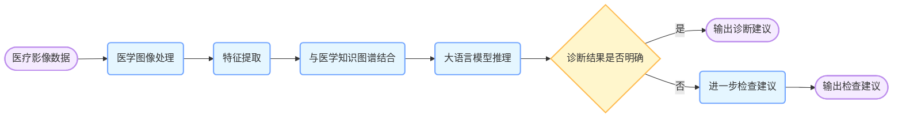

# 大语言模型在智能医疗影像诊断中的推理应用

> 关键词：大语言模型、智能医疗影像诊断、推理应用、深度学习、医学人工智能

> 摘要：本文深入探讨了大语言模型在智能医疗影像诊断中的推理应用。首先介绍了该研究的背景，包括目的、预期读者等内容。接着阐述了大语言模型与智能医疗影像诊断的核心概念及联系，详细讲解了相关算法原理和具体操作步骤，通过数学模型和公式进行了理论支撑，并结合实际案例进行说明。在项目实战部分，展示了开发环境搭建、源代码实现及解读。同时分析了大语言模型在智能医疗影像诊断中的实际应用场景，推荐了相关的工具和资源。最后对未来发展趋势与挑战进行总结，并给出常见问题的解答和扩展阅读参考资料，旨在为大语言模型在智能医疗影像诊断领域的应用提供全面且深入的技术指导。

## 1. 背景介绍 
### 1.1 目的和范围
随着医疗技术的不断发展，医疗影像在疾病诊断中发挥着越来越重要的作用。然而，医疗影像的解读需要专业的医学知识和丰富的临床经验，这使得医疗影像诊断的效率和准确性受到一定限制。大语言模型作为人工智能领域的重要成果，具有强大的语言理解和生成能力。本研究的目的在于探索如何将大语言模型应用于智能医疗影像诊断中的推理过程，提高诊断的效率和准确性，为临床决策提供更有力的支持。

本研究的范围涵盖了大语言模型的基本原理、智能医疗影像诊断的流程、大语言模型在影像诊断推理中的具体应用方法，以及相关的技术实现和实际应用案例分析。

### 1.2 预期读者
本文的预期读者包括医学领域的专业人士，如放射科医生、临床医生等，他们可以通过了解大语言模型在智能医疗影像诊断中的应用，更好地利用新技术提升诊断水平；计算机科学和人工智能领域的研究人员和开发者，他们可以从技术实现和算法原理的角度深入了解相关知识，为进一步的研究和开发提供参考；医疗信息化管理人员和政策制定者，他们可以通过本文了解大语言模型在医疗领域的应用趋势，为医疗信息化建设和政策制定提供依据。

### 1.3 文档结构概述
本文共分为十个部分。第一部分为背景介绍，阐述了研究的目的、预期读者和文档结构概述；第二部分介绍大语言模型与智能医疗影像诊断的核心概念及联系，包括原理和架构的文本示意图及 Mermaid 流程图；第三部分讲解核心算法原理和具体操作步骤，并使用 Python 源代码详细阐述；第四部分介绍数学模型和公式，进行详细讲解并举例说明；第五部分为项目实战，包括开发环境搭建、源代码详细实现和代码解读；第六部分分析实际应用场景；第七部分推荐相关的工具和资源；第八部分总结未来发展趋势与挑战；第九部分为附录，解答常见问题；第十部分提供扩展阅读和参考资料。

### 1.4 术语表
#### 1.4.1 核心术语定义
- **大语言模型（Large Language Model）**：基于深度学习技术，通过在大规模文本数据上进行训练，能够学习到语言的模式和规律，从而具备强大的语言理解和生成能力的模型。
- **智能医疗影像诊断（Intelligent Medical Image Diagnosis）**：利用人工智能技术，对医疗影像（如 X 光、CT、MRI 等）进行分析和诊断，辅助医生做出更准确的诊断决策的过程。
- **推理（Reasoning）**：在智能医疗影像诊断中，根据影像数据和相关知识，通过一定的逻辑和算法得出诊断结论的过程。

#### 1.4.2 相关概念解释
- **深度学习（Deep Learning）**：一种基于人工神经网络的机器学习方法，通过构建多层神经网络，自动从大量数据中学习特征和模式，在图像识别、自然语言处理等领域取得了显著的成果。
- **医学知识图谱（Medical Knowledge Graph）**：将医学领域的实体（如疾病、症状、检查方法等）及其关系以图的形式表示出来的知识模型，可用于辅助医疗影像诊断的推理过程。

#### 1.4.3 缩略词列表
- **CT（Computed Tomography）**：计算机断层扫描
- **MRI（Magnetic Resonance Imaging）**：磁共振成像
- **AI（Artificial Intelligence）**：人工智能

## 2. 核心概念与联系 
### 核心概念原理
#### 大语言模型原理
大语言模型通常基于Transformer架构，它由多个编码器和解码器层组成。Transformer架构通过自注意力机制（Self-Attention Mechanism）能够捕捉输入序列中不同位置之间的依赖关系，从而更好地理解文本的语义信息。在训练过程中，大语言模型使用大规模的文本数据进行无监督学习，学习语言的统计规律和模式。常见的大语言模型如GPT（Generative Pretrained Transformer）系列，通过预训练和微调的方式，可以应用于各种自然语言处理任务。

#### 智能医疗影像诊断原理
智能医疗影像诊断主要基于医学图像处理和机器学习技术。首先，对医疗影像进行预处理，包括图像增强、降噪、分割等操作，以提高图像的质量和特征提取的准确性。然后，使用深度学习模型（如卷积神经网络 CNN）对预处理后的影像进行特征提取和分类，将影像与已知的疾病模式进行匹配，从而辅助医生做出诊断。

### 架构的文本示意图
大语言模型在智能医疗影像诊断中的应用架构可以描述如下：

医疗影像数据首先经过医学图像处理模块进行预处理，提取出影像的关键特征。这些特征与医学知识图谱中的相关信息相结合，形成结构化的数据。大语言模型接收这些结构化数据，利用其强大的语言理解和生成能力，进行推理和分析。最终，大语言模型输出诊断建议和相关的解释信息，辅助医生做出决策。

### Mermaid 流程图


## 3. 核心算法原理 & 具体操作步骤 
### 核心算法原理
#### 自注意力机制
自注意力机制是大语言模型的核心组成部分，它允许模型在处理输入序列时，关注序列中不同位置的信息。给定输入序列 $X = [x_1, x_2, ..., x_n]$，自注意力机制的计算过程如下：

首先，将输入序列 $X$ 分别与三个可学习的权重矩阵 $W_Q$、$W_K$ 和 $W_V$ 相乘，得到查询矩阵 $Q$、键矩阵 $K$ 和值矩阵 $V$：

$Q = XW_Q$

$K = XW_K$

$V = XW_V$

然后，计算注意力分数：

$Attention(Q, K, V) = softmax(\frac{QK^T}{\sqrt{d_k}})V$

其中，$d_k$ 是查询和键向量的维度，$softmax$ 函数用于将注意力分数归一化到 $[0, 1]$ 之间。

#### 大语言模型在医疗影像诊断推理中的应用
在智能医疗影像诊断中，大语言模型可以根据影像特征和医学知识图谱中的信息进行推理。具体来说，大语言模型可以将输入的结构化数据转换为自然语言描述，然后根据预训练的语言模型进行推理和生成。例如，大语言模型可以根据影像中发现的病变特征和相关的医学知识，生成可能的疾病诊断和相应的解释。

### 具体操作步骤
#### 数据准备
1. 收集医疗影像数据，包括 X 光、CT、MRI 等不同类型的影像。
2. 对影像数据进行标注，标注内容包括疾病类型、病变位置、特征描述等。
3. 构建医学知识图谱，将医学领域的实体和关系进行整合。

#### 模型训练
1. 选择合适的大语言模型，如 GPT 系列或其他开源的语言模型。
2. 对大语言模型进行微调，使用医疗领域的文本数据进行训练，使模型适应医疗领域的语言特点和知识。

#### 推理过程
1. 对输入的医疗影像进行预处理和特征提取。
2. 将提取的特征与医学知识图谱中的信息进行结合，形成结构化数据。
3. 将结构化数据输入到大语言模型中进行推理，得到诊断建议和解释信息。

### Python 源代码详细阐述
```python
import torch
import torch.nn as nn
import torch.nn.functional as F

# 定义自注意力机制
class SelfAttention(nn.Module):
    def __init__(self, input_dim, d_k):
        super(SelfAttention, self).__init__()
        self.W_Q = nn.Linear(input_dim, d_k)
        self.W_K = nn.Linear(input_dim, d_k)
        self.W_V = nn.Linear(input_dim, d_k)

    def forward(self, X):
        Q = self.W_Q(X)
        K = self.W_K(X)
        V = self.W_V(X)

        attention_scores = torch.matmul(Q, K.transpose(-2, -1)) / torch.sqrt(torch.tensor(Q.size(-1), dtype=torch.float32))
        attention_probs = F.softmax(attention_scores, dim=-1)
        output = torch.matmul(attention_probs, V)
        return output

# 示例使用
input_dim = 128
d_k = 64
batch_size = 16
seq_length = 10

X = torch.randn(batch_size, seq_length, input_dim)
self_attention = SelfAttention(input_dim, d_k)
output = self_attention(X)
print(output.shape)
```

## 4. 数学模型和公式 & 详细讲解 & 举例说明 
### 自注意力机制数学模型
自注意力机制的数学模型可以用以下公式表示：

给定输入序列 $X = [x_1, x_2, ..., x_n]$，其中 $x_i \in \mathbb{R}^{d_{in}}$ 是输入序列中的第 $i$ 个向量，$d_{in}$ 是输入向量的维度。

首先，通过线性变换得到查询矩阵 $Q$、键矩阵 $K$ 和值矩阵 $V$：

$Q = XW_Q$，其中 $W_Q \in \mathbb{R}^{d_{in} \times d_k}$

$K = XW_K$，其中 $W_K \in \mathbb{R}^{d_{in} \times d_k}$

$V = XW_V$，其中 $W_V \in \mathbb{R}^{d_{in} \times d_v}$

$d_k$ 和 $d_v$ 分别是查询、键和值向量的维度。

然后，计算注意力分数：

$A_{ij} = \frac{Q_iK_j^T}{\sqrt{d_k}}$

其中，$Q_i$ 和 $K_j$ 分别是查询矩阵 $Q$ 和键矩阵 $K$ 的第 $i$ 行和第 $j$ 行。

最后，通过 $softmax$ 函数将注意力分数归一化，得到注意力权重：

$S_{ij} = \frac{exp(A_{ij})}{\sum_{k=1}^{n} exp(A_{ik})}$

并计算输出向量：

$y_i = \sum_{j=1}^{n} S_{ij}V_j$

### 详细讲解
自注意力机制的核心思想是通过计算输入序列中不同位置之间的注意力权重，来确定每个位置对其他位置的关注程度。查询矩阵 $Q$ 用于表示当前位置的查询信息，键矩阵 $K$ 用于表示其他位置的键信息，注意力分数 $A_{ij}$ 表示第 $i$ 个位置对第 $j$ 个位置的关注程度。通过 $softmax$ 函数将注意力分数归一化，得到注意力权重 $S_{ij}$，最后将注意力权重与值矩阵 $V$ 相乘，得到输出向量 $y_i$。

### 举例说明
假设输入序列 $X = [x_1, x_2, x_3]$，其中 $x_1 = [1, 2, 3]$，$x_2 = [4, 5, 6]$，$x_3 = [7, 8, 9]$，$d_{in} = 3$，$d_k = 2$，$d_v = 2$。

首先，计算查询矩阵 $Q$、键矩阵 $K$ 和值矩阵 $V$：

$W_Q = \begin{bmatrix} 0.1 & 0.2 \\ 0.3 & 0.4 \\ 0.5 & 0.6 \end{bmatrix}$

$W_K = \begin{bmatrix} 0.7 & 0.8 \\ 0.9 & 1.0 \\ 1.1 & 1.2 \end{bmatrix}$

$W_V = \begin{bmatrix} 1.3 & 1.4 \\ 1.5 & 1.6 \\ 1.7 & 1.8 \end{bmatrix}$

$Q = XW_Q = \begin{bmatrix} 1 & 2 & 3 \\ 4 & 5 & 6 \\ 7 & 8 & 9 \end{bmatrix} \begin{bmatrix} 0.1 & 0.2 \\ 0.3 & 0.4 \\ 0.5 & 0.6 \end{bmatrix} = \begin{bmatrix} 2.2 & 2.8 \\ 5.2 & 6.4 \\ 8.2 & 10.0 \end{bmatrix}$

$K = XW_K = \begin{bmatrix} 1 & 2 & 3 \\ 4 & 5 & 6 \\ 7 & 8 & 9 \end{bmatrix} \begin{bmatrix} 0.7 & 0.8 \\ 0.9 & 1.0 \\ 1.1 & 1.2 \end{bmatrix} = \begin{bmatrix} 5.8 & 6.4 \\ 13.0 & 14.2 \\ 20.2 & 22.0 \end{bmatrix}$

$V = XW_V = \begin{bmatrix} 1 & 2 & 3 \\ 4 & 5 & 6 \\ 7 & 8 & 9 \end{bmatrix} \begin{bmatrix} 1.3 & 1.4 \\ 1.5 & 1.6 \\ 1.7 & 1.8 \end{bmatrix} = \begin{bmatrix} 9.4 & 10.0 \\ 22.6 & 24.0 \\ 35.8 & 38.0 \end{bmatrix}$

然后，计算注意力分数：

$A = \frac{QK^T}{\sqrt{d_k}} = \frac{1}{\sqrt{2}} \begin{bmatrix} 2.2 & 2.8 \\ 5.2 & 6.4 \\ 8.2 & 10.0 \end{bmatrix} \begin{bmatrix} 5.8 & 13.0 & 20.2 \\ 6.4 & 14.2 & 22.0 \end{bmatrix} = \begin{bmatrix} 14.53 & 33.46 & 52.39 \\ 33.46 & 77.24 & 121.02 \\ 52.39 & 121.02 & 189.65 \end{bmatrix}$

最后，通过 $softmax$ 函数计算注意力权重，并计算输出向量：

$S = softmax(A) = \begin{bmatrix} 0.00 & 0.02 & 0.98 \\ 0.00 & 0.04 & 0.96 \\ 0.00 & 0.05 & 0.95 \end{bmatrix}$

$y = SV = \begin{bmatrix} 0.00 & 0.02 & 0.98 \\ 0.00 & 0.04 & 0.96 \\ 0.00 & 0.05 & 0.95 \end{bmatrix} \begin{bmatrix} 9.4 & 10.0 \\ 22.6 & 24.0 \\ 35.8 & 38.0 \end{bmatrix} = \begin{bmatrix} 35.08 & 37.24 \\ 34.94 & 37.12 \\ 34.91 & 37.10 \end{bmatrix}$

## 5. 项目实战：代码实际案例和详细解释说明 
### 5.1  开发环境搭建
#### 硬件环境
- 服务器：建议使用具有 GPU 加速的服务器，如 NVIDIA Tesla V100 或 A100，以提高模型训练和推理的效率。
- 内存：至少 32GB 以上的内存，以满足大语言模型的运行需求。

#### 软件环境
- 操作系统：Ubuntu 18.04 或更高版本。
- 深度学习框架：PyTorch 1.8 或更高版本。
- 医学图像处理库：SimpleITK、OpenCV 等。
- 自然语言处理库：Hugging Face Transformers 库。

#### 安装步骤
1. 安装 CUDA 和 cuDNN，以支持 GPU 加速。
2. 创建虚拟环境：

```bash
conda create -n medical_image_diagnosis python=3.8
conda