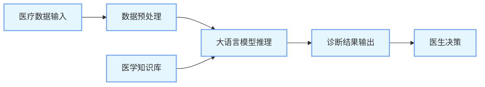

# 大语言模型在智能医疗诊断支持中的推理应用

> 关键词：大语言模型、智能医疗诊断支持、推理应用、医疗数据处理、临床决策辅助

> 摘要：本文深入探讨了大语言模型在智能医疗诊断支持中的推理应用。首先介绍了研究的背景、目的、预期读者、文档结构和相关术语。接着阐述了大语言模型与智能医疗诊断支持的核心概念及联系，包括原理和架构，并给出了相应的示意图和流程图。详细讲解了核心算法原理和具体操作步骤，通过Python代码进行了阐述。同时给出了相关的数学模型和公式，并举例说明。在项目实战部分，介绍了开发环境搭建、源代码实现与解读。分析了大语言模型在智能医疗诊断支持中的实际应用场景，推荐了相关的学习资源、开发工具框架和论文著作。最后总结了未来发展趋势与挑战，提供了常见问题解答和扩展阅读参考资料。

## 1. 背景介绍 
### 1.1 目的和范围
智能医疗诊断支持系统旨在利用先进的技术手段辅助医生进行更准确、高效的诊断。大语言模型作为近年来人工智能领域的重大突破，具备强大的语言理解和生成能力，其在智能医疗诊断支持中的推理应用具有巨大的潜力。本文章的目的是全面深入地探讨大语言模型如何应用于智能医疗诊断支持的推理过程，包括核心原理、算法实现、实际应用案例等方面。范围涵盖了大语言模型在医疗数据处理、症状分析、疾病诊断、治疗建议等多个环节的推理应用。

### 1.2 预期读者
本文的预期读者包括医疗行业的专业人员，如医生、护士、医学研究人员等，他们可以通过了解大语言模型在智能医疗诊断支持中的应用，探索如何借助技术提升诊断效率和准确性；人工智能领域的从业者，如算法工程师、数据科学家、软件开发者等，能够从中获取关于大语言模型在医疗场景下的具体应用思路和技术实现方法；以及对智能医疗和人工智能交叉领域感兴趣的学生、研究人员等，为他们提供深入学习和研究的参考。

### 1.3 文档结构概述
本文将按照以下结构进行阐述：首先介绍大语言模型与智能医疗诊断支持的核心概念及联系，包括原理和架构；接着详细讲解核心算法原理和具体操作步骤，并通过Python代码进行说明；给出相关的数学模型和公式，并举例说明其应用；在项目实战部分，介绍开发环境搭建、源代码实现与解读；分析大语言模型在智能医疗诊断支持中的实际应用场景；推荐相关的学习资源、开发工具框架和论文著作；最后总结未来发展趋势与挑战，提供常见问题解答和扩展阅读参考资料。

### 1.4 术语表
#### 1.4.1 核心术语定义
- **大语言模型**：是一种基于深度学习的人工智能模型，通过在大规模文本数据上进行训练，学习语言的模式和规律，从而具备强大的语言理解和生成能力。常见的大语言模型有GPT系列、BERT等。
- **智能医疗诊断支持**：利用信息技术和人工智能算法，为医疗人员在疾病诊断过程中提供辅助信息和决策建议的系统或方法。
- **推理应用**：指大语言模型根据输入的医疗信息，运用其学习到的知识和模式进行逻辑推导，得出诊断结果、治疗建议等结论的过程。

#### 1.4.2 相关概念解释
- **医疗数据处理**：对各种医疗数据，如病历、检查报告、影像资料等进行收集、清洗、转换和存储，以便大语言模型能够有效处理和分析。
- **症状分析**：通过对患者描述的症状信息进行深入分析，识别出可能的疾病线索。
- **疾病诊断**：根据患者的症状、病史、检查结果等信息，判断患者所患的疾病。
- **治疗建议**：基于疾病诊断结果，为患者提供合适的治疗方案和建议。

#### 1.4.3 缩略词列表
- **LLM**：Large Language Model，大语言模型
- **EHR**：Electronic Health Record，电子健康记录
- **NLP**：Natural Language Processing，自然语言处理

## 2. 核心概念与联系 
### 核心概念原理
大语言模型的核心原理基于深度学习中的神经网络架构，如Transformer架构。Transformer架构通过自注意力机制（Self-Attention Mechanism）能够捕捉文本中不同位置之间的依赖关系，从而更好地理解文本的语义信息。在训练过程中，大语言模型使用大规模的文本数据进行无监督学习，学习语言的语法、语义和语用等方面的知识。

在智能医疗诊断支持中，大语言模型可以接收各种形式的医疗信息，如患者的症状描述、病历记录、检查报告等。通过对这些信息的理解和分析，大语言模型可以利用其学习到的医疗知识进行推理，为医生提供诊断建议、疾病可能性排序、治疗方案推荐等支持。

### 架构示意图

该示意图展示了大语言模型在智能医疗诊断支持中的基本架构。首先，医疗数据输入到系统中，经过数据预处理阶段，对数据进行清洗、转换等操作，使其适合大语言模型处理。然后，大语言模型结合医学知识库进行推理，得出诊断结果。最后，医生根据诊断结果进行决策。

### 核心联系
大语言模型与智能医疗诊断支持之间存在着紧密的联系。大语言模型为智能医疗诊断支持提供了强大的语言处理和推理能力，能够处理复杂的医疗文本信息，挖掘其中的潜在知识。而智能医疗诊断支持为大语言模型提供了具体的应用场景和数据来源，促使大语言模型不断学习和优化医疗领域的知识。通过两者的结合，可以提高医疗诊断的准确性和效率，为患者提供更好的医疗服务。

## 3. 核心算法原理 & 具体操作步骤 
### 核心算法原理
大语言模型在智能医疗诊断支持中的推理主要基于预训练和微调两个阶段。

#### 预训练阶段
在预训练阶段，大语言模型使用大规模的通用文本数据进行无监督学习。常见的预训练任务包括掩码语言模型（Masked Language Model，MLM）和下一句预测（Next Sentence Prediction，NSP）。

- **掩码语言模型**：随机掩盖输入文本中的一些词，让模型预测被掩盖的词。例如，输入文本 “The [MASK] is a large animal”，模型需要预测出 [MASK] 处的词，如 “elephant”。
- **下一句预测**：给定两个句子，让模型判断第二个句子是否是第一个句子的下一句。

通过这些预训练任务，模型学习到语言的通用模式和知识。

#### 微调阶段
在微调阶段，使用医疗领域的标注数据对预训练好的模型进行微调。微调的目标是让模型适应医疗领域的特定任务，如疾病诊断、症状分析等。微调过程中，模型的参数会根据医疗数据进行调整，以提高模型在医疗任务上的性能。

### 具体操作步骤
#### 数据收集与预处理
1. **数据收集**：收集各种医疗数据，包括病历、检查报告、医学文献等。
2. **数据清洗**：去除数据中的噪声、重复信息和错误数据。
3. **数据标注**：对医疗数据进行标注，例如标注疾病类型、症状等信息。
4. **数据转换**：将数据转换为适合大语言模型输入的格式，如将文本数据转换为词向量表示。

#### 模型选择与加载
选择适合医疗任务的大语言模型，如BioBERT、ClinicalBERT等。加载预训练好的模型权重。

#### 模型微调
使用医疗标注数据对模型进行微调。以下是一个使用Python和Hugging Face Transformers库进行模型微调的示例代码：

```python
import torch
from transformers import AutoTokenizer, AutoModelForSequenceClassification, Trainer, TrainingArguments

# 加载预训练模型和分词器
model_name = "emilyalsentzer/Bio_ClinicalBERT"
tokenizer = AutoTokenizer.from_pretrained(model_name)
model = AutoModelForSequenceClassification.from_pretrained(model_name, num_labels=10)  # 假设有10种疾病类型

# 准备数据集
train_texts = ["患者出现咳嗽、发热症状", "患者有胸痛、呼吸困难表现"]
train_labels = [1, 2]  # 对应的疾病标签

train_encodings = tokenizer(train_texts, truncation=True, padding=True)
train_dataset = torch.utils.data.TensorDataset(
    torch.tensor(train_encodings['input_ids']),
    torch.tensor(train_encodings['attention_mask']),
    torch.tensor(train_labels)
)

# 定义训练参数
training_args = TrainingArguments(
    output_dir='./results',          # output directory
    num_train_epochs=3,              # total number of training epochs
    per_device_train_batch_size=16,  # batch size per device during training
    warmup_steps=500,                # number of warmup steps for learning rate scheduler
    weight_decay=0.01,               # strength of weight decay
    logging_dir='./logs',            # directory for storing logs
    logging_steps=10
)

# 定义训练器
trainer = Trainer(
    model=model,
    args=training_args,
    train_dataset=train_dataset
)

# 开始训练
trainer.train()
```

#### 模型推理
使用微调后的模型进行推理。以下是一个简单的推理代码示例：

```python
# 输入新的症状描述
new_text = "患者头痛、乏力"
new_encoding = tokenizer(new_text, truncation=True, padding=True, return_tensors='pt')

# 进行推理
with torch.no_grad():
    outputs = model(**new_encoding)
    logits = outputs.logits
    predicted_class_id = torch.argmax(logits, dim=-1).item()

print(f"预测的疾病类型ID: {predicted_class_id}")
```

## 4. 数学模型和公式 & 详细讲解 & 举例说明 
### 掩码语言模型损失函数
在掩码语言模型中，损失函数通常使用交叉熵损失（Cross-Entropy Loss）。假设模型预测的词概率分布为 $\hat{y}$，真实的词标签为 $y$，则交叉熵损失的计算公式为：

$$
L_{MLM} = - \sum_{i=1}^{V} y_i \log(\hat{y}_i)
$$

其中，$V$ 是词汇表的大小。

### 详细讲解
交叉熵损失衡量了模型预测的概率分布与真实标签之间的差异。当模型预测的概率分布与真实标签越接近时，交叉熵损失越小；反之，损失越大。在训练过程中，通过最小化交叉熵损失，模型不断调整参数，以提高对被掩盖词的预测准确性。

### 举例说明
假设词汇表包含三个词：["apple", "banana", "cherry"]，真实的词标签为 $y = [0, 1, 0]$，表示正确的词是 "banana"。模型预测的词概率分布为 $\hat{y} = [0.2, 0.7, 0.1]$。则交叉熵损失为：

$$
L_{MLM} = - (0 \times \log(0.2) + 1 \times \log(0.7) + 0 \times \log(0.1)) \approx - \log(0.7) \approx 0.357
$$

### 下一句预测损失函数
下一句预测任务也使用交叉熵损失。假设模型预测的下一句概率为 $\hat{p}$，真实的标签为 $p$（0 表示不是下一句，1 表示是下一句），则下一句预测的损失函数为：

$$
L_{NSP} = - p \log(\hat{p}) - (1 - p) \log(1 - \hat{p})
$$

### 详细讲解
该损失函数同样衡量了模型预测的下一句概率与真实标签之间的差异。当模型正确预测下一句时，损失较小；反之，损失较大。通过最小化该损失函数，模型学习到句子之间的逻辑关系。

### 举例说明
假设真实标签 $p = 1$，表示第二句是第一句的下一句，模型预测的下一句概率为 $\hat{p} = 0.8$。则下一句预测的损失为：

$$
L_{NSP} = - 1 \times \log(0.8) - (1 - 1) \times \log(1 - 0.8) \approx - \log(0.8) \approx 0.223
$$

### 微调阶段的损失函数
在微调阶段，损失函数通常也是交叉熵损失。假设模型预测的疾病类别概率分布为 $\hat{z}$，真实的疾病类别标签为 $z$，则微调阶段的损失函数为：

$$
L_{fine-tuning} = - \sum_{j=1}^{C} z_j \log(\hat{z}_j)
$$

其中，$C$ 是疾病类别的数量。

### 详细讲解
微调阶段的损失函数与掩码语言模型的损失函数类似，用于衡量模型预测的疾病类别概率分布与真实标签之间的差异。通过最小化该损失函数，模型在医疗领域的特定任务上进行优化。

### 举例说明
假设共有三种疾病类型，真实的疾病类别标签为 $z = [0, 1, 0]$，模型预测的疾病类别概率分布为 $\hat{z} = [0.1, 0.8, 0.1]$。则微调阶段的损失为：

$$
L_{fine-tuning} = - (0 \times \log(0.1) + 1 \times \log(0.8) + 0 \times \log(0.1)) \approx - \log(0.8) \approx 0.223
$$

## 5. 项目实战：代码实际案例和详细解释说明 
### 5.1  开发环境搭建
#### 安装Python
首先，确保你已经安装了Python 3.7或更高版本。可以从Python官方网站（https://www.python.org/downloads/）下载并安装。

#### 创建虚拟环境
为了避免不同项目之间的依赖冲突，建议使用虚拟环境。可以使用 `venv` 模块创建虚拟环境：

```bash
python -m venv myenv
```

激活虚拟环境：

- 在Windows上：
```bash
myenv\Scripts\activate
```
- 在Linux/Mac上：
```bash
source myenv/bin/activate
```

#### 安装必要的库
在虚拟环境中安装所需的库，包括 `transformers`、`torch` 等：

```bash
pip install transformers torch
```

### 5.2  源代码详细实现和代码解读
#### 数据准备
```python
import torch
from transformers import AutoTokenizer

# 加载分词器
tokenizer = AutoTokenizer.from_pretrained("emilyalsentzer/Bio_ClinicalBERT")

# 准备训练数据
train_texts = ["患者出现咳嗽、发热症状", "患者有胸痛、呼吸困难表现"]
train_labels = [1, 2]  # 对应的疾病标签

# 对文本进行分词和编码
train_encodings = tokenizer(train_texts, truncation=True, padding=True)

# 创建数据集
train_dataset = torch.utils.data.TensorDataset(
    torch.tensor(train_encodings['input_ids']),
    torch.tensor(train_encodings['attention_mask']),
    torch.tensor(train_labels)
)
```
代码解读：
- 首先，使用 `AutoTokenizer` 从Hugging Face模型库中加载预训练的分词器。
- 然后，准备训练文本和对应的疾病标签。
- 使用分词器对文本进行分词和编码，得到输入ID和注意力掩码。
- 最后，将编码后的数据和标签组合成一个 `TensorDataset` 对象。

#### 模型加载和微调
```python
from transformers import AutoModelForSequenceClassification, Trainer, TrainingArguments

# 加载预训练模型
model = AutoModelForSequenceClassification.from_pretrained("emilyalsentzer/Bio_ClinicalBERT", num_labels=3)  # 假设有3种疾病类型

# 定义训练参数
training_args = TrainingArguments(
    output_dir='./results',          # 输出目录
    num_train_epochs=3,              # 训练轮数
    per_device_train_batch_size=16,  # 每个设备的训练批次大小
    warmup_steps=500,                # 学习率热身步数
    weight_decay=0.01,               # 权重衰减率
    logging_dir='./logs',            # 日志目录
    logging_steps=10
)

# 定义训练器
trainer = Trainer(
    model=model,
    args=training_args,
    train_dataset=train_dataset
)

# 开始训练
trainer.train()
```
代码解读：
- 使用 `AutoModelForSequenceClassification` 加载预训练的模型，并指定疾病类别的数量。
- 定义训练参数，包括输出目录、训练轮数、批次大小等。
- 创建 `Trainer` 对象，将模型、训练参数和训练数据集传入。
- 调用 `trainer.train()` 方法开始训练模型。

#### 模型推理
```python
# 输入新的症状描述
new_text = "患者头痛、乏力"
new_encoding = tokenizer(new_text, truncation=True, padding=True, return_tensors='pt')

# 进行推理
with torch.no_grad():
    outputs = model(**new_encoding)
    logits = outputs.logits
    predicted_class_id = torch.argmax(logits, dim=-1).item()

print(f"预测的疾病类型ID: {predicted_class_id}")
```
代码解读：
- 输入新的症状描述，并使用分词器进行编码。
- 在 `torch.no_grad()` 上下文管理器中进行推理，避免计算梯度。
- 获取模型的输出 logits，并使用 `torch.argmax` 函数找到预测的疾病类别ID。
- 打印预测的疾病类型ID。

### 5.3  代码解读与分析
#### 数据准备部分
数据准备部分的关键是使用合适的分词器对文本进行编码，将文本转换为模型可以处理的数字表示。分词器会将文本分割成一个个词元（tokens），并将词元映射到对应的ID。注意力掩码用于指示哪些词元是真实的输入，哪些是填充的词元。

#### 模型加载和微调部分
使用 `AutoModelForSequenceClassification` 加载预训练的模型，并根据具体的任务需求调整输出层的神经元数量。训练参数的设置会影响模型的训练效果和性能，例如训练轮数、批次大小、学习率等。`Trainer` 类封装了模型训练的过程，简化了训练代码的编写。

#### 模型推理部分
在推理阶段，使用 `torch.no_grad()` 上下文管理器可以避免不必要的梯度计算，提高推理速度。通过 `torch.argmax` 函数可以找到概率最大的疾病类别ID，从而得到预测结果。

## 6. 实际应用场景 
### 辅助诊断
大语言模型可以根据患者的症状描述、病史、检查结果等信息，进行推理和分析，为医生提供可能的疾病诊断建议。例如，当患者描述“咳嗽、发热、乏力”等症状时，大语言模型可以结合医学知识，给出可能的疾病列表，如感冒、流感、肺炎等，并按照可能性大小进行排序，帮助医生更快速地做出诊断。

### 治疗方案推荐
基于疾病诊断结果，大语言模型可以参考医学指南和临床经验，为患者推荐合适的治疗方案。它可以考虑患者的年龄、性别、过敏史等因素，提供个性化的治疗建议。例如，对于患有高血压的患者，大语言模型可以根据患者的具体情况，推荐合适的降压药物和剂量。

### 医学文献检索与分析
大语言模型可以处理大量的医学文献，帮助医生快速检索和分析相关的研究成果。当医生遇到疑难病症时，可以输入相关的关键词，大语言模型可以从海量的医学文献中筛选出有价值的信息，如疾病的最新治疗方法、研究进展等，为医生的临床决策提供参考。

### 医患沟通辅助
在医患沟通中，大语言模型可以帮助医生更好地理解患者的问题和需求，提供准确的回答和解释。同时，它也可以将医学专业知识以通俗易懂的语言传达给患者，提高患者对疾病和治疗的理解程度，增强医患之间的沟通效果。

## 7. 工具和资源推荐
### 7.1 学习资源推荐
#### 7.1.1 书籍推荐
- 《深度学习》（Deep Learning）：由Ian Goodfellow、Yoshua Bengio和Aaron Courville所著，是深度学习领域的经典教材，介绍了深度学习的基本原理和算法。
- 《自然语言处理入门》：帮助读者了解自然语言处理的基本概念和方法，对于理解大语言模型的工作原理有很大的帮助。
- 《医学人工智能》：介绍了人工智能在医学领域的应用，包括智能医疗诊断支持等方面的内容。

#### 7.1.2 在线课程
- Coursera上的“深度学习专项课程”（Deep Learning Specialization）：由Andrew Ng教授授课，系统地介绍了深度学习的各个方面。
- edX上的“自然语言处理基础”（Foundations of Natural Language Processing）：提供了自然语言处理的基础知识和实践经验。
- 中国大学MOOC上的“医学信息学”：讲解了医学信息学的相关知识，包括医疗数据处理、智能医疗系统等内容。

#### 7.1.3 技术博客和网站
- Hugging Face官方博客：提供了大语言模型的最新研究成果、应用案例和技术教程。
- arXiv.org：是一个预印本平台，发布了大量的人工智能和医学领域的研究论文。
- 丁香园：是一个专业的医学网站，提供了丰富的医学知识和临床经验分享。

### 7.2 开发工具框架推荐
#### 7.2.1 IDE和编辑器
- PyCharm：是一款专业的Python集成开发环境，提供了丰富的代码编辑、调试和项目管理功能。
- Jupyter Notebook：是一个交互式的开发环境，适合进行数据分析和模型实验。
- Visual Studio Code：是一款轻量级的代码编辑器，支持多种编程语言和插件扩展。

#### 7.2.2 调试和性能分析工具
- PyTorch Profiler：可以帮助开发者分析模型的性能瓶颈，优化代码的运行效率。
- TensorBoard：是一个可视化工具，用于监控模型的训练过程和性能指标。
- cProfile：是Python内置的性能分析工具，可以分析代码的运行时间和函数调用情况。

#### 7.2.3 相关框架和库
- Hugging Face Transformers：提供了丰富的预训练模型和工具，方便开发者进行大语言模型的开发和应用。
- PyTorch：是一个开源的深度学习框架，具有强大的计算能力和灵活性。
- Scikit-learn：是一个常用的机器学习库，提供了多种机器学习算法和工具，可用于数据预处理和模型评估。

### 7.3 相关论文著作推荐
#### 7.3.1 经典论文
- “Attention Is All You Need”：介绍了Transformer架构，是大语言模型的基础。
- “BERT: Pre-training of Deep Bidirectional Transformers for Language Understanding”：提出了BERT模型，开启了预训练语言模型的新时代。
- “BioBERT: a pre-trained biomedical language representation model for biomedical text mining”：介绍了BioBERT模型，专门针对生物医学领域进行了预训练。

#### 7.3.2 最新研究成果
- 关注顶级学术会议，如NeurIPS、ICML、ACL等，这些会议上会发布人工智能领域的最新研究成果。
- 查阅医学领域的顶级期刊，如《新英格兰医学杂志》（The New England Journal of Medicine）、《柳叶刀》（The Lancet）等，了解人工智能在医学领域的应用进展。

#### 7.3.3 应用案例分析
- 一些医疗科技公司和研究机构会发布大语言模型在智能医疗诊断支持中的应用案例，可以通过他们的官方网站或学术论文了解具体的应用情况和效果。

## 8. 总结：未来发展趋势与挑战
### 未来发展趋势
- **多模态融合**：未来的大语言模型将不仅仅局限于处理文本信息，还会融合图像、视频、音频等多模态数据。例如，结合医学影像（如X光、CT等）和患者的症状描述进行更准确的诊断。
- **个性化医疗**：根据患者的基因信息、生活习惯、环境因素等，提供更加个性化的医疗诊断和治疗方案。大语言模型可以学习大量的个性化数据，为每个患者提供精准的医疗服务。
- **与医疗设备集成**：大语言模型将与各种医疗设备进行集成，实时获取患者的生理数据，如心率、血压、血糖等，并进行实时分析和预警。例如，智能手环、智能血糖仪等设备可以将数据传输给大语言模型，为医生提供更全面的患者信息。
- **跨领域协作**：人工智能与医学、生物学、统计学等多个领域的专家进行更深入的协作，共同推动智能医疗诊断支持的发展。跨领域的研究将带来更多创新的方法和技术。

### 挑战
- **数据隐私和安全**：医疗数据包含大量的个人敏感信息，如何确保数据的隐私和安全是一个重要的挑战。在使用大语言模型处理医疗数据时，需要采取严格的加密和访问控制措施，防止数据泄露。
- **数据质量和标注**：医疗数据的质量参差不齐，存在噪声、错误和不完整的情况。同时，数据标注需要专业的医学知识，标注成本较高。提高数据质量和标注效率是提高大语言模型性能的关键。
- **模型可解释性**：大语言模型通常是黑盒模型，其决策过程难以解释。在医疗领域，医生需要了解模型的推理过程和依据，以便做出可靠的决策。提高模型的可解释性是一个亟待解决的问题。
- **法规和伦理问题**：智能医疗诊断支持涉及到患者的生命健康和权益，需要遵循严格的法规和伦理准则。例如，模型的诊断结果是否可以作为最终的诊断依据，如何处理误诊和漏诊等问题，都需要进行深入的探讨和规范。

## 9. 附录：常见问题与解答
### 大语言模型在智能医疗诊断支持中的准确性如何保证？
大语言模型的准确性可以通过以下几个方面来保证：
- 使用高质量的医疗数据进行训练，包括大量的病历、检查报告等。
- 对数据进行严格的清洗和标注，确保数据的准确性和一致性。
- 采用合适的模型架构和训练方法，如微调预训练模型、使用集成学习等。
- 进行严格的模型评估和验证，使用交叉验证、测试集等方法评估模型的性能。

### 大语言模型能否完全替代医生进行诊断？
目前大语言模型还不能完全替代医生进行诊断。虽然大语言模型具有强大的语言处理和推理能力，但医疗诊断是一个复杂的过程，需要医生的临床经验、专业知识和判断力。大语言模型可以作为医生的辅助工具，提供诊断建议和参考信息，但最终的诊断决策仍需要医生根据患者的具体情况进行综合判断。

### 如何解决大语言模型在医疗领域的可解释性问题？
可以采用以下方法解决大语言模型的可解释性问题：
- 使用可解释的模型架构，如决策树、规则引擎等，或者将可解释的组件与大语言模型相结合。
- 开发解释性技术，如特征重要性分析、决策路径可视化等，帮助医生理解模型的决策过程。
- 进行人工验证和解释，由医学专家对模型的诊断结果进行解释和验证。

### 大语言模型在医疗领域的应用是否会导致医疗人员失业？
大语言模型在医疗领域的应用不会导致医疗人员失业，而是会改变医疗人员的工作方式。大语言模型可以帮助医疗人员提高工作效率，减少繁琐的重复性工作，使他们能够将更多的时间和精力投入到患者的关怀和复杂病例的处理上。同时，大语言模型的应用也需要医疗人员进行监督和验证，确保诊断结果的准确性和可靠性。

## 10. 扩展阅读 & 参考资料
- 《人工智能时代的医疗革命》
- 《医学数据挖掘与分析》
- Hugging Face官方文档（https://huggingface.co/docs/transformers/index）
- PyTorch官方文档（https://pytorch.org/docs/stable/index.html）
- 相关学术论文和研究报告

作者：AI天才研究院/AI Genius Institute & 禅与计算机程序设计艺术 /Zen And The Art of Computer Programming