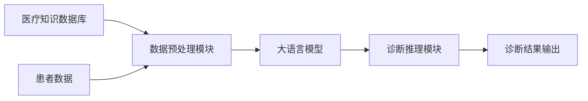

# 大语言模型在智能医疗诊断支持中的推理应用

> 关键词：大语言模型、智能医疗诊断支持、推理应用、医疗数据处理、诊断辅助

> 摘要：本文聚焦于大语言模型在智能医疗诊断支持中的推理应用。首先介绍了相关背景，包括目的、预期读者等内容。接着阐述了大语言模型与智能医疗诊断支持的核心概念及联系，详细讲解了核心算法原理与操作步骤，并给出了数学模型和公式。通过项目实战，展示了大语言模型在医疗诊断推理中的代码实现和解读。分析了其实际应用场景，推荐了相关的学习工具、资源和论文著作。最后总结了未来发展趋势与挑战，并提供了常见问题解答和扩展阅读参考资料，旨在全面深入地探讨大语言模型在智能医疗诊断支持领域的重要作用和应用价值。

## 1. 背景介绍 
### 1.1 目的和范围
随着人工智能技术的飞速发展，大语言模型展现出了强大的语言理解和生成能力。在医疗领域，准确、高效的诊断对于患者的治疗和康复至关重要。本文章的目的在于探讨大语言模型如何应用于智能医疗诊断支持中的推理过程，以提高诊断的准确性和效率。范围涵盖了大语言模型的基本原理、在医疗诊断推理中的具体应用方式、相关算法和数学模型，以及实际项目中的实现和应用场景分析等方面。

### 1.2 预期读者
本文预期读者包括医疗领域的专业人士，如医生、医学研究人员等，他们可以通过了解大语言模型在诊断支持中的应用，为临床实践和研究提供新的思路和方法；人工智能领域的从业者，包括程序员、算法工程师、软件架构师等，可从中获取在医疗场景下应用大语言模型的技术细节和实践经验；对智能医疗感兴趣的科研人员和学生，有助于他们深入了解该领域的前沿动态和发展趋势。

### 1.3 文档结构概述
本文首先介绍背景信息，让读者了解研究的目的、面向的读者群体和文档的整体结构。接着阐述大语言模型与智能医疗诊断支持的核心概念及其相互联系，为后续内容奠定基础。然后详细讲解核心算法原理和具体操作步骤，并给出相应的数学模型和公式。通过项目实战部分，展示代码实现和详细解读。分析大语言模型在智能医疗诊断支持中的实际应用场景。推荐相关的学习工具、资源和论文著作，方便读者进一步深入学习。最后总结未来发展趋势与挑战，提供常见问题解答和扩展阅读参考资料。

### 1.4 术语表
#### 1.4.1 核心术语定义
- **大语言模型（Large Language Model）**：基于深度学习技术，通过在大规模文本数据上进行训练，能够学习到语言的统计规律和语义信息，具备强大的语言理解和生成能力的模型。例如GPT - 3、BERT等。
- **智能医疗诊断支持（Intelligent Medical Diagnosis Support）**：利用人工智能技术，结合医疗知识和患者数据，为医生提供辅助诊断信息和建议，帮助提高诊断的准确性和效率的系统或方法。
- **推理应用（Reasoning Application）**：大语言模型在智能医疗诊断支持中，根据输入的患者信息、医疗知识等进行逻辑推理，得出诊断结果或建议的过程。

#### 1.4.2 相关概念解释
- **医疗数据处理**：对患者的病历、检查报告、影像资料等各种医疗数据进行收集、整理、清洗、转换等操作，以便大语言模型能够更好地理解和处理这些数据。
- **诊断辅助**：大语言模型通过分析患者数据和医疗知识，为医生提供可能的诊断结果、鉴别诊断建议、治疗方案参考等信息，辅助医生做出更准确的诊断和治疗决策。

#### 1.4.3 缩略词列表
- **LLM**：Large Language Model（大语言模型）
- **NLP**：Natural Language Processing（自然语言处理）

## 2. 核心概念与联系 

### 核心概念原理
大语言模型的核心原理基于深度学习中的神经网络架构，如Transformer架构。Transformer架构引入了自注意力机制（Self - Attention Mechanism），能够捕捉输入序列中不同位置之间的依赖关系，从而更好地处理长文本。通过在大规模文本数据上进行无监督学习，大语言模型学习到了丰富的语言知识和语义信息。

在智能医疗诊断支持中，需要将医疗知识和患者数据进行整合。医疗知识可以包括医学教科书、临床指南、病例报告等，患者数据则包括症状、体征、检查结果等。大语言模型通过对这些信息的理解和推理，为医生提供诊断支持。

### 架构的文本示意图
```plaintext
+---------------------+
|  医疗知识数据库    |
| （医学教科书、指南等） |
+---------------------+
         |
         v
+---------------------+
|  数据预处理模块    |
| （清洗、转换等）    |
+---------------------+
         |
         v
+---------------------+
|  大语言模型        |
| （Transformer架构） |
+---------------------+
         |
         v
+---------------------+
|  诊断推理模块      |
| （逻辑推理、决策）  |
+---------------------+
         |
         v
+---------------------+
|  诊断结果输出      |
| （诊断建议、报告）  |
+---------------------+
```

### Mermaid流程图


## 3. 核心算法原理 & 具体操作步骤 

### 核心算法原理
大语言模型在智能医疗诊断支持中的推理主要基于自然语言处理技术和知识图谱。以下是核心算法原理的Python代码示例：

```python
import torch
from transformers import AutoTokenizer, AutoModelForCausalLM

# 加载预训练的大语言模型和分词器
tokenizer = AutoTokenizer.from_pretrained("gpt2")
model = AutoModelForCausalLM.from_pretrained("gpt2")

# 定义输入的医疗信息
medical_info = "患者出现发热、咳嗽症状，血常规显示白细胞升高。"

# 对输入信息进行分词
input_ids = tokenizer.encode(medical_info, return_tensors='pt')

# 生成推理结果
output = model.generate(input_ids, max_length=100, num_beams=5, no_repeat_ngram_size=2, early_stopping=True)

# 解码输出结果
result = tokenizer.decode(output[0], skip_special_tokens=True)
print(result)
```

### 具体操作步骤
1. **数据准备**：收集医疗知识和患者数据，并进行预处理。预处理包括数据清洗、去除噪声、标准化等操作。
2. **模型加载**：选择合适的大语言模型，并使用预训练的权重进行初始化。可以使用Hugging Face的`transformers`库来加载模型和分词器。
3. **输入编码**：将输入的医疗信息使用分词器进行编码，转换为模型可以接受的输入格式。
4. **推理生成**：将编码后的输入信息输入到模型中，使用生成算法生成推理结果。
5. **结果解码**：将模型生成的结果使用分词器进行解码，转换为自然语言文本。

## 4. 数学模型和公式 & 详细讲解 & 举例说明 

### 自注意力机制数学模型
自注意力机制是Transformer架构的核心组成部分，其数学模型如下：

设输入序列为 $X = [x_1, x_2, \cdots, x_n]$，其中 $x_i \in \mathbb{R}^d$，$d$ 是输入向量的维度。

首先，通过线性变换得到查询（Query）、键（Key）和值（Value）矩阵：

$$
Q = XW^Q, \quad K = XW^K, \quad V = XW^V
$$

其中 $W^Q \in \mathbb{R}^{d \times d_k}$，$W^K \in \mathbb{R}^{d \times d_k}$，$W^V \in \mathbb{R}^{d \times d_v}$ 是可学习的权重矩阵。

然后，计算注意力分数：

$$
\text{Attention}(Q, K, V) = \text{softmax}\left(\frac{QK^T}{\sqrt{d_k}}\right)V
$$

### 详细讲解
自注意力机制通过计算查询向量与键向量之间的相似度，得到每个位置的注意力权重，然后根据这些权重对值向量进行加权求和，从而得到每个位置的输出。$\frac{1}{\sqrt{d_k}}$ 是为了防止点积结果过大，导致梯度消失或爆炸。

### 举例说明
假设输入序列 $X$ 是一个包含三个词向量的序列，$X = [x_1, x_2, x_3]$，每个词向量的维度 $d = 4$。

设 $W^Q, W^K, W^V$ 是 $4 \times 2$ 的矩阵。则 $Q, K, V$ 是 $3 \times 2$ 的矩阵。

计算 $QK^T$ 得到一个 $3 \times 3$ 的矩阵，对其进行缩放和softmax操作，得到注意力权重矩阵。最后将注意力权重矩阵与 $V$ 相乘，得到输出矩阵。

## 5. 项目实战：代码实际案例和详细解释说明 

### 5.1  开发环境搭建
- **操作系统**：推荐使用Linux系统，如Ubuntu 20.04。
- **Python版本**：Python 3.8及以上。
- **安装依赖库**：使用`pip`安装必要的库，如`transformers`、`torch`等。

```bash
pip install transformers torch
```

### 5.2  源代码详细实现和代码解读
```python
import torch
from transformers import AutoTokenizer, AutoModelForCausalLM

# 加载预训练的大语言模型和分词器
tokenizer = AutoTokenizer.from_pretrained("gpt2")
model = AutoModelForCausalLM.from_pretrained("gpt2")

# 定义输入的医疗信息
medical_info = "患者出现发热、咳嗽症状，血常规显示白细胞升高。"

# 对输入信息进行分词
input_ids = tokenizer.encode(medical_info, return_tensors='pt')

# 生成推理结果
output = model.generate(input_ids, max_length=100, num_beams=5, no_repeat_ngram_size=2, early_stopping=True)

# 解码输出结果
result = tokenizer.decode(output[0], skip_special_tokens=True)
print(result)
```

### 代码解读与分析
1. **加载模型和分词器**：使用`AutoTokenizer.from_pretrained`和`AutoModelForCausalLM.from_pretrained`加载预训练的GPT - 2模型和对应的分词器。
2. **定义输入信息**：将患者的症状和检查结果作为输入信息。
3. **分词**：使用分词器将输入信息编码为模型可以接受的输入格式。
4. **生成推理结果**：使用`model.generate`方法生成推理结果，设置了最大长度、束搜索的束数、避免重复的n - gram大小等参数。
5. **解码结果**：使用分词器将模型生成的结果解码为自然语言文本并输出。

## 6. 实际应用场景 
### 辅助诊断
大语言模型可以根据患者的症状、检查结果等信息，结合医疗知识，为医生提供可能的诊断结果和鉴别诊断建议。例如，当患者出现发热、咳嗽等症状时，大语言模型可以分析可能的病因，如感冒、肺炎、支气管炎等，并列出相应的鉴别要点。

### 治疗方案推荐
在诊断明确后，大语言模型可以根据患者的具体情况，如年龄、性别、病情严重程度等，结合临床指南和专家经验，为医生提供治疗方案的参考。例如，对于某种疾病，推荐合适的药物、治疗剂量和疗程等。

### 医学教育和培训
大语言模型可以作为医学教育和培训的工具，为医学生和医生提供案例分析、知识讲解等服务。例如，通过输入一个病例，大语言模型可以详细分析诊断思路和治疗方法，帮助学习者提高诊断和治疗水平。

## 7. 工具和资源推荐
### 7.1 学习资源推荐
#### 7.1.1 书籍推荐
- 《深度学习》（Deep Learning）：由Ian Goodfellow、Yoshua Bengio和Aaron Courville所著，是深度学习领域的经典教材，涵盖了神经网络、优化算法等基础知识。
- 《自然语言处理入门》：帮助读者快速了解自然语言处理的基本概念和方法，为学习大语言模型打下基础。

#### 7.1.2 在线课程
- Coursera上的“深度学习专项课程”：由Andrew Ng教授授课，系统地介绍了深度学习的理论和实践。
- edX上的“自然语言处理”课程：提供了自然语言处理的高级知识和技术。

#### 7.1.3 技术博客和网站
- Hugging Face博客：提供了大语言模型的最新研究成果和应用案例。
- arXiv：可以获取最新的学术论文，了解大语言模型在医疗领域的前沿研究。

### 7.2 开发工具框架推荐
#### 7.2.1 IDE和编辑器
- PyCharm：功能强大的Python集成开发环境，提供代码编辑、调试、版本控制等功能。
- Jupyter Notebook：交互式的开发环境，适合进行数据探索和模型实验。

#### 7.2.2 调试和性能分析工具
- TensorBoard：用于可视化模型训练过程中的指标，如损失函数、准确率等。
- PyTorch Profiler：可以分析模型的性能瓶颈，优化代码的运行效率。

#### 7.2.3 相关框架和库
- Hugging Face Transformers：提供了丰富的预训练模型和工具，方便开发大语言模型应用。
- PyTorch：深度学习框架，支持高效的模型训练和推理。

### 7.3 相关论文著作推荐
#### 7.3.1 经典论文
- 《Attention Is All You Need》：介绍了Transformer架构，是大语言模型的基础。
- 《BERT: Pre - training of Deep Bidirectional Transformers for Language Understanding》：提出了BERT模型，开创了预训练语言模型的先河。

#### 7.3.2 最新研究成果
- 关注顶级学术会议，如ACL、EMNLP等，获取大语言模型在医疗领域的最新研究成果。

#### 7.3.3 应用案例分析
- 一些医学期刊和会议会发表大语言模型在智能医疗诊断支持中的应用案例，可以从中学习实际应用的经验和方法。

## 8. 总结：未来发展趋势与挑战
### 未来发展趋势
- **多模态融合**：将大语言模型与图像识别、音频处理等技术相结合，实现多模态的医疗诊断支持。例如，同时分析患者的病历、影像资料和语音描述，提高诊断的准确性。
- **个性化医疗**：根据患者的基因信息、生活习惯等个性化因素，为患者提供更加精准的诊断和治疗方案。
- **与医疗物联网的结合**：通过与医疗设备和传感器的连接，实时获取患者的生理数据，实现实时的健康监测和诊断预警。

### 挑战
- **数据隐私和安全**：医疗数据包含大量的敏感信息，如何保证数据的隐私和安全是一个重要的挑战。
- **模型可解释性**：大语言模型通常是黑盒模型，难以解释其推理过程和结果。在医疗领域，模型的可解释性至关重要，需要开发可解释的模型和方法。
- **医疗知识的更新和维护**：医学知识不断更新，需要及时将新的知识融入到大语言模型中，保证模型的准确性和有效性。

## 9. 附录：常见问题与解答
### 问题1：大语言模型在医疗诊断中的准确性如何保证？
解答：可以通过以下方法保证准确性：使用高质量的医疗数据进行训练；结合医学专家的知识和经验对模型进行校准和验证；不断更新模型的训练数据，以适应医学知识的更新。

### 问题2：大语言模型能否完全替代医生进行诊断？
解答：目前大语言模型还不能完全替代医生进行诊断。虽然大语言模型可以提供辅助诊断信息，但医生的临床经验、判断力和人文关怀等方面是模型无法替代的。大语言模型主要起到辅助医生的作用，帮助医生提高诊断的效率和准确性。

### 问题3：如何解决大语言模型在医疗应用中的数据隐私问题？
解答：可以采用数据加密、访问控制、匿名化处理等技术手段来保护数据隐私。同时，遵守相关的法律法规和伦理准则，确保数据的合法使用。

## 10. 扩展阅读 & 参考资料
- 相关的医学书籍和期刊，如《新英格兰医学杂志》《柳叶刀》等。
- 人工智能领域的学术会议论文集，如NeurIPS、ICML等。
- Hugging Face官方文档和教程。

作者：AI天才研究院/AI Genius Institute & 禅与计算机程序设计艺术 /Zen And The Art of Computer Programming