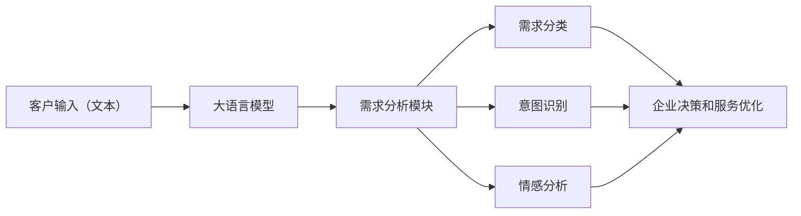

# 大语言模型在智能客户需求分析中的推理应用

> 关键词：大语言模型、智能客户需求分析、推理应用、自然语言处理、客户洞察

> 摘要：本文深入探讨了大语言模型在智能客户需求分析中的推理应用。首先介绍了相关背景，包括目的范围、预期读者等。接着阐述了核心概念及联系，通过示意图和流程图呈现其架构。详细讲解了核心算法原理与操作步骤，结合 Python 代码说明。运用数学模型和公式进一步剖析，辅以实际例子加深理解。通过项目实战展示代码实现与解读，分析其在实际中的应用场景。同时推荐了学习资源、开发工具框架及相关论文著作。最后总结了未来发展趋势与挑战，并提供常见问题解答和扩展阅读参考资料，旨在为相关领域的研究者和从业者提供全面而深入的技术指导。

## 1. 背景介绍 
### 1.1 目的和范围
在当今竞争激烈的商业环境中，深入了解客户需求是企业成功的关键。传统的客户需求分析方法往往效率低下、准确性有限，难以满足企业日益增长的需求。大语言模型的出现为智能客户需求分析带来了新的机遇。本文的目的是探讨大语言模型在智能客户需求分析中的推理应用，详细介绍相关技术原理、实现步骤和实际应用场景。范围涵盖从核心概念的阐述到项目实战的演示，以及学习资源和未来趋势的分析。

### 1.2 预期读者
本文预期读者包括人工智能领域的研究者、软件开发人员、企业的市场和客户服务人员以及对大语言模型和客户需求分析感兴趣的爱好者。对于研究者，本文提供了深入的技术分析和最新的研究方向；对于开发人员，包含了具体的代码实现和开发指导；对于企业人员，有助于理解如何利用大语言模型提升客户需求分析的效率和质量；对于爱好者，能够帮助他们了解相关领域的基本概念和应用场景。

### 1.3 文档结构概述
本文将按照以下结构进行组织：首先介绍核心概念与联系，通过文本示意图和 Mermaid 流程图展示大语言模型在智能客户需求分析中的架构；接着详细讲解核心算法原理和具体操作步骤，使用 Python 代码进行说明；然后介绍数学模型和公式，并举例说明；通过项目实战展示代码实际案例和详细解释；分析实际应用场景；推荐学习资源、开发工具框架和相关论文著作；最后总结未来发展趋势与挑战，提供常见问题解答和扩展阅读参考资料。

### 1.4 术语表
#### 1.4.1 核心术语定义
- **大语言模型（Large Language Model）**：基于深度学习技术训练的具有大量参数的语言模型，能够处理和生成自然语言文本，如 GPT - 3、BERT 等。
- **智能客户需求分析（Intelligent Customer Requirement Analysis）**：利用人工智能技术，对客户的需求进行自动识别、理解和分析，以支持企业的决策和服务优化。
- **推理（Reasoning）**：大语言模型根据输入的信息，运用其内部的知识和逻辑进行分析和推导，得出结论或建议的过程。

#### 1.4.2 相关概念解释
- **自然语言处理（Natural Language Processing，NLP）**：是人工智能的一个分支，研究如何让计算机理解、处理和生成自然语言。大语言模型是自然语言处理中的一种重要技术。
- **客户洞察（Customer Insight）**：通过对客户数据的分析和理解，深入了解客户的行为、偏好和需求，为企业提供有价值的信息。

#### 1.4.3 缩略词列表
- **NLP**：Natural Language Processing
- **LLM**：Large Language Model

## 2. 核心概念与联系 

### 核心概念原理
大语言模型在智能客户需求分析中的推理应用基于自然语言处理技术。大语言模型通过在大规模文本数据上进行训练，学习到语言的语法、语义和语用信息，能够理解和生成自然语言文本。在智能客户需求分析中，大语言模型接收客户的文本输入，如客户的咨询、反馈等，然后运用其内部的知识和逻辑进行推理，识别客户的需求、意图和情感等信息。

### 架构的文本示意图
```plaintext
客户输入（文本） -> 大语言模型 -> 需求分析模块 -> 需求分类、意图识别、情感分析等结果 -> 企业决策和服务优化
```

### Mermaid 流程图


## 3. 核心算法原理 & 具体操作步骤 

### 核心算法原理
大语言模型通常基于Transformer架构，如GPT系列模型采用了自注意力机制（Self - Attention Mechanism）。自注意力机制允许模型在处理每个输入位置时，关注输入序列中的其他位置，从而捕捉长距离依赖关系。以下是自注意力机制的 Python 代码实现：

```python
import torch
import torch.nn as nn

class SelfAttention(nn.Module):
    def __init__(self, input_dim, output_dim):
        super(SelfAttention, self).__init__()
        self.W_q = nn.Linear(input_dim, output_dim)
        self.W_k = nn.Linear(input_dim, output_dim)
        self.W_v = nn.Linear(input_dim, output_dim)
        self.softmax = nn.Softmax(dim=-1)

    def forward(self, x):
        queries = self.W_q(x)
        keys = self.W_k(x)
        values = self.W_v(x)

        scores = torch.matmul(queries, keys.transpose(-2, -1))
        attention_weights = self.softmax(scores)
        output = torch.matmul(attention_weights, values)
        return output

# 示例使用
input_dim = 128
output_dim = 64
x = torch.randn(10, 20, input_dim)  # 输入数据，batch_size=10, sequence_length=20, input_dim=128
attention = SelfAttention(input_dim, output_dim)
output = attention(x)
print(output.shape)
```

### 具体操作步骤
1. **数据预处理**：对客户输入的文本进行清洗、分词、去除停用词等操作，将文本转换为适合大语言模型处理的格式。
```python
import re
import nltk
from nltk.corpus import stopwords
from nltk.tokenize import word_tokenize
nltk.download('punkt')
nltk.download('stopwords')

def preprocess_text(text):
    text = text.lower()
    text = re.sub(r'[^\w\s]', '', text)
    tokens = word_tokenize(text)
    stop_words = set(stopwords.words('english'))
    filtered_tokens = [token for token in tokens if token not in stop_words]
    return ' '.join(filtered_tokens)

# 示例使用
text = "This is a sample text for preprocessing!"
preprocessed_text = preprocess_text(text)
print(preprocessed_text)
```
2. **输入大语言模型**：将预处理后的文本输入到大语言模型中，获取模型的输出。
```python
from transformers import AutoTokenizer, AutoModelForCausalLM

tokenizer = AutoTokenizer.from_pretrained("gpt2")
model = AutoModelForCausalLM.from_pretrained("gpt2")

input_text = preprocessed_text
input_ids = tokenizer.encode(input_text, return_tensors='pt')
output = model.generate(input_ids)
generated_text = tokenizer.decode(output[0], skip_special_tokens=True)
print(generated_text)
```
3. **需求分析**：对大语言模型的输出进行分析，提取客户的需求、意图和情感等信息。
```python
import torch
from transformers import AutoTokenizer, AutoModelForSequenceClassification

# 加载情感分析模型
tokenizer_sentiment = AutoTokenizer.from_pretrained("distilbert-base-uncased-finetuned-sst-2-english")
model_sentiment = AutoModelForSequenceClassification.from_pretrained("distilbert-base-uncased-finetuned-sst-2-english")

# 对生成的文本进行情感分析
input_ids_sentiment = tokenizer_sentiment.encode(generated_text, return_tensors='pt')
output_sentiment = model_sentiment(input_ids_sentiment)
logits = output_sentiment.logits
predicted_class_id = torch.argmax(logits, dim=-1).item()
sentiment_label = model_sentiment.config.id2label[predicted_class_id]
print(f"Sentiment: {sentiment_label}")
```

## 4. 数学模型和公式 & 详细讲解 & 举例说明 

### 自注意力机制数学模型
自注意力机制的核心公式如下：

$$
\text{Attention}(Q, K, V) = \text{softmax}(\frac{QK^T}{\sqrt{d_k}})V
$$

其中：
- $Q$ 是查询矩阵（Queries），维度为 $[n, d_k]$，$n$ 是序列长度，$d_k$ 是键的维度。
- $K$ 是键矩阵（Keys），维度为 $[n, d_k]$。
- $V$ 是值矩阵（Values），维度为 $[n, d_v]$，$d_v$ 是值的维度。
- $\text{softmax}$ 是归一化函数，将分数转换为概率分布。
- $\sqrt{d_k}$ 是缩放因子，用于防止点积结果过大。

### 详细讲解
自注意力机制的工作原理是通过计算查询和键之间的相似度，得到注意力权重，然后根据这些权重对值进行加权求和。具体步骤如下：
1. **计算查询、键和值**：将输入序列 $X$ 通过三个线性变换矩阵 $W_q$、$W_k$ 和 $W_v$ 分别得到查询 $Q$、键 $K$ 和值 $V$。
$$
Q = XW_q
$$
$$
K = XW_k
$$
$$
V = XW_v
$$
2. **计算注意力分数**：通过查询和键的点积计算注意力分数。
$$
\text{Scores} = QK^T
$$
3. **缩放和归一化**：为了防止点积结果过大，对分数进行缩放，并使用 softmax 函数进行归一化，得到注意力权重。
$$
\text{Attention Weights} = \text{softmax}(\frac{\text{Scores}}{\sqrt{d_k}})
$$
4. **加权求和**：根据注意力权重对值进行加权求和，得到输出。
$$
\text{Output} = \text{Attention Weights}V
$$

### 举例说明
假设输入序列 $X$ 是一个长度为 3 的词向量序列，每个词向量的维度为 4，即 $X \in \mathbb{R}^{3 \times 4}$。键和查询的维度 $d_k = 2$，值的维度 $d_v = 3$。

```python
import torch

# 输入序列
X = torch.tensor([[1, 2, 3, 4], [5, 6, 7, 8], [9, 10, 11, 12]], dtype=torch.float32)

# 线性变换矩阵
W_q = torch.tensor([[1, 0, 0, 0], [0, 1, 0, 0]], dtype=torch.float32)
W_k = torch.tensor([[0, 1, 0, 0], [0, 0, 1, 0]], dtype=torch.float32)
W_v = torch.tensor([[1, 0, 0], [0, 1, 0], [0, 0, 1], [0, 0, 0]], dtype=torch.float32)

# 计算查询、键和值
Q = torch.matmul(X, W_q.T)
K = torch.matmul(X, W_k.T)
V = torch.matmul(X, W_v.T)

# 计算注意力分数
scores = torch.matmul(Q, K.T)

# 缩放因子
d_k = Q.shape[-1]
scaled_scores = scores / torch.sqrt(torch.tensor(d_k, dtype=torch.float32))

# 归一化得到注意力权重
attention_weights = torch.softmax(scaled_scores, dim=-1)

# 加权求和得到输出
output = torch.matmul(attention_weights, V)

print("Output:", output)
```

## 5. 项目实战：代码实际案例和详细解释说明 

### 5.1  开发环境搭建
1. **安装 Python**：确保系统中安装了 Python 3.7 及以上版本。可以从 Python 官方网站（https://www.python.org/downloads/）下载并安装。
2. **创建虚拟环境**：使用 `venv` 或 `conda` 创建虚拟环境，以隔离项目的依赖。
```bash
# 使用 venv 创建虚拟环境
python -m venv myenv
# 激活虚拟环境（Windows）
myenv\Scripts\activate
# 激活虚拟环境（Linux/Mac）
source myenv/bin/activate
```
3. **安装依赖库**：安装 `transformers`、`torch`、`nltk` 等必要的库。
```bash
pip install transformers torch nltk
```

### 5.2  源代码详细实现和代码解读
以下是一个完整的项目示例，用于对客户评论进行需求分析和情感分析。

```python
import re
import nltk
from nltk.corpus import stopwords
from nltk.tokenize import word_tokenize
from transformers import AutoTokenizer, AutoModelForCausalLM, AutoModelForSequenceClassification
import torch

# 数据预处理函数
def preprocess_text(text):
    text = text.lower()
    text = re.sub(r'[^\w\s]', '', text)
    tokens = word_tokenize(text)
    stop_words = set(stopwords.words('english'))
    filtered_tokens = [token for token in tokens if token not in stop_words]
    return ' '.join(filtered_tokens)

# 加载大语言模型
tokenizer_gpt = AutoTokenizer.from_pretrained("gpt2")
model_gpt = AutoModelForCausalLM.from_pretrained("gpt2")

# 加载情感分析模型
tokenizer_sentiment = AutoTokenizer.from_pretrained("distilbert-base-uncased-finetuned-sst-2-english")
model_sentiment = AutoModelForSequenceClassification.from_pretrained("distilbert-base-uncased-finetuned-sst-2-english")

# 客户评论
customer_review = "I really like this product, but it could have more features."

# 数据预处理
preprocessed_review = preprocess_text(customer_review)

# 输入大语言模型
input_ids = tokenizer_gpt.encode(preprocessed_review, return_tensors='pt')
output = model_gpt.generate(input_ids)
generated_text = tokenizer_gpt.decode(output[0], skip_special_tokens=True)

# 情感分析
input_ids_sentiment = tokenizer_sentiment.encode(generated_text, return_tensors='pt')
output_sentiment = model_sentiment(input_ids_sentiment)
logits = output_sentiment.logits
predicted_class_id = torch.argmax(logits, dim=-1).item()
sentiment_label = model_sentiment.config.id2label[predicted_class_id]

print(f"Original Review: {customer_review}")
print(f"Preprocessed Review: {preprocessed_review}")
print(f"Generated Text: {generated_text}")
print(f"Sentiment: {sentiment_label}")
```

### 代码解读与分析
1. **数据预处理**：`preprocess_text` 函数对客户评论进行清洗和分词，去除停用词，将文本转换为小写并去除标点符号。
2. **加载模型**：使用 `transformers` 库加载 GPT - 2 模型进行文本生成，加载 `distilbert-base-uncased-finetuned-sst-2-english` 模型进行情感分析。
3. **文本生成**：将预处理后的评论输入到 GPT - 2 模型中，生成相关文本。
4. **情感分析**：将生成的文本输入到情感分析模型中，得到情感标签（积极或消极）。

## 6. 实际应用场景 
### 客户服务
在客户服务中，大语言模型可以实时分析客户的咨询和反馈，快速识别客户的需求和问题，为客户提供准确的解决方案。例如，当客户咨询产品的使用方法时，大语言模型可以根据客户的描述，提供详细的操作步骤和注意事项。

### 市场调研
大语言模型可以分析大量的客户评论、社交媒体数据等，了解客户的需求、偏好和意见，为企业的市场调研提供有力支持。例如，通过分析客户对某类产品的评价，企业可以发现产品的优势和不足，从而进行产品改进和市场推广。

### 产品推荐
根据客户的历史购买记录、浏览记录和需求分析结果，大语言模型可以为客户提供个性化的产品推荐。例如，当客户在电商平台上浏览某类商品时，大语言模型可以根据客户的需求和偏好，推荐相关的商品。

## 7. 工具和资源推荐
### 7.1 学习资源推荐
#### 7.1.1 书籍推荐
- 《深度学习》（Deep Learning）：由 Ian Goodfellow、Yoshua Bengio 和 Aaron Courville 所著，是深度学习领域的经典教材，涵盖了神经网络、卷积神经网络、循环神经网络等重要内容。
- 《自然语言处理入门》：介绍了自然语言处理的基本概念、算法和应用，适合初学者入门。
- 《Transformers 实战》：详细介绍了 Transformers 架构和相关模型，如 BERT、GPT 等，以及如何在实际项目中应用。

#### 7.1.2 在线课程
- Coursera 上的 “Deep Learning Specialization”：由 Andrew Ng 教授授课，是深度学习领域的经典在线课程，涵盖了神经网络、卷积神经网络、循环神经网络等内容。
- edX 上的 “Natural Language Processing with Deep Learning”：介绍了自然语言处理中的深度学习方法，包括词嵌入、序列模型、注意力机制等。
- Hugging Face 的官方教程：提供了关于 Transformers 库的详细教程和示例代码，帮助开发者快速上手。

#### 7.1.3 技术博客和网站
- Hugging Face Blog：发布了关于大语言模型和自然语言处理的最新研究成果和应用案例。
- Towards Data Science：涵盖了数据科学、机器学习、深度学习等领域的技术文章和教程。
- OpenAI Blog：OpenAI 发布的关于人工智能技术的最新进展和研究成果。

### 7.2 开发工具框架推荐
#### 7.2.1 IDE和编辑器
- PyCharm：是一款功能强大的 Python 集成开发环境，提供了代码编辑、调试、版本控制等功能。
- Jupyter Notebook：是一个交互式的开发环境，适合进行数据探索、模型训练和可视化。
- Visual Studio Code：是一款轻量级的代码编辑器，支持多种编程语言，具有丰富的插件生态系统。

#### 7.2.2 调试和性能分析工具
- PyTorch Profiler：用于分析 PyTorch 模型的性能，找出性能瓶颈。
- TensorBoard：是 TensorFlow 提供的可视化工具，也可以用于 PyTorch 模型的训练过程可视化和性能分析。
- cProfile：Python 内置的性能分析工具，可以分析 Python 代码的运行时间和函数调用次数。

#### 7.2.3 相关框架和库
- Transformers：Hugging Face 开发的用于自然语言处理的库，提供了多种预训练的大语言模型，如 GPT - 3、BERT 等。
- PyTorch：是一个开源的深度学习框架，广泛应用于自然语言处理、计算机视觉等领域。
- NLTK：是一个自然语言处理工具包，提供了丰富的语料库和工具，如分词、词性标注、命名实体识别等。

### 7.3 相关论文著作推荐
#### 7.3.1 经典论文
- “Attention Is All You Need”：提出了 Transformer 架构，是大语言模型的基础。
- “BERT: Pre-training of Deep Bidirectional Transformers for Language Understanding”：介绍了 BERT 模型，开启了预训练语言模型的新时代。
- “Generative Pretrained Transformer 3 (GPT - 3): Language Models are Few - Shot Learners”：介绍了 GPT - 3 模型，展示了大语言模型在少样本学习中的强大能力。

#### 7.3.2 最新研究成果
- 关注 arXiv 上关于自然语言处理和大语言模型的最新论文，了解该领域的最新研究进展。
- 参加相关的学术会议，如 ACL（Association for Computational Linguistics）、EMNLP（Conference on Empirical Methods in Natural Language Processing）等，获取最新的研究成果和趋势。

#### 7.3.3 应用案例分析
- 阅读企业和研究机构发布的关于大语言模型在客户需求分析中的应用案例，了解实际应用中的挑战和解决方案。
- 分析开源项目中的代码和文档，学习如何将大语言模型应用于实际项目中。

## 8. 总结：未来发展趋势与挑战
### 未来发展趋势
1. **模型性能提升**：随着计算资源的不断增加和算法的不断改进，大语言模型的性能将不断提升，能够处理更复杂的自然语言任务，提供更准确的客户需求分析结果。
2. **多模态融合**：将大语言模型与图像、音频等多模态数据进行融合，能够更全面地了解客户的需求和意图。例如，结合客户的语音咨询和面部表情进行需求分析。
3. **个性化服务**：大语言模型将能够更好地实现个性化服务，根据客户的历史数据和偏好，为客户提供更加精准的需求分析和解决方案。
4. **行业应用拓展**：大语言模型在智能客户需求分析中的应用将拓展到更多行业，如金融、医疗、教育等，为不同行业的企业提供更高效的客户服务和决策支持。

### 挑战
1. **数据隐私和安全**：大语言模型需要大量的客户数据进行训练和推理，如何保护客户数据的隐私和安全是一个重要的挑战。
2. **模型可解释性**：大语言模型通常是黑盒模型，其决策过程难以解释。在客户需求分析中，需要提高模型的可解释性，以便企业更好地理解和应用分析结果。
3. **计算资源需求**：训练和运行大语言模型需要大量的计算资源，如何降低计算成本和提高计算效率是一个亟待解决的问题。
4. **语言和文化差异**：不同的语言和文化背景会影响客户的表达和需求，大语言模型需要更好地处理语言和文化差异，提高跨语言和跨文化的客户需求分析能力。

## 9. 附录：常见问题与解答
### 问题 1：大语言模型在客户需求分析中的准确率如何？
大语言模型的准确率受到多种因素的影响，如模型的规模、训练数据的质量和多样性、任务的复杂度等。在一些简单的任务中，大语言模型可以达到较高的准确率；但在复杂的任务中，可能还需要进一步的优化和调整。

### 问题 2：如何选择适合的大语言模型用于客户需求分析？
选择适合的大语言模型需要考虑多个因素，如模型的性能、计算资源需求、任务的特点等。一般来说，可以根据任务的复杂度和数据量选择不同规模的模型。对于简单的任务，可以选择较小的模型；对于复杂的任务，可能需要选择较大的模型。

### 问题 3：大语言模型的训练和推理成本高吗？
大语言模型的训练和推理成本通常较高，尤其是大规模的模型。训练需要大量的计算资源和时间，推理也需要一定的计算资源。可以通过使用云服务、优化模型架构等方式降低成本。

### 问题 4：如何评估大语言模型在客户需求分析中的效果？
可以使用多种指标来评估大语言模型在客户需求分析中的效果，如准确率、召回率、F1 值等。还可以通过人工评估和用户反馈来综合评估模型的效果。

## 10. 扩展阅读 & 参考资料
- Hugging Face 官方文档：https://huggingface.co/docs
- OpenAI 官方网站：https://openai.com/
- 《自然语言处理实战：基于Transformer的原理和PyTorch实现》
- ACL Anthology：https://aclanthology.org/

作者：AI天才研究院/AI Genius Institute & 禅与计算机程序设计艺术 /Zen And The Art of Computer Programming