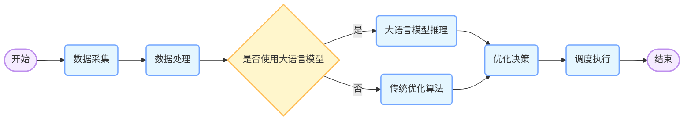

# 大语言模型在智能能源调度中的推理应用

> 关键词：大语言模型、智能能源调度、推理应用、能源管理、优化算法

> 摘要：本文深入探讨了大语言模型在智能能源调度中的推理应用。首先介绍了研究的背景、目的、预期读者和文档结构等内容。接着阐述了大语言模型和智能能源调度的核心概念及其联系，并给出了相应的原理和架构示意图与流程图。详细讲解了相关核心算法原理，结合Python代码进行说明，同时给出了数学模型和公式并举例。通过项目实战展示了代码实现和解读，分析了实际应用场景。推荐了学习资源、开发工具框架以及相关论文著作。最后总结了未来发展趋势与挑战，解答了常见问题并提供了扩展阅读和参考资料，旨在为该领域的研究和实践提供全面的技术指导。

## 1. 背景介绍 
### 1.1 目的和范围
随着全球能源需求的不断增长和能源结构的日益复杂，智能能源调度成为提高能源利用效率、保障能源供应安全的关键手段。大语言模型作为近年来人工智能领域的重大突破，具有强大的语言理解和生成能力，为智能能源调度带来了新的思路和方法。本文的目的是深入研究大语言模型在智能能源调度中的推理应用，探讨如何利用大语言模型的优势来优化能源调度决策，提高能源系统的运行效率和可靠性。研究范围涵盖了大语言模型的基本原理、智能能源调度的关键问题、大语言模型在能源调度推理中的应用方法以及相关的实际案例分析。

### 1.2 预期读者
本文预期读者包括能源领域的工程师、研究人员，人工智能领域的开发者和学者，以及对智能能源调度和大语言模型应用感兴趣的技术爱好者。对于能源领域的专业人士，本文将提供大语言模型在能源调度中的具体应用思路和方法；对于人工智能开发者，将展示能源调度领域的实际问题和需求，为他们的技术应用提供新的场景；对于技术爱好者，将帮助他们了解大语言模型在实际领域的应用价值和发展前景。

### 1.3 文档结构概述
本文共分为十个部分。第一部分为背景介绍，阐述了研究的目的、预期读者和文档结构等基本信息。第二部分介绍大语言模型和智能能源调度的核心概念及其联系，并给出相应的原理和架构示意图与流程图。第三部分详细讲解核心算法原理，结合Python代码进行说明。第四部分给出数学模型和公式，并通过举例进行详细讲解。第五部分进行项目实战，展示代码实际案例和详细解释说明。第六部分分析大语言模型在智能能源调度中的实际应用场景。第七部分推荐相关的学习资源、开发工具框架和论文著作。第八部分总结未来发展趋势与挑战。第九部分为附录，解答常见问题。第十部分提供扩展阅读和参考资料。

### 1.4 术语表
#### 1.4.1 核心术语定义
- **大语言模型（Large Language Model）**：基于深度学习技术，通过在大规模文本数据上进行训练，学习语言的统计规律和语义信息，从而能够生成自然语言文本、进行语言理解和推理的模型。
- **智能能源调度（Intelligent Energy Scheduling）**：利用先进的信息技术和智能算法，对能源系统中的各种能源资源进行优化配置和动态调度，以实现能源的高效利用、降低成本和提高可靠性的过程。
- **推理（Reasoning）**：从已知的信息和知识出发，通过逻辑规则和算法推导出新的结论和决策的过程。在大语言模型中，推理是指根据输入的文本信息生成相应的输出结果。

#### 1.4.2 相关概念解释
- **能源系统（Energy System）**：由能源生产、转换、传输、分配和消费等环节组成的复杂系统，包括电力系统、热力系统、燃气系统等。
- **优化算法（Optimization Algorithm）**：用于求解优化问题的算法，其目标是在满足一定约束条件下，找到使目标函数达到最优值的解。在智能能源调度中，优化算法常用于确定能源资源的最优分配方案。
- **自然语言处理（Natural Language Processing, NLP）**：研究如何让计算机理解、处理和生成自然语言的技术领域，大语言模型是自然语言处理的重要研究成果之一。

#### 1.4.3 缩略词列表
- **LLM**：Large Language Model（大语言模型）
- **IES**：Intelligent Energy Scheduling（智能能源调度）
- **NLP**：Natural Language Processing（自然语言处理）

## 2. 核心概念与联系 
### 核心概念原理
#### 大语言模型原理
大语言模型通常基于Transformer架构，它由多个编码器和解码器层组成。编码器负责对输入的文本进行特征提取和表示，解码器则根据编码器的输出生成目标文本。在训练过程中，大语言模型使用大规模的文本数据进行无监督学习，通过预测下一个单词或句子来学习语言的统计规律和语义信息。例如，在GPT（Generative Pretrained Transformer）系列模型中，采用了自回归的方式进行训练，即根据前面的单词预测下一个单词。

#### 智能能源调度原理
智能能源调度的核心目标是在满足能源需求和系统约束的前提下，实现能源资源的最优分配和调度。它涉及到多个方面的因素，如能源生产能力、能源需求预测、能源价格、设备运行状态等。智能能源调度通常采用优化算法来求解最优调度方案，常用的优化算法包括线性规划、非线性规划、动态规划等。例如，在电力系统调度中，需要根据发电机的发电成本、负荷需求和电网的传输能力等因素，确定各发电机的发电功率，以最小化发电成本。

### 架构的文本示意图
```plaintext
大语言模型
|
|-- 输入层（文本输入）
|
|-- 编码器（特征提取和表示）
|
|-- 解码器（文本生成）
|
|-- 输出层（文本输出）

智能能源调度系统
|
|-- 数据采集层（能源生产、需求、价格等数据）
|
|-- 数据处理层（数据清洗、特征提取）
|
|-- 优化决策层（优化算法求解调度方案）
|
|-- 执行控制层（控制能源设备运行）

大语言模型与智能能源调度的结合
|
|-- 大语言模型接收能源调度相关文本信息（如需求预测、约束条件等）
|
|-- 大语言模型进行推理，生成调度建议或决策依据
|
|-- 智能能源调度系统根据大语言模型的输出进行优化决策和调度执行
```

### Mermaid 流程图


## 3. 核心算法原理 & 具体操作步骤 
### 大语言模型推理算法原理
大语言模型的推理过程主要基于其预训练的参数和输入的文本信息。以GPT模型为例，其推理算法可以描述如下：

```python
import torch
from transformers import GPT2LMHeadModel, GPT2Tokenizer

# 加载预训练的模型和分词器
tokenizer = GPT2Tokenizer.from_pretrained('gpt2')
model = GPT2LMHeadModel.from_pretrained('gpt2')

# 输入文本
input_text = "请给出一个智能能源调度的建议，当前电力需求为1000MW，风电预测为200MW，水电预测为300MW。"

# 对输入文本进行分词
input_ids = tokenizer.encode(input_text, return_tensors='pt')

# 进行推理
with torch.no_grad():
    output = model.generate(input_ids, max_length=100, num_beams=5, no_repeat_ngram_size=2, early_stopping=True)

# 解码输出结果
output_text = tokenizer.decode(output[0], skip_special_tokens=True)
print(output_text)
```

### 具体操作步骤
1. **数据准备**：收集和整理能源调度相关的文本信息，如能源需求预测、能源生产能力、设备运行状态等。
2. **模型加载**：选择合适的大语言模型，并加载其预训练的参数和分词器。
3. **文本编码**：使用分词器对输入的文本进行编码，将其转换为模型可以处理的输入格式。
4. **推理过程**：将编码后的输入文本输入到模型中，调用模型的生成方法进行推理，生成调度建议或决策依据。
5. **结果解码**：使用分词器对模型的输出结果进行解码，将其转换为自然语言文本。
6. **结果应用**：将大语言模型生成的调度建议或决策依据应用到智能能源调度系统中，进行优化决策和调度执行。

## 4. 数学模型和公式 & 详细讲解 & 举例说明 
### 智能能源调度的数学模型
智能能源调度的数学模型通常可以表示为一个优化问题，其目标是在满足一定约束条件下，最小化或最大化某个目标函数。以电力系统调度为例，其数学模型可以表示为：

#### 目标函数
$$
\min \sum_{i=1}^{n} C_i(P_i)
$$

其中，$n$ 表示发电机的数量，$C_i(P_i)$ 表示第 $i$ 台发电机的发电成本函数，$P_i$ 表示第 $i$ 台发电机的发电功率。

#### 约束条件
1. **功率平衡约束**
$$
\sum_{i=1}^{n} P_i = P_D
$$

其中，$P_D$ 表示电力系统的总负荷需求。

2. **发电机功率限制约束**
$$
P_{i,min} \leq P_i \leq P_{i,max}
$$

其中，$P_{i,min}$ 和 $P_{i,max}$ 分别表示第 $i$ 台发电机的最小和最大发电功率。

3. **传输容量约束**
$$
|F_{ij}| \leq F_{ij,max}
$$

其中，$F_{ij}$ 表示线路 $i-j$ 的传输功率，$F_{ij,max}$ 表示线路 $i-j$ 的最大传输容量。

### 详细讲解
目标函数的目的是最小化整个电力系统的发电成本。功率平衡约束确保发电机的总发电功率等于系统的总负荷需求，以保证电力系统的供需平衡。发电机功率限制约束限制了每台发电机的发电功率在其允许的范围内，避免发电机过载或欠载运行。传输容量约束限制了线路的传输功率，防止线路过载导致停电事故。

### 举例说明
假设有两台发电机，其发电成本函数分别为：

$C_1(P_1) = 2P_1^2 + 10P_1 + 50$

$C_2(P_2) = 3P_2^2 + 15P_2 + 80$

电力系统的总负荷需求 $P_D = 100MW$，发电机的功率限制为：

$P_{1,min} = 10MW$，$P_{1,max} = 80MW$

$P_{2,min} = 20MW$，$P_{2,max} = 60MW$

我们可以使用优化算法（如线性规划或非线性规划）来求解上述优化问题，得到两台发电机的最优发电功率 $P_1^*$ 和 $P_2^*$，使得发电成本最小。

```python
import numpy as np
from scipy.optimize import minimize

# 定义发电成本函数
def cost_function(x):
    P1, P2 = x
    cost1 = 2 * P1**2 + 10 * P1 + 50
    cost2 = 3 * P2**2 + 15 * P2 + 80
    return cost1 + cost2

# 定义功率平衡约束
def power_balance(x):
    P1, P2 = x
    return P1 + P2 - 100

# 定义发电机功率限制约束
bounds = [(10, 80), (20, 60)]

# 定义约束条件
constraints = [{'type': 'eq', 'fun': power_balance}]

# 初始猜测值
x0 = [50, 50]

# 求解优化问题
result = minimize(cost_function, x0, method='SLSQP', bounds=bounds, constraints=constraints)

# 输出结果
print("最优发电功率：", result.x)
print("最小发电成本：", result.fun)
```

## 5. 项目实战：代码实际案例和详细解释说明 
### 5.1  开发环境搭建
#### 硬件环境
- **CPU**：Intel Core i7 或更高性能的处理器
- **内存**：16GB 或以上
- **硬盘**：至少 500GB 的可用存储空间

#### 软件环境
- **操作系统**：Windows 10、Linux（如 Ubuntu 18.04 及以上）或 macOS
- **Python 版本**：Python 3.7 及以上
- **深度学习框架**：PyTorch 1.7 及以上
- **自然语言处理库**：Transformers

### 5.2  源代码详细实现和代码解读
```python
import torch
from transformers import GPT2LMHeadModel, GPT2Tokenizer
import numpy as np
from scipy.optimize import minimize

# 加载预训练的模型和分词器
tokenizer = GPT2Tokenizer.from_pretrained('gpt2')
model = GPT2LMHeadModel.from_pretrained('gpt2')

# 定义发电成本函数
def cost_function(x):
    P1, P2 = x
    cost1 = 2 * P1**2 + 10 * P1 + 50
    cost2 = 3 * P2**2 + 15 * P2 + 80
    return cost1 + cost2

# 定义功率平衡约束
def power_balance(x):
    P1, P2 = x
    return P1 + P2 - 100

# 定义发电机功率限制约束
bounds = [(10, 80), (20, 60)]

# 定义约束条件
constraints = [{'type': 'eq', 'fun': power_balance}]

# 初始猜测值
x0 = [50, 50]

# 输入文本
input_text = "请给出一个智能能源调度的建议，当前电力需求为100MW，风电预测为200MW，水电预测为300MW。"

# 对输入文本进行分词
input_ids = tokenizer.encode(input_text, return_tensors='pt')

# 进行推理
with torch.no_grad():
    output = model.generate(input_ids, max_length=100, num_beams=5, no_repeat_ngram_size=2, early_stopping=True)

# 解码输出结果
output_text = tokenizer.decode(output[0], skip_special_tokens=True)
print("大语言模型生成的调度建议：", output_text)

# 求解优化问题
result = minimize(cost_function, x0, method='SLSQP', bounds=bounds, constraints=constraints)

# 输出结果
print("最优发电功率：", result.x)
print("最小发电成本：", result.fun)
```

### 代码解读与分析
1. **模型加载部分**：使用 `transformers` 库加载预训练的 GPT2 模型和分词器，用于文本的编码和解码。
2. **发电成本函数和约束条件定义**：定义了发电成本函数 `cost_function`、功率平衡约束 `power_balance` 和发电机功率限制约束 `bounds`，用于求解优化问题。
3. **大语言模型推理部分**：将输入文本进行分词后输入到模型中进行推理，生成调度建议，并将结果解码输出。
4. **优化问题求解部分**：使用 `scipy.optimize.minimize` 函数求解优化问题，得到最优发电功率和最小发电成本。

## 6. 实际应用场景 
### 电力系统调度
在电力系统中，大语言模型可以根据实时的电力负荷需求、发电设备状态、能源市场价格等信息，生成合理的发电调度建议。例如，当风电和水电预测功率较高时，大语言模型可以建议优先使用清洁能源发电，减少传统火电的发电功率，从而降低发电成本和环境污染。

### 综合能源系统优化
综合能源系统包括电力、热力、燃气等多种能源形式，大语言模型可以对不同能源之间的耦合关系进行分析和推理，提出综合能源系统的优化调度方案。例如，在冬季供暖季节，大语言模型可以根据电力需求、热力需求和天然气价格等因素，确定热电联产机组的最佳运行模式，实现能源的高效利用。

### 分布式能源管理
分布式能源系统由多个分布式电源（如太阳能光伏、小型风力发电机等）和储能设备组成，大语言模型可以对分布式能源的出力和储能状态进行实时监测和预测，制定分布式能源的优化调度策略。例如，当太阳能光伏出力较高时，大语言模型可以建议将多余的电能存储到储能设备中，以备后续使用。

## 7. 工具和资源推荐
### 7.1 学习资源推荐
#### 7.1.1 书籍推荐
- 《深度学习》（Ian Goodfellow、Yoshua Bengio 和 Aaron Courville 著）：介绍了深度学习的基本原理和方法，是深度学习领域的经典教材。
- 《自然语言处理入门》（何晗 著）：适合初学者了解自然语言处理的基本概念和技术。
- 《能源系统工程》（严正 等著）：系统介绍了能源系统的规划、运行和优化等方面的知识。

#### 7.1.2 在线课程
- Coursera 上的 “Deep Learning Specialization”：由 Andrew Ng 教授授课，全面介绍了深度学习的理论和实践。
- edX 上的 “Natural Language Processing with Deep Learning”：深入讲解了自然语言处理中的深度学习方法。
- 中国大学 MOOC 上的 “智能电网技术”：介绍了智能电网的基本概念、关键技术和应用案例。

#### 7.1.3 技术博客和网站
- Medium 上的 Towards Data Science：发布了大量关于人工智能、机器学习和数据科学的技术文章。
- arXiv.org：提供了最新的学术论文预印本，涵盖了人工智能、能源等多个领域。
- 能源情报网：专注于能源领域的资讯和技术交流。

### 7.2 开发工具框架推荐
#### 7.2.1 IDE和编辑器
- PyCharm：一款专业的 Python 集成开发环境，提供了丰富的代码编辑、调试和分析功能。
- Jupyter Notebook：交互式的开发环境，适合进行数据探索和模型实验。
- Visual Studio Code：轻量级的代码编辑器，支持多种编程语言和插件扩展。

#### 7.2.2 调试和性能分析工具
- TensorBoard：用于可视化深度学习模型的训练过程和性能指标。
- Py-Spy：用于分析 Python 代码的性能瓶颈。
- cProfile：Python 内置的性能分析工具，可用于分析函数的调用时间和次数。

#### 7.2.3 相关框架和库
- PyTorch：开源的深度学习框架，提供了丰富的神经网络层和优化算法。
- Transformers：Hugging Face 开发的自然语言处理库，包含了多种预训练的大语言模型。
- Pandas：用于数据处理和分析的 Python 库，提供了高效的数据结构和数据操作方法。

### 7.3 相关论文著作推荐
#### 7.3.1 经典论文
- Vaswani, Ashish, et al. "Attention is all you need." Advances in neural information processing systems. 2017.：介绍了 Transformer 架构，是大语言模型的基础。
- Mnih, Volodymyr, et al. "Human-level control through deep reinforcement learning." Nature 518.7540 (2015): 529-533.：提出了深度强化学习的方法，可用于智能能源调度的决策优化。

#### 7.3.2 最新研究成果
- 在 arXiv.org 上搜索 “Large Language Models in Energy Scheduling” 可以找到相关的最新研究论文。

#### 7.3.3 应用案例分析
- 可以参考能源领域的学术期刊和会议论文，了解大语言模型在智能能源调度中的实际应用案例。

## 8. 总结：未来发展趋势与挑战
### 未来发展趋势
- **模型融合与创新**：将大语言模型与其他人工智能技术（如强化学习、深度学习等）进行融合，开发更加智能和高效的能源调度模型。
- **多能源系统协同调度**：随着综合能源系统的发展，大语言模型将在多能源系统的协同调度中发挥重要作用，实现不同能源之间的互补和优化配置。
- **实时在线调度**：利用大语言模型的快速推理能力，实现能源系统的实时在线调度，提高能源系统的响应速度和灵活性。

### 挑战
- **数据质量和安全**：大语言模型的训练和推理需要大量的高质量数据，同时能源数据涉及到国家安全和用户隐私，数据的质量和安全是需要解决的重要问题。
- **模型可解释性**：大语言模型通常是黑盒模型，其决策过程难以解释，在能源调度这样的关键领域，模型的可解释性是一个亟待解决的问题。
- **计算资源需求**：大语言模型的训练和推理需要大量的计算资源，如何在有限的计算资源下实现高效的能源调度是一个挑战。

## 9. 附录：常见问题与解答
### 大语言模型在智能能源调度中的推理精度如何保证？
可以通过以下方法保证推理精度：
- 使用高质量的训练数据，确保数据的准确性和完整性。
- 对大语言模型进行微调，使其适应能源调度领域的特定任务和数据。
- 结合传统的优化算法和领域知识，对大语言模型的输出结果进行验证和修正。

### 大语言模型在能源调度中的应用是否会受到能源市场变化的影响？
会受到影响。能源市场的变化（如能源价格波动、政策调整等）会导致能源调度的目标和约束条件发生变化。大语言模型需要实时获取能源市场的信息，并根据这些信息进行动态调整和推理，以适应市场变化。

### 如何评估大语言模型在智能能源调度中的性能？
可以从以下几个方面评估性能：
- **调度结果的准确性**：比较大语言模型生成的调度方案与实际最优方案的差距。
- **推理速度**：评估大语言模型的推理时间，确保能够满足能源系统实时调度的需求。
- **稳定性**：观察大语言模型在不同工况和数据下的表现，确保其输出结果的稳定性。

## 10. 扩展阅读 & 参考资料
### 扩展阅读
- 《人工智能：现代方法》（Stuart Russell 和 Peter Norvig 著）：全面介绍了人工智能的基本概念、技术和应用。
- 《智能电网：技术、管理和市场》（Richard G. Brown 著）：深入探讨了智能电网的技术体系、管理模式和市场机制。

### 参考资料
- Hugging Face 官方文档：https://huggingface.co/docs
- PyTorch 官方文档：https://pytorch.org/docs/stable/index.html
- Scipy 官方文档：https://docs.scipy.org/doc/scipy/reference/

作者：AI天才研究院/AI Genius Institute & 禅与计算机程序设计艺术 /Zen And The Art of Computer Programming