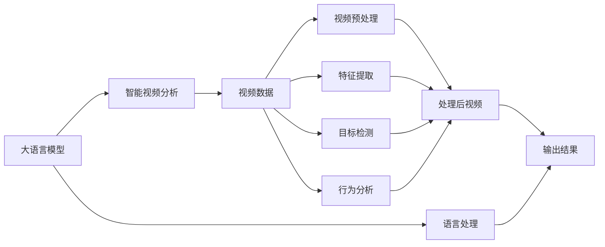

# 大语言模型在智能视频分析中的推理应用研究

> 关键词：大语言模型、智能视频分析、推理应用、自然语言处理、计算机视觉

> 摘要：本文聚焦于大语言模型在智能视频分析中的推理应用。首先介绍了研究的背景、目的、预期读者和文档结构，对相关术语进行了清晰定义。深入探讨了大语言模型与智能视频分析的核心概念及联系，给出了原理和架构的文本示意图与 Mermaid 流程图。详细阐述了核心算法原理，用 Python 代码进行了示例展示，并介绍了相关数学模型和公式。通过项目实战，给出了开发环境搭建、源代码实现及解读。分析了大语言模型在智能视频分析中的实际应用场景，推荐了学习资源、开发工具框架和相关论文著作。最后总结了未来发展趋势与挑战，解答了常见问题，并提供了扩展阅读和参考资料，旨在为该领域的研究和应用提供全面且深入的指导。

## 1. 背景介绍 
### 1.1 目的和范围
智能视频分析是计算机视觉领域的重要研究方向，旨在从视频数据中提取有价值的信息。随着大语言模型的快速发展，其强大的语言理解和生成能力为智能视频分析带来了新的机遇。本研究的目的是探索大语言模型在智能视频分析中的推理应用，研究范围涵盖大语言模型与智能视频分析的结合原理、算法实现、实际应用场景等方面。

### 1.2 预期读者
本文预期读者包括计算机科学、人工智能、计算机视觉等领域的研究人员、工程师，以及对大语言模型和智能视频分析感兴趣的学生和爱好者。对于想要深入了解大语言模型在智能视频分析中应用的专业人士，本文将提供系统的知识和实践指导。

### 1.3 文档结构概述
本文将按照以下结构进行阐述：首先介绍核心概念与联系，明确大语言模型和智能视频分析的基本原理和相互关系；接着讲解核心算法原理和具体操作步骤，并用 Python 代码进行详细说明；然后介绍相关的数学模型和公式，并举例说明；通过项目实战展示代码的实际应用和详细解释；分析大语言模型在智能视频分析中的实际应用场景；推荐学习资源、开发工具框架和相关论文著作；最后总结未来发展趋势与挑战，解答常见问题，并提供扩展阅读和参考资料。

### 1.4 术语表
#### 1.4.1 核心术语定义
- **大语言模型（Large Language Model）**：基于深度学习技术，通过在大规模文本数据上进行训练得到的具有强大语言理解和生成能力的模型，如 GPT - 3、BERT 等。
- **智能视频分析（Intelligent Video Analysis）**：利用计算机视觉和机器学习技术，对视频数据进行处理、分析和理解，以提取有价值信息的过程。
- **推理（Inference）**：在模型训练完成后，使用模型对新的数据进行预测或生成的过程。

#### 1.4.2 相关概念解释
- **自然语言处理（Natural Language Processing，NLP）**：研究计算机与人类语言之间交互的技术，大语言模型是自然语言处理领域的重要成果。
- **计算机视觉（Computer Vision）**：让计算机从图像或视频中获取信息并理解场景的技术，是智能视频分析的基础。

#### 1.4.3 缩略词列表
- **NLP**：Natural Language Processing
- **CV**：Computer Vision

## 2. 核心概念与联系 

### 大语言模型原理
大语言模型通常基于Transformer架构，通过多头自注意力机制（Multi - Head Self - Attention）来捕捉文本中的长距离依赖关系。其训练过程是在大规模的文本语料库上进行无监督学习，以预测下一个单词或句子的概率分布。例如，GPT系列模型采用了自回归的方式，通过不断生成下一个单词来完成文本生成任务。

### 智能视频分析原理
智能视频分析主要包括视频预处理、特征提取、目标检测、行为分析等步骤。视频预处理包括视频解码、去噪等操作，特征提取则是从视频帧中提取有代表性的特征，目标检测用于识别视频中的物体，行为分析则进一步分析物体的运动和交互。

### 大语言模型与智能视频分析的联系
大语言模型可以为智能视频分析提供强大的语言理解和生成能力。例如，在视频描述生成任务中，大语言模型可以根据视频的视觉特征生成自然语言描述；在视频问答任务中，大语言模型可以理解用户的问题，并结合视频内容给出准确的回答。

### 文本示意图
```plaintext
大语言模型
    |
    | 提供语言理解和生成能力
    v
智能视频分析
    |
    | 包括视频预处理、特征提取等步骤
    v
视频数据
```

### Mermaid 流程图


## 3. 核心算法原理 & 具体操作步骤 

### 核心算法原理
在大语言模型与智能视频分析的结合中，常用的算法是将视频的视觉特征与文本特征进行融合。首先，使用计算机视觉模型（如 ResNet、YOLO 等）从视频中提取视觉特征，然后将这些特征转换为文本描述，再输入到大语言模型中进行处理。

### 具体操作步骤
1. **视频特征提取**：使用计算机视觉模型对视频进行处理，提取每一帧的视觉特征。以下是一个使用 PyTorch 和 ResNet 进行特征提取的 Python 代码示例：
```python
import torch
import torchvision.models as models
import torchvision.transforms as transforms
from PIL import Image

# 加载预训练的 ResNet 模型
resnet = models.resnet18(pretrained=True)
resnet.eval()

# 定义图像预处理转换
preprocess = transforms.Compose([
    transforms.Resize(256),
    transforms.CenterCrop(224),
    transforms.ToTensor(),
    transforms.Normalize(mean=[0.485, 0.456, 0.406], std=[0.229, 0.224, 0.225])
])

def extract_features(image_path):
    # 打开图像
    image = Image.open(image_path)
    # 预处理图像
    input_tensor = preprocess(image)
    input_batch = input_tensor.unsqueeze(0)  # 添加批次维度

    # 如果有 GPU，将输入和模型移动到 GPU 上
    if torch.cuda.is_available():
        input_batch = input_batch.to('cuda')
        resnet.to('cuda')

    # 提取特征
    with torch.no_grad():
        features = resnet(input_batch)

    return features

# 示例使用
image_path = 'example.jpg'
features = extract_features(image_path)
print(features.shape)
```
2. **特征转换为文本**：将提取的视觉特征转换为文本描述。可以使用预训练的图像描述模型（如 Show and Tell）来实现。
3. **大语言模型处理**：将转换后的文本输入到大语言模型中进行推理。以下是一个使用 Hugging Face 的 Transformers 库调用 GPT - 2 模型进行文本生成的示例：
```python
from transformers import GPT2LMHeadModel, GPT2Tokenizer

# 加载预训练的 GPT - 2 模型和分词器
tokenizer = GPT2Tokenizer.from_pretrained('gpt2')
model = GPT2LMHeadModel.from_pretrained('gpt2')

# 输入文本
input_text = "The image shows a beautiful sunset."
input_ids = tokenizer.encode(input_text, return_tensors='pt')

# 生成文本
output = model.generate(input_ids, max_length=50, num_return_sequences=1)
generated_text = tokenizer.decode(output[0], skip_special_tokens=True)
print(generated_text)
```

## 4. 数学模型和公式 & 详细讲解 & 举例说明 

### 大语言模型的数学模型
大语言模型通常基于概率语言模型，其目标是最大化给定文本序列 $x = (x_1, x_2, \cdots, x_n)$ 的概率 $P(x)$。根据链式法则，$P(x)$ 可以分解为：
$$P(x) = \prod_{i = 1}^{n} P(x_i|x_1, x_2, \cdots, x_{i - 1})$$
在训练过程中，模型通过最小化负对数似然损失来学习参数：
$$L = -\sum_{i = 1}^{n} \log P(x_i|x_1, x_2, \cdots, x_{i - 1})$$

### 多头自注意力机制公式
多头自注意力机制是 Transformer 架构的核心组件。对于输入序列 $X = [x_1, x_2, \cdots, x_n]$，首先通过线性变换得到查询矩阵 $Q$、键矩阵 $K$ 和值矩阵 $V$：
$$Q = XW^Q$$
$$K = XW^K$$
$$V = XW^V$$
其中 $W^Q$、$W^K$ 和 $W^V$ 是可学习的参数矩阵。然后计算注意力分数：
$$Attention(Q, K, V) = \text{softmax}\left(\frac{QK^T}{\sqrt{d_k}}\right)V$$
其中 $d_k$ 是查询和键向量的维度。多头自注意力机制将多个注意力头的输出拼接起来，并通过另一个线性变换得到最终输出：
$$MultiHead(Q, K, V) = \text{Concat}(head_1, head_2, \cdots, head_h)W^O$$
其中 $head_i = Attention(QW_i^Q, KW_i^K, VW_i^V)$，$W_i^Q$、$W_i^K$、$W_i^V$ 和 $W^O$ 是可学习的参数矩阵。

### 举例说明
假设输入序列 $X = [x_1, x_2]$，$x_1$ 和 $x_2$ 是二维向量，即 $X = \begin{bmatrix} 1 & 2 \\ 3 & 4 \end{bmatrix}$。查询、键和值的维度 $d_k = 2$，则 $W^Q = \begin{bmatrix} 0.1 & 0.2 \\ 0.3 & 0.4 \end{bmatrix}$，$W^K = \begin{bmatrix} 0.5 & 0.6 \\ 0.7 & 0.8 \end{bmatrix}$，$W^V = \begin{bmatrix} 0.9 & 1.0 \\ 1.1 & 1.2 \end{bmatrix}$。
首先计算 $Q$、$K$ 和 $V$：
$$Q = XW^Q = \begin{bmatrix} 1 & 2 \\ 3 & 4 \end{bmatrix} \begin{bmatrix} 0.1 & 0.2 \\ 0.3 & 0.4 \end{bmatrix} = \begin{bmatrix} 0.7 & 1.0 \\ 1.5 & 2.2 \end{bmatrix}$$
$$K = XW^K = \begin{bmatrix} 1 & 2 \\ 3 & 4 \end{bmatrix} \begin{bmatrix} 0.5 & 0.6 \\ 0.7 & 0.8 \end{bmatrix} = \begin{bmatrix} 1.9 & 2.2 \\ 4.3 & 5.0 \end{bmatrix}$$
$$V = XW^V = \begin{bmatrix} 1 & 2 \\ 3 & 4 \end{bmatrix} \begin{bmatrix} 0.9 & 1.0 \\ 1.1 & 1.2 \end{bmatrix} = \begin{bmatrix} 3.1 & 3.4 \\ 7.1 & 7.8 \end{bmatrix}$$
然后计算注意力分数：
$$QK^T = \begin{bmatrix} 0.7 & 1.0 \\ 1.5 & 2.2 \end{bmatrix} \begin{bmatrix} 1.9 & 4.3 \\ 2.2 & 5.0 \end{bmatrix} = \begin{bmatrix} 3.53 & 8.31 \\ 7.79 & 18.05 \end{bmatrix}$$
$$\frac{QK^T}{\sqrt{d_k}} = \begin{bmatrix} 2.49 & 5.88 \\ 5.51 & 12.76 \end{bmatrix}$$
$$\text{softmax}\left(\frac{QK^T}{\sqrt{d_k}}\right) = \begin{bmatrix} 0.0002 & 0.9998 \\ 0.0000 & 1.0000 \end{bmatrix}$$
最后计算注意力输出：
$$Attention(Q, K, V) = \text{softmax}\left(\frac{QK^T}{\sqrt{d_k}}\right)V = \begin{bmatrix} 0.0002 & 0.9998 \\ 0.0000 & 1.0000 \end{bmatrix} \begin{bmatrix} 3.1 & 3.4 \\ 7.1 & 7.8 \end{bmatrix} = \begin{bmatrix} 7.1 & 7.8 \\ 7.1 & 7.8 \end{bmatrix}$$

## 5. 项目实战：代码实际案例和详细解释说明 

### 5.1  开发环境搭建
1. **安装 Python**：建议使用 Python 3.7 及以上版本，可以从 Python 官方网站下载并安装。
2. **安装依赖库**：使用 pip 安装所需的库，包括 PyTorch、torchvision、transformers 等。
```bash
pip install torch torchvision
pip install transformers
```
3. **安装其他工具**：可以安装 Jupyter Notebook 方便代码的编写和调试。
```bash
pip install jupyter
```

### 5.2  源代码详细实现和代码解读
以下是一个完整的项目示例，实现视频描述生成的功能。
```python
import torch
import torchvision.models as models
import torchvision.transforms as transforms
from PIL import Image
from transformers import GPT2LMHeadModel, GPT2Tokenizer
import cv2

# 加载预训练的 ResNet 模型
resnet = models.resnet18(pretrained=True)
resnet.eval()

# 定义图像预处理转换
preprocess = transforms.Compose([
    transforms.Resize(256),
    transforms.CenterCrop(224),
    transforms.ToTensor(),
    transforms.Normalize(mean=[0.485, 0.456, 0.406], std=[0.229, 0.224, 0.225])
])

# 加载预训练的 GPT - 2 模型和分词器
tokenizer = GPT2Tokenizer.from_pretrained('gpt2')
model = GPT2LMHeadModel.from_pretrained('gpt2')

def extract_features(image_path):
    # 打开图像
    image = Image.open(image_path)
    # 预处理图像
    input_tensor = preprocess(image)
    input_batch = input_tensor.unsqueeze(0)  # 添加批次维度

    # 如果有 GPU，将输入和模型移动到 GPU 上
    if torch.cuda.is_available():
        input_batch = input_batch.to('cuda')
        resnet.to('cuda')

    # 提取特征
    with torch.no_grad():
        features = resnet(input_batch)

    return features

def generate_description(features):
    # 这里简单将特征转换为文本，实际应用中需要更复杂的处理
    feature_text = f"The image has features: {features.flatten()[:10]}"
    input_ids = tokenizer.encode(feature_text, return_tensors='pt')

    # 如果有 GPU，将输入和模型移动到 GPU 上
    if torch.cuda.is_available():
        input_ids = input_ids.to('cuda')
        model.to('cuda')

    # 生成文本
    output = model.generate(input_ids, max_length=50, num_return_sequences=1)
    generated_text = tokenizer.decode(output[0], skip_special_tokens=True)
    return generated_text

def process_video(video_path):
    cap = cv2.VideoCapture(video_path)
    frame_count = 0
    while cap.isOpened():
        ret, frame = cap.read()
        if ret:
            # 保存当前帧为临时图像
            frame_path = f"frame_{frame_count}.jpg"
            cv2.imwrite(frame_path, frame)

            # 提取特征
            features = extract_features(frame_path)

            # 生成描述
            description = generate_description(features)
            print(f"Frame {frame_count}: {description}")

            frame_count += 1
        else:
            break

    cap.release()

# 示例使用
video_path = 'example_video.mp4'
process_video(video_path)
```

### 5.3  代码解读与分析
1. **特征提取部分**：`extract_features` 函数使用 ResNet 模型从图像中提取特征。首先对图像进行预处理，然后将其输入到 ResNet 模型中，最后返回提取的特征。
2. **描述生成部分**：`generate_description` 函数将提取的特征转换为文本，并输入到 GPT - 2 模型中生成描述。这里只是简单地将特征的一部分转换为文本，实际应用中需要更复杂的处理。
3. **视频处理部分**：`process_video` 函数读取视频的每一帧，保存为临时图像，然后调用 `extract_features` 和 `generate_description` 函数生成每一帧的描述。

## 6. 实际应用场景 
### 视频监控
在视频监控领域，大语言模型可以对监控视频进行实时分析和理解。例如，当监控视频中出现异常行为（如盗窃、打架等）时，大语言模型可以根据视频内容生成详细的描述和报警信息，帮助安保人员及时做出响应。

### 智能视频检索
大语言模型可以将视频内容转换为自然语言描述，从而实现基于文本的视频检索。用户可以通过输入自然语言查询，系统可以快速定位到包含相关内容的视频片段。

### 视频内容审核
在视频内容审核中，大语言模型可以对视频的文本描述进行分析，判断视频是否包含违规内容。例如，检测视频中是否存在暴力、色情、恐怖等不良信息。

### 智能视频编辑
大语言模型可以根据用户输入的自然语言指令，对视频进行自动编辑。例如，用户可以输入“将视频中所有的人物片段剪辑出来”，系统可以根据视频内容和指令完成剪辑任务。

## 7. 工具和资源推荐
### 7.1 学习资源推荐
#### 7.1.1 书籍推荐
- 《深度学习》（Deep Learning）：由 Ian Goodfellow、Yoshua Bengio 和 Aaron Courville 所著，是深度学习领域的经典教材，涵盖了神经网络、优化算法等基础知识。
- 《自然语言处理入门》（Natural Language Processing with Python）：介绍了使用 Python 进行自然语言处理的基本方法和技术。
- 《计算机视觉：算法与应用》（Computer Vision: Algorithms and Applications）：全面介绍了计算机视觉的基本概念、算法和应用。

#### 7.1.2 在线课程
- Coursera 上的“深度学习专项课程”（Deep Learning Specialization）：由 Andrew Ng 教授授课，涵盖了深度学习的各个方面，包括神经网络、卷积神经网络、循环神经网络等。
- edX 上的“自然语言处理基础”（Foundations of Natural Language Processing）：介绍了自然语言处理的基本理论和方法。
- Udemy 上的“计算机视觉实战”（Computer Vision A-Z™: Hands - On Computer Vision with Python）：通过实际项目讲解计算机视觉的应用。

#### 7.1.3 技术博客和网站
- Hugging Face Blog：提供了关于大语言模型和自然语言处理的最新研究成果和技术文章。
- Medium 上的 Towards Data Science：有很多关于人工智能、机器学习和计算机视觉的高质量文章。
- ArXiv.org：可以获取最新的学术论文，了解该领域的前沿研究。

### 7.2 开发工具框架推荐
#### 7.2.1 IDE和编辑器
- PyCharm：是一款专业的 Python 集成开发环境，提供了代码编辑、调试、版本控制等功能。
- Jupyter Notebook：适合进行交互式编程和数据分析，方便代码的展示和分享。
- Visual Studio Code：是一款轻量级的代码编辑器，支持多种编程语言，有丰富的插件扩展。

#### 7.2.2 调试和性能分析工具
- PyTorch Profiler：可以帮助分析 PyTorch 模型的性能瓶颈，找出耗时较长的操作。
- TensorBoard：可以可视化模型的训练过程和性能指标，方便调试和优化。
- cProfile：Python 内置的性能分析工具，可以分析代码的运行时间和函数调用次数。

#### 7.2.3 相关框架和库
- PyTorch：是一个开源的深度学习框架，提供了丰富的神经网络层和优化算法，方便模型的开发和训练。
- Hugging Face Transformers：提供了预训练的大语言模型和相关工具，方便进行自然语言处理任务。
- OpenCV：是一个广泛使用的计算机视觉库，提供了图像和视频处理的各种算法和工具。

### 7.3 相关论文著作推荐
#### 7.3.1 经典论文
- “Attention Is All You Need”：提出了 Transformer 架构，是大语言模型的基础。
- “ImageNet Classification with Deep Convolutional Neural Networks”：介绍了 AlexNet 模型，开启了深度学习在计算机视觉领域的应用。
- “Show and Tell: A Neural Image Caption Generator”：提出了基于神经网络的图像描述生成模型。

#### 7.3.2 最新研究成果
- 关注 ArXiv 上关于大语言模型和智能视频分析的最新论文，了解该领域的前沿研究方向。
- 参加相关的学术会议（如 CVPR、ICCV、ACL 等），获取最新的研究成果和技术动态。

#### 7.3.3 应用案例分析
- 一些科技公司的官方博客会分享大语言模型和智能视频分析的应用案例，如 Google AI Blog、Facebook AI Research Blog 等。

## 8. 总结：未来发展趋势与挑战
### 未来发展趋势
1. **多模态融合**：未来大语言模型将与计算机视觉、音频处理等技术进行更深入的融合，实现更全面的智能视频分析。例如，结合视频、音频和文本信息进行综合分析，提高分析的准确性和可靠性。
2. **实时推理**：随着硬件技术的发展，大语言模型在智能视频分析中的实时推理能力将得到提升。可以实现对视频的实时处理和分析，满足更多实时性要求较高的应用场景。
3. **个性化应用**：根据用户的需求和偏好，提供个性化的视频分析服务。例如，为不同用户提供不同类型的视频推荐和分析结果。

### 挑战
1. **计算资源需求**：大语言模型通常需要大量的计算资源进行训练和推理，这对硬件设备和计算成本提出了很高的要求。如何在有限的资源下提高模型的性能是一个挑战。
2. **数据隐私和安全**：智能视频分析涉及大量的视频数据，这些数据可能包含用户的隐私信息。如何保障数据的隐私和安全，防止数据泄露和滥用是一个重要的问题。
3. **语义理解和常识推理**：虽然大语言模型在语言理解和生成方面取得了很大的进展，但在语义理解和常识推理方面仍然存在不足。如何让模型更好地理解视频中的语义和常识，提高分析的准确性是一个挑战。

## 9. 附录：常见问题与解答
### 问题 1：大语言模型在智能视频分析中的推理速度如何提高？
解答：可以通过以下方法提高推理速度：使用更高效的硬件设备（如 GPU、TPU）；对大语言模型进行压缩和量化；优化模型的推理流程，减少不必要的计算。

### 问题 2：如何选择适合的大语言模型用于智能视频分析？
解答：需要考虑模型的性能、计算资源需求、应用场景等因素。对于一些对计算资源要求较高的应用，可以选择较小的预训练模型并进行微调；对于对性能要求较高的应用，可以选择较大的模型。

### 问题 3：大语言模型与传统计算机视觉模型在智能视频分析中有什么区别？
解答：传统计算机视觉模型主要关注视频的视觉特征，如目标检测、特征提取等；而大语言模型可以提供强大的语言理解和生成能力，能够将视频内容转换为自然语言描述，并进行更复杂的语义分析。

## 10. 扩展阅读 & 参考资料
### 扩展阅读
- 《人工智能：现代方法》（Artificial Intelligence: A Modern Approach）：全面介绍了人工智能的基本概念、算法和应用。
- 《深度学习实战》（Deep Learning in Practice）：通过实际项目讲解深度学习的应用和实践技巧。

### 参考资料
- Goodfellow, I., Bengio, Y., & Courville, A. (2016). Deep Learning. MIT Press.
- Bird, S., Klein, E., & Loper, E. (2009). Natural Language Processing with Python. O'Reilly Media.
- Szeliski, R. (2010). Computer Vision: Algorithms and Applications. Springer.

作者：AI天才研究院/AI Genius Institute & 禅与计算机程序设计艺术 /Zen And The Art of Computer Programming