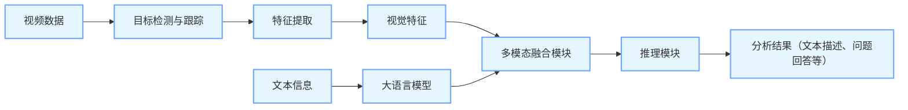

# 大语言模型在智能视频分析中的推理应用研究

> 关键词：大语言模型、智能视频分析、推理应用、视频理解、自然语言交互

> 摘要：本文聚焦于大语言模型在智能视频分析中的推理应用。首先介绍了研究的背景、目的、预期读者等内容，接着阐述了大语言模型和智能视频分析的核心概念及其联系。详细讲解了相关核心算法原理，并给出Python代码示例，同时对涉及的数学模型和公式进行说明。通过项目实战展示了代码实现和解读，分析了实际应用场景。推荐了学习资源、开发工具框架以及相关论文著作。最后总结了未来发展趋势与挑战，提供常见问题解答和扩展阅读参考资料，旨在全面深入地探讨大语言模型在智能视频分析推理应用方面的理论与实践。

## 1. 背景介绍 
### 1.1 目的和范围
智能视频分析作为计算机视觉领域的重要分支，旨在从视频数据中提取有价值的信息和知识。随着视频数据的爆炸式增长，传统的视频分析方法面临着诸多挑战，如难以处理复杂场景、缺乏语义理解能力等。大语言模型具有强大的语言理解和生成能力，将其应用于智能视频分析的推理过程中，可以为视频分析带来新的思路和方法。

本研究的目的是探索大语言模型在智能视频分析推理应用中的可行性和有效性，具体范围包括研究大语言模型如何与视频分析技术相结合，实现对视频内容的更深入理解和分析，例如视频中的事件识别、行为预测、语义描述等。

### 1.2 预期读者
本文的预期读者主要包括计算机视觉、人工智能领域的研究人员和开发者，对智能视频分析和大语言模型感兴趣的学生和爱好者，以及希望将相关技术应用于实际业务的企业技术人员。他们需要具备一定的计算机科学和人工智能基础知识，以便更好地理解本文所阐述的内容。

### 1.3 文档结构概述
本文将按照以下结构进行组织：首先介绍大语言模型和智能视频分析的核心概念及其联系，包括原理和架构示意图；接着详细讲解核心算法原理，并给出具体的Python代码实现；然后阐述相关的数学模型和公式，并举例说明；通过项目实战展示代码的实际应用和详细解释；分析大语言模型在智能视频分析中的实际应用场景；推荐学习资源、开发工具框架和相关论文著作；最后总结未来发展趋势与挑战，提供常见问题解答和扩展阅读参考资料。

### 1.4 术语表
#### 1.4.1 核心术语定义
- **大语言模型（Large Language Model）**：基于深度学习技术，在大规模文本数据上进行训练的语言模型，具有强大的语言理解和生成能力，如GPT系列、BERT等。
- **智能视频分析（Intelligent Video Analysis）**：利用计算机视觉和人工智能技术，对视频数据进行自动分析和处理，提取有价值的信息和知识。
- **推理（Inference）**：在已训练好的模型基础上，根据输入数据生成输出结果的过程。
- **视频理解（Video Understanding）**：对视频内容进行语义层面的理解，包括识别视频中的物体、事件、行为等。
- **自然语言交互（Natural Language Interaction）**：人与计算机之间使用自然语言进行交流和交互的方式。

#### 1.4.2 相关概念解释
- **多模态融合（Multimodal Fusion）**：将不同模态的数据（如图像、文本、音频等）进行融合处理，以获取更全面和准确的信息。在智能视频分析中，多模态融合可以结合视频中的视觉信息和大语言模型处理的文本信息。
- **注意力机制（Attention Mechanism）**：一种在深度学习中广泛应用的技术，用于自动关注输入数据中的重要部分。在大语言模型和视频分析中，注意力机制可以帮助模型更好地处理长序列数据和聚焦关键信息。

#### 1.4.3 缩略词列表
- **LLM**：Large Language Model（大语言模型）
- **IVA**：Intelligent Video Analysis（智能视频分析）
- **NLP**：Natural Language Processing（自然语言处理）
- **CV**：Computer Vision（计算机视觉）

## 2. 核心概念与联系 

### 2.1 大语言模型原理
大语言模型通常基于Transformer架构，其核心思想是通过自注意力机制（Self-Attention）来捕捉输入序列中不同位置之间的依赖关系。Transformer架构由编码器（Encoder）和解码器（Decoder）组成，在训练过程中，模型通过大量的文本数据学习语言的模式和规律。

例如，GPT系列模型是基于Transformer解码器的自回归语言模型，它通过不断预测下一个单词来生成文本。BERT模型则是基于Transformer编码器的预训练模型，通过掩码语言模型（Masked Language Model）和下一句预测（Next Sentence Prediction）任务进行训练，用于语言理解任务。

### 2.2 智能视频分析原理
智能视频分析主要涉及计算机视觉的多个领域，包括目标检测、目标跟踪、行为识别等。目标检测用于在视频帧中识别出特定的物体，常用的算法有Faster R-CNN、YOLO等。目标跟踪则是在连续的视频帧中跟踪物体的运动轨迹，如KCF、SORT等算法。行为识别用于分析视频中人物或物体的行为动作，通常采用基于深度学习的方法，如3D卷积神经网络（3D CNN）。

### 2.3 大语言模型与智能视频分析的联系
将大语言模型应用于智能视频分析的推理过程中，可以实现视频内容的语义理解和自然语言交互。具体来说，大语言模型可以处理从视频中提取的文本信息（如视频的标题、描述、物体的标签等），并结合视觉信息进行推理。例如，在视频监控场景中，大语言模型可以根据检测到的物体和事件，生成自然语言描述，并回答用户关于视频内容的问题。

### 2.4 架构示意图


该示意图展示了大语言模型在智能视频分析中的推理应用架构。首先对视频数据进行目标检测与跟踪，提取视觉特征；同时将文本信息输入大语言模型进行处理。然后通过多模态融合模块将视觉特征和语言模型的输出进行融合，最后在推理模块中进行分析和推理，得到最终的分析结果。

## 3. 核心算法原理 & 具体操作步骤 

### 3.1 多模态融合算法原理
多模态融合的目的是将视觉特征和语言特征进行有效的结合，以获取更全面和准确的信息。一种常见的方法是采用注意力机制进行特征融合。具体步骤如下：

1. **特征提取**：从视频中提取视觉特征，如使用预训练的卷积神经网络（CNN）提取图像特征；同时将文本信息输入大语言模型，获取语言特征。
2. **注意力计算**：计算视觉特征和语言特征之间的注意力权重，以确定哪些视觉特征与语言特征相关度更高。
3. **特征融合**：根据注意力权重，将视觉特征和语言特征进行加权融合，得到融合后的特征表示。

### 3.2 Python代码实现
```python
import torch
import torch.nn as nn
import torch.nn.functional as F

# 定义注意力模块
class AttentionModule(nn.Module):
    def __init__(self, visual_dim, language_dim):
        super(AttentionModule, self).__init__()
        self.linear_v = nn.Linear(visual_dim, language_dim)
        self.linear_l = nn.Linear(language_dim, language_dim)
        self.linear_att = nn.Linear(language_dim, 1)

    def forward(self, visual_features, language_features):
        # 对视觉特征进行线性变换
        visual_features_transformed = self.linear_v(visual_features)
        # 对语言特征进行线性变换
        language_features_transformed = self.linear_l(language_features)
        # 计算注意力分数
        att_scores = self.linear_att(torch.tanh(visual_features_transformed + language_features_transformed))
        att_weights = F.softmax(att_scores, dim=1)
        # 根据注意力权重进行特征融合
        fused_features = att_weights * visual_features
        return fused_features

# 示例代码
visual_dim = 2048
language_dim = 768
batch_size = 16
num_features = 10

# 随机生成视觉特征和语言特征
visual_features = torch.randn(batch_size, num_features, visual_dim)
language_features = torch.randn(batch_size, language_dim)

# 初始化注意力模块
attention_module = AttentionModule(visual_dim, language_dim)

# 进行特征融合
fused_features = attention_module(visual_features, language_features)
print("Fused features shape:", fused_features.shape)
```

### 3.3 代码解释
- **AttentionModule类**：定义了一个注意力模块，用于计算视觉特征和语言特征之间的注意力权重，并进行特征融合。
- **forward方法**：在该方法中，首先对视觉特征和语言特征进行线性变换，然后计算注意力分数，通过softmax函数得到注意力权重，最后根据注意力权重对视觉特征进行加权融合。
- **示例代码**：随机生成了视觉特征和语言特征，并初始化注意力模块，调用forward方法进行特征融合，最后打印融合后的特征形状。

## 4. 数学模型和公式 & 详细讲解 & 举例说明 

### 4.1 自注意力机制数学模型
自注意力机制是Transformer架构的核心，其数学模型可以表示为：

$$Attention(Q, K, V) = softmax(\frac{QK^T}{\sqrt{d_k}})V$$

其中，$Q$ 是查询矩阵（Query），$K$ 是键矩阵（Key），$V$ 是值矩阵（Value），$d_k$ 是键向量的维度。

### 4.2 详细讲解
- **查询、键和值矩阵**：在自注意力机制中，输入序列会被映射为查询、键和值矩阵。查询矩阵用于表示当前位置需要关注的信息，键矩阵用于表示其他位置的信息，值矩阵用于表示其他位置的实际内容。
- **注意力分数计算**：通过计算查询矩阵和键矩阵的点积，得到注意力分数。为了防止点积结果过大，需要除以 $\sqrt{d_k}$。
- **注意力权重计算**：使用softmax函数将注意力分数转换为注意力权重，确保权重之和为1。
- **加权求和**：根据注意力权重对值矩阵进行加权求和，得到当前位置的输出。

### 4.3 举例说明
假设输入序列为 $x = [x_1, x_2, x_3]$，每个元素的维度为 $d$。首先将输入序列映射为查询、键和值矩阵：

$$Q = W_Qx$$
$$K = W_Kx$$
$$V = W_Vx$$

其中，$W_Q$、$W_K$ 和 $W_V$ 是可学习的权重矩阵。

然后计算注意力分数：

$$scores_{i,j} = \frac{q_i^Tk_j}{\sqrt{d_k}}$$

其中，$q_i$ 是查询矩阵的第 $i$ 行，$k_j$ 是键矩阵的第 $j$ 行。

接着计算注意力权重：

$$weights_{i,j} = softmax(scores_{i,j})$$

最后计算输出：

$$output_i = \sum_{j=1}^{3} weights_{i,j}v_j$$

其中，$v_j$ 是值矩阵的第 $j$ 行。

### 4.4 多模态融合中的数学模型
在多模态融合中，假设视觉特征为 $V$，语言特征为 $L$，注意力权重为 $A$，则融合后的特征 $F$ 可以表示为：

$$F = A \odot V$$

其中，$\odot$ 表示逐元素相乘。

注意力权重 $A$ 的计算可以通过以下公式：

$$A = softmax(W_{att} \cdot tanh(W_vV + W_lL))$$

其中，$W_{att}$、$W_v$ 和 $W_l$ 是可学习的权重矩阵。

## 5. 项目实战：代码实际案例和详细解释说明 

### 5.1 开发环境搭建
- **操作系统**：推荐使用Ubuntu 20.04或更高版本。
- **Python版本**：Python 3.8或更高版本。
- **深度学习框架**：PyTorch 1.9或更高版本。
- **其他依赖库**：OpenCV、NumPy、Matplotlib等。

可以使用以下命令安装所需的Python库：
```bash
pip install torch torchvision torchaudio
pip install opencv-python numpy matplotlib
```

### 5.2 源代码详细实现和代码解读
```python
import cv2
import torch
import torchvision
from torchvision.models import resnet50
import numpy as np
from transformers import AutoTokenizer, AutoModel

# 加载预训练的视觉模型
visual_model = resnet50(pretrained=True)
visual_model.eval()

# 加载预训练的语言模型
tokenizer = AutoTokenizer.from_pretrained('bert-base-uncased')
language_model = AutoModel.from_pretrained('bert-base-uncased')
language_model.eval()

# 定义注意力模块
class AttentionModule(nn.Module):
    def __init__(self, visual_dim, language_dim):
        super(AttentionModule, self).__init__()
        self.linear_v = nn.Linear(visual_dim, language_dim)
        self.linear_l = nn.Linear(language_dim, language_dim)
        self.linear_att = nn.Linear(language_dim, 1)

    def forward(self, visual_features, language_features):
        visual_features_transformed = self.linear_v(visual_features)
        language_features_transformed = self.linear_l(language_features)
        att_scores = self.linear_att(torch.tanh(visual_features_transformed + language_features_transformed))
        att_weights = torch.softmax(att_scores, dim=1)
        fused_features = att_weights * visual_features
        return fused_features

# 初始化注意力模块
visual_dim = 2048
language_dim = 768
attention_module = AttentionModule(visual_dim, language_dim)

# 读取视频帧
video_path = 'test_video.mp4'
cap = cv2.VideoCapture(video_path)
ret, frame = cap.read()
if ret:
    # 预处理视频帧
    frame = cv2.cvtColor(frame, cv2.COLOR_BGR2RGB)
    frame = cv2.resize(frame, (224, 224))
    frame = torchvision.transforms.ToTensor()(frame).unsqueeze(0)

    # 提取视觉特征
    with torch.no_grad():
        visual_features = visual_model(frame)

    # 输入文本信息
    text = "There is a person in the video."
    inputs = tokenizer(text, return_tensors='pt')
    with torch.no_grad():
        outputs = language_model(**inputs)
        language_features = outputs.last_hidden_state.mean(dim=1)

    # 进行特征融合
    fused_features = attention_module(visual_features, language_features)
    print("Fused features shape:", fused_features.shape)

cap.release()
```

### 5.3 代码解读与分析
- **视觉模型加载**：使用 `torchvision` 库加载预训练的ResNet-50模型，用于提取视频帧的视觉特征。
- **语言模型加载**：使用 `transformers` 库加载预训练的BERT模型，用于处理文本信息。
- **注意力模块定义**：定义了一个注意力模块，用于进行视觉特征和语言特征的融合。
- **视频帧处理**：读取视频帧，进行预处理（颜色转换、尺寸调整等），并转换为PyTorch张量。
- **特征提取**：分别使用视觉模型和语言模型提取视觉特征和语言特征。
- **特征融合**：将提取的视觉特征和语言特征输入注意力模块，进行特征融合。

## 6. 实际应用场景 
### 6.1 视频监控与安防
在视频监控领域，大语言模型可以帮助分析监控视频中的异常事件。例如，通过对视频中人物的行为、动作和场景进行语义理解，判断是否存在盗窃、暴力等异常行为，并及时发出警报。同时，大语言模型可以与监控系统进行自然语言交互，用户可以通过语音或文本输入问题，如“昨天下午3点到4点这个区域有哪些人进入过？”，系统可以根据视频内容进行回答。

### 6.2 智能交通
在智能交通系统中，大语言模型可以结合视频分析技术，对交通流量、车辆行为等进行分析。例如，通过分析路口的监控视频，识别车辆的类型、行驶方向和速度，预测交通拥堵情况，并提供相应的交通疏导建议。此外，大语言模型还可以处理交通相关的文本信息，如交通规则、路况通知等，为驾驶员提供更准确的导航和驾驶建议。

### 6.3 视频内容推荐
在视频平台中，大语言模型可以对视频内容进行深入理解和分析，根据用户的兴趣和偏好，为用户推荐更符合其需求的视频。例如，通过分析视频的标题、描述、标签以及视频中的视觉内容，提取视频的语义信息，建立视频的语义模型。然后根据用户的历史观看记录和搜索关键词，计算视频与用户兴趣的匹配度，为用户推荐相关的视频。

### 6.4 教育领域
在教育领域，大语言模型可以结合智能视频分析技术，对教学视频进行分析和评估。例如，分析教师的教学行为、学生的课堂表现等，为教师提供教学反馈和改进建议。同时，大语言模型可以处理教学相关的文本信息，如教材内容、知识点讲解等，为学生提供个性化的学习辅导和答疑服务。

## 7. 工具和资源推荐
### 7.1 学习资源推荐
#### 7.1.1 书籍推荐
- 《深度学习》（Deep Learning）：由Ian Goodfellow、Yoshua Bengio和Aaron Courville撰写，是深度学习领域的经典教材，涵盖了神经网络、卷积神经网络、循环神经网络等内容。
- 《Python深度学习》（Deep Learning with Python）：由Francois Chollet撰写，以Python和Keras为工具，介绍了深度学习的基本概念和实践方法。
- 《自然语言处理入门》：由何晗撰写，适合初学者学习自然语言处理的基础知识和常用技术。

#### 7.1.2 在线课程
- Coursera上的“深度学习专项课程”（Deep Learning Specialization）：由Andrew Ng教授授课，包括神经网络、卷积神经网络、循环神经网络等多个课程，全面介绍了深度学习的理论和实践。
- edX上的“自然语言处理基础”（Foundations of Natural Language Processing）：由哥伦比亚大学的教授授课，介绍了自然语言处理的基本概念、算法和应用。
- B站（哔哩哔哩）上有很多关于深度学习和计算机视觉的教程视频，适合初学者学习。

#### 7.1.3 技术博客和网站
- arXiv.org：是一个开放的预印本平台，提供了大量的计算机科学、人工智能等领域的最新研究论文。
- Medium：是一个技术博客平台，有很多关于深度学习、自然语言处理等领域的优秀文章。
- AI研习社：专注于人工智能领域的技术交流和学习，提供了丰富的教程、案例和论坛讨论。

### 7.2 开发工具框架推荐
#### 7.2.1 IDE和编辑器
- PyCharm：是一款专门为Python开发设计的集成开发环境（IDE），提供了代码编辑、调试、版本控制等功能，适合大型项目的开发。
- Jupyter Notebook：是一个交互式的开发环境，支持Python、R等多种编程语言，适合进行数据探索、模型训练和实验验证。
- Visual Studio Code：是一款轻量级的代码编辑器，支持多种编程语言和插件扩展，具有丰富的开发工具和调试功能。

#### 7.2.2 调试和性能分析工具
- TensorBoard：是TensorFlow提供的可视化工具，可以用于可视化模型的训练过程、损失函数变化、模型结构等信息。
- PyTorch Profiler：是PyTorch提供的性能分析工具，可以帮助开发者分析模型的运行时间、内存使用等性能指标，优化模型的性能。
- cProfile：是Python标准库中的性能分析工具，可以用于分析Python代码的运行时间和函数调用情况。

#### 7.2.3 相关框架和库
- PyTorch：是一个开源的深度学习框架，具有动态图计算、易于使用等特点，广泛应用于计算机视觉、自然语言处理等领域。
- TensorFlow：是另一个流行的深度学习框架，提供了丰富的工具和库，支持分布式训练和模型部署。
- Transformers：是Hugging Face开发的一个自然语言处理库，提供了多种预训练的语言模型，如GPT、BERT等，方便开发者进行语言模型的使用和微调。

### 7.3 相关论文著作推荐
#### 7.3.1 经典论文
- “Attention Is All You Need”：提出了Transformer架构，是大语言模型的基础，开创了基于注意力机制的深度学习模型的新时代。
- “BERT: Pre-training of Deep Bidirectional Transformers for Language Understanding”：介绍了BERT模型的预训练方法和应用，在自然语言处理领域取得了显著的成果。
- “Faster R-CNN: Towards Real-Time Object Detection with Region Proposal Networks”：提出了Faster R-CNN目标检测算法，提高了目标检测的速度和准确性。

#### 7.3.2 最新研究成果
- 在arXiv.org上可以找到很多关于大语言模型在智能视频分析中的最新研究论文，如“VideoLLaMA: An Instruction-Tuned Audio-Visual Language Model for Video Understanding”等。
- 国际计算机视觉与模式识别会议（CVPR）、神经信息处理系统大会（NeurIPS）等顶级学术会议上也会有相关的研究成果发表。

#### 7.3.3 应用案例分析
- 一些科技公司的官方博客会分享大语言模型在智能视频分析中的应用案例，如谷歌、微软等公司的博客。
- 行业报告和研究机构的网站也会提供相关的应用案例分析，如Gartner、IDC等。

## 8. 总结：未来发展趋势与挑战
### 8.1 未来发展趋势
- **多模态融合的深度发展**：未来大语言模型与智能视频分析的融合将更加深入，不仅限于视觉和语言模态的融合，还可能会涉及音频、触觉等多模态信息的融合，以实现更全面和准确的视频理解。
- **实时推理能力的提升**：随着硬件技术的不断发展和算法的优化，大语言模型在智能视频分析中的实时推理能力将得到显著提升，能够满足更多实时性要求较高的应用场景，如实时视频监控、自动驾驶等。
- **个性化和自适应分析**：根据不同用户的需求和偏好，大语言模型可以为用户提供个性化的视频分析服务。同时，模型可以自适应地调整分析策略，以适应不同的视频场景和数据特点。
- **与其他技术的融合创新**：大语言模型将与物联网、区块链等技术进行融合创新，拓展智能视频分析的应用领域和价值。例如，结合物联网技术实现智能视频设备的远程监控和管理，结合区块链技术保证视频数据的安全性和可信度。

### 8.2 挑战
- **数据质量和标注问题**：大语言模型和智能视频分析都需要大量高质量的数据进行训练。然而，视频数据的标注成本较高，且数据质量难以保证。如何获取高质量的标注数据，提高数据的利用效率，是当前面临的一个挑战。
- **计算资源和能耗问题**：大语言模型通常具有庞大的参数数量，需要大量的计算资源和能耗进行训练和推理。在实际应用中，如何降低计算资源的需求和能耗，提高模型的效率，是一个亟待解决的问题。
- **语义理解的局限性**：尽管大语言模型具有强大的语言理解能力，但在处理复杂的语义和上下文信息时，仍然存在一定的局限性。在智能视频分析中，如何更好地理解视频中的语义信息，提高推理的准确性，是一个需要进一步研究的问题。
- **隐私和安全问题**：智能视频分析涉及大量的个人隐私数据，如人脸、行为等。如何保护这些数据的隐私和安全，防止数据泄露和滥用，是一个重要的挑战。同时，大语言模型也可能存在被恶意攻击和利用的风险，需要加强安全防护措施。

## 9. 附录：常见问题与解答
### 9.1 大语言模型在智能视频分析中的推理速度如何提高？
可以从以下几个方面提高推理速度：
- **模型压缩**：采用模型剪枝、量化等技术，减少模型的参数数量和计算量。
- **硬件加速**：使用GPU、TPU等硬件设备进行加速计算。
- **优化算法**：采用更高效的算法和架构，减少推理过程中的计算复杂度。

### 9.2 如何选择合适的大语言模型和视觉模型进行融合？
选择合适的模型需要考虑以下因素：
- **任务需求**：根据具体的应用场景和任务需求，选择适合的模型。例如，如果需要进行文本生成任务，可以选择GPT系列模型；如果需要进行语言理解任务，可以选择BERT模型。
- **模型性能**：比较不同模型的性能指标，如准确率、召回率、F1值等，选择性能较好的模型。
- **计算资源**：考虑自己的计算资源和设备条件，选择适合的模型。如果计算资源有限，可以选择较小的模型。

### 9.3 大语言模型在智能视频分析中会出现过拟合问题吗？
会的。大语言模型在智能视频分析中可能会出现过拟合问题，特别是在训练数据较少或数据分布不均匀的情况下。为了防止过拟合，可以采用以下方法：
- **增加训练数据**：收集更多的训练数据，扩大数据的多样性。
- **正则化方法**：采用L1、L2正则化等方法，限制模型的复杂度。
- **早停策略**：在训练过程中，当验证集的性能不再提升时，停止训练，防止模型过拟合。

### 9.4 如何评估大语言模型在智能视频分析中的性能？
可以从以下几个方面评估模型的性能：
- **准确率**：模型预测结果与真实结果的匹配程度。
- **召回率**：模型能够正确预测出的正样本占所有正样本的比例。
- **F1值**：综合考虑准确率和召回率的指标，用于衡量模型的整体性能。
- **推理速度**：模型进行推理所需的时间，特别是在实时应用场景中，推理速度是一个重要的指标。

## 10. 扩展阅读 & 参考资料
- 《计算机视觉：算法与应用》（Computer Vision: Algorithms and Applications）
- 《自然语言处理实战》（Natural Language Processing in Action）
- 相关学术论文：“Attention Is All You Need”、“BERT: Pre-training of Deep Bidirectional Transformers for Language Understanding”等
- 技术博客和网站：arXiv.org、Medium、AI研习社等

作者：AI天才研究院/AI Genius Institute & 禅与计算机程序设计艺术 /Zen And The Art of Computer Programming