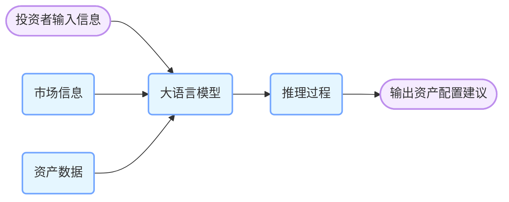

# 大语言模型在智能资产配置中的推理应用探索

> 关键词：大语言模型、智能资产配置、推理应用、金融科技、资产组合优化

> 摘要：本文聚焦于大语言模型在智能资产配置领域的推理应用。首先介绍了研究的背景、目的、预期读者等内容。详细阐述了大语言模型和智能资产配置的核心概念及联系，给出了相关原理和架构的示意图与流程图。深入剖析了大语言模型用于资产配置推理的核心算法原理，并结合 Python 代码进行了具体操作步骤的说明。探讨了相关数学模型和公式，并举例解释。通过项目实战，展示了开发环境搭建、源代码实现及代码解读。分析了大语言模型在智能资产配置中的实际应用场景，推荐了学习资源、开发工具框架以及相关论文著作。最后总结了未来发展趋势与挑战，提供了常见问题解答和扩展阅读参考资料，旨在为该领域的研究和实践提供全面且深入的指导。

## 1. 背景介绍 
### 1.1 目的和范围
在当今复杂多变的金融市场环境下，投资者面临着海量的信息和众多的投资选择。智能资产配置旨在帮助投资者根据自身的风险偏好、投资目标等因素，合理地分配资产，以实现资产的最优组合和收益最大化。大语言模型作为人工智能领域的重要突破，具有强大的语言理解、生成和推理能力。本研究的目的在于探索大语言模型在智能资产配置中的推理应用，分析其如何辅助投资者做出更明智的资产配置决策。

研究范围涵盖了大语言模型的基本原理、智能资产配置的核心概念和方法，以及大语言模型在资产配置推理中的具体应用场景。同时，通过实际案例分析和代码实现，验证大语言模型在该领域的有效性和可行性。

### 1.2 预期读者
本文预期读者包括金融行业从业者，如投资顾问、基金经理等，他们可以通过了解大语言模型在资产配置中的应用，提升自己的专业能力和服务水平；人工智能领域的研究者和开发者，他们可以从金融应用的角度，探索大语言模型的新应用场景；以及对智能投资和资产配置感兴趣的普通投资者，帮助他们更好地理解和利用新技术进行投资决策。

### 1.3 文档结构概述
本文将按照以下结构进行阐述：首先介绍大语言模型和智能资产配置的核心概念及它们之间的联系，通过示意图和流程图进行直观展示；接着深入讲解大语言模型用于资产配置推理的核心算法原理，并给出 Python 代码实现的具体操作步骤；然后介绍相关的数学模型和公式，并举例说明其在资产配置中的应用；通过项目实战，详细展示开发环境搭建、源代码实现和代码解读；分析大语言模型在智能资产配置中的实际应用场景；推荐学习资源、开发工具框架和相关论文著作；最后总结未来发展趋势与挑战，提供常见问题解答和扩展阅读参考资料。

### 1.4 术语表
#### 1.4.1 核心术语定义
- **大语言模型（Large Language Model）**：是一种基于深度学习技术，通过在大规模文本数据上进行训练得到的语言模型。它能够学习到语言的语法、语义和上下文信息，具备强大的语言理解和生成能力。
- **智能资产配置（Intelligent Asset Allocation）**：利用人工智能技术和数据分析方法，根据投资者的风险偏好、投资目标、市场环境等因素，为投资者提供最优的资产配置方案。
- **推理（Reasoning）**：指大语言模型根据输入的信息，运用其学习到的知识和逻辑，推导出相关结论或建议的过程。

#### 1.4.2 相关概念解释
- **资产组合（Asset Portfolio）**：投资者持有的各种资产的集合，包括股票、债券、基金、现金等。合理的资产组合可以降低风险，提高收益。
- **风险偏好（Risk Appetite）**：投资者对投资风险的承受能力和意愿。不同的投资者具有不同的风险偏好，如保守型、稳健型、激进型等。
- **投资目标（Investment Objective）**：投资者进行投资的目的，如资产增值、获取稳定收益、保障资金安全等。

#### 1.4.3 缩略词列表
- **LLM**：Large Language Model（大语言模型）
- **AI**：Artificial Intelligence（人工智能）
- **ROI**：Return on Investment（投资回报率）

## 2. 核心概念与联系 

### 大语言模型原理
大语言模型通常基于Transformer架构，通过在大规模文本数据上进行无监督学习，学习到语言的模式和规律。其核心思想是利用注意力机制，对输入序列中的每个位置进行加权求和，从而捕捉序列中的长距离依赖关系。

以GPT（Generative Pretrained Transformer）系列模型为例，它通过预训练和微调两个阶段来实现语言处理任务。在预训练阶段，模型在大规模文本数据上进行自监督学习，学习语言的通用知识；在微调阶段，模型在特定任务的数据集上进行有监督学习，以适应具体的应用场景。

### 智能资产配置原理
智能资产配置的目标是根据投资者的风险偏好、投资目标和市场环境等因素，构建最优的资产组合。常见的方法包括现代投资组合理论（Modern Portfolio Theory，MPT）、风险平价理论（Risk Parity Theory）等。

现代投资组合理论认为，通过分散投资可以降低非系统性风险，投资者可以通过选择不同资产之间的最优比例，在给定风险水平下实现最大收益，或在给定收益水平下实现最小风险。

### 大语言模型与智能资产配置的联系
大语言模型可以为智能资产配置提供强大的推理能力。它可以理解投资者的需求和偏好，分析市场信息和资产数据，通过推理为投资者提供个性化的资产配置建议。例如，大语言模型可以根据投资者输入的风险偏好、投资目标和资金规模等信息，结合市场动态和历史数据，推理出适合该投资者的资产组合。

### 文本示意图
```plaintext
大语言模型
|
|-- 理解投资者需求（风险偏好、投资目标等）
|-- 分析市场信息（宏观经济数据、行业动态等）
|-- 分析资产数据（资产收益率、波动率等）
|
|-- 推理过程
|
|-- 输出资产配置建议
```

### Mermaid 流程图


## 3. 核心算法原理 & 具体操作步骤 

### 核心算法原理
大语言模型在智能资产配置中的推理应用主要基于其语言理解和生成能力。具体算法步骤如下：

1. **数据预处理**：将投资者输入的信息、市场信息和资产数据进行清洗、转换和编码，使其适合大语言模型的输入格式。
2. **特征提取**：大语言模型对输入数据进行特征提取，学习到数据中的语义和上下文信息。
3. **推理过程**：根据提取的特征，大语言模型运用其学习到的知识和逻辑，进行推理计算，得出资产配置建议。
4. **结果输出**：将推理结果转换为自然语言文本或可视化图表，输出给投资者。

### 具体操作步骤（Python 代码实现）

```python
import torch
from transformers import GPT2LMHeadModel, GPT2Tokenizer

# 加载预训练的大语言模型和分词器
tokenizer = GPT2Tokenizer.from_pretrained('gpt2')
model = GPT2LMHeadModel.from_pretrained('gpt2')

# 定义投资者输入信息、市场信息和资产数据
investor_info = "我是一名保守型投资者，投资目标是保障资金安全，投资期限为 1 年，资金规模为 100 万元。"
market_info = "当前宏观经济形势稳定，股市波动较大，债券市场相对稳定。"
asset_data = "股票 A 过去一年收益率为 10%，波动率为 20%；债券 B 过去一年收益率为 5%，波动率为 5%。"

# 合并输入信息
input_text = investor_info + " " + market_info + " " + asset_data

# 对输入文本进行分词
input_ids = tokenizer.encode(input_text, return_tensors='pt')

# 进行推理
with torch.no_grad():
    output = model.generate(input_ids, max_length=200, num_beams=5, no_repeat_ngram_size=2, early_stopping=True)

# 解码输出结果
output_text = tokenizer.decode(output[0], skip_special_tokens=True)

print("资产配置建议：", output_text)
```

### 代码解释
1. **加载预训练模型和分词器**：使用 `transformers` 库加载预训练的 GPT-2 模型和分词器。
2. **定义输入信息**：将投资者输入信息、市场信息和资产数据合并为一个文本字符串。
3. **分词**：使用分词器将输入文本转换为模型可以接受的输入 ID。
4. **推理**：使用模型的 `generate` 方法进行推理，生成资产配置建议。
5. **解码输出结果**：将模型输出的 ID 序列解码为自然语言文本，并打印输出。

## 4. 数学模型和公式 & 详细讲解 & 举例说明 

### 现代投资组合理论（MPT）
现代投资组合理论由哈里·马科维茨（Harry Markowitz）于 1952 年提出，其核心思想是通过分散投资降低非系统性风险。

#### 数学模型和公式
设投资组合中有 $n$ 种资产，第 $i$ 种资产的收益率为 $R_i$，权重为 $w_i$，且 $\sum_{i=1}^{n} w_i = 1$。投资组合的预期收益率 $E(R_p)$ 和方差 $\sigma_p^2$ 分别为：

$$
E(R_p) = \sum_{i=1}^{n} w_i E(R_i)
$$

$$
\sigma_p^2 = \sum_{i=1}^{n} \sum_{j=1}^{n} w_i w_j \sigma_{ij}
$$

其中，$E(R_i)$ 是第 $i$ 种资产的预期收益率，$\sigma_{ij}$ 是第 $i$ 种资产和第 $j$ 种资产的协方差。

#### 详细讲解
预期收益率 $E(R_p)$ 表示投资组合的平均收益水平，它是各资产预期收益率的加权平均值。方差 $\sigma_p^2$ 表示投资组合的风险程度，它不仅考虑了各资产自身的方差，还考虑了资产之间的协方差。

#### 举例说明
假设投资组合中有两种资产：股票 A 和债券 B。股票 A 的预期收益率 $E(R_A) = 10\%$，方差 $\sigma_A^2 = 0.04$；债券 B 的预期收益率 $E(R_B) = 5\%$，方差 $\sigma_B^2 = 0.01$；两种资产的协方差 $\sigma_{AB} = 0.005$。投资者将资金的 60% 投资于股票 A，40% 投资于债券 B。

则投资组合的预期收益率为：

$$
E(R_p) = 0.6 \times 0.1 + 0.4 \times 0.05 = 0.08 = 8\%
$$

投资组合的方差为：

$$
\begin{align*}
\sigma_p^2 &= 0.6^2 \times 0.04 + 0.4^2 \times 0.01 + 2 \times 0.6 \times 0.4 \times 0.005 \\
&= 0.0144 + 0.0016 + 0.0024 \\
&= 0.0184
\end{align*}
$$

### 大语言模型与数学模型的结合
大语言模型可以根据投资者的需求和市场信息，结合上述数学模型进行推理计算，为投资者提供最优的资产配置方案。例如，大语言模型可以根据投资者的风险偏好和预期收益率要求，通过求解上述数学模型的优化问题，得到各资产的最优权重。

## 5. 项目实战：代码实际案例和详细解释说明 

### 5.1  开发环境搭建
#### 安装 Python
首先，确保你已经安装了 Python 3.6 或更高版本。可以从 Python 官方网站（https://www.python.org/downloads/） 下载并安装。

#### 创建虚拟环境
为了避免不同项目之间的依赖冲突，建议使用虚拟环境。可以使用 `venv` 模块创建虚拟环境：

```bash
python -m venv asset_allocation_env
```

激活虚拟环境：

- 在 Windows 上：
```bash
asset_allocation_env\Scripts\activate
```

- 在 Linux 或 macOS 上：
```bash
source asset_allocation_env/bin/activate
```

#### 安装依赖库
在虚拟环境中安装所需的依赖库：

```bash
pip install torch transformers numpy pandas matplotlib
```

### 5.2  源代码详细实现和代码解读
```python
import torch
from transformers import GPT2LMHeadModel, GPT2Tokenizer
import numpy as np
import pandas as pd
import matplotlib.pyplot as plt

# 加载预训练的大语言模型和分词器
tokenizer = GPT2Tokenizer.from_pretrained('gpt2')
model = GPT2LMHeadModel.from_pretrained('gpt2')

# 定义投资者输入信息、市场信息和资产数据
investor_info = "我是一名稳健型投资者，投资目标是资产增值，投资期限为 3 年，资金规模为 200 万元。"
market_info = "当前宏观经济形势向好，股市有望上涨，债券市场稳定。"
asset_data = "股票 C 过去三年平均收益率为 15%，波动率为 25%；债券 D 过去三年平均收益率为 6%，波动率为 8%。"

# 合并输入信息
input_text = investor_info + " " + market_info + " " + asset_data

# 对输入文本进行分词
input_ids = tokenizer.encode(input_text, return_tensors='pt')

# 进行推理
with torch.no_grad():
    output = model.generate(input_ids, max_length=300, num_beams=5, no_repeat_ngram_size=2, early_stopping=True)

# 解码输出结果
output_text = tokenizer.decode(output[0], skip_special_tokens=True)

print("资产配置建议：", output_text)

# 提取资产配置比例（假设输出结果中包含资产配置比例信息）
if "股票 C" in output_text and "债券 D" in output_text:
    stock_weight = float(output_text.split("股票 C")[1].split("%")[0]) / 100
    bond_weight = float(output_text.split("债券 D")[1].split("%")[0]) / 100

    # 计算投资组合的预期收益率和方差
    stock_return = 0.15
    stock_volatility = 0.25
    bond_return = 0.06
    bond_volatility = 0.08
    covariance = 0.01  # 假设股票和债券的协方差为 0.01

    portfolio_return = stock_weight * stock_return + bond_weight * bond_return
    portfolio_volatility = np.sqrt(stock_weight**2 * stock_volatility**2 + bond_weight**2 * bond_volatility**2 + 2 * stock_weight * bond_weight * covariance)

    print("投资组合预期收益率：", portfolio_return * 100, "%")
    print("投资组合波动率：", portfolio_volatility * 100, "%")

    # 可视化资产配置比例
    labels = ['股票 C', '债券 D']
    sizes = [stock_weight, bond_weight]
    colors = ['lightcoral', 'lightskyblue']
    explode = (0.1, 0)

    plt.pie(sizes, explode=explode, labels=labels, colors=colors, autopct='%1.1f%%', shadow=True, startangle=140)
    plt.axis('equal')
    plt.title('资产配置比例')
    plt.show()
```

### 5.3  代码解读与分析
1. **加载模型和分词器**：使用 `transformers` 库加载预训练的 GPT-2 模型和分词器。
2. **定义输入信息**：将投资者输入信息、市场信息和资产数据合并为一个文本字符串。
3. **分词和推理**：对输入文本进行分词，并使用模型的 `generate` 方法进行推理，生成资产配置建议。
4. **解码输出结果**：将模型输出的 ID 序列解码为自然语言文本，并打印输出。
5. **提取资产配置比例**：从输出结果中提取股票和债券的配置比例。
6. **计算投资组合的预期收益率和方差**：根据提取的资产配置比例和资产数据，计算投资组合的预期收益率和方差。
7. **可视化资产配置比例**：使用 `matplotlib` 库绘制饼图，可视化资产配置比例。

## 6. 实际应用场景 
### 个性化投资顾问
大语言模型可以根据投资者的个人信息、风险偏好、投资目标等因素，为投资者提供个性化的资产配置建议。投资者可以通过与大语言模型进行交互，输入自己的需求，模型可以快速分析并给出适合的投资组合方案。

### 资产组合优化
在投资过程中，投资者的资产组合可能会随着市场变化而偏离最优状态。大语言模型可以实时监测市场动态和资产数据，通过推理分析，为投资者提供资产组合优化建议，帮助投资者调整资产配置，以实现更好的投资效果。

### 风险评估与预警
大语言模型可以对市场风险和资产风险进行评估和预警。它可以分析宏观经济数据、行业动态、公司财务报表等信息，识别潜在的风险因素，并及时向投资者发出预警。例如，当市场出现大幅波动或某一资产的风险指标超过阈值时，大语言模型可以提醒投资者采取相应的措施。

### 投资教育与培训
大语言模型可以作为投资教育和培训的工具。它可以回答投资者的疑问，解释投资概念和策略，提供案例分析和模拟投资体验。通过与大语言模型的交互，投资者可以学习到更多的投资知识，提高自己的投资能力。

## 7. 工具和资源推荐
### 7.1 学习资源推荐
#### 7.1.1 书籍推荐
- 《人工智能：现代方法》（Artificial Intelligence: A Modern Approach）：这是一本全面介绍人工智能领域的经典教材，涵盖了大语言模型的基本原理和算法。
- 《投资学》（Investments）：详细介绍了投资组合理论、资产定价模型等投资学的核心内容，对于理解智能资产配置有很大帮助。
- 《Python 数据分析实战》（Python for Data Analysis）：介绍了使用 Python 进行数据分析的方法和技巧，对于处理资产数据和实现智能资产配置算法非常有用。

#### 7.1.2 在线课程
- Coursera 上的“深度学习专项课程”（Deep Learning Specialization）：由深度学习领域的知名学者吴恩达（Andrew Ng）授课，深入讲解了深度学习的原理和应用，包括大语言模型。
- edX 上的“金融科技与创新”（Fintech and Innovation）：介绍了金融科技的最新发展和应用，包括智能资产配置的相关内容。
- Kaggle 上的“数据分析与机器学习微课程”：提供了丰富的数据分析和机器学习实践案例，对于提升实际操作能力有很大帮助。

#### 7.1.3 技术博客和网站
- Hugging Face 博客（https://huggingface.co/blog）：提供了大语言模型的最新研究成果和应用案例，是了解大语言模型技术发展的重要渠道。
- Medium 上的金融科技板块：有很多关于智能资产配置和金融科技应用的优质文章。
- 量化投资与机器学习社区（https://www.joinquant.com/）：专注于量化投资和机器学习在金融领域的应用，提供了丰富的学习资源和交流平台。

### 7.2 开发工具框架推荐
#### 7.2.1 IDE和编辑器
- PyCharm：是一款专业的 Python 集成开发环境，具有强大的代码编辑、调试和项目管理功能。
- Jupyter Notebook：是一个交互式的开发环境，适合进行数据分析和模型实验。可以方便地编写代码、运行代码块、展示图表和文档。
- Visual Studio Code：是一款轻量级的代码编辑器，支持多种编程语言和插件扩展。可以安装 Python 相关的插件，实现高效的 Python 开发。

#### 7.2.2 调试和性能分析工具
- Py-Spy：是一个用于分析 Python 程序性能的工具，可以实时监测程序的 CPU 使用率、函数调用时间等信息，帮助开发者找出性能瓶颈。
- cProfile：是 Python 标准库中的一个性能分析模块，可以统计程序中各个函数的调用次数和执行时间，帮助开发者优化代码性能。
- TensorBoard：是 TensorFlow 提供的一个可视化工具，可以用于监控深度学习模型的训练过程，查看模型的损失函数、准确率等指标的变化情况。

#### 7.2.3 相关框架和库
- Transformers：是 Hugging Face 开发的一个用于自然语言处理的开源库，提供了丰富的预训练模型和工具，方便开发者使用大语言模型进行各种任务。
- Scikit-learn：是一个常用的机器学习库，提供了各种机器学习算法和工具，如分类、回归、聚类等。可以用于资产数据的分析和建模。
- Pandas：是一个用于数据处理和分析的 Python 库，提供了高效的数据结构和数据操作方法，方便处理和分析资产数据。

### 7.3 相关论文著作推荐
#### 7.3.1 经典论文
- “Attention Is All You Need”：介绍了 Transformer 架构，是大语言模型的核心技术之一。
- “Portfolio Selection”：由哈里·马科维茨（Harry Markowitz）撰写，提出了现代投资组合理论，奠定了资产配置的理论基础。
- “A Behavioral Approach to Asset Pricing”：探讨了投资者行为对资产定价的影响，为智能资产配置提供了新的视角。

#### 7.3.2 最新研究成果
- 关注顶级学术会议如 NeurIPS（神经信息处理系统大会）、ICML（国际机器学习会议）、KDD（知识发现与数据挖掘会议）等上关于大语言模型和金融科技的研究论文。
- 查阅顶级金融学期刊如 Journal of Finance、Review of Financial Studies 等上关于智能资产配置的最新研究成果。

#### 7.3.3 应用案例分析
- 一些金融科技公司的官方博客和研究报告，会分享他们在智能资产配置领域的应用案例和实践经验。例如，蚂蚁金服、腾讯金融科技等公司的相关资料。
- 一些知名投资机构的研究报告，如高盛、摩根大通等，会对市场趋势和资产配置策略进行分析和探讨。

## 8. 总结：未来发展趋势与挑战
### 未来发展趋势
- **多模态融合**：未来大语言模型在智能资产配置中的应用将不仅仅局限于文本信息，还将融合图像、语音等多模态信息。例如，通过分析财经新闻的视频内容、上市公司的财报图片等，获取更全面的市场信息，为投资者提供更准确的资产配置建议。
- **强化学习与大语言模型结合**：强化学习可以使大语言模型在动态的市场环境中不断学习和优化资产配置策略。通过与环境进行交互，根据投资回报和风险等反馈信号，调整资产配置方案，实现更智能的投资决策。
- **个性化服务的深化**：随着数据的不断积累和技术的不断进步，大语言模型将能够为投资者提供更加个性化的资产配置服务。不仅考虑投资者的风险偏好和投资目标，还会考虑投资者的生活阶段、收入情况、家庭状况等因素，提供定制化的投资方案。
- **与区块链技术结合**：区块链技术的去中心化、不可篡改等特点可以为智能资产配置提供更安全、透明的交易环境。大语言模型可以与区块链技术相结合，实现资产交易的自动化和智能化，提高交易效率和安全性。

### 挑战
- **数据质量和隐私问题**：大语言模型的性能高度依赖于数据的质量和数量。在智能资产配置领域，需要大量的金融数据进行训练，但这些数据可能存在噪声、缺失值等问题。同时，金融数据涉及投资者的隐私和敏感信息，如何在保证数据安全和隐私的前提下，合理利用数据进行模型训练是一个重要的挑战。
- **模型可解释性**：大语言模型通常是一个黑盒模型，其决策过程难以解释。在智能资产配置中，投资者需要了解资产配置建议的依据和原理。因此，如何提高大语言模型的可解释性，让投资者信任模型的决策结果是一个亟待解决的问题。
- **市场不确定性**：金融市场具有高度的不确定性和复杂性，市场情况随时可能发生变化。大语言模型需要能够及时适应市场变化，调整资产配置策略。但由于市场的不确定性，模型的预测和决策可能存在误差，如何提高模型的鲁棒性和适应性是一个挑战。
- **监管合规问题**：智能资产配置涉及投资者的资金安全和利益，需要遵守相关的金融监管规定。大语言模型在应用过程中，需要确保其决策和建议符合监管要求，避免出现违规行为。

## 9. 附录：常见问题与解答
### 1. 大语言模型在智能资产配置中的推理结果准确吗？
大语言模型的推理结果受到多种因素的影响，如数据质量、模型的训练程度、市场的不确定性等。虽然大语言模型具有强大的学习和推理能力，但不能保证其推理结果完全准确。在实际应用中，投资者应该将大语言模型的建议作为参考，结合自己的判断和专业知识进行决策。

### 2. 如何选择适合的大语言模型进行智能资产配置？
选择适合的大语言模型需要考虑多个因素，如模型的性能、适用场景、训练数据等。一般来说，可以选择在自然语言处理任务中表现优秀、经过大规模数据训练的模型，如 GPT 系列、BERT 系列等。同时，还需要根据具体的应用场景和需求，对模型进行微调或优化。

### 3. 大语言模型在智能资产配置中的应用是否会取代投资顾问？
大语言模型在智能资产配置中的应用可以为投资者提供辅助决策的工具，但不会完全取代投资顾问。投资顾问具有丰富的经验和专业知识，能够根据投资者的具体情况提供个性化的服务和建议。大语言模型可以与投资顾问相结合，提高投资顾问的工作效率和服务质量。

### 4. 如何确保大语言模型在智能资产配置中的数据安全和隐私？
为了确保大语言模型在智能资产配置中的数据安全和隐私，可以采取以下措施：
- 对数据进行加密处理，防止数据泄露。
- 采用安全的存储和传输方式，如使用加密的数据库和网络传输协议。
- 严格控制数据的访问权限，只有授权人员才能访问和使用数据。
- 遵循相关的法律法规和行业标准，如 GDPR 等。

## 10. 扩展阅读 & 参考资料
### 扩展阅读
- 《人工智能时代的金融科技》：深入探讨了人工智能在金融领域的应用，包括智能资产配置、风险管理等方面。
- 《自然语言处理入门》：介绍了自然语言处理的基本概念、算法和应用，对于理解大语言模型的原理和技术有很大帮助。
- 《量化交易：如何建立自己的算法交易系统》：详细介绍了量化交易的方法和技术，对于将大语言模型应用于智能资产配置的实践有一定的指导作用。

### 参考资料
- Hugging Face 官方文档（https://huggingface.co/docs/transformers/index）
- Scikit-learn 官方文档（https://scikit-learn.org/stable/documentation.html）
- Pandas 官方文档（https://pandas.pydata.org/docs/）

作者：AI天才研究院/AI Genius Institute & 禅与计算机程序设计艺术 /Zen And The Art of Computer Programming