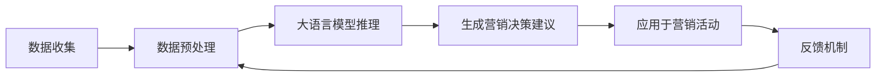

# 大语言模型在精准营销决策中的推理应用

> 关键词：大语言模型、精准营销决策、推理应用、营销数据分析、客户细分

> 摘要：本文深入探讨了大语言模型在精准营销决策中的推理应用。首先介绍了相关背景知识，包括研究目的、预期读者等。接着阐述了核心概念及其联系，分析了大语言模型用于精准营销决策推理的核心算法原理，并给出具体操作步骤。同时，介绍了相关数学模型和公式。通过项目实战案例，详细解释了代码实现和解读。还探讨了大语言模型在精准营销决策中的实际应用场景，推荐了学习资源、开发工具和相关论文著作。最后总结了未来发展趋势与挑战，并给出常见问题解答和扩展阅读参考资料，旨在为营销领域利用大语言模型进行精准决策提供全面的技术指导。

## 1. 背景介绍 
### 1.1 目的和范围
在当今竞争激烈的市场环境中，精准营销决策对于企业的成功至关重要。传统的营销决策方法往往依赖于人工经验和简单的数据分析，难以满足日益复杂的市场需求。大语言模型凭借其强大的语言理解和生成能力，为精准营销决策带来了新的机遇。本文的目的是深入研究大语言模型在精准营销决策中的推理应用，探讨如何利用大语言模型分析市场数据、预测客户行为、制定精准营销策略。研究范围涵盖了大语言模型的基本原理、核心算法，以及在不同营销场景中的具体应用。

### 1.2 预期读者
本文预期读者包括市场营销专业人士、数据分析师、人工智能研究者以及对精准营销和大语言模型感兴趣的技术爱好者。对于市场营销专业人士，本文将提供利用大语言模型提升营销决策精准度的方法和思路；对于数据分析师，有助于深入理解大语言模型在营销数据分析中的应用；对于人工智能研究者，可从中获取大语言模型在营销领域的具体应用案例；对于技术爱好者，能了解大语言模型在实际业务中的应用场景和价值。

### 1.3 文档结构概述
本文共分为十个部分。第一部分为背景介绍，阐述研究目的、预期读者和文档结构。第二部分介绍大语言模型和精准营销决策的核心概念及其联系。第三部分详细讲解大语言模型在精准营销决策中推理应用的核心算法原理，并给出具体操作步骤。第四部分介绍相关数学模型和公式，并进行详细讲解和举例说明。第五部分通过项目实战，展示代码实际案例并进行详细解释。第六部分探讨大语言模型在精准营销决策中的实际应用场景。第七部分推荐学习资源、开发工具和相关论文著作。第八部分总结未来发展趋势与挑战。第九部分为附录，解答常见问题。第十部分提供扩展阅读和参考资料。

### 1.4 术语表
#### 1.4.1 核心术语定义
- **大语言模型**：是一种基于深度学习的人工智能模型，通过在大规模文本数据上进行训练，学习语言的模式和规律，能够处理自然语言理解和生成任务。
- **精准营销决策**：指企业根据市场数据和客户信息，运用科学的方法和技术，制定针对性强、效果显著的营销策略的过程。
- **推理应用**：指利用已有的知识和数据，通过逻辑推理得出结论的过程，在大语言模型中表现为根据输入的信息生成有用的营销决策建议。

#### 1.4.2 相关概念解释
- **营销数据分析**：对营销活动中产生的数据进行收集、整理、分析和解读，以发现市场趋势、客户需求和营销效果等信息。
- **客户细分**：根据客户的特征、行为、需求等因素，将客户划分为不同的群体，以便企业制定个性化的营销策略。

#### 1.4.3 缩略词列表
- **LLM**：大语言模型（Large Language Model）
- **CRM**：客户关系管理（Customer Relationship Management）

## 2. 核心概念与联系 
### 核心概念原理
大语言模型的核心原理是基于Transformer架构的深度学习模型。Transformer架构通过自注意力机制（Self-Attention）能够有效地捕捉文本中的长距离依赖关系，从而实现对语言的理解和生成。在训练过程中，大语言模型使用大规模的无监督学习数据进行预训练，学习语言的通用模式和规律。然后，通过微调（Fine-Tuning）在特定的任务数据上进行训练，使其适应具体的应用场景。

精准营销决策则是基于市场数据和客户信息，运用数据分析和机器学习技术，对客户进行细分、预测客户行为和制定营销策略的过程。精准营销决策的核心在于通过深入了解客户需求和行为，提高营销活动的针对性和效果。

### 架构的文本示意图
大语言模型在精准营销决策中的应用架构可以描述为：首先，收集市场数据和客户信息，包括客户基本信息、购买历史、浏览记录等。然后，对这些数据进行预处理，转换为适合大语言模型输入的格式。接着，将预处理后的数据输入到大语言模型中，大语言模型根据其学习到的知识和模式进行推理，生成营销决策建议，如客户细分结果、个性化推荐策略等。最后，将这些建议应用到实际的营销活动中，并通过反馈机制不断优化大语言模型和营销策略。

### Mermaid流程图


## 3. 核心算法原理 & 具体操作步骤 
### 核心算法原理
大语言模型在精准营销决策中的推理应用主要基于序列到序列（Seq2Seq）模型。Seq2Seq模型由编码器（Encoder）和解码器（Decoder）组成。编码器将输入的文本序列转换为固定长度的向量表示，解码器根据这个向量表示生成输出序列。

在精准营销决策中，编码器将市场数据和客户信息编码为向量，解码器根据这个向量生成营销决策建议。例如，输入客户的购买历史和浏览记录，解码器可以生成针对该客户的个性化推荐列表。

### Python源代码阐述
以下是一个简单的基于PyTorch实现的Seq2Seq模型示例：

```python
import torch
import torch.nn as nn

# 定义编码器
class Encoder(nn.Module):
    def __init__(self, input_dim, emb_dim, hid_dim, n_layers, dropout):
        super().__init__()
        self.hid_dim = hid_dim
        self.n_layers = n_layers
        self.embedding = nn.Embedding(input_dim, emb_dim)
        self.rnn = nn.LSTM(emb_dim, hid_dim, n_layers, dropout=dropout)
        self.dropout = nn.Dropout(dropout)

    def forward(self, src):
        embedded = self.dropout(self.embedding(src))
        outputs, (hidden, cell) = self.rnn(embedded)
        return hidden, cell

# 定义解码器
class Decoder(nn.Module):
    def __init__(self, output_dim, emb_dim, hid_dim, n_layers, dropout):
        super().__init__()
        self.output_dim = output_dim
        self.hid_dim = hid_dim
        self.n_layers = n_layers
        self.embedding = nn.Embedding(output_dim, emb_dim)
        self.rnn = nn.LSTM(emb_dim, hid_dim, n_layers, dropout=dropout)
        self.fc_out = nn.Linear(hid_dim, output_dim)
        self.dropout = nn.Dropout(dropout)

    def forward(self, input, hidden, cell):
        input = input.unsqueeze(0)
        embedded = self.dropout(self.embedding(input))
        output, (hidden, cell) = self.rnn(embedded, (hidden, cell))
        prediction = self.fc_out(output.squeeze(0))
        return prediction, hidden, cell

# 定义Seq2Seq模型
class Seq2Seq(nn.Module):
    def __init__(self, encoder, decoder, device):
        super().__init__()
        self.encoder = encoder
        self.decoder = decoder
        self.device = device

    def forward(self, src, trg, teacher_forcing_ratio=0.5):
        batch_size = trg.shape[1]
        trg_len = trg.shape[0]
        trg_vocab_size = self.decoder.output_dim
        outputs = torch.zeros(trg_len, batch_size, trg_vocab_size).to(self.device)
        hidden, cell = self.encoder(src)
        input = trg[0, :]
        for t in range(1, trg_len):
            output, hidden, cell = self.decoder(input, hidden, cell)
            outputs[t] = output
            teacher_force = torch.rand(1).item() < teacher_forcing_ratio
            top1 = output.argmax(1)
            input = trg[t] if teacher_force else top1
        return outputs
```

### 具体操作步骤
1. **数据准备**：收集市场数据和客户信息，并进行预处理，包括数据清洗、特征提取和编码等。
2. **模型训练**：使用准备好的数据对Seq2Seq模型进行训练，调整模型参数以提高性能。
3. **推理过程**：将预处理后的新数据输入到训练好的模型中，生成营销决策建议。
4. **评估和优化**：对生成的营销决策建议进行评估，根据评估结果优化模型和营销策略。

## 4. 数学模型和公式 & 详细讲解 & 举例说明 
### 数学模型和公式
#### 自注意力机制
自注意力机制是Transformer架构的核心，其计算公式如下：
$$Attention(Q, K, V) = softmax(\frac{QK^T}{\sqrt{d_k}})V$$
其中，$Q$ 是查询矩阵，$K$ 是键矩阵，$V$ 是值矩阵，$d_k$ 是键向量的维度。

#### 交叉熵损失函数
在训练Seq2Seq模型时，通常使用交叉熵损失函数来衡量模型预测结果与真实标签之间的差异，其公式如下：
$$L = -\frac{1}{N}\sum_{i=1}^{N}\sum_{j=1}^{C}y_{ij}\log(p_{ij})$$
其中，$N$ 是样本数量，$C$ 是类别数量，$y_{ij}$ 是第 $i$ 个样本的第 $j$ 个类别的真实标签，$p_{ij}$ 是模型预测第 $i$ 个样本属于第 $j$ 个类别的概率。

### 详细讲解
#### 自注意力机制
自注意力机制的作用是计算输入序列中每个位置与其他位置之间的相关性。通过计算查询矩阵 $Q$ 与键矩阵 $K$ 的乘积，可以得到每个位置与其他位置的相似度得分。然后，使用 $softmax$ 函数将这些得分归一化，得到注意力权重。最后，将注意力权重与值矩阵 $V$ 相乘，得到加权求和的结果，即该位置的表示。

#### 交叉熵损失函数
交叉熵损失函数用于衡量模型预测结果与真实标签之间的差异。当模型预测结果与真实标签越接近时，交叉熵损失函数的值越小；反之，当模型预测结果与真实标签差异越大时，交叉熵损失函数的值越大。在训练过程中，通过最小化交叉熵损失函数来调整模型参数，使模型的预测结果更加准确。

### 举例说明
假设我们有一个输入序列 $[x_1, x_2, x_3]$，经过嵌入层后得到向量表示 $[e_1, e_2, e_3]$。我们可以通过线性变换得到查询矩阵 $Q$、键矩阵 $K$ 和值矩阵 $V$。然后，根据自注意力机制的公式计算注意力权重和输出。

假设我们的分类任务有 3 个类别，对于一个样本，其真实标签为 $[1, 0, 0]$，模型预测的概率分布为 $[0.8, 0.1, 0.1]$。根据交叉熵损失函数的公式，可以计算出该样本的损失值为：
$$L = -(1\times\log(0.8) + 0\times\log(0.1) + 0\times\log(0.1)) \approx 0.223$$

## 5. 项目实战：代码实际案例和详细解释说明 
### 5.1  开发环境搭建
#### 安装Python和PyTorch
首先，确保你已经安装了Python 3.6或更高版本。可以从Python官方网站（https://www.python.org/downloads/）下载并安装。

然后，安装PyTorch。根据你的操作系统和CUDA版本，可以选择合适的安装命令。例如，如果你使用的是CPU版本的PyTorch，可以使用以下命令：
```bash
pip install torch torchvision
```

#### 安装其他依赖库
还需要安装一些其他的依赖库，如NumPy、Pandas等。可以使用以下命令进行安装：
```bash
pip install numpy pandas
```

### 5.2  源代码详细实现和代码解读
以下是一个完整的项目实战代码示例，用于使用大语言模型进行客户细分：

```python
import torch
import torch.nn as nn
import torch.optim as optim
import numpy as np
import pandas as pd
from sklearn.model_selection import train_test_split
from sklearn.preprocessing import LabelEncoder

# 加载数据
data = pd.read_csv('customer_data.csv')

# 数据预处理
X = data.drop('segment', axis=1)
y = data['segment']

# 对分类特征进行编码
categorical_cols = X.select_dtypes(include=['object']).columns
for col in categorical_cols:
    le = LabelEncoder()
    X[col] = le.fit_transform(X[col])

# 划分训练集和测试集
X_train, X_test, y_train, y_test = train_test_split(X, y, test_size=0.2, random_state=42)

# 将数据转换为PyTorch张量
X_train = torch.tensor(X_train.values, dtype=torch.float32)
y_train = torch.tensor(y_train.values, dtype=torch.long)
X_test = torch.tensor(X_test.values, dtype=torch.float32)
y_test = torch.tensor(y_test.values, dtype=torch.long)

# 定义神经网络模型
class CustomerSegmentationModel(nn.Module):
    def __init__(self, input_dim, hidden_dim, output_dim):
        super().__init__()
        self.fc1 = nn.Linear(input_dim, hidden_dim)
        self.relu = nn.ReLU()
        self.fc2 = nn.Linear(hidden_dim, output_dim)

    def forward(self, x):
        out = self.fc1(x)
        out = self.relu(out)
        out = self.fc2(out)
        return out

# 初始化模型
input_dim = X_train.shape[1]
hidden_dim = 64
output_dim = len(y.unique())
model = CustomerSegmentationModel(input_dim, hidden_dim, output_dim)

# 定义损失函数和优化器
criterion = nn.CrossEntropyLoss()
optimizer = optim.Adam(model.parameters(), lr=0.001)

# 训练模型
num_epochs = 100
for epoch in range(num_epochs):
    optimizer.zero_grad()
    outputs = model(X_train)
    loss = criterion(outputs, y_train)
    loss.backward()
    optimizer.step()
    if (epoch+1) % 10 == 0:
        print(f'Epoch [{epoch+1}/{num_epochs}], Loss: {loss.item():.4f}')

# 测试模型
with torch.no_grad():
    outputs = model(X_test)
    _, predicted = torch.max(outputs.data, 1)
    accuracy = (predicted == y_test).sum().item() / y_test.size(0)
    print(f'Test Accuracy: {accuracy:.4f}')
```

### 代码解读与分析
1. **数据加载和预处理**：使用Pandas库加载客户数据，并对分类特征进行编码。然后，使用`train_test_split`函数将数据划分为训练集和测试集。
2. **模型定义**：定义了一个简单的神经网络模型`CustomerSegmentationModel`，包含一个输入层、一个隐藏层和一个输出层。
3. **损失函数和优化器**：使用交叉熵损失函数`nn.CrossEntropyLoss()`和Adam优化器`optim.Adam()`。
4. **模型训练**：在训练过程中，通过反向传播算法更新模型参数，每10个epoch打印一次损失值。
5. **模型测试**：在测试集上评估模型的准确率。

## 6. 实际应用场景 
### 客户细分
大语言模型可以根据客户的基本信息、购买历史、浏览记录等数据，对客户进行细分。例如，将客户分为高价值客户、潜在客户、流失客户等不同群体。企业可以针对不同的客户群体制定个性化的营销策略，提高营销效果。

### 个性化推荐
通过分析客户的偏好和行为，大语言模型可以为客户提供个性化的产品推荐。例如，电商平台可以根据客户的浏览和购买历史，为客户推荐符合其兴趣的商品，提高客户的购买转化率。

### 营销活动优化
大语言模型可以分析营销活动的数据，如广告投放效果、促销活动参与度等，为企业提供优化建议。例如，根据分析结果调整广告投放渠道、优化促销活动内容等，提高营销活动的效果和投资回报率。

### 客户服务
大语言模型可以用于智能客服系统，自动回答客户的问题和解决客户的问题。例如，根据客户的咨询内容，生成准确的回答和解决方案，提高客户服务的效率和质量。

## 7. 工具和资源推荐
### 7.1 学习资源推荐
#### 7.1.1 书籍推荐
- 《深度学习》（Deep Learning）：由Ian Goodfellow、Yoshua Bengio和Aaron Courville所著，是深度学习领域的经典教材，详细介绍了深度学习的基本原理和算法。
- 《Python深度学习》（Deep Learning with Python）：由Francois Chollet所著，以Python和Keras为工具，介绍了深度学习的实践应用。
- 《自然语言处理入门》：帮助读者快速了解自然语言处理的基本概念和方法。

#### 7.1.2 在线课程
- Coursera上的“深度学习专项课程”（Deep Learning Specialization）：由Andrew Ng教授授课，包括深度学习的基础、卷积神经网络、循环神经网络等内容。
- edX上的“自然语言处理”（Natural Language Processing）：介绍了自然语言处理的基本技术和应用。

#### 7.1.3 技术博客和网站
- Medium：有许多关于人工智能和深度学习的优质博客文章。
- arXiv：提供最新的学术研究论文。
- Hugging Face：提供大语言模型的开源实现和相关教程。

### 7.2 开发工具框架推荐
#### 7.2.1 IDE和编辑器
- PyCharm：功能强大的Python集成开发环境，支持代码调试、版本控制等功能。
- Jupyter Notebook：交互式开发环境，适合数据探索和模型实验。

#### 7.2.2 调试和性能分析工具
- TensorBoard：用于可视化深度学习模型的训练过程和性能指标。
- PyTorch Profiler：可以帮助分析PyTorch模型的性能瓶颈。

#### 7.2.3 相关框架和库
- PyTorch：深度学习框架，提供丰富的神经网络层和优化算法。
- Transformers：Hugging Face开发的库，提供了许多预训练的大语言模型。
- Scikit-learn：机器学习库，提供了数据预处理、模型选择和评估等功能。

### 7.3 相关论文著作推荐
#### 7.3.1 经典论文
- 《Attention Is All You Need》：介绍了Transformer架构，是大语言模型的基础。
- 《BERT: Pre-training of Deep Bidirectional Transformers for Language Understanding》：提出了BERT模型，在自然语言处理任务中取得了显著的效果。

#### 7.3.2 最新研究成果
可以关注arXiv上关于大语言模型和精准营销的最新研究论文，了解该领域的前沿动态。

#### 7.3.3 应用案例分析
一些商业杂志和行业报告中会有大语言模型在精准营销中的应用案例分析，可以从中学习实际应用经验。

## 8. 总结：未来发展趋势与挑战
### 未来发展趋势
- **模型性能不断提升**：随着计算资源的不断增加和算法的不断改进，大语言模型的性能将不断提升，能够处理更加复杂的营销决策任务。
- **与其他技术融合**：大语言模型将与计算机视觉、物联网等技术融合，实现更加全面的营销数据采集和分析，为精准营销决策提供更丰富的信息。
- **行业应用拓展**：大语言模型在精准营销决策中的应用将不断拓展到更多行业，如金融、医疗、教育等。

### 挑战
- **数据隐私和安全**：大语言模型需要大量的客户数据进行训练，如何保护客户数据的隐私和安全是一个重要的挑战。
- **模型可解释性**：大语言模型通常是黑盒模型，其决策过程难以解释。在精准营销决策中，需要提高模型的可解释性，以便企业更好地理解和应用模型的输出结果。
- **计算资源需求**：训练和运行大语言模型需要大量的计算资源，如何降低计算成本是一个亟待解决的问题。

## 9. 附录：常见问题与解答
### 大语言模型在精准营销决策中的准确率如何保证？
可以通过以下方法保证大语言模型在精准营销决策中的准确率：
- 使用高质量的数据进行训练，包括数据清洗、特征工程等。
- 选择合适的模型架构和参数，通过实验和调优来优化模型性能。
- 进行模型评估和验证，使用交叉验证等方法评估模型的泛化能力。

### 大语言模型在精准营销决策中的应用是否会取代人类营销专家？
不会。大语言模型可以为营销决策提供有价值的建议和支持，但人类营销专家具有丰富的经验和判断力，能够考虑到更多的因素和情境。在实际应用中，大语言模型和人类营销专家可以相互补充，共同提高精准营销决策的质量。

### 如何选择适合的大语言模型用于精准营销决策？
选择适合的大语言模型需要考虑以下因素：
- 模型的性能和效果，包括准确率、召回率等指标。
- 模型的可解释性，以便企业能够理解模型的决策过程。
- 模型的计算资源需求和成本，选择适合企业实际情况的模型。

## 10. 扩展阅读 & 参考资料
### 扩展阅读
- 《人工智能时代的营销革命》：探讨了人工智能在营销领域的应用和发展趋势。
- 《营销数据分析实战》：介绍了营销数据分析的方法和技巧。

### 参考资料
- Goodfellow, I., Bengio, Y., & Courville, A. (2016). Deep Learning. MIT Press.
- Chollet, F. (2017). Deep Learning with Python. Manning Publications.
- Vaswani, A., Shazeer, N., Parmar, N., Uszkoreit, J., Jones, L., Gomez, A. N.,... & Polosukhin, I. (2017). Attention is all you need. Advances in neural information processing systems, 5998-6008.
- Devlin, J., Chang, M. W., Lee, K., & Toutanova, K. (2018). Bert: Pre-training of deep bidirectional transformers for language understanding. arXiv preprint arXiv:1810.04805.

作者：AI天才研究院/AI Genius Institute & 禅与计算机程序设计艺术 /Zen And The Art of Computer Programming