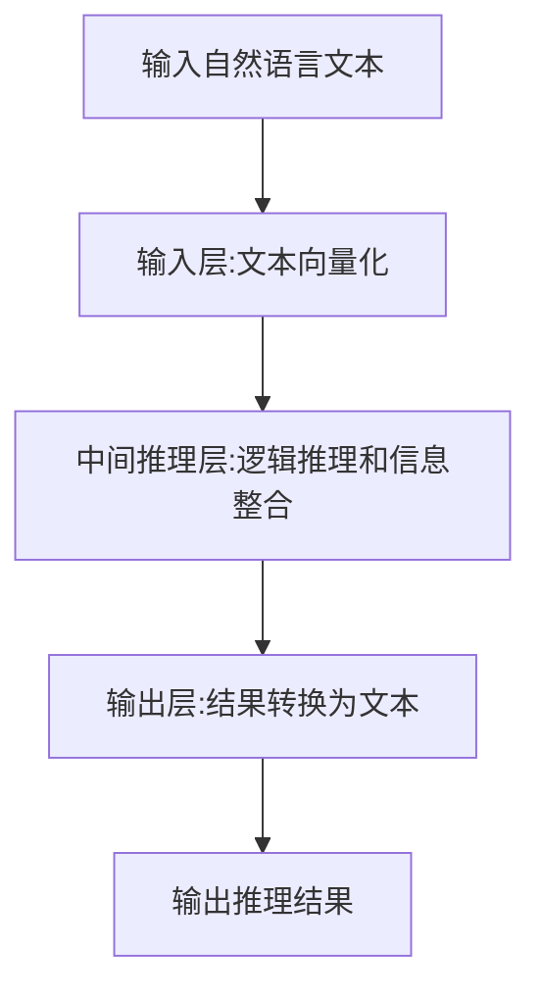

# 大语言模型的深度推理:突破与挑战

> 关键词：大语言模型、深度推理、推理能力突破、推理挑战、自然语言处理

> 摘要：本文聚焦于大语言模型的深度推理，深入探讨了其在这一领域取得的突破以及面临的挑战。首先介绍了相关背景知识，包括目的范围、预期读者等内容。接着阐述了大语言模型深度推理的核心概念与联系，通过文本示意图和Mermaid流程图进行直观展示。详细讲解了核心算法原理，并给出Python源代码示例。对涉及的数学模型和公式进行推导与举例说明。通过项目实战展示代码实现和解读。分析了大语言模型深度推理的实际应用场景。推荐了相关的学习资源、开发工具框架以及论文著作。最后总结了未来发展趋势与挑战，解答了常见问题并提供扩展阅读和参考资料，旨在为相关领域的研究者和开发者提供全面而深入的参考。

## 1. 背景介绍 
### 1.1 目的和范围
随着人工智能技术的飞速发展，大语言模型在自然语言处理领域取得了显著的成果。大语言模型的深度推理能力是衡量其智能水平的重要指标之一。本文章的目的在于深入探讨大语言模型深度推理方面的进展，详细分析其在推理能力上的突破以及面临的诸多挑战。范围涵盖了大语言模型深度推理的核心概念、算法原理、数学模型、实际应用等多个方面，旨在为读者提供一个全面而系统的了解。

### 1.2 预期读者
本文预期读者主要包括人工智能领域的研究者，他们可以从文章中获取大语言模型深度推理的最新研究动态和技术细节，为进一步的研究提供参考；软件开发者，能够学习到相关的算法实现和代码示例，应用于实际的开发项目中；对人工智能感兴趣的技术爱好者，通过通俗易懂的讲解和丰富的案例，了解大语言模型深度推理的基本原理和应用场景。

### 1.3 文档结构概述
本文将按照以下结构展开：首先介绍大语言模型深度推理的背景知识，包括目的范围、预期读者等；接着阐述核心概念与联系，通过文本示意图和流程图进行直观呈现；详细讲解核心算法原理，并给出Python代码示例；推导相关的数学模型和公式，并举例说明；进行项目实战，展示代码实现和解读；分析实际应用场景；推荐学习资源、开发工具框架和论文著作；总结未来发展趋势与挑战；解答常见问题；提供扩展阅读和参考资料。

### 1.4 术语表
#### 1.4.1 核心术语定义
- **大语言模型**：基于大量文本数据进行训练的深度学习模型，具有强大的语言理解和生成能力，如GPT - 3、BERT等。
- **深度推理**：指大语言模型在处理复杂问题时，能够进行多层次、多步骤的逻辑分析和推理，得出合理的结论。
- **自然语言处理**：研究如何让计算机理解、处理和生成人类自然语言的技术领域。

#### 1.4.2 相关概念解释
- **预训练**：大语言模型在大规模无监督数据上进行训练，学习语言的通用模式和特征。
- **微调**：在预训练的基础上，使用特定任务的有监督数据对模型进行进一步训练，以适应具体的任务需求。

#### 1.4.3 缩略词列表
- **NLP**：Natural Language Processing，自然语言处理
- **GPT**：Generative Pretrained Transformer，生成式预训练变换器
- **BERT**：Bidirectional Encoder Representations from Transformers，基于变换器的双向编码器表示

## 2. 核心概念与联系 

### 核心概念原理
大语言模型的深度推理建立在其强大的语言表示能力基础上。通过预训练，模型学习到了丰富的语言知识和语义信息。在进行深度推理时，模型需要对输入的文本进行理解、分析和整合，利用已有的知识和模式进行逻辑推导。例如，当模型接收到一个需要推理的问题时，它会首先对问题进行语义解析，提取关键信息，然后在其知识体系中寻找相关的知识和规则，通过一系列的推理步骤得出结论。

### 架构的文本示意图
大语言模型的深度推理架构可以分为输入层、中间推理层和输出层。输入层负责接收自然语言文本，将其转换为模型能够处理的向量表示。中间推理层包含多个神经网络层，这些层对输入的向量进行处理和变换，进行逻辑推理和信息整合。输出层将推理结果转换为自然语言文本输出。

### Mermaid 流程图


## 3. 核心算法原理 & 具体操作步骤 

### 核心算法原理
大语言模型的深度推理通常基于Transformer架构。Transformer架构由编码器和解码器组成，编码器负责对输入文本进行编码，提取文本的特征表示，解码器根据编码器的输出进行解码，生成推理结果。在推理过程中，模型使用自注意力机制来捕捉文本中不同位置之间的依赖关系，从而更好地理解文本的语义。

### Python源代码示例
以下是一个简单的使用Hugging Face Transformers库进行文本推理的示例：
```python
from transformers import AutoTokenizer, AutoModelForQuestionAnswering
import torch

# 加载预训练的模型和分词器
tokenizer = AutoTokenizer.from_pretrained("bert-large-uncased-whole-word-masking-finetuned-squad")
model = AutoModelForQuestionAnswering.from_pretrained("bert-large-uncased-whole-word-masking-finetuned-squad")

# 输入问题和上下文
question = "What is the capital of France?"
context = "France is a country in Western Europe. Its capital is Paris."

# 对输入进行分词
inputs = tokenizer(question, context, return_tensors='pt')

# 进行推理
with torch.no_grad():
    outputs = model(**inputs)

# 获取答案的起始和结束位置
answer_start_index = outputs.start_logits.argmax()
answer_end_index = outputs.end_logits.argmax()

# 提取答案
predict_answer_tokens = inputs.input_ids[0, answer_start_index : answer_end_index + 1]
answer = tokenizer.decode(predict_answer_tokens)

print("Answer:", answer)
```
### 具体操作步骤
1. **加载预训练模型和分词器**：使用Hugging Face Transformers库加载适合推理任务的预训练模型和对应的分词器。
2. **准备输入数据**：将问题和相关的上下文文本作为输入。
3. **分词处理**：使用分词器将输入文本转换为模型能够处理的词元序列。
4. **推理计算**：将分词后的输入数据输入到模型中，进行推理计算，得到答案的起始和结束位置的概率分布。
5. **提取答案**：根据概率分布确定答案的起始和结束位置，提取对应的词元并解码为自然语言文本。

## 4. 数学模型和公式 & 详细讲解 & 举例说明 

### 自注意力机制的数学模型
自注意力机制是Transformer架构的核心组成部分，其数学公式如下：
$$
Attention(Q, K, V) = softmax(\frac{QK^T}{\sqrt{d_k}})V
$$
其中，$Q$ 是查询矩阵，$K$ 是键矩阵，$V$ 是值矩阵，$d_k$ 是键向量的维度。

### 详细讲解
- **查询矩阵 $Q$**：用于表示当前位置需要关注的信息。
- **键矩阵 $K$**：用于表示其他位置的信息特征。
- **值矩阵 $V$**：用于存储其他位置的实际信息。
- **$QK^T$**：计算查询向量与所有键向量的相似度得分。
- **$\frac{QK^T}{\sqrt{d_k}}$**：对相似度得分进行缩放，防止梯度消失或爆炸。
- **$softmax$ 函数**：将相似度得分转换为概率分布，表示每个位置的注意力权重。
- **$softmax(\frac{QK^T}{\sqrt{d_k}})V$**：根据注意力权重对值矩阵进行加权求和，得到当前位置的输出。

### 举例说明
假设我们有一个输入序列 $x = [x_1, x_2, x_3]$，每个 $x_i$ 是一个向量。我们首先通过线性变换得到 $Q$、$K$ 和 $V$ 矩阵：
$$
Q = W_Qx, K = W_Kx, V = W_Vx
$$
其中，$W_Q$、$W_K$ 和 $W_V$ 是可学习的权重矩阵。

然后计算相似度得分：
$$
scores = \frac{QK^T}{\sqrt{d_k}}
$$
假设 $scores$ 如下：
$$
scores = 
\begin{bmatrix}
0.8 & 0.2 & 0.1 \\
0.3 & 0.7 & 0.2 \\
0.1 & 0.2 & 0.9
\end{bmatrix}
$$
对 $scores$ 应用 $softmax$ 函数得到注意力权重：
$$
weights = softmax(scores) = 
\begin{bmatrix}
0.6 & 0.3 & 0.1 \\
0.2 & 0.7 & 0.1 \\
0.1 & 0.2 & 0.7
\end{bmatrix}
$$
最后，根据注意力权重对 $V$ 矩阵进行加权求和：
$$
output = weightsV
$$

## 5. 项目实战：代码实际案例和详细解释说明 

### 5.1  开发环境搭建
- **Python环境**：建议使用Python 3.7及以上版本。可以通过Anaconda或官方Python网站进行安装。
- **深度学习框架**：使用PyTorch作为深度学习框架，可根据自己的CUDA版本选择合适的安装方式，例如：
```bash
pip install torch torchvision torchaudio
```
- **Hugging Face Transformers库**：用于加载预训练模型和分词器，安装命令如下：
```bash
pip install transformers
```

### 5.2  源代码详细实现和代码解读
以下是一个更复杂的项目示例，用于解决阅读理解任务：
```python
import torch
from transformers import AutoTokenizer, AutoModelForQuestionAnswering

# 加载预训练的模型和分词器
tokenizer = AutoTokenizer.from_pretrained("bert-large-uncased-whole-word-masking-finetuned-squad")
model = AutoModelForQuestionAnswering.from_pretrained("bert-large-uncased-whole-word-masking-finetuned-squad")

# 定义问题和上下文
question = "Who is the author of Harry Potter?"
context = "The Harry Potter series is a fantasy novel series written by J.K. Rowling. The series follows the adventures of a young wizard named Harry Potter."

# 对输入进行分词
inputs = tokenizer(question, context, return_tensors='pt')

# 进行推理
with torch.no_grad():
    outputs = model(**inputs)

# 获取答案的起始和结束位置
answer_start_index = outputs.start_logits.argmax()
answer_end_index = outputs.end_logits.argmax()

# 提取答案
predict_answer_tokens = inputs.input_ids[0, answer_start_index : answer_end_index + 1]
answer = tokenizer.decode(predict_answer_tokens)

print("Question:", question)
print("Answer:", answer)
```
### 代码解读
1. **导入必要的库**：导入`torch`库用于深度学习计算，导入`AutoTokenizer`和`AutoModelForQuestionAnswering`用于加载分词器和问答模型。
2. **加载预训练模型和分词器**：使用`AutoTokenizer.from_pretrained`和`AutoModelForQuestionAnswering.from_pretrained`加载预训练的模型和分词器。
3. **定义问题和上下文**：将需要回答的问题和相关的上下文文本定义为字符串。
4. **分词处理**：使用`tokenizer`对问题和上下文进行分词，将其转换为模型能够处理的词元序列，并返回PyTorch张量。
5. **推理计算**：使用`model`对输入进行推理，得到答案的起始和结束位置的概率分布。
6. **提取答案**：根据概率分布确定答案的起始和结束位置，提取对应的词元并解码为自然语言文本。
7. **输出结果**：打印问题和答案。

### 5.3  代码解读与分析
这段代码的核心是使用预训练的问答模型对输入的问题和上下文进行推理，得到答案。代码中使用了`torch.no_grad()`来禁用梯度计算，因为在推理阶段不需要进行反向传播和参数更新，这样可以节省计算资源。通过`argmax()`函数找到答案的起始和结束位置，然后提取对应的词元并解码为文本。这种方法简单高效，但也存在一些局限性，例如对于复杂的推理问题可能无法得到准确的答案。

## 6. 实际应用场景 
### 智能客服
大语言模型的深度推理能力可以应用于智能客服系统中。当用户提出问题时，智能客服可以通过深度推理理解问题的意图，从知识库中查找相关信息，并进行推理和整合，给出准确的回答。例如，在电商平台的智能客服中，用户询问某个商品的售后政策，智能客服可以根据商品信息和售后规则进行推理，给出详细的解答。

### 医疗诊断辅助
在医疗领域，大语言模型的深度推理可以辅助医生进行诊断。医生可以输入患者的症状、病史等信息，模型可以根据医学知识和病例数据进行推理，提供可能的诊断结果和建议。例如，在诊断某种疾病时，模型可以根据症状和检查结果，结合医学文献和病例库，推理出可能的疾病类型和治疗方案。

### 金融风险评估
在金融领域，大语言模型的深度推理可以用于风险评估。模型可以分析企业的财务报表、市场动态、行业信息等，通过推理预测企业的信用风险和市场风险。例如，在银行贷款审批中，模型可以根据企业的财务数据和市场环境进行推理，评估企业的还款能力和违约风险，为贷款决策提供参考。

### 教育领域
在教育领域，大语言模型的深度推理可以用于智能辅导和作业批改。例如，在数学辅导中，模型可以根据学生提出的问题进行推理，提供解题思路和步骤。在作文批改中，模型可以分析作文的语法、逻辑和内容，给出批改建议和评分。

## 7. 工具和资源推荐
### 7.1 学习资源推荐
#### 7.1.1 书籍推荐
- 《深度学习》：由Ian Goodfellow、Yoshua Bengio和Aaron Courville所著，是深度学习领域的经典教材，涵盖了深度学习的基本原理、算法和应用。
- 《自然语言处理入门》：何晗著，适合初学者入门自然语言处理领域，介绍了自然语言处理的基本概念、算法和实践案例。
- 《Transformers从实践到原理：基于Hugging Face》：深入介绍了Transformer架构和Hugging Face库的使用，对于理解大语言模型很有帮助。

#### 7.1.2 在线课程
- Coursera上的“Natural Language Processing Specialization”：由顶尖大学的教授授课，系统地介绍了自然语言处理的各个方面，包括大语言模型。
- edX上的“Deep Learning for Natural Language Processing”：专注于深度学习在自然语言处理中的应用，包括Transformer架构和大语言模型的训练。

#### 7.1.3 技术博客和网站
- Hugging Face Blog：提供了关于大语言模型和自然语言处理的最新研究成果和实践经验。
- Towards Data Science：有很多关于人工智能和自然语言处理的技术文章和案例分析。

### 7.2 开发工具框架推荐
#### 7.2.1 IDE和编辑器
- PyCharm：是一款专业的Python集成开发环境，提供了丰富的代码编辑、调试和项目管理功能。
- Jupyter Notebook：适合进行交互式编程和数据分析，方便代码的调试和展示。

#### 7.2.2 调试和性能分析工具
- TensorBoard：用于可视化深度学习模型的训练过程和性能指标，帮助开发者分析模型的训练情况。
- PyTorch Profiler：可以对PyTorch代码进行性能分析，找出性能瓶颈。

#### 7.2.3 相关框架和库
- Hugging Face Transformers：提供了丰富的预训练模型和工具，方便开发者进行自然语言处理任务的开发。
- AllenNLP：是一个用于自然语言处理的深度学习框架，提供了各种预训练模型和工具，支持快速开发和实验。

### 7.3 相关论文著作推荐
#### 7.3.1 经典论文
- “Attention Is All You Need”：介绍了Transformer架构，是大语言模型的基础。
- “BERT: Pre-training of Deep Bidirectional Transformers for Language Understanding”：提出了BERT模型，开创了预训练语言模型的新时代。

#### 7.3.2 最新研究成果
- 关注顶级学术会议如ACL（Association for Computational Linguistics）、EMNLP（Conference on Empirical Methods in Natural Language Processing）上的最新论文，了解大语言模型深度推理的最新研究进展。

#### 7.3.3 应用案例分析
- 可以在各大科技公司的技术博客和研究报告中找到大语言模型在不同领域的应用案例分析，学习实际应用中的经验和技巧。

## 8. 总结：未来发展趋势与挑战
### 未来发展趋势
- **更强的推理能力**：未来的大语言模型将不断提升其深度推理能力，能够处理更加复杂的逻辑推理和知识推理任务。例如，在科学研究、法律推理等领域发挥更大的作用。
- **多模态推理**：结合图像、音频、视频等多种模态的信息进行推理，实现更加全面和准确的理解。例如，在智能安防系统中，结合图像和文本信息进行事件推理。
- **个性化推理**：根据用户的偏好、历史数据等进行个性化的推理和服务。例如，在智能推荐系统中，为用户提供更加符合其需求的推荐内容。

### 挑战
- **数据质量和规模**：大语言模型的训练需要大量高质量的数据，但数据的收集、标注和清洗是一个巨大的挑战。同时，数据的隐私和安全问题也需要得到解决。
- **计算资源需求**：大语言模型的训练和推理需要强大的计算资源，这增加了研发和应用的成本。如何降低计算资源的需求是一个亟待解决的问题。
- **可解释性**：大语言模型的推理过程往往是黑盒的，难以解释其决策的依据。提高模型的可解释性，让用户能够理解模型的推理过程和结果，是未来发展的重要方向。

## 9. 附录：常见问题与解答
### 问题1：大语言模型的深度推理和普通推理有什么区别？
大语言模型的深度推理能够处理更加复杂和抽象的问题，需要进行多层次、多步骤的逻辑分析和信息整合。而普通推理可能只涉及简单的规则和逻辑，处理的问题相对较为单一。

### 问题2：如何提高大语言模型的深度推理能力？
可以通过以下方法提高大语言模型的深度推理能力：使用更多高质量的训练数据，设计更加合理的模型架构，采用强化学习等训练方法，引入外部知识图谱等。

### 问题3：大语言模型的深度推理在实际应用中有哪些局限性？
大语言模型的深度推理在实际应用中可能存在以下局限性：对复杂问题的理解和推理能力有限，可能会出现错误的推理结果；推理过程缺乏可解释性，难以让用户信任；对数据的依赖较大，数据质量和规模会影响推理的准确性。

## 10. 扩展阅读 & 参考资料
### 扩展阅读
- 《人工智能时代的自然语言处理》：深入探讨了自然语言处理在人工智能时代的发展和应用。
- 《智能时代的语言与计算》：介绍了语言与计算的交叉领域，包括大语言模型的相关内容。

### 参考资料
- Hugging Face官方文档：https://huggingface.co/docs
- PyTorch官方文档：https://pytorch.org/docs/stable/index.html
- ACL Anthology：https://aclanthology.org/

作者：AI天才研究院/AI Genius Institute & 禅与计算机程序设计艺术 /Zen And The Art of Computer Programming