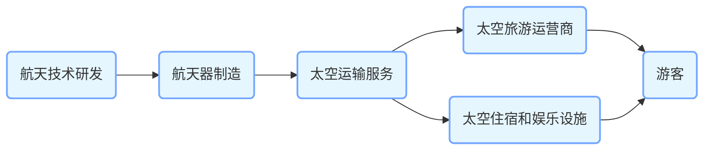

# 太空旅游产业的兴起与投资机会

> 关键词：太空旅游产业、兴起原因、投资机会、发展趋势、技术挑战

> 摘要：本文围绕太空旅游产业展开，深入剖析了该产业兴起的背景和原因，详细探讨了其中蕴含的投资机会。首先介绍了太空旅游产业的相关背景信息，包括目的范围、预期读者等内容。接着阐述了太空旅游产业的核心概念、联系及架构，讲解了涉及的核心算法原理与具体操作步骤，还介绍了相关的数学模型和公式。通过项目实战案例分析代码实现过程，探讨了太空旅游产业在实际中的应用场景。同时推荐了学习该领域知识的工具和资源，包括书籍、在线课程等。最后对太空旅游产业的未来发展趋势与挑战进行总结，并给出常见问题解答和扩展阅读参考资料，为关注太空旅游产业发展和投资的读者提供全面的技术和市场分析。

## 1. 背景介绍 
### 1.1 目的和范围
太空旅游产业作为新兴领域，近年来发展势头迅猛。本文旨在全面分析太空旅游产业兴起的原因、现状以及未来的发展趋势，深入挖掘其中潜藏的投资机会。范围涵盖太空旅游产业的各个环节，包括太空运输、太空住宿、太空体验项目等，同时涉及推动该产业发展的技术、市场、政策等多方面因素。

### 1.2 预期读者
本文的预期读者主要包括对太空旅游产业感兴趣的投资者，他们希望通过了解产业动态寻找合适的投资方向；太空科技领域的从业者，期望从产业发展的角度审视自身工作的前景；以及关注新兴产业发展的研究人员和爱好者，以便深入了解太空旅游这一前沿领域。

### 1.3 文档结构概述
本文首先对太空旅游产业的背景进行介绍，让读者了解研究的目的、范围和预期读者。接着阐述核心概念与联系，包括太空旅游的定义、产业架构等。然后详细讲解核心算法原理和具体操作步骤，通过 Python 代码示例进行说明。随后介绍相关的数学模型和公式，并举例说明其应用。通过项目实战部分展示实际案例和代码解读，分析太空旅游产业在实际中的应用场景。之后推荐学习该领域的工具和资源，最后总结产业的未来发展趋势与挑战，提供常见问题解答和扩展阅读参考资料。

### 1.4 术语表
#### 1.4.1 核心术语定义
- **太空旅游**：指普通人支付一定费用，乘坐航天器进入太空，体验太空环境并进行相关游览活动的旅游形式。
- **亚轨道飞行**：航天器进入太空，但未达到环绕地球的轨道速度，会在一段时间后返回地球表面的飞行方式。
- **轨道飞行**：航天器达到足够的速度，能够围绕地球做圆周或椭圆轨道运动的飞行方式。

#### 1.4.2 相关概念解释
- **太空港**：类似于地面机场，是航天器发射和降落的场所，为太空旅游提供基础设施支持。
- **太空酒店**：在太空中建设的供游客住宿、休闲和娱乐的设施，是太空旅游产业链中的重要环节。

#### 1.4.3 缩略词列表
- **NASA**：美国国家航空航天局（National Aeronautics and Space Administration）
- **ESA**：欧洲航天局（European Space Agency）

## 2. 核心概念与联系 
### 核心概念原理
太空旅游产业基于航天技术的发展，其核心是让普通人能够安全、舒适地进入太空并体验太空环境。主要原理涉及航天器的设计、制造和发射技术，以及太空环境的适应和保障技术。

航天器的设计需要考虑多个因素，如载人能力、安全性、舒适性等。在制造过程中，要使用高强度、轻量化的材料，以提高航天器的性能。发射技术则要确保航天器能够准确进入预定轨道或飞行轨迹。

太空环境适应和保障技术包括生命维持系统、辐射防护、微重力环境下的生活设施等，以保障游客在太空中的生存和生活质量。

### 架构的文本示意图
太空旅游产业架构主要包括以下几个部分：
- **上游**：航天技术研发和航天器制造企业，负责航天器的设计、研发和生产。
- **中游**：太空运输服务提供商，如太空发射公司，负责将游客和物资送入太空。
- **下游**：太空旅游运营商，提供太空旅游产品和服务，包括行程安排、太空体验项目等；太空住宿和娱乐设施提供商，如太空酒店的建设和运营。

### Mermaid 流程图


## 3. 核心算法原理 & 具体操作步骤 
### 核心算法原理
在太空旅游产业中，涉及到多个关键算法，如航天器轨道计算、姿态控制算法等。以下以航天器轨道计算为例进行说明。

航天器轨道计算的核心是根据牛顿万有引力定律和开普勒定律，通过数值方法求解航天器的运动方程。在二体问题中，航天器在地球引力场中的运动方程可以表示为：

$$\frac{d^2\mathbf{r}}{dt^2}=-\frac{\mu}{r^3}\mathbf{r}$$

其中，$\mathbf{r}$ 是航天器相对于地球质心的位置矢量，$\mu$ 是地球的引力常数，$r = |\mathbf{r}|$ 是航天器到地球质心的距离。

### Python 代码实现
```python
import numpy as np
from scipy.integrate import odeint

# 地球引力常数 (m^3/s^2)
mu = 3.986004418e14

def orbit_equation(y, t):
    """
    航天器轨道运动方程
    :param y: 状态向量 [位置, 速度]
    :param t: 时间
    :return: 状态向量的导数
    """
    r = y[:3]
    v = y[3:]
    r_norm = np.linalg.norm(r)
    drdt = v
    dvdt = -mu / r_norm**3 * r
    return np.concatenate((drdt, dvdt))

# 初始条件
r0 = np.array([7000e3, 0, 0])  # 初始位置 (m)
v0 = np.array([0, 7500, 0])    # 初始速度 (m/s)
y0 = np.concatenate((r0, v0))

# 时间点
t = np.linspace(0, 3600, 100)

# 求解轨道方程
solution = odeint(orbit_equation, y0, t)

# 提取位置信息
positions = solution[:, :3]

# 打印前几个位置
print("前几个位置 (m):")
print(positions[:5])
```
### 具体操作步骤
1. **定义物理参数**：确定地球引力常数等物理参数。
2. **定义轨道运动方程**：根据牛顿万有引力定律，将航天器的运动方程转化为一阶常微分方程组。
3. **设置初始条件**：确定航天器的初始位置和速度。
4. **选择数值求解方法**：使用 `scipy.integrate.odeint` 函数对轨道运动方程进行数值求解。
5. **求解并分析结果**：得到航天器在不同时间点的位置和速度信息，进行后续的分析和应用。

## 4. 数学模型和公式 & 详细讲解 & 举例说明 
### 航天器轨道力学模型
在太空旅游中，航天器的轨道设计至关重要。最基本的轨道力学模型是二体问题，即假设航天器只受到地球引力的作用。

#### 开普勒定律
开普勒第一定律：所有行星绕太阳运动的轨道都是椭圆，太阳处在椭圆的一个焦点上。对于航天器绕地球运动，同样适用，航天器的轨道也是椭圆（特殊情况下为圆）。

开普勒第二定律：行星和太阳的连线在相等的时间间隔内扫过相等的面积。这意味着航天器在近地点速度较快，在远地点速度较慢。

开普勒第三定律：所有行星轨道半长轴的三次方跟它的公转周期的二次方的比值都相等。对于航天器绕地球运动，有：

$$\frac{a^3}{T^2}=\frac{\mu}{4\pi^2}$$

其中，$a$ 是轨道半长轴，$T$ 是轨道周期，$\mu$ 是地球引力常数。

#### 轨道要素
描述航天器轨道的要素包括：
- **半长轴 $a$**：决定轨道的大小。
- **偏心率 $e$**：决定轨道的形状，$e = 0$ 时为圆轨道，$0 < e < 1$ 时为椭圆轨道。
- **倾角 $i$**：轨道平面与地球赤道平面的夹角。
- **升交点赤经 $\Omega$**：轨道平面与赤道平面的交线（升交点）相对于春分点的角度。
- **近地点幅角 $\omega$**：近地点相对于升交点的角度。
- **真近点角 $f$**：航天器在轨道上相对于近地点的角度。

### 举例说明
假设要设计一个近地圆轨道的太空旅游项目，轨道高度为 $h = 400$ km。地球半径 $R = 6371$ km，则轨道半径 $r = R + h = 6371 + 400 = 6771$ km。

根据开普勒第三定律，轨道周期 $T$ 可以计算如下：

$$T = 2\pi\sqrt{\frac{r^3}{\mu}}$$

将 $r = 6771\times10^3$ m 和 $\mu = 3.986004418\times10^{14}$ m³/s² 代入上式，可得：

$$T = 2\pi\sqrt{\frac{(6771\times10^3)^3}{3.986004418\times10^{14}}}\approx 5520$$ s

即轨道周期约为 92 分钟。这意味着游客在该轨道上绕地球一圈大约需要 92 分钟。

## 5. 项目实战：代码实际案例和详细解释说明 
### 5.1  开发环境搭建
要运行前面提到的航天器轨道计算代码，需要搭建 Python 开发环境。具体步骤如下：
1. **安装 Python**：从 Python 官方网站（https://www.python.org/downloads/）下载并安装 Python 3.x 版本。
2. **安装依赖库**：使用 `pip` 命令安装 `numpy` 和 `scipy` 库。
```sh
pip install numpy scipy
```
3. **选择开发工具**：可以使用 PyCharm、Jupyter Notebook 等开发工具来编写和运行代码。

### 5.2  源代码详细实现和代码解读
```python
import numpy as np
from scipy.integrate import odeint

# 地球引力常数 (m^3/s^2)
mu = 3.986004418e14

def orbit_equation(y, t):
    """
    航天器轨道运动方程
    :param y: 状态向量 [位置, 速度]
    :param t: 时间
    :return: 状态向量的导数
    """
    r = y[:3]
    v = y[3:]
    r_norm = np.linalg.norm(r)
    drdt = v
    dvdt = -mu / r_norm**3 * r
    return np.concatenate((drdt, dvdt))

# 初始条件
r0 = np.array([7000e3, 0, 0])  # 初始位置 (m)
v0 = np.array([0, 7500, 0])    # 初始速度 (m/s)
y0 = np.concatenate((r0, v0))

# 时间点
t = np.linspace(0, 3600, 100)

# 求解轨道方程
solution = odeint(orbit_equation, y0, t)

# 提取位置信息
positions = solution[:, :3]

# 打印前几个位置
print("前几个位置 (m):")
print(positions[:5])
```
### 代码解读与分析
1. **导入库**：`numpy` 用于数值计算，`scipy.integrate.odeint` 用于求解常微分方程。
2. **定义地球引力常数**：`mu` 是地球的引力常数，用于轨道计算。
3. **定义轨道运动方程**：`orbit_equation` 函数将航天器的运动方程转化为一阶常微分方程组，输入参数 `y` 是状态向量，包含位置和速度信息，`t` 是时间。
4. **设置初始条件**：`r0` 和 `v0` 分别是航天器的初始位置和速度，将它们合并为初始状态向量 `y0`。
5. **设置时间点**：使用 `np.linspace` 函数生成时间点数组 `t`。
6. **求解轨道方程**：使用 `odeint` 函数求解轨道运动方程，得到不同时间点的状态向量。
7. **提取位置信息**：从求解结果中提取位置信息，存储在 `positions` 数组中。
8. **打印结果**：打印前几个位置信息，方便查看计算结果。

## 6. 实际应用场景 
### 亚轨道旅游
亚轨道飞行是目前较为成熟的太空旅游形式。游客乘坐航天器上升到亚轨道高度，体验几分钟的失重状态，同时可以欣赏到地球的壮丽景色。这种旅游形式相对成本较低，适合更多的游客参与。例如，维珍银河公司的太空船二号就是专门为亚轨道旅游设计的航天器。

### 轨道旅游
轨道旅游则需要游客乘坐航天器进入地球轨道，在轨道上停留数天甚至更长时间。游客可以参观国际空间站等太空设施，进行太空实验和观测等活动。轨道旅游对航天器和游客的要求较高，成本也相对较高，但可以提供更丰富的太空体验。

### 太空酒店体验
随着太空旅游产业的发展，未来可能会出现太空酒店。游客可以在太空酒店中住宿、休闲和娱乐，体验微重力环境下的生活。太空酒店可以提供各种设施和服务，如餐厅、健身房、观景台等，为游客提供独特的旅游体验。

### 太空探险和科学研究
太空旅游还可以与太空探险和科学研究相结合。游客可以参与一些简单的科学实验，如微重力环境下的生物实验、材料实验等，为科学研究做出贡献。同时，太空探险活动可以让游客探索月球、火星等天体，拓展人类的太空探索范围。

## 7. 工具和资源推荐
### 7.1 学习资源推荐
#### 7.1.1 书籍推荐
- 《航天动力学基础》：系统介绍了航天器轨道力学、姿态控制等方面的基础知识，是学习太空旅游相关技术的经典教材。
- 《太空旅游：未来的新前沿》：从商业和市场的角度探讨了太空旅游产业的发展前景和投资机会。

#### 7.1.2 在线课程
- Coursera 上的“航天工程基础”课程：由知名高校的教授授课，涵盖了航天技术的各个方面，包括航天器设计、轨道力学等。
- edX 上的“太空探索与旅游”课程：介绍了太空旅游的历史、现状和未来发展趋势，以及相关的技术和商业知识。

#### 7.1.3 技术博客和网站
- NASA 官方网站（https://www.nasa.gov/）：提供了大量关于航天技术、太空探索和太空旅游的最新信息和研究成果。
- 中国航天科技集团官方网站（https://www.spacechina.com/）：了解中国航天技术发展和太空旅游相关动态的重要渠道。

### 7.2 开发工具框架推荐
#### 7.2.1 IDE和编辑器
- PyCharm：功能强大的 Python 集成开发环境，提供代码编辑、调试、版本控制等功能，适合开发太空旅游相关的 Python 代码。
- Jupyter Notebook：交互式的代码编辑和展示工具，方便进行代码演示和数据分析，适合学习和研究太空旅游相关的算法和模型。

#### 7.2.2 调试和性能分析工具
- PDB：Python 自带的调试工具，可以帮助开发者定位代码中的问题和错误。
- cProfile：Python 的性能分析工具，可以分析代码的运行时间和资源消耗情况，帮助优化代码性能。

#### 7.2.3 相关框架和库
- Astropy：用于天文学和航天科学的 Python 库，提供了丰富的工具和函数，如天体位置计算、轨道力学计算等。
- NumPy 和 SciPy：用于数值计算和科学计算的 Python 库，是开发太空旅游相关算法和模型的基础工具。

### 7.3 相关论文著作推荐
#### 7.3.1 经典论文
- “A New Approach to Orbit Determination”：提出了一种新的轨道确定方法，对航天器轨道计算和控制具有重要的理论和实践意义。
- “Space Tourism: The Next Frontier in the Travel Industry”：探讨了太空旅游产业的发展趋势和商业潜力，为投资者和从业者提供了重要的参考。

#### 7.3.2 最新研究成果
- 关注国际知名学术期刊，如《Journal of Spacecraft and Rockets》《Acta Astronautica》等，这些期刊发表了太空旅游相关的最新研究成果。

#### 7.3.3 应用案例分析
- 分析 SpaceX、维珍银河等公司的太空旅游项目案例，了解他们的技术方案、商业模式和市场策略，为自己的投资和创业提供借鉴。

## 8. 总结：未来发展趋势与挑战
### 未来发展趋势
- **技术不断进步**：随着航天技术的不断发展，航天器的安全性、可靠性和舒适性将不断提高，太空旅游的成本也将逐渐降低，使得更多的人有机会参与太空旅游。
- **市场规模扩大**：太空旅游市场将逐渐从高端小众市场向大众市场拓展，除了亚轨道旅游和轨道旅游，还可能出现更多形式的太空旅游产品和服务，如深空旅游、太空婚礼等。
- **产业融合发展**：太空旅游产业将与航天科技、旅游、娱乐等多个产业深度融合，形成更加完整的产业链和生态系统。

### 挑战
- **技术难题**：太空旅游涉及到许多复杂的技术问题，如航天器的再入返回技术、太空环境的长期生存技术等，需要不断进行技术创新和突破。
- **安全风险**：太空旅游的安全问题是制约产业发展的重要因素，需要建立完善的安全保障体系，确保游客的生命安全。
- **政策法规**：目前太空旅游的政策法规还不够完善，需要政府和相关部门制定相应的政策和标准，规范产业发展。
- **成本问题**：太空旅游的成本仍然较高，需要通过技术创新和规模效应降低成本，提高产业的竞争力。

## 9. 附录：常见问题与解答
### 问题 1：太空旅游的费用大概是多少？
目前亚轨道旅游的费用大约在几十万美元到上百万美元不等，轨道旅游的费用则更高，可能达到数千万美元。随着技术的发展和市场的成熟，未来太空旅游的费用有望逐渐降低。

### 问题 2：太空旅游对游客的身体条件有什么要求？
太空旅游对游客的身体条件有一定要求，一般需要游客身体健康，没有严重的心血管疾病、呼吸系统疾病等。游客还需要接受一定的训练，以适应太空环境。

### 问题 3：太空旅游的安全性如何保障？
太空旅游公司会采取一系列措施保障游客的安全，如对航天器进行严格的设计、制造和测试，为游客提供专业的训练和指导，建立完善的应急救援体系等。同时，政府和相关部门也会对太空旅游进行监管，确保安全标准的执行。

### 问题 4：太空旅游有哪些潜在的风险？
太空旅游的潜在风险包括航天器故障、太空辐射、微流星体撞击等。太空旅游公司会对这些风险进行评估和管理，采取相应的措施降低风险。

## 10. 扩展阅读 & 参考资料
### 扩展阅读
- 《星际穿越》：一部关于太空探索和时间旅行的科幻电影，虽然是虚构的，但可以激发读者对太空旅游和宇宙探索的兴趣。
- 《三体》：刘慈欣的科幻小说，探讨了人类在宇宙中的地位和未来发展，对太空旅游产业的发展也有一定的启示。

### 参考资料
- [1] Vallado, D. A. (2013). Fundamentals of Astrodynamics and Applications. Microcosm Press.
- [2] Bainbridge, W. S. (2012). Space Tourism: The Next Great Adventure. AltaMira Press.
- [3] NASA official website: https://www.nasa.gov/
- [4] SpaceX official website: https://www.spacex.com/
- [5] Virgin Galactic official website: https://www.virgingalactic.com/

作者：AI天才研究院/AI Genius Institute & 禅与计算机程序设计艺术 /Zen And The Art of Computer Programming