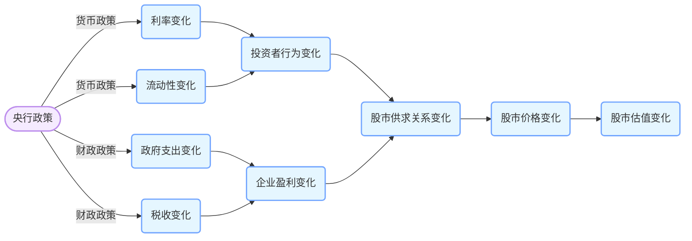

# 央行政策对全球股市估值的影响

> 关键词：央行政策、全球股市估值、货币政策、财政政策、利率、流动性

> 摘要：本文深入探讨了央行政策对全球股市估值的影响。首先介绍了研究的背景、目的、预期读者、文档结构和相关术语。接着阐述了央行政策和股市估值的核心概念及两者之间的联系，并给出了相应的文本示意图和Mermaid流程图。详细分析了核心算法原理，用Python代码进行了说明，同时介绍了相关的数学模型和公式。通过项目实战展示了如何在实际中分析央行政策对股市估值的影响。列举了央行政策影响股市估值的实际应用场景，推荐了学习、开发工具和相关论文著作。最后总结了未来发展趋势与挑战，解答了常见问题并提供了扩展阅读和参考资料，旨在为投资者、研究者和政策制定者提供全面而深入的见解。

## 1. 背景介绍 
### 1.1 目的和范围
央行作为一个国家或地区金融体系的核心机构，其制定和实施的政策对金融市场有着深远的影响。全球股市作为金融市场的重要组成部分，其估值受到多种因素的综合作用，而央行政策是其中极为关键的因素之一。本文的目的在于系统地研究央行政策如何影响全球股市估值，分析其内在机制和影响程度。研究范围涵盖了全球主要经济体的央行政策，包括货币政策和财政政策等方面，以及这些政策对不同地区、不同行业股市估值的影响。

### 1.2 预期读者
本文预期读者包括金融市场投资者，他们可以通过了解央行政策对股市估值的影响，优化投资决策；金融研究人员，为他们的学术研究提供参考和思路；政策制定者，帮助他们更好地评估政策实施的效果和影响，从而制定更加科学合理的政策。

### 1.3 文档结构概述
本文首先介绍相关背景知识，包括目的、读者和文档结构等。接着阐述央行政策和股市估值的核心概念及两者之间的联系。然后详细讲解核心算法原理和具体操作步骤，并给出相关的数学模型和公式。通过项目实战展示如何在实际中分析央行政策对股市估值的影响。列举实际应用场景，推荐学习、开发工具和相关论文著作。最后总结未来发展趋势与挑战，解答常见问题并提供扩展阅读和参考资料。

### 1.4 术语表
#### 1.4.1 核心术语定义
- **央行政策**：指中央银行（如美联储、欧洲央行、中国人民银行等）为实现特定的宏观经济目标而采取的一系列政策措施，主要包括货币政策和财政政策。货币政策是指央行通过调节货币供应量、利率等手段来影响经济活动；财政政策则是指政府通过调整税收、政府支出等方式来影响经济。
- **全球股市估值**：是对全球范围内股票市场整体价值的评估，通常使用市盈率（P/E）、市净率（P/B）等指标来衡量。股市估值反映了市场对上市公司未来盈利的预期和投资者对股票的信心。
- **利率**：是指一定时期内利息与本金的比率，是央行货币政策的重要调控工具之一。利率的高低直接影响着资金的成本和投资回报率，进而影响股市估值。
- **流动性**：指金融市场中资金的充裕程度。当市场流动性充足时，资金更容易流入股市，推动股市上涨；反之，当市场流动性紧张时，股市可能会受到抑制。

#### 1.4.2 相关概念解释
- **货币政策工具**：央行常用的货币政策工具包括公开市场操作、法定准备金率调整、再贴现率调整等。公开市场操作是指央行在金融市场上买卖有价证券，以调节货币供应量和利率；法定准备金率是指商业银行必须按照一定比例将存款存入央行，调整法定准备金率可以影响商业银行的信贷投放能力；再贴现率是指商业银行向央行贴现票据时所支付的利率，调整再贴现率可以影响商业银行的资金成本。
- **财政政策工具**：财政政策工具主要包括税收政策和政府支出政策。税收政策是指政府通过调整税率、税收优惠等方式来影响企业和个人的收入和支出；政府支出政策是指政府通过增加或减少公共投资、社会保障支出等方式来影响经济增长和就业。

#### 1.4.3 缩略词列表
- **P/E**：市盈率（Price-to-Earnings Ratio），是指股票价格与每股收益的比率，反映了市场对公司未来盈利的预期。
- **P/B**：市净率（Price-to-Book Ratio），是指股票价格与每股净资产的比率，反映了市场对公司资产价值的评估。
- **FED**：美联储（Federal Reserve System），是美国的中央银行。
- **ECB**：欧洲央行（European Central Bank），是欧洲货币联盟的中央银行。

## 2. 核心概念与联系 

### 核心概念原理
#### 央行政策原理
央行政策的主要目标是维持宏观经济的稳定增长、控制通货膨胀、促进就业等。货币政策通过调节货币供应量和利率来影响经济活动。当经济增长放缓、通货膨胀率较低时，央行通常会采取宽松的货币政策，如降低利率、增加货币供应量等，以刺激经济增长；当经济过热、通货膨胀率较高时，央行会采取紧缩的货币政策，如提高利率、减少货币供应量等，以抑制经济过热和通货膨胀。

财政政策则通过调整政府支出和税收来影响经济。当经济衰退时，政府可以增加公共投资、减少税收，以刺激消费和投资，促进经济增长；当经济过热时，政府可以减少公共投资、增加税收，以抑制消费和投资，防止经济过热。

#### 股市估值原理
股市估值是基于投资者对上市公司未来盈利的预期和对风险的评估。市盈率（P/E）是最常用的股市估值指标之一，它反映了投资者为获取一元盈利所愿意支付的价格。市净率（P/B）则反映了投资者为获取一元净资产所愿意支付的价格。股市估值受到多种因素的影响，包括公司的盈利能力、行业前景、宏观经济环境等。

### 核心概念联系
央行政策通过多种途径影响股市估值。首先，利率的变化会直接影响资金的成本和投资回报率。当利率下降时，债券等固定收益类资产的吸引力下降，投资者会更倾向于将资金投入股市，从而推动股市上涨，股市估值上升；反之，当利率上升时，股市的吸引力下降，资金会流出股市，导致股市下跌，股市估值下降。

其次，央行的货币政策会影响市场的流动性。宽松的货币政策会增加市场的货币供应量，提高市场的流动性，使得资金更容易流入股市，推动股市上涨；紧缩的货币政策则会减少市场的货币供应量，降低市场的流动性，抑制股市上涨。

财政政策也会对股市估值产生影响。政府增加公共投资可以刺激相关行业的发展，提高上市公司的盈利能力，从而提升股市估值；减少税收可以增加企业和个人的可支配收入，刺激消费和投资，也有利于股市上涨和估值提升。

### 文本示意图
央行政策与全球股市估值的关系可以用以下示意图表示：

央行政策（货币政策、财政政策） -> 利率变化、流动性变化 -> 投资者行为变化（资金流入/流出股市） -> 股市供求关系变化 -> 股市价格变化 -> 股市估值变化

### Mermaid 流程图


## 3. 核心算法原理 & 具体操作步骤 

### 核心算法原理
为了分析央行政策对全球股市估值的影响，我们可以建立一个简单的线性回归模型。假设股市估值（用市盈率 P/E 表示）与央行政策的相关指标（如利率、货币供应量等）之间存在线性关系，可以用以下公式表示：

$P/E = \beta_0 + \beta_1 \times r + \beta_2 \times M + \epsilon$

其中，$P/E$ 是股市市盈率，$r$ 是利率，$M$ 是货币供应量，$\beta_0$ 是截距项，$\beta_1$ 和 $\beta_2$ 是回归系数，$\epsilon$ 是误差项。

### 具体操作步骤
#### 步骤 1：数据收集
收集全球主要经济体的央行政策数据，包括利率、货币供应量等；同时收集全球主要股市的市盈率数据。数据可以从央行官方网站、金融数据提供商（如 Bloomberg、Wind 等）获取。

#### 步骤 2：数据预处理
对收集到的数据进行清洗和预处理，包括去除缺失值、异常值等。可以使用 Python 的 Pandas 库进行数据处理。

#### 步骤 3：模型建立
使用 Python 的 Scikit-learn 库建立线性回归模型，并使用收集到的数据进行训练。

#### 步骤 4：模型评估
使用训练好的模型对测试数据进行预测，并评估模型的性能。可以使用均方误差（MSE）、决定系数（$R^2$）等指标来评估模型的性能。

### Python 源代码实现
```python
import pandas as pd
from sklearn.linear_model import LinearRegression
from sklearn.model_selection import train_test_split
from sklearn.metrics import mean_squared_error, r2_score

# 步骤 1：数据收集（假设数据已经收集并保存为 CSV 文件）
data = pd.read_csv('central_bank_policy_stock_valuation.csv')

# 步骤 2：数据预处理
data = data.dropna()  # 去除缺失值

# 提取特征和目标变量
X = data[['interest_rate', 'money_supply']]
y = data['pe_ratio']

# 划分训练集和测试集
X_train, X_test, y_train, y_test = train_test_split(X, y, test_size=0.2, random_state=42)

# 步骤 3：模型建立
model = LinearRegression()
model.fit(X_train, y_train)

# 步骤 4：模型评估
y_pred = model.predict(X_test)
mse = mean_squared_error(y_test, y_pred)
r2 = r2_score(y_test, y_pred)

print(f"均方误差 (MSE): {mse}")
print(f"决定系数 (R^2): {r2}")
```

## 4. 数学模型和公式 & 详细讲解 & 举例说明 

### 数学模型
我们建立的线性回归模型为：

$P/E = \beta_0 + \beta_1 \times r + \beta_2 \times M + \epsilon$

### 公式详细讲解
- $\beta_0$：截距项，表示当利率 $r$ 和货币供应量 $M$ 都为 0 时的股市市盈率。在实际中，利率和货币供应量不可能为 0，但截距项可以作为模型的一个基准值。
- $\beta_1$：利率的回归系数，表示利率每变化一个单位，股市市盈率的变化量。如果 $\beta_1$ 为负数，说明利率上升会导致股市市盈率下降，即股市估值下降；反之，如果 $\beta_1$ 为正数，说明利率上升会导致股市市盈率上升，这与一般的经济理论不符，可能是由于其他因素的影响。
- $\beta_2$：货币供应量的回归系数，表示货币供应量每变化一个单位，股市市盈率的变化量。如果 $\beta_2$ 为正数，说明货币供应量增加会导致股市市盈率上升，即股市估值上升；反之，如果 $\beta_2$ 为负数，说明货币供应量增加会导致股市市盈率下降。
- $\epsilon$：误差项，表示模型无法解释的随机因素对股市市盈率的影响。误差项应该服从均值为 0 的正态分布。

### 举例说明
假设我们通过数据分析得到以下回归系数：$\beta_0 = 15$，$\beta_1 = -2$，$\beta_2 = 0.5$。当前利率 $r = 3\%$，货币供应量 $M = 100$，则根据模型预测的股市市盈率为：

$P/E = 15 - 2 \times 3 + 0.5 \times 100$

$P/E = 15 - 6 + 50$

$P/E = 59$

这意味着在当前的利率和货币供应量水平下，股市的市盈率预计为 59。如果利率上升到 $4\%$，货币供应量保持不变，则预测的股市市盈率为：

$P/E = 15 - 2 \times 4 + 0.5 \times 100$

$P/E = 15 - 8 + 50$

$P/E = 57$

可以看到，利率上升导致股市市盈率下降，即股市估值下降。

## 5. 项目实战：代码实际案例和详细解释说明 

### 5.1  开发环境搭建
#### 安装 Python
首先需要安装 Python 环境，建议使用 Python 3.7 及以上版本。可以从 Python 官方网站（https://www.python.org/downloads/）下载并安装。

#### 安装必要的库
使用以下命令安装项目所需的库：
```sh
pip install pandas scikit-learn
```

### 5.2  源代码详细实现和代码解读
```python
import pandas as pd
from sklearn.linear_model import LinearRegression
from sklearn.model_selection import train_test_split
from sklearn.metrics import mean_squared_error, r2_score

# 步骤 1：数据收集（假设数据已经收集并保存为 CSV 文件）
data = pd.read_csv('central_bank_policy_stock_valuation.csv')

# 代码解读：使用 Pandas 的 read_csv 函数读取 CSV 文件，并将数据存储在 DataFrame 中。

# 步骤 2：数据预处理
data = data.dropna()  # 去除缺失值

# 代码解读：使用 Pandas 的 dropna 函数去除数据中的缺失值，确保数据的完整性。

# 提取特征和目标变量
X = data[['interest_rate', 'money_supply']]
y = data['pe_ratio']

# 代码解读：从 DataFrame 中提取特征变量（利率和货币供应量）和目标变量（股市市盈率）。

# 划分训练集和测试集
X_train, X_test, y_train, y_test = train_test_split(X, y, test_size=0.2, random_state=42)

# 代码解读：使用 Scikit-learn 的 train_test_split 函数将数据划分为训练集和测试集，测试集占总数据的 20%。

# 步骤 3：模型建立
model = LinearRegression()
model.fit(X_train, y_train)

# 代码解读：创建一个线性回归模型，并使用训练集数据对模型进行训练。

# 步骤 4：模型评估
y_pred = model.predict(X_test)
mse = mean_squared_error(y_test, y_pred)
r2 = r2_score(y_test, y_pred)

# 代码解读：使用训练好的模型对测试集数据进行预测，并计算均方误差（MSE）和决定系数（$R^2$）来评估模型的性能。

print(f"均方误差 (MSE): {mse}")
print(f"决定系数 (R^2): {r2}")
```

### 5.3  代码解读与分析
#### 均方误差（MSE）
均方误差是预测值与真实值之间误差的平方的平均值，反映了模型预测的准确性。MSE 值越小，说明模型的预测效果越好。

#### 决定系数（$R^2$）
决定系数表示模型对数据的拟合程度，取值范围在 0 到 1 之间。$R^2$ 值越接近 1，说明模型对数据的拟合效果越好，即模型能够解释的方差比例越高。

通过分析 MSE 和 $R^2$ 值，可以评估模型的性能，并根据需要对模型进行改进。

## 6. 实际应用场景 
### 投资者决策
投资者可以通过分析央行政策对股市估值的影响，调整自己的投资组合。当央行采取宽松的货币政策时，利率下降，市场流动性增加，股市估值可能上升，投资者可以增加股票投资的比例；反之，当央行采取紧缩的货币政策时，利率上升，市场流动性减少，股市估值可能下降，投资者可以减少股票投资的比例，增加债券等固定收益类资产的投资。

### 金融机构风险管理
金融机构（如银行、证券公司等）需要对股市风险进行管理。通过研究央行政策对股市估值的影响，金融机构可以更好地预测股市的走势，合理调整资产配置，降低风险。例如，当央行政策可能导致股市下跌时，金融机构可以减少对股市的敞口，增加对其他风险较低资产的投资。

### 政策制定者参考
政策制定者可以通过了解央行政策对股市估值的影响，评估政策的实施效果和影响范围。如果政策导致股市估值过高，可能会引发资产泡沫，政策制定者可以考虑调整政策，以避免金融风险；如果政策导致股市估值过低，可能会影响投资者信心和经济增长，政策制定者可以采取相应的措施来刺激股市。

## 7. 工具和资源推荐
### 7.1 学习资源推荐
#### 7.1.1 书籍推荐
- 《货币金融学》（米什金著）：系统介绍了货币、银行和金融市场的基本原理和理论，对于理解央行政策和金融市场运行机制非常有帮助。
- 《聪明的投资者》（格雷厄姆著）：价值投资的经典著作，阐述了投资的基本原则和方法，对于投资者分析股市估值和进行投资决策具有重要的指导意义。
- 《金融市场与金融机构基础》（法博齐著）：全面介绍了金融市场和金融机构的基本知识和运作机制，有助于读者深入了解金融市场的各个方面。

#### 7.1.2 在线课程
- Coursera 上的“金融市场”课程：由耶鲁大学教授罗伯特·席勒主讲，深入探讨了金融市场的运行机制、资产定价等问题。
- edX 上的“货币银行学”课程：介绍了货币、银行和金融市场的基本理论和政策，帮助学员理解央行政策的制定和实施。

#### 7.1.3 技术博客和网站
- 美联储官方网站（https://www.federalreserve.gov/）：提供美联储的政策公告、研究报告等信息，是了解美国央行政策的重要渠道。
- 欧洲央行官方网站（https://www.ecb.europa.eu/）：提供欧洲央行的政策信息和经济研究报告，有助于了解欧洲央行的政策动态。
- 中国人民银行官方网站（https://www.pbc.gov.cn/）：提供中国人民银行的政策公告、统计数据等信息，是了解中国央行政策的权威网站。

### 7.2 开发工具框架推荐
#### 7.2.1 IDE和编辑器
- PyCharm：功能强大的 Python 集成开发环境，提供代码编辑、调试、版本控制等功能，适合开发 Python 项目。
- Jupyter Notebook：交互式的编程环境，支持代码、文本、图表等多种形式的展示，非常适合进行数据分析和模型开发。

#### 7.2.2 调试和性能分析工具
- Py-Spy：用于分析 Python 程序的性能，找出性能瓶颈。
- pdb：Python 自带的调试器，可以帮助开发者调试代码。

#### 7.2.3 相关框架和库
- Pandas：用于数据处理和分析的 Python 库，提供了高效的数据结构和数据操作方法。
- Scikit-learn：用于机器学习的 Python 库，提供了各种机器学习算法和工具，方便进行模型开发和评估。

### 7.3 相关论文著作推荐
#### 7.3.1 经典论文
- "Monetary Policy and Stock Market Volatility"（Bernanke and Kuttner, 2005）：研究了货币政策对股市波动率的影响，发现货币政策的意外变化会导致股市波动率的上升。
- "The Impact of Central Bank Communication on Stock Markets"（Jansen and De Haan, 2009）：分析了央行沟通对股市的影响，指出央行的政策声明和言论会对股市产生重要影响。

#### 7.3.2 最新研究成果
- 可以通过学术数据库（如 SSRN、JSTOR 等）搜索关于央行政策和股市估值的最新研究论文，了解该领域的前沿动态。

#### 7.3.3 应用案例分析
- 一些金融研究机构和咨询公司会发布关于央行政策对股市估值影响的应用案例分析报告，可以通过关注这些机构的网站获取相关信息。

## 8. 总结：未来发展趋势与挑战
### 未来发展趋势
#### 政策多元化
未来央行政策可能会更加多元化，不仅会运用传统的货币政策和财政政策工具，还会探索新的政策手段，如宏观审慎政策、前瞻性指引等。这些政策的实施将对股市估值产生更加复杂和多样化的影响。

#### 全球政策协调
随着全球经济一体化的加深，各国央行之间的政策协调将变得更加重要。全球政策协调的加强可能会减少政策冲突，提高政策的有效性，从而对全球股市估值产生积极影响。

#### 科技金融融合
科技金融的发展将为央行政策和股市估值的研究带来新的机遇和挑战。例如，大数据、人工智能等技术的应用可以提高对央行政策和股市估值的分析和预测能力。

### 挑战
#### 不确定性增加
全球经济和政治环境的不确定性增加，如贸易摩擦、地缘政治冲突等，会使得央行政策的制定和实施更加困难，也会增加股市估值的不确定性。

#### 金融创新带来的挑战
金融创新不断涌现，如数字货币、金融科技等，这些创新可能会改变金融市场的运行机制和央行政策的传导渠道，给央行政策对股市估值的影响带来新的挑战。

#### 模型准确性问题
目前建立的分析模型可能无法完全准确地反映央行政策对股市估值的影响，因为股市估值受到多种因素的综合作用，且这些因素之间存在复杂的相互关系。如何提高模型的准确性和预测能力是未来需要解决的重要问题。

## 9. 附录：常见问题与解答
### 问题 1：央行政策对不同行业股市估值的影响是否相同？
解答：不同行业对央行政策的敏感度不同，因此央行政策对不同行业股市估值的影响也不尽相同。例如，房地产、金融等行业对利率较为敏感，当利率下降时，这些行业的融资成本降低，盈利预期增加，股市估值可能会上升；而一些消费类行业对利率的敏感度相对较低，央行政策对其股市估值的影响可能较小。

### 问题 2：如何判断央行政策的变化趋势？
解答：可以通过关注央行的政策声明、会议纪要、官员讲话等信息来判断央行政策的变化趋势。此外，还可以分析宏观经济数据，如 GDP 增长率、通货膨胀率、就业数据等，这些数据可以反映经济的运行状况，从而帮助判断央行政策的走向。

### 问题 3：除了利率和货币供应量，还有哪些央行政策因素会影响股市估值？
解答：除了利率和货币供应量，央行的公开市场操作、法定准备金率调整、再贴现率调整等货币政策工具，以及政府的税收政策、政府支出政策等财政政策因素都会对股市估值产生影响。此外，央行的前瞻性指引、宏观审慎政策等也会影响投资者的预期和行为，进而影响股市估值。

## 10. 扩展阅读 & 参考资料
### 扩展阅读
- 《资本论》（马克思著）：深入探讨了资本主义经济的运行规律和内在矛盾，对于理解金融市场和央行政策的本质具有重要的启示作用。
- 《金融炼金术》（索罗斯著）：作者以自己的投资经验为基础，阐述了金融市场的反身性原理，对于投资者理解市场的复杂性和不确定性有很大的帮助。

### 参考资料
- 各央行官方网站发布的政策公告、研究报告等。
- 金融数据提供商（如 Bloomberg、Wind 等）提供的金融数据和研究报告。
- 学术数据库（如 SSRN、JSTOR 等）中的相关学术论文。

作者：AI天才研究院/AI Genius Institute & 禅与计算机程序设计艺术 /Zen And The Art of Computer Programming