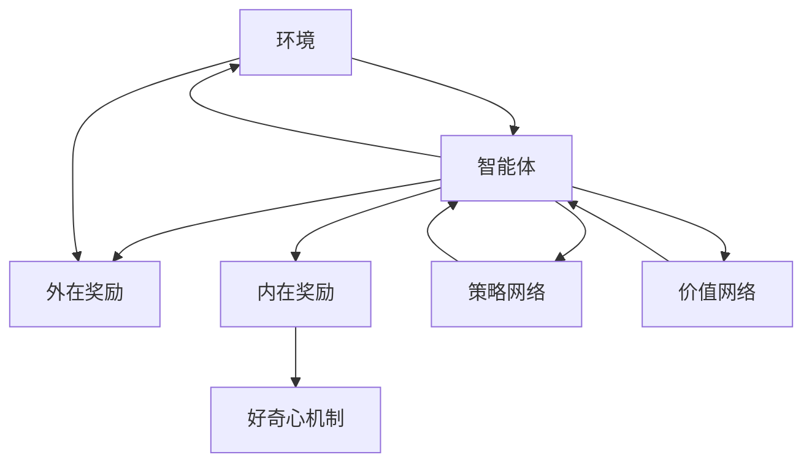

# 好奇心驱动的强化学习在游戏AI中的应用

> 关键词：好奇心驱动的强化学习、游戏AI、探索策略、奖励机制、智能体

> 摘要：本文深入探讨了好奇心驱动的强化学习在游戏AI领域的应用。首先介绍了相关背景知识，包括目的范围、预期读者等内容。接着阐述了核心概念与联系，分析了好奇心驱动强化学习的原理和架构。详细讲解了核心算法原理，通过Python代码进行示例。给出了相关的数学模型和公式，并举例说明。通过项目实战展示了代码实现和详细解释。探讨了实际应用场景，推荐了学习工具和资源。最后总结了未来发展趋势与挑战，还提供了常见问题解答和扩展阅读参考资料，旨在为相关领域的研究者和开发者提供全面且深入的技术指导。

## 1. 背景介绍 
### 1.1 目的和范围
在游戏AI的发展历程中，传统的强化学习方法往往在处理复杂环境时面临诸多挑战，例如智能体容易陷入局部最优解，缺乏对环境的有效探索等问题。好奇心驱动的强化学习作为一种新兴的技术，为解决这些问题提供了新的思路。本文的目的在于深入研究好奇心驱动的强化学习在游戏AI中的应用，详细探讨其原理、算法和实际应用案例。范围涵盖了从理论基础到实际项目开发的各个方面，旨在为相关领域的研究者和开发者提供全面的技术指导。

### 1.2 预期读者
本文预期读者包括对游戏AI和强化学习感兴趣的科研人员、高校学生、游戏开发者以及相关领域的技术爱好者。无论是初学者希望了解该领域的基础知识，还是有一定经验的开发者寻求技术突破，都能从本文中获取有价值的信息。

### 1.3 文档结构概述
本文按照以下结构进行组织：首先介绍背景知识，为读者建立基础认知；接着阐述核心概念与联系，帮助读者理解好奇心驱动的强化学习的本质；然后详细讲解核心算法原理和具体操作步骤，通过Python代码进行示例；给出相关的数学模型和公式，并举例说明；通过项目实战展示代码实现和详细解释；探讨实际应用场景；推荐学习工具和资源；最后总结未来发展趋势与挑战，提供常见问题解答和扩展阅读参考资料。

### 1.4 术语表
#### 1.4.1 核心术语定义
- **好奇心驱动的强化学习**：一种强化学习方法，通过引入好奇心机制，鼓励智能体主动探索未知环境，以获取更多的信息和奖励。
- **游戏AI**：应用于游戏中的人工智能技术，使游戏中的角色或系统具有智能决策和行为能力。
- **智能体**：在强化学习中，智能体是一个能够感知环境状态、执行动作并从环境中获取奖励的实体。
- **奖励机制**：强化学习中用于评估智能体行为好坏的规则，智能体的目标是最大化累积奖励。
- **探索策略**：智能体在环境中进行探索的方法，旨在发现更多的状态和动作，以提高学习效果。

#### 1.4.2 相关概念解释
- **强化学习**：一种机器学习范式，智能体通过与环境进行交互，根据环境反馈的奖励信号来学习最优的行为策略。
- **内在奖励**：好奇心驱动的强化学习中，除了环境提供的外在奖励外，智能体自身根据对环境的探索程度生成的奖励。
- **特征表示**：将环境状态转换为适合智能体处理的向量或矩阵形式，以便智能体进行学习和决策。

#### 1.4.3 缩略词列表
- **RL**：Reinforcement Learning，强化学习
- **AI**：Artificial Intelligence，人工智能
- **ICM**：Intrinsic Curiosity Module，内在好奇心模块

## 2. 核心概念与联系 
好奇心驱动的强化学习的核心思想是在传统强化学习的基础上，引入好奇心机制，鼓励智能体主动探索未知环境。传统的强化学习主要依赖于环境提供的外在奖励来学习最优策略，这在复杂环境中容易导致智能体陷入局部最优解，因为智能体可能只关注已知的高奖励区域，而忽略了其他可能存在更优解的区域。

好奇心驱动的强化学习通过引入内在奖励来解决这个问题。内在奖励是智能体根据自身对环境的探索程度生成的奖励，与环境提供的外在奖励无关。例如，当智能体访问一个新的状态或执行一个新的动作时，它会获得一个内在奖励，从而鼓励智能体继续探索未知环境。

### 核心概念原理和架构的文本示意图
```plaintext
智能体 <----> 环境
|             |
| 外在奖励    | 外在奖励
|             |
| 内在奖励    | 
| (好奇心机制) |
|             |
| 策略网络    |
|             |
| 价值网络    |
```
智能体与环境进行交互，从环境中获取状态信息，并执行动作。环境会根据智能体的动作返回外在奖励。同时，智能体内部的好奇心机制会根据智能体的探索程度生成内在奖励。智能体通过策略网络和价值网络来学习最优的行为策略，以最大化累积的外在奖励和内在奖励之和。

### Mermaid 流程图

在这个流程图中，环境和智能体之间进行交互。智能体从环境中获取状态信息并执行动作，环境返回外在奖励。智能体内部的好奇心机制生成内在奖励。策略网络和价值网络用于智能体的学习和决策，它们的输出会影响智能体的动作选择。

## 3. 核心算法原理 & 具体操作步骤 
### 内在好奇心模块（ICM）算法原理
内在好奇心模块（ICM）是一种常用的好奇心驱动的强化学习算法。其核心思想是通过预测智能体执行动作后的下一个状态，来衡量智能体对环境的探索程度。如果预测误差较大，说明智能体访问了一个新的状态或执行了一个新的动作，此时智能体可以获得一个内在奖励。

ICM算法主要由两部分组成：预测模型和特征提取器。预测模型用于预测智能体执行动作后的下一个状态，特征提取器用于将环境状态转换为适合预测模型处理的特征表示。

### Python源代码实现
```python
import torch
import torch.nn as nn
import torch.optim as optim

# 定义特征提取器
class FeatureExtractor(nn.Module):
    def __init__(self, input_dim, feature_dim):
        super(FeatureExtractor, self).__init__()
        self.fc1 = nn.Linear(input_dim, 128)
        self.fc2 = nn.Linear(128, feature_dim)

    def forward(self, x):
        x = torch.relu(self.fc1(x))
        x = torch.relu(self.fc2(x))
        return x

# 定义预测模型
class Predictor(nn.Module):
    def __init__(self, feature_dim, action_dim):
        super(Predictor, self).__init__()
        self.fc1 = nn.Linear(feature_dim + action_dim, 128)
        self.fc2 = nn.Linear(128, feature_dim)

    def forward(self, features, actions):
        x = torch.cat([features, actions], dim=1)
        x = torch.relu(self.fc1(x))
        x = self.fc2(x)
        return x

# 定义ICM类
class ICM:
    def __init__(self, input_dim, feature_dim, action_dim, learning_rate):
        self.feature_extractor = FeatureExtractor(input_dim, feature_dim)
        self.predictor = Predictor(feature_dim, action_dim)
        self.optimizer = optim.Adam(list(self.feature_extractor.parameters()) + list(self.predictor.parameters()), lr=learning_rate)

    def compute_intrinsic_reward(self, state, next_state, action):
        features = self.feature_extractor(state)
        next_features = self.feature_extractor(next_state)
        predicted_next_features = self.predictor(features, action)
        # 计算预测误差
        prediction_error = torch.mean((predicted_next_features - next_features) ** 2, dim=1)
        intrinsic_reward = prediction_error.detach()
        return intrinsic_reward

    def update(self, state, next_state, action):
        features = self.feature_extractor(state)
        next_features = self.feature_extractor(next_state)
        predicted_next_features = self.predictor(features, action)
        # 计算预测误差损失
        loss = torch.mean((predicted_next_features - next_features) ** 2)
        self.optimizer.zero_grad()
        loss.backward()
        self.optimizer.step()
        return loss.item()
```
### 具体操作步骤
1. **初始化**：初始化特征提取器、预测模型和优化器。
2. **交互过程**：智能体与环境进行交互，获取当前状态 `state`、下一个状态 `next_state` 和执行的动作 `action`。
3. **计算内在奖励**：调用 `compute_intrinsic_reward` 方法，计算智能体的内在奖励。
4. **更新模型**：调用 `update` 方法，根据预测误差更新特征提取器和预测模型的参数。

## 4. 数学模型和公式 & 详细讲解 & 举例说明 
### 内在奖励计算
在ICM算法中，内在奖励 $r_{int}$ 是通过预测误差来计算的。设 $s_t$ 为当前状态，$s_{t+1}$ 为下一个状态，$a_t$ 为执行的动作。特征提取器将状态转换为特征表示 $\phi(s)$，预测模型根据当前特征 $\phi(s_t)$ 和动作 $a_t$ 预测下一个特征 $\hat{\phi}(s_{t+1})$。

内在奖励计算公式为：
$$r_{int} = \frac{1}{2} \left\lVert \hat{\phi}(s_{t+1}) - \phi(s_{t+1}) \right\rVert_2^2$$
其中，$\left\lVert \cdot \right\rVert_2$ 表示欧几里得范数。

### 详细讲解
内在奖励的计算基于预测误差的思想。如果预测误差较大，说明智能体访问了一个新的状态或执行了一个新的动作，此时智能体可以获得一个较高的内在奖励，从而鼓励智能体继续探索未知环境。

### 举例说明
假设特征表示的维度为2，当前特征 $\phi(s_t) = [0.1, 0.2]$，动作 $a_t = [0.3]$，预测的下一个特征 $\hat{\phi}(s_{t+1}) = [0.4, 0.5]$，实际的下一个特征 $\phi(s_{t+1}) = [0.6, 0.7]$。

首先计算预测误差：
$$\hat{\phi}(s_{t+1}) - \phi(s_{t+1}) = [0.4 - 0.6, 0.5 - 0.7] = [-0.2, -0.2]$$
然后计算欧几里得范数的平方：
$$\left\lVert \hat{\phi}(s_{t+1}) - \phi(s_{t+1}) \right\rVert_2^2 = (-0.2)^2 + (-0.2)^2 = 0.04 + 0.04 = 0.08$$
最后计算内在奖励：
$$r_{int} = \frac{1}{2} \times 0.08 = 0.04$$

## 5. 项目实战：代码实际案例和详细解释说明 
### 5.1  开发环境搭建
本项目使用Python 3.8作为开发语言，需要安装以下库：
- `torch`：用于深度学习模型的构建和训练。
- `gym`：OpenAI开发的用于强化学习的环境库。

可以使用以下命令进行安装：
```bash
pip install torch gym
```

### 5.2  源代码详细实现和代码解读
```python
import gym
import torch
import torch.nn as nn
import torch.optim as optim
import numpy as np

# 定义策略网络
class PolicyNetwork(nn.Module):
    def __init__(self, input_dim, action_dim):
        super(PolicyNetwork, self).__init__()
        self.fc1 = nn.Linear(input_dim, 128)
        self.fc2 = nn.Linear(128, action_dim)

    def forward(self, x):
        x = torch.relu(self.fc1(x))
        x = torch.softmax(self.fc2(x), dim=1)
        return x

# 定义价值网络
class ValueNetwork(nn.Module):
    def __init__(self, input_dim):
        super(ValueNetwork, self).__init__()
        self.fc1 = nn.Linear(input_dim, 128)
        self.fc2 = nn.Linear(128, 1)

    def forward(self, x):
        x = torch.relu(self.fc1(x))
        x = self.fc2(x)
        return x

# 定义训练函数
def train(env, policy_network, value_network, icm, num_episodes, gamma=0.99, alpha=0.001, beta=0.2):
    optimizer_policy = optim.Adam(policy_network.parameters(), lr=alpha)
    optimizer_value = optim.Adam(value_network.parameters(), lr=alpha)

    for episode in range(num_episodes):
        state = env.reset()
        state = torch.FloatTensor(state).unsqueeze(0)
        total_reward = 0
        done = False

        while not done:
            # 选择动作
            probs = policy_network(state)
            action_dist = torch.distributions.Categorical(probs)
            action = action_dist.sample()
            action_onehot = torch.zeros(env.action_space.n).unsqueeze(0)
            action_onehot[0, action.item()] = 1

            # 执行动作
            next_state, extrinsic_reward, done, _ = env.step(action.item())
            next_state = torch.FloatTensor(next_state).unsqueeze(0)

            # 计算内在奖励
            intrinsic_reward = icm.compute_intrinsic_reward(state, next_state, action_onehot)
            total_reward += extrinsic_reward + beta * intrinsic_reward.item()

            # 计算优势函数
            value = value_network(state)
            next_value = value_network(next_state) if not done else torch.tensor([[0.0]])
            advantage = (extrinsic_reward + beta * intrinsic_reward + gamma * next_value - value).detach()

            # 更新策略网络
            log_prob = action_dist.log_prob(action)
            policy_loss = -(log_prob * advantage).mean()
            optimizer_policy.zero_grad()
            policy_loss.backward()
            optimizer_policy.step()

            # 更新价值网络
            value_loss = (advantage ** 2).mean()
            optimizer_value.zero_grad()
            value_loss.backward()
            optimizer_value.step()

            # 更新ICM模型
            icm_loss = icm.update(state, next_state, action_onehot)

            state = next_state

        print(f"Episode {episode + 1}: Total Reward = {total_reward}")

# 主函数
if __name__ == "__main__":
    env = gym.make('CartPole-v1')
    input_dim = env.observation_space.shape[0]
    action_dim = env.action_space.n
    feature_dim = 32
    learning_rate = 0.001

    policy_network = PolicyNetwork(input_dim, action_dim)
    value_network = ValueNetwork(input_dim)
    icm = ICM(input_dim, feature_dim, action_dim, learning_rate)

    num_episodes = 1000
    train(env, policy_network, value_network, icm, num_episodes)

    env.close()
```
### 代码解读与分析
1. **策略网络和价值网络**：策略网络用于生成动作的概率分布，智能体根据概率分布选择动作。价值网络用于估计当前状态的价值。
2. **训练函数**：在每个回合中，智能体与环境进行交互，选择动作并执行。计算外在奖励和内在奖励之和作为总奖励。使用优势函数更新策略网络和价值网络的参数。同时，更新ICM模型的参数。
3. **主函数**：初始化环境、策略网络、价值网络和ICM模型。调用训练函数进行训练。

## 6. 实际应用场景 
### 游戏开发
在游戏开发中，好奇心驱动的强化学习可以用于开发更加智能的游戏AI。例如，在角色扮演游戏中，AI角色可以通过好奇心机制主动探索游戏世界，发现隐藏的任务和道具，提高游戏的趣味性和挑战性。

### 机器人导航
在机器人导航领域，好奇心驱动的强化学习可以帮助机器人更好地探索未知环境。机器人可以根据内在奖励主动探索新的区域，避免陷入局部最优解，从而更快地找到目标位置。

### 自动驾驶
在自动驾驶中，好奇心驱动的强化学习可以用于训练自动驾驶车辆的决策模型。车辆可以通过探索不同的驾驶策略，学习到更加安全和高效的驾驶方式。

## 7. 工具和资源推荐
### 7.1 学习资源推荐
#### 7.1.1 书籍推荐
- 《Reinforcement Learning: An Introduction》：强化学习领域的经典教材，全面介绍了强化学习的基本概念、算法和应用。
- 《Deep Reinforcement Learning Hands-On》：详细介绍了深度强化学习的原理和实践，包括好奇心驱动的强化学习等前沿技术。

#### 7.1.2 在线课程
- Coursera上的《Reinforcement Learning Specialization》：由知名学者授课，系统地介绍了强化学习的理论和实践。
- Udemy上的《Deep Reinforcement Learning A-Z: Hands-On Artificial Intelligence》：通过实际案例讲解深度强化学习的应用。

#### 7.1.3 技术博客和网站
- OpenAI博客：提供了最新的强化学习研究成果和应用案例。
- Medium上的强化学习相关文章：有很多优秀的技术博客，分享了强化学习的实践经验和技巧。

### 7.2 开发工具框架推荐
#### 7.2.1 IDE和编辑器
- PyCharm：功能强大的Python集成开发环境，支持代码调试、版本控制等功能。
- Jupyter Notebook：交互式的开发环境，适合进行数据探索和模型实验。

#### 7.2.2 调试和性能分析工具
- TensorBoard：用于可视化深度学习模型的训练过程和性能指标。
- Pytorch Profiler：可以帮助开发者分析代码的性能瓶颈，优化代码效率。

#### 7.2.3 相关框架和库
- PyTorch：深度学习框架，提供了丰富的神经网络模块和优化算法。
- Gym：OpenAI开发的强化学习环境库，包含了多种经典的强化学习环境。

### 7.3 相关论文著作推荐
#### 7.3.1 经典论文
- 《Curiosity-driven Exploration by Self-supervised Prediction》：提出了内在好奇心模块（ICM）算法，是好奇心驱动的强化学习领域的经典论文。
- 《Deep Reinforcement Learning with Double Q-learning》：介绍了Double Q-learning算法，提高了强化学习的稳定性。

#### 7.3.2 最新研究成果
- 关注NeurIPS、ICML等顶级机器学习会议的相关论文，了解最新的研究进展。
- 一些知名学术期刊，如Journal of Artificial Intelligence Research（JAIR）、Artificial Intelligence等，也会发表相关的研究成果。

#### 7.3.3 应用案例分析
- 可以参考一些开源项目和技术博客，了解好奇心驱动的强化学习在实际项目中的应用案例和经验分享。

## 8. 总结：未来发展趋势与挑战
### 未来发展趋势
- **多智能体协作**：将好奇心驱动的强化学习应用于多智能体系统中，实现智能体之间的协作和竞争，提高系统的整体性能。
- **结合其他技术**：与计算机视觉、自然语言处理等技术相结合，使游戏AI具有更加丰富的感知和交互能力。
- **可解释性研究**：提高好奇心驱动的强化学习模型的可解释性，使开发者能够更好地理解模型的决策过程。

### 挑战
- **计算资源需求**：好奇心驱动的强化学习通常需要大量的计算资源来训练模型，如何降低计算成本是一个挑战。
- **奖励设计**：设计合理的内在奖励机制是一个难题，不当的奖励设计可能会导致智能体的行为出现偏差。
- **环境适应性**：在不同的环境中，好奇心驱动的强化学习模型的性能可能会受到影响，如何提高模型的环境适应性是一个需要解决的问题。

## 9. 附录：常见问题与解答
### 问题1：好奇心驱动的强化学习与传统强化学习有什么区别？
答：传统强化学习主要依赖于环境提供的外在奖励来学习最优策略，而好奇心驱动的强化学习引入了内在奖励机制，鼓励智能体主动探索未知环境，以获取更多的信息和奖励。

### 问题2：内在奖励的计算方法有哪些？
答：常见的内在奖励计算方法包括基于预测误差的方法（如ICM算法）、基于信息增益的方法等。

### 问题3：好奇心驱动的强化学习在实际应用中需要注意什么？
答：需要注意奖励设计的合理性，避免智能体出现不合理的行为。同时，要考虑计算资源的需求，选择合适的算法和模型。

## 10. 扩展阅读 & 参考资料
- Sutton, R. S., & Barto, A. G. (2018). Reinforcement Learning: An Introduction. MIT press.
- OpenAI. (2023). OpenAI Gym Documentation. https://gym.openai.com/docs/
- Pathak, D., Agrawal, P., Efros, A. A., & Darrell, T. (2017). Curiosity-driven Exploration by Self-supervised Prediction. arXiv preprint arXiv:1705.05363.

作者：AI天才研究院/AI Genius Institute & 禅与计算机程序设计艺术 /Zen And The Art of Computer Programming