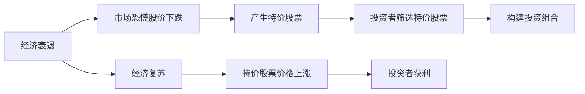

# 如何利用特价股票投资应对经济衰退风险

> 关键词：特价股票投资、经济衰退风险、价值投资、股票筛选、投资组合

> 摘要：本文旨在探讨如何通过特价股票投资来有效应对经济衰退风险。首先介绍了背景信息，包括目的范围、预期读者等。接着阐述了核心概念，如特价股票和经济衰退的定义及联系。详细讲解了核心算法原理和具体操作步骤，涉及使用Python进行股票筛选。给出了相关数学模型和公式并举例说明。通过项目实战展示了开发环境搭建、源代码实现及解读。分析了实际应用场景，推荐了学习资源、开发工具和相关论文著作。最后总结了未来发展趋势与挑战，提供常见问题解答和扩展阅读参考资料，帮助投资者在经济衰退时期合理利用特价股票进行投资。

## 1. 背景介绍 
### 1.1 目的和范围
本文章的主要目的是为投资者提供一种应对经济衰退风险的投资策略，即利用特价股票进行投资。我们将详细探讨特价股票的筛选方法、投资组合的构建以及如何在经济衰退的大环境下实现资产的保值增值。范围涵盖了从理论概念的介绍到实际操作的指南，包括核心算法原理、数学模型、项目实战案例等多个方面，力求为投资者提供全面且实用的信息。

### 1.2 预期读者
本文预期读者主要包括对股票投资感兴趣的个人投资者，无论是初涉投资领域的新手，还是有一定投资经验但希望在经济衰退时期优化投资策略的投资者。同时，金融从业者、投资顾问以及对宏观经济和投资市场有研究需求的学者也可以从本文中获取有价值的信息。

### 1.3 文档结构概述
本文将按照以下结构展开：首先介绍核心概念与联系，明确特价股票和经济衰退的定义及相互关系；接着讲解核心算法原理和具体操作步骤，通过Python代码展示如何筛选特价股票；然后给出相关数学模型和公式，并进行详细讲解和举例说明；随后进行项目实战，包括开发环境搭建、源代码实现和代码解读；分析实际应用场景，探讨特价股票投资在不同经济衰退情况下的应用；推荐学习资源、开发工具和相关论文著作；最后总结未来发展趋势与挑战，提供常见问题解答和扩展阅读参考资料。

### 1.4 术语表
#### 1.4.1 核心术语定义
- **特价股票**：指那些市场价格低于其内在价值的股票。这些股票可能由于市场短期波动、行业负面消息或公司暂时的经营困境等原因而被低估。
- **经济衰退**：通常定义为国内生产总值（GDP）连续两个或两个以上季度出现负增长，同时伴随着失业率上升、企业盈利下降、消费者信心降低等经济现象。
- **内在价值**：是指股票所代表的公司的真实价值，它基于公司的资产、盈利、现金流等基本面因素进行评估。
- **投资组合**：是由多种不同的资产（如股票、债券、基金等）组成的集合，旨在通过分散投资降低风险并实现预期的投资回报。

#### 1.4.2 相关概念解释
- **价值投资**：是一种投资策略，强调通过分析公司的基本面来寻找被低估的股票，并长期持有这些股票，直到市场价格反映其内在价值。
- **市盈率（P/E）**：是指股票价格与每股盈利的比率，用于衡量股票的估值水平。较低的市盈率可能表示股票被低估。
- **市净率（P/B）**：是指股票价格与每股净资产的比率，反映了股票价格相对于公司净资产的倍数。较低的市净率可能意味着股票具有较高的投资价值。

#### 1.4.3 缩略词列表
- **GDP**：国内生产总值（Gross Domestic Product）
- **P/E**：市盈率（Price-to-Earnings Ratio）
- **P/B**：市净率（Price-to-Book Ratio）

## 2. 核心概念与联系 
### 核心概念原理
#### 特价股票
特价股票的核心原理基于市场的非有效性。在市场中，由于投资者情绪、信息不对称等因素，股票价格可能会偏离其内在价值。当股票价格低于内在价值时，就形成了特价股票。投资者通过深入分析公司的基本面，如财务报表、行业前景、竞争优势等，可以发现这些被低估的股票。一旦市场逐渐认识到公司的真实价值，股票价格就有可能回归到其内在价值水平，从而为投资者带来收益。

#### 经济衰退
经济衰退是宏观经济周期中的一个阶段，其特征是经济活动的普遍收缩。在经济衰退期间，消费者和企业的支出减少，导致企业盈利下降，失业率上升。股票市场通常也会受到负面影响，股价普遍下跌。然而，不同行业和公司在经济衰退中的表现可能存在差异。一些具有稳定现金流、强大品牌和抗周期能力的公司，其股票价格可能相对抗跌，甚至可能被低估成为特价股票。

#### 两者联系
在经济衰退时期，市场的恐慌情绪和不确定性增加，投资者往往会过度抛售股票，导致许多股票价格大幅下跌。这就为投资者提供了寻找特价股票的机会。通过投资特价股票，投资者可以在经济衰退期间以较低的价格买入优质资产，当经济复苏时，这些股票的价格可能会大幅上涨，从而实现资产的增值。同时，投资特价股票也可以在一定程度上分散投资组合的风险，因为这些股票的价格波动可能与市场整体波动不完全相关。

### 架构的文本示意图
```plaintext
经济衰退
|
|-- 市场恐慌，股价下跌
|
|-- 产生特价股票
|
|-- 投资者筛选特价股票
|
|-- 构建投资组合
|
|-- 经济复苏
|
|-- 特价股票价格上涨
|
|-- 投资者获利
```

### Mermaid 流程图


## 3. 核心算法原理 & 具体操作步骤 
### 核心算法原理
我们的核心算法是基于价值投资的理念，通过筛选具有低估值特征的股票来寻找特价股票。主要使用的指标包括市盈率（P/E）、市净率（P/B）和股息率（Dividend Yield）。具体原理如下：
- **市盈率（P/E）**：较低的市盈率表示股票价格相对每股盈利较低，可能意味着股票被低估。我们可以设定一个市盈率的阈值，筛选出市盈率低于该阈值的股票。
- **市净率（P/B）**：市净率反映了股票价格相对于公司净资产的倍数。较低的市净率可能表示股票具有较高的投资价值。同样，我们可以设定一个市净率的阈值，筛选出市净率低于该阈值的股票。
- **股息率（Dividend Yield）**：股息率是指公司股息与股票价格的比率。较高的股息率表示公司向股东分配的利润较多，同时也反映了股票的投资价值。我们可以筛选出股息率高于一定阈值的股票。

### 具体操作步骤
#### 步骤 1：数据获取
我们需要获取股票的基本信息，包括股票代码、名称、市盈率、市净率和股息率等。可以使用金融数据接口，如Tushare、Yahoo Finance等。以下是使用Tushare获取股票数据的Python代码示例：
```python
import tushare as ts

# 设置Tushare的token
ts.set_token('your_token')
pro = ts.pro_api()

# 获取所有股票的基本信息
data = pro.stock_basic(exchange='', list_status='L', fields='ts_code,symbol,name,pe_ttm,pb,dividend_yield')
```

#### 步骤 2：数据筛选
根据设定的市盈率、市净率和股息率阈值，筛选出符合条件的特价股票。以下是筛选代码示例：
```python
# 设定阈值
pe_threshold = 10
pb_threshold = 1.5
dividend_yield_threshold = 0.03

# 筛选符合条件的股票
selected_stocks = data[(data['pe_ttm'] < pe_threshold) & (data['pb'] < pb_threshold) & (data['dividend_yield'] > dividend_yield_threshold)]
```

#### 步骤 3：结果输出
将筛选出的特价股票信息保存到文件或打印出来。以下是输出代码示例：
```python
# 输出筛选结果
print(selected_stocks)

# 保存结果到CSV文件
selected_stocks.to_csv('selected_stocks.csv', index=False)
```

## 4. 数学模型和公式 & 详细讲解 & 举例说明 
### 数学模型和公式
#### 市盈率（P/E）
市盈率的计算公式为：
$$P/E = \frac{股票价格}{每股盈利}$$
其中，股票价格是指当前股票的市场价格，每股盈利是指公司每股的净利润。市盈率反映了投资者为获取公司每一元盈利所愿意支付的价格。较低的市盈率可能表示股票被低估，但也可能反映了公司的盈利前景不佳。

#### 市净率（P/B）
市净率的计算公式为：
$$P/B = \frac{股票价格}{每股净资产}$$
每股净资产是指公司的净资产除以总股本。市净率反映了股票价格相对于公司净资产的倍数。较低的市净率可能表示股票具有较高的投资价值，但也需要考虑公司的资产质量和盈利能力。

#### 股息率（Dividend Yield）
股息率的计算公式为：
$$Dividend Yield = \frac{每股股息}{股票价格}$$
每股股息是指公司向股东每股分配的股息金额。股息率反映了公司向股东分配利润的比例，较高的股息率表示公司具有较好的现金流和盈利能力。

### 详细讲解
- **市盈率（P/E）**：市盈率是衡量股票估值的常用指标之一。一般来说，不同行业的市盈率水平可能存在较大差异。例如，科技行业的市盈率通常较高，因为投资者对科技公司的未来增长预期较高；而传统制造业的市盈率可能较低。在筛选特价股票时，我们可以将目标股票的市盈率与同行业平均市盈率进行比较，如果目标股票的市盈率明显低于同行业平均水平，则可能表示该股票被低估。
- **市净率（P/B）**：市净率可以帮助我们评估股票的账面价值与市场价格之间的关系。当市净率小于1时，意味着股票价格低于公司的净资产，理论上具有一定的安全边际。但需要注意的是，市净率并不能完全反映公司的真实价值，因为公司的资产质量和盈利能力也非常重要。
- **股息率（Dividend Yield）**：股息率是衡量股票投资收益的重要指标之一。对于追求稳定收益的投资者来说，较高的股息率具有吸引力。同时，股息率也可以反映公司的财务状况和盈利能力。如果公司能够持续稳定地支付股息，说明公司具有较好的现金流和盈利能力。

### 举例说明
假设某股票的市场价格为10元，每股盈利为1元，每股净资产为5元，每股股息为0.3元。则该股票的市盈率、市净率和股息率分别为：
- 市盈率（P/E）：$P/E = \frac{10}{1} = 10$
- 市净率（P/B）：$P/B = \frac{10}{5} = 2$
- 股息率（Dividend Yield）：$Dividend Yield = \frac{0.3}{10} = 0.03 = 3\%$

如果我们设定的市盈率阈值为15，市净率阈值为2.5，股息率阈值为2%，则该股票符合我们的筛选条件，可以作为潜在的特价股票进行进一步分析。

## 5. 项目实战：代码实际案例和详细解释说明 
### 5.1  开发环境搭建
#### 安装Python
首先需要安装Python环境，建议使用Python 3.7及以上版本。可以从Python官方网站（https://www.python.org/downloads/）下载并安装适合自己操作系统的Python版本。

#### 安装必要的库
我们需要安装一些必要的Python库，包括Tushare、Pandas等。可以使用以下命令进行安装：
```bash
pip install tushare pandas
```

#### 注册Tushare账号并获取token
访问Tushare官方网站（https://tushare.pro/），注册账号并登录。在个人中心页面获取自己的token，该token用于调用Tushare的API接口。

### 5.2  源代码详细实现和代码解读
```python
import tushare as ts
import pandas as pd

# 设置Tushare的token
ts.set_token('your_token')
pro = ts.pro_api()

# 获取所有股票的基本信息
data = pro.stock_basic(exchange='', list_status='L', fields='ts_code,symbol,name,pe_ttm,pb,dividend_yield')

# 设定阈值
pe_threshold = 10
pb_threshold = 1.5
dividend_yield_threshold = 0.03

# 筛选符合条件的股票
selected_stocks = data[(data['pe_ttm'] < pe_threshold) & (data['pb'] < pb_threshold) & (data['dividend_yield'] > dividend_yield_threshold)]

# 输出筛选结果
print(selected_stocks)

# 保存结果到CSV文件
selected_stocks.to_csv('selected_stocks.csv', index=False)
```
#### 代码解读
1. **导入必要的库**：导入Tushare和Pandas库，Tushare用于获取股票数据，Pandas用于数据处理和分析。
2. **设置Tushare的token**：使用`ts.set_token()`方法设置自己的Tushare token，并创建API对象`pro`。
3. **获取股票数据**：使用`pro.stock_basic()`方法获取所有上市股票的基本信息，包括股票代码、名称、市盈率、市净率和股息率等。
4. **设定阈值**：设定市盈率、市净率和股息率的阈值，用于筛选特价股票。
5. **筛选符合条件的股票**：使用Pandas的条件筛选功能，筛选出市盈率低于阈值、市净率低于阈值且股息率高于阈值的股票。
6. **输出筛选结果**：将筛选出的特价股票信息打印出来，并保存到CSV文件中。

### 5.3  代码解读与分析
通过上述代码，我们可以快速筛选出具有低估值特征的特价股票。需要注意的是，筛选出的股票只是潜在的投资标的，还需要进一步进行基本面分析和风险评估。同时，股票市场是复杂多变的，历史数据和指标并不能完全预测未来的股价走势。因此，在实际投资中，需要结合自己的投资目标、风险承受能力和市场情况进行综合考虑。

## 6. 实际应用场景 
### 经济衰退初期
在经济衰退初期，市场开始出现恐慌情绪，股价普遍下跌。此时，投资者可以利用我们介绍的方法筛选出特价股票，逐步建仓。由于经济衰退的影响可能还未完全显现，一些具有稳定现金流和抗周期能力的公司股票可能被低估。例如，公用事业、消费必需品等行业的公司，在经济衰退期间，人们对这些行业的产品和服务的需求相对稳定，因此这些公司的盈利也相对稳定。投资者可以关注这些行业中市盈率、市净率较低且股息率较高的股票。

### 经济衰退中期
在经济衰退中期，经济数据进一步恶化，企业盈利下降，失业率上升。此时，市场的恐慌情绪达到顶峰，股价可能继续下跌。投资者可以继续寻找特价股票，但需要更加谨慎。可以增加对公司财务状况的分析，如资产负债表、现金流量表等，确保公司具有足够的偿债能力和现金流来应对经济衰退。同时，可以适当分散投资组合，降低单一股票的风险。

### 经济衰退后期
在经济衰退后期，经济开始出现复苏的迹象，市场信心逐渐恢复。此时，之前筛选出的特价股票可能开始上涨。投资者可以根据自己的投资目标和风险承受能力，决定是否继续持有这些股票或逐步减仓。如果经济复苏的趋势明显，可以适当增加对周期性行业的投资，如金融、房地产等，这些行业在经济复苏期间通常表现较好。

## 7. 工具和资源推荐
### 7.1 学习资源推荐
#### 7.1.1 书籍推荐
- 《聪明的投资者》（The Intelligent Investor）：作者是本杰明·格雷厄姆（Benjamin Graham），被誉为价值投资的圣经。本书详细介绍了价值投资的理念和方法，对投资者具有重要的指导意义。
- 《证券分析》（Security Analysis）：同样是本杰明·格雷厄姆的经典著作，深入阐述了股票和债券的分析方法，是投资者必读的书籍之一。
- 《巴菲特致股东的信》（Letters to Shareholders of Berkshire Hathaway）：作者是沃伦·巴菲特（Warren Buffett），通过阅读巴菲特致股东的信，投资者可以了解到他的投资哲学和策略。

#### 7.1.2 在线课程
- Coursera上的“投资学原理”（Principles of Investment）课程：由知名教授授课，系统介绍了投资学的基本原理和方法。
- edX上的“金融市场”（Financial Markets）课程：提供了金融市场的全面知识，包括股票、债券、期货等市场的分析和投资策略。

#### 7.1.3 技术博客和网站
- 雪球（https://xueqiu.com/）：国内知名的投资社区，提供股票行情、财经新闻、投资分析等内容，投资者可以在这里交流投资经验和分享观点。
- Seeking Alpha（https://seekingalpha.com/）：国外知名的投资研究网站，提供大量的股票分析报告和投资建议。

### 7.2 开发工具框架推荐
#### 7.2.1 IDE和编辑器
- PyCharm：是一款专业的Python集成开发环境，具有代码编辑、调试、代码分析等功能，适合Python开发者使用。
- Jupyter Notebook：是一个交互式的开发环境，支持Python、R等多种编程语言，适合数据处理和分析。

#### 7.2.2 调试和性能分析工具
- PDB：Python自带的调试工具，可以帮助开发者定位代码中的错误。
- cProfile：Python的性能分析工具，可以分析代码的运行时间和资源消耗情况。

#### 7.2.3 相关框架和库
- Tushare：提供丰富的金融数据接口，方便开发者获取股票、基金、期货等金融数据。
- Pandas：是Python中常用的数据处理和分析库，提供了强大的数据结构和数据处理功能。
- NumPy：是Python中用于科学计算的基础库，提供了高效的数组操作和数学函数。

### 7.3 相关论文著作推荐
#### 7.3.1 经典论文
- 《有效资本市场：理论与实证研究回顾》（Efficient Capital Markets: A Review of Theory and Empirical Work）：作者是尤金·法玛（Eugene F. Fama），提出了有效市场假说，对金融市场的研究产生了深远影响。
- 《资本资产定价模型：风险条件下的市场均衡理论》（Capital Asset Pricing Model: A Theory of Market Equilibrium under Conditions of Risk）：作者是威廉·夏普（William F. Sharpe），提出了资本资产定价模型（CAPM），用于衡量资产的风险和预期收益。

#### 7.3.2 最新研究成果
- 可以关注《金融研究》、《经济研究》等国内权威学术期刊，以及《Journal of Finance》、《Review of Financial Studies》等国际知名学术期刊，了解最新的金融研究成果。

#### 7.3.3 应用案例分析
- 可以参考一些专业的金融研究报告和案例分析书籍，了解如何将投资理论应用到实际案例中，提高自己的投资分析能力。

## 8. 总结：未来发展趋势与挑战
### 未来发展趋势
- **科技驱动投资决策**：随着人工智能、大数据、机器学习等技术的不断发展，未来投资者将更多地利用这些技术来进行投资决策。例如，通过机器学习算法对海量的金融数据进行分析，挖掘出潜在的投资机会；利用人工智能技术进行风险评估和投资组合优化。
- **绿色投资兴起**：随着全球对环境保护和可持续发展的关注度不断提高，绿色投资将成为未来的发展趋势。投资者将更加关注那些具有环保、社会责任和良好治理（ESG）表现的公司，这些公司的股票可能会受到更多的青睐。
- **全球化投资**：随着全球经济一体化的不断推进，投资者将有更多的机会参与全球市场的投资。跨国投资和多元化投资将成为投资者降低风险、提高收益的重要手段。

### 挑战
- **市场不确定性增加**：未来的市场环境将更加复杂多变，经济、政治、地缘政治等因素都可能对股票市场产生影响。投资者需要具备更强的风险意识和应对能力，及时调整投资策略。
- **数据质量和安全问题**：在利用科技进行投资决策的过程中，数据的质量和安全至关重要。投资者需要确保获取的数据准确可靠，同时要注意保护个人隐私和数据安全。
- **投资者教育不足**：虽然投资市场越来越受到关注，但仍有很多投资者缺乏必要的投资知识和技能。投资者教育的普及和提高将是未来面临的一个重要挑战。

## 9. 附录：常见问题与解答
### 问题1：特价股票一定能在经济衰退中盈利吗？
解答：不一定。特价股票只是价格低于其内在价值的股票，但股票价格的走势受到多种因素的影响，包括公司的基本面、行业前景、宏观经济环境等。在经济衰退期间，即使是特价股票也可能继续下跌，或者公司的基本面可能恶化导致其内在价值下降。因此，投资特价股票需要进行充分的基本面分析和风险评估，同时要结合合理的投资组合来降低风险。

### 问题2：如何确定市盈率、市净率和股息率的阈值？
解答：市盈率、市净率和股息率的阈值可以根据不同的行业和市场情况进行调整。一般来说，可以参考同行业的平均水平和历史数据来确定合理的阈值。例如，对于一些稳定增长的行业，市盈率阈值可以设定在15-20之间；对于一些传统制造业，市净率阈值可以设定在1-2之间。股息率阈值可以根据自己的投资目标和风险承受能力来确定，一般来说，较高的股息率表示较高的投资收益，但也可能意味着公司的增长潜力较低。

### 问题3：投资组合中应该包含多少只特价股票？
解答：投资组合中特价股票的数量应该根据自己的投资目标、风险承受能力和资金规模来确定。一般来说，建议投资组合中包含10-20只不同行业和不同风格的股票，以实现分散投资降低风险的目的。但也不要过于分散，否则可能会降低投资组合的收益。

### 问题4：如何评估特价股票的风险？
解答：评估特价股票的风险可以从以下几个方面入手：
- **公司基本面**：分析公司的财务报表、盈利能力、偿债能力、现金流等，了解公司的经营状况和财务健康状况。
- **行业前景**：研究公司所处的行业前景，包括行业的增长趋势、竞争格局、政策环境等，评估公司在行业中的竞争力和发展潜力。
- **宏观经济环境**：关注宏观经济数据和政策变化，了解经济衰退的程度和持续时间，以及对公司业务的影响。
- **市场情绪**：观察市场情绪和投资者对公司的看法，避免投资那些受到市场过度负面情绪影响的股票。

## 10. 扩展阅读 & 参考资料
### 扩展阅读
- 《金融炼金术》（The Alchemy of Finance）：作者是乔治·索罗斯（George Soros），介绍了他的投资哲学和反身性理论。
- 《漫步华尔街》（A Random Walk Down Wall Street）：作者是伯顿·马尔基尔（Burton G. Malkiel），探讨了股票市场的随机性和投资策略。

### 参考资料
- Tushare官方文档：https://tushare.pro/document/
- Pandas官方文档：https://pandas.pydata.org/docs/
- NumPy官方文档：https://numpy.org/doc/

作者：AI天才研究院/AI Genius Institute & 禅与计算机程序设计艺术 /Zen And The Art of Computer Programming