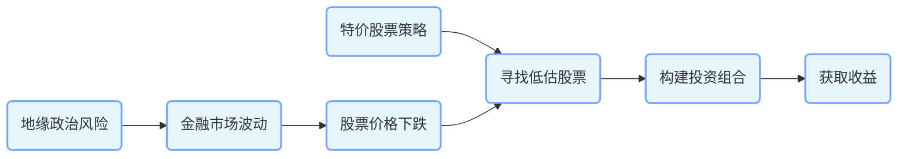

# 如何利用特价股票策略应对地缘政治风险

> 关键词：特价股票策略、地缘政治风险、股票投资、风险应对、投资组合

> 摘要：本文围绕如何利用特价股票策略应对地缘政治风险展开深入探讨。首先介绍了地缘政治风险对金融市场的影响以及特价股票策略的基本概念。接着详细阐述了特价股票策略的核心原理、相关算法和数学模型。通过项目实战部分的代码案例，展示了如何在实际中运用该策略。同时分析了该策略在不同场景下的实际应用，并推荐了相关的学习资源、开发工具和研究论文。最后总结了未来发展趋势与挑战，为投资者在复杂地缘政治环境下运用特价股票策略提供全面的指导。

## 1. 背景介绍 
### 1.1 目的和范围
地缘政治风险一直是影响全球金融市场的重要因素，从贸易摩擦到地区冲突，这些不确定性事件常常导致股票市场的剧烈波动。特价股票策略作为一种投资方法，旨在通过挖掘被市场低估的股票来获取收益，同时降低地缘政治风险对投资组合的影响。本文的目的在于深入剖析特价股票策略的原理和应用，探讨如何利用该策略有效应对地缘政治风险。范围涵盖了特价股票策略的核心概念、算法原理、数学模型、实际案例以及相关的工具和资源。

### 1.2 预期读者
本文预期读者包括股票投资者、金融分析师、投资组合经理以及对金融市场和投资策略感兴趣的技术人员。无论是新手投资者寻求在复杂市场环境中找到稳健的投资方法，还是专业人士希望进一步优化投资组合以应对地缘政治风险，都能从本文中获得有价值的信息。

### 1.3 文档结构概述
本文将按照以下结构展开：首先介绍相关的核心概念和它们之间的联系，包括地缘政治风险和特价股票策略的定义和相互关系；接着阐述核心算法原理和具体操作步骤，通过Python代码进行详细说明；然后介绍相关的数学模型和公式，并举例说明其应用；通过项目实战部分展示如何在实际中运用特价股票策略；分析该策略在不同实际场景中的应用；推荐相关的学习资源、开发工具和研究论文；最后总结未来发展趋势与挑战，并提供常见问题的解答和扩展阅读参考资料。

### 1.4 术语表
#### 1.4.1 核心术语定义
- **地缘政治风险**：指由于政治实体（如国家、地区组织等）之间的政治、经济、军事等关系变化而导致的不确定性，这些变化可能对金融市场产生重大影响。
- **特价股票策略**：一种投资策略，通过筛选被市场低估的股票，即价格低于其内在价值的股票，构建投资组合以获取长期收益。
- **内在价值**：股票的真实价值，通常通过对公司的财务状况、盈利能力、行业前景等因素进行分析来评估。

#### 1.4.2 相关概念解释
- **市场效率**：指市场价格反映所有可用信息的程度。在有效市场中，股票价格能够及时、准确地反映公司的基本面信息；而在非有效市场中，可能存在股票价格被低估或高估的情况，这为特价股票策略提供了机会。
- **风险溢价**：投资者因承担额外风险而要求的额外回报。在地缘政治风险较高的情况下，投资者通常会要求更高的风险溢价，导致股票价格下跌。

#### 1.4.3 缩略词列表
- **PE**：市盈率（Price-to-Earnings Ratio），指股票价格与每股收益的比率，用于衡量股票的估值水平。
- **PB**：市净率（Price-to-Book Ratio），指股票价格与每股净资产的比率，也是常用的估值指标之一。

## 2. 核心概念与联系 

### 地缘政治风险与金融市场
地缘政治风险的发生往往会引发投资者的恐慌情绪，导致资金从风险资产（如股票）流向避险资产（如黄金、国债等）。这会使得股票市场的整体需求下降，股价下跌。例如，当两个主要经济体之间发生贸易摩擦时，相关企业的出口业务可能受到影响，投资者对这些企业的未来盈利能力产生担忧，从而抛售股票，导致股价下跌。

### 特价股票策略原理
特价股票策略的核心思想是寻找那些被市场错误定价的股票。市场由于受到各种因素的影响，包括地缘政治风险，可能会过度反应，导致某些股票的价格低于其内在价值。投资者通过深入分析公司的基本面，如财务报表、行业竞争力等，识别出这些被低估的股票，并在价格回归内在价值的过程中获取收益。

### 核心概念架构示意图


该示意图展示了地缘政治风险、金融市场波动、特价股票策略以及投资收益之间的关系。地缘政治风险引发金融市场波动，导致股票价格下跌，而特价股票策略则通过寻找被低估的股票构建投资组合，最终实现获取收益的目标。

## 3. 核心算法原理 & 具体操作步骤 

### 算法原理
特价股票策略的核心算法主要包括两个步骤：一是筛选出可能被低估的股票，二是对筛选出的股票进行综合评估，确定最终的投资组合。筛选过程通常基于一些财务指标，如市盈率（PE）、市净率（PB）等。一般来说，较低的PE和PB值可能表示股票被低估。

### Python代码实现

```python
import pandas as pd
import yfinance as yf

# 定义筛选函数
def screen_stocks(tickers, pe_threshold=15, pb_threshold=1.5):
    undervalued_stocks = []
    for ticker in tickers:
        try:
            # 获取股票数据
            stock = yf.Ticker(ticker)
            info = stock.info
            # 检查PE和PB值
            if 'trailingPE' in info and 'priceToBook' in info:
                pe = info['trailingPE']
                pb = info['priceToBook']
                if pe < pe_threshold and pb < pb_threshold:
                    undervalued_stocks.append(ticker)
        except Exception as e:
            print(f"Error getting data for {ticker}: {e}")
    return undervalued_stocks

# 示例股票列表
tickers = ['AAPL', 'GOOG', 'MSFT', 'IBM', 'AMZN']
# 筛选被低估的股票
undervalued = screen_stocks(tickers)
print("Undervalued stocks:", undervalued)
```

### 代码解释
1. **导入必要的库**：使用`pandas`进行数据处理，`yfinance`用于获取股票数据。
2. **定义筛选函数`screen_stocks`**：该函数接受一个股票代码列表`tickers`，以及市盈率和市净率的阈值`pe_threshold`和`pb_threshold`作为参数。
3. **遍历股票列表**：对于每个股票，使用`yfinance`获取其基本信息，检查是否包含`trailingPE`（滚动市盈率）和`priceToBook`（市净率）。
4. **筛选条件判断**：如果股票的PE和PB值都低于设定的阈值，则将其添加到`undervalued_stocks`列表中。
5. **返回筛选结果**：最后返回被低估的股票列表。

### 具体操作步骤
1. **确定股票池**：选择要分析的股票范围，可以是某个市场指数的成分股，也可以是特定行业的股票。
2. **设置筛选指标和阈值**：根据市场情况和个人投资偏好，确定用于筛选低估股票的指标（如PE、PB等）和相应的阈值。
3. **数据获取和筛选**：使用上述代码获取股票的基本信息，并进行筛选，得到可能被低估的股票列表。
4. **综合评估**：对筛选出的股票进行更深入的分析，包括公司的财务状况、行业前景、竞争优势等，确定最终的投资组合。

## 4. 数学模型和公式 & 详细讲解 & 举例说明 

### 市盈率（PE）模型
市盈率是最常用的估值指标之一，其计算公式为：
$$PE = \frac{P}{EPS}$$
其中，$P$ 是股票价格，$EPS$ 是每股收益。市盈率反映了投资者为获取每股收益所愿意支付的价格。一般来说，较低的市盈率可能表示股票被低估，但需要注意的是，不同行业的市盈率水平可能存在较大差异。

### 市净率（PB）模型
市净率的计算公式为：
$$PB = \frac{P}{BVPS}$$
其中，$P$ 是股票价格，$BVPS$ 是每股净资产。市净率衡量了股票价格相对于每股净资产的倍数，较低的市净率可能表示股票被低估。

### 举例说明
假设股票A的价格为50元，每股收益为5元，每股净资产为20元。则其市盈率为：
$$PE_A = \frac{50}{5} = 10$$
市净率为：
$$PB_A = \frac{50}{20} = 2.5$$
如果市场上同行业股票的平均市盈率为15，平均市净率为3，那么股票A的市盈率和市净率都低于行业平均水平，可能被认为是被低估的股票。

### 综合估值模型
除了PE和PB指标外，还可以使用更综合的估值模型，如股息贴现模型（DDM）。该模型的基本公式为：
$$V = \sum_{t=1}^{\infty} \frac{D_t}{(1 + r)^t}$$
其中，$V$ 是股票的内在价值，$D_t$ 是第 $t$ 期的股息，$r$ 是贴现率。股息贴现模型考虑了股票未来的股息现金流，并将其贴现到当前价值。

### 举例说明
假设股票B每年支付固定股息2元，投资者要求的贴现率为10%。则该股票的内在价值为：
$$V_B = \frac{2}{0.1} = 20$$
如果股票B的当前价格为15元，低于其内在价值，那么从股息贴现模型的角度来看，该股票被低估。

## 5. 项目实战：代码实际案例和详细解释说明 

### 5.1  开发环境搭建
- **Python环境**：建议使用Python 3.7及以上版本。可以通过Anaconda或Python官方网站下载安装。
- **必要的库**：需要安装`pandas`、`yfinance`等库。可以使用以下命令进行安装：
```sh
pip install pandas yfinance
```

### 5.2  源代码详细实现和代码解读
```python
import pandas as pd
import yfinance as yf
import matplotlib.pyplot as plt

# 定义筛选函数
def screen_stocks(tickers, pe_threshold=15, pb_threshold=1.5):
    undervalued_stocks = []
    for ticker in tickers:
        try:
            # 获取股票数据
            stock = yf.Ticker(ticker)
            info = stock.info
            # 检查PE和PB值
            if 'trailingPE' in info and 'priceToBook' in info:
                pe = info['trailingPE']
                pb = info['priceToBook']
                if pe < pe_threshold and pb < pb_threshold:
                    undervalued_stocks.append(ticker)
        except Exception as e:
            print(f"Error getting data for {ticker}: {e}")
    return undervalued_stocks

# 定义投资组合构建函数
def build_portfolio(undervalued_stocks, start_date='2020-01-01', end_date='2023-01-01'):
    portfolio_returns = pd.Series()
    for ticker in undervalued_stocks:
        try:
            # 获取股票历史数据
            data = yf.download(ticker, start=start_date, end=end_date)
            # 计算每日收益率
            returns = data['Close'].pct_change()
            portfolio_returns = portfolio_returns.add(returns, fill_value=0)
        except Exception as e:
            print(f"Error getting data for {ticker}: {e}")
    # 计算投资组合平均收益率
    portfolio_returns = portfolio_returns / len(undervalued_stocks)
    return portfolio_returns

# 示例股票列表
tickers = ['AAPL', 'GOOG', 'MSFT', 'IBM', 'AMZN']
# 筛选被低估的股票
undervalued = screen_stocks(tickers)
print("Undervalued stocks:", undervalued)

# 构建投资组合
portfolio_returns = build_portfolio(undervalued)

# 绘制投资组合收益率曲线
plt.figure(figsize=(12, 6))
portfolio_returns.cumsum().plot()
plt.title('Portfolio Cumulative Returns')
plt.xlabel('Date')
plt.ylabel('Cumulative Returns')
plt.show()
```

### 代码解读
1. **筛选函数`screen_stocks`**：与前面介绍的筛选函数相同，用于筛选出可能被低估的股票。
2. **投资组合构建函数`build_portfolio`**：该函数接受被低估的股票列表、起始日期和结束日期作为参数。对于每个股票，使用`yfinance`下载其历史数据，并计算每日收益率。将所有股票的收益率相加并取平均值，得到投资组合的平均收益率。
3. **示例股票列表和筛选操作**：定义一个示例股票列表`tickers`，调用`screen_stocks`函数筛选出被低估的股票，并打印结果。
4. **构建投资组合并绘制收益率曲线**：调用`build_portfolio`函数构建投资组合，计算其累计收益率，并使用`matplotlib`绘制收益率曲线。

### 5.3  代码解读与分析
- **筛选逻辑**：通过PE和PB指标筛选出可能被低估的股票，这种方法简单直观，但可能存在局限性，因为不同行业的合理估值水平不同。
- **投资组合构建**：将筛选出的股票等权重构建投资组合，没有考虑股票之间的相关性和风险分散。在实际应用中，可以根据股票的风险特征和预期收益进行更优化的权重分配。
- **收益率分析**：通过绘制累计收益率曲线，可以直观地观察投资组合的表现。但需要注意的是，过去的表现并不代表未来的收益，还需要考虑市场环境的变化和地缘政治风险的影响。

## 6. 实际应用场景 
### 地缘政治冲突时期
当地缘政治冲突爆发时，市场往往会出现恐慌情绪，股票价格普遍下跌。此时，特价股票策略可以帮助投资者寻找那些被市场过度抛售的优质股票。例如，在贸易摩擦期间，一些出口型企业的股票可能会受到较大影响，但如果这些企业的基本面仍然良好，其股票价格可能被低估。投资者可以通过筛选和分析，选择这些被低估的股票构建投资组合，等待市场情绪恢复和股价回升。

### 新兴市场波动
新兴市场由于其经济和政治环境的不稳定性，更容易受到地缘政治风险的影响。在新兴市场出现波动时，特价股票策略可以帮助投资者挖掘那些具有成长潜力但被暂时低估的股票。例如，某些新兴市场国家的基础设施建设需求旺盛，但由于地缘政治因素导致相关企业的股价下跌。投资者可以通过深入研究这些企业的财务状况和行业前景，选择合适的股票进行投资。

### 行业转型期
当某个行业面临技术变革或政策调整时，也会引发市场的波动。在这种情况下，特价股票策略可以帮助投资者发现那些能够适应行业变化并具有竞争优势的企业。例如，随着新能源汽车行业的崛起，传统燃油汽车企业可能会面临转型压力，其股价可能会受到影响。但如果某些传统汽车企业在新能源领域有积极的布局和技术储备，其股票可能被低估。投资者可以通过分析企业的战略规划和研发投入，选择具有潜力的股票进行投资。

## 7. 工具和资源推荐
### 7.1 学习资源推荐
#### 7.1.1 书籍推荐
- 《聪明的投资者》（The Intelligent Investor）：本杰明·格雷厄姆（Benjamin Graham）的经典著作，介绍了价值投资的基本理念和方法，对特价股票策略有重要的指导意义。
- 《证券分析》（Security Analysis）：同样是格雷厄姆的作品，详细阐述了股票和债券的分析方法，是价值投资者的必读之书。
- 《金融炼金术》（The Alchemy of Finance）：乔治·索罗斯（George Soros）的著作，探讨了金融市场的运行规律和投资者的心理因素，对理解地缘政治风险对市场的影响有很大帮助。

#### 7.1.2 在线课程
- Coursera上的“投资学原理”（Principles of Investments）课程：由知名大学教授授课，系统介绍了投资学的基本概念、理论和方法。
- edX上的“金融市场”（Financial Markets）课程：涵盖了金融市场的各个方面，包括股票市场、债券市场、衍生品市场等，对理解金融市场的运行机制有很大帮助。

#### 7.1.3 技术博客和网站
- Seeking Alpha：提供专业的股票分析和投资建议，有很多关于特价股票策略和地缘政治风险的文章。
- Bloomberg：全球知名的金融信息服务提供商，提供实时的金融市场数据、新闻和分析，对了解地缘政治事件对市场的影响有重要参考价值。

### 7.2 开发工具框架推荐
#### 7.2.1 IDE和编辑器
- PyCharm：一款专业的Python集成开发环境，具有强大的代码编辑、调试和分析功能，适合开发和调试与特价股票策略相关的Python代码。
- Jupyter Notebook：一种交互式的开发环境，适合进行数据探索和模型验证。可以方便地展示代码、图表和文本说明，便于进行数据分析和可视化。

#### 7.2.2 调试和性能分析工具
- PDB：Python自带的调试器，可以帮助开发者定位代码中的错误和问题。
- cProfile：Python的性能分析工具，可以分析代码的运行时间和函数调用情况，帮助开发者优化代码性能。

#### 7.2.3 相关框架和库
- Pandas：用于数据处理和分析的Python库，提供了丰富的数据结构和函数，方便进行股票数据的处理和分析。
- NumPy：Python的数值计算库，提供了高效的数组操作和数学函数，在计算股票收益率和构建投资组合时非常有用。
- Matplotlib：用于数据可视化的Python库，可以绘制各种类型的图表，如折线图、柱状图、散点图等，方便展示投资组合的表现。

### 7.3 相关论文著作推荐
#### 7.3.1 经典论文
- Fama, E. F., & French, K. R. (1992). The cross-section of expected stock returns. The Journal of Finance, 47(2), 427-465. 该论文提出了著名的Fama-French三因子模型，对理解股票收益率的影响因素有重要贡献。
- Graham, B., & Dodd, D. L. (1934). Security analysis. McGraw-Hill. 格雷厄姆和多德的经典著作，奠定了价值投资的理论基础。

#### 7.3.2 最新研究成果
- Bekaert, G., Hoerova, M., & Lo Duca, M. (2013). Risk, uncertainty, and monetary policy. Journal of Monetary Economics, 60(7), 771-788. 该论文研究了风险和不确定性对货币政策的影响，对理解地缘政治风险对金融市场的影响有一定参考价值。
- Pastor, L., & Veronesi, P. (2013). Political uncertainty and risk premia. Journal of Financial Economics, 108(2), 219-244. 探讨了政治不确定性对风险溢价的影响，对投资者在地缘政治风险环境下的投资决策有重要启示。

#### 7.3.3 应用案例分析
- Ang, A., & Bekaert, G. (2007). Stock return predictability: Is it there? Review of Financial Studies, 20(3), 651-707. 该论文通过实证分析研究了股票收益率的可预测性，为特价股票策略的应用提供了案例参考。

## 8. 总结：未来发展趋势与挑战
### 未来发展趋势
- **数据驱动的决策**：随着金融科技的发展，投资者将能够获取更多的市场数据和公司信息。特价股票策略将更加依赖于大数据分析和机器学习算法，以更准确地筛选出被低估的股票。
- **跨市场和跨资产配置**：地缘政治风险的影响是全球性的，未来投资者将更加注重跨市场和跨资产的配置，以降低单一市场和单一资产的风险。特价股票策略可能会与其他投资策略相结合，如债券投资、商品投资等，构建更加多元化的投资组合。
- **社会责任投资的融合**：投资者越来越关注企业的社会责任和可持续发展。未来，特价股票策略可能会将企业的社会责任指标纳入筛选标准，选择那些既被低估又具有良好社会形象的企业进行投资。

### 挑战
- **地缘政治风险的复杂性**：地缘政治风险的影响因素众多，包括政治、经济、军事、文化等多个方面，且这些因素之间相互关联、相互影响。准确预测地缘政治风险的发生和影响难度较大，这给特价股票策略的应用带来了挑战。
- **市场效率的提高**：随着市场参与者的增多和信息传播的加快，市场效率可能会逐渐提高。这意味着股票价格更难被低估，特价股票策略的实施难度可能会增加。
- **技术和数据的安全问题**：数据驱动的特价股票策略依赖于大量的市场数据和公司信息，这些数据的安全和隐私保护是一个重要问题。同时，机器学习算法的稳定性和可靠性也需要进一步提高。

## 9. 附录：常见问题与解答
### 问题1：特价股票策略一定能应对地缘政治风险吗？
答：特价股票策略并不能完全保证应对地缘政治风险。虽然该策略通过寻找被低估的股票来构建投资组合，但地缘政治风险的影响是复杂多变的，可能导致股票价格持续下跌，即使是被低估的股票也可能受到影响。此外，市场的不确定性和投资者的情绪也会对策略的效果产生影响。因此，特价股票策略只是一种降低风险、获取收益的方法，不能完全消除地缘政治风险。

### 问题2：如何确定筛选股票的PE和PB阈值？
答：PE和PB阈值的确定需要考虑多个因素，包括市场环境、行业特点和个人投资偏好等。一般来说，可以参考同行业股票的平均PE和PB值，以及历史数据来确定合理的阈值。例如，如果某行业的平均PE为20，那么可以将阈值设置为15左右。同时，也可以根据自己的风险承受能力和投资目标进行调整。如果希望筛选出更具安全性的股票，可以适当降低阈值；如果追求更高的收益，可以适当提高阈值。

### 问题3：投资组合的权重应该如何分配？
答：投资组合的权重分配可以采用多种方法。最简单的方法是等权重分配，即将资金平均分配到每个股票上。这种方法简单易行，但没有考虑股票之间的相关性和风险特征。更优化的方法是根据股票的风险和预期收益进行权重分配，例如使用马科维茨的现代投资组合理论（MPT），通过计算股票的协方差矩阵和预期收益率，确定最优的投资组合权重，以实现风险最小化和收益最大化的目标。

## 10. 扩展阅读 & 参考资料
- Damodaran, A. (2012). Investment valuation: Tools and techniques for determining the value of any asset. John Wiley & Sons.
- Sharpe, W. F., Alexander, G. J., & Bailey, J. V. (1999). Investments. Prentice Hall.
- Yahoo Finance: https://finance.yahoo.com/
- Google Finance: https://www.google.com/finance

作者：AI天才研究院/AI Genius Institute & 禅与计算机程序设计艺术 /Zen And The Art of Computer Programming