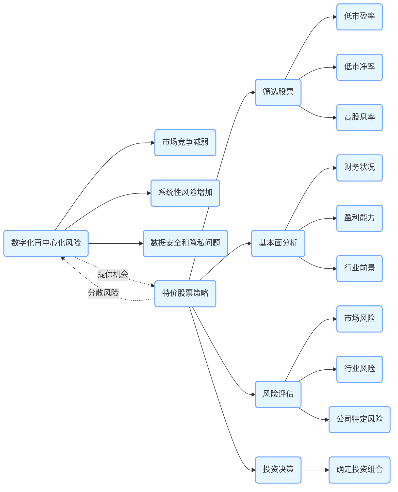

# 如何利用特价股票策略应对数字化再中心化风险

> 关键词：特价股票策略、数字化再中心化风险、金融市场、投资决策、风险管理

> 摘要：本文围绕如何利用特价股票策略应对数字化再中心化风险展开深入探讨。首先介绍了研究的背景和相关概念，阐述了数字化再中心化风险对金融市场的影响以及特价股票策略的基本原理。接着详细讲解了核心算法原理、数学模型和公式，通过Python代码进行了具体实现和分析。然后通过项目实战案例展示了如何运用特价股票策略，包括开发环境搭建、源代码实现与解读。进一步探讨了该策略在不同实际应用场景中的作用，推荐了相关的学习资源、开发工具框架和论文著作。最后总结了未来发展趋势与挑战，并对常见问题进行了解答，为投资者在数字化时代有效应对风险提供了全面的理论和实践指导。

## 1. 背景介绍 
### 1.1 目的和范围
在当今数字化快速发展的时代，金融市场面临着数字化再中心化的风险。这种风险可能导致市场结构的变化、资产价格的波动以及投资者利益的受损。本研究的目的在于探讨如何利用特价股票策略来有效应对数字化再中心化风险，为投资者提供一种可行的风险管理方法。研究范围涵盖了特价股票策略的基本原理、核心算法、数学模型，以及在实际金融市场中的应用案例和效果分析。

### 1.2 预期读者
本文预期读者包括金融投资者、金融分析师、金融市场研究人员、从事金融相关工作的技术人员以及对金融市场风险管理感兴趣的人士。通过阅读本文，读者可以深入了解特价股票策略和数字化再中心化风险的相关知识，掌握利用该策略应对风险的方法和技巧。

### 1.3 文档结构概述
本文共分为十个部分。第一部分为背景介绍，阐述了研究的目的、范围、预期读者和文档结构概述，并给出了相关术语的定义和解释。第二部分介绍核心概念与联系，包括数字化再中心化风险和特价股票策略的原理和架构，并通过文本示意图和Mermaid流程图进行展示。第三部分讲解核心算法原理和具体操作步骤，使用Python源代码详细阐述。第四部分介绍数学模型和公式，并进行详细讲解和举例说明。第五部分通过项目实战展示代码实际案例和详细解释说明，包括开发环境搭建、源代码实现和代码解读。第六部分探讨实际应用场景。第七部分推荐相关的工具和资源，包括学习资源、开发工具框架和论文著作。第八部分总结未来发展趋势与挑战。第九部分为附录，解答常见问题。第十部分提供扩展阅读和参考资料。

### 1.4 术语表
#### 1.4.1 核心术语定义
- **数字化再中心化风险**：指在数字化进程中，由于市场权力和资源向少数大型数字化企业或平台集中，导致金融市场结构失衡、竞争减弱、系统性风险增加的现象。
- **特价股票策略**：一种投资策略，通过分析股票的基本面和市场价格，寻找被低估的股票（即特价股票）进行投资，以获取长期的超额收益。
- **股票估值**：对股票的内在价值进行评估的过程，通常基于公司的财务状况、盈利能力、行业前景等因素。
- **风险管理**：识别、评估和应对风险的过程，旨在降低风险对投资组合的影响，保护投资者的利益。

#### 1.4.2 相关概念解释
- **市场效率**：指市场价格反映所有可用信息的程度。在有效市场中，股票价格能够及时、准确地反映公司的基本面信息，难以通过分析信息获得超额收益。
- **价值投资**：一种投资理念，强调寻找被低估的股票，基于公司的内在价值进行投资，而不是基于市场趋势或短期波动。
- **系统性风险**：指由整体市场因素引起的风险，无法通过分散投资来消除，如宏观经济环境变化、政策调整等。

#### 1.4.3 缩略词列表
- **CAPM**：资本资产定价模型（Capital Asset Pricing Model）
- **P/E**：市盈率（Price-to-Earnings Ratio）
- **P/B**：市净率（Price-to-Book Ratio）

## 2. 核心概念与联系 
### 数字化再中心化风险的原理和架构
数字化再中心化风险源于数字化技术的发展和应用，使得少数大型数字化企业或平台在市场中占据主导地位。这些企业或平台通过网络效应、数据优势和技术壁垒，不断扩大市场份额，形成垄断或寡头垄断的市场结构。这种市场结构的变化可能导致以下风险：
1. **市场竞争减弱**：少数企业或平台的主导地位使得其他企业难以进入市场，竞争减少，可能导致市场效率下降和消费者福利受损。
2. **系统性风险增加**：大型数字化企业或平台的业务涉及多个领域，相互关联度高。一旦这些企业或平台出现问题，可能引发系统性风险，影响整个金融市场的稳定。
3. **数据安全和隐私问题**：数字化企业或平台掌握大量用户数据，数据安全和隐私问题日益突出。数据泄露或滥用可能导致用户信任受损，进而影响企业的声誉和市场价值。

### 特价股票策略的原理和架构
特价股票策略基于价值投资的理念，认为市场有时会出现定价错误，导致某些股票的价格低于其内在价值。投资者通过分析股票的基本面和市场价格，寻找这些被低估的股票进行投资，等待市场纠正错误，实现股票价格的回归，从而获取超额收益。

特价股票策略的核心步骤包括：
1. **筛选股票**：根据一定的标准筛选出可能被低估的股票，如低市盈率、低市净率、高股息率等。
2. **基本面分析**：对筛选出的股票进行基本面分析，评估公司的财务状况、盈利能力、行业前景等，确定其内在价值。
3. **风险评估**：评估投资这些股票可能面临的风险，如市场风险、行业风险、公司特定风险等。
4. **投资决策**：根据基本面分析和风险评估的结果，做出投资决策，确定投资组合。

### 数字化再中心化风险与特价股票策略的联系
数字化再中心化风险可能导致市场价格的波动和定价错误，为特价股票策略提供了机会。在数字化再中心化的过程中，一些传统行业的股票可能被市场低估，因为投资者更关注数字化企业或平台的发展前景。而这些被低估的股票可能具有较高的投资价值，通过特价股票策略可以寻找这些机会，获取超额收益。

同时，特价股票策略也可以帮助投资者分散风险，降低数字化再中心化风险对投资组合的影响。通过投资不同行业、不同类型的特价股票，可以减少对数字化企业或平台的依赖，提高投资组合的稳定性。

### 文本示意图
```plaintext
数字化再中心化风险
|
|-- 市场竞争减弱
|-- 系统性风险增加
|-- 数据安全和隐私问题

特价股票策略
|
|-- 筛选股票
|   |-- 低市盈率
|   |-- 低市净率
|   |-- 高股息率
|
|-- 基本面分析
|   |-- 财务状况
|   |-- 盈利能力
|   |-- 行业前景
|
|-- 风险评估
|   |-- 市场风险
|   |-- 行业风险
|   |-- 公司特定风险
|
|-- 投资决策
|   |-- 确定投资组合

联系：数字化再中心化风险为特价股票策略提供机会，特价股票策略帮助投资者分散风险
```

### Mermaid流程图


## 3. 核心算法原理 & 具体操作步骤 
### 核心算法原理
特价股票策略的核心算法主要基于股票估值模型，通过比较股票的市场价格和内在价值，判断股票是否被低估。常用的股票估值模型包括市盈率模型、市净率模型、股息折现模型等。

#### 市盈率模型
市盈率（P/E）是指股票价格与每股收益（EPS）的比率，反映了投资者为获取每股收益所愿意支付的价格。市盈率模型的基本公式为：
$$P = EPS \times P/E$$
其中，$P$ 为股票价格，$EPS$ 为每股收益，$P/E$ 为市盈率。

通过比较股票的实际市盈率和行业平均市盈率或历史市盈率，可以判断股票是否被低估。如果股票的实际市盈率低于行业平均市盈率或历史市盈率，说明股票可能被低估。

#### 市净率模型
市净率（P/B）是指股票价格与每股净资产（BVPS）的比率，反映了投资者为获取每股净资产所愿意支付的价格。市净率模型的基本公式为：
$$P = BVPS \times P/B$$
其中，$P$ 为股票价格，$BVPS$ 为每股净资产，$P/B$ 为市净率。

通过比较股票的实际市净率和行业平均市净率或历史市净率，可以判断股票是否被低估。如果股票的实际市净率低于行业平均市净率或历史市净率，说明股票可能被低估。

#### 股息折现模型
股息折现模型（DDM）是一种基于股票未来股息现金流的估值模型，认为股票的内在价值等于其未来股息现金流的现值之和。股息折现模型的基本公式为：
$$V = \sum_{t=1}^{\infty} \frac{D_t}{(1 + r)^t}$$
其中，$V$ 为股票的内在价值，$D_t$ 为第 $t$ 期的股息，$r$ 为折现率。

在实际应用中，通常采用简化的股息折现模型，如固定增长股息折现模型（Gordon Growth Model），假设股息以固定的增长率 $g$ 增长，则公式为：
$$V = \frac{D_1}{r - g}$$
其中，$D_1$ 为下一期的股息，$r$ 为折现率，$g$ 为股息增长率。

通过比较股票的市场价格和股息折现模型计算的内在价值，可以判断股票是否被低估。如果股票的市场价格低于内在价值，说明股票可能被低估。

### 具体操作步骤
#### 数据收集
收集股票的相关数据，包括股票价格、每股收益、每股净资产、股息等财务数据，以及行业平均市盈率、市净率等市场数据。可以通过金融数据提供商（如雅虎财经、东方财富等）或上市公司的财务报表获取这些数据。

#### 计算估值指标
根据收集到的数据，计算股票的市盈率、市净率等估值指标，并与行业平均水平或历史数据进行比较。

#### 筛选特价股票
根据估值指标的比较结果，筛选出可能被低估的股票，即市盈率、市净率低于行业平均水平或历史数据的股票。

#### 基本面分析
对筛选出的特价股票进行基本面分析，评估公司的财务状况、盈利能力、行业前景等。可以通过分析公司的财务报表、行业研究报告、新闻资讯等获取相关信息。

#### 风险评估
评估投资这些特价股票可能面临的风险，包括市场风险、行业风险、公司特定风险等。可以通过分析宏观经济环境、行业发展趋势、公司的经营状况等因素进行风险评估。

#### 投资决策
根据基本面分析和风险评估的结果，做出投资决策，确定投资组合。可以根据投资者的风险偏好和投资目标，合理分配资金，选择不同的特价股票进行投资。

### Python源代码实现
```python
import pandas as pd
import yfinance as yf

# 数据收集
def collect_data(ticker, start_date, end_date):
    stock = yf.Ticker(ticker)
    data = stock.history(start=start_date, end=end_date)
    financials = stock.financials
    balance_sheet = stock.balance_sheet
    dividends = stock.dividends
    return data, financials, balance_sheet, dividends

# 计算估值指标
def calculate_valuation_metrics(data, financials, balance_sheet, dividends):
    # 计算每股收益
    net_income = financials.loc['Net Income']
    shares_outstanding = balance_sheet.loc['Common Stock']
    eps = net_income / shares_outstanding

    # 计算每股净资产
    total_equity = balance_sheet.loc['Total Stockholder Equity']
    bvps = total_equity / shares_outstanding

    # 计算市盈率和市净率
    latest_price = data['Close'].iloc[-1]
    pe_ratio = latest_price / eps.iloc[0]
    pb_ratio = latest_price / bvps.iloc[0]

    return pe_ratio, pb_ratio

# 筛选特价股票
def screen_bargain_stocks(tickers, start_date, end_date, industry_pe_avg, industry_pb_avg):
    bargain_stocks = []
    for ticker in tickers:
        data, financials, balance_sheet, dividends = collect_data(ticker, start_date, end_date)
        pe_ratio, pb_ratio = calculate_valuation_metrics(data, financials, balance_sheet, dividends)
        if pe_ratio < industry_pe_avg and pb_ratio < industry_pb_avg:
            bargain_stocks.append(ticker)
    return bargain_stocks

# 示例使用
tickers = ['AAPL', 'MSFT', 'GOOG']
start_date = '2020-01-01'
end_date = '2023-01-01'
industry_pe_avg = 20
industry_pb_avg = 3

bargain_stocks = screen_bargain_stocks(tickers, start_date, end_date, industry_pe_avg, industry_pb_avg)
print("特价股票列表:", bargain_stocks)
```

### 代码解释
1. **数据收集**：`collect_data` 函数使用 `yfinance` 库从雅虎财经获取股票的历史数据、财务数据、资产负债表数据和股息数据。
2. **计算估值指标**：`calculate_valuation_metrics` 函数根据收集到的数据计算股票的每股收益、每股净资产、市盈率和市净率。
3. **筛选特价股票**：`screen_bargain_stocks` 函数遍历股票列表，计算每只股票的市盈率和市净率，并与行业平均水平进行比较。如果市盈率和市净率都低于行业平均水平，则将该股票添加到特价股票列表中。
4. **示例使用**：定义股票列表、时间范围和行业平均市盈率、市净率，调用 `screen_bargain_stocks` 函数筛选特价股票，并打印结果。

## 4. 数学模型和公式 & 详细讲解 & 举例说明 
### 市盈率模型
#### 公式
市盈率模型的基本公式为：
$$P = EPS \times P/E$$
其中，$P$ 为股票价格，$EPS$ 为每股收益，$P/E$ 为市盈率。

#### 详细讲解
市盈率反映了投资者为获取每股收益所愿意支付的价格。市盈率越高，说明投资者对公司的未来盈利预期越高，愿意支付更高的价格；市盈率越低，说明投资者对公司的未来盈利预期越低，愿意支付的价格也越低。

在使用市盈率模型进行股票估值时，通常会将股票的实际市盈率与行业平均市盈率或历史市盈率进行比较。如果股票的实际市盈率低于行业平均市盈率或历史市盈率，说明股票可能被低估，具有投资价值；反之，如果股票的实际市盈率高于行业平均市盈率或历史市盈率，说明股票可能被高估，存在投资风险。

#### 举例说明
假设某公司的每股收益为 $2$ 元，行业平均市盈率为 $20$ 倍。根据市盈率模型，该公司股票的合理价格为：
$$P = 2 \times 20 = 40$$（元）

如果该公司股票的实际价格为 $30$ 元，其实际市盈率为：
$$P/E = \frac{30}{2} = 15$$（倍）

由于该公司股票的实际市盈率低于行业平均市盈率，说明股票可能被低估，具有投资价值。

### 市净率模型
#### 公式
市净率模型的基本公式为：
$$P = BVPS \times P/B$$
其中，$P$ 为股票价格，$BVPS$ 为每股净资产，$P/B$ 为市净率。

#### 详细讲解
市净率反映了投资者为获取每股净资产所愿意支付的价格。市净率越高，说明投资者对公司的资产质量和未来发展前景越看好，愿意支付更高的价格；市净率越低，说明投资者对公司的资产质量和未来发展前景越不看好，愿意支付的价格也越低。

在使用市净率模型进行股票估值时，通常会将股票的实际市净率与行业平均市净率或历史市净率进行比较。如果股票的实际市净率低于行业平均市净率或历史市净率，说明股票可能被低估，具有投资价值；反之，如果股票的实际市净率高于行业平均市净率或历史市净率，说明股票可能被高估，存在投资风险。

#### 举例说明
假设某公司的每股净资产为 $10$ 元，行业平均市净率为 $