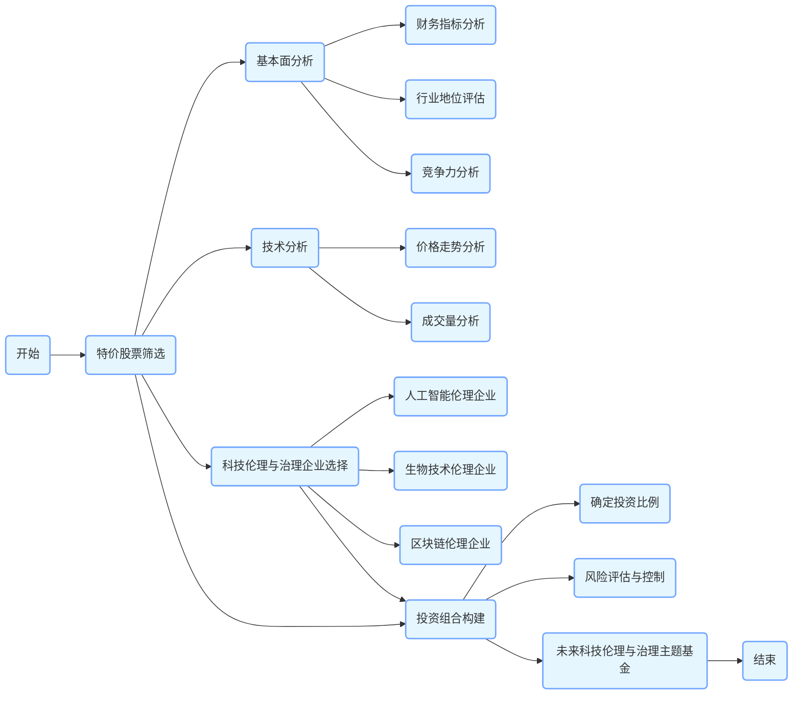

# 如何利用特价股票策略构建未来科技伦理与治理主题基金

> 关键词：特价股票策略、未来科技伦理与治理、主题基金、投资组合、风险控制

> 摘要：本文聚焦于如何运用特价股票策略来构建未来科技伦理与治理主题基金。首先介绍了相关背景知识，包括目的范围、预期读者等内容。接着阐述了核心概念及其联系，分析了核心算法原理与具体操作步骤，借助Python代码进行详细说明。同时给出了数学模型和公式，并举例讲解。通过项目实战展示了开发环境搭建、源代码实现与解读。探讨了该主题基金的实际应用场景，推荐了学习、开发工具和相关论文著作。最后总结了未来发展趋势与挑战，还设置了常见问题解答和扩展阅读参考资料，旨在为投资者和相关从业者提供全面的构建主题基金的指导。

## 1. 背景介绍 
### 1.1 目的和范围
本研究的主要目的是探讨如何运用特价股票策略来构建专注于未来科技伦理与治理领域的主题基金。随着科技的飞速发展，特别是人工智能、生物技术、区块链等新兴技术的兴起，科技伦理与治理问题日益凸显。同时，股票市场中存在着被低估的特价股票，通过合理的策略筛选这些股票并构建主题基金，既能在投资中获得潜在的收益，又能推动科技伦理与治理相关企业的发展。

本研究的范围涵盖了特价股票的筛选方法、未来科技伦理与治理相关企业的界定、主题基金的构建流程、风险评估与控制等方面。旨在为投资者提供一套系统的构建主题基金的方法和思路。

### 1.2 预期读者
本文的预期读者主要包括以下几类人群：
- **投资者**：对科技伦理与治理领域感兴趣，希望通过投资相关主题基金来分享行业发展红利的个人和机构投资者。
- **金融从业者**：如基金经理、投资顾问等，他们可以从本文中获取构建主题基金的新方法和思路，优化投资组合。
- **科技伦理研究人员**：了解金融市场如何支持科技伦理与治理相关企业的发展，为其研究提供新的视角。
- **高校学生**：金融、科技伦理等相关专业的学生，可以通过本文学习到跨领域的知识和实践方法。

### 1.3 文档结构概述
本文将按照以下结构进行阐述：
- **核心概念与联系**：介绍特价股票策略、未来科技伦理与治理主题基金的核心概念，以及它们之间的联系，并通过文本示意图和Mermaid流程图进行直观展示。
- **核心算法原理 & 具体操作步骤**：详细讲解特价股票筛选和主题基金构建的核心算法原理，并用Python代码实现具体操作步骤。
- **数学模型和公式 & 详细讲解 & 举例说明**：给出相关的数学模型和公式，对其进行详细解释，并通过实际例子说明其应用。
- **项目实战：代码实际案例和详细解释说明**：展示如何搭建开发环境，实现源代码，并对代码进行解读和分析。
- **实际应用场景**：探讨未来科技伦理与治理主题基金的实际应用场景。
- **工具和资源推荐**：推荐学习资源、开发工具框架和相关论文著作。
- **总结：未来发展趋势与挑战**：总结未来科技伦理与治理主题基金的发展趋势和面临的挑战。
- **附录：常见问题与解答**：解答读者可能遇到的常见问题。
- **扩展阅读 & 参考资料**：提供扩展阅读的内容和参考资料。

### 1.4 术语表
#### 1.4.1 核心术语定义
- **特价股票策略**：通过分析股票的基本面、市场表现等因素，筛选出价格被低估的股票进行投资的策略。
- **未来科技伦理与治理**：指对新兴科技在研发、应用过程中涉及的伦理问题进行研究和管理，确保科技的发展符合人类的价值观和利益。
- **主题基金**：是一种专门投资于特定主题领域的基金，通过集中投资于相关主题的企业股票，来实现特定的投资目标。

#### 1.4.2 相关概念解释
- **科技伦理问题**：包括人工智能的隐私保护、生物技术的基因编辑伦理、区块链的信息安全等问题。
- **治理机制**：指为解决科技伦理问题而建立的规则、制度和监管体系。

#### 1.4.3 缩略词列表
- **PE**：市盈率（Price-to-Earnings Ratio），衡量股票价格与每股盈利之间的比率。
- **PB**：市净率（Price-to-Book Ratio），衡量股票价格与每股净资产之间的比率。

## 2. 核心概念与联系 

### 核心概念原理
#### 特价股票策略原理
特价股票策略的核心在于寻找市场中被低估的股票。其原理基于市场的不完全有效性，即市场有时不能准确反映股票的真实价值。通过对股票的基本面分析，如财务报表、行业地位、竞争力等，以及技术分析，如价格走势、成交量等，筛选出那些价格低于其内在价值的股票。例如，当一家公司的市盈率低于同行业平均水平，且公司的业绩稳定增长，那么该股票可能被低估，具有投资价值。

#### 未来科技伦理与治理主题基金原理
未来科技伦理与治理主题基金聚焦于与科技伦理与治理相关的企业。这些企业在新兴科技领域中，注重伦理问题的解决和治理机制的建立，具有良好的发展前景。基金通过投资这些企业的股票，分享其成长带来的收益。同时，基金的投资也可以推动科技伦理与治理的发展，促进科技行业的健康可持续发展。

### 架构的文本示意图
```plaintext
未来科技伦理与治理主题基金
|
|-- 特价股票筛选
|   |-- 基本面分析
|   |   |-- 财务指标（PE、PB等）
|   |   |-- 行业地位
|   |   |-- 竞争力
|   |-- 技术分析
|       |-- 价格走势
|       |-- 成交量
|
|-- 投资组合构建
|   |-- 确定投资比例
|   |-- 风险评估与控制
|
|-- 科技伦理与治理企业选择
|   |-- 人工智能伦理企业
|   |-- 生物技术伦理企业
|   |-- 区块链伦理企业
```

### Mermaid流程图


## 3. 核心算法原理 & 具体操作步骤 

### 核心算法原理
#### 特价股票筛选算法
特价股票筛选主要基于两个方面的算法：基本面分析算法和技术分析算法。

##### 基本面分析算法
基本面分析算法主要通过计算股票的财务指标，如市盈率（PE）、市净率（PB）等，来评估股票的价值。以下是计算PE和PB的Python代码示例：
```python
def calculate_pe(stock_price, earnings_per_share):
    """
    计算市盈率（PE）
    :param stock_price: 股票价格
    :param earnings_per_share: 每股收益
    :return: 市盈率
    """
    if earnings_per_share == 0:
        return None
    return stock_price / earnings_per_share

def calculate_pb(stock_price, book_value_per_share):
    """
    计算市净率（PB）
    :param stock_price: 股票价格
    :param book_value_per_share: 每股净资产
    :return: 市净率
    """
    if book_value_per_share == 0:
        return None
    return stock_price / book_value_per_share

# 示例数据
stock_price = 50
earnings_per_share = 5
book_value_per_share = 20

pe = calculate_pe(stock_price, earnings_per_share)
pb = calculate_pb(stock_price, book_value_per_share)

print(f"市盈率（PE）: {pe}")
print(f"市净率（PB）: {pb}")
```
##### 技术分析算法
技术分析算法主要通过分析股票的价格走势和成交量来判断股票的买卖信号。常用的技术指标有移动平均线（MA）、相对强弱指标（RSI）等。以下是计算简单移动平均线（SMA）的Python代码示例：
```python
import numpy as np

def calculate_sma(prices, window):
    """
    计算简单移动平均线（SMA）
    :param prices: 股票价格序列
    :param window: 移动平均窗口大小
    :return: 简单移动平均线序列
    """
    sma = np.convolve(prices, np.ones(window)/window, mode='valid')
    return sma

# 示例数据
prices = [10, 12, 15, 13, 16, 18, 20, 19, 22, 25]
window = 3

sma = calculate_sma(prices, window)
print(f"简单移动平均线（SMA）: {sma}")
```

#### 投资组合构建算法
投资组合构建算法主要基于现代投资组合理论，通过优化投资比例来实现风险和收益的平衡。常用的方法有均值 - 方差优化法。以下是一个简单的投资组合构建示例代码：
```python
import numpy as np
import pandas as pd
from scipy.optimize import minimize

# 示例数据：假设我们有三只股票的收益率序列
returns = pd.DataFrame({
    'stock1': [0.05, 0.03, 0.02, 0.04, 0.06],
    'stock2': [0.03, 0.02, 0.01, 0.03, 0.05],
    'stock3': [0.04, 0.02, 0.03, 0.05, 0.07]
})

# 计算协方差矩阵和预期收益率
cov_matrix = returns.cov()
expected_returns = returns.mean()

# 定义目标函数：最小化投资组合的方差
def portfolio_variance(weights, cov_matrix):
    return np.dot(weights.T, np.dot(cov_matrix, weights))

# 约束条件：权重之和为1
constraints = ({'type': 'eq', 'fun': lambda x: np.sum(x) - 1})

# 权重范围：0到1
bounds = [(0, 1) for _ in range(len(expected_returns))]

# 初始权重猜测
initial_weights = np.ones(len(expected_returns)) / len(expected_returns)

# 最小化目标函数
result = minimize(portfolio_variance, initial_weights, args=(cov_matrix,),
                  method='SLSQP', bounds=bounds, constraints=constraints)

optimal_weights = result.x

print(f"最优投资权重: {optimal_weights}")
```

### 具体操作步骤
#### 特价股票筛选步骤
1. **数据收集**：收集股票的财务数据、价格数据和成交量数据。
2. **基本面分析**：计算股票的PE、PB等财务指标，筛选出PE和PB低于同行业平均水平的股票。
3. **技术分析**：计算股票的技术指标，如SMA、RSI等，筛选出价格走势和成交量符合买入信号的股票。

#### 科技伦理与治理企业选择步骤
1. **确定企业范围**：确定与未来科技伦理与治理相关的企业范围，如人工智能伦理企业、生物技术伦理企业、区块链伦理企业等。
2. **企业评估**：对候选企业进行评估，评估指标包括企业的伦理政策、治理机制、研发投入等。
3. **企业筛选**：筛选出在科技伦理与治理方面表现优秀的企业。

#### 投资组合构建步骤
1. **确定投资标的**：从特价股票筛选和科技伦理与治理企业选择的结果中确定投资标的。
2. **计算预期收益率和协方差矩阵**：根据历史数据计算投资标的的预期收益率和协方差矩阵。
3. **优化投资比例**：使用均值 - 方差优化法等方法优化投资比例，实现风险和收益的平衡。

## 4. 数学模型和公式 & 详细讲解 & 举例说明 

### 市盈率（PE）模型
#### 公式
$$PE = \frac{P}{EPS}$$
其中，$P$ 表示股票价格，$EPS$ 表示每股收益。

#### 详细讲解
市盈率是衡量股票价格与每股盈利之间关系的指标。它反映了投资者为获得每一元盈利所愿意支付的价格。一般来说，市盈率越低，说明股票越便宜，具有投资价值。但市盈率也受到行业、市场环境等因素的影响，不同行业的市盈率水平可能差异较大。

#### 举例说明
假设某股票的价格为50元，每股收益为5元，则该股票的市盈率为：
$$PE = \frac{50}{5} = 10$$
如果同行业的平均市盈率为15，那么该股票的市盈率低于行业平均水平，可能被低估。

### 市净率（PB）模型
#### 公式
$$PB = \frac{P}{BVPS}$$
其中，$P$ 表示股票价格，$BVPS$ 表示每股净资产。

#### 详细讲解
市净率是衡量股票价格与每股净资产之间关系的指标。它反映了投资者为获得每一元净资产所愿意支付的价格。一般来说，市净率越低，说明股票越便宜，具有投资价值。但市净率也受到行业、市场环境等因素的影响，不同行业的市净率水平可能差异较大。

#### 举例说明
假设某股票的价格为50元，每股净资产为20元，则该股票的市净率为：
$$PB = \frac{50}{20} = 2.5$$
如果同行业的平均市净率为3，那么该股票的市净率低于行业平均水平，可能被低估。

### 简单移动平均线（SMA）模型
#### 公式
$$SMA_n = \frac{\sum_{i=0}^{n-1} P_{t-i}}{n}$$
其中，$SMA_n$ 表示 $n$ 期简单移动平均线，$P_t$ 表示第 $t$ 期的股票价格，$n$ 表示移动平均的期数。

#### 详细讲解
简单移动平均线是一种常用的技术分析指标，它通过计算一定时期内股票价格的平均值来平滑价格波动，反映股票价格的趋势。当股票价格上穿移动平均线时，可能是买入信号；当股票价格下穿移动平均线时，可能是卖出信号。

#### 举例说明
假设某股票的价格序列为 $[10, 12, 15, 13, 16, 18, 20, 19, 22, 25]$，移动平均的期数 $n = 3$，则计算第4期的简单移动平均线为：
$$SMA_3 = \frac{10 + 12 + 15}{3} = 12.33$$

### 投资组合方差模型
#### 公式
$$\sigma_p^2 = \sum_{i=1}^{n} \sum_{j=1}^{n} w_i w_j \sigma_{ij}$$
其中，$\sigma_p^2$ 表示投资组合的方差，$w_i$ 和 $w_j$ 分别表示第 $i$ 只和第 $j$ 只股票的投资权重，$\sigma_{ij}$ 表示第 $i$ 只和第 $j$ 只股票的协方差。

#### 详细讲解
投资组合方差是衡量投资组合风险的指标。通过优化投资权重，可以降低投资组合的方差，实现风险的分散。在均值 - 方差优化法中，目标是在给定预期收益率的情况下，最小化投资组合的方差。

#### 举例说明
假设我们有三只股票，投资权重分别为 $w_1 = 0.3$，$w_2 = 0.4$，$w_3 = 0.3$，协方差矩阵为：
$$
\begin{bmatrix}
0.01 & 0.005 & 0.003 \\
0.005 & 0.02 & 0.006 \\
0.003 & 0.006 & 0.015
\end{bmatrix}
$$
则投资组合的方差为：
$$
\begin{align*}
\sigma_p^2 &= 0.3^2 \times 0.01 + 0.4^2 \times 0.02 + 0.3^2 \times 0.015 + 2 \times 0.3 \times 0.4 \times 0.005 + 2 \times 0.3 \times 0.3 \times 0.003 + 2 \times 0.4 \times 0.3 \times 0.006 \\
&= 0.0009 + 0.0032 + 0.00135 + 0.0012 + 0.00054 + 0.00144 \\
&= 0.00863
\end{align*}
$$

## 5. 项目实战：代码实际案例和详细解释说明 

### 5.1  开发环境搭建
#### 安装Python
首先，需要安装Python编程语言。可以从Python官方网站（https://www.python.org/downloads/）下载适合自己操作系统的Python版本，并按照安装向导进行安装。

#### 安装必要的库
在构建未来科技伦理与治理主题基金的项目中，需要使用一些Python库，如`pandas`、`numpy`、`scipy`等。可以使用`pip`命令来安装这些库：
```sh
pip install pandas numpy scipy
```

### 5.2  源代码详细实现和代码解读
#### 特价股票筛选代码
```python
import pandas as pd

# 示例数据：假设我们有一些股票的财务数据和价格数据
data = {
    'stock_code': ['000001', '000002', '000003', '000004'],
    'stock_price': [50, 60, 70, 80],
    'earnings_per_share': [5, 6, 7, 8],
    'book_value_per_share': [20, 25, 30, 35]
}

df = pd.DataFrame(data)

# 计算市盈率（PE）和市净率（PB）
df['pe'] = df['stock_price'] / df['earnings_per_share']
df['pb'] = df['stock_price'] / df['book_value_per_share']

# 筛选出PE和PB低于同行业平均水平的股票
industry_avg_pe = 15
industry_avg_pb = 3

selected_stocks = df[(df['pe'] < industry_avg_pe) & (df['pb'] < industry_avg_pb)]

print(selected_stocks)
```
**代码解读**：
- 首先，我们创建了一个包含股票代码、股票价格、每股收益和每股净资产的DataFrame。
- 然后，计算了每只股票的市盈率（PE）和市净率（PB）。
- 最后，筛选出PE和PB低于同行业平均水平的股票。

#### 投资组合构建代码
```python
import numpy as np
import pandas as pd
from scipy.optimize import minimize

# 示例数据：假设我们有三只股票的收益率序列
returns = pd.DataFrame({
    'stock1': [0.05, 0.03, 0.02, 0.04, 0.06],
    'stock2': [0.03, 0.02, 0.01, 0.03, 0.05],
    'stock3': [0.04, 0.02, 0.03, 0.05, 0.07]
})

# 计算协方差矩阵和预期收益率
cov_matrix = returns.cov()
expected_returns = returns.mean()

# 定义目标函数：最小化投资组合的方差
def portfolio_variance(weights, cov_matrix):
    return np.dot(weights.T, np.dot(cov_matrix, weights))

# 约束条件：权重之和为1
constraints = ({'type': 'eq', 'fun': lambda x: np.sum(x) - 1})

# 权重范围：0到1
bounds = [(0, 1) for _ in range(len(expected_returns))]

# 初始权重猜测
initial_weights = np.ones(len(expected_returns)) / len(expected_returns)

# 最小化目标函数
result = minimize(portfolio_variance, initial_weights, args=(cov_matrix,),
                  method='SLSQP', bounds=bounds, constraints=constraints)

optimal_weights = result.x

print(f"最优投资权重: {optimal_weights}")
```
**代码解读**：
- 首先，我们创建了一个包含三只股票收益率序列的DataFrame。
- 然后，计算了协方差矩阵和预期收益率。
- 接着，定义了目标函数`portfolio_variance`，用于计算投资组合的方差。
- 再设置了约束条件和权重范围。
- 最后，使用`minimize`函数最小化目标函数，得到最优投资权重。

### 5.3  代码解读与分析
#### 特价股票筛选代码分析
在特价股票筛选代码中，我们使用了`pandas`库来处理数据。通过计算PE和PB指标，并与同行业平均水平进行比较，筛选出可能被低估的股票。这种方法简单直观，但需要注意的是，同行业平均水平的确定可能存在一定的主观性，需要根据实际情况进行调整。

#### 投资组合构建代码分析
在投资组合构建代码中，我们使用了`scipy`库的`minimize`函数来进行优化。通过最小化投资组合的方差，实现了风险的分散。但这种方法也存在一些局限性，例如假设收益率服从正态分布，实际情况可能并非如此。此外，历史数据的可靠性也会影响优化结果。

## 6. 实际应用场景 
### 个人投资者
对于个人投资者来说，未来科技伦理与治理主题基金提供了一种参与新兴科技领域投资的途径。个人投资者可以通过购买主题基金，分享科技伦理与治理相关企业的成长红利。同时，由于主题基金由专业的基金经理管理，个人投资者可以省去选股和投资组合构建的麻烦，降低投资风险。

### 机构投资者
机构投资者如养老基金、保险公司等，可以将未来科技伦理与治理主题基金纳入其投资组合。一方面，科技伦理与治理相关企业具有良好的发展前景，可以为机构投资者带来较高的收益；另一方面，投资主题基金也符合机构投资者的社会责任投资理念，有助于提升机构的社会形象。

### 科技企业
科技企业可以通过参与未来科技伦理与治理主题基金的投资，与其他企业建立合作关系，共同推动科技伦理与治理的发展。同时，主题基金的投资也可以为科技企业提供资金支持，促进其研发和创新。

### 政府和监管机构
政府和监管机构可以通过引导和支持未来科技伦理与治理主题基金的发展，促进科技行业的健康可持续发展。例如，政府可以出台相关政策，鼓励基金投资于科技伦理与治理相关企业；监管机构可以加强对主题基金的监管，确保其合规运作。

## 7. 工具和资源推荐
### 7.1 学习资源推荐
#### 7.1.1 书籍推荐
- 《聪明的投资者》（The Intelligent Investor）：本杰明·格雷厄姆（Benjamin Graham）著，被誉为投资界的圣经，介绍了价值投资的理念和方法，对于理解特价股票策略有很大帮助。
- 《科技伦理导论》：从理论和实践的角度探讨了科技伦理的相关问题，有助于了解未来科技伦理与治理的概念和重要性。
- 《投资组合理论与资本市场》（Portfolio Theory and Capital Markets）：哈里·马科维茨（Harry Markowitz）著，介绍了现代投资组合理论的基本原理和方法，是投资组合构建的经典著作。

#### 7.1.2 在线课程
- Coursera上的“投资学原理”（Principles of Investing）课程：由宾夕法尼亚大学沃顿商学院教授授课，系统介绍了投资学的基本原理和方法。
- edX上的“科技伦理与社会”（Technology Ethics and Society）课程：探讨了科技发展带来的伦理问题和社会影响。
- 中国大学MOOC上的“金融数据分析与挖掘”课程：介绍了金融数据分析的方法和工具，对于构建主题基金的数据分析有很大帮助。

#### 7.1.3 技术博客和网站
- Seeking Alpha：提供股票分析、投资策略等方面的文章和评论，对于了解特价股票策略和市场动态有很大帮助。
- TechCrunch：专注于科技行业的新闻和分析，有助于了解新兴科技领域的发展趋势和伦理问题。
- 中国证券报官网：提供证券市场的新闻、数据和分析，对于投资主题基金有一定的参考价值。

### 7.2 开发工具框架推荐
#### 7.2.1 IDE和编辑器
- PyCharm：一款专业的Python集成开发环境，具有代码编辑、调试、版本控制等功能，适合Python开发。
- Jupyter Notebook：一个交互式的开发环境，可以将代码、文本、图表等结合在一起，方便进行数据分析和可视化。

#### 7.2.2 调试和性能分析工具
- PDB：Python自带的调试器，可以帮助开发者定位代码中的问题。
- cProfile：Python的性能分析工具，可以分析代码的运行时间和资源消耗情况。

#### 7.2.3 相关框架和库
- Pandas：用于数据处理和分析的Python库，提供了DataFrame等数据结构，方便进行数据清洗、转换和统计分析。
- Numpy：用于科学计算的Python库，提供了多维数组和矩阵运算的功能，是许多数据分析和机器学习库的基础。
- Scipy：用于科学计算和优化的Python库，提供了线性代数、优化算法等功能，在投资组合构建中可以用于优化投资比例。

### 7.3 相关论文著作推荐
#### 7.3.1 经典论文
- “Portfolio Selection”（Harry Markowitz, 1952）：提出了现代投资组合理论，奠定了投资组合构建的基础。
- “The Efficient Market Hypothesis and Its Critics”（Eugene F. Fama, 1998）：探讨了有效市场假说及其批评，对于理解市场的有效性和特价股票策略有重要意义。

#### 7.3.2 最新研究成果
- 关注顶级学术期刊如《Journal of Financial Economics》、《Review of Financial Studies》等，这些期刊会发表关于投资策略、科技伦理等方面的最新研究成果。

#### 7.3.3 应用案例分析
- 可以参考一些知名基金公司的研究报告和案例分析，了解他们在构建主题基金方面的经验和方法。

## 8. 总结：未来发展趋势与挑战
### 未来发展趋势
#### 科技伦理与治理重要性日益凸显
随着新兴科技的不断发展，科技伦理与治理问题将越来越受到关注。未来科技伦理与治理主题基金有望吸引更多的投资者，成为投资领域的一个重要方向。

#### 智能化投资策略的应用
随着人工智能和机器学习技术的发展，智能化投资策略将在主题基金的构建中得到更广泛的应用。例如，利用机器学习算法筛选特价股票、优化投资组合等。

#### 国际合作与交流加强
科技伦理与治理是全球性的问题，需要国际间的合作与交流。未来，不同国家和地区的投资者和机构将加强合作，共同推动未来科技伦理与治理主题基金的发展。

### 挑战
#### 科技伦理标准的制定
目前，科技伦理标准尚未统一，不同国家和地区的标准存在差异。这给主题基金的投资标的选择带来了一定的困难。

#### 数据质量和可靠性
构建主题基金需要大量的金融数据和科技企业数据，数据的质量和可靠性直接影响投资决策的准确性。如何获取高质量、可靠的数据是一个挑战。

#### 市场波动和风险
股票市场存在波动和风险，未来科技伦理与治理主题基金也不例外。如何有效地控制风险，实现投资目标是基金管理者需要面对的挑战。

## 9. 附录：常见问题与解答
### 1. 什么是特价股票策略？
特价股票策略是通过分析股票的基本面、市场表现等因素，筛选出价格被低估的股票进行投资的策略。

### 2. 未来科技伦理与治理主题基金与普通基金有什么区别？
未来科技伦理与治理主题基金聚焦于与科技伦理与治理相关的企业，而普通基金的投资范围可能更广泛。主题基金的投资决策会考虑企业在科技伦理与治理方面的表现。

### 3. 如何确定同行业平均PE和PB水平？
可以参考金融数据提供商提供的行业数据，或者分析同行业上市公司的财务报表来确定同行业平均PE和PB水平。

### 4. 投资组合构建中，为什么要最小化方差？
最小化方差可以实现风险的分散，降低投资组合的整体风险。在给定预期收益率的情况下，通过优化投资权重，使投资组合的方差最小化。

### 5. 科技伦理与治理相关企业如何界定？
可以从企业的业务领域、伦理政策、治理机制等方面进行界定。例如，人工智能伦理企业可能专注于人工智能的隐私保护、算法公平性等方面的研究和应用。

## 10. 扩展阅读 & 参考资料
### 扩展阅读
- 《人工智能时代的伦理与治理》：深入探讨了人工智能领域的伦理问题和治理机制。
- 《生物技术的伦理挑战》：分析了生物技术发展带来的伦理挑战和应对策略。

### 参考资料
- 金融数据提供商：如Wind、东方财富等，提供股票的财务数据、价格数据等。
- 证券交易所官网：如上海证券交易所、深圳证券交易所等，提供上市公司的公告和财务报告。

作者：AI天才研究院/AI Genius Institute & 禅与计算机程序设计艺术 /Zen And The Art of Computer Programming