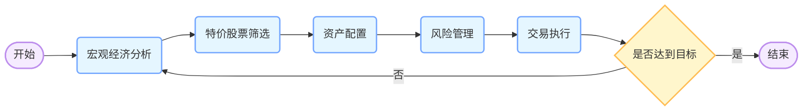

# 如何利用特价股票策略进行全球宏观对冲

> 关键词：特价股票策略、全球宏观对冲、金融市场、风险管理、量化分析

> 摘要：本文深入探讨了如何运用特价股票策略开展全球宏观对冲。首先介绍了相关背景知识，包括目的、预期读者等。接着阐述了核心概念及其联系，详细讲解了核心算法原理与操作步骤，并给出了相应的数学模型和公式。通过实际案例展示了特价股票策略在全球宏观对冲中的应用，分析了开发环境搭建、代码实现与解读。同时列举了该策略的实际应用场景，推荐了学习资源、开发工具框架和相关论文著作。最后总结了未来发展趋势与挑战，并提供了常见问题解答和扩展阅读参考资料，旨在为投资者和相关从业者提供全面且深入的指导。

## 1. 背景介绍 
### 1.1 目的和范围
全球宏观对冲是一种投资策略，旨在通过对全球宏观经济趋势的分析，在不同国家和地区的金融市场中进行多空操作，以获取收益并降低风险。特价股票策略则聚焦于寻找被市场低估的股票，利用价格回归价值的原理来获利。本文的目的是将特价股票策略融入全球宏观对冲的框架中，探讨如何利用这种策略在全球范围内进行有效的资产配置和风险对冲。范围涵盖了全球主要金融市场，包括股票市场、债券市场、外汇市场等，同时涉及到量化分析、风险管理等多个领域。

### 1.2 预期读者
本文预期读者主要包括金融投资者、基金经理、量化分析师、金融科技从业者以及对金融市场和投资策略感兴趣的研究人员。这些读者通常具备一定的金融知识和编程基础，希望深入了解特价股票策略在全球宏观对冲中的应用方法和技术细节。

### 1.3 文档结构概述
本文将按照以下结构展开：首先介绍核心概念与联系，帮助读者建立起对特价股票策略和全球宏观对冲的基本认识；接着详细讲解核心算法原理和具体操作步骤，通过 Python 代码进行示例；然后给出相关的数学模型和公式，并结合实际例子进行说明；再通过项目实战展示如何在实际中运用该策略，包括开发环境搭建、代码实现和解读；之后分析该策略的实际应用场景；推荐学习资源、开发工具框架和相关论文著作；最后总结未来发展趋势与挑战，提供常见问题解答和扩展阅读参考资料。

### 1.4 术语表
#### 1.4.1 核心术语定义
- **特价股票策略**：一种投资策略，通过分析股票的基本面和市场价格，寻找被低估的股票进行投资，期望在股票价格回归其内在价值时获得收益。
- **全球宏观对冲**：基于对全球宏观经济形势的分析，在不同国家和地区的金融市场中进行多空操作，以实现资产的保值增值和风险的分散。
- **量化分析**：运用数学和统计学方法，对金融数据进行分析和建模，以辅助投资决策。
- **风险管理**：识别、评估和控制投资过程中的各种风险，确保投资组合的稳定性和安全性。

#### 1.4.2 相关概念解释
- **基本面分析**：通过研究公司的财务报表、行业前景、宏观经济环境等因素，评估股票的内在价值。
- **技术分析**：通过分析股票的价格走势、成交量等市场数据，预测股票价格的未来走势。
- **多空操作**：同时进行买入和卖出操作，通过做多被低估的资产和做空被高估的资产来获取收益。

#### 1.4.3 缩略词列表
- **ETF**：交易型开放式指数基金（Exchange Traded Fund）
- **VAR**：风险价值（Value at Risk）
- **CAPM**：资本资产定价模型（Capital Asset Pricing Model）

## 2. 核心概念与联系 

### 核心概念原理
特价股票策略的核心原理是基于市场的无效性。在金融市场中，由于信息不对称、投资者情绪等因素的影响，股票价格可能会偏离其内在价值。特价股票策略通过对股票的基本面进行深入分析，寻找那些被市场低估的股票，即价格低于其内在价值的股票。一旦市场发现这些股票的真实价值，价格就会回归，从而为投资者带来收益。

全球宏观对冲则是从宏观经济的角度出发，分析全球不同国家和地区的经济形势、政策变化、利率走势等因素，通过在不同市场中进行多空操作来获取收益。例如，当预期某个国家的经济增长放缓时，可以做空该国的股票市场，同时做多其他国家或地区的股票市场或债券市场。

### 架构的文本示意图
特价股票策略与全球宏观对冲的结合可以通过以下架构来实现：
1. **宏观经济分析**：对全球宏观经济形势进行分析，包括经济增长、通货膨胀、利率、汇率等因素，确定投资的大方向。
2. **特价股票筛选**：在各个国家和地区的股票市场中，运用基本面分析方法筛选出被低估的股票。
3. **资产配置**：根据宏观经济分析和特价股票筛选的结果，确定投资组合中不同资产的比例，包括股票、债券、外汇等。
4. **风险管理**：运用风险评估模型对投资组合进行风险评估，采取相应的风险控制措施，如止损、对冲等。
5. **交易执行**：根据资产配置和风险管理的结果，执行具体的交易操作。

### Mermaid 流程图


## 3. 核心算法原理 & 具体操作步骤 

### 核心算法原理
特价股票策略的核心算法主要涉及到股票的估值和筛选。常用的估值方法包括市盈率法（P/E）、市净率法（P/B）、现金流折现法（DCF）等。下面以市盈率法为例进行说明。

市盈率是指股票价格与每股收益的比率，反映了市场对公司盈利能力的预期。一般来说，市盈率越低，说明股票越被低估。计算公式为：

$$P/E = \frac{股价}{每股收益}$$

通过比较不同股票的市盈率，可以筛选出市盈率低于行业平均水平或市场平均水平的股票。

### 具体操作步骤
1. **数据收集**：收集全球主要股票市场的股票数据，包括股价、每股收益、市盈率等。可以使用金融数据提供商（如 Bloomberg、Wind 等）的 API 接口来获取数据。
2. **行业分类**：将收集到的股票按照行业进行分类，以便计算行业平均市盈率。
3. **市盈率计算**：根据收集到的数据，计算每只股票的市盈率。
4. **筛选特价股票**：将每只股票的市盈率与行业平均市盈率进行比较，筛选出市盈率低于行业平均水平的股票。
5. **全球宏观分析**：对全球宏观经济形势进行分析，确定投资的大方向，如做多或做空某些国家或地区的股票市场。
6. **资产配置**：根据宏观分析和特价股票筛选的结果，确定投资组合中不同股票的比例。
7. **风险管理**：运用风险评估模型对投资组合进行风险评估，采取相应的风险控制措施，如止损、对冲等。
8. **交易执行**：根据资产配置和风险管理的结果，执行具体的交易操作。

### Python 源代码实现
```python
import pandas as pd
import numpy as np

# 模拟股票数据
data = {
    '股票代码': ['A', 'B', 'C', 'D', 'E'],
    '股价': [10, 20, 15, 25, 30],
    '每股收益': [1, 2, 1.5, 2.5, 3],
    '行业': ['金融', '金融', '科技', '科技', '消费']
}
df = pd.DataFrame(data)

# 计算市盈率
df['市盈率'] = df['股价'] / df['每股收益']

# 计算行业平均市盈率
industry_avg_pe = df.groupby('行业')['市盈率'].mean()

# 筛选特价股票
df['是否特价股票'] = df.apply(lambda row: row['市盈率'] < industry_avg_pe[row['行业']], axis=1)

# 输出结果
print(df)
```

## 4. 数学模型和公式 & 详细讲解 & 举例说明 

### 市盈率模型
市盈率模型是一种简单而常用的股票估值方法。其基本公式为：

$$P/E = \frac{股价}{每股收益}$$

其中，$P/E$ 表示市盈率，股价是指股票的市场价格，每股收益是指公司每股股票的盈利。

### 详细讲解
市盈率反映了市场对公司盈利能力的预期。一般来说，市盈率越低，说明股票越被低估，投资价值越高；市盈率越高，说明股票越被高估，投资风险越大。但是，市盈率并不是唯一的估值指标，还需要结合其他因素进行综合分析，如公司的成长性、行业前景、宏观经济环境等。

### 举例说明
假设某公司的股价为 20 元，每股收益为 2 元，则该公司的市盈率为：

$$P/E = \frac{20}{2} = 10$$

如果该行业的平均市盈率为 15，则说明该公司的股票可能被低估，具有一定的投资价值。

### 资本资产定价模型（CAPM）
资本资产定价模型是一种用于计算资产预期收益率的模型。其基本公式为：

$$E(R_i) = R_f + \beta_i [E(R_m) - R_f]$$

其中，$E(R_i)$ 表示资产 $i$ 的预期收益率，$R_f$ 表示无风险收益率，$\beta_i$ 表示资产 $i$ 的贝塔系数，$E(R_m)$ 表示市场组合的预期收益率。

### 详细讲解
CAPM 模型认为，资产的预期收益率由无风险收益率和风险溢价两部分组成。风险溢价是指投资者为承担风险而要求的额外收益，与资产的贝塔系数成正比。贝塔系数反映了资产的系统性风险，即资产收益率与市场组合收益率的相关性。

### 举例说明
假设无风险收益率为 3%，市场组合的预期收益率为 10%，某股票的贝塔系数为 1.2，则该股票的预期收益率为：

$$E(R_i) = 3\% + 1.2\times(10\% - 3\%) = 11.4\%$$

## 5. 项目实战：代码实际案例和详细解释说明 

### 5.1  开发环境搭建
1. **安装 Python**：可以从 Python 官方网站（https://www.python.org/downloads/）下载并安装 Python 3.x 版本。
2. **安装必要的库**：使用 pip 命令安装以下库：
    - pandas：用于数据处理和分析。
    - numpy：用于数值计算。
    - matplotlib：用于数据可视化。
    - yfinance：用于获取股票数据。

```bash
pip install pandas numpy matplotlib yfinance
```

### 5.2  源代码详细实现和代码解读
```python
import yfinance as yf
import pandas as pd
import numpy as np
import matplotlib.pyplot as plt

# 定义股票列表
tickers = ['AAPL', 'MSFT', 'GOOG', 'AMZN', 'FB']

# 获取股票数据
data = yf.download(tickers, start='2020-01-01', end='2021-01-01')['Adj Close']

# 计算收益率
returns = data.pct_change().dropna()

# 计算均值和协方差矩阵
mean_returns = returns.mean()
cov_matrix = returns.cov()

# 定义投资组合数量
num_portfolios = 10000

# 初始化空列表
portfolio_returns = []
portfolio_volatilities = []
portfolio_weights = []

# 生成随机投资组合
for _ in range(num_portfolios):
    weights = np.random.random(len(tickers))
    weights /= np.sum(weights)
    portfolio_weights.append(weights)
    returns = np.dot(weights, mean_returns)
    portfolio_returns.append(returns)
    volatility = np.sqrt(np.dot(weights.T, np.dot(cov_matrix, weights)))
    portfolio_volatilities.append(volatility)

# 转换为 DataFrame
portfolios = pd.DataFrame({
    '收益率': portfolio_returns,
    '波动率': portfolio_volatilities,
    '权重': portfolio_weights
})

# 绘制有效前沿
plt.figure(figsize=(10, 6))
plt.scatter(portfolios['波动率'], portfolios['收益率'], c=portfolios['收益率'] / portfolios['波动率'], cmap='viridis')
plt.colorbar(label='夏普比率')
plt.xlabel('波动率')
plt.ylabel('收益率')
plt.title('有效前沿')
plt.show()

# 找到夏普比率最高的投资组合
max_sharpe_portfolio = portfolios.iloc[np.argmax(portfolios['收益率'] / portfolios['波动率'])]
print('夏普比率最高的投资组合：')
print(max_sharpe_portfolio)
```

### 5.3  代码解读与分析
1. **数据获取**：使用 `yfinance` 库从雅虎财经获取指定股票的历史数据。
2. **收益率计算**：计算股票的日收益率，并去除缺失值。
3. **均值和协方差矩阵计算**：计算股票收益率的均值和协方差矩阵。
4. **随机投资组合生成**：生成 10000 个随机投资组合，计算每个投资组合的收益率和波动率。
5. **有效前沿绘制**：使用 `matplotlib` 库绘制有效前沿，即不同投资组合的收益率和波动率的散点图。
6. **夏普比率最高的投资组合**：找到夏普比率最高的投资组合，并输出其相关信息。

## 6. 实际应用场景 
### 资产配置
投资者可以利用特价股票策略和全球宏观对冲的方法，在全球范围内进行资产配置，降低投资组合的风险，提高收益。例如，在经济增长放缓的时期，可以增加债券和防御性股票的配置，减少周期性股票的配置；在经济复苏的时期，可以增加股票和新兴市场资产的配置。

### 对冲基金管理
对冲基金可以运用特价股票策略和全球宏观对冲的方法，进行多空操作，获取绝对收益。例如，对冲基金可以通过做空被高估的股票和做多被低估的股票，实现市场中性的投资策略，降低市场波动对投资组合的影响。

### 风险管理
企业和金融机构可以利用特价股票策略和全球宏观对冲的方法，进行风险管理。例如，企业可以通过对冲外汇风险、利率风险等，降低经营风险；金融机构可以通过构建多元化的投资组合，降低信用风险和市场风险。

## 7. 工具和资源推荐
### 7.1 学习资源推荐
#### 7.1.1 书籍推荐
- 《聪明的投资者》（The Intelligent Investor）：本杰明·格雷厄姆（Benjamin Graham）著，被誉为投资领域的圣经，介绍了价值投资的基本原理和方法。
- 《金融炼金术》（The Alchemy of Finance）：乔治·索罗斯（George Soros）著，阐述了索罗斯的投资哲学和全球宏观对冲策略。
- 《量化投资：策略与技术》：丁鹏著，系统介绍了量化投资的理论和实践，包括量化选股、量化择时、风险控制等方面。

#### 7.1.2 在线课程
- Coursera 上的《金融市场》（Financial Markets）：由耶鲁大学教授罗伯特·席勒（Robert Shiller）授课，介绍了金融市场的基本原理和投资策略。
- edX 上的《量化投资与金融科技》（Quantitative Investment and Financial Technology）：由清华大学教授授课，介绍了量化投资的前沿技术和应用。

#### 7.1.3 技术博客和网站
- 雪球网（https://xueqiu.com/）：国内知名的财经社区，提供股票、基金、债券等金融产品的资讯和分析。
- Seeking Alpha（https://seekingalpha.com/）：国外知名的金融分析网站，提供全球金融市场的新闻、分析和投资建议。

### 7.2 开发工具框架推荐
#### 7.2.1 IDE和编辑器
- PyCharm：一款专业的 Python 集成开发环境，提供代码编辑、调试、版本控制等功能。
- Jupyter Notebook：一种交互式的编程环境，适合数据探索和分析，支持 Python、R 等多种编程语言。

#### 7.2.2 调试和性能分析工具
- PDB：Python 自带的调试工具，可以帮助开发者定位和解决代码中的问题。
- cProfile：Python 自带的性能分析工具，可以分析代码的运行时间和内存使用情况。

#### 7.2.3 相关框架和库
- Pandas：用于数据处理和分析的 Python 库，提供了高效的数据结构和数据操作方法。
- NumPy：用于数值计算的 Python 库，提供了高效的数组和矩阵运算功能。
- Scikit-learn：用于机器学习的 Python 库，提供了丰富的机器学习算法和工具。

### 7.3 相关论文著作推荐
#### 7.3.1 经典论文
- “The Capital Asset Pricing Model: Theory and Evidence”：由 Eugene F. Fama 和 Kenneth R. French 撰写，对资本资产定价模型进行了深入的研究和实证分析。
- “Efficient Capital Markets: A Review of Theory and Empirical Work”：由 Eugene F. Fama 撰写，提出了有效市场假说，对金融市场的效率进行了探讨。

#### 7.3.2 最新研究成果
- SSRN（https://papers.ssrn.com/sol3/）：一个学术论文数据库，提供了全球最新的金融研究成果。
- arXiv（https://arxiv.org/）：一个预印本数据库，提供了物理学、计算机科学、数学等领域的最新研究成果。

#### 7.3.3 应用案例分析
- 《对冲基金风云录》（More Money Than God）：塞巴斯蒂安·马拉比（Sebastian Mallaby）著，介绍了全球知名对冲基金的发展历程和投资策略。
- 《宽客人生》（My Life as a Quant）：伊曼纽尔·德曼（Emanuel Derman）著，讲述了作者在金融领域的职业生涯和量化投资的实践经验。

## 8. 总结：未来发展趋势与挑战
### 未来发展趋势
1. **量化投资的普及**：随着计算机技术和数据分析技术的不断发展，量化投资将越来越普及。投资者将更多地运用量化模型和算法来进行投资决策，提高投资效率和收益。
2. **跨市场和跨资产类别的投资**：全球宏观对冲将越来越注重跨市场和跨资产类别的投资，通过在不同市场和资产类别中进行多空操作，实现风险的分散和收益的最大化。
3. **人工智能和机器学习的应用**：人工智能和机器学习技术将在全球宏观对冲中得到更广泛的应用，如利用深度学习算法进行股票预测、利用强化学习算法进行投资组合优化等。

### 挑战
1. **数据质量和可靠性**：量化投资依赖于大量的金融数据，数据的质量和可靠性直接影响到投资决策的准确性。因此，如何获取高质量、可靠的数据是量化投资面临的一个重要挑战。
2. **模型的有效性和稳定性**：量化模型的有效性和稳定性是量化投资的关键。由于金融市场的复杂性和不确定性，模型可能会出现失效的情况。因此，如何建立有效的、稳定的量化模型是量化投资面临的另一个重要挑战。
3. **监管和合规**：随着金融市场的不断发展和创新，监管和合规要求也越来越严格。量化投资机构需要遵守各种法律法规和监管要求，如反洗钱、投资者保护等。因此，如何在合规的前提下开展量化投资业务是量化投资机构面临的一个重要挑战。

## 9. 附录：常见问题与解答
### 问题 1：特价股票策略一定能获得收益吗？
答：特价股票策略并不能保证一定能获得收益。虽然特价股票策略基于股票价格回归价值的原理，但市场的有效性和不确定性可能导致股票价格长期偏离其内在价值。此外，宏观经济环境、行业竞争、公司基本面等因素的变化也可能影响股票的价格走势。因此，投资者在运用特价股票策略时，需要进行充分的研究和分析，同时结合风险管理措施，降低投资风险。

### 问题 2：全球宏观对冲需要具备哪些知识和技能？
答：全球宏观对冲需要具备以下知识和技能：
1. **宏观经济学知识**：了解全球宏观经济形势、经济政策、利率走势、汇率变化等因素对金融市场的影响。
2. **金融市场知识**：熟悉股票市场、债券市场、外汇市场等金融市场的运作机制和交易规则。
3. **量化分析技能**：掌握数学、统计学和计算机编程等技能，能够运用量化模型和算法进行投资分析和决策。
4. **风险管理技能**：了解风险管理的基本原理和方法，能够运用风险评估模型和工具对投资组合进行风险评估和控制。
5. **投资经验**：具备一定的投资经验，能够在实践中不断总结和提高投资能力。

### 问题 3：如何选择合适的金融数据提供商？
答：选择合适的金融数据提供商需要考虑以下因素：
1. **数据质量**：数据的准确性、完整性和及时性是选择金融数据提供商的重要因素。
2. **数据种类**：不同的金融数据提供商提供的数据种类可能不同，投资者需要根据自己的需求选择提供所需数据的提供商。
3. **数据接口**：金融数据提供商通常提供不同类型的数据接口，如 API 接口、文件接口等。投资者需要选择提供适合自己开发环境和编程语言的数据接口的提供商。
4. **价格**：金融数据提供商的价格也是选择的重要因素之一。投资者需要根据自己的预算选择价格合理的提供商。
5. **客户服务**：良好的客户服务可以帮助投资者解决在使用数据过程中遇到的问题。投资者需要选择提供优质客户服务的提供商。

## 10. 扩展阅读 & 参考资料
### 扩展阅读
- 《金融投资学》：介绍了金融投资的基本原理和方法，包括股票投资、债券投资、基金投资等方面。
- 《期权、期货及其他衍生产品》（Options, Futures, and Other Derivatives）：约翰·赫尔（John C. Hull）著，系统介绍了期权、期货等衍生产品的定价和交易策略。

### 参考资料
- Bloomberg：全球知名的金融信息服务提供商，提供实时金融数据、新闻、分析等服务。
- Wind：国内知名的金融数据提供商，提供股票、基金、债券等金融产品的历史数据和实时数据。
- Yahoo Finance：雅虎财经提供全球金融市场的新闻、行情、数据等服务。

作者：AI天才研究院/AI Genius Institute & 禅与计算机程序设计艺术 /Zen And The Art of Computer Programming