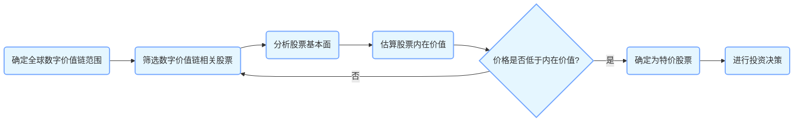

# 如何利用特价股票策略进行全球数字价值链投资

> 关键词：特价股票策略、全球数字价值链、投资、股票分析、数字经济

> 摘要：本文围绕如何利用特价股票策略进行全球数字价值链投资展开深入探讨。首先介绍了相关背景知识，包括目的范围、预期读者等。接着阐述了核心概念与联系，分析了核心算法原理及具体操作步骤，并给出了相应的数学模型和公式。通过项目实战展示了代码实际案例及详细解释。探讨了该策略在实际中的应用场景，推荐了学习资源、开发工具框架和相关论文著作。最后总结了未来发展趋势与挑战，解答常见问题并提供扩展阅读和参考资料，旨在为投资者提供全面且系统的指导，助力其在全球数字价值链投资中运用特价股票策略取得良好收益。

## 1. 背景介绍 
### 1.1 目的和范围
在当今全球化和数字化的时代，全球数字价值链迅速发展，涵盖了从数字技术研发、应用到相关服务的各个环节。特价股票策略作为一种投资方法，旨在寻找被市场低估的股票，以获取潜在的超额收益。本文的目的在于详细介绍如何运用特价股票策略在全球数字价值链领域进行投资，包括策略的原理、操作步骤、实际应用等方面。范围涉及全球范围内与数字价值链相关的各类股票，包括科技公司、互联网企业、数字服务提供商等。

### 1.2 预期读者
本文预期读者主要包括对全球数字价值链投资感兴趣的个人投资者、专业投资机构的从业人员、金融领域的研究人员以及相关专业的学生。无论是初学者希望了解基本的投资策略，还是有一定经验的投资者寻求在数字经济领域拓展投资思路，都能从本文中获得有价值的信息。

### 1.3 文档结构概述
本文将按照以下结构展开：首先介绍核心概念与联系，帮助读者理解特价股票策略和全球数字价值链的基本原理和相互关系；接着阐述核心算法原理及具体操作步骤，通过Python代码详细说明如何筛选特价股票；然后给出相关的数学模型和公式，并举例说明其应用；通过项目实战展示实际的代码案例和详细解释；探讨该策略在实际中的应用场景；推荐学习资源、开发工具框架和相关论文著作；最后总结未来发展趋势与挑战，解答常见问题并提供扩展阅读和参考资料。

### 1.4 术语表
#### 1.4.1 核心术语定义
- **特价股票策略**：一种投资策略，通过分析股票的基本面和市场情况，寻找价格低于其内在价值的股票进行投资，期望在股票价格回归其内在价值时获得收益。
- **全球数字价值链**：指在全球范围内，从数字技术的研发、生产、传播到应用的整个过程中，各个参与主体所形成的价值创造和分配的链条。它包括数字技术创新、数字产品制造、数字服务提供等多个环节。
- **内在价值**：股票的真实价值，通常基于公司的财务状况、盈利能力、行业前景等因素进行评估。
- **市盈率（P/E）**：股票价格与每股收益的比率，用于衡量股票的估值水平。较低的市盈率可能表示股票被低估。
- **市净率（P/B）**：股票价格与每股净资产的比率，反映了市场对公司净资产的估值。

#### 1.4.2 相关概念解释
- **数字经济**：以数字化的知识和信息作为关键生产要素，以现代信息网络作为重要载体，以信息通信技术的有效使用作为效率提升和经济结构优化的重要推动力的一系列经济活动。全球数字价值链是数字经济的重要组成部分。
- **价值投资**：一种投资理念，强调通过深入分析公司的基本面，寻找被低估的股票进行长期投资，以分享公司的成长和价值回归带来的收益。特价股票策略是价值投资的一种具体应用。

#### 1.4.3 缩略词列表
- **P/E**：Price-to-Earnings Ratio，市盈率
- **P/B**：Price-to-Book Ratio，市净率
- **EPS**：Earnings Per Share，每股收益

## 2. 核心概念与联系 

### 核心概念原理
#### 特价股票策略原理
特价股票策略基于价值投资的理念，认为市场有时会对股票的价格产生错误的定价。通过对公司的财务报表、行业竞争地位、宏观经济环境等因素进行分析，可以估算出股票的内在价值。当股票的市场价格低于其内在价值时，该股票就被认为是特价股票，具有投资价值。投资者购买这些特价股票，等待市场发现其真实价值，从而实现价格的上涨，获得投资收益。

#### 全球数字价值链原理
全球数字价值链是数字经济时代的产物，它将全球范围内的数字技术研发、生产和应用环节紧密连接在一起。在这个价值链中，不同的企业和国家扮演着不同的角色。一些企业专注于数字技术的研发，如芯片设计、软件开发等；一些企业则负责数字产品的生产和制造，如智能手机、服务器等；还有一些企业提供数字服务，如互联网金融、电子商务等。各个环节相互依存、相互促进，共同推动全球数字经济的发展。

### 架构的文本示意图
全球数字价值链可以看作是一个多层次的架构，底层是数字技术研发层，包括基础科学研究、芯片设计、软件开发等；中间层是数字产品制造层，涵盖智能手机、电脑、服务器等硬件设备的生产；上层是数字服务应用层，如互联网金融、电子商务、在线教育等。特价股票策略则是在这个价值链的各个环节中寻找被低估的股票进行投资。

### Mermaid 流程图


## 3. 核心算法原理 & 具体操作步骤 

### 核心算法原理
在运用特价股票策略进行全球数字价值链投资时，核心算法主要包括以下几个方面：
- **财务指标筛选**：通过分析股票的市盈率（P/E）、市净率（P/B）、每股收益（EPS）等财务指标，筛选出估值较低的股票。一般来说，较低的P/E和P/B值可能表示股票被低估。
- **内在价值估算**：采用现金流折现法（DCF）等方法估算股票的内在价值。现金流折现法的基本原理是将公司未来的现金流按照一定的折现率折现到当前，得到公司的内在价值。
- **风险评估**：考虑公司的行业竞争地位、财务风险、宏观经济环境等因素，对股票的投资风险进行评估。

### 具体操作步骤及Python源代码
#### 步骤1：获取股票数据
我们可以使用`pandas-datareader`库从雅虎财经获取股票数据。
```python
import pandas as pd
import pandas_datareader.data as web
import datetime

# 定义股票代码和时间范围
stock_symbol = 'AAPL'  # 以苹果公司为例
start_date = datetime.datetime(2020, 1, 1)
end_date = datetime.datetime(2023, 12, 31)

# 获取股票数据
stock_data = web.DataReader(stock_symbol, 'yahoo', start_date, end_date)
print(stock_data.head())
```
#### 步骤2：计算财务指标
计算市盈率（P/E）和市净率（P/B）等财务指标。
```python
# 假设我们已经获取了每股收益（EPS）和每股净资产（BVPS）数据
eps = 5.0  # 示例数据
bvps = 20.0  # 示例数据

# 计算最新股价
latest_price = stock_data['Close'].iloc[-1]

# 计算市盈率和市净率
pe_ratio = latest_price / eps
pb_ratio = latest_price / bvps

print(f"市盈率: {pe_ratio}")
print(f"市净率: {pb_ratio}")
```
#### 步骤3：估算内在价值（现金流折现法）
```python
import numpy as np

# 假设公司未来5年的自由现金流预测
fcff_forecast = [100, 120, 140, 160, 180]  # 示例数据
discount_rate = 0.1  # 折现率

# 计算未来现金流的现值
pv_fcff = []
for i, fcff in enumerate(fcff_forecast):
    pv = fcff / ((1 + discount_rate) ** (i + 1))
    pv_fcff.append(pv)

# 计算永续价值
terminal_growth_rate = 0.03  # 永续增长率
terminal_value = fcff_forecast[-1] * (1 + terminal_growth_rate) / (discount_rate - terminal_growth_rate)
pv_terminal_value = terminal_value / ((1 + discount_rate) ** len(fcff_forecast))

# 计算公司内在价值
intrinsic_value = sum(pv_fcff) + pv_terminal_value

print(f"公司内在价值: {intrinsic_value}")
```
#### 步骤4：筛选特价股票
根据计算得到的财务指标和内在价值，筛选出价格低于内在价值的股票。
```python
if latest_price < intrinsic_value:
    print(f"{stock_symbol} 是特价股票，可以考虑投资。")
else:
    print(f"{stock_symbol} 不是特价股票，暂不考虑投资。")
```

## 4. 数学模型和公式 & 详细讲解 & 举例说明 

### 市盈率（P/E）公式
市盈率是股票价格与每股收益的比率，计算公式为：
$$P/E = \frac{Price}{EPS}$$
其中，$Price$ 是股票的市场价格，$EPS$ 是每股收益。

例如，某股票的市场价格为50元，每股收益为5元，则该股票的市盈率为：
$$P/E = \frac{50}{5} = 10$$

### 市净率（P/B）公式
市净率是股票价格与每股净资产的比率，计算公式为：
$$P/B = \frac{Price}{BVPS}$$
其中，$Price$ 是股票的市场价格，$BVPS$ 是每股净资产。

例如，某股票的市场价格为30元，每股净资产为10元，则该股票的市净率为：
$$P/B = \frac{30}{10} = 3$$

### 现金流折现法（DCF）公式
现金流折现法的基本公式为：
$$V = \sum_{t=1}^{n} \frac{FCFF_t}{(1 + r)^t} + \frac{TV}{(1 + r)^n}$$
其中，$V$ 是公司的内在价值，$FCFF_t$ 是第 $t$ 年的自由现金流，$r$ 是折现率，$n$ 是预测期数，$TV$ 是永续价值。

永续价值的计算公式为：
$$TV = \frac{FCFF_n \times (1 + g)}{r - g}$$
其中，$FCFF_n$ 是预测期最后一年的自由现金流，$g$ 是永续增长率。

例如，假设某公司未来5年的自由现金流预测分别为100万元、120万元、140万元、160万元、180万元，折现率为10%，永续增长率为3%。则该公司的内在价值计算如下：
1. 计算未来现金流的现值：
    - 第1年：$PV_1 = \frac{100}{(1 + 0.1)^1} \approx 90.91$（万元）
    - 第2年：$PV_2 = \frac{120}{(1 + 0.1)^2} \approx 99.17$（万元）
    - 第3年：$PV_3 = \frac{140}{(1 + 0.1)^3} \approx 105.18$（万元）
    - 第4年：$PV_4 = \frac{160}{(1 + 0.1)^4} \approx 109.29$（万元）
    - 第5年：$PV_5 = \frac{180}{(1 + 0.1)^5} \approx 111.74$（万元）
2. 计算永续价值：
    - $TV = \frac{180 \times (1 + 0.03)}{0.1 - 0.03} \approx 2657.14$（万元）
    - $PV_{TV} = \frac{2657.14}{(1 + 0.1)^5} \approx 1652.90$（万元）
3. 计算公司内在价值：
    - $V = 90.91 + 99.17 + 105.18 + 109.29 + 111.74 + 1652.90 \approx 2169.19$（万元）

## 5. 项目实战：代码实际案例和详细解释说明 

### 5.1  开发环境搭建
#### 安装Python
首先，确保你已经安装了Python。可以从Python官方网站（https://www.python.org/downloads/）下载适合你操作系统的Python版本。建议安装Python 3.7及以上版本。

#### 安装必要的库
使用`pip`命令安装所需的库：
```sh
pip install pandas pandas-datareader numpy
```

### 5.2  源代码详细实现和代码解读
```python
import pandas as pd
import pandas_datareader.data as web
import datetime
import numpy as np

# 步骤1：定义股票列表和时间范围
stock_symbols = ['AAPL', 'GOOG', 'MSFT']  # 示例股票列表
start_date = datetime.datetime(2020, 1, 1)
end_date = datetime.datetime(2023, 12, 31)

# 步骤2：获取股票数据并筛选特价股票
for stock_symbol in stock_symbols:
    try:
        # 获取股票数据
        stock_data = web.DataReader(stock_symbol, 'yahoo', start_date, end_date)
        
        # 假设我们已经获取了每股收益（EPS）和每股净资产（BVPS）数据
        eps = 5.0  # 示例数据
        bvps = 20.0  # 示例数据
        
        # 计算最新股价
        latest_price = stock_data['Close'].iloc[-1]
        
        # 计算市盈率和市净率
        pe_ratio = latest_price / eps
        pb_ratio = latest_price / bvps
        
        # 假设公司未来5年的自由现金流预测
        fcff_forecast = [100, 120, 140, 160, 180]  # 示例数据
        discount_rate = 0.1  # 折现率
        
        # 计算未来现金流的现值
        pv_fcff = []
        for i, fcff in enumerate(fcff_forecast):
            pv = fcff / ((1 + discount_rate) ** (i + 1))
            pv_fcff.append(pv)
        
        # 计算永续价值
        terminal_growth_rate = 0.03  # 永续增长率
        terminal_value = fcff_forecast[-1] * (1 + terminal_growth_rate) / (discount_rate - terminal_growth_rate)
        pv_terminal_value = terminal_value / ((1 + discount_rate) ** len(fcff_forecast))
        
        # 计算公司内在价值
        intrinsic_value = sum(pv_fcff) + pv_terminal_value
        
        # 筛选特价股票
        if latest_price < intrinsic_value:
            print(f"{stock_symbol} 是特价股票，可以考虑投资。")
            print(f"市盈率: {pe_ratio}")
            print(f"市净率: {pb_ratio}")
            print(f"内在价值: {intrinsic_value}")
        else:
            print(f"{stock_symbol} 不是特价股票，暂不考虑投资。")
    except Exception as e:
        print(f"获取 {stock_symbol} 数据时出现错误: {e}")
```

### 5.3  代码解读与分析
- **股票列表和时间范围定义**：定义了一个包含多个股票代码的列表`stock_symbols`，以及数据获取的时间范围`start_date`和`end_date`。
- **数据获取**：使用`pandas-datareader`库从雅虎财经获取每个股票的数据。
- **财务指标计算**：计算市盈率（P/E）和市净率（P/B）等财务指标。
- **内在价值估算**：采用现金流折现法（DCF）估算股票的内在价值。
- **特价股票筛选**：比较股票的市场价格和内在价值，如果市场价格低于内在价值，则认为该股票是特价股票。

## 6. 实际应用场景 
### 个人投资者
个人投资者可以利用特价股票策略在全球数字价值链领域进行投资，通过筛选被低估的数字经济相关股票，构建自己的投资组合。例如，关注新兴的数字技术公司，如人工智能、区块链、云计算等领域的企业，寻找具有成长潜力但当前价格被低估的股票进行投资。

### 专业投资机构
专业投资机构可以将特价股票策略纳入其投资研究体系，对全球数字价值链上的企业进行全面分析和评估。通过大规模的数据挖掘和分析，筛选出具有投资价值的股票，为客户提供投资建议和资产管理服务。

### 风险投资
风险投资机构可以在数字价值链的早期阶段，运用特价股票策略寻找具有潜力的初创企业。通过对企业的技术创新能力、市场前景、团队素质等方面进行评估，投资那些被市场低估但具有高成长潜力的企业，等待企业成长壮大后获得高额回报。

## 7. 工具和资源推荐
### 7.1 学习资源推荐
#### 7.1.1 书籍推荐
- 《聪明的投资者》（The Intelligent Investor）：本杰明·格雷厄姆（Benjamin Graham）著，价值投资领域的经典著作，详细介绍了价值投资的理念和方法。
- 《数字经济：从概念到实践》（Digital Economy: From Concept to Practice）：全面介绍了数字经济的发展现状、趋势和应用场景，有助于投资者了解全球数字价值链的基本情况。
- 《财务报表分析与证券定价》（Financial Statement Analysis and Security Valuation）：斯蒂芬·佩因曼（Stephen Penman）著，深入讲解了如何通过财务报表分析评估企业的价值，为特价股票策略提供了重要的分析工具。

#### 7.1.2 在线课程
- Coursera上的“投资学原理”（Principles of Investment）课程：由知名大学教授授课，系统介绍了投资学的基本原理和方法，包括股票投资、债券投资、投资组合管理等内容。
- edX上的“数字经济与创新”（Digital Economy and Innovation）课程：讲解了数字经济的发展趋势、创新模式和政策环境，帮助学习者了解全球数字价值链的动态。
- Udemy上的“Python金融数据分析”（Python for Financial Analysis）课程：通过实际案例介绍如何使用Python进行金融数据的获取、分析和可视化，为投资者运用特价股票策略提供技术支持。

#### 7.1.3 技术博客和网站
- Seeking Alpha：提供全球股票市场的分析和评论，包括对数字经济相关企业的深入研究和投资建议。
- TechCrunch：专注于科技行业的新闻和分析，报道新兴数字技术公司的发展动态和创新成果，有助于投资者了解数字价值链的前沿趋势。
- Investing.com：提供全球金融市场的实时数据、图表和分析工具，方便投资者进行股票筛选和分析。

### 7.2 开发工具框架推荐
#### 7.2.1 IDE和编辑器
- PyCharm：一款专业的Python集成开发环境，具有代码编辑、调试、版本控制等功能，适合进行Python金融数据分析和投资策略开发。
- Jupyter Notebook：一个交互式的编程环境，支持Python、R等多种编程语言，方便进行数据探索、可视化和代码演示。
- Visual Studio Code：一款轻量级的代码编辑器，支持多种编程语言和插件扩展，可用于Python代码的编写和调试。

#### 7.2.2 调试和性能分析工具
- pdb：Python自带的调试器，可用于调试Python代码，定位程序中的错误和问题。
- cProfile：Python标准库中的性能分析工具，可用于分析Python程序的性能瓶颈，优化代码的执行效率。
- Spyder：一个专门为科学计算和数据分析设计的Python IDE，集成了调试和性能分析工具，方便进行金融数据分析和投资策略开发。

#### 7.2.3 相关框架和库
- pandas：一个强大的数据处理和分析库，提供了丰富的数据结构和函数，可用于金融数据的清洗、处理和分析。
- numpy：一个用于科学计算的Python库，提供了高效的数组操作和数学函数，可用于金融模型的实现和计算。
- scikit-learn：一个机器学习库，提供了多种机器学习算法和工具，可用于股票价格预测、风险评估等投资分析任务。

### 7.3 相关论文著作推荐
#### 7.3.1 经典论文
- Fama, Eugene F., and Kenneth R. French. "The Cross-Section of Expected Stock Returns." The Journal of Finance 47, no. 2 (1992): 427-465. 该论文提出了著名的Fama-French三因子模型，用于解释股票收益率的差异，对投资组合管理和资产定价具有重要影响。
- Sharpe, William F. "Capital Asset Prices: A Theory of Market Equilibrium under Conditions of Risk." The Journal of Finance 19, no. 3 (1964): 425-442. 该论文提出了资本资产定价模型（CAPM），为投资组合理论和资产定价提供了重要的理论基础。

#### 7.3.2 最新研究成果
- 关注顶级金融学术期刊，如The Journal of Finance、The Review of Financial Studies等，了解关于全球数字价值链投资和特价股票策略的最新研究成果。
- 参加金融学术会议，如美国金融协会（AFA）年会、西部金融协会（WFA）年会等，与国内外的学者和研究人员交流最新的研究进展。

#### 7.3.3 应用案例分析
- 阅读专业投资机构的研究报告和案例分析，了解他们在全球数字价值链投资中运用特价股票策略的实际经验和方法。
- 分析成功的投资案例，如巴菲特的投资组合、彼得·林奇的选股策略等，学习他们的投资理念和方法，并结合全球数字价值链的特点进行应用。

## 8. 总结：未来发展趋势与挑战
### 未来发展趋势
- **数字技术创新加速**：随着人工智能、区块链、云计算、大数据等数字技术的不断发展和创新，全球数字价值链将不断拓展和深化。新的数字业务模式和应用场景将不断涌现，为投资者带来更多的投资机会。
- **全球数字经济一体化**：全球化的趋势将促进全球数字经济的一体化发展，各国之间的数字贸易和合作将更加频繁。投资者可以通过投资全球数字价值链上的企业，分享全球数字经济发展的红利。
- **可持续投资理念深入人心**：越来越多的投资者开始关注企业的社会责任和可持续发展能力。在全球数字价值链投资中，具有良好的环境、社会和治理（ESG）表现的企业将更受投资者青睐。

### 挑战
- **技术变革风险**：数字技术发展迅速，技术更新换代快。投资者需要及时了解和掌握最新的数字技术趋势，否则可能会投资于过时的技术和企业，面临技术变革带来的风险。
- **市场竞争激烈**：全球数字价值链领域吸引了大量的投资者和企业，市场竞争激烈。投资者需要具备较强的分析和判断能力，才能在众多的企业中筛选出具有投资价值的特价股票。
- **政策和监管不确定性**：数字经济的发展涉及到众多的政策和监管问题，不同国家和地区的政策和监管环境存在差异。政策和监管的不确定性可能会对全球数字价值链投资产生不利影响。

## 9. 附录：常见问题与解答
### 问题1：如何准确估算股票的内在价值？
解答：估算股票的内在价值是一个复杂的过程，需要综合考虑多个因素。常用的方法包括现金流折现法（DCF）、相对估值法（如市盈率法、市净率法）等。在使用现金流折现法时，需要对公司未来的现金流、折现率和永续增长率进行合理的预测。相对估值法需要选择合适的可比公司进行比较。同时，还需要考虑公司的行业竞争地位、财务风险、宏观经济环境等因素对内在价值的影响。

### 问题2：特价股票一定能获得超额收益吗？
解答：不一定。特价股票策略只是一种投资方法，虽然理论上价格低于内在价值的股票具有投资潜力，但市场是复杂多变的，股票价格的走势受到多种因素的影响。即使股票被低估，也可能由于市场情绪、宏观经济环境等因素导致价格长期不回归其内在价值，甚至继续下跌。因此，投资者在使用特价股票策略时，需要进行充分的风险评估和投资组合管理。

### 问题3：如何获取全球数字价值链相关股票的财务数据？
解答：可以通过多种途径获取股票的财务数据。常见的数据源包括财经网站（如雅虎财经、新浪财经等）、金融数据提供商（如Wind、Bloomberg等）、证券交易所官网等。此外，还可以使用Python等编程语言通过API接口从数据源获取数据，进行自动化的数据处理和分析。

## 10. 扩展阅读 & 参考资料
### 扩展阅读
- 《金融炼金术》（The Alchemy of Finance）：乔治·索罗斯（George Soros）著，介绍了他的投资哲学和市场理论，对投资者的思维方式和投资策略具有启发作用。
- 《创新者的窘境》（The Innovator's Dilemma）：克莱顿·克里斯坦森（Clayton M. Christensen）著，探讨了企业在面对技术创新和市场变革时的困境和应对策略，有助于投资者理解数字经济时代企业的发展规律。

### 参考资料
- 雅虎财经：https://finance.yahoo.com/
- 新浪财经：https://finance.sina.com.cn/
- Coursera：https://www.coursera.org/
- edX：https://www.edx.org/
- Udemy：https://www.udemy.com/
- Seeking Alpha：https://seekingalpha.com/
- TechCrunch：https://techcrunch.com/
- Investing.com：https://www.investing.com/

作者：AI天才研究院/AI Genius Institute & 禅与计算机程序设计艺术 /Zen And The Art of Computer Programming