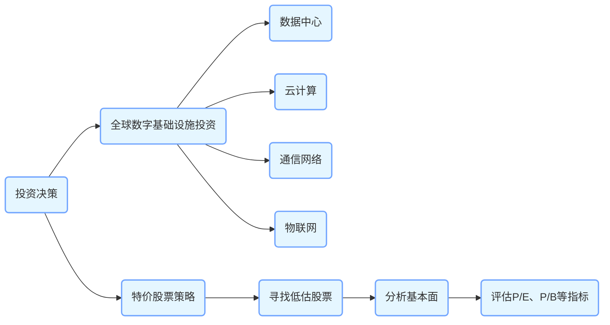

# 如何利用特价股票策略进行全球数字基础设施投资

> 关键词：特价股票策略、全球数字基础设施投资、投资分析、风险控制、收益评估

> 摘要：本文聚焦于如何运用特价股票策略开展全球数字基础设施投资。首先介绍了相关背景知识，包括目的、预期读者等。接着阐述核心概念，剖析特价股票策略与数字基础设施投资的联系，并给出架构示意图和流程图。详细讲解核心算法原理和具体操作步骤，辅以Python代码示例。通过数学模型和公式对投资进行量化分析并举例说明。结合项目实战，展示代码案例及解读。探讨实际应用场景，推荐学习资源、开发工具和相关论文。最后总结未来发展趋势与挑战，解答常见问题并提供扩展阅读和参考资料，旨在为投资者提供全面且专业的投资指导。

## 1. 背景介绍 
### 1.1 目的和范围
随着全球数字化进程的加速，数字基础设施的建设和发展成为推动经济增长的关键力量。数字基础设施涵盖了数据中心、云计算、通信网络等多个领域，具有巨大的投资潜力。而特价股票策略旨在寻找被市场低估的股票，以较低的成本获取潜在的高回报。本文章的目的是探讨如何将特价股票策略应用于全球数字基础设施投资中，为投资者提供一套系统的投资方法和决策依据。

本文章的范围包括全球范围内的数字基础设施相关企业的股票投资，涉及不同国家和地区的市场。将分析特价股票策略的原理、核心算法，以及如何结合数字基础设施行业的特点进行投资决策。同时，会通过实际案例和代码展示具体的操作方法，并探讨投资过程中的风险控制和收益评估。

### 1.2 预期读者
本文预期读者主要包括以下几类人群：
- 个人投资者：对数字基础设施行业感兴趣，希望通过特价股票策略进行投资，实现资产增值的个人。
- 机构投资者：如基金公司、投资银行等，需要对数字基础设施领域进行深入研究和投资决策的专业人士。
- 金融分析师：负责分析市场趋势和股票价值，为投资者提供投资建议的专业人员。
- 技术爱好者：对投资领域的算法和技术实现感兴趣，希望了解如何运用Python等编程语言进行投资分析的技术人员。

### 1.3 文档结构概述
本文将按照以下结构进行组织：
- 核心概念与联系：介绍特价股票策略和全球数字基础设施投资的核心概念，以及它们之间的联系，并给出架构示意图和流程图。
- 核心算法原理 & 具体操作步骤：详细讲解特价股票策略的核心算法原理，并用Python代码实现具体的操作步骤。
- 数学模型和公式 & 详细讲解 & 举例说明：通过数学模型和公式对投资进行量化分析，并举例说明如何应用这些模型和公式进行投资决策。
- 项目实战：代码实际案例和详细解释说明：结合实际案例，展示如何运用特价股票策略进行全球数字基础设施投资的代码实现，并对代码进行详细解读。
- 实际应用场景：探讨特价股票策略在全球数字基础设施投资中的实际应用场景。
- 工具和资源推荐：推荐学习资源、开发工具和相关论文，帮助读者进一步深入学习和研究。
- 总结：未来发展趋势与挑战：总结全球数字基础设施投资的未来发展趋势和面临的挑战。
- 附录：常见问题与解答：解答读者在投资过程中常见的问题。
- 扩展阅读 & 参考资料：提供扩展阅读的资料和参考文献，方便读者进一步研究。

### 1.4 术语表
#### 1.4.1 核心术语定义
- 特价股票策略：一种投资策略，通过寻找被市场低估的股票，以较低的价格买入，等待股票价值回归正常水平后卖出，从而获取投资收益。
- 全球数字基础设施：指在全球范围内支持数字化经济和社会发展的基础设施，包括数据中心、云计算、通信网络、物联网等。
- 市盈率（P/E）：股票价格与每股收益的比率，用于衡量股票的估值水平。
- 市净率（P/B）：股票价格与每股净资产的比率，也是衡量股票估值的重要指标。
- 股息率：股息与股票价格的比率，反映了股票的分红情况。

#### 1.4.2 相关概念解释
- 价值投资：一种投资理念，强调通过分析公司的基本面，寻找被低估的股票进行投资，长期持有以获取公司价值增长带来的收益。
- 成长投资：注重公司的未来成长潜力，投资于具有高增长预期的公司股票。
- 分散投资：将资金分散投资于不同的股票、行业和地区，以降低投资风险。

#### 1.4.3 缩略词列表
- P/E：市盈率（Price-to-Earnings Ratio）
- P/B：市净率（Price-to-Book Ratio）
- ROE：净资产收益率（Return on Equity）
- DCF：现金流折现模型（Discounted Cash Flow Model）

## 2. 核心概念与联系 
### 核心概念原理
#### 特价股票策略原理
特价股票策略基于价值投资的理念，认为市场有时会对股票的价值做出错误的判断，导致某些股票的价格低于其内在价值。投资者通过分析公司的基本面，如财务报表、行业前景等，寻找那些被低估的股票。当市场发现这些股票的真实价值后，股价往往会上涨，投资者可以从中获得收益。

评估股票是否被低估常用的指标包括市盈率（P/E）、市净率（P/B）、股息率等。较低的P/E和P/B值通常意味着股票可能被低估，而较高的股息率则表示股票具有较好的分红能力。

#### 全球数字基础设施投资原理
全球数字基础设施投资的核心在于把握全球数字化发展的趋势。随着互联网、物联网、人工智能等技术的快速发展，对数字基础设施的需求不断增加。数据中心需要不断扩容以存储和处理海量数据，云计算服务的需求也在持续增长，通信网络需要不断升级以提供更快的速度和更低的延迟。

投资数字基础设施相关企业的股票，可以分享行业增长带来的红利。同时，由于数字基础设施具有一定的垄断性和稳定性，相关企业的业绩相对较为可靠，为投资者提供了一定的保障。

### 核心概念架构示意图


该示意图展示了全球数字基础设施投资的主要领域，包括数据中心、云计算、通信网络和物联网。同时，展示了特价股票策略的核心步骤，即寻找低估股票、分析基本面和评估指标。最后，投资决策需要综合考虑全球数字基础设施投资和特价股票策略。

## 3. 核心算法原理 & 具体操作步骤 
### 核心算法原理
特价股票策略的核心算法主要基于对股票基本面的分析和估值指标的计算。以下是具体的算法步骤：

1. **数据收集**：收集全球数字基础设施相关企业的财务数据，包括营业收入、净利润、每股收益、每股净资产等。
2. **指标计算**：根据收集到的数据，计算市盈率（P/E）、市净率（P/B）、股息率等估值指标。
    - 市盈率（P/E）计算公式：$P/E = \frac{股票价格}{每股收益}$
    - 市净率（P/B）计算公式：$P/B = \frac{股票价格}{每股净资产}$
    - 股息率计算公式：$股息率 = \frac{每股股息}{股票价格}$
3. **筛选股票**：根据计算得到的估值指标，筛选出被低估的股票。一般来说，较低的P/E和P/B值，以及较高的股息率的股票更有可能被低估。
4. **风险评估**：对筛选出的股票进行风险评估，考虑公司的财务状况、行业竞争、宏观经济环境等因素。
5. **投资决策**：根据风险评估的结果，结合投资者的风险偏好和投资目标，做出投资决策。

### 具体操作步骤（Python代码实现）
```python
import pandas as pd
import yfinance as yf

# 1. 数据收集
def collect_data(tickers):
    data = {}
    for ticker in tickers:
        stock = yf.Ticker(ticker)
        info = stock.info
        financials = stock.financials
        balance_sheet = stock.balance_sheet
        dividends = stock.dividends
        data[ticker] = {
            'price': info.get('regularMarketPrice'),
            'eps': info.get('trailingEps'),
            'book_value': balance_sheet.loc['Total Stockholder Equity'].iloc[0] / info.get('sharesOutstanding'),
            'dividend': dividends[-1] if not dividends.empty else 0
        }
    return data

# 2. 指标计算
def calculate_metrics(data):
    metrics = {}
    for ticker, values in data.items():
        price = values['price']
        eps = values['eps']
        book_value = values['book_value']
        dividend = values['dividend']
        if eps is not None and eps!= 0:
            pe_ratio = price / eps
        else:
            pe_ratio = None
        if book_value is not None and book_value!= 0:
            pb_ratio = price / book_value
        else:
            pb_ratio = None
        if price is not None and price!= 0:
            dividend_yield = dividend / price
        else:
            dividend_yield = None
        metrics[ticker] = {
            'P/E': pe_ratio,
            'P/B': pb_ratio,
            'Dividend Yield': dividend_yield
        }
    return metrics

# 3. 筛选股票
def filter_stocks(metrics, pe_threshold=15, pb_threshold=1.5, dividend_yield_threshold=0.03):
    filtered_stocks = []
    for ticker, values in metrics.items():
        pe_ratio = values['P/E']
        pb_ratio = values['P/B']
        dividend_yield = values['Dividend Yield']
        if pe_ratio is not None and pe_ratio < pe_threshold and \
           pb_ratio is not None and pb_ratio < pb_threshold and \
           dividend_yield is not None and dividend_yield > dividend_yield_threshold:
            filtered_stocks.append(ticker)
    return filtered_stocks

# 示例使用
tickers = ['AAPL', 'GOOG', 'MSFT']  # 示例股票代码
data = collect_data(tickers)
metrics = calculate_metrics(data)
filtered_stocks = filter_stocks(metrics)
print("筛选出的特价股票：", filtered_stocks)
```

### 代码解释
1. **数据收集**：`collect_data` 函数使用 `yfinance` 库收集指定股票的财务数据，包括股票价格、每股收益、每股净资产和股息。
2. **指标计算**：`calculate_metrics` 函数根据收集到的数据计算市盈率（P/E）、市净率（P/B）和股息率。
3. **筛选股票**：`filter_stocks` 函数根据设定的阈值筛选出被低估的股票。
4. **示例使用**：最后，我们提供了一个示例，展示如何调用这些函数进行股票筛选。

## 4. 数学模型和公式 & 详细讲解 & 举例说明 
### 市盈率（P/E）模型
#### 公式
$P/E = \frac{股票价格}{每股收益}$

#### 详细讲解
市盈率是衡量股票估值的常用指标之一。它反映了投资者为获取公司每股收益所愿意支付的价格。较低的市盈率通常意味着股票被低估，可能具有投资价值；而较高的市盈率则可能表示股票被高估。

需要注意的是，不同行业的市盈率水平可能存在较大差异。一些高增长行业，如科技行业，通常具有较高的市盈率，因为投资者对这些行业的未来增长预期较高。因此，在使用市盈率进行估值时，需要结合行业平均水平进行分析。

#### 举例说明
假设某只股票的价格为50美元，每股收益为5美元，则该股票的市盈率为：

$P/E = \frac{50}{5} = 10$

如果该行业的平均市盈率为15，那么这只股票的市盈率低于行业平均水平，可能被低估。

### 市净率（P/B）模型
#### 公式
$P/B = \frac{股票价格}{每股净资产}$

#### 详细讲解
市净率反映了股票价格与每股净资产的关系。每股净资产是公司的净资产除以总股本，代表了公司的账面价值。较低的市净率意味着股票价格相对较低，可能存在投资机会。

市净率适用于那些资产较为重要的行业，如金融、制造业等。对于一些轻资产行业，如科技行业，市净率的参考价值相对较低。

#### 举例说明
假设某只股票的价格为30美元，每股净资产为20美元，则该股票的市净率为：

$P/B = \frac{30}{20} = 1.5$

如果该行业的平均市净率为2，那么这只股票的市净率低于行业平均水平，可能被低估。

### 股息率模型
#### 公式
$股息率 = \frac{每股股息}{股票价格}$

#### 详细讲解
股息率反映了股票的分红情况。较高的股息率意味着投资者可以获得更多的现金回报。股息率对于那些追求稳定收益的投资者来说是一个重要的指标。

需要注意的是，股息率并不是越高越好。一些公司可能通过高股息来吸引投资者，但这可能会影响公司的未来发展。因此，在分析股息率时，需要结合公司的财务状况和发展前景进行综合考虑。

#### 举例说明
假设某只股票的价格为40美元，每股股息为1美元，则该股票的股息率为：

$股息率 = \frac{1}{40} = 0.025 = 2.5\%$

如果投资者希望获得至少3%的股息率，那么这只股票可能不符合要求。

### 现金流折现模型（DCF）
#### 公式
$V = \sum_{t=1}^{n} \frac{CF_t}{(1 + r)^t} + \frac{TV}{(1 + r)^n}$

其中：
- $V$ 表示股票的内在价值
- $CF_t$ 表示第 $t$ 期的现金流
- $r$ 表示折现率
- $TV$ 表示终值
- $n$ 表示预测期数

#### 详细讲解
现金流折现模型是一种基于未来现金流的估值方法。它通过预测公司未来的现金流，并将其折现到当前时刻，来计算股票的内在价值。

该模型的关键在于准确预测未来现金流和选择合适的折现率。未来现金流的预测需要考虑公司的业务模式、市场前景、竞争状况等因素。折现率则反映了投资者对投资风险的预期，一般可以使用资本资产定价模型（CAPM）来确定。

#### 举例说明
假设某公司预计未来3年的现金流分别为100万元、120万元和150万元，折现率为10%，第3年末的终值为1000万元。则该公司股票的内在价值为：

$V = \frac{100}{(1 + 0.1)^1} + \frac{120}{(1 + 0.1)^2} + \frac{150}{(1 + 0.1)^3} + \frac{1000}{(1 + 0.1)^3}$

$V \approx 90.91 + 99.17 + 112.70 + 751.31 = 1054.09$（万元）

如果该公司的当前市值低于1054.09万元，那么股票可能被低估。

## 5. 项目实战：代码实际案例和详细解释说明 
### 5.1  开发环境搭建
#### 安装Python
首先，需要安装Python环境。可以从Python官方网站（https://www.python.org/downloads/）下载适合自己操作系统的Python版本，并按照安装向导进行安装。

#### 安装必要的库
在命令行中使用以下命令安装所需的库：
```sh
pip install pandas yfinance
```
- `pandas`：用于数据处理和分析。
- `yfinance`：用于获取股票的财务数据。

### 5.2  源代码详细实现和代码解读
以下是一个完整的项目实战代码示例，用于筛选全球数字基础设施相关企业的特价股票：

```python
import pandas as pd
import yfinance as yf

# 1. 数据收集
def collect_data(tickers):
    data = {}
    for ticker in tickers:
        try:
            stock = yf.Ticker(ticker)
            info = stock.info
            financials = stock.financials
            balance_sheet = stock.balance_sheet
            dividends = stock.dividends
            data[ticker] = {
                'price': info.get('regularMarketPrice'),
                'eps': info.get('trailingEps'),
                'book_value': balance_sheet.loc['Total Stockholder Equity'].iloc[0] / info.get('sharesOutstanding'),
                'dividend': dividends[-1] if not dividends.empty else 0
            }
        except Exception as e:
            print(f"获取 {ticker} 数据时出错：{e}")
    return data

# 2. 指标计算
def calculate_metrics(data):
    metrics = {}
    for ticker, values in data.items():
        price = values['price']
        eps = values['eps']
        book_value = values['book_value']
        dividend = values['dividend']
        if eps is not None and eps!= 0:
            pe_ratio = price / eps
        else:
            pe_ratio = None
        if book_value is not None and book_value!= 0:
            pb_ratio = price / book_value
        else:
            pb_ratio = None
        if price is not None and price!= 0:
            dividend_yield = dividend / price
        else:
            dividend_yield = None
        metrics[ticker] = {
            'P/E': pe_ratio,
            'P/B': pb_ratio,
            'Dividend Yield': dividend_yield
        }
    return metrics

# 3. 筛选股票
def filter_stocks(metrics, pe_threshold=15, pb_threshold=1.5, dividend_yield_threshold=0.03):
    filtered_stocks = []
    for ticker, values in metrics.items():
        pe_ratio = values['P/E']
        pb_ratio = values['P/B']
        dividend_yield = values['Dividend Yield']
        if pe_ratio is not None and pe_ratio < pe_threshold and \
           pb_ratio is not None and pb_ratio < pb_threshold and \
           dividend_yield is not None and dividend_yield > dividend_yield_threshold:
            filtered_stocks.append(ticker)
    return filtered_stocks

# 4. 主函数
def main():
    # 全球数字基础设施相关企业的股票代码列表
    tickers = ['AAPL', 'GOOG', 'MSFT', 'AMZN', 'ORCL', 'IBM']
    data = collect_data(tickers)
    metrics = calculate_metrics(data)
    filtered_stocks = filter_stocks(metrics)
    print("筛选出的特价股票：", filtered_stocks)

if __name__ == "__main__":
    main()
```

### 代码解读与分析
#### 数据收集部分
- `collect_data` 函数通过 `yfinance` 库获取指定股票的财务数据。使用 `try-except` 块来捕获可能的异常，确保程序的健壮性。
- 收集的数据包括股票价格、每股收益、每股净资产和股息。

#### 指标计算部分
- `calculate_metrics` 函数根据收集到的数据计算市盈率（P/E）、市净率（P/B）和股息率。
- 对于可能出现的除零错误，使用条件判断进行处理，避免程序崩溃。

#### 筛选股票部分
- `filter_stocks` 函数根据设定的阈值筛选出被低估的股票。只有当市盈率低于15、市净率低于1.5且股息率高于3%时，股票才会被选中。

#### 主函数部分
- `main` 函数定义了全球数字基础设施相关企业的股票代码列表，并依次调用 `collect_data`、`calculate_metrics` 和 `filter_stocks` 函数进行数据收集、指标计算和股票筛选。
- 最后打印出筛选出的特价股票列表。

通过这个项目实战，我们可以看到如何运用Python代码实现特价股票策略在全球数字基础设施投资中的应用。

## 6. 实际应用场景 
### 个人投资者
对于个人投资者来说，利用特价股票策略进行全球数字基础设施投资可以实现资产的增值。个人投资者可以根据自己的风险偏好和投资目标，选择适合自己的数字基础设施相关企业的股票。

例如，一位风险偏好较低的个人投资者可以选择一些股息率较高、财务状况稳定的数字基础设施企业股票，如电信运营商。这些企业通常具有稳定的现金流和分红政策，可以为投资者提供稳定的收益。

而一位风险偏好较高的个人投资者可以关注一些具有高增长潜力的数字基础设施企业，如云服务提供商、芯片制造商等。这些企业虽然估值可能较高，但如果未来能够实现快速增长，投资者可以获得较高的回报。

### 机构投资者
机构投资者，如基金公司、投资银行等，通常会运用特价股票策略进行大规模的全球数字基础设施投资。机构投资者具有更专业的研究团队和更丰富的资源，可以对全球数字基础设施市场进行深入的研究和分析。

基金公司可以发行专门的数字基础设施投资基金，通过筛选被低估的股票构建投资组合，为投资者提供多样化的投资选择。投资银行可以为企业提供融资服务，支持数字基础设施项目的建设和发展。

### 企业战略投资
一些大型企业也会利用特价股票策略进行全球数字基础设施投资，以实现战略布局和业务拓展。例如，一家科技公司可以通过投资数字基础设施相关企业，获取先进的技术和资源，提升自身的竞争力。

企业还可以通过投资数字基础设施企业，实现产业链的整合和协同发展。例如，一家电商企业可以投资物流数据中心和云计算服务提供商，提高物流效率和数据处理能力，从而提升用户体验。

## 7. 工具和资源推荐
### 7.1 学习资源推荐
#### 7.1.1 书籍推荐
- 《聪明的投资者》（The Intelligent Investor）：本杰明·格雷厄姆（Benjamin Graham）著，价值投资的经典之作，介绍了如何通过分析公司基本面寻找被低估的股票。
- 《证券分析》（Security Analysis）：本杰明·格雷厄姆和大卫·多德（David Dodd）著，系统阐述了证券分析的基本原理和方法，对价值投资具有重要的指导意义。
- 《数字经济：智能时代的新范式》：阐述了数字经济的发展趋势和数字基础设施的重要性，帮助读者了解数字基础设施投资的背景和前景。

#### 7.1.2 在线课程
- Coursera上的“投资学原理”（Principles of Investing）课程：由宾夕法尼亚大学教授授课，介绍了投资的基本概念、理论和方法。
- edX上的“金融市场”（Financial Markets）课程：由耶鲁大学教授授课，深入讲解了金融市场的运作机制和投资策略。
- Udemy上的“Python for Finance: Investment Fundamentals & Data Analytics”课程：教授如何使用Python进行金融数据分析和投资决策。

#### 7.1.3 技术博客和网站
- Seeking Alpha：提供全球金融市场的分析和评论，包括股票分析、投资策略等内容。
- Bloomberg：全球知名的金融信息服务提供商，提供实时的金融市场数据和新闻。
- 东方财富网：国内知名的金融网站，提供股票行情、财经新闻、研究报告等丰富的金融信息。

### 7.2 开发工具框架推荐
#### 7.2.1 IDE和编辑器
- PyCharm：一款专业的Python集成开发环境，具有代码编辑、调试、版本控制等强大功能。
- Jupyter Notebook：一种交互式的开发环境，适合进行数据分析和可视化，方便代码的编写和展示。
- Visual Studio Code：一款轻量级的代码编辑器，支持多种编程语言，具有丰富的插件生态系统。

#### 7.2.2 调试和性能分析工具
- pdb：Python自带的调试工具，可以帮助开发者定位和解决代码中的问题。
- cProfile：Python的性能分析工具，可以分析代码的运行时间和函数调用情况，帮助开发者优化代码性能。
- Spyder：一款科学计算和数据分析的集成开发环境，具有强大的调试和性能分析功能。

#### 7.2.3 相关框架和库
- pandas：用于数据处理和分析的Python库，提供了高效的数据结构和数据分析工具。
- numpy：Python的数值计算库，提供了多维数组对象和各种数学函数，用于高效的数值计算。
- scikit-learn：用于机器学习的Python库，提供了各种机器学习算法和工具，可用于股票预测和风险评估。

### 7.3 相关论文著作推荐
#### 7.3.1 经典论文
- “The Capital Asset Pricing Model: Theory and Evidence”：由尤金·法玛（Eugene F. Fama）和肯尼斯·弗兰奇（Kenneth R. French）发表，介绍了资本资产定价模型（CAPM）的理论和实证研究。
- “Efficient Capital Markets: A Review of Theory and Empirical Work”：由尤金·法玛发表，探讨了有效市场假说的理论和实证研究。
- “Value Investing: The Use of Historical Financial Statement Information to Separate Winners from Losers”：由约瑟夫·皮奥特罗斯基（Joseph D. Piotroski）发表，介绍了如何使用历史财务报表信息筛选出具有投资价值的股票。

#### 7.3.2 最新研究成果
- 关注顶级金融学术期刊，如《Journal of Finance》、《Journal of Financial Economics》等，这些期刊发表了最新的金融研究成果，包括股票估值、投资策略等方面的研究。
- 参加金融学术会议，如美国金融协会（American Finance Association）年会，了解最新的研究动态和前沿观点。

#### 7.3.3 应用案例分析
- 可以参考一些知名投资机构的研究报告和投资案例，了解他们如何运用特价股票策略进行全球数字基础设施投资。例如，巴菲特的伯克希尔·哈撒韦公司的投资案例，以及一些大型基金公司的投资组合分析。

## 8. 总结：未来发展趋势与挑战
### 未来发展趋势
#### 数字基础设施需求持续增长
随着全球数字化进程的加速，对数字基础设施的需求将持续增长。数据中心需要不断扩容以存储和处理海量数据，云计算服务的需求也将不断增加，通信网络需要不断升级以提供更快的速度和更低的延迟。这将为数字基础设施相关企业带来广阔的发展空间。

#### 技术创新推动行业变革
人工智能、物联网、区块链等新兴技术的不断发展将推动数字基础设施行业的变革。例如，人工智能可以提高数据中心的运营效率，物联网可以拓展数字基础设施的应用场景，区块链可以增强数据的安全性和可信度。投资者需要关注这些技术创新带来的投资机会。

#### 全球合作与竞争加剧
数字基础设施具有全球性的特点，各国之间的合作与竞争将加剧。一方面，各国将加强在数字基础设施建设方面的合作，共同推动全球数字化发展；另一方面，各国也将在数字基础设施领域展开激烈的竞争，争夺技术和市场优势。投资者需要关注全球市场的动态，把握投资机会。

### 挑战
#### 技术风险
数字基础设施行业技术更新换代较快，企业需要不断投入研发以保持竞争力。如果企业不能及时跟上技术发展的步伐，可能会面临被市场淘汰的风险。投资者需要对企业的技术实力和研发能力进行深入评估。

#### 政策风险
数字基础设施行业受到政策的影响较大。政府可能会出台相关政策来规范行业发展，或者对数字基础设施建设进行投资和补贴。政策的变化可能会对企业的经营和发展产生重大影响。投资者需要关注政策动态，及时调整投资策略。

#### 市场风险
股票市场存在波动，数字基础设施相关企业的股票价格也会受到市场因素的影响。宏观经济环境的变化、行业竞争的加剧等都可能导致股票价格下跌。投资者需要具备一定的风险承受能力，并采取适当的风险控制措施。

## 9. 附录：常见问题与解答
### 1. 特价股票策略一定能获得高收益吗？
特价股票策略并不一定能保证获得高收益。虽然该策略通过寻找被低估的股票来获取投资机会，但市场是复杂多变的，股票价格的走势受到多种因素的影响。即使股票被低估，也可能需要较长的时间才能实现价值回归，甚至可能出现价值无法回归的情况。因此，投资者在使用特价股票策略时，需要结合其他分析方法，进行全面的风险评估。

### 2. 如何确定估值指标的阈值？
估值指标的阈值可以根据行业平均水平、市场环境和个人投资目标来确定。一般来说，可以参考同行业其他公司的估值情况，以及历史数据来确定合理的阈值。例如，对于市盈率，可以参考行业平均市盈率，并结合公司的盈利增长情况进行调整。同时，投资者也可以根据自己的风险偏好和投资目标来灵活调整阈值。

### 3. 如何评估数字基础设施企业的风险？
评估数字基础设施企业的风险可以从以下几个方面入手：
- **财务状况**：分析企业的财务报表，包括营业收入、净利润、资产负债表等，评估企业的盈利能力、偿债能力和现金流状况。
- **行业竞争**：了解企业所处的行业竞争格局，分析企业的市场份额、竞争优势和竞争对手的情况。
- **技术实力**：评估企业的技术研发能力和创新能力，关注企业是否能够跟上技术发展的步伐。
- **政策环境**：关注政府出台的相关政策，了解政策对企业的影响。

### 4. 投资全球数字基础设施股票需要注意哪些问题？
投资全球数字基础设施股票需要注意以下几个问题：
- **市场差异**：不同国家和地区的股票市场存在差异，包括交易规则、监管政策、市场文化等。投资者需要了解这些差异，避免因不熟悉市场规则而造成损失。
- **汇率风险**：投资全球股票需要考虑汇率波动的影响。汇率的变化可能会对投资收益产生影响，投资者可以采取一些汇率风险管理措施，如套期保值等。
- **信息获取**：获取全球市场的信息相对困难，投资者需要选择可靠的信息来源，及时了解企业的经营状况和市场动态。

## 10. 扩展阅读 & 参考资料
### 扩展阅读
- 《金融炼金术》（The Alchemy of Finance）：乔治·索罗斯（George Soros）著，介绍了索罗斯的投资哲学和操作方法，对投资者的思维方式有很大的启发。
- 《黑天鹅：如何应对不可预知的未来》（The Black Swan: The Impact of the Highly Improbable）：纳西姆·尼古拉斯·塔勒布（Nassim Nicholas Taleb）著，探讨了不确定性和意外事件对金融市场的影响，帮助投资者认识到风险的复杂性。
- 《创新者的窘境》（The Innovator's Dilemma: When New Technologies Cause Great Firms to Fail）：克莱顿·克里斯坦森（Clayton M. Christensen）著，分析了创新对企业的影响，以及企业如何应对创新带来的挑战。

### 参考资料
- Yahoo Finance：提供全球股票市场的实时数据和财经新闻，是获取股票信息的重要来源。
- Google Finance：提供股票行情、财经新闻和投资分析工具，方便投资者进行投资决策。
- 中国证券监督管理委员会（CSRC）官网：提供国内证券市场的监管政策和法规，以及上市公司的信息披露。

作者：AI天才研究院/AI Genius Institute & 禅与计算机程序设计艺术 /Zen And The Art of Computer Programming