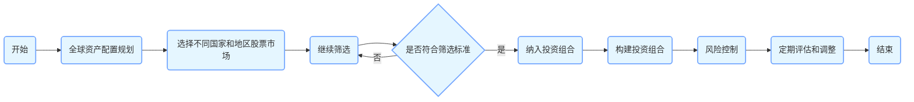

# 如何利用特价股票策略进行全球资产配置

> 关键词：特价股票策略、全球资产配置、价值投资、股票筛选、风险控制

> 摘要：本文旨在深入探讨如何运用特价股票策略进行全球资产配置。通过介绍特价股票策略的核心概念、算法原理、数学模型等内容，结合实际案例详细阐述操作步骤。同时分析其在不同场景下的应用，推荐相关学习资源、开发工具和论文著作。最后总结该策略的未来发展趋势与挑战，为投资者提供全面的指导。

## 1. 背景介绍 
### 1.1 目的和范围
在全球金融市场日益复杂和多元化的今天，投资者面临着众多的投资选择和挑战。全球资产配置作为一种有效的投资策略，能够帮助投资者分散风险、实现资产的长期稳定增值。而特价股票策略则是在全球范围内寻找被低估的股票，以获取超额收益。本文的目的是详细介绍如何利用特价股票策略进行全球资产配置，涵盖了从策略的基本概念到实际操作的各个方面，包括股票筛选、投资组合构建、风险控制等。

### 1.2 预期读者
本文适合对全球资产配置和股票投资感兴趣的各类投资者，包括个人投资者、机构投资者、金融从业者等。无论是初学者希望了解基本的投资概念和方法，还是有一定经验的投资者寻求更高级的投资策略，都能从本文中获得有价值的信息。

### 1.3 文档结构概述
本文将按照以下结构进行阐述：首先介绍核心概念与联系，明确特价股票策略和全球资产配置的基本原理和相互关系；接着详细讲解核心算法原理和具体操作步骤，并结合Python代码进行说明；然后给出数学模型和公式，并举例说明其应用；通过实际项目案例展示代码的实现和解读；分析该策略在不同场景下的实际应用；推荐相关的学习资源、开发工具和论文著作；最后总结未来发展趋势与挑战，并提供常见问题解答和扩展阅读参考资料。

### 1.4 术语表
#### 1.4.1 核心术语定义
- **特价股票策略**：一种基于价值投资理念的投资策略，通过分析股票的基本面和市场价格，寻找被低估的股票进行投资。
- **全球资产配置**：将投资资金分散到不同国家和地区的资产类别中，以降低风险、提高收益。
- **价值投资**：一种投资理念，认为股票的内在价值是决定其价格的基础，投资者应该寻找被低估的股票进行长期投资。
- **市盈率（PE）**：股票价格与每股收益的比率，反映了市场对股票的估值水平。
- **市净率（PB）**：股票价格与每股净资产的比率，用于衡量股票的估值是否合理。

#### 1.4.2 相关概念解释
- **股票筛选**：根据一定的标准和条件，从众多股票中筛选出符合要求的股票。
- **投资组合**：由多种资产组成的集合，通过合理配置不同资产的比例，实现风险和收益的平衡。
- **风险控制**：通过各种方法和手段，降低投资过程中的风险，保护投资者的资产安全。

#### 1.4.3 缩略词列表
- **PE**：市盈率（Price-to-Earnings Ratio）
- **PB**：市净率（Price-to-Book Ratio）
- **ROE**：净资产收益率（Return on Equity）

## 2. 核心概念与联系 

### 核心概念原理
特价股票策略的核心原理基于价值投资理论。价值投资认为，股票的价格会围绕其内在价值波动，当股票价格低于其内在价值时，就被认为是被低估的，具有投资价值。在全球资产配置的背景下，投资者可以利用特价股票策略在不同国家和地区的股票市场中寻找被低估的股票，以实现资产的优化配置。

全球资产配置的原理是通过分散投资降低风险。不同国家和地区的经济发展水平、政治环境、行业结构等因素各不相同，股票市场的表现也会有所差异。通过将投资资金分散到不同国家和地区的股票市场，可以降低单一市场波动对投资组合的影响，提高投资组合的稳定性和收益水平。

### 架构的文本示意图
```plaintext
全球资产配置
├── 不同国家和地区的股票市场
│   ├── 发达国家股票市场
│   │   ├── 美国股票市场
│   │   ├── 欧洲股票市场
│   │   ├── 日本股票市场
│   ├── 新兴市场国家股票市场
│   │   ├── 中国股票市场
│   │   ├── 印度股票市场
│   │   ├── 巴西股票市场
├── 特价股票策略
│   ├── 股票筛选标准
│   │   ├── 低市盈率
│   │   ├── 低市净率
│   │   ├── 高净资产收益率
│   ├── 投资组合构建
│   │   ├── 确定投资比例
│   │   ├── 动态调整
├── 风险控制
│   ├── 分散投资
│   ├── 止损策略
│   ├── 定期评估
```

### Mermaid 流程图


## 3. 核心算法原理 & 具体操作步骤 

### 核心算法原理
特价股票策略的核心算法主要基于对股票基本面指标的分析，常用的指标包括市盈率（PE）、市净率（PB）和净资产收益率（ROE）。通过筛选出低市盈率、低市净率和高净资产收益率的股票，可以找到被低估且具有良好盈利能力的股票。

具体算法步骤如下：
1. 收集全球不同国家和地区股票市场的股票数据，包括股票价格、每股收益、每股净资产等。
2. 计算每只股票的市盈率（PE）、市净率（PB）和净资产收益率（ROE）。
    - 市盈率（PE）计算公式：$PE = \frac{股票价格}{每股收益}$
    - 市净率（PB）计算公式：$PB = \frac{股票价格}{每股净资产}$
    - 净资产收益率（ROE）计算公式：$ROE = \frac{净利润}{净资产}$
3. 根据预设的筛选标准，筛选出符合要求的股票。例如，选择市盈率低于行业平均水平、市净率低于一定阈值且净资产收益率高于一定水平的股票。
4. 对筛选出的股票进行进一步分析和评估，考虑行业前景、公司竞争力等因素，确定最终的投资组合。

### 具体操作步骤

#### 步骤 1：数据收集
可以使用金融数据接口（如雅虎财经、Tushare等）收集全球不同国家和地区股票市场的股票数据。以下是一个使用Python和Tushare库收集股票数据的示例代码：
```python
import tushare as ts

# 设置Tushare token
ts.set_token('your_token')
pro = ts.pro_api()

# 获取中国A股市场股票数据
df = pro.daily_basic(ts_code='', trade_date='20231001', fields='ts_code,close,pe_ttm,pb')
print(df)
```

#### 步骤 2：指标计算
根据收集到的股票数据，计算每只股票的市盈率（PE）、市净率（PB）和净资产收益率（ROE）。以下是一个示例代码：
```python
# 计算市盈率（PE）
df['PE'] = df['close'] / df['eps']

# 计算市净率（PB）
df['PB'] = df['close'] / df['book_value']

# 假设已有净利润和净资产数据，计算净资产收益率（ROE）
df['ROE'] = df['net_profit'] / df['total_equity']
```

#### 步骤 3：股票筛选
根据预设的筛选标准，筛选出符合要求的股票。以下是一个示例代码：
```python
# 筛选市盈率低于20且市净率低于1.5且净资产收益率高于10%的股票
selected_stocks = df[(df['PE'] < 20) & (df['PB'] < 1.5) & (df['ROE'] > 0.1)]
print(selected_stocks)
```

#### 步骤 4：投资组合构建
根据筛选出的股票，确定投资组合中每只股票的投资比例。可以采用等权重分配、市值加权等方法。以下是一个等权重分配的示例代码：
```python
# 假设筛选出10只股票，采用等权重分配
num_stocks = len(selected_stocks)
weights = [1 / num_stocks] * num_stocks
print(weights)
```

## 4. 数学模型和公式 & 详细讲解 & 举例说明 

### 数学模型和公式
#### 市盈率（PE）
$PE = \frac{P}{EPS}$
其中，$P$ 表示股票价格，$EPS$ 表示每股收益。市盈率反映了市场对股票的估值水平，较低的市盈率通常意味着股票被低估。

#### 市净率（PB）
$PB = \frac{P}{BVPS}$
其中，$P$ 表示股票价格，$BVPS$ 表示每股净资产。市净率用于衡量股票的估值是否合理，较低的市净率可能表示股票具有投资价值。

#### 净资产收益率（ROE）
$ROE = \frac{净利润}{净资产}$
净资产收益率反映了公司的盈利能力，较高的净资产收益率表示公司能够有效地利用股东权益创造利润。

#### 投资组合收益率
$R_p = \sum_{i=1}^{n} w_i R_i$
其中，$R_p$ 表示投资组合的收益率，$w_i$ 表示第 $i$ 只股票的投资权重，$R_i$ 表示第 $i$ 只股票的收益率。

#### 投资组合风险（方差）
$\sigma_p^2 = \sum_{i=1}^{n} w_i^2 \sigma_i^2 + 2 \sum_{1\leq i < j\leq n} w_i w_j \rho_{ij} \sigma_i \sigma_j$
其中，$\sigma_p^2$ 表示投资组合的方差，$\sigma_i^2$ 表示第 $i$ 只股票的方差，$\rho_{ij}$ 表示第 $i$ 只股票和第 $j$ 只股票的相关系数。

### 详细讲解
- **市盈率（PE）**：市盈率是投资者常用的估值指标之一。一般来说，市盈率越低，股票越具有投资价值。但需要注意的是，不同行业的市盈率水平可能存在较大差异，因此在使用市盈率进行比较时，应该选择同行业的股票进行对比。
- **市净率（PB）**：市净率反映了股票价格与每股净资产的关系。当市净率低于1时，意味着股票价格低于每股净资产，可能存在被低估的情况。但市净率也不能单独作为投资决策的依据，还需要考虑公司的盈利能力和行业前景等因素。
- **净资产收益率（ROE）**：净资产收益率是衡量公司盈利能力的重要指标。较高的净资产收益率表示公司能够有效地利用股东权益创造利润，具有较强的竞争力。投资者通常会选择净资产收益率较高的公司进行投资。
- **投资组合收益率**：投资组合收益率是由投资组合中每只股票的收益率和投资权重共同决定的。通过合理配置不同股票的投资权重，可以实现投资组合的预期收益率。
- **投资组合风险（方差）**：投资组合风险不仅与每只股票的风险（方差）有关，还与股票之间的相关性有关。通过分散投资，选择相关性较低的股票组成投资组合，可以降低投资组合的风险。

### 举例说明
假设我们有三只股票 A、B、C，其相关数据如下：

| 股票 | 价格（元） | 每股收益（元） | 每股净资产（元） | 收益率 | 方差 |
| ---- | ---- | ---- | ---- | ---- | ---- |
| A | 10 | 1 | 5 | 0.1 | 0.04 |
| B | 20 | 2 | 10 | 0.15 | 0.09 |
| C | 30 | 3 | 15 | 0.2 | 0.16 |

相关系数矩阵如下：

|  | A | B | C |
| ---- | ---- | ---- | ---- |
| A | 1 | 0.5 | 0.3 |
| B | 0.5 | 1 | 0.4 |
| C | 0.3 | 0.4 | 1 |

我们采用等权重分配的方法构建投资组合，即 $w_A = w_B = w_C = \frac{1}{3}$。

#### 计算市盈率（PE）
$PE_A = \frac{10}{1} = 10$
$PE_B = \frac{20}{2} = 10$
$PE_C = \frac{30}{3} = 10$

#### 计算市净率（PB）
$PB_A = \frac{10}{5} = 2$
$PB_B = \frac{20}{10} = 2$
$PB_C = \frac{30}{15} = 2$

#### 计算投资组合收益率
$R_p = \frac{1}{3} \times 0.1 + \frac{1}{3} \times 0.15 + \frac{1}{3} \times 0.2 = 0.15$

#### 计算投资组合风险（方差）
$\sigma_p^2 = (\frac{1}{3})^2 \times 0.04 + (\frac{1}{3})^2 \times 0.09 + (\frac{1}{3})^2 \times 0.16 + 2 \times \frac{1}{3} \times \frac{1}{3} \times 0.5 \times \sqrt{0.04} \times \sqrt{0.09} + 2 \times \frac{1}{3} \times \frac{1}{3} \times 0.3 \times \sqrt{0.04} \times \sqrt{0.16} + 2 \times \frac{1}{3} \times \frac{1}{3} \times 0.4 \times \sqrt{0.09} \times \sqrt{0.16}$
$\sigma_p^2 \approx 0.058$

## 5. 项目实战：代码实际案例和详细解释说明 

### 5.1  开发环境搭建
#### 安装Python
首先需要安装Python，可以从Python官方网站（https://www.python.org/downloads/）下载适合自己操作系统的Python版本进行安装。

#### 安装必要的库
在项目中，我们需要使用一些Python库来进行数据收集、处理和分析，如Tushare、Pandas、Numpy等。可以使用以下命令进行安装：
```sh
pip install tushare pandas numpy
```

### 5.2  源代码详细实现和代码解读
以下是一个完整的利用特价股票策略进行全球资产配置的Python代码示例：
```python
import tushare as ts
import pandas as pd
import numpy as np

# 设置Tushare token
ts.set_token('your_token')
pro = ts.pro_api()

# 步骤1：数据收集
def collect_data():
    # 获取中国A股市场股票数据
    df = pro.daily_basic(ts_code='', trade_date='20231001', fields='ts_code,close,pe_ttm,pb,roe')
    return df

# 步骤2：指标计算
def calculate_metrics(df):
    # 这里假设数据中已经包含PE、PB和ROE指标，无需再次计算
    return df

# 步骤3：股票筛选
def stock_selection(df):
    # 筛选市盈率低于20且市净率低于1.5且净资产收益率高于10%的股票
    selected_stocks = df[(df['pe_ttm'] < 20) & (df['pb'] < 1.5) & (df['roe'] > 10)]
    return selected_stocks

# 步骤4：投资组合构建
def portfolio_construction(selected_stocks):
    num_stocks = len(selected_stocks)
    weights = [1 / num_stocks] * num_stocks
    selected_stocks['weight'] = weights
    return selected_stocks

# 主函数
def main():
    # 数据收集
    data = collect_data()
    
    # 指标计算
    data_with_metrics = calculate_metrics(data)
    
    # 股票筛选
    selected = stock_selection(data_with_metrics)
    
    # 投资组合构建
    portfolio = portfolio_construction(selected)
    
    print(portfolio)

if __name__ == "__main__":
    main()
```

### 代码解读与分析
- **数据收集函数 `collect_data()`**：使用Tushare库获取中国A股市场的股票数据，包括股票代码、收盘价、市盈率（PE）、市净率（PB）和净资产收益率（ROE）。
- **指标计算函数 `calculate_metrics()`**：由于Tushare数据中已经包含了PE、PB和ROE指标，因此这里无需再次计算。
- **股票筛选函数 `stock_selection()`**：根据预设的筛选标准，筛选出市盈率低于20、市净率低于1.5且净资产收益率高于10%的股票。
- **投资组合构建函数 `portfolio_construction()`**：采用等权重分配的方法，为筛选出的股票确定投资权重，并将权重添加到数据框中。
- **主函数 `main()`**：依次调用数据收集、指标计算、股票筛选和投资组合构建函数，最终输出投资组合的信息。

## 6. 实际应用场景 
### 个人投资者
个人投资者可以利用特价股票策略进行全球资产配置，实现资产的长期增值。通过筛选被低估的股票，构建多元化的投资组合，可以降低投资风险，提高收益水平。例如，个人投资者可以将一部分资金投资于发达国家的蓝筹股，另一部分资金投资于新兴市场的成长股，以获取不同市场的投资机会。

### 机构投资者
机构投资者如基金公司、保险公司等，可以将特价股票策略纳入其投资组合管理中。通过大规模的资金配置和专业的研究分析，机构投资者可以更有效地实施特价股票策略，获取超额收益。例如，基金公司可以发行专门的特价股票基金，吸引投资者的资金。

### 跨国企业
跨国企业可以利用特价股票策略进行全球资产配置，优化其财务结构。通过投资于不同国家和地区的股票市场，跨国企业可以降低汇率风险、分散经营风险，提高企业的整体竞争力。例如，跨国企业可以将一部分闲置资金投资于海外股票市场，获取投资收益。

## 7. 工具和资源推荐
### 7.1 学习资源推荐
#### 7.1.1 书籍推荐
- 《聪明的投资者》（The Intelligent Investor）：作者是本杰明·格雷厄姆（Benjamin Graham），被誉为价值投资的圣经，详细介绍了价值投资的理念和方法。
- 《证券分析》（Security Analysis）：同样是本杰明·格雷厄姆的著作，对证券分析的基本原理和方法进行了系统的阐述。
- 《巴菲特致股东的信》（Letters to Shareholders of Berkshire Hathaway）：作者是沃伦·巴菲特（Warren Buffett），通过巴菲特致股东的信，读者可以了解到他的投资理念和经验。

#### 7.1.2 在线课程
- Coursera上的“投资学原理”（Principles of Investing）课程：由知名教授授课，涵盖了投资学的基本概念、理论和方法。
- edX上的“金融市场”（Financial Markets）课程：耶鲁大学教授罗伯特·席勒（Robert Shiller）主讲，深入探讨了金融市场的运行机制和投资策略。

#### 7.1.3 技术博客和网站
- 雪球网（https://xueqiu.com/）：国内知名的投资社区，提供股票行情、财经新闻、投资分析等内容。
- Seeking Alpha（https://seekingalpha.com/）：美国的投资研究网站，提供全球股票市场的分析和评论。

### 7.2 开发工具框架推荐
#### 7.2.1 IDE和编辑器
- PyCharm：一款专业的Python集成开发环境，提供代码编辑、调试、版本控制等功能。
- Jupyter Notebook：一种交互式的开发环境，适合进行数据分析和可视化。

#### 7.2.2 调试和性能分析工具
- PDB：Python自带的调试工具，可以帮助开发者定位和解决代码中的问题。
- cProfile：Python的性能分析工具，可以分析代码的运行时间和内存使用情况。

#### 7.2.3 相关框架和库
- Tushare：提供丰富的金融数据接口，方便开发者获取股票、基金等金融数据。
- Pandas：用于数据处理和分析的Python库，提供了高效的数据结构和数据操作方法。
- Numpy：Python的数值计算库，提供了高效的数组操作和数学函数。

### 7.3 相关论文著作推荐
#### 7.3.1 经典论文
- Fama, Eugene F., and Kenneth R. French. "The Cross-Section of Expected Stock Returns." The Journal of Finance 47.2 (1992): 427-465. 该论文提出了著名的Fama-French三因子模型，对股票收益率的横截面进行了深入研究。
- Sharpe, William F. "Capital Asset Prices: A Theory of Market Equilibrium under Conditions of Risk." The Journal of Finance 19.3 (1964): 425-442. 该论文提出了资本资产定价模型（CAPM），为现代金融理论奠定了基础。

#### 7.3.2 最新研究成果
- 关注顶级金融学术期刊，如The Journal of Finance、The Review of Financial Studies等，了解最新的研究成果和理论进展。

#### 7.3.3 应用案例分析
- 一些金融研究机构和咨询公司会发布关于全球资产配置和特价股票策略的应用案例分析报告，可以通过这些报告了解实际应用中的经验和教训。

## 8. 总结：未来发展趋势与挑战
### 未来发展趋势
- **全球化程度加深**：随着全球经济一体化的不断推进，全球资产配置的需求将进一步增加。特价股票策略作为一种有效的投资策略，将在全球范围内得到更广泛的应用。
- **科技与金融融合**：人工智能、大数据、区块链等技术的发展将为特价股票策略的实施提供更强大的支持。通过数据分析和机器学习算法，可以更准确地筛选出被低估的股票，提高投资决策的效率和准确性。
- **社会责任投资兴起**：投资者越来越关注企业的社会责任和可持续发展，未来特价股票策略可能会与社会责任投资相结合，筛选出既具有投资价值又符合社会责任标准的股票。

### 挑战
- **信息不对称**：全球股票市场信息繁多，投资者可能面临信息不对称的问题。如何获取准确、及时的信息，是实施特价股票策略的关键挑战之一。
- **市场波动风险**：全球股票市场受到多种因素的影响，如经济增长、政治局势、货币政策等，市场波动较大。投资者需要具备较强的风险意识和风险控制能力，以应对市场波动带来的风险。
- **法律法规差异**：不同国家和地区的法律法规存在差异，投资者在进行全球资产配置时需要遵守当地的法律法规。了解和适应不同国家和地区的法律法规，是实施特价股票策略的另一个挑战。

## 9. 附录：常见问题与解答
### 问题1：特价股票策略是否适用于所有投资者？
解答：特价股票策略并不适用于所有投资者。该策略需要投资者具备一定的财务知识和分析能力，能够对股票的基本面进行深入分析。同时，该策略的投资周期较长，需要投资者具备较强的耐心和风险承受能力。对于缺乏投资经验和风险承受能力较低的投资者，建议先进行充分的学习和了解，或者寻求专业投资顾问的帮助。

### 问题2：如何确定特价股票的筛选标准？
解答：特价股票的筛选标准可以根据投资者的投资目标、风险偏好和市场情况进行确定。一般来说，可以参考市盈率（PE）、市净率（PB）、净资产收益率（ROE）等指标。例如，可以选择市盈率低于行业平均水平、市净率低于一定阈值且净资产收益率高于一定水平的股票。同时，还需要考虑行业前景、公司竞争力等因素，综合评估股票的投资价值。

### 问题3：如何进行投资组合的风险控制？
解答：投资组合的风险控制可以从以下几个方面入手：
- **分散投资**：将投资资金分散到不同国家和地区的股票市场、不同行业的股票中，降低单一市场和行业波动对投资组合的影响。
- **止损策略**：设置止损点，当股票价格下跌到一定程度时，及时卖出股票，避免损失进一步扩大。
- **定期评估和调整**：定期对投资组合进行评估和调整，根据市场情况和股票的表现，调整投资组合中股票的投资比例。

## 10. 扩展阅读 & 参考资料
### 扩展阅读
- 《金融炼金术》（The Alchemy of Finance）：作者是乔治·索罗斯（George Soros），介绍了他的投资哲学和实践经验。
- 《黑天鹅》（The Black Swan）：作者是纳西姆·尼古拉斯·塔勒布（Nassim Nicholas Taleb），探讨了不可预测的重大事件对金融市场的影响。

### 参考资料
- Tushare官方文档：https://tushare.pro/document/1
- Pandas官方文档：https://pandas.pydata.org/docs/
- Numpy官方文档：https://numpy.org/doc/

作者：AI天才研究院/AI Genius Institute & 禅与计算机程序设计艺术 /Zen And The Art of Computer Programming