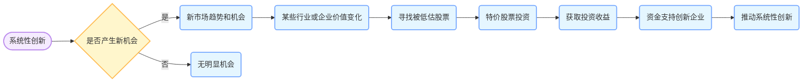

# 如何利用特价股票策略进行系统性创新机会捕捉

> 关键词：特价股票策略、系统性创新、机会捕捉、金融市场、投资分析

> 摘要：本文聚焦于如何运用特价股票策略来捕捉系统性创新机会。首先介绍了相关背景知识，包括目的、预期读者等内容。接着阐述了特价股票策略和系统性创新的核心概念及其联系，并给出了相应的示意图和流程图。详细讲解了核心算法原理，使用Python代码进行示例。同时介绍了相关数学模型和公式，并举例说明。通过项目实战展示了如何搭建开发环境、实现源代码及进行代码解读。探讨了该策略在实际中的应用场景，推荐了学习、开发相关的工具和资源。最后总结了未来发展趋势与挑战，解答了常见问题并提供了扩展阅读和参考资料，旨在为投资者提供全面且深入的指导，帮助他们利用特价股票策略把握系统性创新带来的投资机遇。

## 1. 背景介绍 
### 1.1 目的和范围
在当今复杂多变的金融市场中，投资者面临着众多的投资选择和挑战。特价股票策略作为一种具有潜力的投资方法，旨在通过寻找被市场低估的股票来获取超额收益。而系统性创新则为金融市场带来了新的机遇和变革。本文章的目的在于探讨如何将特价股票策略与系统性创新相结合，以捕捉其中蕴含的投资机会。

文章的范围涵盖了特价股票策略和系统性创新的基本概念、核心算法原理、数学模型、项目实战案例以及实际应用场景等方面。通过全面深入的分析，帮助投资者理解并运用该策略进行系统性创新机会的捕捉。

### 1.2 预期读者
本文的预期读者主要包括以下几类人群：
- **个人投资者**：希望通过学习特价股票策略和系统性创新的相关知识，提高投资决策的科学性和准确性，获取更好的投资回报。
- **金融从业者**：如股票分析师、基金经理等，需要深入了解市场动态和创新机会，以便为客户提供更优质的投资建议和服务。
- **学术研究人员**：对金融市场和投资策略感兴趣的学者，希望通过本文的研究为相关领域的学术研究提供参考和启示。

### 1.3 文档结构概述
本文将按照以下结构进行阐述：
- 核心概念与联系：介绍特价股票策略和系统性创新的核心概念，并分析它们之间的联系，同时给出文本示意图和Mermaid流程图。
- 核心算法原理 & 具体操作步骤：详细讲解用于捕捉系统性创新机会的核心算法原理，并使用Python源代码进行示例。
- 数学模型和公式 & 详细讲解 & 举例说明：介绍相关的数学模型和公式，并通过具体例子进行说明。
- 项目实战：代码实际案例和详细解释说明：通过一个实际项目案例，展示如何搭建开发环境、实现源代码以及对代码进行解读和分析。
- 实际应用场景：探讨特价股票策略在系统性创新机会捕捉中的实际应用场景。
- 工具和资源推荐：推荐学习、开发相关的工具和资源，包括书籍、在线课程、技术博客、开发工具、框架和库以及相关论文著作等。
- 总结：未来发展趋势与挑战：总结特价股票策略在系统性创新机会捕捉方面的未来发展趋势和面临的挑战。
- 附录：常见问题与解答：解答读者在阅读和实践过程中可能遇到的常见问题。
- 扩展阅读 & 参考资料：提供相关的扩展阅读材料和参考资料，方便读者进一步深入学习。

### 1.4 术语表
#### 1.4.1 核心术语定义
- **特价股票策略**：一种投资策略，通过对股票的基本面分析和估值，寻找市场价格低于其内在价值的股票进行投资，以期在股票价格回归内在价值的过程中获取收益。
- **系统性创新**：指在一个系统内发生的、具有广泛影响和变革性的创新活动，它不仅仅是个别技术或产品的创新，而是涉及到整个系统的结构、流程、组织和文化等多个方面的创新。
- **内在价值**：指股票所代表的企业的真实价值，通常通过对企业的财务状况、盈利能力、行业前景等因素进行综合分析和评估得出。
- **超额收益**：指投资组合的实际收益超过市场平均收益的部分，是衡量投资策略有效性的重要指标之一。

#### 1.4.2 相关概念解释
- **价值投资**：一种投资理念，强调通过对股票的内在价值进行分析，选择被低估的股票进行长期投资，以获取稳定的收益。特价股票策略是价值投资的一种具体实现方式。
- **创新驱动发展**：指一个国家或地区通过推动科技创新、制度创新、管理创新等多种创新活动，促进经济增长和社会发展的发展模式。系统性创新是创新驱动发展的重要体现。
- **市场效率**：指市场价格反映所有可用信息的程度。在有效市场中，股票价格能够及时、准确地反映其内在价值，因此很难通过特价股票策略获取超额收益。然而，现实市场往往存在一定的非有效性，为特价股票策略提供了机会。

#### 1.4.3 缩略词列表
- **PE**：市盈率（Price-to-Earnings Ratio），指股票价格与每股收益的比率，是衡量股票估值的常用指标之一。
- **PB**：市净率（Price-to-Book Ratio），指股票价格与每股净资产的比率，也是衡量股票估值的重要指标之一。
- **ROE**：净资产收益率（Return on Equity），指企业净利润与净资产的比率，反映了企业运用自有资本的效率。

## 2. 核心概念与联系 

### 核心概念原理
#### 特价股票策略原理
特价股票策略的核心原理基于价值投资的理念。价值投资者认为，市场有时会出现定价错误，导致某些股票的市场价格低于其内在价值。这些被低估的股票就像是“特价商品”，具有潜在的投资价值。通过对股票的基本面进行深入分析，包括财务报表、行业前景、竞争优势等方面，投资者可以评估股票的内在价值，并找出那些价格被低估的股票进行投资。当市场逐渐认识到这些股票的真实价值时，其价格往往会向内在价值回归，从而为投资者带来收益。

#### 系统性创新原理
系统性创新是一种全面、深入的创新模式，它不仅仅关注个别技术或产品的创新，而是强调在一个系统内各个要素之间的协同创新。系统性创新通常涉及到技术创新、管理创新、制度创新等多个方面，通过打破原有的系统结构和流程，引入新的理念、方法和技术，实现系统的升级和优化。在金融市场中，系统性创新可以表现为新的投资产品、交易机制、风险管理方法等的出现，这些创新往往会带来新的投资机会和市场变化。

### 架构的文本示意图
特价股票策略与系统性创新之间的联系可以用以下文本示意图表示：

系统性创新会带来新的市场趋势和投资机会，这些机会可能会导致某些行业或企业的价值发生变化。特价股票策略则可以通过对这些变化的分析，寻找那些被市场低估的股票。具体来说，系统性创新可能会推动某些新兴行业的发展，这些行业中的企业可能具有较高的成长潜力，但由于市场对其认识不足或存在偏见，其股票价格可能被低估。特价股票策略可以通过对这些企业的基本面分析，发现其内在价值，并在合适的时机进行投资。

同时，特价股票策略的实施也可以为系统性创新提供资金支持。当投资者通过特价股票策略发现了具有创新潜力的企业并进行投资后，这些企业可以获得更多的资金用于研发和创新，从而进一步推动系统性创新的发展。

### Mermaid 流程图


这个流程图展示了系统性创新与特价股票策略之间的循环关系。系统性创新首先会判断是否产生新的机会，如果产生了新机会，就会出现新的市场趋势和机会，导致某些行业或企业的价值发生变化，进而可以通过特价股票策略寻找被低估的股票进行投资。投资获得收益后，资金可以支持创新企业，进一步推动系统性创新的发展。如果没有产生明显机会，则进入无明显机会状态。

## 3. 核心算法原理 & 具体操作步骤 

### 核心算法原理
在利用特价股票策略进行系统性创新机会捕捉时，核心算法主要包括以下几个步骤：

#### 数据收集与预处理
首先需要收集大量的股票相关数据，包括财务数据（如净利润、营业收入、净资产等）、市场数据（如股票价格、成交量等）以及行业数据（如行业增长率、竞争格局等）。对收集到的数据进行清洗和预处理，去除缺失值、异常值等，以确保数据的质量和准确性。

#### 股票估值
使用合适的估值模型对股票的内在价值进行评估。常见的估值模型包括市盈率法、市净率法、现金流折现法等。以市盈率法为例，其基本公式为：

内在价值 = 每股收益 × 合理市盈率

其中，每股收益可以从企业的财务报表中获取，合理市盈率则需要根据行业平均水平、企业的成长潜力等因素进行综合判断。

#### 筛选特价股票
将股票的市场价格与计算得到的内在价值进行比较，筛选出市场价格低于内在价值的股票，即特价股票。可以设置一个折扣率，例如当股票价格低于内在价值的一定比例（如 20%）时，将其视为特价股票。

#### 系统性创新机会分析
对筛选出的特价股票所属的行业和企业进行系统性创新机会分析。可以从技术创新、市场需求、政策环境等多个方面进行评估，判断该行业或企业是否具有系统性创新的潜力。例如，关注行业内是否有新的技术突破、市场需求是否有增长趋势、政策是否对该行业有支持等。

#### 投资组合构建
根据系统性创新机会分析的结果，选择具有较高潜力的特价股票构建投资组合。在构建投资组合时，需要考虑股票的分散性、风险收益特征等因素，以降低投资风险并提高收益。

### 具体操作步骤及 Python 源代码示例

```python
import pandas as pd
import numpy as np

# 步骤 1: 数据收集与预处理
# 假设我们已经从数据库或文件中读取了股票的财务数据和市场数据
# 这里使用一个简单的示例数据
data = {
    'stock_code': ['000001', '000002', '000003'],
    'eps': [1.2, 0.8, 1.5],  # 每股收益
    'market_price': [15, 10, 20],  # 市场价格
    'industry_pe': [12, 10, 15]  # 行业平均市盈率
}
df = pd.DataFrame(data)

# 步骤 2: 股票估值
# 使用市盈率法计算股票的内在价值
df['intrinsic_value'] = df['eps'] * df['industry_pe']

# 步骤 3: 筛选特价股票
# 设置折扣率为 20%
discount_rate = 0.2
df['is_bargain'] = df['market_price'] < df['intrinsic_value'] * (1 - discount_rate)

# 步骤 4: 系统性创新机会分析
# 这里简单假设根据一些条件判断是否有系统性创新机会
# 例如，假设当行业平均市盈率增长超过 10% 时，认为有系统性创新机会
industry_pe_growth = 0.15
df['has_innovation_opportunity'] = df['industry_pe'] * (1 + industry_pe_growth) > df['industry_pe']

# 步骤 5: 投资组合构建
# 选择同时满足特价股票和有系统性创新机会的股票
bargain_innovation_stocks = df[(df['is_bargain']) & (df['has_innovation_opportunity'])]

print(bargain_innovation_stocks)
```

在上述代码中，首先创建了一个包含股票基本信息的 DataFrame，然后使用市盈率法计算了股票的内在价值。接着，根据折扣率筛选出了特价股票，并根据行业平均市盈率的增长情况判断是否有系统性创新机会。最后，选择了同时满足特价股票和有系统性创新机会的股票构建投资组合，并将结果打印输出。

## 4. 数学模型和公式 & 详细讲解 & 举例说明 

### 市盈率法估值模型
#### 公式
市盈率法是一种常用的股票估值方法，其基本公式为：

$$V = EPS \times PE$$

其中，$V$ 表示股票的内在价值，$EPS$ 表示每股收益，$PE$ 表示合理市盈率。

#### 详细讲解
每股收益（$EPS$）是指企业净利润与发行在外普通股股数的比率，反映了每股股票所对应的盈利水平。合理市盈率（$PE$）则需要根据行业平均水平、企业的成长潜力、市场环境等因素进行综合判断。一般来说，具有较高成长潜力的企业可以享受较高的市盈率，而成熟行业的企业市盈率相对较低。

#### 举例说明
假设某公司的每股收益为 2 元，行业平均市盈率为 15 倍。根据市盈率法，该公司股票的内在价值为：

$$V = 2 \times 15 = 30 \text{（元）}$$

如果该公司股票的市场价格为 25 元，低于内在价值 30 元，则可以认为该股票是被低估的特价股票。

### 市净率法估值模型
#### 公式
市净率法的基本公式为：

$$V = BVPS \times PB$$

其中，$V$ 表示股票的内在价值，$BVPS$ 表示每股净资产，$PB$ 表示合理市净率。

#### 详细讲解
每股净资产（$BVPS$）是指企业净资产与发行在外普通股股数的比率，反映了每股股票所对应的净资产价值。合理市净率（$PB$）同样需要根据行业特点、企业的资产质量等因素进行判断。一般来说，资产质量较好、盈利能力较强的企业可以享受较高的市净率。

#### 举例说明
假设某公司的每股净资产为 5 元，行业平均市净率为 2 倍。根据市净率法，该公司股票的内在价值为：

$$V = 5 \times 2 = 10 \text{（元）}$$

如果该公司股票的市场价格为 8 元，低于内在价值 10 元，则该股票可能是被低估的特价股票。

### 现金流折现法估值模型
#### 公式
现金流折现法的基本公式为：

$$V = \sum_{t=1}^{n} \frac{FCF_t}{(1 + r)^t} + \frac{TV}{(1 + r)^n}$$

其中，$V$ 表示股票的内在价值，$FCF_t$ 表示第 $t$ 期的自由现金流，$r$ 表示折现率，$n$ 表示预测期数，$TV$ 表示终值。

#### 详细讲解
自由现金流（$FCF$）是指企业在满足了所有必要的资本支出和营运资金需求后，剩余的可自由支配的现金流量。折现率（$r$）反映了投资者对投资风险的要求，一般可以使用加权平均资本成本（WACC）作为折现率。预测期数（$n$）通常根据企业的发展阶段和行业特点进行确定。终值（$TV$）表示预测期结束后企业的持续经营价值，一般可以使用永续增长模型进行计算。

#### 举例说明
假设某公司未来 5 年的自由现金流分别为 100 万元、120 万元、150 万元、180 万元和 200 万元，折现率为 10%，预测期结束后企业的自由现金流以 3% 的增长率永续增长。首先计算预测期内自由现金流的现值：

$$PV_1 = \frac{100}{(1 + 0.1)^1} = 90.91 \text{（万元）}$$
$$PV_2 = \frac{120}{(1 + 0.1)^2} = 99.17 \text{（万元）}$$
$$PV_3 = \frac{150}{(1 + 0.1)^3} = 112.69 \text{（万元）}$$
$$PV_4 = \frac{180}{(1 + 0.1)^4} = 122.94 \text{（万元）}$$
$$PV_5 = \frac{200}{(1 + 0.1)^5} = 124.18 \text{（万元）}$$

预测期内自由现金流的现值总和为：

$$PV_{FCF} = 90.91 + 99.17 + 112.69 + 122.94 + 124.18 = 549.89 \text{（万元）}$$

然后计算终值：

$$TV = \frac{200 \times (1 + 0.03)}{0.1 - 0.03} = 2942.86 \text{（万元）}$$

终值的现值为：

$$PV_{TV} = \frac{2942.86}{(1 + 0.1)^5} = 1813.04 \text{（万元）}$$

该公司股票的内在价值为：

$$V = PV_{FCF} + PV_{TV} = 549.89 + 1813.04 = 2362.93 \text{（万元）}$$

如果该公司的总股数为 100 万股，则每股内在价值为：

$$V_{per_share} = \frac{2362.93}{100} = 23.63 \text{（元）}$$

如果该公司股票的市场价格低于 23.63 元，则可以认为该股票是被低估的。

## 5. 项目实战：代码实际案例和详细解释说明 

### 5.1  开发环境搭建
#### 操作系统
可以选择 Windows、Linux 或 macOS 等常见的操作系统。这里以 Windows 10 为例进行说明。

#### Python 安装
首先需要安装 Python 环境，建议使用 Python 3.7 及以上版本。可以从 Python 官方网站（https://www.python.org/downloads/）下载安装包，按照安装向导进行安装。在安装过程中，记得勾选“Add Python to PATH”选项，以便在命令行中可以直接使用 Python 命令。

#### 第三方库安装
在使用 Python 进行股票数据分析和投资策略开发时，需要安装一些第三方库，如 Pandas、Numpy、Matplotlib 等。可以使用 pip 命令进行安装，打开命令行工具，输入以下命令：

```sh
pip install pandas numpy matplotlib
```

### 5.2  源代码详细实现和代码解读
以下是一个完整的项目实战代码示例，用于利用特价股票策略进行系统性创新机会捕捉：

```python
import pandas as pd
import numpy as np
import matplotlib.pyplot as plt

# 步骤 1: 数据收集与预处理
# 假设我们已经从数据库或文件中读取了股票的财务数据和市场数据
# 这里使用一个模拟的 CSV 文件作为示例
data = pd.read_csv('stock_data.csv')

# 去除缺失值
data = data.dropna()

# 步骤 2: 股票估值
# 使用市盈率法计算股票的内在价值
industry_avg_pe = data['industry_pe'].mean()  # 计算行业平均市盈率
data['intrinsic_value'] = data['eps'] * industry_avg_pe

# 步骤 3: 筛选特价股票
# 设置折扣率为 20%
discount_rate = 0.2
data['is_bargain'] = data['market_price'] < data['intrinsic_value'] * (1 - discount_rate)

# 步骤 4: 系统性创新机会分析
# 假设根据行业增长率判断是否有系统性创新机会
# 当行业增长率超过 15% 时，认为有系统性创新机会
industry_growth_rate = 0.15
data['has_innovation_opportunity'] = data['industry_growth'] > industry_growth_rate

# 步骤 5: 投资组合构建
# 选择同时满足特价股票和有系统性创新机会的股票
bargain_innovation_stocks = data[(data['is_bargain']) & (data['has_innovation_opportunity'])]

# 步骤 6: 可视化分析
# 绘制特价创新股票的市场价格和内在价值对比图
plt.figure(figsize=(10, 6))
plt.bar(bargain_innovation_stocks['stock_code'], bargain_innovation_stocks['market_price'], label='Market Price')
plt.bar(bargain_innovation_stocks['stock_code'], bargain_innovation_stocks['intrinsic_value'], label='Intrinsic Value', alpha=0.7)
plt.xlabel('Stock Code')
plt.ylabel('Price')
plt.title('Bargain Innovation Stocks: Market Price vs Intrinsic Value')
plt.legend()
plt.show()

# 打印筛选结果
print(bargain_innovation_stocks)
```

### 5.3  代码解读与分析
#### 数据收集与预处理
使用 `pandas` 库的 `read_csv` 函数从 CSV 文件中读取股票数据，并使用 `dropna` 函数去除包含缺失值的行，以确保数据的质量。

#### 股票估值
计算行业平均市盈率，并使用市盈率法计算每只股票的内在价值。

#### 筛选特价股票
设置折扣率为 20%，将市场价格低于内在价值的 80% 的股票标记为特价股票。

#### 系统性创新机会分析
假设根据行业增长率判断是否有系统性创新机会，当行业增长率超过 15% 时，认为该行业具有系统性创新机会。

#### 投资组合构建
选择同时满足特价股票和有系统性创新机会的股票构建投资组合。

#### 可视化分析
使用 `matplotlib` 库绘制特价创新股票的市场价格和内在价值对比图，直观地展示两者之间的差异。

通过以上步骤，我们可以完成一个简单的特价股票策略系统性创新机会捕捉项目，并对筛选结果进行可视化分析。

## 6. 实际应用场景 
### 个人投资者
对于个人投资者来说，利用特价股票策略进行系统性创新机会捕捉可以帮助他们在金融市场中发现被低估的投资机会，提高投资回报。个人投资者可以通过学习和掌握相关的分析方法和工具，自主筛选出具有潜力的特价创新股票，并构建适合自己风险偏好的投资组合。例如，一个对科技行业有一定了解的个人投资者，可以关注科技行业中那些具有创新技术但市场价格被低估的股票，通过长期投资获取超额收益。

### 金融机构
金融机构如基金公司、证券公司等可以将特价股票策略与系统性创新机会捕捉相结合，开发出创新的投资产品和服务。例如，基金公司可以推出专门投资于特价创新股票的基金产品，吸引那些追求高收益的投资者。证券公司可以为客户提供相关的投资咨询服务，帮助客户把握系统性创新带来的投资机会。

### 企业战略投资
企业在进行战略投资时，也可以运用特价股票策略来寻找具有创新潜力的合作伙伴或投资标的。通过投资那些被市场低估但具有系统性创新能力的企业，企业可以获得技术、市场等方面的协同效应，提升自身的竞争力和创新能力。例如，一家传统制造业企业可以投资于一家新兴的科技企业，借助其创新技术实现自身的转型升级。

### 政府政策制定
政府在制定产业政策和金融政策时，可以参考特价股票策略和系统性创新的相关理念。政府可以通过出台相关政策，鼓励和支持企业进行创新活动，促进新兴产业的发展。同时，政府也可以引导金融资源向具有创新潜力的企业和行业倾斜，提高资源配置效率，推动经济的高质量发展。

## 7. 工具和资源推荐
### 7.1 学习资源推荐
#### 7.1.1 书籍推荐
- 《聪明的投资者》（The Intelligent Investor）：作者本杰明·格雷厄姆（Benjamin Graham）是价值投资理论的奠基人，这本书是价值投资领域的经典之作，详细介绍了价值投资的理念和方法，对于理解特价股票策略具有重要的指导意义。
- 《金融炼金术》（The Alchemy of Finance）：作者乔治·索罗斯（George Soros）是著名的投资家，书中阐述了他的反身性理论和投资哲学，对系统性创新和金融市场的动态变化有深刻的见解。
- 《创新者的窘境》（The Innovator's Dilemma）：作者克莱顿·克里斯坦森（Clayton M. Christensen）深入探讨了企业在面对系统性创新时所面临的挑战和机遇，为投资者分析创新企业的发展前景提供了重要的参考。

#### 7.1.2 在线课程
- Coursera 平台上的“Financial Markets”课程：由耶鲁大学教授罗伯特·席勒（Robert Shiller）主讲，涵盖了金融市场的基本理论、投资策略等内容，对于学习特价股票策略和系统性创新在金融市场中的应用有很大帮助。
- edX 平台上的“Introduction to Financial Engineering and Risk Management”课程：该课程介绍了金融工程和风险管理的基本概念和方法，有助于投资者更好地理解金融市场的运行机制和风险特征。

#### 7.1.3 技术博客和网站
- Seeking Alpha：一个提供股票分析、投资策略和市场评论的网站，有很多专业的投资者和分析师在上面分享他们的观点和研究成果。
- ValueWalk：专注于价值投资领域，提供有关特价股票、价值投资策略等方面的最新资讯和分析。
- Medium 上的金融科技相关博客：有很多金融科技领域的专家和从业者在 Medium 上分享他们的研究和实践经验，对于了解系统性创新在金融领域的应用有很大帮助。

### 7.2 开发工具框架推荐
#### 7.2.1 IDE和编辑器
- PyCharm：一款专门为 Python 开发设计的集成开发环境（IDE），具有强大的代码编辑、调试和分析功能，适合进行股票数据分析和投资策略开发。
- Jupyter Notebook：一种交互式的开发环境，支持 Python 等多种编程语言，可以方便地进行数据可视化和代码演示，非常适合进行数据分析和研究。

#### 7.2.2 调试和性能分析工具
- pdb：Python 自带的调试工具，可以帮助开发者在代码运行过程中进行调试和错误排查。
- cProfile：Python 的性能分析工具，可以帮助开发者找出代码中的性能瓶颈，优化代码性能。

#### 7.2.3 相关框架和库
- Pandas：一个强大的数据处理和分析库，提供了丰富的数据结构和数据操作方法，非常适合处理股票数据。
- Numpy：Python 的数值计算库，提供了高效的数组和矩阵运算功能，在股票数据分析中经常使用。
- Matplotlib：Python 的绘图库，可以绘制各种类型的图表，用于数据可视化分析。

### 7.3 相关论文著作推荐
#### 7.3.1 经典论文
- Fama, E. F., & French, K. R. (1992). The cross-section of expected stock returns. Journal of Finance, 47(2), 427-465. 该论文提出了著名的 Fama-French 三因子模型，对股票收益率的横截面差异进行了深入研究，为投资策略的制定提供了重要的理论基础。
- Shiller, R. J. (1981). Do stock prices move too much to be justified by subsequent changes in dividends? American Economic Review, 71(3), 421-436. 这篇论文对股票价格的波动进行了研究，指出股票价格的波动可能超过了其基本面因素所能解释的范围，为价值投资策略提供了理论支持。

#### 7.3.2 最新研究成果
- 通过学术数据库如 IEEE Xplore、ACM Digital Library 等可以搜索到关于金融科技、系统性创新等领域的最新研究成果。这些研究成果可以帮助投资者了解行业的最新发展动态和趋势，为投资决策提供参考。

#### 7.3.3 应用案例分析
- 一些金融研究机构和咨询公司会发布关于投资策略应用案例的研究报告，这些报告可以通过它们的官方网站或专业数据库获取。通过分析这些应用案例，投资者可以学习到如何将特价股票策略和系统性创新机会捕捉应用到实际投资中。

## 8. 总结：未来发展趋势与挑战
### 未来发展趋势
#### 科技驱动的创新加速
随着科技的不断进步，特别是人工智能、大数据、区块链等新兴技术的发展，金融市场的系统性创新将不断加速。这些技术可以为特价股票策略的实施提供更强大的工具和支持，例如通过大数据分析可以更准确地筛选出特价股票，通过人工智能算法可以更智能地进行投资组合构建。

#### 跨行业融合创新
未来，金融市场将与其他行业如科技、医疗、能源等进行更深入的融合创新。这种跨行业的融合将带来更多的系统性创新机会，同时也为特价股票策略的应用提供了更广阔的空间。例如，金融科技的发展将促进金融服务与科技的融合，创造出更多新的金融产品和服务。

#### 绿色金融和可持续投资
随着全球对环境保护和可持续发展的关注度不断提高，绿色金融和可持续投资将成为未来金融市场的重要发展方向。投资者将更加关注企业的环境、社会和治理（ESG）表现，这也将为特价股票策略带来新的机遇。那些在 ESG 方面表现良好但市场价格被低估的企业可能成为投资者的首选。

### 挑战
#### 数据质量和安全问题
在利用特价股票策略进行系统性创新机会捕捉时，需要大量的高质量数据支持。然而，数据的质量和安全问题是一个不容忽视的挑战。数据可能存在缺失、错误、不准确等问题，同时数据的安全也面临着黑客攻击、数据泄露等风险。

#### 市场不确定性和波动性
金融市场具有高度的不确定性和波动性，系统性创新带来的机会也伴随着风险。市场的变化可能导致股票价格的大幅波动，使得原本被认为是特价股票的投资价值发生变化。投资者需要具备较强的风险意识和风险管理能力，以应对市场的不确定性。

#### 技术和人才短缺
科技驱动的创新需要具备相关技术和知识的人才支持。然而，目前金融行业中既懂金融又懂科技的复合型人才相对短缺。同时，一些新兴技术如人工智能、区块链等的应用还面临着技术难题和监管挑战。

## 9. 附录：常见问题与解答
### 问题 1：如何确定合理的市盈率和市净率？
解答：合理的市盈率和市净率需要根据行业特点、企业的成长潜力、市场环境等因素进行综合判断。一般来说，可以参考行业平均水平，并结合企业的历史数据和未来发展前景进行调整。例如，对于具有较高成长潜力的新兴行业企业，可以适当给予较高的市盈率和市净率；而对于成熟行业的企业，则可以参考行业平均水平。

### 问题 2：系统性创新机会分析需要考虑哪些因素？
解答：系统性创新机会分析需要考虑多个因素，包括技术创新、市场需求、政策环境、行业竞争格局等。技术创新是推动系统性创新的核心因素，需要关注行业内是否有新的技术突破和应用。市场需求的变化也是重要的考虑因素，了解市场对新产品、新服务的需求趋势可以帮助判断创新机会的大小。政策环境对行业的发展具有重要影响，政府的支持政策可以促进创新的发展。行业竞争格局的变化也可能带来创新机会，例如新的竞争对手的进入可能促使企业进行创新以保持竞争力。

### 问题 3：如何评估投资组合的风险和收益？
解答：评估投资组合的风险和收益可以使用多种方法。常见的风险评估指标包括标准差、夏普比率、最大回撤等。标准差反映了投资组合收益率的波动程度，标准差越大，风险越高。夏普比率衡量了投资组合每承担一单位风险所获得的超额收益，夏普比率越高，说明投资组合的风险调整后收益越好。最大回撤表示投资组合在一定时间内从最高点到最低点的最大跌幅，反映了投资组合可能面临的最大损失。收益评估可以通过计算投资组合的平均收益率、累计收益率等指标来进行。

### 问题 4：特价股票策略是否适用于所有市场环境？
解答：特价股票策略并不适用于所有市场环境。在有效市场中，股票价格能够及时、准确地反映其内在价值，很难通过特价股票策略获取超额收益。然而，现实市场往往存在一定的非有效性，例如市场情绪波动、信息不对称等因素可能导致股票价格偏离其内在价值，为特价股票策略提供了机会。在市场低迷、投资者情绪悲观时，可能会出现更多被低估的特价股票；而在市场繁荣、投资者情绪乐观时，股票价格可能普遍偏高，特价股票的数量相对较少。因此，投资者需要根据市场环境的变化灵活运用特价股票策略。

## 10. 扩展阅读 & 参考资料
### 扩展阅读
- 《漫步华尔街》（A Random Walk Down Wall Street）：作者伯顿·马尔基尔（Burton G. Malkiel）在书中介绍了各种投资理论和策略，对投资者了解金融市场和投资方法有很大帮助。
- 《穷查理宝典》（Poor Charlie's Almanack）：作者查理·芒格（Charlie Munger）是巴菲特的合作伙伴，书中收录了他的演讲和文章，分享了他的投资智慧和人生哲学。
- 《金融的本质》（The Federal Reserve and the Financial Crisis）：作者本·伯南克（Ben S. Bernanke）详细介绍了美联储在金融危机中的角色和应对措施，对于理解金融市场的运行机制和风险管理有重要意义。

### 参考资料
- Yahoo Finance：提供全球股票市场的实时行情、财务数据、新闻资讯等信息，是投资者获取股票数据的重要来源之一。
- Bloomberg Terminal：专业的金融信息服务平台，提供全面的金融市场数据、分析工具和新闻资讯，广泛应用于金融机构和专业投资者。
- 中国证券监督管理委员会（CSRC）官方网站：提供中国证券市场的政策法规、监管信息、上市公司公告等内容，对于了解中国金融市场的情况非常有帮助。

作者：AI天才研究院/AI Genius Institute & 禅与计算机程序设计艺术 /Zen And The Art of Computer Programming