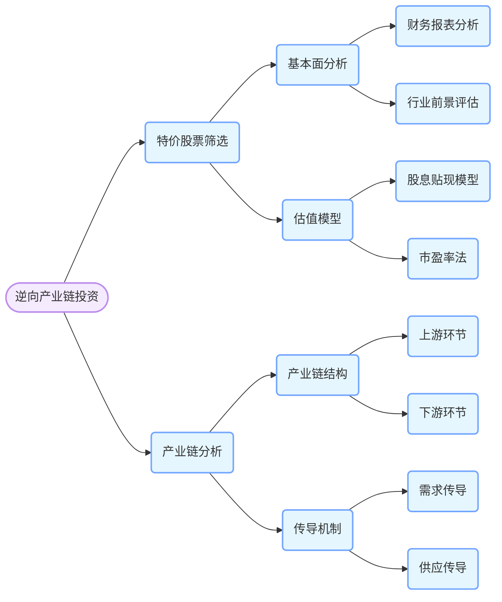

# 如何利用特价股票策略进行逆向产业链投资

> 关键词：特价股票策略、逆向产业链投资、股票估值、产业链分析、投资决策

> 摘要：本文围绕如何利用特价股票策略进行逆向产业链投资展开深入探讨。首先介绍了相关背景知识，包括目的、预期读者等。接着阐述了核心概念及联系，分析了核心算法原理和具体操作步骤，给出了相应的数学模型和公式。通过项目实战案例，详细解释了开发环境搭建、源代码实现及代码解读。还探讨了实际应用场景，推荐了学习资源、开发工具框架以及相关论文著作。最后总结了未来发展趋势与挑战，并提供了常见问题解答和扩展阅读参考资料，旨在为投资者提供全面且深入的投资策略指导。

## 1. 背景介绍 
### 1.1 目的和范围
本文章的目的在于为投资者提供一种独特的投资思路，即利用特价股票策略进行逆向产业链投资。特价股票通常是指那些由于各种原因被市场低估的股票，而逆向产业链投资则是与传统的顺产业链投资相反，从产业链的下游向上游或者从产业链的边缘向核心进行投资。通过这种投资方式，投资者有可能在市场中发现被忽视的投资机会，获取超额收益。

文章的范围涵盖了特价股票策略和逆向产业链投资的基本概念、核心算法原理、数学模型、实际应用案例以及相关的工具和资源推荐等方面，旨在为投资者提供一个全面的投资指南。

### 1.2 预期读者
本文预期读者主要包括对股票投资有一定了解，希望探索新的投资策略的个人投资者；从事金融投资领域的专业人士，如基金经理、投资顾问等；以及对金融投资理论和实践有研究兴趣的学者和学生。

### 1.3 文档结构概述
本文将按照以下结构进行阐述：首先介绍相关的核心概念和它们之间的联系，包括特价股票和逆向产业链投资的定义、原理和架构；接着详细讲解核心算法原理和具体操作步骤，通过 Python 代码进行示例；然后给出相关的数学模型和公式，并进行详细讲解和举例说明；之后通过一个项目实战案例，展示如何在实际中运用这些策略，包括开发环境搭建、源代码实现和代码解读；再探讨该策略的实际应用场景；推荐相关的学习资源、开发工具框架和论文著作；最后总结未来发展趋势与挑战，提供常见问题解答和扩展阅读参考资料。

### 1.4 术语表
#### 1.4.1 核心术语定义
- **特价股票**：指由于市场情绪、行业短期困境、公司暂时的财务问题等原因，导致其市场价格低于其内在价值的股票。
- **逆向产业链投资**：与传统的顺产业链投资方向相反，顺产业链投资通常是从产业链的上游向下游进行投资，而逆向产业链投资则是从产业链的下游向上游或者从产业链的边缘向核心进行投资。
- **产业链**：是各个产业部门之间基于一定的技术经济关联，并依据特定的逻辑关系和时空布局关系客观形成的链条式关联关系形态。

#### 1.4.2 相关概念解释
- **股票内在价值**：是指股票未来现金流量的现值，它是股票的真实价值，不受市场短期波动的影响。通常可以通过各种估值方法来估算，如股息贴现模型、市盈率法等。
- **市场情绪**：是指投资者对市场的整体看法和心理预期，它会影响投资者的买卖决策，从而导致股票价格的波动。当市场情绪悲观时，股票价格可能会被过度低估；当市场情绪乐观时，股票价格可能会被过度高估。

#### 1.4.3 缩略词列表
- **PE**：市盈率（Price-to-Earnings Ratio），是指股票价格除以每股收益的比率，用于衡量股票的估值水平。
- **DCF**：现金流折现模型（Discounted Cash Flow Model），是一种通过预测公司未来的现金流量，并将其折现到当前的价值评估方法。

## 2. 核心概念与联系 
### 核心概念原理
#### 特价股票策略原理
特价股票策略的核心在于寻找那些被市场低估的股票。市场低估可能是由于多种原因造成的，例如公司所在行业面临短期困境、公司内部出现暂时的管理问题、宏观经济环境不佳等。投资者通过对公司的基本面进行深入分析，包括财务报表、行业前景、竞争优势等，来评估股票的内在价值。如果发现股票的市场价格低于其内在价值，就认为该股票是特价股票，具有投资价值。

#### 逆向产业链投资原理
逆向产业链投资的原理是基于产业链各环节之间的相互影响和传导机制。在产业链中，下游需求的变化会向上游传导，而上游供应的变化也会影响下游的生产和销售。逆向产业链投资就是利用这种传导机制，当产业链的下游出现问题时，从上游或者产业链的边缘寻找投资机会。例如，当某一行业的终端产品需求下降时，其上游的原材料供应商可能会受到影响，导致股价下跌。但如果投资者认为这种需求下降是暂时的，那么就可以逆向投资上游的原材料供应商，等待行业复苏时获取收益。

### 架构示意图


该架构图展示了逆向产业链投资的核心要素和流程。首先，逆向产业链投资包括特价股票筛选和产业链分析两个主要方面。特价股票筛选通过基本面分析和估值模型来确定具有投资价值的特价股票；产业链分析则包括对产业链结构和传导机制的研究，以寻找逆向投资的机会。

## 3. 核心算法原理 & 具体操作步骤 
### 核心算法原理
#### 特价股票筛选算法
特价股票筛选的核心算法是通过比较股票的市场价格和内在价值来确定是否为特价股票。内在价值的计算可以采用多种方法，这里我们以股息贴现模型为例。股息贴现模型（DCF）的基本思想是将股票未来的股息现金流折现到当前，得到股票的内在价值。其公式为：

$V = \sum_{t=1}^{n} \frac{D_t}{(1 + r)^t} + \frac{P_n}{(1 + r)^n}$

其中，$V$ 表示股票的内在价值，$D_t$ 表示第 $t$ 期的股息，$r$ 表示贴现率，$P_n$ 表示第 $n$ 期的股票价格。

#### 逆向产业链投资决策算法
逆向产业链投资决策算法主要是基于产业链的传导机制和特价股票的筛选结果。当产业链的下游出现问题时，首先分析其对上游和产业链边缘环节的影响，确定可能受到低估的股票。然后，对这些股票进行特价股票筛选，选择具有投资价值的股票进行投资。

### 具体操作步骤
#### 步骤 1：产业链分析
- 确定目标产业链：选择一个具有研究价值和投资潜力的产业链，例如新能源汽车产业链、半导体产业链等。
- 绘制产业链图谱：明确产业链的各个环节，包括上游的原材料供应商、中游的零部件制造商和下游的终端产品制造商等。
- 分析产业链传导机制：研究产业链各环节之间的需求传导和供应传导关系，了解下游需求变化对上游的影响。

#### 步骤 2：特价股票筛选
- 收集股票数据：收集目标产业链相关股票的财务报表、股息数据、市场价格等信息。
- 计算内在价值：使用股息贴现模型或其他估值方法计算股票的内在价值。
- 筛选特价股票：比较股票的市场价格和内在价值，选择市场价格低于内在价值的股票作为特价股票。

#### 步骤 3：投资决策
- 评估投资风险：对筛选出的特价股票进行风险评估，考虑行业前景、公司竞争力、财务状况等因素。
- 制定投资计划：根据风险评估结果，制定投资计划，包括投资金额、投资时间、止损点等。
- 实施投资：按照投资计划进行股票投资。

### Python 代码示例
```python
import pandas as pd
import numpy as np

# 股息贴现模型计算股票内在价值
def dcf_valuation(dividends, discount_rate, terminal_value):
    n = len(dividends)
    present_values = []
    for t in range(n):
        present_value = dividends[t] / ((1 + discount_rate) ** (t + 1))
        present_values.append(present_value)
    terminal_present_value = terminal_value / ((1 + discount_rate) ** n)
    present_values.append(terminal_present_value)
    intrinsic_value = sum(present_values)
    return intrinsic_value

# 示例数据
dividends = [1.0, 1.2, 1.4, 1.6, 1.8]
discount_rate = 0.1
terminal_value = 20

# 计算内在价值
intrinsic_value = dcf_valuation(dividends, discount_rate, terminal_value)
print(f"股票内在价值: {intrinsic_value}")

# 假设市场价格
market_price = 15

# 判断是否为特价股票
if market_price < intrinsic_value:
    print("该股票是特价股票，具有投资价值。")
else:
    print("该股票不是特价股票，不建议投资。")
```

在上述代码中，我们定义了一个 `dcf_valuation` 函数来计算股票的内在价值。然后，我们使用示例数据调用该函数计算内在价值，并与假设的市场价格进行比较，判断该股票是否为特价股票。

## 4. 数学模型和公式 & 详细讲解 & 举例说明 
### 股息贴现模型（DCF）
#### 公式
$V = \sum_{t=1}^{n} \frac{D_t}{(1 + r)^t} + \frac{P_n}{(1 + r)^n}$

其中：
- $V$：股票的内在价值
- $D_t$：第 $t$ 期的股息
- $r$：贴现率
- $P_n$：第 $n$ 期的股票价格
- $n$：预测期数

#### 详细讲解
股息贴现模型的基本思想是将股票未来的股息现金流折现到当前，得到股票的内在价值。公式中的第一项 $\sum_{t=1}^{n} \frac{D_t}{(1 + r)^t}$ 表示未来 $n$ 期股息的现值之和，第二项 $\frac{P_n}{(1 + r)^n}$ 表示第 $n$ 期股票价格的现值。贴现率 $r$ 反映了投资者对股票投资的风险要求，通常可以使用市场利率或公司的加权平均资本成本（WACC）来确定。

#### 举例说明
假设某股票未来 5 年的股息分别为 $1$ 元、$1.2$ 元、$1.4$ 元、$1.6$ 元、$1.8$ 元，第 5 年末的股票价格预计为 $20$ 元，贴现率为 $10\%$。则该股票的内在价值计算如下：

$V = \frac{1}{(1 + 0.1)^1} + \frac{1.2}{(1 + 0.1)^2} + \frac{1.4}{(1 + 0.1)^3} + \frac{1.6}{(1 + 0.1)^4} + \frac{1.8}{(1 + 0.1)^5} + \frac{20}{(1 + 0.1)^5}$

$V = 0.9091 + 0.9917 + 1.0518 + 1.0929 + 1.1173 + 12.4184$

$V \approx 17.58$（元）

如果该股票的市场价格为 $15$ 元，由于市场价格低于内在价值，我们可以认为该股票是特价股票，具有投资价值。

### 市盈率法（PE）
#### 公式
$V = EPS \times PE$

其中：
- $V$：股票的内在价值
- $EPS$：每股收益
- $PE$：市盈率

#### 详细讲解
市盈率法是一种简单常用的股票估值方法，它通过将每股收益乘以市盈率来估算股票的内在价值。市盈率反映了市场对公司盈利的预期和估值水平，不同行业和公司的市盈率可能会有所不同。一般来说，市盈率越高，市场对公司的未来盈利预期越高；市盈率越低，市场对公司的未来盈利预期越低。

#### 举例说明
假设某公司的每股收益为 $2$ 元，行业平均市盈率为 $15$ 倍。则该公司股票的内在价值计算如下：

$V = 2 \times 15 = 30$（元）

如果该股票的市场价格为 $25$ 元，由于市场价格低于内在价值，我们可以认为该股票是特价股票，具有投资价值。

## 5. 项目实战：代码实际案例和详细解释说明 
### 5.1  开发环境搭建
#### 安装 Python
首先，需要安装 Python 编程语言。可以从 Python 官方网站（https://www.python.org/downloads/）下载适合自己操作系统的 Python 版本，并按照安装向导进行安装。

#### 安装必要的库
在项目中，我们需要使用一些 Python 库来处理数据和进行计算，例如 `pandas`、`numpy` 等。可以使用 `pip` 命令来安装这些库：

```sh
pip install pandas numpy
```

### 5.2  源代码详细实现和代码解读
```python
import pandas as pd
import numpy as np

# 读取股票数据
def read_stock_data(file_path):
    data = pd.read_csv(file_path)
    return data

# 股息贴现模型计算股票内在价值
def dcf_valuation(dividends, discount_rate, terminal_value):
    n = len(dividends)
    present_values = []
    for t in range(n):
        present_value = dividends[t] / ((1 + discount_rate) ** (t + 1))
        present_values.append(present_value)
    terminal_present_value = terminal_value / ((1 + discount_rate) ** n)
    present_values.append(terminal_present_value)
    intrinsic_value = sum(present_values)
    return intrinsic_value

# 筛选特价股票
def select_bargain_stocks(data, discount_rate):
    bargain_stocks = []
    for index, row in data.iterrows():
        dividends = row['dividends'].split(',')
        dividends = [float(d) for d in dividends]
        terminal_value = float(row['terminal_value'])
        market_price = float(row['market_price'])
        intrinsic_value = dcf_valuation(dividends, discount_rate, terminal_value)
        if market_price < intrinsic_value:
            bargain_stocks.append(row['stock_code'])
    return bargain_stocks

# 主函数
def main():
    file_path = 'stock_data.csv'
    data = read_stock_data(file_path)
    discount_rate = 0.1
    bargain_stocks = select_bargain_stocks(data, discount_rate)
    print("特价股票代码:", bargain_stocks)

if __name__ == "__main__":
    main()
```

### 5.3  代码解读与分析
#### `read_stock_data` 函数
该函数用于读取存储股票数据的 CSV 文件，并将其转换为 Pandas 的 DataFrame 对象。

#### `dcf_valuation` 函数
该函数实现了股息贴现模型，用于计算股票的内在价值。它接受股息列表、贴现率和终端价值作为输入，返回股票的内在价值。

#### `select_bargain_stocks` 函数
该函数用于筛选特价股票。它遍历 DataFrame 中的每一行，提取股息、终端价值和市场价格等信息，计算股票的内在价值，并与市场价格进行比较。如果市场价格低于内在价值，则将该股票的代码添加到特价股票列表中。

#### `main` 函数
该函数是程序的入口点，它调用 `read_stock_data` 函数读取股票数据，设置贴现率，调用 `select_bargain_stocks` 函数筛选特价股票，并打印出特价股票的代码。

## 6. 实际应用场景 
### 行业周期低谷投资
当某个行业处于周期低谷时，其下游企业的需求可能会下降，导致上游企业的股价受到影响而下跌。此时，投资者可以运用逆向产业链投资策略，从上游企业中筛选特价股票进行投资。例如，在钢铁行业周期低谷时，钢铁下游的房地产、汽车等行业需求下降，钢铁企业的股价可能会大幅下跌。但如果投资者认为行业低谷是暂时的，就可以逆向投资钢铁上游的铁矿石供应商等企业，等待行业复苏时获取收益。

### 新兴行业早期布局
在新兴行业发展的早期，产业链的核心环节可能已经受到市场的广泛关注，股价较高。而产业链的边缘环节可能由于市场认知不足或技术发展滞后等原因，股价被低估。投资者可以采用逆向产业链投资策略，从产业链的边缘环节寻找特价股票进行投资。例如，在人工智能行业发展早期，人工智能芯片等核心环节受到市场热捧，而人工智能数据标注等边缘环节的企业股价可能相对较低。投资者可以逆向投资这些边缘环节的企业，随着行业的发展，这些企业可能会获得较大的发展空间。

### 政策影响下的投资机会
政府的政策变化可能会对产业链产生重大影响。当政策对产业链的下游企业不利时，上游企业的股价可能会受到牵连而下跌。投资者可以利用这种情况，逆向投资上游企业。例如，政府出台环保政策限制某一行业的终端产品生产，导致下游企业的生产受限，股价下跌。而上游的原材料供应商股价也可能随之下降。如果投资者认为政策影响是短期的，就可以逆向投资上游的原材料供应商。

## 7. 工具和资源推荐
### 7.1 学习资源推荐
#### 7.1.1 书籍推荐
- 《聪明的投资者》（The Intelligent Investor）：作者本杰明·格雷厄姆（Benjamin Graham），被誉为“价值投资之父”。这本书是价值投资的经典之作，介绍了如何进行股票投资，包括如何评估股票的内在价值、如何选择特价股票等内容。
- 《证券分析》（Security Analysis）：同样是本杰明·格雷厄姆的著作，是投资领域的权威书籍。该书详细阐述了股票和债券的分析方法，对理解股票估值和投资决策具有重要的指导意义。
- 《产业链视角下的投资分析》：从产业链的角度出发，介绍了如何进行产业链分析和投资决策，对于逆向产业链投资具有重要的参考价值。

#### 7.1.2 在线课程
- Coursera 上的“投资学原理”（Principles of Investment）课程：由知名大学的教授授课，系统介绍了投资学的基本原理和方法，包括股票投资、债券投资等内容。
- 网易云课堂上的“股票投资实战课程”：结合实际案例，讲解了股票投资的技巧和策略，适合初学者学习。

#### 7.1.3 技术博客和网站
- 雪球网（https://xueqiu.com/）：是一个投资社交平台，汇聚了众多投资者和投资专家。在雪球网上可以看到各种投资策略和分析文章，还可以与其他投资者交流心得。
- 东方财富网（https://www.eastmoney.com/）：提供丰富的金融资讯和股票数据，是投资者获取信息的重要渠道。

### 7.2 开发工具框架推荐
#### 7.2.1 IDE和编辑器
- PyCharm：是一款专业的 Python 集成开发环境（IDE），具有强大的代码编辑、调试和项目管理功能，适合 Python 开发者使用。
- Jupyter Notebook：是一个交互式的开发环境，支持多种编程语言，尤其适合数据科学和机器学习领域的开发。可以在 Jupyter Notebook 中进行数据处理、模型训练和可视化等操作。

#### 7.2.2 调试和性能分析工具
- PDB：是 Python 自带的调试工具，可以在代码中设置断点，逐步执行代码，查看变量的值和程序的执行流程，帮助开发者发现和解决问题。
- cProfile：是 Python 的性能分析工具，可以统计代码的执行时间和函数调用次数，帮助开发者找出代码中的性能瓶颈。

#### 7.2.3 相关框架和库
- Pandas：是一个用于数据处理和分析的 Python 库，提供了高效的数据结构和数据操作方法，适合处理股票数据等结构化数据。
- Numpy：是一个用于科学计算的 Python 库，提供了高效的数组操作和数学函数，是很多数据科学和机器学习库的基础。

### 7.3 相关论文著作推荐
#### 7.3.1 经典论文
- Fama, Eugene F., and Kenneth R. French. "The Cross-Section of Expected Stock Returns." The Journal of Finance 47.2 (1992): 427-465. 该论文提出了著名的 Fama-French 三因子模型，用于解释股票收益率的差异，对股票投资理论具有重要的影响。
- Sharpe, William F. "Capital Asset Prices: A Theory of Market Equilibrium Under Conditions of Risk." The Journal of Finance 19.3 (1964): 425-442. 该论文提出了资本资产定价模型（CAPM），是现代金融理论的重要基础之一。

#### 7.3.2 最新研究成果
- 可以关注《Journal of Financial Economics》、《Review of Financial Studies》等顶级金融学术期刊，了解股票投资领域的最新研究成果。

#### 7.3.3 应用案例分析
- 一些金融研究机构和咨询公司会发布关于股票投资策略的应用案例分析报告，可以通过这些报告了解如何在实际中运用各种投资策略。

## 8. 总结：未来发展趋势与挑战
### 未来发展趋势
#### 数据驱动的投资决策
随着大数据、人工智能等技术的发展，未来的投资决策将越来越依赖于数据。投资者可以利用海量的金融数据和非金融数据，通过机器学习和深度学习算法来挖掘投资机会，提高投资决策的准确性和效率。例如，利用社交媒体数据和新闻舆情数据来分析市场情绪，从而更好地把握股票价格的走势。

#### 跨产业链投资
未来的投资将不再局限于单一产业链，而是会更加注重跨产业链的投资。不同产业链之间的联系越来越紧密，一个产业链的变化可能会对其他产业链产生影响。投资者可以通过跨产业链投资，分散投资风险，获取更广泛的投资机会。例如，将新能源汽车产业链和智能电网产业链结合起来进行投资，以捕捉新兴产业发展带来的机遇。

#### 绿色投资和社会责任投资
随着社会对环境保护和社会责任的关注度不断提高，绿色投资和社会责任投资将成为未来的发展趋势。投资者会更加倾向于投资那些具有良好环境绩效和社会责任的企业，推动企业实现可持续发展。例如，投资可再生能源、环保技术等领域的企业。

### 挑战
#### 数据质量和隐私问题
数据驱动的投资决策依赖于大量的数据，但数据质量和隐私问题是一个挑战。不准确或不完整的数据可能会导致投资决策的失误，而数据隐私问题也可能会引发法律和道德风险。投资者需要采取有效的措施来确保数据的质量和安全，同时遵守相关的法律法规。

#### 技术复杂性和人才短缺
大数据、人工智能等技术的应用增加了投资决策的复杂性，需要投资者具备一定的技术能力和数据分析能力。然而，目前市场上缺乏既懂金融又懂技术的复合型人才，这给投资者带来了一定的挑战。投资者需要加强自身的技术学习，或者与专业的技术团队合作。

#### 市场不确定性和风险
股票市场本身具有不确定性和风险，逆向产业链投资策略也不例外。即使投资者通过深入的分析和研究找到了特价股票和逆向投资机会，但市场的变化仍然可能导致投资失败。投资者需要具备较强的风险承受能力和风险管理能力，合理控制投资组合的风险。

## 9. 附录：常见问题与解答
### 问题 1：如何确定贴现率？
贴现率的确定是股息贴现模型中的一个关键问题。贴现率反映了投资者对股票投资的风险要求，通常可以使用市场利率或公司的加权平均资本成本（WACC）来确定。市场利率可以参考国债收益率等无风险利率，再加上一定的风险溢价。公司的加权平均资本成本可以通过计算公司的股权成本和债务成本，并根据公司的资本结构进行加权平均得到。

### 问题 2：逆向产业链投资策略适合所有投资者吗？
逆向产业链投资策略并不适合所有投资者。该策略需要投资者具备较强的产业链分析能力和股票估值能力，同时需要有较高的风险承受能力。对于缺乏专业知识和经验的投资者来说，可能难以准确判断产业链的传导机制和股票的内在价值，从而增加投资风险。因此，投资者在采用该策略之前，需要充分评估自己的投资能力和风险承受能力。

### 问题 3：如何评估投资风险？
评估投资风险可以从多个方面进行，包括行业前景、公司竞争力、财务状况等。行业前景方面，需要分析行业的发展趋势、市场规模、竞争格局等因素；公司竞争力方面，需要考虑公司的技术实力、品牌影响力、市场份额等因素；财务状况方面，需要关注公司的盈利能力、偿债能力、现金流状况等指标。此外，还可以使用一些风险评估模型和工具，如夏普比率、贝塔系数等，来量化投资风险。

## 10. 扩展阅读 & 参考资料
### 扩展阅读
- 《金融炼金术》（The Alchemy of Finance）：作者乔治·索罗斯（George Soros），介绍了他的投资哲学和交易策略，对于理解市场的不确定性和投资机会具有重要的启示作用。
- 《投资最重要的事》（The Most Important Thing Illuminated: Uncommon Sense for the Thoughtful Investor）：作者霍华德·马克斯（Howard Marks），分享了他在投资领域的经验和见解，强调了投资中的风险管理和逆向思维。

### 参考资料
- 格雷厄姆，本杰明. 《聪明的投资者》. 人民邮电出版社, 2019.
- Fama, Eugene F., and Kenneth R. French. "The Cross-Section of Expected Stock Returns." The Journal of Finance 47.2 (1992): 427-465.
- Sharpe, William F. "Capital Asset Prices: A Theory of Market Equilibrium Under Conditions of Risk." The Journal of Finance 19.3 (1964): 425-442.

作者：AI天才研究院/AI Genius Institute & 禅与计算机程序设计艺术 /Zen And The Art of Computer Programming