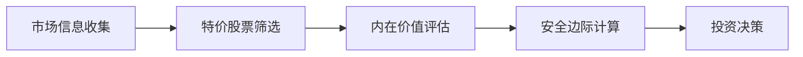

# 如何利用特价股票策略进行逆向投资

> 关键词：特价股票策略、逆向投资、价值评估、市场分析、投资决策

> 摘要：本文旨在深入探讨如何利用特价股票策略进行逆向投资。逆向投资作为一种独特的投资理念，通过发掘被市场低估的特价股票来获取潜在收益。文章详细介绍了特价股票策略的核心概念、相关算法原理、数学模型，结合实际案例进行分析，并阐述了其在不同场景下的应用。同时，为投资者提供了学习资源、开发工具以及相关论文著作的推荐，最后对逆向投资的未来发展趋势与挑战进行总结，帮助投资者全面了解和运用特价股票策略进行逆向投资。

## 1. 背景介绍 
### 1.1 目的和范围
逆向投资在金融市场中一直是一种备受关注的投资策略。其目的在于打破常规，不随波逐流，通过寻找被市场忽视或低估的特价股票，在市场的非理性波动中发现投资机会，从而获得超额收益。本文的范围涵盖了特价股票策略的基本概念、核心算法、数学模型、实际案例以及应用场景等多个方面，旨在为投资者提供一个全面、系统的逆向投资指导。

### 1.2 预期读者
本文预期读者包括对逆向投资感兴趣的个人投资者、金融从业者、投资研究人员以及相关专业的学生。无论是初涉投资领域的新手，还是具有一定经验的专业人士，都能从本文中获取有价值的信息，提升对特价股票策略和逆向投资的理解与应用能力。

### 1.3 文档结构概述
本文将按照以下结构进行阐述：首先介绍特价股票策略和逆向投资的核心概念及相互联系，接着详细讲解核心算法原理和具体操作步骤，包括使用 Python 代码进行示例。然后引入数学模型和公式，并通过举例进行说明。之后结合实际案例，对开发环境搭建、源代码实现和代码解读进行分析。再探讨特价股票策略在不同场景下的实际应用。随后推荐相关的学习资源、开发工具和论文著作。最后对逆向投资的未来发展趋势与挑战进行总结，并提供常见问题解答和扩展阅读参考资料。

### 1.4 术语表
#### 1.4.1 核心术语定义
- **特价股票**：指市场价格明显低于其内在价值的股票。这种低估可能是由于市场情绪、短期业绩波动、行业负面消息等多种因素导致。
- **逆向投资**：与大多数投资者的操作方向相反，在市场悲观、股价下跌时买入被低估的股票，在市场乐观、股价上涨时卖出获利的投资策略。
- **内在价值**：股票所代表的企业的真实价值，通常通过对企业的财务状况、盈利能力、行业前景等多方面因素进行综合评估得出。

#### 1.4.2 相关概念解释
- **市场有效性**：指市场价格能够充分反映所有可用信息的程度。在有效市场中，股票价格会迅速调整以反映新的信息，但实际上市场并非完全有效，存在着信息不对称和投资者非理性行为，这为逆向投资提供了机会。
- **安全边际**：指股票的内在价值与市场价格之间的差额。安全边际越大，投资风险越低，潜在收益越高。逆向投资者通常会寻找具有较大安全边际的特价股票进行投资。

#### 1.4.3 缩略词列表
- **PE**：市盈率（Price-to-Earnings Ratio），是股票价格除以每股收益的比率，用于衡量股票的估值水平。
- **PB**：市净率（Price-to-Book Ratio），是股票价格除以每股净资产的比率，反映了股票价格相对于公司净资产的倍数。

## 2. 核心概念与联系 
### 核心概念原理
特价股票策略的核心在于寻找那些被市场错误定价的股票。市场参与者的情绪和行为往往会导致股票价格偏离其内在价值。当市场整体处于悲观情绪时，投资者可能会过度抛售某些股票，使得这些股票的价格大幅下跌，从而形成特价股票。逆向投资者则利用这种市场的非理性行为，通过深入研究和分析，识别出这些特价股票，并在合适的时机买入。

逆向投资的原理基于对市场周期和投资者心理的理解。市场总是在繁荣和衰退之间循环，投资者的情绪也会随之波动。在市场繁荣时，投资者往往过于乐观，高估股票的价值；而在市场衰退时，投资者则过于悲观，低估股票的价值。逆向投资者通过逆向思维，在市场恐慌时买入，在市场狂热时卖出，从而实现低买高卖的投资目标。

### 架构的文本示意图
```plaintext
市场信息收集（宏观经济、行业动态、公司财报等）
|
V
特价股票筛选（基于估值指标、财务指标等）
|
V
内在价值评估（现金流折现、相对估值等方法）
|
V
安全边际计算（内在价值 - 市场价格）
|
V
投资决策（买入、持有、卖出）
```

### Mermaid 流程图


## 3. 核心算法原理 & 具体操作步骤 
### 核心算法原理
在利用特价股票策略进行逆向投资时，核心算法主要涉及到特价股票的筛选和内在价值的评估。以下是一种常见的方法：

#### 特价股票筛选算法
特价股票筛选通常基于一些估值指标和财务指标，例如市盈率（PE）、市净率（PB）、股息率等。一般来说，较低的 PE 和 PB 以及较高的股息率可能意味着股票被低估。

```python
import pandas as pd

def filter_bargain_stocks(data, pe_threshold=10, pb_threshold=1.5):
    """
    筛选特价股票
    :param data: 包含股票数据的 DataFrame，至少包含 'PE' 和 'PB' 列
    :param pe_threshold: 市盈率阈值
    :param pb_threshold: 市净率阈值
    :return: 筛选后的特价股票 DataFrame
    """
    bargain_stocks = data[(data['PE'] < pe_threshold) & (data['PB'] < pb_threshold)]
    return bargain_stocks
```

#### 内在价值评估算法
内在价值评估常用的方法是现金流折现法（DCF）。该方法的基本思想是将企业未来的现金流折现到当前时刻，以得到企业的内在价值。

```python
def dcf_valuation(free_cash_flows, discount_rate=0.1):
    """
    现金流折现法评估内在价值
    :param free_cash_flows: 未来各期的自由现金流列表
    :param discount_rate: 折现率
    :return: 内在价值
    """
    present_values = []
    for i, cash_flow in enumerate(free_cash_flows):
        present_value = cash_flow / ((1 + discount_rate) ** (i + 1))
        present_values.append(present_value)
    intrinsic_value = sum(present_values)
    return intrinsic_value
```

### 具体操作步骤
1. **数据收集**：收集股票的相关数据，包括财务报表数据、市场价格数据等。可以通过金融数据提供商（如东方财富、同花顺等）获取这些数据。
2. **特价股票筛选**：使用上述的特价股票筛选算法，根据设定的估值指标阈值筛选出可能的特价股票。
3. **内在价值评估**：对于筛选出的特价股票，使用现金流折现法或其他合适的方法评估其内在价值。
4. **安全边际计算**：计算股票的安全边际，即内在价值与市场价格之间的差额。安全边际越大，投资风险越低。
5. **投资决策**：根据安全边际的大小和其他因素（如行业前景、公司竞争力等）做出投资决策，决定是否买入、持有或卖出股票。

## 4. 数学模型和公式 & 详细讲解 & 举例说明 
### 市盈率（PE）模型
市盈率是最常用的估值指标之一，其计算公式为：
$$PE = \frac{P}{EPS}$$
其中，$P$ 为股票价格，$EPS$ 为每股收益。

市盈率反映了投资者为获取每一元的净利润所愿意支付的价格。一般来说，较低的市盈率可能意味着股票被低估，但需要注意的是，不同行业的市盈率水平可能存在较大差异。

例如，某股票的价格为 20 元，每股收益为 2 元，则该股票的市盈率为：
$$PE = \frac{20}{2} = 10$$

### 市净率（PB）模型
市净率也是常用的估值指标，其计算公式为：
$$PB = \frac{P}{BVPS}$$
其中，$P$ 为股票价格，$BVPS$ 为每股净资产。

市净率反映了股票价格相对于公司净资产的倍数。较低的市净率可能表示股票被低估，但同样需要考虑行业特点。

例如，某股票的价格为 15 元，每股净资产为 10 元，则该股票的市净率为：
$$PB = \frac{15}{10} = 1.5$$

### 现金流折现法（DCF）模型
现金流折现法的基本公式为：
$$V = \sum_{t=1}^{n} \frac{FCF_t}{(1 + r)^t}$$
其中，$V$ 为企业的内在价值，$FCF_t$ 为第 $t$ 期的自由现金流，$r$ 为折现率，$n$ 为预测期数。

假设某企业未来三年的自由现金流分别为 100 万元、120 万元和 150 万元，折现率为 10%，则该企业的内在价值为：
$$V = \frac{100}{(1 + 0.1)^1} + \frac{120}{(1 + 0.1)^2} + \frac{150}{(1 + 0.1)^3}$$
```python
import math

fcfs = [100, 120, 150]
discount_rate = 0.1
intrinsic_value = sum([fcfs[i] / ((1 + discount_rate) ** (i + 1)) for i in range(len(fcfs))])
print(f"内在价值: {intrinsic_value:.2f} 万元")
```

## 5. 项目实战：代码实际案例和详细解释说明 
### 5.1  开发环境搭建
为了实现特价股票策略的逆向投资项目，我们需要搭建相应的开发环境。以下是具体步骤：

1. **安装 Python**：Python 是一种功能强大的编程语言，广泛应用于数据分析和金融领域。可以从 Python 官方网站（https://www.python.org/downloads/）下载并安装最新版本的 Python。
2. **安装必要的库**：我们需要安装一些常用的 Python 库，如 Pandas、Numpy 等，用于数据处理和分析。可以使用以下命令进行安装：
```sh
pip install pandas numpy
```
3. **数据获取**：可以使用金融数据接口（如 Tushare）获取股票的相关数据。安装 Tushare 库：
```sh
pip install tushare
```

### 5.2  源代码详细实现和代码解读
以下是一个完整的特价股票策略逆向投资项目的代码示例：

```python
import tushare as ts
import pandas as pd

# 设置 Tushare token
ts.set_token('your_token')
pro = ts.pro_api()

def get_stock_data():
    """
    获取股票数据
    :return: 包含股票数据的 DataFrame
    """
    # 获取某一交易日的所有股票数据
    df = pro.daily_basic(ts_code='', trade_date='20240101', fields='ts_code,close,pe_ttm,pb')
    return df

def filter_bargain_stocks(data, pe_threshold=10, pb_threshold=1.5):
    """
    筛选特价股票
    :param data: 包含股票数据的 DataFrame，至少包含 'pe_ttm' 和 'pb' 列
    :param pe_threshold: 市盈率阈值
    :param pb_threshold: 市净率阈值
    :return: 筛选后的特价股票 DataFrame
    """
    bargain_stocks = data[(data['pe_ttm'] < pe_threshold) & (data['pb'] < pb_threshold)]
    return bargain_stocks

if __name__ == "__main__":
    # 获取股票数据
    stock_data = get_stock_data()
    
    # 筛选特价股票
    bargain_stocks = filter_bargain_stocks(stock_data)
    
    print("筛选出的特价股票：")
    print(bargain_stocks)
```

### 代码解读与分析
1. **数据获取**：`get_stock_data` 函数使用 Tushare 接口获取某一交易日的所有股票数据，包括股票代码、收盘价、滚动市盈率和市净率。
2. **特价股票筛选**：`filter_bargain_stocks` 函数根据设定的市盈率和市净率阈值筛选出可能的特价股票。
3. **主程序**：在主程序中，首先调用 `get_stock_data` 函数获取股票数据，然后调用 `filter_bargain_stocks` 函数筛选特价股票，最后打印出筛选结果。

## 6. 实际应用场景 
### 市场低迷时期
在市场整体低迷、投资者情绪悲观时，很多股票的价格会大幅下跌，其中不乏被错杀的优质股票。逆向投资者可以利用特价股票策略，筛选出那些被低估的股票进行投资。例如，在 2008 年全球金融危机期间，股市大幅下跌，许多优质企业的股票价格也随之下跌。逆向投资者如果能够识别出这些特价股票并在低位买入，在市场复苏后将获得丰厚的回报。

### 行业负面事件影响
当某个行业遭遇负面事件（如政策调整、重大安全事故等）时，该行业内的股票价格往往会受到冲击。但有些企业可能只是受到行业整体环境的拖累，其自身的基本面并没有发生实质性变化。逆向投资者可以通过深入分析，筛选出这些被错杀的特价股票进行投资。例如，曾经的白酒行业因“塑化剂”事件受到冲击，部分优质白酒企业的股票价格大幅下跌，但这些企业的品牌价值和盈利能力依然存在。逆向投资者在此时买入这些股票，后期获得了较好的收益。

### 新兴行业早期阶段
在新兴行业的早期阶段，市场对该行业的前景存在较大的不确定性，投资者往往持谨慎态度。一些具有潜力的企业可能由于市场认知不足或短期业绩不佳而被低估。逆向投资者可以通过研究行业发展趋势和企业的核心竞争力，筛选出这些特价股票进行长期投资。例如，在互联网行业发展初期，一些互联网企业的股票价格较低，但随着行业的快速发展，这些企业的价值逐渐被市场认可，投资者获得了巨大的收益。

## 7. 工具和资源推荐
### 7.1 学习资源推荐
#### 7.1.1 书籍推荐
- 《聪明的投资者》（The Intelligent Investor）：本杰明·格雷厄姆（Benjamin Graham）著，被誉为投资领域的圣经，详细阐述了价值投资和逆向投资的理念和方法。
- 《证券分析》（Security Analysis）：同样是本杰明·格雷厄姆的经典著作，对股票和债券的分析方法进行了深入探讨，为逆向投资提供了坚实的理论基础。
- 《逆向投资策略》（Contrarian Investment Strategies）：大卫·德雷曼（David Dreman）著，系统介绍了逆向投资的策略和实践，通过大量的案例分析展示了逆向投资的有效性。

#### 7.1.2 在线课程
- Coursera 上的“金融市场”（Financial Markets）课程：由耶鲁大学教授罗伯特·席勒（Robert Shiller）授课，涵盖了金融市场的基本原理、投资策略等内容，对逆向投资有一定的涉及。
- 网易云课堂上的“价值投资实战”课程：结合实际案例，详细讲解了价值投资和逆向投资的方法和技巧。

#### 7.1.3 技术博客和网站
- 雪球网（https://xueqiu.com/）：国内知名的投资交流社区，汇聚了众多投资者和投资专家，提供了丰富的股票分析和投资策略分享。
- 价值投资网（https://www.value-investing.info/）：专注于价值投资和逆向投资的研究和分享，提供了大量的文章和案例分析。

### 7.2 开发工具框架推荐
#### 7.2.1 IDE和编辑器
- PyCharm：一款专业的 Python 集成开发环境，提供了丰富的代码编辑、调试和分析功能，适合开发逆向投资相关的 Python 程序。
- Jupyter Notebook：一种交互式的开发环境，适合进行数据探索和分析，方便展示代码和结果。

#### 7.2.2 调试和性能分析工具
- Py-Spy：一款轻量级的 Python 性能分析工具，可以帮助开发者找出代码中的性能瓶颈。
- PDB：Python 自带的调试工具，可以在代码中设置断点，逐步调试程序，帮助开发者定位和解决问题。

#### 7.2.3 相关框架和库
- Pandas：用于数据处理和分析的 Python 库，提供了高效的数据结构和数据分析工具，非常适合处理股票数据。
- Numpy：Python 的数值计算库，提供了高效的数组操作和数学函数，在逆向投资的算法实现中经常会用到。
- Scikit-learn：用于机器学习的 Python 库，提供了丰富的机器学习算法和工具，可以用于股票价格预测和投资策略优化。

### 7.3 相关论文著作推荐
#### 7.3.1 经典论文
- “The Cross - Section of Expected Stock Returns”（Fama and French, 1992）：该论文提出了著名的 Fama - French 三因子模型，对股票收益率的影响因素进行了深入研究，为逆向投资提供了理论支持。
- “Contrarian Investment, Extrapolation, and Risk”（De Bondt and Thaler, 1985）：首次提出了逆向投资策略的有效性，并从行为金融学的角度进行了解释。

#### 7.3.2 最新研究成果
- 近年来，关于逆向投资的研究不断深入，涉及到机器学习、大数据等新技术在逆向投资中的应用。可以通过学术数据库（如知网、万方、Web of Science 等）搜索相关的最新研究论文。

#### 7.3.3 应用案例分析
- 一些金融研究机构和投资公司会发布逆向投资的应用案例分析报告，这些报告可以帮助投资者更好地理解逆向投资策略在实际中的应用和效果。可以关注知名金融研究机构（如中金公司、中信证券等）的研究报告。

## 8. 总结：未来发展趋势与挑战
### 未来发展趋势
- **技术融合**：随着人工智能、机器学习、大数据等技术的不断发展，逆向投资将与这些技术深度融合。通过利用大数据分析市场情绪和投资者行为，使用机器学习算法进行股票筛选和内在价值评估，将提高逆向投资的效率和准确性。
- **全球化投资**：全球金融市场的互联互通日益增强，逆向投资者将有更多的机会在全球范围内寻找特价股票。同时，不同国家和地区的市场环境和经济周期存在差异，这为逆向投资提供了更广阔的空间。
- **社会责任投资**：越来越多的投资者开始关注企业的社会责任和可持续发展。未来，逆向投资可能会结合社会责任投资的理念，寻找那些被市场低估但具有良好社会责任表现的企业进行投资。

### 挑战
- **信息过载**：随着金融市场的发展和信息技术的进步，投资者面临着海量的信息。如何从这些信息中筛选出有价值的信息，准确判断股票的内在价值和市场趋势，是逆向投资者面临的一大挑战。
- **市场有效性提高**：随着市场参与者的不断增加和市场机制的不断完善，市场的有效性可能会逐渐提高。这意味着特价股票的出现机会可能会减少，逆向投资的难度会增加。
- **黑天鹅事件**：金融市场中不时会出现一些不可预测的黑天鹅事件，如重大自然灾害、政治动荡、突发公共卫生事件等。这些事件可能会对市场造成巨大冲击，使逆向投资策略面临较大的风险。

## 9. 附录：常见问题与解答
### 问题 1：特价股票一定能带来高收益吗？
解答：不一定。虽然特价股票通常是被市场低估的股票，但低估可能有其合理的原因，如公司基本面恶化、行业前景不佳等。此外，市场的恢复时间和程度也具有不确定性，即使股票被低估，也可能需要较长时间才能实现价值回归，甚至可能继续下跌。因此，投资特价股票需要进行深入的研究和分析，评估其潜在风险和收益。

### 问题 2：逆向投资适合所有投资者吗？
解答：逆向投资并不适合所有投资者。逆向投资需要投资者具备较强的独立思考能力和心理承受能力，能够在市场悲观时坚定买入，在市场乐观时理性卖出。同时，逆向投资需要对金融市场和企业基本面有深入的了解，具备一定的专业知识和分析能力。对于缺乏经验和专业知识的投资者来说，逆向投资可能会带来较大的风险。

### 问题 3：如何确定股票的内在价值？
解答：确定股票的内在价值是一个复杂的过程，常用的方法有现金流折现法、相对估值法等。现金流折现法需要预测企业未来的自由现金流，并选择合适的折现率进行折现；相对估值法是通过与同行业其他企业的估值指标（如市盈率、市净率等）进行比较来评估股票的价值。此外，还需要考虑企业的行业前景、竞争优势、管理团队等因素。在实际应用中，通常会综合使用多种方法进行评估。

## 10. 扩展阅读 & 参考资料
### 扩展阅读
- 《金融炼金术》（The Alchemy of Finance）：乔治·索罗斯（George Soros）著，探讨了金融市场的反身性原理，对逆向投资有一定的启示。
- 《行为金融学》：理查德·泰勒（Richard Thaler）等著，介绍了投资者的行为偏差和心理因素对金融市场的影响，有助于理解逆向投资的市场基础。

### 参考资料
- 金融数据提供商：东方财富、同花顺、Tushare 等。
- 学术数据库：知网、万方、Web of Science 等。

作者：AI天才研究院/AI Genius Institute & 禅与计算机程序设计艺术 /Zen And The Art of Computer Programming