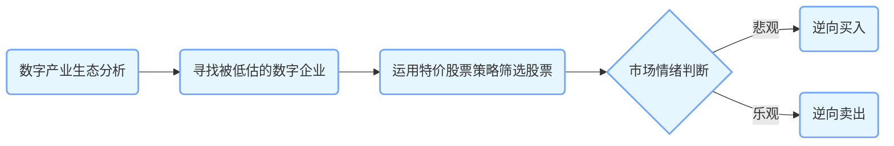

# 如何利用特价股票策略进行逆向数字产业生态投资

> 关键词：特价股票策略、逆向投资、数字产业生态、投资分析、风险控制

> 摘要：本文聚焦于如何运用特价股票策略开展逆向数字产业生态投资。首先介绍了相关背景知识，包括目的、预期读者等内容。接着阐述了核心概念及联系，通过示意图和流程图进行直观展示。详细讲解了核心算法原理和具体操作步骤，结合 Python 代码进行说明。同时给出了数学模型和公式，并举例分析。在项目实战部分，展示了开发环境搭建、源代码实现与解读。探讨了实际应用场景，推荐了学习、开发相关的工具和资源，最后总结了未来发展趋势与挑战，还附有常见问题解答和扩展阅读参考资料，旨在为投资者提供全面且深入的逆向数字产业生态投资指导。

## 1. 背景介绍 
### 1.1 目的和范围
随着数字产业的快速发展，其生态系统日益复杂和多元化。在数字产业投资领域，传统的投资策略往往聚焦于热门的、被市场广泛看好的数字企业。然而，逆向投资策略，尤其是利用特价股票策略进行逆向数字产业生态投资，为投资者提供了另一种视角和潜在的高回报途径。本文的目的在于深入探讨如何运用特价股票策略，在数字产业生态中进行逆向投资，挖掘那些被市场低估的数字企业股票，以获取长期的投资收益。

本文的范围涵盖了特价股票策略的基本原理、逆向投资在数字产业生态中的应用、相关的算法和数学模型、实际项目案例分析，以及未来的发展趋势和挑战等方面。通过全面的分析和探讨，帮助投资者更好地理解和运用这一投资策略。

### 1.2 预期读者
本文的预期读者主要包括以下几类人群：
- **个人投资者**：对数字产业投资感兴趣，希望通过逆向投资策略寻找投资机会，提高投资收益的个人投资者。
- **专业投资机构从业者**：如基金经理、投资分析师等，希望深入了解特价股票策略在数字产业生态中的应用，为投资决策提供参考。
- **数字产业创业者**：了解逆向投资策略有助于创业者从投资者的角度审视自己的企业，提高企业的融资能力和市场竞争力。
- **金融和投资领域的学生和研究人员**：作为学习和研究逆向投资策略、数字产业投资的参考资料。

### 1.3 文档结构概述
本文的结构如下：
- **核心概念与联系**：介绍特价股票策略、逆向投资和数字产业生态的核心概念，以及它们之间的联系，并通过示意图和流程图进行直观展示。
- **核心算法原理 & 具体操作步骤**：详细讲解特价股票筛选和逆向投资决策的核心算法原理，并给出具体的操作步骤，同时使用 Python 代码进行实现。
- **数学模型和公式 & 详细讲解 & 举例说明**：建立投资收益和风险评估的数学模型，给出相关公式，并通过具体例子进行详细讲解。
- **项目实战：代码实际案例和详细解释说明**：通过一个实际的项目案例，展示如何搭建开发环境、实现源代码，并对代码进行详细解读和分析。
- **实际应用场景**：探讨特价股票策略在逆向数字产业生态投资中的实际应用场景。
- **工具和资源推荐**：推荐学习、开发和研究相关的工具和资源，包括书籍、在线课程、技术博客、IDE、调试工具、相关框架和库，以及经典论文和最新研究成果。
- **总结：未来发展趋势与挑战**：总结特价股票策略在逆向数字产业生态投资中的未来发展趋势和面临的挑战。
- **附录：常见问题与解答**：解答读者在阅读和应用本文内容过程中可能遇到的常见问题。
- **扩展阅读 & 参考资料**：提供相关的扩展阅读材料和参考资料，方便读者进一步深入学习和研究。

### 1.4 术语表
#### 1.4.1 核心术语定义
- **特价股票策略**：一种投资策略，通过筛选出价格低于其内在价值的股票进行投资，以获取长期的投资收益。
- **逆向投资**：与市场主流投资方向相反的投资策略，在市场悲观时买入，在市场乐观时卖出。
- **数字产业生态**：由数字技术相关的企业、机构、用户等组成的生态系统，包括数字技术研发、应用、服务等各个环节。
- **内在价值**：股票所代表的企业的真实价值，通常通过对企业的财务状况、盈利能力、发展前景等因素进行评估得出。
- **安全边际**：股票价格与内在价值之间的差值，安全边际越大，投资风险越小。

#### 1.4.2 相关概念解释
- **数字产业**：以数字技术为核心，从事数字产品研发、生产、销售和服务的产业，包括互联网、软件、通信、电子等多个领域。
- **股票估值**：对股票的内在价值进行评估的过程，常用的估值方法包括市盈率法、市净率法、现金流折现法等。
- **投资组合**：由多种不同的股票、债券、基金等投资品种组成的集合，通过分散投资降低投资风险。

#### 1.4.3 缩略词列表
- **PE**：市盈率（Price-to-Earnings Ratio），股票价格与每股收益的比率。
- **PB**：市净率（Price-to-Book Ratio），股票价格与每股净资产的比率。
- **DCF**：现金流折现法（Discounted Cash Flow），一种基于未来现金流预测的股票估值方法。

## 2. 核心概念与联系 
### 核心概念原理
#### 特价股票策略
特价股票策略的核心原理是寻找那些市场价格低于其内在价值的股票。内在价值是指股票所代表的企业的真实价值，它受到企业的财务状况、盈利能力、发展前景等多种因素的影响。通过对这些因素进行深入分析和评估，可以估算出股票的内在价值。当市场价格低于内在价值时，就形成了安全边际，投资者可以以较低的价格买入股票，等待市场价格回归内在价值，从而获取投资收益。

#### 逆向投资
逆向投资是一种与市场主流投资方向相反的投资策略。在市场普遍悲观、股票价格大幅下跌时，逆向投资者认为市场过度反应，一些优质的股票被低估，此时他们会选择买入这些股票。而在市场普遍乐观、股票价格大幅上涨时，逆向投资者认为市场可能存在泡沫，会选择卖出股票。逆向投资的核心在于独立思考，不随波逐流，通过逆向操作获取超额收益。

#### 数字产业生态
数字产业生态是由数字技术相关的企业、机构、用户等组成的生态系统。在这个生态系统中，各个参与者之间相互关联、相互影响，形成了一个复杂的网络。数字产业生态的发展受到技术创新、市场需求、政策环境等多种因素的影响。投资者在进行逆向数字产业生态投资时，需要考虑数字产业生态的整体发展趋势，以及各个参与者在生态系统中的地位和作用。

### 核心概念架构的文本示意图
```plaintext
数字产业生态
|
|-- 数字技术研发企业
|-- 数字产品生产企业
|-- 数字服务提供商
|-- 用户
|
特价股票策略 <-- 筛选被低估的数字企业股票
|
逆向投资 <-- 在市场悲观时买入，乐观时卖出
```

### Mermaid 流程图


## 3. 核心算法原理 & 具体操作步骤 
### 核心算法原理
#### 特价股票筛选算法
特价股票筛选算法的核心是通过对股票的财务指标和估值指标进行分析，筛选出价格低于其内在价值的股票。常用的财务指标包括市盈率（PE）、市净率（PB）、净资产收益率（ROE）等，常用的估值指标包括现金流折现法（DCF）估值等。具体步骤如下：
1. 收集股票的财务数据和市场数据，包括每股收益、每股净资产、股价等。
2. 计算股票的财务指标和估值指标。
3. 根据预设的筛选条件，筛选出符合要求的股票。例如，选择 PE 低于行业平均水平、PB 低于一定阈值的股票。

#### 逆向投资决策算法
逆向投资决策算法的核心是根据市场情绪和股票的价格走势，判断是否进行逆向投资。市场情绪可以通过投资者信心指数、成交量等指标来衡量。具体步骤如下：
1. 收集市场情绪指标和股票的价格走势数据。
2. 分析市场情绪和股票价格走势之间的关系。
3. 当市场情绪极度悲观、股票价格大幅下跌时，判断为逆向买入时机；当市场情绪极度乐观、股票价格大幅上涨时，判断为逆向卖出时机。

### 具体操作步骤
#### 步骤 1：数据收集
收集数字产业相关企业的财务数据和市场数据，包括上市公司的年报、季报、股价数据等。可以通过金融数据提供商（如东方财富、同花顺等）获取这些数据。

#### 步骤 2：数据预处理
对收集到的数据进行清洗和整理，去除缺失值和异常值。同时，对数据进行标准化处理，以便进行后续的分析和比较。

#### 步骤 3：财务指标和估值指标计算
根据收集到的数据，计算股票的财务指标和估值指标。例如，计算 PE、PB、ROE 等财务指标，以及使用 DCF 法计算股票的内在价值。

#### 步骤 4：特价股票筛选
根据预设的筛选条件，筛选出符合要求的特价股票。例如，选择 PE 低于行业平均水平、PB 低于 1 的股票。

#### 步骤 5：市场情绪分析
收集市场情绪指标，如投资者信心指数、成交量等，分析市场情绪的变化。

#### 步骤 6：逆向投资决策
根据市场情绪和股票的价格走势，判断是否进行逆向投资。当市场情绪极度悲观、股票价格大幅下跌时，买入特价股票；当市场情绪极度乐观、股票价格大幅上涨时，卖出股票。

### Python 源代码实现
```python
import pandas as pd
import numpy as np

# 步骤 1：数据收集（假设数据已经存储在 CSV 文件中）
data = pd.read_csv('digital_stocks_data.csv')

# 步骤 2：数据预处理
data = data.dropna()  # 去除缺失值
data = data[(np.abs(data - data.mean()) <= (3 * data.std())).all(axis=1)]  # 去除异常值

# 步骤 3：财务指标和估值指标计算
data['PE'] = data['股价'] / data['每股收益']
data['PB'] = data['股价'] / data['每股净资产']

# 步骤 4：特价股票筛选
industry_avg_pe = data['PE'].mean()
selected_stocks = data[(data['PE'] < industry_avg_pe) & (data['PB'] < 1)]

# 步骤 5：市场情绪分析（假设市场情绪指标存储在另一个 CSV 文件中）
market_sentiment = pd.read_csv('market_sentiment.csv')
# 这里简单假设市场情绪指标为一个数值，数值越低表示市场越悲观
pessimistic_threshold = 0.2
is_pessimistic = market_sentiment['市场情绪指标'].iloc[-1] < pessimistic_threshold

# 步骤 6：逆向投资决策
if is_pessimistic:
    print("市场情绪悲观，买入特价股票：", selected_stocks['股票代码'])
else:
    print("市场情绪乐观，不进行逆向买入操作")
```

## 4. 数学模型和公式 & 详细讲解 & 举例说明 
### 市盈率（PE）模型
#### 公式
市盈率（PE）的计算公式为：
$$PE = \frac{P}{EPS}$$
其中，$P$ 为股票价格，$EPS$ 为每股收益。

#### 详细讲解
市盈率是衡量股票估值的常用指标之一，它反映了投资者为获取每股收益所愿意支付的价格。一般来说，市盈率越低，说明股票越便宜，投资价值越高。但是，市盈率也受到行业特点、企业发展阶段等因素的影响，不同行业的市盈率水平可能存在较大差异。

#### 举例说明
假设某只股票的价格为 20 元，每股收益为 2 元，则该股票的市盈率为：
$$PE = \frac{20}{2} = 10$$
如果该行业的平均市盈率为 15，则该股票的市盈率低于行业平均水平，可能被认为是被低估的股票。

### 市净率（PB）模型
#### 公式
市净率（PB）的计算公式为：
$$PB = \frac{P}{BVPS}$$
其中，$P$ 为股票价格，$BVPS$ 为每股净资产。

#### 详细讲解
市净率反映了股票价格与每股净资产之间的关系，它衡量了投资者为获取每股净资产所愿意支付的价格。一般来说，市净率越低，说明股票越便宜，投资价值越高。市净率适用于那些资产比较重的行业，如金融、房地产等。

#### 举例说明
假设某只股票的价格为 15 元，每股净资产为 10 元，则该股票的市净率为：
$$PB = \frac{15}{10} = 1.5$$
如果该行业的平均市净率为 2，则该股票的市净率低于行业平均水平，可能被认为是被低估的股票。

### 现金流折现法（DCF）模型
#### 公式
现金流折现法的基本公式为：
$$V = \sum_{t=1}^{n} \frac{CF_t}{(1 + r)^t} + \frac{TV}{(1 + r)^n}$$
其中，$V$ 为股票的内在价值，$CF_t$ 为第 $t$ 期的现金流，$r$ 为折现率，$TV$ 为终值，$n$ 为预测期数。

#### 详细讲解
现金流折现法是一种基于未来现金流预测的股票估值方法，它的核心思想是将企业未来的现金流折现到当前时刻，得到企业的内在价值。现金流折现法需要对企业的未来现金流进行预测，并选择合适的折现率。折现率反映了投资者对投资风险的要求，折现率越高，股票的内在价值越低。

#### 举例说明
假设某企业未来 3 年的现金流分别为 100 万元、120 万元、150 万元，预测期结束后的终值为 1000 万元，折现率为 10%。则该企业的内在价值为：
$$V = \frac{100}{(1 + 0.1)^1} + \frac{120}{(1 + 0.1)^2} + \frac{150}{(1 + 0.1)^3} + \frac{1000}{(1 + 0.1)^3}$$
$$V = \frac{100}{1.1} + \frac{120}{1.21} + \frac{150}{1.331} + \frac{1000}{1.331}$$
$$V \approx 90.91 + 99.17 + 112.69 + 751.31$$
$$V \approx 1054.08$$
如果该企业的总股本为 100 万股，则每股内在价值为：
$$\frac{1054.08}{100} = 10.54$$
如果当前股票价格低于 10.54 元，则该股票可能被认为是被低估的股票。

## 5. 项目实战：代码实际案例和详细解释说明 
### 5.1  开发环境搭建
#### 安装 Python
首先，需要安装 Python 编程语言。可以从 Python 官方网站（https://www.python.org/downloads/）下载适合自己操作系统的 Python 安装包，并按照安装向导进行安装。

#### 安装必要的库
在项目中，需要使用一些 Python 库来进行数据处理、分析和可视化。可以使用以下命令来安装这些库：
```bash
pip install pandas numpy matplotlib
```
- `pandas`：用于数据处理和分析。
- `numpy`：用于数值计算。
- `matplotlib`：用于数据可视化。

#### 准备数据
需要准备数字产业相关企业的财务数据和市场数据，以及市场情绪指标数据。可以将这些数据存储在 CSV 文件中，方便后续的读取和处理。

### 5.2  源代码详细实现和代码解读
```python
import pandas as pd
import numpy as np
import matplotlib.pyplot as plt

# 步骤 1：数据收集
# 读取数字产业相关企业的财务数据和市场数据
stock_data = pd.read_csv('digital_stocks_data.csv')
# 读取市场情绪指标数据
market_sentiment = pd.read_csv('market_sentiment.csv')

# 步骤 2：数据预处理
# 去除缺失值
stock_data = stock_data.dropna()
market_sentiment = market_sentiment.dropna()
# 去除异常值
stock_data = stock_data[(np.abs(stock_data - stock_data.mean()) <= (3 * stock_data.std())).all(axis=1)]

# 步骤 3：财务指标和估值指标计算
# 计算市盈率（PE）
stock_data['PE'] = stock_data['股价'] / stock_data['每股收益']
# 计算市净率（PB）
stock_data['PB'] = stock_data['股价'] / stock_data['每股净资产']

# 步骤 4：特价股票筛选
# 计算行业平均市盈率
industry_avg_pe = stock_data['PE'].mean()
# 筛选出 PE 低于行业平均水平且 PB 低于 1 的股票
selected_stocks = stock_data[(stock_data['PE'] < industry_avg_pe) & (stock_data['PB'] < 1)]

# 步骤 5：市场情绪分析
# 假设市场情绪指标为一个数值，数值越低表示市场越悲观
pessimistic_threshold = 0.2
is_pessimistic = market_sentiment['市场情绪指标'].iloc[-1] < pessimistic_threshold

# 步骤 6：逆向投资决策
if is_pessimistic:
    print("市场情绪悲观，买入特价股票：", selected_stocks['股票代码'])
    # 可视化特价股票的 PE 和 PB 分布
    plt.scatter(selected_stocks['PE'], selected_stocks['PB'])
    plt.xlabel('市盈率（PE）')
    plt.ylabel('市净率（PB）')
    plt.title('特价股票的 PE 和 PB 分布')
    plt.show()
else:
    print("市场情绪乐观，不进行逆向买入操作")
```

### 5.3  代码解读与分析
#### 数据收集
使用 `pandas` 库的 `read_csv` 函数读取数字产业相关企业的财务数据和市场数据，以及市场情绪指标数据。

#### 数据预处理
使用 `dropna` 函数去除数据中的缺失值，使用 `np.abs` 和 `std` 函数去除数据中的异常值。

#### 财务指标和估值指标计算
根据公式计算股票的市盈率（PE）和市净率（PB）。

#### 特价股票筛选
计算行业平均市盈率，筛选出 PE 低于行业平均水平且 PB 低于 1 的股票。

#### 市场情绪分析
根据市场情绪指标判断市场是否处于悲观状态。

#### 逆向投资决策
如果市场处于悲观状态，则输出买入特价股票的信息，并可视化特价股票的 PE 和 PB 分布；否则，输出不进行逆向买入操作的信息。

## 6. 实际应用场景 
### 新兴数字技术领域
在新兴数字技术领域，如人工智能、区块链、物联网等，市场对这些技术的发展前景存在较大的不确定性。当市场因为短期的技术难题、政策调整等因素而对这些领域的企业持悲观态度时，股票价格可能会大幅下跌。此时，运用特价股票策略进行逆向投资，可以挖掘出那些被市场低估的具有潜力的企业。例如，在人工智能领域，某些企业可能在研发过程中遇到了暂时的困难，导致市场对其未来发展产生担忧，股票价格下跌。但实际上，这些企业拥有先进的技术和优秀的团队，一旦克服困难，其价值将得到重新评估。

### 传统数字产业转型期
传统数字产业，如软件、通信等，在面临技术升级和市场竞争时，可能会经历转型期。在转型过程中，企业可能会面临业绩下滑、市场份额下降等问题，导致股票价格受到影响。此时，逆向投资者可以通过分析企业的转型战略和转型能力，筛选出那些有能力成功转型的企业的特价股票进行投资。例如，一家传统软件企业正在向云计算服务转型，虽然短期内业绩可能受到影响，但如果其转型战略正确，技术实力雄厚，未来有望在云计算市场获得更大的份额，其股票可能被低估。

### 数字产业周期性低谷
数字产业也存在一定的周期性，当行业处于周期性低谷时，市场整体情绪悲观，股票价格普遍下跌。在这个时候，逆向投资者可以运用特价股票策略，寻找那些在行业低谷中仍然具有较强竞争力和盈利能力的企业进行投资。例如，在通信行业的周期性低谷中，一些通信设备制造商的股票价格可能会大幅下跌，但其中一些企业拥有先进的技术和稳定的客户群体，一旦行业复苏，其股票价格有望大幅上涨。

## 7. 工具和资源推荐
### 7.1 学习资源推荐
#### 7.1.1 书籍推荐
- 《聪明的投资者》（The Intelligent Investor）：作者本杰明·格雷厄姆（Benjamin Graham），被誉为投资界的圣经，详细介绍了价值投资的理念和方法，对特价股票策略和逆向投资有深入的阐述。
- 《金融炼金术》（The Alchemy of Finance）：作者乔治·索罗斯（George Soros），介绍了索罗斯的反身性理论和逆向投资实践，对于理解市场情绪和逆向投资决策有很大的帮助。
- 《数字经济：智能时代的新经济范式》：全面介绍了数字经济的发展现状、趋势和相关技术，帮助投资者了解数字产业生态。

#### 7.1.2 在线课程
- Coursera 上的“投资学原理”课程：由知名大学的教授授课，系统介绍了投资学的基本原理和方法，包括股票估值、投资组合管理等内容。
- edX 上的“数字经济与创新”课程：讲解了数字经济的发展规律和创新模式，对于理解数字产业生态有很大的帮助。

#### 7.1.3 技术博客和网站
- 东方财富网（https://www.eastmoney.com/）：提供丰富的金融数据和投资资讯，包括股票行情、财务报表、研究报告等。
- 雪球网（https://xueqiu.com/）：一个投资者社区，用户可以在上面交流投资经验、分享投资观点，还可以获取一些优质的投资分析文章。
- 36氪（https://36kr.com/）：专注于新经济领域的资讯平台，提供数字产业相关的最新动态和深度报道。

### 7.2 开发工具框架推荐
#### 7.2.1 IDE和编辑器
- PyCharm：一款专业的 Python 集成开发环境，具有代码编辑、调试、版本控制等功能，适合进行 Python 数据分析和算法开发。
- Jupyter Notebook：一个交互式的开发环境，支持 Python、R 等多种编程语言，适合进行数据探索和可视化。

#### 7.2.2 调试和性能分析工具
- pdb：Python 自带的调试工具，可以帮助开发者调试 Python 代码，定位问题。
- cProfile：Python 自带的性能分析工具，可以分析 Python 代码的运行时间和函数调用情况，帮助开发者优化代码性能。

#### 7.2.3 相关框架和库
- Pandas：用于数据处理和分析的 Python 库，提供了丰富的数据结构和数据操作方法。
- Numpy：用于数值计算的 Python 库，提供了高效的多维数组对象和数学函数。
- Matplotlib：用于数据可视化的 Python 库，支持多种图表类型的绘制。

### 7.3 相关论文著作推荐
#### 7.3.1 经典论文
- Fama, E. F., & French, K. R. (1992). The cross-section of expected stock returns. The Journal of Finance, 47(2), 427-465. 该论文提出了著名的 Fama-French 三因子模型，用于解释股票收益率的差异。
- Shiller, R. J. (1981). Do stock prices move too much to be justified by subsequent changes in dividends?. The American Economic Review, 71(3), 421-436. 该论文探讨了股票价格波动与股息变化之间的关系，对市场有效性提出了质疑。

#### 7.3.2 最新研究成果
- 关注顶级金融学术期刊，如 The Journal of Finance、The Review of Financial Studies 等，这些期刊上发表了许多关于投资策略、市场效率等方面的最新研究成果。
- 参加金融学术会议，如美国金融协会年会（AFA Annual Meeting）等，可以了解到最新的研究动态和前沿观点。

#### 7.3.3 应用案例分析
- 一些专业的金融研究机构会发布关于逆向投资和特价股票策略的应用案例分析报告，投资者可以通过阅读这些报告，了解实际应用中的经验和教训。

## 8. 总结：未来发展趋势与挑战
### 未来发展趋势
#### 数字产业持续增长
随着信息技术的不断进步和应用场景的不断拓展，数字产业将继续保持快速增长的态势。这为逆向数字产业生态投资提供了更广阔的市场空间和更多的投资机会。例如，人工智能、大数据、云计算等新兴技术的应用将不断深化，相关企业的发展前景广阔。

#### 逆向投资策略受重视
在市场波动加剧、不确定性增加的背景下，逆向投资策略将受到更多投资者的关注和重视。逆向投资者通过独立思考和逆向操作，可以在市场中发现被低估的投资机会，获取超额收益。同时，随着量化投资技术的发展，逆向投资策略的实施将更加科学和精准。

#### 数据驱动的投资决策
未来的投资决策将越来越依赖于数据和分析。通过收集和分析大量的财务数据、市场数据、行业数据等，投资者可以更准确地评估企业的内在价值和投资风险，从而做出更明智的投资决策。例如，利用机器学习算法对股票进行筛选和预测，提高投资决策的效率和准确性。

### 挑战
#### 市场不确定性增加
数字产业的发展速度快、变化大，市场不确定性增加。新技术的出现、政策的调整、市场竞争的加剧等因素都可能导致企业的业绩和股价发生较大波动。逆向投资者需要具备较强的风险意识和应对能力，及时调整投资策略。

#### 数据质量和分析能力要求高
数据驱动的投资决策需要大量高质量的数据和强大的数据分析能力。然而，数据的获取和整理存在一定的难度，数据质量也可能受到影响。同时，投资者需要具备一定的数据分析和建模能力，才能从海量的数据中提取有价值的信息。

#### 逆向投资心理压力大
逆向投资与市场主流投资方向相反，需要投资者具备较强的心理素质和独立思考能力。在市场普遍悲观时买入股票，需要承受较大的心理压力，因为此时市场上的负面消息较多，投资者容易受到情绪的影响。同样，在市场普遍乐观时卖出股票也需要克服贪婪的心理。

## 9. 附录：常见问题与解答
### 问题 1：如何确定股票的内在价值？
答：确定股票的内在价值可以采用多种方法，常见的有市盈率法、市净率法、现金流折现法等。市盈率法是通过比较股票的市盈率与行业平均市盈率来判断股票是否被低估；市净率法是比较股票的市净率与行业平均市净率；现金流折现法是基于企业未来的现金流预测，将其折现到当前时刻得到企业的内在价值。在实际应用中，可以综合使用多种方法进行评估。

### 问题 2：逆向投资一定能获得超额收益吗？
答：逆向投资并不一定能获得超额收益。逆向投资是一种与市场主流投资方向相反的投资策略，其成功的关键在于准确判断市场情绪和股票的内在价值。如果市场情绪的判断出现偏差，或者对股票的内在价值评估不准确，逆向投资可能会导致亏损。此外，逆向投资需要投资者具备较强的心理素质和耐心，能够承受短期的市场波动。

### 问题 3：如何衡量市场情绪？
答：可以通过多种指标来衡量市场情绪，常见的有投资者信心指数、成交量、融资融券余额等。投资者信心指数反映了投资者对市场的预期和信心程度；成交量可以反映市场的活跃程度和投资者的参与热情；融资融券余额可以反映投资者的做多和做空意愿。此外，还可以通过分析新闻媒体、社交媒体等渠道的信息来了解市场情绪。

### 问题 4：特价股票筛选的条件可以根据自己的需求进行调整吗？
答：可以。特价股票筛选的条件可以根据投资者的投资目标、风险偏好和市场情况进行调整。例如，如果投资者更注重股票的盈利能力，可以增加净资产收益率（ROE）等指标的筛选条件；如果投资者更关注股票的安全性，可以提高市净率的筛选阈值。在调整筛选条件时，需要综合考虑各种因素，确保筛选出的股票具有较高的投资价值。

## 10. 扩展阅读 & 参考资料
### 扩展阅读
- 《投资最重要的事》（The Most Important Thing Illuminated）：作者霍华德·马克斯（Howard Marks），介绍了投资中的一些重要原则和思维方式，对于逆向投资有深刻的见解。
- 《黑天鹅：如何应对不可预知的未来》（The Black Swan: The Impact of the Highly Improbable）：作者纳西姆·尼古拉斯·塔勒布（Nassim Nicholas Taleb），探讨了不确定性和极端事件对投资的影响，帮助投资者更好地应对市场风险。

### 参考资料
- 东方财富网（https://www.eastmoney.com/）：提供金融数据和投资资讯。
- 雪球网（https://xueqiu.com/）：投资者社区和投资分析平台。
- 36氪（https://36kr.com/）：新经济领域资讯平台。

作者：AI天才研究院/AI Genius Institute & 禅与计算机程序设计艺术 /Zen And The Art of Computer Programming