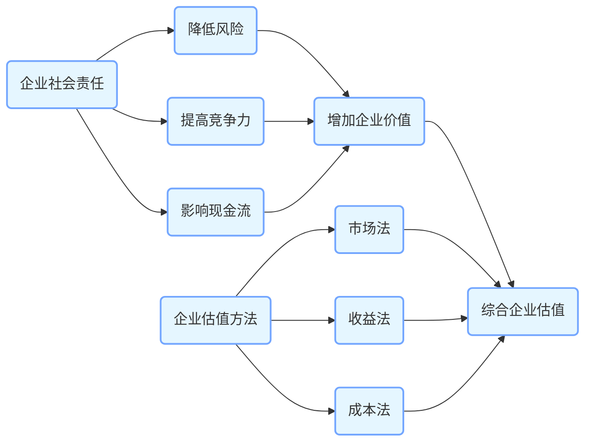

# 如何在估值中考虑企业的社会责任

> 关键词：企业估值、社会责任、估值模型、ESG、可持续发展

> 摘要：本文围绕如何在企业估值中考虑社会责任这一核心主题展开。首先介绍了在估值中考虑社会责任的背景和相关概念，包括目的、预期读者等内容。接着阐述了核心概念及它们之间的联系，分析了核心算法原理并给出Python代码示例，讲解了相关数学模型和公式。通过项目实战展示了在实际中如何将社会责任纳入估值的具体操作和代码解读。探讨了企业社会责任在不同场景下的实际应用，推荐了学习、开发相关的工具和资源以及论文著作。最后总结了未来发展趋势与挑战，解答常见问题并提供扩展阅读和参考资料，旨在帮助读者全面理解并掌握在企业估值中融入社会责任考量的方法和意义。

## 1. 背景介绍 
### 1.1 目的和范围
在当今社会，企业的社会责任已经成为衡量企业综合实力的重要因素之一。传统的企业估值方法主要侧重于财务指标，如盈利、现金流等，但忽略了企业在社会责任方面的表现。然而，企业的社会责任表现不仅会影响其长期的经营稳定性和声誉，还可能对其未来的财务状况产生重大影响。因此，本文章的目的是探讨如何在企业估值中合理地考虑企业的社会责任，为投资者、分析师和企业管理者提供一种更全面、更准确的估值方法。

本文章的范围涵盖了企业社会责任的各个方面，包括环境保护、社会责任、公司治理（ESG）等。我们将分析这些因素如何影响企业的价值，并介绍一些在估值中考虑社会责任的具体方法和模型。同时，我们还将通过实际案例和代码示例，展示如何将这些方法应用到实际的估值工作中。

### 1.2 预期读者
本文的预期读者主要包括以下几类人群：
- **投资者**：希望通过更全面的估值方法，评估企业的长期投资价值，做出更明智的投资决策。
- **金融分析师**：需要在估值报告中考虑企业的社会责任因素，为客户提供更准确的分析和建议。
- **企业管理者**：了解如何在企业战略和运营中融入社会责任，提高企业的综合竞争力和价值。
- **学术研究人员**：对企业社会责任和估值理论感兴趣，希望深入研究相关领域的学术问题。

### 1.3 文档结构概述
本文将按照以下结构进行组织：
- **核心概念与联系**：介绍企业社会责任、企业估值的基本概念，以及它们之间的联系。
- **核心算法原理 & 具体操作步骤**：阐述在估值中考虑社会责任的核心算法原理，并给出具体的操作步骤和Python代码示例。
- **数学模型和公式 & 详细讲解 & 举例说明**：介绍相关的数学模型和公式，详细讲解其含义和应用，并通过具体例子进行说明。
- **项目实战：代码实际案例和详细解释说明**：通过一个实际的项目案例，展示如何使用Python代码实现考虑社会责任的企业估值。
- **实际应用场景**：分析企业社会责任在不同场景下的实际应用，以及对企业估值的影响。
- **工具和资源推荐**：推荐一些学习、开发和研究企业社会责任和估值的工具和资源。
- **总结：未来发展趋势与挑战**：总结本文的主要内容，展望未来在估值中考虑社会责任的发展趋势，并分析可能面临的挑战。
- **附录：常见问题与解答**：解答一些常见的关于在估值中考虑企业社会责任的问题。
- **扩展阅读 & 参考资料**：提供一些扩展阅读的建议和相关的参考资料。

### 1.4 术语表
#### 1.4.1 核心术语定义
- **企业社会责任（Corporate Social Responsibility, CSR）**：企业在创造利润、对股东和员工承担法律责任的同时，还要承担对消费者、社区和环境的责任。
- **企业估值（Business Valuation）**：对企业的经济价值进行评估的过程，通常用于投资决策、并购重组、财务报告等目的。
- **ESG**：环境（Environmental）、社会（Social）和治理（Governance）的缩写，是衡量企业社会责任表现的重要指标体系。
- **可持续发展（Sustainable Development）**：既满足当代人的需求，又不损害后代人满足其需求的能力的发展模式。

#### 1.4.2 相关概念解释
- **社会资本（Social Capital）**：企业通过与社会各方建立良好的关系而积累的资源和声誉，是企业社会责任的重要体现。
- **声誉风险（Reputation Risk）**：企业因社会责任表现不佳而导致声誉受损，进而影响其经营和财务状况的风险。
- **利益相关者（Stakeholders）**：与企业有利益关系的个人或群体，包括股东、员工、消费者、供应商、社区等。

#### 1.4.3 缩略词列表
- **CSR**：Corporate Social Responsibility
- **ESG**：Environmental, Social and Governance
- **NPV**：Net Present Value
- **DCF**：Discounted Cash Flow

## 2. 核心概念与联系 
### 2.1 企业社会责任的内涵
企业社会责任不仅仅是一种道德义务，更是企业长期发展的战略选择。从广义上讲，企业社会责任包括以下几个方面：
- **环境保护**：企业应采取措施减少对环境的污染和破坏，推动可持续发展。例如，采用清洁能源、减少废弃物排放、推广绿色产品等。
- **社会责任**：企业应关注员工福利、消费者权益、社区发展等问题。例如，提供安全的工作环境、保障员工的合法权益、生产高质量的产品、支持社区建设等。
- **公司治理**：企业应建立健全的治理结构和内部控制制度，确保企业的决策透明、公正、合法。例如，加强董事会的独立性、完善信息披露制度、防范内部腐败等。

### 2.2 企业估值的基本方法
常见的企业估值方法包括以下几种：
- **市场法**：通过比较类似企业的市场价格来评估目标企业的价值。常用的指标有市盈率（P/E）、市净率（P/B）等。
- **收益法**：通过预测企业未来的收益，并将其折现到当前来评估企业的价值。常用的方法有现金流折现法（DCF）、股利折现法（DDM）等。
- **成本法**：通过评估企业的资产价值来确定企业的价值。常用的方法有重置成本法、清算价值法等。

### 2.3 企业社会责任与企业估值的联系
企业的社会责任表现会对其估值产生多方面的影响：
- **降低风险**：良好的社会责任表现可以降低企业面临的声誉风险、法律风险等，提高企业的经营稳定性，从而增加企业的价值。
- **提高竞争力**：积极履行社会责任可以提升企业的品牌形象和声誉，吸引更多的消费者和投资者，增强企业的市场竞争力。
- **影响现金流**：企业的社会责任举措可能会直接或间接地影响其未来的现金流。例如，环保措施可能会增加企业的成本，但也可能会带来长期的收益，如降低能源消耗、提高生产效率等。

### 2.4 核心概念原理和架构的文本示意图
```plaintext
企业社会责任
|-- 环境保护
|   |-- 清洁能源使用
|   |-- 废弃物管理
|   |-- 绿色产品开发
|-- 社会责任
|   |-- 员工福利
|   |-- 消费者权益保护
|   |-- 社区发展支持
|-- 公司治理
|   |-- 董事会独立性
|   |-- 信息披露制度
|   |-- 内部控制
|
|
影响
|
|
企业估值
|-- 市场法
|   |-- 市盈率
|   |-- 市净率
|-- 收益法
|   |-- 现金流折现法
|   |-- 股利折现法
|-- 成本法
|   |-- 重置成本法
|   |-- 清算价值法
```

### 2.5 Mermaid 流程图


## 3. 核心算法原理 & 具体操作步骤 
### 3.1 核心算法原理
在估值中考虑企业的社会责任，一种常见的方法是调整传统的估值模型，将社会责任因素纳入其中。以现金流折现法（DCF）为例，其基本原理是将企业未来的现金流折现到当前，得到企业的价值。在考虑社会责任因素时，可以通过调整现金流预测和折现率来反映社会责任对企业价值的影响。

#### 3.1.1 调整现金流预测
企业的社会责任举措可能会对其未来的现金流产生影响。例如，环保措施可能会增加企业的短期成本，但从长期来看，可能会降低能源消耗、提高生产效率，从而增加现金流。因此，在预测现金流时，需要考虑社会责任举措的成本和收益，并对现金流进行相应的调整。

#### 3.1.2 调整折现率
折现率反映了投资者对企业未来现金流的风险预期。良好的社会责任表现可以降低企业的风险，因此可以适当降低折现率；相反，社会责任表现不佳的企业，其风险较高，应提高折现率。

### 3.2 具体操作步骤
#### 3.2.1 收集企业社会责任数据
收集企业在环境保护、社会责任、公司治理等方面的数据，例如企业的环保投入、员工福利政策、信息披露情况等。可以通过企业的年报、社会责任报告、第三方评级机构的报告等渠道获取这些数据。

#### 3.2.2 评估社会责任表现
根据收集到的数据，对企业的社会责任表现进行评估。可以采用定性和定量相结合的方法，例如使用ESG评级体系对企业进行评分。

#### 3.2.3 调整现金流预测
根据企业的社会责任表现，对未来的现金流进行调整。例如，如果企业的环保措施预计将在未来几年内降低能源成本，那么可以在现金流预测中相应地增加这部分收益。

#### 3.2.4 调整折现率
根据企业的社会责任表现，调整折现率。可以参考行业平均折现率，并根据企业的社会责任风险进行适当的调整。

#### 3.2.5 计算企业价值
使用调整后的现金流和折现率，通过现金流折现法计算企业的价值。

### 3.3 Python源代码示例
```python
import numpy as np

# 假设这是一个简单的现金流折现模型
def dcf_valuation(cash_flows, discount_rate):
    """
    计算现金流折现价值
    :param cash_flows: 未来各期的现金流列表
    :param discount_rate: 折现率
    :return: 企业价值
    """
    n = len(cash_flows)
    present_values = []
    for i in range(n):
        present_value = cash_flows[i] / ((1 + discount_rate) ** (i + 1))
        present_values.append(present_value)
    enterprise_value = sum(present_values)
    return enterprise_value

# 示例数据
original_cash_flows = [100, 120, 150, 180, 200]  # 原始现金流
original_discount_rate = 0.1  # 原始折现率

# 假设根据企业社会责任评估，需要调整现金流和折现率
# 调整现金流：假设由于环保措施，未来现金流每年增加10
adjusted_cash_flows = [cf + 10 for cf in original_cash_flows]
# 调整折现率：假设由于良好的社会责任表现，折现率降低到0.08
adjusted_discount_rate = 0.08

# 计算原始企业价值
original_value = dcf_valuation(original_cash_flows, original_discount_rate)
# 计算调整后的企业价值
adjusted_value = dcf_valuation(adjusted_cash_flows, adjusted_discount_rate)

print(f"原始企业价值: {original_value}")
print(f"考虑社会责任调整后的企业价值: {adjusted_value}")
```
在上述代码中，我们首先定义了一个简单的现金流折现模型`dcf_valuation`，用于计算企业的价值。然后，我们给出了原始的现金流和折现率，并根据企业的社会责任表现对其进行了调整。最后，分别计算了原始企业价值和调整后的企业价值，并将结果打印输出。

## 4. 数学模型和公式 & 详细讲解 & 举例说明 
### 4.1 现金流折现法（DCF）的基本公式
现金流折现法是一种常用的企业估值方法，其基本公式为：
$$
V = \sum_{t=1}^{n} \frac{CF_t}{(1 + r)^t}
$$
其中：
- $V$ 表示企业的价值；
- $CF_t$ 表示第 $t$ 期的现金流；
- $r$ 表示折现率；
- $n$ 表示预测期数。

### 4.2 考虑社会责任的调整公式
#### 4.2.1 调整现金流
假设企业的社会责任举措会对未来的现金流产生影响，我们可以在原始现金流的基础上进行调整。设 $CF_{t}^{*}$ 为调整后的现金流，$CF_t$ 为原始现金流，$\Delta CF_t$ 为社会责任举措带来的现金流变化，则有：
$$
CF_{t}^{*} = CF_t + \Delta CF_t
$$

#### 4.2.2 调整折现率
设 $r^{*}$ 为调整后的折现率，$r$ 为原始折现率，$\Delta r$ 为社会责任因素导致的折现率调整，则有：
$$
r^{*} = r + \Delta r
$$
当企业的社会责任表现良好时，$\Delta r$ 为负数，即折现率降低；当企业的社会责任表现不佳时，$\Delta r$ 为正数，即折现率提高。

#### 4.2.3 调整后的企业价值公式
将调整后的现金流和折现率代入现金流折现法的基本公式，得到考虑社会责任的企业价值公式：
$$
V^{*} = \sum_{t=1}^{n} \frac{CF_{t}^{*}}{(1 + r^{*})^t}
$$

### 4.3 详细讲解
#### 4.3.1 现金流调整
现金流调整需要考虑社会责任举措的成本和收益。例如，企业实施一项环保项目，在项目初期需要投入一定的资金，这会导致现金流减少；但在项目实施后，可能会降低能源消耗、减少废弃物处理成本等，从而增加现金流。因此，需要对不同阶段的现金流变化进行详细的分析和预测。

#### 4.3.2 折现率调整
折现率调整反映了社会责任因素对企业风险的影响。良好的社会责任表现可以降低企业的声誉风险、法律风险等，从而降低投资者对企业的风险预期，导致折现率降低；相反，社会责任表现不佳的企业，其风险较高，投资者会要求更高的回报率，从而提高折现率。

### 4.4 举例说明
假设一家企业未来 5 年的原始现金流分别为 $CF_1 = 100$ 万元，$CF_2 = 120$ 万元，$CF_3 = 150$ 万元，$CF_4 = 180$ 万元，$CF_5 = 200$ 万元，原始折现率 $r = 0.1$。

该企业实施了一项环保项目，预计在第 1 年投入 20 万元，从第 2 年开始每年节约能源成本 10 万元。同时，由于该企业的良好社会责任表现，投资者对其风险预期降低，折现率调整为 $r^{*} = 0.08$。

#### 4.4.1 调整现金流
- $CF_{1}^{*} = CF_1 - 20 = 100 - 20 = 80$ 万元
- $CF_{2}^{*} = CF_2 + 10 = 120 + 10 = 130$ 万元
- $CF_{3}^{*} = CF_3 + 10 = 150 + 10 = 160$ 万元
- $CF_{4}^{*} = CF_4 + 10 = 180 + 10 = 190$ 万元
- $CF_{5}^{*} = CF_5 + 10 = 200 + 10 = 210$ 万元

#### 4.4.2 计算企业价值
- 原始企业价值：
$$
V = \sum_{t=1}^{5} \frac{CF_t}{(1 + r)^t} = \frac{100}{(1 + 0.1)^1} + \frac{120}{(1 + 0.1)^2} + \frac{150}{(1 + 0.1)^3} + \frac{180}{(1 + 0.1)^4} + \frac{200}{(1 + 0.1)^5} \approx 558.68 \text{ 万元}
$$
- 考虑社会责任调整后的企业价值：
$$
V^{*} = \sum_{t=1}^{5} \frac{CF_{t}^{*}}{(1 + r^{*})^t} = \frac{80}{(1 + 0.08)^1} + \frac{130}{(1 + 0.08)^2} + \frac{160}{(1 + 0.08)^3} + \frac{190}{(1 + 0.08)^4} + \frac{210}{(1 + 0.08)^5} \approx 624.73 \text{ 万元}
$$

从上述例子可以看出，考虑企业的社会责任因素后，企业的价值有所增加。这表明良好的社会责任表现可以为企业带来额外的价值。

## 5. 项目实战：代码实际案例和详细解释说明 
### 5.1  开发环境搭建
#### 5.1.1 安装Python
首先，确保你已经安装了Python。建议使用Python 3.6及以上版本。你可以从Python官方网站（https://www.python.org/downloads/）下载并安装Python。

#### 5.1.2 安装必要的库
本项目主要使用Python的基本库，无需额外安装复杂的库。如果你想进行数据可视化等操作，可以安装`matplotlib`库。使用以下命令安装：
```sh
pip install matplotlib
```

### 5.2  源代码详细实现和代码解读
```python
import numpy as np
import matplotlib.pyplot as plt

# 定义现金流折现模型
def dcf_valuation(cash_flows, discount_rate):
    """
    计算现金流折现价值
    :param cash_flows: 未来各期的现金流列表
    :param discount_rate: 折现率
    :return: 企业价值
    """
    n = len(cash_flows)
    present_values = []
    for i in range(n):
        present_value = cash_flows[i] / ((1 + discount_rate) ** (i + 1))
        present_values.append(present_value)
    enterprise_value = sum(present_values)
    return enterprise_value

# 示例数据
original_cash_flows = [100, 120, 150, 180, 200]  # 原始现金流
original_discount_rate = 0.1  # 原始折现率

# 假设根据企业社会责任评估，需要调整现金流和折现率
# 调整现金流：假设由于环保措施，未来现金流每年增加10
adjusted_cash_flows = [cf + 10 for cf in original_cash_flows]
# 调整折现率：假设由于良好的社会责任表现，折现率降低到0.08
adjusted_discount_rate = 0.08

# 计算原始企业价值
original_value = dcf_valuation(original_cash_flows, original_discount_rate)
# 计算调整后的企业价值
adjusted_value = dcf_valuation(adjusted_cash_flows, adjusted_discount_rate)

print(f"原始企业价值: {original_value}")
print(f"考虑社会责任调整后的企业价值: {adjusted_value}")

# 可视化现金流
years = np.arange(1, len(original_cash_flows) + 1)
plt.figure(figsize=(10, 6))
plt.plot(years, original_cash_flows, label='Original Cash Flows', marker='o')
plt.plot(years, adjusted_cash_flows, label='Adjusted Cash Flows', marker='s')
plt.xlabel('Year')
plt.ylabel('Cash Flow')
plt.title('Comparison of Original and Adjusted Cash Flows')
plt.legend()
plt.grid(True)
plt.show()
```

### 5.3  代码解读与分析
#### 5.3.1 函数定义
- `dcf_valuation` 函数：该函数实现了现金流折现法的核心逻辑。它接受未来各期的现金流列表和折现率作为输入，通过循环计算每期现金流的现值，并将其累加得到企业的价值。

#### 5.3.2 数据准备
- `original_cash_flows`：定义了原始的未来各期现金流。
- `original_discount_rate`：定义了原始的折现率。
- `adjusted_cash_flows`：根据企业的社会责任表现，对原始现金流进行调整，假设每年增加10。
- `adjusted_discount_rate`：根据企业的社会责任表现，对原始折现率进行调整，降低到0.08。

#### 5.3.3 价值计算
- `original_value`：使用原始现金流和折现率计算企业的原始价值。
- `adjusted_value`：使用调整后的现金流和折现率计算考虑社会责任后的企业价值。

#### 5.3.4 可视化
使用`matplotlib`库绘制原始现金流和调整后现金流的对比图，帮助我们直观地观察现金流的变化。

通过这个项目实战，我们可以看到如何使用Python代码实现考虑社会责任的企业估值，并通过可视化工具直观地展示现金流的变化。

## 6. 实际应用场景 
### 6.1 投资决策
在投资决策中，投资者越来越关注企业的社会责任表现。将社会责任纳入估值模型，可以帮助投资者更全面地评估企业的投资价值，降低投资风险。例如，一家具有良好环保记录和员工福利政策的企业，可能在长期内具有更强的竞争力和稳定性，更值得投资。

### 6.2 企业并购重组
在企业并购重组过程中，考虑目标企业的社会责任表现可以更准确地评估其价值。如果目标企业存在严重的社会责任问题，如环境污染、劳工纠纷等，可能会给并购方带来潜在的风险和成本。因此，在估值时需要对这些因素进行充分的考虑。

### 6.3 企业战略规划
企业在制定战略规划时，也应该考虑社会责任因素。通过积极履行社会责任，企业可以提升自身的品牌形象和声誉，增强市场竞争力。同时，将社会责任纳入估值模型，可以帮助企业评估不同战略方案对企业价值的影响，从而做出更明智的战略决策。

### 6.4 金融监管
金融监管机构可以要求金融机构在进行信贷评估、投资分析等业务时，考虑企业的社会责任因素。这有助于引导金融资源向社会责任表现良好的企业倾斜，促进企业更好地履行社会责任，推动经济的可持续发展。

## 7. 工具和资源推荐
### 7.1 学习资源推荐
#### 7.1.1 书籍推荐
- 《企业社会责任：理论与实践》：全面介绍了企业社会责任的理论和实践，包括社会责任的概念、发展历程、实施方法等内容。
- 《估值：难点、解决方案及相关案例》：详细讲解了企业估值的各种方法和技巧，以及如何处理估值中的难点问题。
- 《可持续发展投资：ESG投资策略与实践》：介绍了可持续发展投资的理念和方法，以及如何将ESG因素纳入投资决策中。

#### 7.1.2 在线课程
- Coursera上的“企业社会责任与可持续发展”课程：由知名教授授课，系统地介绍了企业社会责任的相关知识和实践经验。
- edX上的“金融估值与建模”课程：讲解了金融估值的基本原理和方法，包括现金流折现法、市场法等。
- Udemy上的“ESG投资分析”课程：重点介绍了ESG投资的分析方法和工具。

#### 7.1.3 技术博客和网站
- 哈佛商业评论（https://hbr.org/）：提供了关于企业管理、战略规划、社会责任等方面的前沿观点和案例分析。
- 可持续发展会计准则委员会（SASB）网站（https://www.sasb.org/）：提供了有关可持续发展会计标准和披露要求的信息。
- MSCI ESG研究网站（https://www.msci.com/esg-research）：提供了全球企业的ESG评级和研究报告。

### 7.2 开发工具框架推荐
#### 7.2.1 IDE和编辑器
- PyCharm：一款专业的Python集成开发环境，提供了丰富的代码编辑、调试、版本控制等功能。
- Jupyter Notebook：一个交互式的编程环境，适合进行数据探索、模型开发和可视化等工作。
- Visual Studio Code：一款轻量级的代码编辑器，支持多种编程语言和插件扩展。

#### 7.2.2 调试和性能分析工具
- PDB：Python自带的调试器，可以帮助开发者定位和解决代码中的问题。
- cProfile：Python的性能分析工具，可以分析代码的运行时间和函数调用情况，帮助优化代码性能。
- Py-Spy：一个轻量级的Python性能分析工具，可以实时监控Python进程的性能。

#### 7.2.3 相关框架和库
- Pandas：一个强大的数据处理和分析库，提供了丰富的数据结构和数据操作方法。
- NumPy：一个用于科学计算的Python库，提供了高效的数组操作和数学函数。
- Matplotlib：一个用于数据可视化的Python库，可以绘制各种类型的图表和图形。

### 7.3 相关论文著作推荐
#### 7.3.1 经典论文
- “The Social Responsibility of Business Is to Increase Its Profits” by Milton Friedman：这篇论文提出了企业的唯一社会责任是增加利润的观点，引发了广泛的讨论。
- “Stakeholder Theory of the Corporation” by R. Edward Freeman：阐述了企业的利益相关者理论，强调企业应该考虑所有利益相关者的利益。
- “Corporate Social Performance Revisited” by Archie B. Carroll：对企业社会绩效的概念和评估方法进行了深入的探讨。

#### 7.3.2 最新研究成果
- 可以关注《Academy of Management Journal》、《Journal of Financial Economics》、《Journal of Business Ethics》等学术期刊，了解关于企业社会责任和估值的最新研究成果。

#### 7.3.3 应用案例分析
- 《哈佛商业案例集》：包含了许多关于企业社会责任和战略管理的实际案例，可以帮助读者更好地理解理论知识在实际中的应用。

## 8. 总结：未来发展趋势与挑战
### 8.1 未来发展趋势
#### 8.1.1 社会责任纳入主流估值体系
随着社会对企业社会责任的关注度不断提高，越来越多的投资者和金融机构将社会责任因素纳入到主流的估值体系中。未来，考虑社会责任的估值方法将成为企业估值的标准做法。

#### 8.1.2 数据和技术的发展
随着数据收集和分析技术的不断进步，我们将能够更准确地评估企业的社会责任表现，并将其量化到估值模型中。例如，利用大数据和人工智能技术，可以实时监测企业的环境排放、员工满意度等指标，为估值提供更及时、准确的信息。

#### 8.1.3 国际标准和规范的统一
目前，不同地区和组织对企业社会责任的定义和评估标准存在一定的差异。未来，国际社会将加强合作，推动社会责任标准和规范的统一，这将有助于提高企业社会责任信息的可比性和透明度，促进全球范围内的可持续投资。

### 8.2 挑战
#### 8.2.1 数据质量和可比性
企业社会责任数据的质量和可比性是一个重要的挑战。不同企业对社会责任数据的披露方式和口径可能不同，导致数据难以进行有效的比较和分析。此外，一些企业可能存在数据造假的问题，影响了数据的真实性和可靠性。

#### 8.2.2 量化难度
将企业的社会责任表现量化到估值模型中是一个具有挑战性的任务。社会责任因素往往是复杂的、多维度的，很难用一个简单的指标来衡量。例如，如何准确地评估企业的员工福利政策对其未来现金流的影响，是一个需要深入研究的问题。

#### 8.2.3 成本效益分析
企业在履行社会责任时需要投入一定的成本，如环保设备的购置、员工培训等。如何在考虑社会责任的同时，实现企业的经济效益最大化，是企业面临的一个重要挑战。企业需要进行成本效益分析，确保社会责任举措能够为企业带来长期的价值。

## 9. 附录：常见问题与解答
### 9.1 为什么要在估值中考虑企业的社会责任？
企业的社会责任表现会对其长期的经营稳定性和声誉产生影响，进而影响其未来的财务状况和价值。在估值中考虑社会责任可以更全面、准确地评估企业的价值，降低投资风险。

### 9.2 如何收集企业的社会责任数据？
可以通过企业的年报、社会责任报告、第三方评级机构的报告等渠道收集企业的社会责任数据。此外，还可以通过网络搜索、行业调研等方式获取相关信息。

### 9.3 如何评估企业的社会责任表现？
可以采用定性和定量相结合的方法评估企业的社会责任表现。定性评估可以从企业的社会责任战略、政策和实践等方面进行分析；定量评估可以使用ESG评级体系等工具，对企业的环境、社会和治理表现进行评分。

### 9.4 调整现金流和折现率的依据是什么？
调整现金流的依据是企业的社会责任举措对其未来现金流的影响，如成本的增加或收益的提高。调整折现率的依据是企业的社会责任表现对其风险的影响，良好的社会责任表现可以降低企业的风险，从而降低折现率；反之则提高折现率。

### 9.5 考虑社会责任的估值方法是否适用于所有企业？
考虑社会责任的估值方法适用于大多数企业，但对于一些特殊行业或企业，可能需要根据实际情况进行调整。例如，对于一些高污染、高能耗的企业，社会责任因素对其价值的影响可能更为显著；而对于一些新兴的科技企业，可能更注重其技术创新和市场竞争力，社会责任因素的影响相对较小。

## 10. 扩展阅读 & 参考资料
### 10.1 扩展阅读
- 《企业可持续发展报告指南》：详细介绍了企业如何编制可持续发展报告，以及报告中应包含的内容。
- 《绿色金融：理论与实践》：探讨了绿色金融的概念、发展现状和未来趋势，以及如何将绿色金融与企业社会责任相结合。
- 《企业声誉管理》：介绍了企业声誉的重要性和管理方法，以及社会责任对企业声誉的影响。

### 10.2 参考资料
- 全球报告倡议组织（GRI）网站（https://www.globalreporting.org/）：提供了企业可持续发展报告的标准和指南。
- 国际标准化组织（ISO）网站（https://www.iso.org/）：提供了关于社会责任、环境管理等方面的国际标准。
- 联合国全球契约组织（UNGC）网站（https://www.unglobalcompact.org/）：倡导企业在人权、劳工、环境和反腐败等方面遵守十项原则。

作者：AI天才研究院/AI Genius Institute & 禅与计算机程序设计艺术 /Zen And The Art of Computer Programming