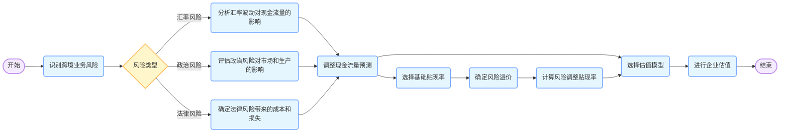

# 如何处理企业估值中的跨境业务风险

> 关键词：企业估值、跨境业务风险、风险处理、估值模型、风险管理

> 摘要：本文聚焦于企业估值中跨境业务风险的处理。首先介绍了相关背景，包括目的范围、预期读者等。接着阐述了核心概念及联系，通过文本示意图和 Mermaid 流程图展示。详细讲解了核心算法原理与操作步骤，并给出 Python 代码示例。探讨了数学模型和公式，结合实例说明。进行项目实战，包括开发环境搭建、代码实现与解读。分析了实际应用场景，推荐了工具和资源。最后总结未来发展趋势与挑战，提供常见问题解答和扩展阅读参考资料，旨在为企业在处理跨境业务风险时的估值提供全面、专业的指导。

## 1. 背景介绍 
### 1.1 目的和范围
在全球化的背景下，越来越多的企业开展跨境业务。然而，跨境业务面临着诸多风险，如汇率波动、政治风险、法律差异等，这些风险会对企业的价值产生重大影响。本文的目的是深入探讨如何在企业估值过程中处理跨境业务风险，为企业管理者、投资者、评估师等提供有效的方法和策略。范围涵盖了跨境业务风险的识别、评估以及在估值模型中的具体处理方式。

### 1.2 预期读者
本文的预期读者包括企业管理人员，他们需要在决策中考虑跨境业务风险对企业价值的影响；投资者，帮助他们准确评估跨境企业的投资价值；专业的企业评估师，为其提供更科学的估值方法；以及对跨境业务和企业估值感兴趣的研究人员和学生。

### 1.3 文档结构概述
本文首先介绍背景知识，让读者了解处理跨境业务风险在企业估值中的重要性。接着阐述核心概念及它们之间的联系，通过直观的方式呈现。然后详细讲解核心算法原理和操作步骤，并给出 Python 代码实现。之后介绍相关的数学模型和公式，并举例说明其应用。通过项目实战，展示如何在实际中处理跨境业务风险。分析实际应用场景，为读者提供实践参考。推荐学习资源、开发工具和相关论文著作，帮助读者进一步深入学习。最后总结未来发展趋势与挑战，解答常见问题，并提供扩展阅读和参考资料。

### 1.4 术语表
#### 1.4.1 核心术语定义
- **企业估值**：对企业整体价值进行评估的过程，通常基于企业的财务状况、市场前景、资产等因素。
- **跨境业务风险**：企业在开展跨国经营活动中面临的各种不确定性，可能导致企业的收益和价值受到影响。
- **风险调整贴现率**：在传统贴现率的基础上，考虑风险因素进行调整后的贴现率，用于更准确地评估项目或企业的价值。
- **蒙特卡罗模拟**：一种通过随机抽样来模拟各种可能情况的方法，常用于评估不确定性和风险。

#### 1.4.2 相关概念解释
- **汇率风险**：由于汇率波动导致企业资产、负债、收入和成本的价值发生变化的风险。例如，一家中国企业在美国有业务，当人民币对美元汇率上升时，该企业以人民币计价的美国业务收入会减少。
- **政治风险**：因政治因素导致企业经营环境发生变化的风险，如政府政策调整、战争、政治动荡等。例如，某国政府突然提高外资企业的税收，会增加企业的运营成本。
- **法律风险**：由于不同国家法律制度的差异，企业可能面临的法律合规问题和法律纠纷风险。例如，在某些国家，数据隐私保护法规非常严格，企业如果违反相关规定，可能面临巨额罚款。

#### 1.4.3 缩略词列表
- **NPV**：净现值（Net Present Value），用于评估投资项目的价值，是将未来现金流量折现到当前的价值减去初始投资。
- **IRR**：内部收益率（Internal Rate of Return），使投资项目净现值为零的折现率，反映项目的实际盈利能力。

## 2. 核心概念与联系 
### 核心概念原理
在企业估值中处理跨境业务风险，涉及到多个核心概念。企业估值的基本原理是基于企业未来的现金流量折现到当前的价值。而跨境业务风险会影响企业未来现金流量的稳定性和大小，以及折现率的选择。

汇率风险会直接影响企业的收入和成本。如果企业的海外销售以当地货币计价，汇率波动会导致以本币计算的收入发生变化。政治风险可能导致企业的生产中断、市场份额下降等，从而影响现金流量。法律风险可能带来法律诉讼成本和声誉损失，同样影响企业的价值。

风险调整贴现率是处理跨境业务风险的重要概念。由于跨境业务风险较高，需要在传统贴现率的基础上增加风险溢价，以反映风险对企业价值的影响。蒙特卡罗模拟则用于模拟各种风险因素的不确定性，通过多次随机抽样生成不同的情景，从而更全面地评估企业的价值。

### 文本示意图
```plaintext
企业估值
|
|-- 现金流量预测
|   |-- 考虑跨境业务风险影响
|       |-- 汇率波动影响收入和成本
|       |-- 政治风险影响市场份额和生产
|       |-- 法律风险影响诉讼成本和声誉
|
|-- 折现率选择
|   |-- 风险调整贴现率
|       |-- 基础贴现率
|       |-- 风险溢价（考虑跨境业务风险）
|
|-- 估值模型
|   |-- 常用模型（如 DCF 模型）
|       |-- 应用调整后的现金流量和折现率
```

### Mermaid 流程图


## 3. 核心算法原理 & 具体操作步骤 
### 核心算法原理
在处理企业估值中的跨境业务风险时，常用的方法是基于现金流折现模型（DCF），并对其进行风险调整。DCF 模型的基本公式为：

$$NPV = \sum_{t=0}^{n} \frac{CF_t}{(1 + r)^t}$$

其中，$NPV$ 是净现值，$CF_t$ 是第 $t$ 期的现金流量，$r$ 是折现率，$n$ 是预测期数。

在考虑跨境业务风险时，需要对现金流量 $CF_t$ 和折现率 $r$ 进行调整。现金流量的调整需要考虑汇率波动、政治风险和法律风险对企业收入、成本和资产的影响。折现率的调整则需要在基础贴现率的基础上加上风险溢价，风险溢价的大小取决于跨境业务风险的程度。

### 具体操作步骤
1. **风险识别**：对企业的跨境业务进行全面分析，识别可能面临的风险，如汇率风险、政治风险、法律风险等。
2. **风险评估**：评估每种风险的可能性和影响程度。可以采用定性和定量相结合的方法，如历史数据分析、专家评估等。
3. **现金流量调整**：根据风险评估的结果，调整企业未来的现金流量预测。例如，如果预计汇率波动会导致海外收入减少，相应地降低现金流量预测值。
4. **折现率调整**：确定基础贴现率，通常可以参考市场利率或行业平均收益率。然后根据跨境业务风险的程度，确定风险溢价，计算风险调整贴现率。
5. **企业估值**：使用调整后的现金流量和折现率，代入 DCF 模型进行企业估值。

### Python 代码实现
```python
import numpy as np

def dcf_valuation(cash_flows, discount_rate):
    """
    计算现金流折现模型的净现值
    :param cash_flows: 现金流量列表，第一个元素为初始投资（负数）
    :param discount_rate: 折现率
    :return: 净现值
    """
    periods = len(cash_flows)
    npv = 0
    for t in range(periods):
        npv += cash_flows[t] / ((1 + discount_rate) ** t)
    return npv

# 示例数据
# 假设初始投资为 -1000，未来 5 年的现金流量分别为 200, 300, 400, 500, 600
cash_flows = [-1000, 200, 300, 400, 500, 600]
# 基础贴现率为 0.1
base_discount_rate = 0.1
# 风险溢价为 0.05
risk_premium = 0.05
# 风险调整贴现率
adjusted_discount_rate = base_discount_rate + risk_premium

# 进行企业估值
npv = dcf_valuation(cash_flows, adjusted_discount_rate)
print(f"调整后的净现值: {npv}")
```

## 4. 数学模型和公式 & 详细讲解 & 举例说明 
### 现金流折现模型（DCF）
#### 公式
$$NPV = \sum_{t=0}^{n} \frac{CF_t}{(1 + r)^t}$$

#### 详细讲解
- $NPV$ 表示净现值，是评估投资项目是否可行的重要指标。如果 $NPV > 0$，则项目通常被认为是可行的；如果 $NPV < 0$，则项目可能不值得投资。
- $CF_t$ 是第 $t$ 期的现金流量。在企业估值中，现金流量可以是企业的自由现金流，即企业在满足所有运营成本和资本支出后剩余的现金流量。
- $r$ 是折现率，反映了资金的时间价值和投资的风险。在考虑跨境业务风险时，$r$ 通常是风险调整贴现率。
- $n$ 是预测期数，即预测企业未来现金流量的时间段。

#### 举例说明
假设一家企业计划开展跨境业务，初始投资为 $1000$ 万元，预计未来 3 年的现金流量分别为 $300$ 万元、$400$ 万元和 $500$ 万元。基础贴现率为 $10\%$，由于跨境业务风险，风险溢价为 $5\%$，则风险调整贴现率 $r = 10\% + 5\% = 15\%$。

根据 DCF 模型计算净现值：

$$NPV = -1000 + \frac{300}{(1 + 0.15)^1} + \frac{400}{(1 + 0.15)^2} + \frac{500}{(1 + 0.15)^3}$$

$$NPV = -1000 + \frac{300}{1.15} + \frac{400}{1.3225} + \frac{500}{1.520875}$$

$$NPV = -1000 + 260.87 + 302.46 + 328.77$$

$$NPV = -107.9$$

由于 $NPV < 0$，从财务角度来看，该跨境业务项目可能不太可行。

### 风险调整贴现率的计算
#### 公式
$$r_{adjusted} = r_{base} + r_{premium}$$

#### 详细讲解
- $r_{adjusted}$ 是风险调整贴现率，用于反映跨境业务风险对企业价值的影响。
- $r_{base}$ 是基础贴现率，通常可以参考市场利率或行业平均收益率。
- $r_{premium}$ 是风险溢价，根据跨境业务风险的程度确定。风险溢价越高，说明跨境业务风险越大。

#### 举例说明
假设市场上类似投资的基础贴现率为 $8\%$，某企业的跨境业务面临较高的政治风险和汇率风险，经过评估，风险溢价确定为 $7\%$。则该企业跨境业务的风险调整贴现率为：

$$r_{adjusted} = 8\% + 7\% = 15\%$$

## 5. 项目实战：代码实际案例和详细解释说明 
### 5.1  开发环境搭建
#### 操作系统
可以选择 Windows、Linux 或 macOS 操作系统。建议使用较新的版本，以确保兼容性和稳定性。

#### Python 环境
安装 Python 3.x 版本，推荐使用 Anaconda 发行版，它包含了许多常用的科学计算库和工具。可以从 Anaconda 官方网站（https://www.anaconda.com/products/individual）下载并安装适合自己操作系统的版本。

#### 安装必要的库
在安装好 Python 环境后，打开命令行工具，使用以下命令安装必要的库：
```sh
pip install numpy
```

### 5.2  源代码详细实现和代码解读
```python
import numpy as np

def dcf_valuation(cash_flows, discount_rate):
    """
    计算现金流折现模型的净现值
    :param cash_flows: 现金流量列表，第一个元素为初始投资（负数）
    :param discount_rate: 折现率
    :return: 净现值
    """
    periods = len(cash_flows)
    npv = 0
    for t in range(periods):
        npv += cash_flows[t] / ((1 + discount_rate) ** t)
    return npv

# 示例数据
# 假设初始投资为 -1000，未来 5 年的现金流量分别为 200, 300, 400, 500, 600
cash_flows = [-1000, 200, 300, 400, 500, 600]
# 基础贴现率为 0.1
base_discount_rate = 0.1
# 风险溢价为 0.05
risk_premium = 0.05
# 风险调整贴现率
adjusted_discount_rate = base_discount_rate + risk_premium

# 进行企业估值
npv = dcf_valuation(cash_flows, adjusted_discount_rate)
print(f"调整后的净现值: {npv}")
```

#### 代码解读
1. **导入必要的库**：
```python
import numpy as np
```
导入 `numpy` 库，用于数值计算。

2. **定义现金流折现模型函数**：
```python
def dcf_valuation(cash_flows, discount_rate):
    periods = len(cash_flows)
    npv = 0
    for t in range(periods):
        npv += cash_flows[t] / ((1 + discount_rate) ** t)
    return npv
```
该函数接受现金流量列表 `cash_flows` 和折现率 `discount_rate` 作为参数，通过循环计算净现值并返回。

3. **设置示例数据**：
```python
cash_flows = [-1000, 200, 300, 400, 500, 600]
base_discount_rate = 0.1
risk_premium = 0.05
adjusted_discount_rate = base_discount_rate + risk_premium
```
设置初始投资和未来 5 年的现金流量，基础贴现率和风险溢价，计算风险调整贴现率。

4. **进行企业估值并输出结果**：
```python
npv = dcf_valuation(cash_flows, adjusted_discount_rate)
print(f"调整后的净现值: {npv}")
```
调用 `dcf_valuation` 函数计算净现值，并将结果打印输出。

### 5.3  代码解读与分析
通过上述代码，我们实现了一个简单的现金流折现模型，并考虑了跨境业务风险对折现率的影响。代码的核心是 `dcf_valuation` 函数，它实现了净现值的计算。在实际应用中，可以根据具体情况调整现金流量和折现率，以更准确地评估企业的价值。

需要注意的是，该代码只是一个简单的示例，实际的企业估值可能需要考虑更多的因素，如不同阶段的现金流量变化、风险因素的动态变化等。可以通过扩展代码，引入更复杂的模型和算法来提高估值的准确性。

## 6. 实际应用场景 
### 跨国企业并购
在跨国企业并购中，准确评估目标企业的价值至关重要。由于目标企业可能存在跨境业务，需要考虑跨境业务风险对其价值的影响。通过识别和评估汇率风险、政治风险和法律风险等，调整现金流量和折现率，使用合适的估值模型进行估值，可以帮助并购方做出更明智的决策。

### 跨境投资决策
投资者在进行跨境投资时，需要评估投资项目的可行性和潜在回报。处理跨境业务风险的估值方法可以帮助投资者更准确地评估项目的价值，考虑风险因素后做出更合理的投资决策。例如，投资者可以通过调整现金流量和折现率，计算不同投资方案的净现值，选择净现值最大的方案。

### 企业战略规划
企业在制定跨境业务战略时，需要了解自身的价值和潜在风险。通过对跨境业务风险进行处理和估值，企业可以评估不同战略方案的可行性和对企业价值的影响，从而选择最优的战略方向。例如，企业可以比较进入不同国家市场的风险和回报，决定优先进入哪些市场。

### 融资活动
企业在进行跨境融资时，如发行债券或股票，需要向投资者展示企业的价值。处理跨境业务风险的估值结果可以为融资活动提供有力的支持，帮助企业吸引投资者并确定合理的融资规模和价格。

## 7. 工具和资源推荐
### 7.1 学习资源推荐
#### 7.1.1 书籍推荐
- 《企业估值：理论与实践》：全面介绍了企业估值的方法和理论，包括如何处理各种风险因素，是企业估值领域的经典著作。
- 《国际财务管理》：详细讲解了跨国企业面临的财务风险和管理方法，对理解跨境业务风险有很大帮助。
- 《风险管理与金融机构》：涵盖了风险管理的基本原理和方法，以及在金融机构和企业中的应用，有助于提高风险评估和处理能力。

#### 7.1.2 在线课程
- Coursera 上的“企业估值与财务建模”课程：由知名教授授课，系统地介绍了企业估值的方法和财务建模技巧。
- edX 上的“国际金融与风险管理”课程：专注于国际金融领域的风险管理，包括跨境业务风险的处理。

#### 7.1.3 技术博客和网站
- Seeking Alpha：提供大量的金融分析和企业估值文章，包括对跨境企业的分析和估值案例。
- Investopedia：是一个专业的金融知识网站，有丰富的关于企业估值和风险管理的词条和文章。

### 7.2 开发工具框架推荐
#### 7.2.1 IDE和编辑器
- PyCharm：是一款专业的 Python 集成开发环境，具有强大的代码编辑、调试和分析功能，适合进行企业估值相关的代码开发。
- Jupyter Notebook：是一个交互式的开发环境，支持 Python 等多种编程语言，方便进行数据分析和模型验证。

#### 7.2.2 调试和性能分析工具
- pdb：Python 自带的调试工具，可以帮助开发者定位代码中的问题。
- cProfile：Python 的性能分析工具，可以分析代码的运行时间和函数调用情况，优化代码性能。

#### 7.2.3 相关框架和库
- NumPy：用于高效的数值计算，在处理现金流量和折现率等数值计算时非常有用。
- Pandas：提供了强大的数据处理和分析功能，可用于处理和分析企业的财务数据。
- Scipy：包含了许多科学计算和统计分析的函数，可用于风险评估和模型优化。

### 7.3 相关论文著作推荐
#### 7.3.1 经典论文
- "Valuation of Cross - Border Acquisitions: A Real Options Approach"：提出了使用实物期权方法对跨境并购进行估值的思路，考虑了跨境业务中的不确定性和灵活性。
- "Exchange Rate Risk and the Valuation of Multinational Firms"：研究了汇率风险对跨国企业价值的影响，并提出了相应的估值调整方法。

#### 7.3.2 最新研究成果
- 关注《Journal of Financial Economics》《Review of Financial Studies》等顶级金融学术期刊，这些期刊会发表关于企业估值和跨境业务风险的最新研究成果。

#### 7.3.3 应用案例分析
- 一些咨询公司和研究机构会发布关于企业估值和跨境业务风险管理的应用案例分析报告，如麦肯锡、波士顿咨询等公司的报告，可以从中学习实际应用中的经验和方法。

## 8. 总结：未来发展趋势与挑战
### 未来发展趋势
#### 数字化和智能化
随着科技的发展，企业估值和跨境业务风险管理将越来越数字化和智能化。人工智能和机器学习技术可以用于更准确地识别和评估跨境业务风险，提高估值的准确性和效率。例如，通过分析大量的市场数据和企业财务数据，预测汇率波动和政治风险的可能性。

#### 整合风险管理
企业将更加注重整合风险管理，将跨境业务风险纳入企业整体风险管理体系。不再孤立地处理各种风险，而是从全局的角度考虑风险之间的相互影响，采取综合的风险管理策略。

#### 可持续发展因素的纳入
未来的企业估值将越来越多地考虑可持续发展因素，如环境、社会和治理（ESG）因素。在跨境业务中，不同国家对可持续发展的要求和标准不同，企业需要考虑这些因素对其价值的影响。

### 挑战
#### 数据质量和可得性
准确的企业估值和风险评估依赖于高质量的数据。然而，在跨境业务中，数据的质量和可得性可能存在问题。不同国家的数据收集和统计标准不同，数据的准确性和完整性难以保证。

#### 复杂多变的风险环境
跨境业务面临的风险环境复杂多变，新的风险因素不断涌现。例如，随着数字化的发展，网络安全风险成为跨境企业面临的重要挑战。企业需要不断更新风险管理策略和方法，以应对复杂多变的风险环境。

#### 国际政策和法规的不确定性
不同国家的政策和法规经常发生变化，这增加了跨境业务的不确定性。企业需要密切关注国际政策和法规的变化，及时调整经营策略和风险管理措施。

## 9. 附录：常见问题与解答
### 问题 1：如何确定风险溢价的大小？
答：确定风险溢价的大小需要综合考虑多种因素。可以参考历史数据，分析类似跨境业务在过去面临的风险和相应的风险溢价。也可以咨询专业的风险评估机构或专家，他们可以根据企业的具体情况和市场环境给出合理的建议。此外，还可以使用一些定量分析方法，如资本资产定价模型（CAPM），结合跨境业务的风险特征来计算风险溢价。

### 问题 2：如果企业的跨境业务涉及多个国家，如何处理不同国家的风险？
答：对于涉及多个国家的跨境业务，需要分别对每个国家的风险进行识别和评估。可以根据不同国家的政治、经济、法律等环境因素，确定各自的风险类型和程度。然后，在调整现金流量和折现率时，综合考虑各个国家的风险影响。例如，可以为每个国家设置不同的风险溢价，或者根据业务在不同国家的分布比例，加权计算总体的风险调整贴现率。

### 问题 3：除了 DCF 模型，还有其他适合处理跨境业务风险的估值模型吗？
答：除了 DCF 模型，还有一些其他的估值模型也可以用于处理跨境业务风险。例如，相对估值模型，如市盈率（P/E）模型、市净率（P/B）模型等，可以通过与同行业的类似企业进行比较来评估企业的价值。实物期权模型则考虑了企业在跨境业务中的灵活性和选择权，适用于评估具有较高不确定性的项目。此外，蒙特卡罗模拟可以与多种估值模型结合使用，通过模拟不同的风险情景，更全面地评估企业的价值。

## 10. 扩展阅读 & 参考资料
### 扩展阅读
- 《金融炼金术》：作者乔治·索罗斯通过自己的投资实践，阐述了金融市场的不确定性和反射性原理，对理解跨境业务中的市场风险有一定的启示。
- 《黑天鹅：如何应对不可预知的未来》：探讨了极端不确定性事件（黑天鹅事件）对金融市场和企业的影响，提醒企业在跨境业务中要考虑到不可预见的风险。

### 参考资料
- 相关的金融和经济数据库，如 Bloomberg、Wind 等，提供了丰富的市场数据和企业财务数据，可用于企业估值和风险分析。
- 各国政府和国际组织发布的经济和政策报告，如世界银行的《全球经济展望》、国际货币基金组织（IMF）的《世界经济展望》等，有助于了解全球经济形势和政策动态。

作者：AI天才研究院/AI Genius Institute & 禅与计算机程序设计艺术 /Zen And The Art of Computer Programming