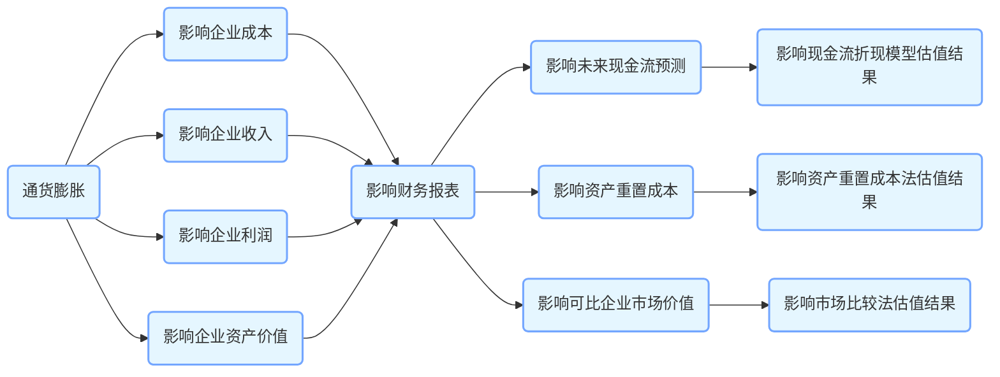

# 如何处理企业估值中的通货膨胀影响

> 关键词：企业估值、通货膨胀、现金流折现模型、资产重置成本、市场比较法

> 摘要：本文旨在深入探讨如何处理企业估值中的通货膨胀影响。首先介绍了研究的背景、目的、预期读者及文档结构等内容。接着阐述了企业估值和通货膨胀的核心概念及其联系，详细讲解了相关核心算法原理与具体操作步骤，包括使用Python代码实现的示例。随后给出了处理通货膨胀影响的数学模型和公式，并结合实际例子进行说明。通过项目实战，展示了代码实际案例并进行详细解释。分析了企业估值中通货膨胀影响的实际应用场景，推荐了相关的学习资源、开发工具框架和论文著作。最后总结了未来发展趋势与挑战，提供了常见问题与解答以及扩展阅读和参考资料，帮助读者全面理解和应对企业估值中通货膨胀的影响。

## 1. 背景介绍 
### 1.1 目的和范围
在经济环境中，通货膨胀是一个不可忽视的因素，它会对企业的财务状况、经营业绩以及未来发展产生多方面的影响。企业估值是评估企业内在价值的重要过程，准确的估值对于投资者、管理者和其他利益相关者做出合理决策至关重要。本研究的目的在于探讨如何在企业估值过程中有效处理通货膨胀的影响，以提高估值的准确性和可靠性。研究范围涵盖了常见的企业估值方法，如现金流折现模型、资产重置成本法、市场比较法等，并分析通货膨胀在不同方法中的作用机制和应对策略。

### 1.2 预期读者
本文预期读者包括金融分析师、投资者、企业管理者、财务顾问以及对企业估值和通货膨胀相关知识感兴趣的学者和研究人员。这些读者可能需要在实际工作或研究中处理企业估值问题，了解通货膨胀对估值的影响并掌握相应的处理方法将有助于他们做出更明智的决策。

### 1.3 文档结构概述
本文首先介绍了企业估值和通货膨胀的核心概念及其联系，为后续的分析奠定基础。接着详细讲解了处理通货膨胀影响的核心算法原理和具体操作步骤，包括使用Python代码实现的示例。然后给出了相关的数学模型和公式，并结合实际例子进行说明。通过项目实战，展示了代码实际案例并进行详细解释。分析了企业估值中通货膨胀影响的实际应用场景，推荐了相关的学习资源、开发工具框架和论文著作。最后总结了未来发展趋势与挑战，提供了常见问题与解答以及扩展阅读和参考资料。

### 1.4 术语表
#### 1.4.1 核心术语定义
- **企业估值**：指对企业的内在价值进行评估的过程，通过各种方法和模型来确定企业的合理价值，为投资、并购、重组等决策提供依据。
- **通货膨胀**：是指在货币流通条件下，因货币供给大于货币实际需求，也即现实购买力大于产出供给，导致货币贬值，而引起的一段时间内物价持续而普遍地上涨现象。
- **现金流折现模型（DCF）**：通过预测企业未来的现金流，并将其折现到当前时点来计算企业价值的一种估值方法。
- **资产重置成本**：指重新购置或建造与原有资产具有相同功能和效用的全新资产所需的成本。
- **市场比较法**：通过比较类似企业的市场价值来评估目标企业价值的方法。

#### 1.4.2 相关概念解释
- **名义现金流**：指未考虑通货膨胀因素的实际现金流金额。
- **实际现金流**：指经过通货膨胀调整后的现金流，反映了现金流的真实购买力。
- **名义折现率**：包含了通货膨胀因素的折现率。
- **实际折现率**：剔除了通货膨胀因素的折现率。

#### 1.4.3 缩略词列表
- **DCF**：现金流折现模型（Discounted Cash Flow）

## 2. 核心概念与联系 

### 2.1 企业估值概念
企业估值是一个综合性的过程，旨在确定企业的内在价值。不同的估值方法基于不同的理论和假设，适用于不同类型的企业和行业。常见的企业估值方法包括现金流折现模型、资产重置成本法、市场比较法等。

- **现金流折现模型（DCF）**：该方法基于企业未来的现金流来评估企业价值。其基本原理是，企业的价值等于其未来产生的所有现金流的现值之和。通过预测企业未来的自由现金流，并选择合适的折现率将其折现到当前时点，从而得到企业的估值。
- **资产重置成本法**：这种方法通过计算重新购置或建造与原有资产具有相同功能和效用的全新资产所需的成本来评估企业价值。它主要适用于资产密集型企业，如制造业企业。
- **市场比较法**：该方法通过比较类似企业的市场价值来评估目标企业价值。通常选择与目标企业具有相似业务、规模、财务状况等特征的可比企业，根据可比企业的市场倍数（如市盈率、市净率等）来估算目标企业的价值。

### 2.2 通货膨胀概念
通货膨胀是一种经济现象，它会导致物价普遍上涨，货币贬值。通货膨胀的原因多种多样，包括货币供应量过多、需求拉动、成本推动等。通货膨胀对经济和企业的影响广泛而复杂，它会影响企业的成本、收入、利润、资产价值等多个方面。

### 2.3 核心概念联系
通货膨胀与企业估值之间存在着密切的联系。通货膨胀会对企业的财务报表和未来现金流产生影响，进而影响企业估值的准确性。在现金流折现模型中，通货膨胀会影响未来现金流的预测和折现率的选择。如果不考虑通货膨胀因素，可能会导致估值结果偏高或偏低。在资产重置成本法中，通货膨胀会导致资产重置成本上升，从而影响企业的估值。在市场比较法中，通货膨胀会影响可比企业的市场价值，进而影响目标企业的估值。

### 2.4 文本示意图
企业估值与通货膨胀的关系可以用以下示意图表示：

企业估值方法包括现金流折现模型、资产重置成本法、市场比较法等。通货膨胀会对企业的成本、收入、利润、资产价值等产生影响，进而影响企业的财务报表和未来现金流。这些影响会传递到企业估值方法中，影响估值结果的准确性。

### 2.5 Mermaid 流程图


## 3. 核心算法原理 & 具体操作步骤 

### 3.1 现金流折现模型中处理通货膨胀的算法原理
在现金流折现模型中，处理通货膨胀的关键在于正确区分名义现金流和实际现金流，以及名义折现率和实际折现率。

- **名义现金流与实际现金流**：名义现金流是未考虑通货膨胀因素的实际现金流金额，而实际现金流是经过通货膨胀调整后的现金流，反映了现金流的真实购买力。两者之间的关系可以用以下公式表示：
  $实际现金流 = \frac{名义现金流}{(1 + 通货膨胀率)^n}$
  其中，$n$ 表示现金流发生的年份。

- **名义折现率与实际折现率**：名义折现率包含了通货膨胀因素，而实际折现率剔除了通货膨胀因素。两者之间的关系可以用费雪方程式表示：
  $(1 + 名义折现率) = (1 + 实际折现率)×(1 + 通货膨胀率)$
  即：$实际折现率 = \frac{1 + 名义折现率}{1 + 通货膨胀率} - 1$

### 3.2 具体操作步骤
#### 3.2.1 预测名义现金流
首先，根据企业的历史财务数据、市场趋势和行业前景等因素，预测企业未来的名义现金流。

#### 3.2.2 确定通货膨胀率
可以参考宏观经济数据、政府发布的统计信息或专业机构的预测，确定合适的通货膨胀率。

#### 3.2.3 计算实际现金流
根据上述公式，将名义现金流调整为实际现金流。

#### 3.2.4 确定实际折现率
根据费雪方程式，将名义折现率调整为实际折现率。

#### 3.2.5 计算企业价值
使用实际现金流和实际折现率，按照现金流折现模型的公式计算企业价值：
$企业价值 = \sum_{t = 1}^{n}\frac{实际现金流_t}{(1 + 实际折现率)^t}$
其中，$t$ 表示现金流发生的年份，$n$ 表示预测期的年数。

### 3.3 Python 源代码实现
```python
# 定义函数计算实际现金流
def calculate_real_cash_flow(nominal_cash_flow, inflation_rate, year):
    return nominal_cash_flow / (1 + inflation_rate) ** year

# 定义函数计算实际折现率
def calculate_real_discount_rate(nominal_discount_rate, inflation_rate):
    return (1 + nominal_discount_rate) / (1 + inflation_rate) - 1

# 定义函数计算企业价值
def calculate_enterprise_value(nominal_cash_flows, inflation_rate, nominal_discount_rate):
    real_discount_rate = calculate_real_discount_rate(nominal_discount_rate, inflation_rate)
    enterprise_value = 0
    for year, nominal_cash_flow in enumerate(nominal_cash_flows, start=1):
        real_cash_flow = calculate_real_cash_flow(nominal_cash_flow, inflation_rate, year)
        enterprise_value += real_cash_flow / (1 + real_discount_rate) ** year
    return enterprise_value

# 示例数据
nominal_cash_flows = [100, 120, 150, 180, 200]  # 名义现金流
inflation_rate = 0.03  # 通货膨胀率
nominal_discount_rate = 0.1  # 名义折现率

# 计算企业价值
enterprise_value = calculate_enterprise_value(nominal_cash_flows, inflation_rate, nominal_discount_rate)
print(f"企业价值: {enterprise_value}")
```

## 4. 数学模型和公式 & 详细讲解 & 举例说明 

### 4.1 现金流折现模型中的数学模型和公式
#### 4.1.1 名义现金流与实际现金流的关系
如前所述，名义现金流与实际现金流的关系可以用以下公式表示：
$$实际现金流 = \frac{名义现金流}{(1 + 通货膨胀率)^n}$$
这个公式的原理是，通货膨胀会导致货币贬值，因此未来的名义现金流需要经过调整才能反映其真实的购买力。例如，假设某企业在第 1 年的名义现金流为 100 万元，通货膨胀率为 3%，则该年的实际现金流为：
$$实际现金流 = \frac{100}{(1 + 0.03)^1} \approx 97.09 万元$$

#### 4.1.2 名义折现率与实际折现率的关系
名义折现率与实际折现率的关系可以用费雪方程式表示：
$$(1 + 名义折现率) = (1 + 实际折现率)×(1 + 通货膨胀率)$$
变形可得：
$$实际折现率 = \frac{1 + 名义折现率}{1 + 通货膨胀率} - 1$$
例如，假设名义折现率为 10%，通货膨胀率为 3%，则实际折现率为：
$$实际折现率 = \frac{1 + 0.1}{1 + 0.03} - 1 \approx 0.068 = 6.8\%$$

#### 4.1.3 企业价值的计算公式
企业价值的计算公式为：
$$企业价值 = \sum_{t = 1}^{n}\frac{实际现金流_t}{(1 + 实际折现率)^t}$$
其中，$t$ 表示现金流发生的年份，$n$ 表示预测期的年数。例如，假设某企业未来 5 年的实际现金流分别为 97.09 万元、110.84 万元、132.56 万元、153.48 万元、167.92 万元，实际折现率为 6.8%，则该企业的价值为：
$$企业价值 = \frac{97.09}{(1 + 0.068)^1} + \frac{110.84}{(1 + 0.068)^2} + \frac{132.56}{(1 + 0.068)^3} + \frac{153.48}{(1 + 0.068)^4} + \frac{167.92}{(1 + 0.068)^5} \approx 500 万元$$

### 4.2 资产重置成本法中的数学模型和公式
在资产重置成本法中，考虑通货膨胀的资产重置成本可以用以下公式计算：
$$资产重置成本 = 原始资产成本×(1 + 通货膨胀率)^n$$
其中，$n$ 表示从资产购置到评估时点的年数。例如，某企业在 5 年前购置了一项资产，原始成本为 100 万元，通货膨胀率为 3%，则该资产的重置成本为：
$$资产重置成本 = 100×(1 + 0.03)^5 \approx 115.93 万元$$

### 4.3 市场比较法中的数学模型和公式
在市场比较法中，通货膨胀会影响可比企业的市场价值。假设可比企业的市盈率为 $P/E$，目标企业的每股收益为 $EPS$，通货膨胀率为 $i$，则考虑通货膨胀因素后的目标企业价值可以用以下公式计算：
$$目标企业价值 = EPS×P/E×(1 + i)^n$$
其中，$n$ 表示预测期的年数。例如，某可比企业的市盈率为 20，目标企业的每股收益为 5 元，通货膨胀率为 3%，预测期为 3 年，则考虑通货膨胀因素后的目标企业价值为：
$$目标企业价值 = 5×20×(1 + 0.03)^3 \approx 118.37 元$$

## 5. 项目实战：代码实际案例和详细解释说明 

### 5.1  开发环境搭建
#### 5.1.1 安装 Python
首先，需要安装 Python 编程语言。可以从 Python 官方网站（https://www.python.org/downloads/）下载适合自己操作系统的 Python 安装包，并按照安装向导进行安装。

#### 5.1.2 安装开发工具
推荐使用 PyCharm 作为开发工具，它是一款功能强大的 Python 集成开发环境（IDE）。可以从 PyCharm 官方网站（https://www.jetbrains.com/pycharm/download/）下载适合自己操作系统的 PyCharm 安装包，并按照安装向导进行安装。

### 5.2  源代码详细实现和代码解读
以下是一个完整的 Python 代码示例，用于处理企业估值中的通货膨胀影响：
```python
# 定义函数计算实际现金流
def calculate_real_cash_flow(nominal_cash_flow, inflation_rate, year):
    """
    计算实际现金流
    :param nominal_cash_flow: 名义现金流
    :param inflation_rate: 通货膨胀率
    :param year: 现金流发生的年份
    :return: 实际现金流
    """
    return nominal_cash_flow / (1 + inflation_rate) ** year

# 定义函数计算实际折现率
def calculate_real_discount_rate(nominal_discount_rate, inflation_rate):
    """
    计算实际折现率
    :param nominal_discount_rate: 名义折现率
    :param inflation_rate: 通货膨胀率
    :return: 实际折现率
    """
    return (1 + nominal_discount_rate) / (1 + inflation_rate) - 1

# 定义函数计算企业价值
def calculate_enterprise_value(nominal_cash_flows, inflation_rate, nominal_discount_rate):
    """
    计算企业价值
    :param nominal_cash_flows: 名义现金流列表
    :param inflation_rate: 通货膨胀率
    :param nominal_discount_rate: 名义折现率
    :return: 企业价值
    """
    real_discount_rate = calculate_real_discount_rate(nominal_discount_rate, inflation_rate)
    enterprise_value = 0
    for year, nominal_cash_flow in enumerate(nominal_cash_flows, start=1):
        real_cash_flow = calculate_real_cash_flow(nominal_cash_flow, inflation_rate, year)
        enterprise_value += real_cash_flow / (1 + real_discount_rate) ** year
    return enterprise_value

# 示例数据
nominal_cash_flows = [100, 120, 150, 180, 200]  # 名义现金流
inflation_rate = 0.03  # 通货膨胀率
nominal_discount_rate = 0.1  # 名义折现率

# 计算企业价值
enterprise_value = calculate_enterprise_value(nominal_cash_flows, inflation_rate, nominal_discount_rate)
print(f"企业价值: {enterprise_value}")
```
### 5.3  代码解读与分析
- **calculate_real_cash_flow 函数**：该函数接受名义现金流、通货膨胀率和现金流发生的年份作为参数，根据公式计算