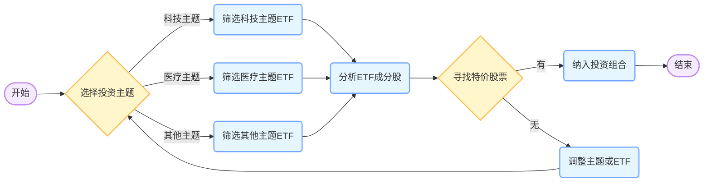

# 如何将特价股票策略与主题式ETF投资相结合

> 关键词：特价股票策略、主题式ETF、投资组合、价值投资、风险管理

> 摘要：本文旨在深入探讨如何将特价股票策略与主题式ETF投资相结合，为投资者提供一种创新且有效的投资方法。首先介绍了特价股票策略和主题式ETF的基本概念，分析了两者结合的背景和意义。接着详细阐述了核心概念及联系，包括原理和架构，并通过Mermaid流程图展示其逻辑关系。在算法原理和操作步骤方面，使用Python代码进行了详细说明。同时，给出了相关的数学模型和公式，并举例说明。通过项目实战，展示了代码实现和解读。最后探讨了实际应用场景、推荐了相关工具和资源，总结了未来发展趋势与挑战，并对常见问题进行了解答。

## 1. 背景介绍 
### 1.1 目的和范围
在当今复杂多变的金融市场中，投资者一直在寻求更有效的投资策略以实现资产的保值增值。特价股票策略注重寻找被市场低估的股票，通过价值发现获取超额收益；而主题式ETF则聚焦于特定主题领域，为投资者提供了一种便捷的多元化投资方式。本文章的目的是探讨如何将这两种策略有机结合，以充分发挥它们的优势，提高投资组合的绩效。范围涵盖了特价股票策略和主题式ETF的基本概念、结合的原理和方法、实际应用案例以及相关的工具和资源等方面。

### 1.2 预期读者
本文适合对金融投资有一定了解，希望探索创新投资策略的投资者，包括个人投资者、机构投资者以及金融专业的学生和研究人员。对于那些希望优化投资组合、提高投资回报率的人士，本文将提供有价值的参考和指导。

### 1.3 文档结构概述
本文将按照以下结构进行阐述：首先介绍核心概念与联系，包括特价股票策略和主题式ETF的原理和架构，并通过Mermaid流程图展示其逻辑关系；接着详细讲解核心算法原理和具体操作步骤，使用Python代码进行说明；然后给出相关的数学模型和公式，并举例说明；通过项目实战，展示代码实现和解读；探讨实际应用场景；推荐相关工具和资源；总结未来发展趋势与挑战；最后对常见问题进行解答，并提供扩展阅读和参考资料。

### 1.4 术语表
#### 1.4.1 核心术语定义
- **特价股票策略**：一种投资策略，通过分析股票的基本面和市场价格，寻找被低估的股票进行投资，期望在股票价格回归其内在价值时获得收益。
- **主题式ETF**：交易型开放式指数基金，它跟踪特定主题领域的指数，如科技、医疗、环保等，为投资者提供了一种投资特定主题的便捷方式。
- **投资组合**：由多种不同的投资资产组成的集合，旨在通过分散投资降低风险，提高收益。

#### 1.4.2 相关概念解释
- **价值投资**：一种基于股票内在价值的投资理念，认为股票价格会围绕其内在价值波动，投资者应选择被低估的股票进行投资。
- **多元化投资**：通过投资多种不同的资产，降低单一资产波动对投资组合的影响，提高投资组合的稳定性。

#### 1.4.3 缩略词列表
- **ETF**：交易型开放式指数基金（Exchange Traded Fund）

## 2. 核心概念与联系 
### 核心概念原理
#### 特价股票策略原理
特价股票策略基于价值投资的理念，其核心原理是通过对股票的基本面分析，如财务报表、盈利能力、行业地位等，评估股票的内在价值。当市场价格低于内在价值时，认为该股票被低估，具有投资价值。投资者买入这些被低估的股票，等待市场发现其价值，推动股价上涨，从而获得收益。

#### 主题式ETF原理
主题式ETF是一种被动式投资工具，它跟踪特定主题领域的指数。基金公司根据指数的成分股构建投资组合，投资者通过购买ETF份额，间接投资于该主题领域的一篮子股票。主题式ETF的优势在于它提供了多元化投资，降低了单一股票的风险，同时交易成本相对较低，流动性较好。

### 架构示意图


### 核心概念联系
特价股票策略和主题式ETF投资可以相互补充。主题式ETF为投资者提供了一种快速进入特定主题领域的方式，通过投资ETF可以获得该主题领域的整体收益。而特价股票策略则可以在主题式ETF的成分股中寻找被低估的股票，进一步提高投资组合的收益。通过将两者结合，投资者可以在获得主题投资机会的同时，利用特价股票策略挖掘潜在的超额收益。

## 3. 核心算法原理 & 具体操作步骤 
### 核心算法原理
#### 特价股票筛选算法
特价股票筛选算法的核心是计算股票的内在价值，并与市场价格进行比较。常用的方法是使用财务指标，如市盈率（P/E）、市净率（P/B）等。具体步骤如下：
1. 收集股票的财务数据，包括净利润、净资产等。
2. 计算股票的市盈率和市净率。
3. 与同行业或市场平均水平进行比较，筛选出市盈率和市净率较低的股票。

#### 主题式ETF选择算法
主题式ETF选择算法的核心是评估ETF的跟踪误差、规模、流动性等指标。具体步骤如下：
1. 确定投资主题。
2. 收集该主题领域的所有ETF信息。
3. 计算每个ETF的跟踪误差、规模和流动性等指标。
4. 选择跟踪误差较小、规模较大、流动性较好的ETF。

### 具体操作步骤
#### 步骤1：确定投资主题
根据市场趋势和个人投资偏好，选择一个或多个投资主题，如科技、医疗、环保等。

#### 步骤2：筛选主题式ETF
使用主题式ETF选择算法，筛选出符合要求的主题式ETF。

#### 步骤3：分析ETF成分股
获取所选ETF的成分股列表，对每个成分股进行财务分析，使用特价股票筛选算法，筛选出被低估的股票。

#### 步骤4：构建投资组合
将筛选出的特价股票和主题式ETF纳入投资组合，根据个人风险偏好和投资目标，确定各资产的权重。

### Python源代码实现
```python
import pandas as pd
import yfinance as yf

# 特价股票筛选函数
def select_bargain_stocks(tickers):
    bargain_stocks = []
    for ticker in tickers:
        try:
            stock = yf.Ticker(ticker)
            info = stock.info
            if 'trailingPE' in info and 'priceToBook' in info:
                pe_ratio = info['trailingPE']
                pb_ratio = info['priceToBook']
                # 假设市盈率低于20且市净率低于1.5为特价股票
                if pe_ratio < 20 and pb_ratio < 1.5:
                    bargain_stocks.append(ticker)
        except Exception as e:
            print(f"Error fetching data for {ticker}: {e}")
    return bargain_stocks

# 主题式ETF选择函数
def select_theme_etfs(theme):
    # 这里简单假设已经有一个包含ETF信息的DataFrame
    etf_data = pd.DataFrame({
        'ETF': ['ETF1', 'ETF2', 'ETF3'],
        'Theme': ['Technology', 'Healthcare', 'Technology'],
        'TrackingError': [0.01, 0.02, 0.015],
        'AssetsUnderManagement': [100000000, 50000000, 80000000],
        'AverageDailyVolume': [100000, 50000, 80000]
    })
    theme_etfs = etf_data[etf_data['Theme'] == theme]
    # 选择跟踪误差较小、规模较大、流动性较好的ETF
    selected_etfs = theme_etfs[(theme_etfs['TrackingError'] < 0.02) & 
                               (theme_etfs['AssetsUnderManagement'] > 50000000) & 
                               (theme_etfs['AverageDailyVolume'] > 50000)]['ETF'].tolist()
    return selected_etfs

# 主函数
def main():
    theme = 'Technology'
    # 选择主题式ETF
    etfs = select_theme_etfs(theme)
    print(f"Selected theme ETFs: {etfs}")
    
    # 获取ETF成分股
    # 这里简单假设已经有一个包含ETF成分股信息的字典
    etf_components = {
        'ETF1': ['AAPL', 'MSFT', 'GOOG'],
        'ETF2': ['JNJ', 'PFE', 'MRK'],
        'ETF3': ['NVDA', 'AMD', 'TSLA']
    }
    all_tickers = []
    for etf in etfs:
        all_tickers.extend(etf_components[etf])
    
    # 筛选特价股票
    bargain_stocks = select_bargain_stocks(all_tickers)
    print(f"Selected bargain stocks: {bargain_stocks}")

if __name__ == "__main__":
    main()
```

## 4. 数学模型和公式 & 详细讲解 & 举例说明 
### 市盈率（P/E）模型
#### 公式
市盈率（P/E）是指股票价格与每股收益（EPS）的比率，计算公式为：
$$P/E = \frac{Price}{EPS}$$
其中，$Price$ 是股票的市场价格，$EPS$ 是每股收益。

#### 详细讲解
市盈率是衡量股票估值的重要指标之一。一般来说，市盈率较低的股票可能被低估，具有投资价值；而市盈率较高的股票可能被高估，投资风险较大。但是，市盈率也受到行业、公司盈利增长等因素的影响，不同行业的市盈率水平可能存在较大差异。

#### 举例说明
假设某股票的市场价格为 $50$ 美元，每股收益为 $5$ 美元，则该股票的市盈率为：
$$P/E = \frac{50}{5} = 10$$
如果该行业的平均市盈率为 $15$，则该股票的市盈率低于行业平均水平，可能被低估。

### 市净率（P/B）模型
#### 公式
市净率（P/B）是指股票价格与每股净资产（BVPS）的比率，计算公式为：
$$P/B = \frac{Price}{BVPS}$$
其中，$Price$ 是股票的市场价格，$BVPS$ 是每股净资产。

#### 详细讲解
市净率反映了股票价格与公司净资产的关系。一般来说，市净率较低的股票可能被低估，具有投资价值；而市净率较高的股票可能被高估，投资风险较大。但是，市净率也受到行业、公司资产质量等因素的影响，不同行业的市净率水平可能存在较大差异。

#### 举例说明
假设某股票的市场价格为 $30$ 美元，每股净资产为 $20$ 美元，则该股票的市净率为：
$$P/B = \frac{30}{20} = 1.5$$
如果该行业的平均市净率为 $2$，则该股票的市净率低于行业平均水平，可能被低估。

### 投资组合风险模型
#### 公式
投资组合的风险可以用方差来衡量，计算公式为：
$$\sigma_p^2 = \sum_{i=1}^{n} w_i^2 \sigma_i^2 + 2 \sum_{1 \leq i < j \leq n} w_i w_j \rho_{ij} \sigma_i \sigma_j$$
其中，$\sigma_p^2$ 是投资组合的方差，$w_i$ 和 $w_j$ 分别是资产 $i$ 和资产 $j$ 的权重，$\sigma_i$ 和 $\sigma_j$ 分别是资产 $i$ 和资产 $j$ 的标准差，$\rho_{ij}$ 是资产 $i$ 和资产 $j$ 的相关系数。

#### 详细讲解
投资组合的风险不仅取决于单个资产的风险，还取决于资产之间的相关性。通过合理配置资产的权重，可以降低投资组合的风险。当资产之间的相关性较低时，投资组合的风险可以得到有效分散。

#### 举例说明
假设投资组合由两种资产组成，资产 $A$ 的权重为 $0.6$，标准差为 $0.2$；资产 $B$ 的权重为 $0.4$，标准差为 $0.3$，两种资产的相关系数为 $0.5$。则投资组合的方差为：
$$\sigma_p^2 = 0.6^2 \times 0.2^2 + 0.4^2 \times 0.3^2 + 2 \times 0.6 \times 0.4 \times 0.5 \times 0.2 \times 0.3$$
$$= 0.0144 + 0.0144 + 0.0144$$
$$= 0.0432$$
投资组合的标准差为：
$$\sigma_p = \sqrt{0.0432} \approx 0.208$$

## 5. 项目实战：代码实际案例和详细解释说明 
### 5.1  开发环境搭建
#### 安装Python
首先，需要安装Python开发环境。可以从Python官方网站（https://www.python.org/downloads/）下载适合自己操作系统的Python版本，并按照安装向导进行安装。

#### 安装必要的库
在项目中，需要使用 `pandas` 和 `yfinance` 库。可以使用以下命令进行安装：
```sh
pip install pandas yfinance
```

### 5.2  源代码详细实现和代码解读
```python
import pandas as pd
import yfinance as yf

# 特价股票筛选函数
def select_bargain_stocks(tickers):
    bargain_stocks = []
    for ticker in tickers:
        try:
            stock = yf.Ticker(ticker)
            info = stock.info
            if 'trailingPE' in info and 'priceToBook' in info:
                pe_ratio = info['trailingPE']
                pb_ratio = info['priceToBook']
                # 假设市盈率低于20且市净率低于1.5为特价股票
                if pe_ratio < 20 and pb_ratio < 1.5:
                    bargain_stocks.append(ticker)
        except Exception as e:
            print(f"Error fetching data for {ticker}: {e}")
    return bargain_stocks

# 主题式ETF选择函数
def select_theme_etfs(theme):
    # 这里简单假设已经有一个包含ETF信息的DataFrame
    etf_data = pd.DataFrame({
        'ETF': ['ETF1', 'ETF2', 'ETF3'],
        'Theme': ['Technology', 'Healthcare', 'Technology'],
        'TrackingError': [0.01, 0.02, 0.015],
        'AssetsUnderManagement': [100000000, 50000000, 80000000],
        'AverageDailyVolume': [100000, 50000, 80000]
    })
    theme_etfs = etf_data[etf_data['Theme'] == theme]
    # 选择跟踪误差较小、规模较大、流动性较好的ETF
    selected_etfs = theme_etfs[(theme_etfs['TrackingError'] < 0.02) & 
                               (theme_etfs['AssetsUnderManagement'] > 50000000) & 
                               (theme_etfs['AverageDailyVolume'] > 50000)]['ETF'].tolist()
    return selected_etfs

# 主函数
def main():
    theme = 'Technology'
    # 选择主题式ETF
    etfs = select_theme_etfs(theme)
    print(f"Selected theme ETFs: {etfs}")
    
    # 获取ETF成分股
    # 这里简单假设已经有一个包含ETF成分股信息的字典
    etf_components = {
        'ETF1': ['AAPL', 'MSFT', 'GOOG'],
        'ETF2': ['JNJ', 'PFE', 'MRK'],
        'ETF3': ['NVDA', 'AMD', 'TSLA']
    }
    all_tickers = []
    for etf in etfs:
        all_tickers.extend(etf_components[etf])
    
    # 筛选特价股票
    bargain_stocks = select_bargain_stocks(all_tickers)
    print(f"Selected bargain stocks: {bargain_stocks}")

if __name__ == "__main__":
    main()
```

#### 代码解读
1. **导入必要的库**：导入 `pandas` 和 `yfinance` 库，用于数据处理和获取股票信息。
2. **特价股票筛选函数 `select_bargain_stocks`**：该函数接受一个股票代码列表作为输入，遍历每个股票代码，使用 `yfinance` 库获取股票信息，计算市盈率和市净率，筛选出市盈率低于20且市净率低于1.5的股票。
3. **主题式ETF选择函数 `select_theme_etfs`**：该函数接受一个投资主题作为输入，使用 `pandas` 库筛选出符合该主题的ETF，并选择跟踪误差较小、规模较大、流动性较好的ETF。
4. **主函数 `main`**：首先选择投资主题为科技主题，调用 `select_theme_etfs` 函数选择主题式ETF，然后获取所选ETF的成分股列表，调用 `select_bargain_stocks` 函数筛选出特价股票，并打印结果。

### 5.3  代码解读与分析
#### 优点
- 代码结构清晰，将不同的功能封装成函数，提高了代码的可读性和可维护性。
- 使用 `yfinance` 库可以方便地获取股票信息，使用 `pandas` 库可以方便地进行数据处理和筛选。

#### 缺点
- 代码中使用了简单的假设数据，如ETF信息和ETF成分股信息，实际应用中需要从真实数据源获取数据。
- 特价股票筛选和主题式ETF选择的标准比较简单，实际应用中需要根据市场情况和个人投资目标进行调整。

## 6. 实际应用场景 
### 个人投资者
个人投资者可以使用这种结合策略来构建自己的投资组合。通过选择自己感兴趣的主题式ETF，如科技、医疗等，然后在ETF的成分股中寻找特价股票，将其纳入投资组合。这样既可以获得主题投资的机会，又可以通过特价股票策略挖掘潜在的超额收益。同时，通过分散投资于不同的资产，可以降低投资组合的风险。

### 机构投资者
机构投资者可以使用这种结合策略来管理大规模的资产。通过对不同主题领域的深入研究，选择合适的主题式ETF，并在ETF成分股中筛选出特价股票，构建多元化的投资组合。机构投资者还可以利用自己的研究资源和专业知识，对特价股票进行更深入的分析和评估，提高投资组合的绩效。

### 投资顾问
投资顾问可以将这种结合策略推荐给客户。根据客户的投资目标、风险偏好和投资期限，为客户选择合适的主题式ETF和特价股票，构建个性化的投资组合。投资顾问还可以定期对投资组合进行监控和调整，确保投资组合的绩效符合客户的预期。

## 7. 工具和资源推荐
### 7.1 学习资源推荐
#### 7.1.1 书籍推荐
- 《聪明的投资者》（The Intelligent Investor）：本杰明·格雷厄姆（Benjamin Graham）著，被誉为价值投资的圣经，详细介绍了价值投资的理念和方法。
- 《漫步华尔街》（A Random Walk Down Wall Street）：伯顿·马尔基尔（Burton Malkiel）著，探讨了各种投资策略和市场理论，对投资者有很大的启发。
- 《ETF投资指南》（The ETF Book）：理查德·A·费里（Richard A. Ferri）著，全面介绍了ETF的基本知识、投资策略和风险管理。

#### 7.1.2 在线课程
- Coursera上的“投资学原理”（Principles of Investing）课程，由耶鲁大学教授授课，系统介绍了投资学的基本原理和方法。
- Udemy上的“ETF投资实战”（ETF Investing for Beginners）课程，适合初学者学习ETF投资的基本知识和技巧。

#### 7.1.3 技术博客和网站
- Seeking Alpha（https://seekingalpha.com/）：提供股票、ETF等金融产品的分析和评论，有很多专业投资者和分析师分享自己的观点和研究成果。
- ETF.com（https://etf.com/）：专注于ETF的研究和分析，提供ETF的基本信息、行情数据、投资策略等内容。

### 7.2 开发工具框架推荐
#### 7.2.1 IDE和编辑器
- PyCharm：一款专业的Python集成开发环境，具有代码编辑、调试、版本控制等功能，适合Python开发。
- Jupyter Notebook：一个交互式的开发环境，支持Python、R等多种编程语言，适合数据科学和机器学习开发。

#### 7.2.2 调试和性能分析工具
- pdb：Python自带的调试工具，可以帮助开发者调试代码，查找问题。
- cProfile：Python自带的性能分析工具，可以分析代码的运行时间和函数调用情况，帮助开发者优化代码性能。

#### 7.2.3 相关框架和库
- Pandas：一个强大的数据处理和分析库，提供了DataFrame等数据结构，方便进行数据清洗、转换和分析。
- NumPy：一个用于科学计算的Python库，提供了高效的数组操作和数学函数，是很多数据科学和机器学习库的基础。
- Scikit-learn：一个常用的机器学习库，提供了各种机器学习算法和工具，如分类、回归、聚类等。

### 7.3 相关论文著作推荐
#### 7.3.1 经典论文
- Fama, E. F., & French, K. R. (1992). The cross-section of expected stock returns. The Journal of Finance, 47(2), 427-465. 该论文提出了Fama-French三因子模型，对股票收益率的影响因素进行了深入研究。
- Sharpe, W. F. (1964). Capital asset prices: A theory of market equilibrium under conditions of risk. The Journal of Finance, 19(3), 425-442. 该论文提出了资本资产定价模型（CAPM），为资产定价和风险管理提供了重要的理论基础。

#### 7.3.2 最新研究成果
- Ang, A. (2014). Asset management: A systematic approach to factor investing. Oxford University Press. 该书介绍了因子投资的理论和实践，对现代投资组合管理有很大的指导意义。
- Cochrane, J. H. (2017). Asset pricing: Revised edition. Princeton University Press. 该书全面介绍了资产定价的理论和方法，是资产定价领域的经典著作。

#### 7.3.3 应用案例分析
- “The Performance of Value and Growth Stocks in Different Market Conditions”：该研究分析了价值股和成长股在不同市场条件下的表现，为投资者选择投资策略提供了参考。
- “ETF Investing in Emerging Markets: Opportunities and Challenges”：该研究探讨了新兴市场ETF投资的机会和挑战，对投资者进行新兴市场投资有很大的帮助。

## 8. 总结：未来发展趋势与挑战
### 未来发展趋势
#### 主题式ETF市场不断扩大
随着投资者对特定主题领域的关注度不断提高，主题式ETF市场将不断扩大。未来，可能会出现更多新的主题式ETF，如人工智能、新能源汽车等，为投资者提供更多的投资选择。

#### 特价股票策略与量化投资相结合
随着信息技术的发展，特价股票策略将与量化投资相结合。通过使用大数据、机器学习等技术，投资者可以更准确地筛选出被低估的股票，提高投资组合的绩效。

#### 投资组合管理更加智能化
未来，投资组合管理将更加智能化。投资者可以使用智能投顾平台，根据自己的投资目标、风险偏好和投资期限，自动构建和调整投资组合。

### 挑战
#### 市场波动风险
金融市场的波动是不可预测的，特价股票策略和主题式ETF投资都面临着市场波动风险。投资者需要具备一定的风险管理能力，合理配置资产，降低投资组合的风险。

#### 数据质量和可靠性
特价股票策略和主题式ETF投资都需要大量的数据支持，数据的质量和可靠性直接影响投资决策的准确性。投资者需要选择可靠的数据来源，对数据进行清洗和处理，确保数据的准确性和完整性。

#### 技术更新换代快
信息技术的发展日新月异，特价股票策略和主题式ETF投资所使用的技术也在不断更新换代。投资者需要不断学习和掌握新的技术，跟上市场的变化。

## 9. 附录：常见问题与解答
### 问题1：特价股票策略和主题式ETF投资的风险哪个更大？
解答：两种投资策略都有一定的风险，但风险的大小取决于多种因素。特价股票策略的风险主要来自于股票价格的波动和公司基本面的变化，如果选择的特价股票基本面恶化，可能会导致投资损失。主题式ETF投资的风险主要来自于主题领域的市场波动和ETF的跟踪误差，如果主题领域的市场表现不佳，或者ETF的跟踪误差较大，也会影响投资收益。一般来说，通过合理配置资产，将两种策略结合使用，可以降低投资组合的风险。

### 问题2：如何确定投资主题？
解答：确定投资主题需要考虑市场趋势、宏观经济环境、行业发展前景等因素。可以关注新兴产业、政策支持的领域、社会热点等，选择具有发展潜力的主题。同时，也需要根据自己的投资目标、风险偏好和投资期限来确定投资主题。例如，如果投资目标是长期增值，可以选择科技、医疗等具有长期增长潜力的主题；如果风险偏好较低，可以选择消费、金融等相对稳定的主题。

### 问题3：如何评估主题式ETF的质量？
解答：评估主题式ETF的质量可以从以下几个方面入手：
1. **跟踪误差**：跟踪误差越小，说明ETF的表现越接近其跟踪的指数，投资效果越好。
2. **规模**：ETF的规模越大，流动性越好，交易成本越低。
3. **流动性**：流动性好的ETF可以在市场上快速买卖，避免价格波动带来的损失。
4. **费用**：ETF的管理费用和交易费用越低，对投资者越有利。

### 问题4：特价股票筛选的标准可以调整吗？
解答：可以。特价股票筛选的标准可以根据市场情况和个人投资目标进行调整。例如，如果市场整体估值较高，可以适当提高市盈率和市净率的筛选标准；如果个人投资目标是追求高收益，可以适当降低筛选标准，增加投资机会。但需要注意的是，筛选标准的调整需要在风险可控的前提下进行。

## 10. 扩展阅读 & 参考资料
### 扩展阅读
- 《金融市场与金融机构》（Financial Markets and Institutions）：介绍了金融市场和金融机构的基本知识和运作机制，对理解金融投资有很大的帮助。
- 《投资心理学》（Investment Psychology）：探讨了投资者的心理因素对投资决策的影响，帮助投资者更好地控制自己的情绪，做出理性的投资决策。

### 参考资料
- Yahoo Finance（https://finance.yahoo.com/）：提供股票、ETF等金融产品的行情数据和分析报告。
- Morningstar（https://www.morningstar.com/）：提供基金、股票等金融产品的评级和分析报告，是投资者进行投资研究的重要工具。

作者：AI天才研究院/AI Genius Institute & 禅与计算机程序设计艺术 /Zen And The Art of Computer Programming