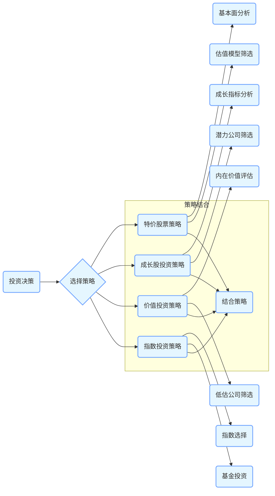

# 如何将特价股票策略与其他投资策略结合

> 关键词：特价股票策略、投资策略、策略结合、资产配置、风险控制

> 摘要：本文旨在深入探讨如何将特价股票策略与其他投资策略相结合。首先介绍了相关背景知识，包括目的范围、预期读者等内容。接着阐述了核心概念及其联系，通过清晰的文本示意图和Mermaid流程图呈现。详细讲解了核心算法原理及具体操作步骤，并结合Python代码进行说明。给出了相关数学模型和公式，并举例分析。通过项目实战展示代码实际案例并进行详细解释。探讨了实际应用场景，推荐了相关工具和资源。最后总结了未来发展趋势与挑战，还设置了常见问题解答和扩展阅读参考资料。通过全面且深入的分析，为投资者提供将特价股票策略与其他策略有效结合的方法和思路，以优化投资组合，降低风险，提高收益。

## 1. 背景介绍 
### 1.1 目的和范围
在金融投资领域，单一的投资策略往往难以适应复杂多变的市场环境。特价股票策略侧重于挖掘价格被低估的股票，期望通过股票价值回归获取收益。然而，这种策略也存在一定局限性，如市场错误定价可能长期存在，或者低估股票可能存在基本面恶化等问题。本文章的目的是研究如何将特价股票策略与其他投资策略相结合，以降低单一策略的风险，提高投资组合的整体收益。范围涵盖了常见的投资策略，如成长股投资策略、价值投资策略、指数投资策略等，并探讨它们与特价股票策略结合的方式、优势和挑战。

### 1.2 预期读者
本文预期读者为有一定投资基础的个人投资者、金融机构的投资分析师、投资组合经理等。这些读者具备基本的金融知识和投资经验，希望通过学习不同投资策略的结合方法，优化自己的投资组合，提升投资绩效。

### 1.3 文档结构概述
本文首先介绍核心概念，包括特价股票策略及其他常见投资策略的定义和特点，并展示它们之间的联系。接着阐述核心算法原理和具体操作步骤，用Python代码实现相关算法。然后给出数学模型和公式，通过实例进行详细讲解。之后进行项目实战，展示代码实际案例并分析。再探讨实际应用场景，推荐相关工具和资源。最后总结未来发展趋势与挑战，设置常见问题解答和提供扩展阅读参考资料。

### 1.4 术语表
#### 1.4.1 核心术语定义
- **特价股票策略**：一种投资策略，通过分析股票的基本面、市场估值等因素，寻找价格低于其内在价值的股票进行投资，期望在股票价值回归时获得收益。
- **成长股投资策略**：重点投资于具有高成长潜力的公司股票，通常这些公司处于快速发展阶段，营业收入和利润增长较快。
- **价值投资策略**：关注股票的内在价值，选择那些被市场低估的优质公司股票进行长期投资，注重公司的基本面和财务状况。
- **指数投资策略**：通过投资于特定的股票指数基金，如沪深300指数基金，以获取市场平均收益，分散投资风险。

#### 1.4.2 相关概念解释
- **内在价值**：股票的内在价值是指基于公司的基本面、未来现金流折现等因素计算得出的股票真实价值。当股票市场价格低于其内在价值时，被认为是价格低估。
- **风险分散**：通过投资于不同的资产或采用不同的投资策略，降低单一资产或策略对投资组合的影响，从而降低整体投资风险。

#### 1.4.3 缩略词列表
- **PEG**：市盈率相对盈利增长比率（Price/Earnings to Growth Ratio），用于衡量股票的估值和成长潜力。
- **ROE**：净资产收益率（Return on Equity），反映公司运用自有资本的效率。

## 2. 核心概念与联系 

### 核心概念原理
#### 特价股票策略原理
特价股票策略的核心是寻找市场上价格被低估的股票。其原理基于市场的非有效性，即市场可能由于各种原因（如投资者情绪、短期信息不对称等）导致股票价格偏离其内在价值。投资者通过对公司的财务报表、行业前景、竞争优势等基本面因素进行分析，结合估值模型（如市盈率、市净率等），筛选出价格低于内在价值的股票。当市场逐渐发现这些股票的真实价值时，其价格会向内在价值回归，投资者从而获得收益。

#### 其他常见投资策略原理
- **成长股投资策略**：成长股投资策略基于对公司未来成长潜力的预期。成长型公司通常具有创新的产品或服务、广阔的市场空间和高效的管理团队。投资者通过分析公司的研发投入、市场份额增长、营业收入和利润增长率等指标，选择具有高成长潜力的股票。随着公司的快速发展，其股票价格也会相应上涨，投资者获得资本增值收益。
- **价值投资策略**：价值投资策略强调对公司内在价值的评估。价值投资者关注公司的财务状况、股息分配、资产质量等基本面因素，寻找那些被市场低估的优质公司。他们认为市场有时会过度反应短期的负面消息，导致股票价格低于其真实价值。通过长期持有这些被低估的股票，等待市场对其价值的重新认识，投资者可以获得稳定的收益。
- **指数投资策略**：指数投资策略基于市场的有效性假设。由于市场上大多数投资者难以长期战胜市场平均水平，指数投资通过投资于特定的股票指数基金，复制指数的表现，获取市场平均收益。指数基金具有分散投资、成本低、流动性好等优点，可以有效降低非系统性风险。

### 核心概念架构的文本示意图
```plaintext
投资策略体系
|-- 特价股票策略
|   |-- 基本面分析
|   |-- 估值模型筛选
|-- 成长股投资策略
|   |-- 成长指标分析
|   |-- 潜力公司筛选
|-- 价值投资策略
|   |-- 内在价值评估
|   |-- 低估公司筛选
|-- 指数投资策略
|   |-- 指数选择
|   |-- 基金投资
```

### Mermaid流程图


## 3. 核心算法原理 & 具体操作步骤 

### 特价股票筛选算法原理
特价股票筛选的核心是确定股票的内在价值，并与市场价格进行比较。常用的方法是基于财务指标和估值模型。以下是一个简单的特价股票筛选算法步骤：
1. **数据收集**：收集股票的财务数据，如营业收入、净利润、净资产等，以及市场数据，如股票价格、市盈率、市净率等。
2. **计算内在价值**：使用估值模型，如市盈率法、市净率法等，计算股票的内在价值。
3. **筛选低价股票**：比较股票的市场价格和内在价值，选择市场价格低于内在价值的股票。

### Python代码实现
```python
import pandas as pd

# 假设已经有一个包含股票财务数据和市场数据的DataFrame
# 列名包括 'price'（股票价格）, 'pe_ratio'（市盈率）, 'eps'（每股收益）
def select_bargain_stocks(data, pe_threshold=10):
    # 计算理论价格
    data['theoretical_price'] = data['eps'] * pe_threshold
    # 筛选价格低于理论价格的股票
    bargain_stocks = data[data['price'] < data['theoretical_price']]
    return bargain_stocks

# 示例数据
data = pd.DataFrame({
    'stock_code': ['000001', '000002', '000003'],
    'price': [10, 20, 30],
    'pe_ratio': [8, 12, 15],
    'eps': [1, 2, 3]
})

bargain_stocks = select_bargain_stocks(data)
print(bargain_stocks)
```

### 结合其他策略的操作步骤
#### 特价股票策略与成长股投资策略结合
1. **筛选特价股票**：使用上述特价股票筛选算法，选出价格被低估的股票。
2. **筛选成长股**：根据成长指标（如营业收入增长率、净利润增长率等），从特价股票中筛选出具有高成长潜力的股票。
3. **构建投资组合**：根据筛选结果，确定各股票的投资比例，构建投资组合。

#### 特价股票策略与价值投资策略结合
1. **分别筛选**：分别使用特价股票筛选算法和价值投资的内在价值评估方法，筛选出特价股票和被低估的优质股票。
2. **合并股票池**：将两个筛选结果合并，去除重复的股票。
3. **综合评估**：对合并后的股票池进行综合评估，考虑股票的估值、基本面、行业前景等因素，确定最终的投资组合。

#### 特价股票策略与指数投资策略结合
1. **确定指数基金**：选择合适的指数基金，如沪深300指数基金。
2. **筛选特价股票**：使用特价股票筛选算法，选出价格被低估的股票。
3. **确定投资比例**：根据投资者的风险偏好和投资目标，确定指数基金和特价股票的投资比例，构建投资组合。

## 4. 数学模型和公式 & 详细讲解 & 举例说明 

### 市盈率法计算内在价值
市盈率（PE）是指股票价格与每股收益（EPS）的比率，公式为：
$$PE = \frac{P}{EPS}$$
其中，$P$ 是股票价格，$EPS$ 是每股收益。

通过市盈率法计算股票的内在价值，假设合理的市盈率为 $PE_{合理}$，则内在价值 $V$ 的计算公式为：
$$V = PE_{合理} \times EPS$$

**举例说明**：假设某股票的每股收益为 $2$ 元，市场上同行业类似公司的合理市盈率为 $15$ 倍。则该股票的内在价值为：
$$V = 15 \times 2 = 30 \text{（元）}$$
如果该股票的市场价格为 $25$ 元，低于内在价值 $30$ 元，则可以认为该股票是特价股票。

### 市净率法计算内在价值
市净率（PB）是指股票价格与每股净资产（BVPS）的比率，公式为：
$$PB = \frac{P}{BVPS}$$
其中，$P$ 是股票价格，$BVPS$ 是每股净资产。

通过市净率法计算股票的内在价值，假设合理的市净率为 $PB_{合理}$，则内在价值 $V$ 的计算公式为：
$$V = PB_{合理} \times BVPS$$

**举例说明**：假设某股票的每股净资产为 $5$ 元，市场上同行业类似公司的合理市净率为 $2$ 倍。则该股票的内在价值为：
$$V = 2 \times 5 = 10 \text{（元）}$$
如果该股票的市场价格为 $8$ 元，低于内在价值 $10$ 元，则该股票被认为是特价股票。

### 投资组合风险和收益计算
假设投资组合中有 $n$ 种资产，第 $i$ 种资产的投资比例为 $w_i$，预期收益率为 $r_i$，则投资组合的预期收益率 $R_p$ 计算公式为：
$$R_p = \sum_{i=1}^{n} w_i r_i$$

投资组合的风险通常用方差 $\sigma_p^2$ 来衡量，计算公式为：
$$\sigma_p^2 = \sum_{i=1}^{n} \sum_{j=1}^{n} w_i w_j \sigma_{ij}$$
其中，$\sigma_{ij}$ 是资产 $i$ 和资产 $j$ 的协方差。

**举例说明**：假设投资组合中有两种资产，资产 A 的投资比例为 $0.6$，预期收益率为 $10\%$；资产 B 的投资比例为 $0.4$，预期收益率为 $15\%$。则投资组合的预期收益率为：
$$R_p = 0.6 \times 0.1 + 0.4 \times 0.15 = 0.12 = 12\%$$

假设资产 A 和资产 B 的协方差为 $0.005$，资产 A 的方差为 $0.01$，资产 B 的方差为 $0.02$。则投资组合的方差为：
$$\sigma_p^2 = 0.6^2 \times 0.01 + 0.4^2 \times 0.02 + 2 \times 0.6 \times 0.4 \times 0.005 = 0.008$$
投资组合的标准差（风险）为：
$$\sigma_p = \sqrt{0.008} \approx 0.0894 = 8.94\%$$

## 5. 项目实战：代码实际案例和详细解释说明 

### 5.1  开发环境搭建
#### 安装Python
首先，需要安装Python编程语言。可以从Python官方网站（https://www.python.org/downloads/）下载适合自己操作系统的Python安装包，并按照安装向导进行安装。建议安装Python 3.7及以上版本。

#### 安装必要的库
在项目中，需要使用一些Python库来处理数据和进行分析，如 `pandas`、`numpy` 等。可以使用 `pip` 命令进行安装：
```sh
pip install pandas numpy
```

### 5.2  源代码详细实现和代码解读
以下是一个将特价股票策略与成长股投资策略结合的完整代码示例：
```python
import pandas as pd
import numpy as np

# 模拟股票数据
data = pd.DataFrame({
    'stock_code': ['000001', '000002', '000003', '000004', '000005'],
    'price': [10, 20, 30, 40, 50],
    'pe_ratio': [8, 12, 15, 20, 25],
    'eps': [1, 2, 3, 4, 5],
    'revenue_growth': [0.2, 0.1, 0.3, 0.15, 0.25],  # 营业收入增长率
    'profit_growth': [0.25, 0.12, 0.35, 0.18, 0.3]  # 净利润增长率
})

# 特价股票筛选函数
def select_bargain_stocks(data, pe_threshold=10):
    data['theoretical_price'] = data['eps'] * pe_threshold
    bargain_stocks = data[data['price'] < data['theoretical_price']]
    return bargain_stocks

# 成长股筛选函数
def select_growth_stocks(data, revenue_growth_threshold=0.2, profit_growth_threshold=0.2):
    growth_stocks = data[(data['revenue_growth'] >= revenue_growth_threshold) & (data['profit_growth'] >= profit_growth_threshold)]
    return growth_stocks

# 结合策略筛选函数
def combine_strategies(data):
    bargain_stocks = select_bargain_stocks(data)
    growth_stocks = select_growth_stocks(data)
    combined_stocks = pd.merge(bargain_stocks, growth_stocks, how='inner')
    return combined_stocks

# 执行筛选
combined_stocks = combine_strategies(data)
print("结合策略筛选结果：")
print(combined_stocks)

# 构建投资组合（简单平均分配资金）
num_stocks = len(combined_stocks)
if num_stocks > 0:
    combined_stocks['weight'] = 1 / num_stocks
    print("投资组合权重：")
    print(combined_stocks[['stock_code', 'weight']])
```

### 5.3  代码解读与分析
#### 数据模拟
使用 `pandas` 的 `DataFrame` 模拟了股票数据，包含股票代码、价格、市盈率、每股收益、营业收入增长率和净利润增长率等信息。

#### 特价股票筛选函数
`select_bargain_stocks` 函数根据市盈率阈值筛选出价格低于理论价格的股票。理论价格通过每股收益乘以合理市盈率计算得出。

#### 成长股筛选函数
`select_growth_stocks` 函数根据营业收入增长率和净利润增长率阈值筛选出具有高成长潜力的股票。

#### 结合策略筛选函数
`combine_strategies` 函数先分别调用特价股票筛选函数和成长股筛选函数，然后使用 `pandas` 的 `merge` 函数将两个筛选结果合并，取交集，得到同时满足特价和成长条件的股票。

#### 构建投资组合
如果筛选结果中有股票，则简单地将资金平均分配到这些股票上，计算出每只股票的投资权重。

## 6. 实际应用场景 
### 个人投资者
对于个人投资者来说，将特价股票策略与其他投资策略结合可以优化投资组合，降低风险。例如，一位风险偏好适中的个人投资者可以将一部分资金投资于指数基金，获取市场平均收益，同时将另一部分资金用于筛选特价股票和成长股。这样既可以享受市场整体上涨的红利，又有机会通过挖掘低估和成长股票获得超额收益。

### 金融机构
金融机构，如基金公司、证券公司等，可以将特价股票策略与其他策略结合开发新的投资产品。例如，基金公司可以推出一种混合策略基金，将特价股票、成长股和价值股按照一定比例组合，满足不同投资者的需求。证券公司可以为客户提供基于多种策略结合的投资咨询服务，帮助客户制定个性化的投资方案。

### 长期投资场景
在长期投资中，将特价股票策略与价值投资策略结合是一种常见的做法。投资者可以通过深入研究公司的基本面，筛选出被低估的优质股票，并长期持有。随着时间的推移，这些股票的价值会逐渐被市场发现，价格会向内在价值回归，投资者可以获得稳定的收益。同时，特价股票策略也可以为投资组合提供一定的安全边际，降低市场波动对投资组合的影响。

### 市场波动较大时的应用
当市场波动较大时，将特价股票策略与指数投资策略结合可以有效降低风险。指数基金具有分散投资的特点，可以降低非系统性风险。而特价股票在市场下跌时可能被过度低估，具有一定的抗跌性。投资者可以在市场下跌时增加特价股票的投资比例，在市场上涨时适当增加指数基金的投资比例，实现资产的保值增值。

## 7. 工具和资源推荐
### 7.1 学习资源推荐
#### 7.1.1 书籍推荐
- 《聪明的投资者》（The Intelligent Investor）：本杰明·格雷厄姆（Benjamin Graham）著，被誉为投资界的圣经，详细阐述了价值投资的理念和方法，对特价股票策略和价值投资策略有深入的讲解。
- 《怎样选择成长股》（Common Stocks and Uncommon Profits）：菲利普·费雪（Philip Fisher）著，介绍了成长股投资的方法和技巧，帮助投资者筛选具有高成长潜力的公司。
- 《漫步华尔街》（A Random Walk Down Wall Street）：伯顿·马尔基尔（Burton Malkiel）著，对各种投资策略进行了全面的分析和评价，包括指数投资策略等，适合投资者全面了解投资市场。

#### 7.1.2 在线课程
- Coursera上的“投资学原理”（Principles of Investments）课程：由知名高校教授授课，系统介绍了投资学的基本理论和方法，包括资产定价、投资组合理论等内容。
- 网易云课堂上的“股票投资实战课程”：结合实际案例，讲解股票投资的技巧和策略，对初学者和有一定经验的投资者都有帮助。

#### 7.1.3 技术博客和网站
- 雪球网（https://xueqiu.com/）：国内知名的投资交流社区，汇聚了众多投资者和投资专家，提供股票行情、研究报告、投资策略讨论等内容。
- Seeking Alpha（https://seekingalpha.com/）：国外知名的投资分析网站，提供全球股票市场的分析和评论，有很多专业的投资文章和研究报告。

### 7.2 开发工具框架推荐
#### 7.2.1 IDE和编辑器
- PyCharm：一款专业的Python集成开发环境，具有代码编辑、调试、自动补全、版本控制等功能，适合Python项目的开发。
- Jupyter Notebook：一种交互式的开发环境，可以将代码、文本、图表等结合在一起，方便进行数据分析和可视化，适合进行投资策略的研究和实验。

#### 7.2.2 调试和性能分析工具
- PDB：Python自带的调试工具，可以帮助开发者在代码运行过程中进行调试，定位问题。
- cProfile：Python的性能分析工具，可以分析代码的运行时间和函数调用情况，帮助开发者优化代码性能。

#### 7.2.3 相关框架和库
- Pandas：用于数据处理和分析的Python库，提供了高效的数据结构和数据操作方法，适合处理股票财务数据和市场数据。
- Numpy：Python的数值计算库，提供了多维数组和矩阵运算的功能，在投资策略的计算中经常使用。
- Scikit-learn：用于机器学习的Python库，可以进行数据挖掘、数据分析和建模，例如在筛选股票时可以使用机器学习算法进行分类和预测。

### 7.3 相关论文著作推荐
#### 7.3.1 经典论文
- “The Cross - Section of Expected Stock Returns”：由Eugene F. Fama和Kenneth R. French发表，提出了著名的三因子模型，对股票收益的影响因素进行了深入研究，为投资策略的制定提供了理论基础。
- “Capital Asset Prices: A Theory of Market Equilibrium under Conditions of Risk”：由William F. Sharpe发表，提出了资本资产定价模型（CAPM），用于计算资产的预期收益率和风险，是现代投资理论的重要基石。

#### 7.3.2 最新研究成果
- 可以关注《Journal of Finance》、《Review of Financial Studies》等国际知名金融学术期刊，了解最新的投资策略研究成果。国内的《金融研究》、《管理世界》等期刊也有很多关于投资领域的研究论文。

#### 7.3.3 应用案例分析
- 可以参考一些专业的金融研究报告和案例分析书籍，如券商发布的投资策略报告、咨询公司的案例分析报告等，了解不同投资策略在实际应用中的效果和经验教训。

## 8. 总结：未来发展趋势与挑战
### 未来发展趋势
#### 智能化和自动化
随着人工智能和机器学习技术的不断发展，投资策略的制定和执行将越来越智能化和自动化。通过大数据分析和算法模型，可以更准确地筛选特价股票和其他优质股票，自动调整投资组合。例如，使用深度学习算法对股票的基本面和市场数据进行分析，预测股票的未来走势，实现智能化投资决策。

#### 多元化和个性化
投资者的需求越来越多元化和个性化，未来的投资策略将更加注重满足不同投资者的风险偏好、投资目标和投资期限。除了传统的特价股票策略、成长股投资策略等，还会出现更多创新的投资策略，如基于社会责任投资、基于区块链技术的投资等。同时，投资产品也将更加多样化，投资者可以根据自己的需求选择适合自己的投资组合。

#### 全球一体化
随着全球经济的一体化，投资市场也越来越全球化。投资者将有更多的机会投资于全球不同地区的股票市场，将特价股票策略与其他策略结合的应用范围也将更加广泛。例如，投资者可以在全球范围内筛选特价股票，同时结合国际指数基金进行投资，实现全球资产配置。

### 挑战
#### 数据质量和准确性
投资策略的制定依赖于大量的金融数据，数据的质量和准确性直接影响到策略的效果。然而，金融数据的收集和整理存在一定的困难，可能存在数据缺失、错误等问题。此外，市场数据的实时性也对投资决策提出了挑战，投资者需要及时获取准确的市场信息，才能做出正确的投资决策。

#### 市场不确定性和风险
金融市场充满了不确定性和风险，即使采用了多种投资策略结合的方法，也不能完全消除风险。市场的宏观经济环境、政策变化、突发事件等因素都可能导致股票价格的大幅波动，影响投资组合的收益。投资者需要具备较强的风险意识和风险管理能力，及时调整投资策略，应对市场变化。

#### 技术复杂性和人才短缺
智能化和自动化的投资策略需要运用到先进的技术和算法，如人工智能、机器学习等。这些技术的应用具有一定的复杂性，需要投资者具备较高的技术水平和专业知识。然而，目前市场上具备相关技术和知识的人才相对短缺，这给投资策略的推广和应用带来了一定的困难。

## 9. 附录：常见问题与解答
### 问题1：如何确定合理的市盈率和市净率阈值？
合理的市盈率和市净率阈值没有固定的标准，需要根据不同的行业、市场环境和公司基本面来确定。一般来说，可以参考同行业类似公司的平均市盈率和市净率水平，结合公司的成长潜力、盈利能力等因素进行调整。例如，对于成长型行业的公司，其合理的市盈率可能会相对较高；而对于传统行业的公司，市盈率可能会相对较低。

### 问题2：将特价股票策略与其他策略结合是否一定能提高收益？
不一定。虽然将多种策略结合可以降低单一策略的风险，但并不能保证一定能提高收益。投资市场具有不确定性，各种策略都有其适用的市场环境和局限性。在某些市场情况下，结合策略可能表现不佳。投资者需要根据市场变化及时调整投资策略，合理配置资产。

### 问题3：如何评估投资组合的风险？
可以使用多种方法评估投资组合的风险，如计算投资组合的方差、标准差、夏普比率等指标。方差和标准差衡量了投资组合的波动程度，数值越大，风险越高。夏普比率衡量了投资组合的风险调整后收益，数值越高，说明投资组合在承担相同风险的情况下获得的收益越高。

### 问题4：初学者如何开始学习将特价股票策略与其他策略结合的方法？
初学者可以先学习基本的投资知识和理论，了解特价股票策略、成长股投资策略、价值投资策略等常见投资策略的原理和方法。可以通过阅读相关的书籍、参加在线课程等方式进行学习。然后，可以使用模拟交易平台进行实践操作，积累经验。在实践过程中，逐渐尝试将不同的策略结合起来，观察投资组合的表现。

## 10. 扩展阅读 & 参考资料
### 扩展阅读
- 《金融炼金术》（The Alchemy of Finance）：乔治·索罗斯（George Soros）著，介绍了他的投资哲学和反身性理论，对投资者理解市场的运行机制和投资策略有很大的启发。
- 《投资最重要的事》（The Most Important Thing Illuminated）：霍华德·马克斯（Howard Marks）著，分享了他在投资领域的经验和见解，强调了投资中的风险控制和逆向思维。

### 参考资料
- [1] Fama, E. F., & French, K. R. (1992). The cross - section of expected stock returns. The Journal of Finance, 47(2), 427 - 465.
- [2] Sharpe, W. F. (1964). Capital asset prices: A theory of market equilibrium under conditions of risk. The Journal of Finance, 19(3), 425 - 442.
- [3] Graham, B., & Dodd, D. L. (1934). Security Analysis. McGraw - Hill.

作者：AI天才研究院/AI Genius Institute & 禅与计算机程序设计艺术 /Zen And The Art of Computer Programming