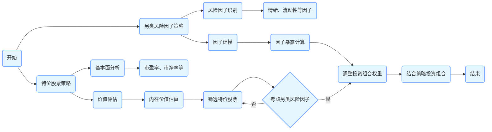

# 如何将特价股票策略与另类风险因子策略相结合

> 关键词：特价股票策略、另类风险因子策略、策略结合、量化投资、风险收益

> 摘要：本文旨在深入探讨如何将特价股票策略与另类风险因子策略相结合。通过详细分析两种策略的核心概念、算法原理、数学模型等，阐述了结合的具体方法和优势。同时，提供了项目实战案例，展示了结合策略在实际应用中的实现过程。此外，介绍了相关的工具和资源，最后对未来发展趋势与挑战进行了总结，为投资者和量化研究人员在量化投资领域提供有价值的参考。

## 1. 背景介绍 
### 1.1 目的和范围
在金融投资领域，投资者一直致力于寻找能够获取超额收益且有效控制风险的投资策略。特价股票策略侧重于挖掘被市场低估的股票，而另类风险因子策略则关注传统市场因子之外的其他风险因素对资产收益的影响。本文章的目的在于研究如何将这两种策略有机结合，以实现更优的风险 - 收益特征。范围涵盖了两种策略的基本原理、结合的方法、实际应用案例以及相关工具和资源的介绍。

### 1.2 预期读者
本文预期读者主要包括量化投资领域的专业人士，如量化分析师、投资经理等，他们希望通过结合不同策略来优化投资组合。同时，也适合对量化投资感兴趣的学者和研究人员，帮助他们深入了解这两种策略及其结合方式。此外，有一定金融知识基础的个人投资者也可以从本文中获取关于投资策略的新思路。

### 1.3 文档结构概述
本文首先介绍两种策略的核心概念与联系，包括其原理和架构的文本示意图以及 Mermaid 流程图。接着详细阐述核心算法原理和具体操作步骤，并给出相应的 Python 源代码。然后讲解数学模型和公式，并举例说明。之后通过项目实战展示代码的实际案例和详细解释。再介绍实际应用场景，推荐相关的工具和资源。最后总结未来发展趋势与挑战，提供常见问题与解答以及扩展阅读和参考资料。

### 1.4 术语表
#### 1.4.1 核心术语定义
- **特价股票策略**：一种基于价值投资理念的策略，通过分析股票的基本面指标，如市盈率、市净率等，寻找被市场低估的股票进行投资，期望在股票价格回归其内在价值时获得收益。
- **另类风险因子策略**：考虑传统市场因子（如市场风险、规模因子、价值因子等）之外的其他风险因素对资产收益影响的投资策略。这些另类风险因子可能包括情绪因子、流动性因子、质量因子等。
- **风险因子**：影响资产收益的各种因素，可分为系统性风险因子和非系统性风险因子。在量化投资中，通过对风险因子的分析和建模，可以更好地理解资产收益的来源和波动情况。
- **投资组合**：由多种资产组成的集合，投资者通过合理配置不同资产的比例，以实现特定的投资目标，如最大化收益、最小化风险等。

#### 1.4.2 相关概念解释
- **价值回归**：特价股票策略的核心假设，即市场有时会对股票的价值做出错误的定价，导致股票价格低于其内在价值。随着时间的推移，市场会逐渐认识到股票的真实价值，股票价格会向其内在价值回归。
- **因子暴露**：指资产对某个风险因子的敏感程度。例如，某只股票对价值因子的暴露程度较高，意味着该股票的收益受价值因子的影响较大。
- **多因子模型**：一种用于解释资产收益的模型，通过多个风险因子来描述资产收益的变化。在另类风险因子策略中，多因子模型可以帮助投资者更好地理解资产收益的来源和风险特征。

#### 1.4.3 缩略词列表
- **P/E**：市盈率（Price-to-Earnings Ratio），衡量股票价格相对于每股盈利的指标。
- **P/B**：市净率（Price-to-Book Ratio），衡量股票价格相对于每股净资产的指标。
- **CAPM**：资本资产定价模型（Capital Asset Pricing Model），一种描述资产预期收益率与市场风险之间关系的模型。
- **Fama - French 三因子模型**：由 Eugene F. Fama 和 Kenneth R. French 提出的多因子模型，包含市场风险因子、规模因子和价值因子。

## 2. 核心概念与联系 

### 特价股票策略核心原理
特价股票策略基于价值投资的基本思想，其核心在于识别那些市场价格低于其内在价值的股票。内在价值是指股票所代表的公司的真实价值，通常通过对公司的财务报表、行业前景、竞争优势等基本面因素进行分析来估算。常用的基本面指标包括市盈率（P/E）、市净率（P/B）、股息率等。例如，低市盈率的股票可能被认为是被市场低估的，因为它意味着投资者可以以较低的价格购买到公司的每股盈利。

### 另类风险因子策略核心原理
另类风险因子策略则关注传统市场因子之外的其他风险因素对资产收益的影响。传统的市场因子如市场风险、规模因子、价值因子等已经被广泛研究和应用。而另类风险因子可能包括情绪因子、流动性因子、质量因子等。这些因子反映了市场中一些特殊的风险特征，通过对这些因子的分析和建模，可以挖掘出额外的收益来源。例如，情绪因子可以衡量市场参与者的情绪状态，当市场情绪过度悲观时，可能会导致一些股票被过度抛售，从而产生投资机会。

### 两种策略的联系
特价股票策略和另类风险因子策略并非相互独立，而是存在一定的联系。一方面，另类风险因子可能会影响股票的定价，从而影响特价股票的筛选。例如，流动性因子可能导致一些股票的价格出现不合理的波动，使得原本被认为是特价股票的投资价值发生变化。另一方面，特价股票的选择也可能受到另类风险因子暴露的影响。某些被低估的股票可能同时具有较高的情绪因子暴露，这意味着它们的价格可能更容易受到市场情绪的影响，从而增加投资的风险。

### 核心概念架构的文本示意图
```plaintext
特价股票策略
|-- 基本面分析
|   |-- 市盈率
|   |-- 市净率
|   |-- 股息率
|-- 价值评估
|   |-- 内在价值估算
|   |-- 价格与价值比较

另类风险因子策略
|-- 风险因子识别
|   |-- 情绪因子
|   |-- 流动性因子
|   |-- 质量因子
|-- 因子建模
|   |-- 因子暴露计算
|   |-- 因子收益预测

策略结合
|-- 特价股票筛选考虑另类风险因子
|-- 另类风险因子调整投资组合权重
```

### Mermaid 流程图


## 3. 核心算法原理 & 具体操作步骤 

### 特价股票筛选算法原理
特价股票筛选的核心思想是通过比较股票的市场价格和其内在价值，选择那些价格低于内在价值的股票。以下是一个简单的基于市盈率和市净率的特价股票筛选算法的 Python 实现：

```python
import pandas as pd

def select_bargain_stocks(data, pe_threshold, pb_threshold):
    """
    筛选特价股票
    :param data: 包含股票数据的 DataFrame，至少包含 'PE'（市盈率）和 'PB'（市净率）列
    :param pe_threshold: 市盈率阈值
    :param pb_threshold: 市净率阈值
    :return: 筛选后的特价股票 DataFrame
    """
    bargain_stocks = data[(data['PE'] < pe_threshold) & (data['PB'] < pb_threshold)]
    return bargain_stocks

# 示例数据
data = pd.DataFrame({
    'Stock': ['A', 'B', 'C', 'D'],
    'PE': [10, 20, 5, 15],
    'PB': [1.2, 1.5, 0.8, 1.3]
})

pe_threshold = 12
pb_threshold = 1.0

bargain_stocks = select_bargain_stocks(data, pe_threshold, pb_threshold)
print(bargain_stocks)
```

### 算法步骤解释
1. **数据准备**：首先需要获取包含股票市盈率和市净率等基本面数据的 DataFrame。
2. **设定阈值**：根据市场情况和投资偏好，设定市盈率和市净率的阈值。
3. **筛选股票**：使用布尔索引筛选出市盈率和市净率都低于阈值的股票。
4. **返回结果**：返回筛选后的特价股票 DataFrame。

### 另类风险因子暴露计算算法原理
另类风险因子暴露计算的目的是衡量股票对各个风险因子的敏感程度。常用的方法是使用多因子模型进行回归分析。以下是一个简单的基于单因子模型的因子暴露计算的 Python 实现：

```python
import numpy as np
import statsmodels.api as sm

def calculate_factor_exposure(stock_returns, factor_returns):
    """
    计算股票对因子的暴露程度
    :param stock_returns: 股票收益率序列
    :param factor_returns: 因子收益率序列
    :return: 因子暴露系数
    """
    X = sm.add_constant(factor_returns)
    model = sm.OLS(stock_returns, X).fit()
    factor_exposure = model.params[1]
    return factor_exposure

# 示例数据
stock_returns = np.array([0.01, 0.02, -0.01, 0.03])
factor_returns = np.array([0.02, 0.03, -0.01, 0.04])

factor_exposure = calculate_factor_exposure(stock_returns, factor_returns)
print(f"因子暴露系数: {factor_exposure}")
```

### 算法步骤解释
1. **数据准备**：获取股票收益率序列和因子收益率序列。
2. **添加常数项**：在因子收益率序列中添加常数项，用于回归分析。
3. **进行回归分析**：使用普通最小二乘法（OLS）对股票收益率和因子收益率进行回归分析。
4. **提取因子暴露系数**：从回归模型的参数中提取因子暴露系数。

### 策略结合算法原理
策略结合的核心思想是在特价股票筛选的基础上，考虑股票对另类风险因子的暴露程度，调整投资组合的权重。以下是一个简单的策略结合算法的 Python 实现：

```python
def combine_strategies(bargain_stocks, factor_exposures, risk_threshold):
    """
    结合特价股票策略和另类风险因子策略
    :param bargain_stocks: 特价股票 DataFrame
    :param factor_exposures: 股票对因子的暴露程度字典，键为股票代码，值为因子暴露系数
    :param risk_threshold: 风险阈值
    :return: 调整后的投资组合 DataFrame
    """
    adjusted_portfolio = []
    for index, row in bargain_stocks.iterrows():
        stock = row['Stock']
        exposure = factor_exposures.get(stock, 0)
        if abs(exposure) < risk_threshold:
            adjusted_portfolio.append(row)
    adjusted_portfolio = pd.DataFrame(adjusted_portfolio)
    return adjusted_portfolio

# 示例数据
factor_exposures = {'A': 0.2, 'B': -0.3, 'C': 0.1, 'D': 0.4}
risk_threshold = 0.3

adjusted_portfolio = combine_strategies(bargain_stocks, factor_exposures, risk_threshold)
print(adjusted_portfolio)
```

### 算法步骤解释
1. **数据准备**：获取特价股票 DataFrame 和股票对因子的暴露程度字典。
2. **设定风险阈值**：根据投资风险偏好，设定因子暴露的风险阈值。
3. **筛选股票**：遍历特价股票，检查其因子暴露程度是否在风险阈值范围内。如果是，则将该股票加入调整后的投资组合。
4. **返回结果**：返回调整后的投资组合 DataFrame。

## 4. 数学模型和公式 & 详细讲解 & 举例说明 

### 特价股票内在价值估算模型
一种常用的估算股票内在价值的方法是股息贴现模型（Dividend Discount Model，DDM）。该模型假设股票的内在价值等于其未来股息的现值之和。

#### 公式
对于固定增长的股息贴现模型，公式为：

$$V = \frac{D_1}{r - g}$$

其中：
- $V$ 表示股票的内在价值
- $D_1$ 表示下一期的股息
- $r$ 表示投资者要求的必要收益率
- $g$ 表示股息的固定增长率

#### 详细讲解
该公式的推导基于现金流贴现的原理，即将未来的股息按照投资者要求的必要收益率进行贴现，得到股票的内在价值。假设股息以固定增长率 $g$ 增长，那么未来各期的股息可以表示为 $D_1, D_2 = D_1(1 + g), D_3 = D_1(1 + g)^2, \cdots$。将这些股息贴现到当前时刻，得到：

$$V = \frac{D_1}{1 + r} + \frac{D_1(1 + g)}{(1 + r)^2} + \frac{D_1(1 + g)^2}{(1 + r)^3} + \cdots$$

当 $r > g$ 时，上式是一个无穷等比数列求和，根据等比数列求和公式可得：

$$V = \frac{D_1}{r - g}$$

#### 举例说明
假设某股票下一期的股息 $D_1 = 1$ 元，投资者要求的必要收益率 $r = 0.1$，股息的固定增长率 $g = 0.05$，则该股票的内在价值为：

$$V = \frac{1}{0.1 - 0.05} = 20$$（元）

如果该股票的市场价格低于 20 元，则可以认为该股票是被低估的特价股票。

### 多因子模型
多因子模型是一种用于解释资产收益的模型，通过多个风险因子来描述资产收益的变化。常用的多因子模型是 Fama - French 三因子模型，后来又发展出了包含更多因子的模型。

#### 公式
Fama - French 三因子模型的公式为：

$$R_i - R_f = \alpha_i + \beta_{i,M}(R_M - R_f) + \beta_{i,SMB}SMB + \beta_{i,HML}HML + \epsilon_i$$

其中：
- $R_i$ 表示资产 $i$ 的收益率
- $R_f$ 表示无风险收益率
- $\alpha_i$ 表示资产 $i$ 的超额收益率
- $\beta_{i,M}$ 表示资产 $i$ 对市场风险因子的暴露程度
- $R_M$ 表示市场组合的收益率
- $\beta_{i,SMB}$ 表示资产 $i$ 对规模因子的暴露程度
- $SMB$ 表示小市值股票组合与大市值股票组合的收益率之差
- $\beta_{i,HML}$ 表示资产 $i$ 对价值因子的暴露程度
- $HML$ 表示高市净率股票组合与低市净率股票组合的收益率之差
- $\epsilon_i$ 表示残差项

#### 详细讲解
该模型认为资产的收益率可以分解为市场风险、规模效应和价值效应三个部分。市场风险因子反映了市场整体的波动对资产收益率的影响；规模因子反映了小市值股票和大市值股票收益率的差异；价值因子反映了高市净率股票和低市净率股票收益率的差异。通过回归分析可以估计出资产对各个因子的暴露程度和超额收益率。

#### 举例说明
假设某股票的收益率 $R_i = 0.1$，无风险收益率 $R_f = 0.02$，市场组合的收益率 $R_M = 0.08$，$SMB = 0.03$，$HML = 0.04$。通过回归分析得到该股票对市场风险因子的暴露程度 $\beta_{i,M} = 1.2$，对规模因子的暴露程度 $\beta_{i,SMB} = 0.5$，对价值因子的暴露程度 $\beta_{i,HML} = 0.3$，超额收益率 $\alpha_i = 0.01$。则根据 Fama - French 三因子模型，该股票的收益率可以表示为：

$$0.1 - 0.02 = 0.01 + 1.2\times(0.08 - 0.02) + 0.5\times0.03 + 0.3\times0.04 + \epsilon_i$$

$$0.08 = 0.01 + 0.072 + 0.015 + 0.012 + \epsilon_i$$

$$\epsilon_i = 0.08 - (0.01 + 0.072 + 0.015 + 0.012) = -0.029$$

这意味着该股票的实际收益率与模型预测的收益率之间存在 -0.029 的差异，可能是由于其他未考虑的因素或随机误差导致的。

### 风险调整后的投资组合权重计算模型
在结合特价股票策略和另类风险因子策略时，需要根据股票对另类风险因子的暴露程度调整投资组合的权重。一种简单的方法是使用风险调整后的权重公式。

#### 公式
假设投资组合中有 $n$ 只股票，第 $i$ 只股票的初始权重为 $w_i^0$，对另类风险因子的暴露程度为 $\beta_i$，风险调整因子为 $\lambda$，则调整后的权重为：

$$w_i = \frac{w_i^0}{1 + \lambda|\beta_i|}$$

其中：
- $w_i$ 表示调整后的权重
- $w_i^0$ 表示初始权重
- $\lambda$ 表示风险调整因子，用于控制风险调整的程度

#### 详细讲解
该公式的基本思想是，对于对另类风险因子暴露程度较高的股票，降低其在投资组合中的权重，以减少投资组合的整体风险。风险调整因子 $\lambda$ 越大，对高风险暴露股票的权重调整幅度越大。

#### 举例说明
假设投资组合中有三只股票 A、B、C，初始权重分别为 $w_A^0 = 0.3$，$w_B^0 = 0.4$，$w_C^0 = 0.3$，对另类风险因子的暴露程度分别为 $\beta_A = 0.2$，$\beta_B = -0.3$，$\beta_C = 0.1$，风险调整因子 $\lambda = 1$。则调整后的权重为：

$$w_A = \frac{0.3}{1 + 1\times|0.2|} = \frac{0.3}{1.2} = 0.25$$

$$w_B = \frac{0.4}{1 + 1\times|-0.3|} = \frac{0.4}{1.3} \approx 0.308$$

$$w_C = \frac{0.3}{1 + 1\times|0.1|} = \frac{0.3}{1.1} \approx 0.273$$

调整后的投资组合权重之和仍然为 1，通过调整权重，降低了对高风险暴露股票的投资比例，提高了投资组合的风险 - 收益特征。

## 5. 项目实战：代码实际案例和详细解释说明 

### 5.1  开发环境搭建
为了实现特价股票策略与另类风险因子策略的结合，我们需要搭建一个合适的开发环境。以下是具体的步骤：

#### 安装 Python
首先，确保你已经安装了 Python。建议使用 Python 3.7 及以上版本。你可以从 Python 官方网站（https://www.python.org/downloads/）下载并安装 Python。

#### 安装必要的库
我们需要安装一些 Python 库来完成项目，包括 Pandas、NumPy、StatsModels 等。可以使用以下命令来安装这些库：

```sh
pip install pandas numpy statsmodels
```

#### 数据准备
我们需要获取股票的基本面数据和收益率数据，以及另类风险因子的数据。可以使用金融数据接口（如 Tushare、BaoStock 等）来获取这些数据。以下是一个使用 Tushare 获取股票基本面数据的示例代码：

```python
import tushare as ts

# 设置 Tushare token
ts.set_token('your_token')
pro = ts.pro_api()

# 获取股票基本面数据
data = pro.daily_basic(ts_code='', trade_date='20231231', fields='ts_code,pe_ttm,pb')
print(data)
```

### 5.2  源代码详细实现和代码解读
以下是一个完整的项目实战代码示例，实现了特价股票策略与另类风险因子策略的结合：

```python
import pandas as pd
import numpy as np
import statsmodels.api as sm

# 特价股票筛选函数
def select_bargain_stocks(data, pe_threshold, pb_threshold):
    """
    筛选特价股票
    :param data: 包含股票数据的 DataFrame，至少包含 'PE'（市盈率）和 'PB'（市净率）列
    :param pe_threshold: 市盈率阈值
    :param pb_threshold: 市净率阈值
    :return: 筛选后的特价股票 DataFrame
    """
    bargain_stocks = data[(data['PE'] < pe_threshold) & (data['PB'] < pb_threshold)]
    return bargain_stocks

# 因子暴露计算函数
def calculate_factor_exposure(stock_returns, factor_returns):
    """
    计算股票对因子的暴露程度
    :param stock_returns: 股票收益率序列
    :param factor_returns: 因子收益率序列
    :return: 因子暴露系数
    """
    X = sm.add_constant(factor_returns)
    model = sm.OLS(stock_returns, X).fit()
    factor_exposure = model.params[1]
    return factor_exposure

# 策略结合函数
def combine_strategies(bargain_stocks, factor_exposures, risk_threshold):
    """
    结合特价股票策略和另类风险因子策略
    :param bargain_stocks: 特价股票 DataFrame
    :param factor_exposures: 股票对因子的暴露程度字典，键为股票代码，值为因子暴露系数
    :param risk_threshold: 风险阈值
    :return: 调整后的投资组合 DataFrame
    """
    adjusted_portfolio = []
    for index, row in bargain_stocks.iterrows():
        stock = row['Stock']
        exposure = factor_exposures.get(stock, 0)
        if abs(exposure) < risk_threshold:
            adjusted_portfolio.append(row)
    adjusted_portfolio = pd.DataFrame(adjusted_portfolio)
    return adjusted_portfolio

# 示例数据
data = pd.DataFrame({
    'Stock': ['A', 'B', 'C', 'D'],
    'PE': [10, 20, 5, 15],
    'PB': [1.2, 1.5, 0.8, 1.3]
})

pe_threshold = 12
pb_threshold = 1.0

# 筛选特价股票
bargain_stocks = select_bargain_stocks(data, pe_threshold, pb_threshold)
print("特价股票:")
print(bargain_stocks)

# 模拟因子收益率和股票收益率数据
stock_returns = {
    'A': np.array([0.01, 0.02, -0.01, 0.03]),
    'B': np.array([0.02, 0.03, -0.02, 0.04]),
    'C': np.array([0.03, 0.04, -0.03, 0.05]),
    'D': np.array([0.04, 0.05, -0.04, 0.06])
}

factor_returns = np.array([0.02, 0.03, -0.01, 0.04])

# 计算因子暴露
factor_exposures = {}
for stock, returns in stock_returns.items():
    exposure = calculate_factor_exposure(returns, factor_returns)
    factor_exposures[stock] = exposure

print("因子暴露:")
print(factor_exposures)

risk_threshold = 0.3

# 结合策略
adjusted_portfolio = combine_strategies(bargain_stocks, factor_exposures, risk_threshold)
print("调整后的投资组合:")
print(adjusted_portfolio)
```

### 代码解读
1. **特价股票筛选函数**：`select_bargain_stocks` 函数根据市盈率和市净率阈值筛选出特价股票。
2. **因子暴露计算函数**：`calculate_factor_exposure` 函数使用普通最小二乘法（OLS）计算股票对因子的暴露程度。
3. **策略结合函数**：`combine_strategies` 函数在特价股票筛选的基础上，考虑股票对因子的暴露程度，筛选出因子暴露在风险阈值范围内的股票，组成调整后的投资组合。
4. **示例数据**：定义了股票的基本面数据、因子收益率和股票收益率数据，用于演示整个策略的实现过程。
5. **主程序**：依次调用特价股票筛选函数、因子暴露计算函数和策略结合函数，输出特价股票、因子暴露和调整后的投资组合。

### 5.3  代码解读与分析
通过上述代码，我们实现了特价股票策略与另类风险因子策略的结合。首先，通过基本面分析筛选出特价股票，然后计算这些股票对另类风险因子的暴露程度，最后根据风险阈值调整投资组合的构成。这种结合策略可以在追求价值投资的同时，控制投资组合对另类风险因子的暴露，从而提高投资组合的风险 - 收益特征。

在实际应用中，我们可以根据具体情况调整市盈率和市净率阈值、风险阈值等参数，以适应不同的市场环境和投资目标。同时，我们可以使用更复杂的多因子模型和更准确的风险因子数据，进一步优化策略的效果。

## 6. 实际应用场景 
### 专业投资机构
专业投资机构如对冲基金、资产管理公司等可以将特价股票策略与另类风险因子策略相结合，构建更具竞争力的投资组合。通过挖掘被低估的股票并考虑另类风险因子的影响，投资机构可以在控制风险的前提下获取超额收益。例如，某对冲基金可以使用该结合策略对股票市场进行全面分析，筛选出具有投资价值的股票，并根据风险因子暴露情况调整投资组合的权重，以实现更好的业绩表现。

### 个人投资者
个人投资者也可以借鉴这种结合策略进行股票投资。个人投资者可以通过分析股票的基本面数据筛选出特价股票，同时关注一些常见的另类风险因子，如市场情绪、行业流动性等。例如，当市场情绪过度悲观时，一些优质股票可能会被低估，个人投资者可以在考虑风险因子暴露的情况下，选择合适的股票进行投资，以提高投资收益。

### 量化投资研究
量化投资研究人员可以将该结合策略作为研究对象，进一步深入分析和优化。研究人员可以使用历史数据对策略进行回测，评估策略的有效性和稳定性。同时，研究人员可以探索更多的另类风险因子，改进因子建模方法，以提高策略的性能。例如，研究人员可以研究宏观经济因子、公司治理因子等对股票收益的影响，并将这些因子纳入策略中，以实现更好的投资效果。

## 7. 工具和资源推荐
### 7.1 学习资源推荐
#### 7.1.1 书籍推荐
- 《聪明的投资者》（The Intelligent Investor）：作者本杰明·格雷厄姆（Benjamin Graham），被誉为价值投资的圣经，详细介绍了价值投资的基本理念和方法，对于理解特价股票策略有很大帮助。
- 《量化投资：策略与技术》：作者丁鹏，系统介绍了量化投资的理论和实践，包括多因子模型、风险因子分析等内容，对于学习另类风险因子策略和策略结合有很好的参考价值。
- 《金融市场与金融机构》（Financial Markets and Institutions）：作者弗雷德里克·S·米什金（Frederic S. Mishkin），全面介绍了金融市场和金融机构的基本原理和运作机制，对于理解金融市场的风险和收益特征有很大帮助。

#### 7.1.2 在线课程
- Coursera 上的“Quantitative Investing”课程：由哥伦比亚大学教授讲授，介绍了量化投资的基本概念、方法和工具，包括多因子模型、风险评估等内容。
- edX 上的“Machine Learning for Trading”课程：由佐治亚理工学院教授讲授，结合机器学习技术介绍了量化交易策略的设计和实现，对于学习量化投资有很大帮助。

#### 7.1.3 技术博客和网站
- 优矿（https://uqer.datayes.com/）：提供量化投资的研究平台和数据服务，有丰富的量化策略案例和研究报告。
- 聚宽（https://www.joinquant.com/）：专注于量化交易的在线平台，提供策略回测、模拟交易等功能，同时有很多量化投资的技术文章和交流社区。

### 7.2 开发工具框架推荐
#### 7.2.1 IDE和编辑器
- PyCharm：一款专业的 Python 集成开发环境，提供代码编辑、调试、版本控制等功能，适合开发复杂的量化投资策略。
- Jupyter Notebook：一种交互式的开发环境，支持 Python、R 等多种编程语言，适合进行数据探索和策略原型开发。

#### 7.2.2 调试和性能分析工具
- PDB：Python 自带的调试工具，可以帮助开发者定位代码中的错误和问题。
- cProfile：Python 自带的性能分析工具，可以分析代码的运行时间和函数调用情况，帮助开发者优化代码性能。

#### 7.2.3 相关框架和库
- Pandas：用于数据处理和分析的 Python 库，提供了丰富的数据结构和数据操作方法，非常适合处理金融数据。
- NumPy：用于科学计算的 Python 库，提供了高效的数组操作和数学函数，是量化投资中常用的库之一。
- StatsModels：用于统计建模和计量经济学分析的 Python 库，提供了多种统计模型和方法，适合进行因子分析和回归分析。

### 7.3 相关论文著作推荐
#### 7.3.1 经典论文
- “The Cross - Section of Expected Stock Returns” by Eugene F. Fama and Kenneth R. French：提出了 Fama - French 三因子模型，是多因子模型领域的经典论文。
- “Common Risk Factors in the Returns on Stocks and Bonds” by Eugene F. Fama and Kenneth R. French：进一步扩展了 Fama - French 三因子模型，考虑了债券市场的风险因子。

#### 7.3.2 最新研究成果
- 关注《Journal of Financial Economics》、《Review of Financial Studies》等金融领域的顶级学术期刊，这些期刊会发表关于量化投资、风险因子分析等方面的最新研究成果。

#### 7.3.3 应用案例分析
- 可以参考一些知名投资机构的研究报告和案例分析，了解他们在实际应用中如何将特价股票策略与另类风险因子策略相结合，以及取得的效果和经验教训。

## 8. 总结：未来发展趋势与挑战
### 未来发展趋势
- **因子多元化**：随着金融市场的不断发展和研究的深入，未来可能会发现更多的另类风险因子。这些因子可能涉及宏观经济、社会文化、技术创新等多个领域，为投资策略提供更多的收益来源和风险控制手段。
- **机器学习和人工智能的应用**：机器学习和人工智能技术在量化投资领域的应用将越来越广泛。通过使用深度学习、强化学习等技术，可以更准确地识别风险因子、预测股票收益和优化投资组合。例如，使用神经网络模型对海量的金融数据进行分析，挖掘潜在的投资机会。
- **跨市场和跨资产类别的应用**：未来的投资策略可能会更加注重跨市场和跨资产类别的应用。除了股票市场，还可以将特价股票策略与另类风险因子策略应用于债券市场、期货市场、外汇市场等，实现更广泛的资产配置和风险分散。

### 挑战
- **数据质量和可得性**：另类风险因子的研究需要大量的高质量数据支持。然而，一些另类风险因子的数据可能难以获取，或者数据质量存在问题。例如，市场情绪数据的收集和处理就面临着很大的挑战，如何准确地衡量市场情绪是一个有待解决的问题。
- **因子的稳定性和有效性**：随着市场环境的变化，一些风险因子的有效性可能会发生变化。例如，某些因子在过去表现良好，但在未来可能不再有效。因此，需要不断地对因子进行评估和更新，以确保策略的稳定性和有效性。
- **模型的复杂性和可解释性**：使用机器学习和人工智能技术构建的模型往往比较复杂，难以解释其决策过程。在投资领域，模型的可解释性非常重要，投资者需要了解模型是如何做出决策的。因此，如何在提高模型性能的同时，保持模型的可解释性是一个需要解决的挑战。

## 9. 附录：常见问题与解答
### 问题 1：如何确定市盈率和市净率的阈值？
答：市盈率和市净率的阈值可以根据市场情况、行业特点和投资偏好来确定。一般来说，可以参考历史数据和行业平均水平。例如，如果某行业的平均市盈率为 20，那么可以将阈值设定为略低于 20 的数值。同时，也可以结合其他基本面指标和风险因子进行综合判断。

### 问题 2：另类风险因子的选择有哪些原则？
答：另类风险因子的选择需要遵循以下原则：一是因子具有经济意义，能够解释资产收益的变化；二是因子具有一定的稳定性和持续性，在不同的市场环境下都能发挥作用；三是因子与传统风险因子具有一定的独立性，能够提供额外的信息和收益来源。

### 问题 3：如何评估策略的有效性？
答：可以使用历史数据对策略进行回测，评估策略的收益率、夏普比率、最大回撤等指标。同时，还可以进行样本外测试，验证策略在不同市场环境下的稳定性和有效性。此外，还可以与市场基准进行比较，评估策略是否能够跑赢市场。

### 问题 4：策略结合是否一定会提高投资收益？
答：策略结合并不一定会提高投资收益。虽然特价股票策略和另类风险因子策略各有优势，但在实际应用中，策略的效果受到多种因素的影响，如市场环境、因子的有效性、参数的选择等。因此，需要不断地对策略进行优化和调整，以提高投资收益。

## 10. 扩展阅读 & 参考资料
- 《主动投资组合管理：创造高收益并控制风险的量化投资方法》（Active Portfolio Management: A Quantitative Approach for Producing Superior Returns and Controlling Risk），作者 Richard C. Grinold 和 Ronald N. Kahn。
- 《金融时间序列分析》（Analysis of Financial Time Series），作者 Ruey S. Tsay。
- Tushare 官方文档（https://tushare.pro/document/1）
- Pandas 官方文档（https://pandas.pydata.org/docs/）
- NumPy 官方文档（https://numpy.org/doc/）
- StatsModels 官方文档（https://www.statsmodels.org/stable/index.html）

作者：AI天才研究院/AI Genius Institute & 禅与计算机程序设计艺术 /Zen And The Art of Computer Programming