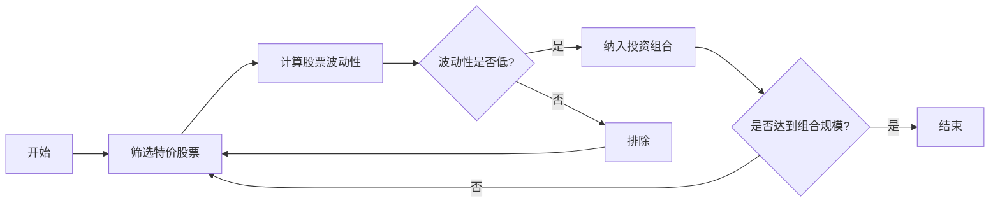

# 如何将特价股票策略与数字低波动性因子投资相结合

> 关键词：特价股票策略、数字低波动性因子投资、投资组合、量化分析、风险管理

> 摘要：本文旨在探讨如何将特价股票策略与数字低波动性因子投资进行有效结合。首先介绍了相关背景知识，包括目的、预期读者等内容。接着阐述了核心概念及其联系，详细讲解了核心算法原理与操作步骤，并运用数学模型和公式进行说明。通过项目实战案例展示了具体代码实现与分析。随后探讨了实际应用场景，推荐了相关工具和资源。最后总结了未来发展趋势与挑战，解答了常见问题，并提供了扩展阅读和参考资料，为投资者提供全面且深入的投资策略指导。

## 1. 背景介绍 
### 1.1 目的和范围
本文章的主要目的是为投资者提供一种创新的投资思路，即把特价股票策略和数字低波动性因子投资结合起来，以构建更具稳定性和收益潜力的投资组合。特价股票策略通常聚焦于那些被市场低估的股票，期望通过股票价格回归其内在价值来获取收益；而数字低波动性因子投资则关注股票价格波动较小的资产，旨在降低投资组合的整体风险。通过研究两者的结合方式，帮助投资者在追求收益的同时，更好地控制风险。

本文的范围涵盖了从理论概念的讲解到实际应用的各个方面，包括核心概念的解释、算法原理的阐述、数学模型的推导、项目实战案例的分析，以及相关工具和资源的推荐等，为投资者提供一个全面且系统的投资策略指导。

### 1.2 预期读者
本文预期读者主要包括专业投资者、金融分析师、量化投资爱好者以及对股票投资有一定了解并希望探索新投资策略的个人投资者。专业投资者可以从中获取新的投资思路和方法，进一步优化其投资组合；金融分析师可以借助本文的内容进行市场研究和投资策略分析；量化投资爱好者可以学习到相关的算法和代码实现；而普通个人投资者则可以通过通俗易懂的讲解，了解如何将这两种投资策略结合起来，提升自己的投资水平。

### 1.3 文档结构概述
本文将按照以下结构进行组织：
1. 背景介绍：阐述文章的目的、预期读者和文档结构概述，并对相关术语进行解释。
2. 核心概念与联系：介绍特价股票策略和数字低波动性因子投资的核心概念，分析它们之间的联系，并通过文本示意图和 Mermaid 流程图进行展示。
3. 核心算法原理 & 具体操作步骤：详细讲解实现特价股票策略与数字低波动性因子投资结合的核心算法原理，并给出具体的操作步骤，同时使用 Python 源代码进行详细阐述。
4. 数学模型和公式 & 详细讲解 & 举例说明：运用数学模型和公式对投资策略进行分析和优化，并通过具体例子进行说明。
5. 项目实战：代码实际案例和详细解释说明：通过一个实际的项目案例，展示如何搭建开发环境、实现源代码，并对代码进行详细解读和分析。
6. 实际应用场景：探讨特价股票策略与数字低波动性因子投资结合在不同市场环境下的实际应用场景。
7. 工具和资源推荐：推荐相关的学习资源、开发工具框架和论文著作，帮助读者进一步深入学习和研究。
8. 总结：未来发展趋势与挑战：总结本文的主要内容，分析该投资策略的未来发展趋势和面临的挑战。
9. 附录：常见问题与解答：解答读者在学习和应用过程中可能遇到的常见问题。
10. 扩展阅读 & 参考资料：提供相关的扩展阅读材料和参考资料，方便读者进一步探索。

### 1.4 术语表
#### 1.4.1 核心术语定义
- **特价股票策略**：一种投资策略，通过分析股票的基本面和市场情况，寻找那些被市场低估的股票进行投资，期望在股票价格回归其内在价值时获得收益。
- **数字低波动性因子投资**：基于股票价格波动特征的投资策略，选择价格波动较小的股票构建投资组合，以降低投资组合的整体风险。
- **投资组合**：由多种不同的资产组成的集合，投资者通过合理配置资产，实现风险分散和收益最大化的目标。
- **量化分析**：运用数学和统计学方法，对金融数据进行分析和建模，以辅助投资决策。
- **风险管理**：识别、评估和控制投资过程中可能面临的风险，以保护投资者的资产安全。

#### 1.4.2 相关概念解释
- **股票估值**：对股票的内在价值进行评估的过程，常用的方法包括市盈率法、市净率法、现金流折现法等。
- **波动性**：衡量股票价格波动程度的指标，常用标准差、贝塔系数等表示。
- **因子投资**：基于某些特定的因子（如价值因子、成长因子、低波动性因子等）来选择股票构建投资组合的投资策略。

#### 1.4.3 缩略词列表
- **PE**：市盈率（Price-to-Earnings Ratio），反映股票价格与每股收益之间的关系。
- **PB**：市净率（Price-to-Book Ratio），反映股票价格与每股净资产之间的关系。
- **CAPM**：资本资产定价模型（Capital Asset Pricing Model），用于描述资产预期收益率与市场风险之间的关系。

## 2. 核心概念与联系 

### 2.1 特价股票策略核心概念
特价股票策略的核心在于寻找那些市场价格低于其内在价值的股票。内在价值是指股票所代表的企业的真实价值，它可以通过对企业的财务状况、盈利能力、行业前景等多方面进行分析来评估。常见的评估方法有市盈率法、市净率法和现金流折现法等。

市盈率（PE）是股票价格与每股收益的比值，较低的市盈率可能意味着股票被低估。市净率（PB）是股票价格与每股净资产的比值，同样，较低的市净率也可能表示股票具有投资价值。现金流折现法（DCF）则是通过预测企业未来的现金流，并将其折现到当前时刻，来计算股票的内在价值。

### 2.2 数字低波动性因子投资核心概念
数字低波动性因子投资关注的是股票价格的波动特征。波动性是衡量股票价格变动剧烈程度的指标，常用标准差来表示。低波动性因子投资认为，价格波动较小的股票在长期投资中往往能够提供较为稳定的收益，同时降低投资组合的整体风险。

低波动性股票通常具有以下特点：企业经营稳定、财务状况良好、具有较强的抗风险能力。这些股票在市场下跌时往往表现出较强的抗跌性，而在市场上涨时也能跟随市场获得一定的收益。

### 2.3 两者的联系
特价股票策略和数字低波动性因子投资之间存在一定的联系。一方面，被低估的特价股票往往是那些市场关注度较低、价格波动较小的股票，这些股票可能同时符合低波动性因子的特征。另一方面，低波动性的股票由于其价格相对稳定，更容易被投资者识别出其内在价值，从而有可能成为特价股票。

通过将两者结合起来，可以构建一个既具有价格优势又具有较低风险的投资组合。在选择股票时，既考虑股票的估值情况，又考虑其价格波动特征，从而提高投资组合的稳定性和收益潜力。

### 2.4 文本示意图
```plaintext
特价股票策略 <----> 数字低波动性因子投资
|                    |
| 寻找被低估股票     | 选择低波动股票
|                    |
| 基于基本面分析     | 基于波动性指标
|                    |
| 期望价格回归价值   | 降低投资组合风险
|                    |
v                    v
构建投资组合
```

### 2.5 Mermaid 流程图


## 3. 核心算法原理 & 具体操作步骤 

### 3.1 核心算法原理
将特价股票策略与数字低波动性因子投资相结合的核心算法主要包括以下几个步骤：
1. **特价股票筛选**：使用市盈率（PE）、市净率（PB）等指标筛选出被低估的股票。具体来说，设定一个合理的 PE 和 PB 阈值，将 PE 和 PB 低于阈值的股票视为特价股票。
2. **波动性计算**：计算筛选出的特价股票的历史价格波动性，常用的方法是计算股票价格的标准差。标准差越小，说明股票价格的波动越小。
3. **低波动性股票筛选**：根据计算得到的波动性指标，选择波动性低于一定阈值的股票，将其纳入投资组合。
4. **投资组合优化**：根据投资者的风险偏好和投资目标，对纳入投资组合的股票进行权重分配，以实现风险和收益的平衡。

### 3.2 具体操作步骤
#### 步骤 1：数据获取
使用 Python 的第三方库（如`pandas-datareader`）从金融数据提供商（如雅虎财经）获取股票的历史价格数据和财务数据。

```python
import pandas as pd
import pandas_datareader.data as web

# 定义股票代码列表
stock_codes = ['AAPL', 'GOOG', 'MSFT', 'AMZN']

# 获取股票的历史价格数据
start_date = '2020-01-01'
end_date = '2023-01-01'
prices = web.DataReader(stock_codes, 'yahoo', start_date, end_date)['Close']

# 获取股票的财务数据（示例，实际中可能需要更复杂的方法）
financial_data = pd.DataFrame({
    'PE': [20, 30, 15, 40],
    'PB': [3, 4, 2, 5]
}, index=stock_codes)
```

#### 步骤 2：特价股票筛选
根据设定的 PE 和 PB 阈值，筛选出被低估的股票。

```python
# 设定 PE 和 PB 阈值
pe_threshold = 25
pb_threshold = 3

# 筛选特价股票
bargain_stocks = financial_data[(financial_data['PE'] < pe_threshold) & (financial_data['PB'] < pb_threshold)].index.tolist()
print("特价股票列表:", bargain_stocks)
```

#### 步骤 3：波动性计算
计算特价股票的历史价格波动性。

```python
import numpy as np

# 计算特价股票的收益率
returns = prices[bargain_stocks].pct_change().dropna()

# 计算波动性（标准差）
volatilities = returns.std()
print("特价股票波动性:", volatilities)
```

#### 步骤 4：低波动性股票筛选
根据设定的波动性阈值，选择波动性低于阈值的股票。

```python
# 设定波动性阈值
volatility_threshold = 0.02

# 筛选低波动性股票
low_volatility_stocks = volatilities[volatilities < volatility_threshold].index.tolist()
print("低波动性特价股票列表:", low_volatility_stocks)
```

#### 步骤 5：投资组合优化
使用均值 - 方差模型对低波动性特价股票进行权重分配。

```python
from pypfopt.efficient_frontier import EfficientFrontier
from pypfopt import risk_models
from pypfopt import expected_returns

# 计算预期收益率和协方差矩阵
mu = expected_returns.mean_historical_return(prices[low_volatility_stocks])
S = risk_models.sample_cov(prices[low_volatility_stocks])

# 创建有效前沿对象
ef = EfficientFrontier(mu, S)

# 进行投资组合优化（最小化风险）
weights = ef.min_volatility()
cleaned_weights = ef.clean_weights()
print("投资组合权重:", cleaned_weights)
```

## 4. 数学模型和公式 & 详细讲解 & 举例说明 

### 4.1 市盈率（PE）和市净率（PB）
市盈率（PE）是股票价格与每股收益（EPS）的比值，公式为：
$$PE = \frac{P}{EPS}$$
其中，$P$ 是股票价格，$EPS$ 是每股收益。

市净率（PB）是股票价格与每股净资产（BVPS）的比值，公式为：
$$PB = \frac{P}{BVPS}$$
其中，$P$ 是股票价格，$BVPS$ 是每股净资产。

举例说明：假设某股票的价格为 $50$ 元，每股收益为 $2$ 元，每股净资产为 $10$ 元，则该股票的市盈率为 $PE = \frac{50}{2} = 25$，市净率为 $PB = \frac{50}{10} = 5$。

### 4.2 股票价格波动性（标准差）
股票价格的波动性通常用标准差来衡量。假设股票的历史收益率序列为 $r_1, r_2, \cdots, r_n$，则其标准差 $\sigma$ 的计算公式为：
$$\sigma = \sqrt{\frac{1}{n - 1} \sum_{i = 1}^{n} (r_i - \bar{r})^2}$$
其中，$\bar{r}$ 是收益率的均值，即 $\bar{r} = \frac{1}{n} \sum_{i = 1}^{n} r_i$。

举例说明：假设某股票的历史收益率序列为 $[0.01, 0.02, -0.01, 0.03]$，则其均值为 $\bar{r} = \frac{0.01 + 0.02 - 0.01 + 0.03}{4} = 0.0125$，标准差为：
$$\sigma = \sqrt{\frac{(0.01 - 0.0125)^2 + (0.02 - 0.0125)^2 + (-0.01 - 0.0125)^2 + (0.03 - 0.0125)^2}{4 - 1}} \approx 0.016$$

### 4.3 均值 - 方差模型
均值 - 方差模型是现代投资组合理论的核心模型，用于在给定预期收益率的情况下，最小化投资组合的风险；或者在给定风险水平的情况下，最大化投资组合的预期收益率。

假设投资组合由 $n$ 种资产组成，资产 $i$ 的预期收益率为 $\mu_i$，投资组合中资产 $i$ 的权重为 $w_i$，且 $\sum_{i = 1}^{n} w_i = 1$。投资组合的预期收益率 $\mu_p$ 和方差 $\sigma_p^2$ 的计算公式分别为：
$$\mu_p = \sum_{i = 1}^{n} w_i \mu_i$$
$$\sigma_p^2 = \sum_{i = 1}^{n} \sum_{j = 1}^{n} w_i w_j \sigma_{ij}$$
其中，$\sigma_{ij}$ 是资产 $i$ 和资产 $j$ 的协方差。

举例说明：假设投资组合由两种资产组成，资产 1 的预期收益率为 $\mu_1 = 0.1$，资产 2 的预期收益率为 $\mu_2 = 0.2$，资产 1 的权重为 $w_1 = 0.6$，资产 2 的权重为 $w_2 = 0.4$，资产 1 和资产 2 的协方差为 $\sigma_{12} = 0.01$，资产 1 的方差为 $\sigma_1^2 = 0.04$，资产 2 的方差为 $\sigma_2^2 = 0.09$。则投资组合的预期收益率为：
$$\mu_p = 0.6 \times 0.1 + 0.4 \times 0.2 = 0.14$$
投资组合的方差为：
$$\sigma_p^2 = 0.6^2 \times 0.04 + 0.4^2 \times 0.09 + 2 \times 0.6 \times 0.4 \times 0.01 = 0.0288$$

## 5. 项目实战：代码实际案例和详细解释说明 

### 5.1  开发环境搭建
#### 安装 Python
首先，确保你已经安装了 Python 环境。可以从 Python 官方网站（https://www.python.org/downloads/）下载并安装适合你操作系统的 Python 版本。建议安装 Python 3.7 及以上版本。

#### 安装必要的库
使用`pip`命令安装以下必要的库：
```sh
pip install pandas pandas-datareader pypfopt numpy matplotlib
```
- `pandas`：用于数据处理和分析。
- `pandas-datareader`：用于从金融数据提供商获取数据。
- `pypfopt`：用于投资组合优化。
- `numpy`：用于数值计算。
- `matplotlib`：用于数据可视化。

### 5.2  源代码详细实现和代码解读
```python
import pandas as pd
import pandas_datareader.data as web
import numpy as np
from pypfopt.efficient_frontier import EfficientFrontier
from pypfopt import risk_models
from pypfopt import expected_returns
import matplotlib.pyplot as plt

# 步骤 1：数据获取
# 定义股票代码列表
stock_codes = ['AAPL', 'GOOG', 'MSFT', 'AMZN', 'FB']

# 获取股票的历史价格数据
start_date = '2020-01-01'
end_date = '2023-01-01'
prices = web.DataReader(stock_codes, 'yahoo', start_date, end_date)['Close']

# 获取股票的财务数据（示例，实际中可能需要更复杂的方法）
financial_data = pd.DataFrame({
    'PE': [20, 30, 15, 40, 25],
    'PB': [3, 4, 2, 5, 3]
}, index=stock_codes)

# 步骤 2：特价股票筛选
# 设定 PE 和 PB 阈值
pe_threshold = 25
pb_threshold = 3

# 筛选特价股票
bargain_stocks = financial_data[(financial_data['PE'] < pe_threshold) & (financial_data['PB'] < pb_threshold)].index.tolist()
print("特价股票列表:", bargain_stocks)

# 步骤 3：波动性计算
# 计算特价股票的收益率
returns = prices[bargain_stocks].pct_change().dropna()

# 计算波动性（标准差）
volatilities = returns.std()
print("特价股票波动性:", volatilities)

# 步骤 4：低波动性股票筛选
# 设定波动性阈值
volatility_threshold = 0.02

# 筛选低波动性股票
low_volatility_stocks = volatilities[volatilities < volatility_threshold].index.tolist()
print("低波动性特价股票列表:", low_volatility_stocks)

# 步骤 5：投资组合优化
# 计算预期收益率和协方差矩阵
mu = expected_returns.mean_historical_return(prices[low_volatility_stocks])
S = risk_models.sample_cov(prices[low_volatility_stocks])

# 创建有效前沿对象
ef = EfficientFrontier(mu, S)

# 进行投资组合优化（最小化风险）
weights = ef.min_volatility()
cleaned_weights = ef.clean_weights()
print("投资组合权重:", cleaned_weights)

# 步骤 6：可视化投资组合权重
labels = list(cleaned_weights.keys())
sizes = list(cleaned_weights.values())

plt.pie(sizes, labels=labels, autopct='%1.1f%%')
plt.axis('equal')  
plt.title('投资组合权重分布')
plt.show()
```

### 5.3  代码解读与分析
#### 数据获取部分
使用`pandas-datareader`库从雅虎财经获取股票的历史价格数据和财务数据。`web.DataReader`函数用于获取历史价格数据，通过指定股票代码、数据源和日期范围来获取所需的数据。

#### 特价股票筛选部分
根据设定的 PE 和 PB 阈值，筛选出被低估的股票。使用`pandas`的布尔索引功能，将 PE 和 PB 低于阈值的股票筛选出来。

#### 波动性计算部分
计算特价股票的历史价格收益率，并使用`std()`方法计算收益率的标准差，作为股票的波动性指标。

#### 低波动性股票筛选部分
根据设定的波动性阈值，选择波动性低于阈值的股票，将其纳入低波动性特价股票列表。

#### 投资组合优化部分
使用`pypfopt`库的`EfficientFrontier`类进行投资组合优化。首先计算预期收益率和协方差矩阵，然后创建有效前沿对象，调用`min_volatility()`方法进行最小化风险的优化，得到投资组合的权重。

#### 可视化部分
使用`matplotlib`库的`pie()`函数将投资组合的权重以饼图的形式进行可视化展示，方便投资者直观地了解各股票在投资组合中的占比。

## 6. 实际应用场景 
### 6.1 市场波动较大时
在市场波动较大的情况下，投资者往往更注重投资组合的稳定性。将特价股票策略与数字低波动性因子投资相结合，可以筛选出那些既被低估又具有较低波动性的股票，构建一个相对稳定的投资组合。这些股票在市场下跌时能够较好地抵御风险，而在市场反弹时也能跟随市场获得一定的收益。

例如，在 2008 年金融危机期间，市场大幅下跌，许多股票价格被严重低估。此时，采用这种结合策略可以筛选出那些基本面良好、价格波动较小的特价股票，如一些大型蓝筹股。这些股票在危机过后往往能够较快地恢复，为投资者带来较好的回报。

### 6.2 长期投资场景
对于长期投资者来说，追求的是资产的稳健增值。特价股票策略可以帮助投资者发现那些具有长期投资价值的股票，而数字低波动性因子投资则可以降低投资组合的风险，提高投资的稳定性。通过将两者结合起来，投资者可以构建一个长期表现良好的投资组合。

例如，一些具有稳定现金流和良好盈利能力的消费类股票，往往具有较低的波动性和较高的内在价值。长期持有这些股票，并结合合理的资产配置，可以实现资产的稳健增长。

### 6.3 风险偏好较低的投资者
对于风险偏好较低的投资者来说，他们更愿意在保证资产安全的前提下获取一定的收益。特价股票策略与数字低波动性因子投资的结合，正好满足了这部分投资者的需求。通过筛选出低风险、高性价比的股票，构建投资组合，投资者可以在降低风险的同时，获得相对稳定的收益。

例如，一些退休人员或保守型投资者，他们的资产主要用于养老或保值。采用这种结合策略，可以选择一些公用事业、医药等行业的低波动性特价股票，构建一个风险较低的投资组合。

## 7. 工具和资源推荐
### 7.1 学习资源推荐
#### 7.1.1 书籍推荐
- 《聪明的投资者》（The Intelligent Investor）：本杰明·格雷厄姆（Benjamin Graham）著，被誉为投资界的圣经，详细介绍了价值投资的理念和方法，对于理解特价股票策略有很大帮助。
- 《漫步华尔街》（A Random Walk Down Wall Street）：伯顿·马尔基尔（Burton Malkiel）著，全面介绍了投资的各种理论和方法，包括因子投资和投资组合管理等内容。
- 《量化投资：策略与技术》：丁鹏著，系统介绍了量化投资的原理、方法和实践，对于学习量化分析和投资策略的实现有很大的参考价值。

#### 7.1.2 在线课程
- Coursera 上的“投资学原理”（Principles of Investment）课程：由宾夕法尼亚大学的教授授课，涵盖了投资组合理论、资产定价模型等投资学的核心内容。
- edX 上的“量化金融与风险管理”（Quantitative Finance and Risk Management）课程：介绍了量化金融的基本概念、方法和工具，以及如何运用这些知识进行风险管理。
- 网易云课堂上的“Python 量化投资实战”课程：通过实际案例，详细讲解了如何使用 Python 进行量化投资分析和策略实现。

#### 7.1.3 技术博客和网站
- 优矿（https://uqer.datayes.com/）：提供了丰富的金融数据和量化分析工具，同时还有许多量化投资的案例和教程。
- 聚宽（https://www.joinquant.com/）：专注于量化投资领域，提供了强大的回测平台和社区交流功能，方便投资者分享和学习量化投资策略。
- 雪球（https://xueqiu.com/）：国内知名的财经社区，有许多投资者分享自己的投资经验和见解，可以从中获取有关特价股票和因子投资的信息。

### 7.2 开发工具框架推荐
#### 7.2.1 IDE和编辑器
- PyCharm：一款功能强大的 Python 集成开发环境，提供了代码编辑、调试、版本控制等一系列功能，适合专业开发者使用。
- Jupyter Notebook：一种交互式的开发环境，支持 Python 代码的编写、运行和可视化展示，非常适合进行数据分析和量化投资研究。
- Visual Studio Code：一款轻量级的代码编辑器，支持多种编程语言和插件扩展，具有良好的用户体验和开发效率。

#### 7.2.2 调试和性能分析工具
- pdb：Python 内置的调试器，可以帮助开发者定位和解决代码中的问题。
- cProfile：Python 标准库中的性能分析工具，可以分析代码的运行时间和函数调用情况，帮助开发者优化代码性能。
- Py-Spy：一个轻量级的 Python 性能分析工具，可以实时监控 Python 程序的运行情况，找出性能瓶颈。

#### 7.2.3 相关框架和库
- pandas：用于数据处理和分析的 Python 库，提供了丰富的数据结构和函数，方便进行金融数据的清洗、整理和分析。
- numpy：用于数值计算的 Python 库，提供了高效的数组和矩阵运算功能，是量化投资中常用的工具。
- pypfopt：用于投资组合优化的 Python 库，提供了多种投资组合优化算法，如均值 - 方差模型、风险平价模型等。

### 7.3 相关论文著作推荐
#### 7.3.1 经典论文
- “The Capital Asset Pricing Model: Theory and Evidence”（资本资产定价模型：理论与证据）：由 Eugene F. Fama 和 Kenneth R. French 撰写，对资本资产定价模型进行了深入的研究和分析，是投资学领域的经典论文之一。
- “Common Risk Factors in the Returns on Stocks and Bonds”（股票和债券收益率中的常见风险因子）：同样由 Eugene F. Fama 和 Kenneth R. French 撰写，提出了著名的 Fama - French 三因子模型，为因子投资提供了重要的理论基础。

#### 7.3.2 最新研究成果
- 可以关注《Journal of Finance》（金融杂志）、《Review of Financial Studies》（金融研究评论）等顶级金融学术期刊，了解有关特价股票策略和因子投资的最新研究成果。
- 还可以关注各大高校和研究机构的金融研究中心发布的研究报告，获取前沿的学术动态。

#### 7.3.3 应用案例分析
- 可以参考一些量化投资机构发布的研究报告和案例分析，了解他们如何将特价股票策略与数字低波动性因子投资相结合，以及实际应用中的效果和经验。
- 一些财经媒体也会报道相关的投资案例，可以从中获取灵感和启示。

## 8. 总结：未来发展趋势与挑战
### 8.1 未来发展趋势
#### 量化投资的普及
随着计算机技术和金融数据的不断发展，量化投资将越来越普及。将特价股票策略与数字低波动性因子投资相结合的量化投资策略，也将得到更广泛的应用。投资者可以利用先进的算法和工具，更精准地筛选出符合条件的股票，构建更优化的投资组合。

#### 多因子模型的发展
未来，单一的特价股票策略和数字低波动性因子投资可能无法满足投资者的需求。多因子模型将成为发展的趋势，通过结合更多的因子（如成长因子、动量因子等），可以构建更加多元化和个性化的投资组合，提高投资组合的收益和风险控制能力。

#### 人工智能和机器学习的应用
人工智能和机器学习技术在金融领域的应用将越来越广泛。通过运用深度学习、强化学习等算法，可以对金融数据进行更深入的分析和挖掘，发现更多潜在的投资机会。同时，人工智能和机器学习还可以帮助投资者实时调整投资组合，适应市场的变化。

### 8.2 挑战
#### 数据质量和可靠性
量化投资依赖于大量的金融数据，数据的质量和可靠性直接影响到投资策略的效果。然而，金融数据往往存在噪声、缺失值和错误等问题，如何处理这些数据，提高数据的质量和可靠性，是一个挑战。

#### 模型的有效性和稳定性
量化投资模型是基于历史数据构建的，其有效性和稳定性在未来市场环境下可能会受到挑战。市场是不断变化的，新的事件和因素可能会导致模型失效。因此，如何不断优化和调整模型，提高模型的有效性和稳定性，是一个重要的问题。

#### 监管和合规问题
随着量化投资的发展，监管和合规问题也日益重要。量化投资策略可能会涉及到高频交易、算法交易等复杂的交易方式，这些交易方式可能会对市场产生影响。因此，如何遵守相关的法律法规，确保投资策略的合规性，是投资者需要面对的挑战。

## 9. 附录：常见问题与解答
### 问题 1：特价股票策略和数字低波动性因子投资的结合是否一定能获得更高的收益？
解答：不一定。虽然这种结合策略旨在寻找既被低估又具有较低波动性的股票，以提高投资组合的稳定性和收益潜力，但市场是复杂多变的，存在许多不确定性因素。即使筛选出了符合条件的股票，也不能保证它们在未来一定会上涨，或者获得比市场平均水平更高的收益。投资组合的收益还受到市场整体走势、行业发展趋势、公司基本面变化等多种因素的影响。

### 问题 2：如何确定 PE、PB 和波动性的阈值？
解答：PE、PB 和波动性的阈值没有固定的标准，需要根据市场情况、行业特点和投资者的风险偏好来确定。一般来说，可以参考历史数据和行业平均水平来设定初步的阈值。例如，对于一些成熟行业的股票，较低的 PE 和 PB 可能更具吸引力；而对于新兴行业的股票，由于其增长潜力较大，可能可以接受相对较高的 PE 和 PB。波动性阈值的设定则需要考虑投资者对风险的承受能力，风险偏好较低的投资者可以设定较低的波动性阈值。

### 问题 3：投资组合优化时，为什么选择最小化风险的方法？
解答：选择最小化风险的方法是为了在保证一定预期收益率的前提下，降低投资组合的整体风险。对于风险偏好较低的投资者来说，他们更注重资产的安全性，希望在投资过程中尽量减少损失。通过最小化风险的优化方法，可以找到一种资产配置方案，使得投资组合的风险最小化。当然，投资者也可以根据自己的需求和风险偏好，选择其他的优化方法，如最大化预期收益率、最大化夏普比率等。

### 问题 4：在实际应用中，如何处理缺失的财务数据？
解答：在实际应用中，可能会遇到某些股票的财务数据缺失的情况。处理缺失财务数据的方法有多种，常见的方法包括：
- **删除缺失数据的股票**：如果缺失数据的股票数量较少，可以直接将这些股票从分析范围内删除。
- **填充缺失值**：可以使用平均值、中位数、插值法等方法来填充缺失值。例如，可以使用同行业其他股票的平均 PE 和 PB 来填充缺失值。
- **使用替代数据**：如果某些财务数据无法获取，可以考虑使用其他相关的数据来替代。例如，可以使用市销率（PS）来替代市盈率（PE）进行分析。

### 问题 5：量化投资策略是否适合所有投资者？
解答：量化投资策略并不适合所有投资者。量化投资需要一定的计算机技术和金融知识，对于缺乏相关知识和技能的投资者来说，可能难以理解和实施量化投资策略。此外，量化投资策略通常需要大量的历史数据和复杂的算法模型，对投资者的资源和能力要求较高。因此，量化投资策略更适合那些有一定投资经验、具备一定技术能力和风险承受能力的投资者。

## 10. 扩展阅读 & 参考资料
### 扩展阅读
- 《金融炼金术》（The Alchemy of Finance）：乔治·索罗斯（George Soros）著，介绍了索罗斯的投资哲学和方法，对于理解市场的不确定性和投资策略的灵活性有很大的启发。
- 《金融市场技术分析》（Technical Analysis of the Financial Markets）：约翰·墨菲（John J. Murphy）著，系统介绍了技术分析的原理和方法，对于分析股票价格走势和市场趋势有很大的帮助。
- 《黑天鹅：如何应对不可预知的未来》（The Black Swan: The Impact of the Highly Improbable）：纳西姆·尼古拉斯·塔勒布（Nassim Nicholas Taleb）著，探讨了极端事件对金融市场的影响，提醒投资者要重视风险和不确定性。

### 参考资料
- Fama, Eugene F., and Kenneth R. French. "The Capital Asset Pricing Model: Theory and Evidence." Journal of Economic Perspectives 18.3 (2004): 25-46.
- Fama, Eugene F., and Kenneth R. French. "Common Risk Factors in the Returns on Stocks and Bonds." Journal of Financial Economics 33.1 (1993): 3-56.
- Ding, Peng. Quantitative Investment: Strategies and Technologies. Tsinghua University Press, 2016.

作者：AI天才研究院/AI Genius Institute & 禅与计算机程序设计艺术 /Zen And The Art of Computer Programming