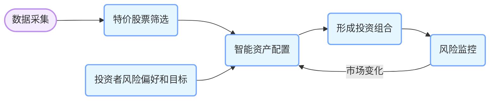

# 如何将特价股票策略与智能资产配置相结合

> 关键词：特价股票策略、智能资产配置、投资组合、量化分析、风险控制

> 摘要：本文旨在探讨如何将特价股票策略与智能资产配置相结合，以实现更优化的投资组合。首先介绍了相关背景知识，包括目的、预期读者、文档结构和术语表。接着阐述了特价股票策略和智能资产配置的核心概念及联系，并给出了相应的文本示意图和 Mermaid 流程图。详细讲解了核心算法原理，用 Python 代码进行了说明，还介绍了相关的数学模型和公式，并举例说明。通过项目实战展示了代码实现和解读，分析了在实际应用场景中的作用。最后推荐了相关的工具和资源，总结了未来发展趋势与挑战，提供了常见问题解答和扩展阅读参考资料，帮助投资者更好地理解和运用这一结合策略。

## 1. 背景介绍 
### 1.1 目的和范围
在金融投资领域，投资者总是希望通过合理的策略实现资产的增值和风险的控制。特价股票策略旨在寻找被市场低估的股票，以较低的价格买入并在其价值回归时获利。而智能资产配置则是利用先进的算法和数据分析，将资金合理分配到不同的资产类别中，以达到最优的风险 - 收益平衡。本文的目的是探讨如何将这两种策略有机结合，为投资者提供更有效的投资方案。范围涵盖了从理论概念到实际应用的各个方面，包括核心算法、数学模型、项目实战以及工具资源等。

### 1.2 预期读者
本文预期读者包括金融投资者、投资顾问、量化分析师、金融科技从业者以及对金融投资和人工智能应用感兴趣的技术人员。无论是专业的投资人士还是对投资有一定了解的业余爱好者，都能从本文中获得有价值的信息。

### 1.3 文档结构概述
本文将按照以下结构进行阐述：首先介绍核心概念与联系，帮助读者理解特价股票策略和智能资产配置的基本原理和相互关系；接着详细讲解核心算法原理和具体操作步骤，并给出 Python 代码示例；然后介绍相关的数学模型和公式，并通过举例说明其应用；之后通过项目实战展示如何在实际中实现这一结合策略；再探讨实际应用场景；推荐相关的工具和资源；最后总结未来发展趋势与挑战，提供常见问题解答和扩展阅读参考资料。

### 1.4 术语表
#### 1.4.1 核心术语定义
- **特价股票策略**：通过分析股票的基本面和市场情况，寻找价格低于其内在价值的股票进行投资的策略。
- **智能资产配置**：利用计算机算法和数据分析，根据投资者的风险偏好、投资目标等因素，将资金合理分配到不同资产类别的过程。
- **投资组合**：由多种资产组成的集合，旨在通过分散投资降低风险并实现一定的收益目标。
- **量化分析**：运用数学和统计学方法对金融数据进行分析，以辅助投资决策的过程。
- **风险控制**：采取措施降低投资过程中可能面临的风险，确保投资组合的稳定性。

#### 1.4.2 相关概念解释
- **内在价值**：股票的真实价值，通常通过对公司的财务状况、盈利能力、行业前景等因素进行分析得出。
- **风险偏好**：投资者对风险的承受能力和意愿，不同的投资者有不同的风险偏好，可分为保守型、稳健型和激进型等。
- **夏普比率**：衡量投资组合风险调整后收益的指标，反映了单位风险所获得的超额回报。

#### 1.4.3 缩略词列表
- **ETF**：交易型开放式指数基金（Exchange Traded Fund）
- **VAR**：风险价值（Value at Risk）

## 2. 核心概念与联系 
### 核心概念原理
#### 特价股票策略原理
特价股票策略的核心在于寻找被市场低估的股票。这通常通过对股票的基本面分析来实现，包括分析公司的财务报表、盈利能力、资产负债状况、行业竞争地位等。常用的估值方法有市盈率（P/E）、市净率（P/B）、现金流折现法（DCF）等。例如，当一只股票的市盈率明显低于同行业平均水平，且公司的基本面良好时，就可能被认为是被低估的特价股票。

#### 智能资产配置原理
智能资产配置是基于现代投资组合理论，通过对不同资产的风险和收益特征进行分析，将资金合理分配到不同的资产类别中，以实现最优的风险 - 收益平衡。其核心思想是分散投资，降低单一资产的风险对整个投资组合的影响。智能资产配置通常会考虑投资者的风险偏好、投资目标、投资期限等因素，利用算法和模型来确定最优的资产配置比例。

### 架构的文本示意图
特价股票策略与智能资产配置相结合的架构可以描述如下：首先，通过数据采集模块收集股票市场数据、公司财务数据等信息；然后，利用特价股票筛选模块，根据预设的估值指标和条件筛选出特价股票；接着，智能资产配置模块根据投资者的风险偏好和投资目标，将筛选出的特价股票与其他资产（如债券、基金等）进行合理配置，形成投资组合；最后，通过风险监控模块对投资组合的风险进行实时监控，并根据市场变化进行动态调整。

### Mermaid 流程图


该流程图展示了特价股票策略与智能资产配置相结合的主要流程。从数据采集开始，经过特价股票筛选和智能资产配置，形成投资组合，然后进行风险监控，根据市场变化动态调整资产配置。

## 3. 核心算法原理 & 具体操作步骤 
### 核心算法原理
#### 特价股票筛选算法
特价股票筛选通常基于一些估值指标进行，以下是一个简单的基于市盈率（P/E）和市净率（P/B）的筛选算法：
1. 收集股票的财务数据，包括每股收益（EPS）、每股净资产（BVPS）和当前股价（P）。
2. 计算每只股票的市盈率（P/E = P / EPS）和市净率（P/B = P / BVPS）。
3. 设定市盈率和市净率的阈值，例如 P/E < 15 且 P/B < 1.5。
4. 筛选出满足阈值条件的股票作为特价股票。

#### 智能资产配置算法
智能资产配置常用的算法有均值 - 方差优化算法（Markowitz 模型）和风险平价算法等。这里以均值 - 方差优化算法为例进行介绍：
均值 - 方差优化算法的目标是在给定的预期收益率下，最小化投资组合的方差（风险）。设投资组合中包含 $n$ 种资产，第 $i$ 种资产的权重为 $w_i$，预期收益率为 $\mu_i$，资产之间的协方差矩阵为 $\Sigma$。投资组合的预期收益率 $\mu_p$ 和方差 $\sigma_p^2$ 分别为：
$$\mu_p = \sum_{i=1}^{n} w_i \mu_i$$
$$\sigma_p^2 = \sum_{i=1}^{n} \sum_{j=1}^{n} w_i w_j \sigma_{ij}$$
其中 $\sigma_{ij}$ 是资产 $i$ 和资产 $j$ 之间的协方差。

均值 - 方差优化问题可以表示为以下约束优化问题：
$$\min_{w} \sigma_p^2 = w^T \Sigma w$$
$$\text{s.t. } \sum_{i=1}^{n} w_i = 1$$
$$\sum_{i=1}^{n} w_i \mu_i \geq \mu_{target}$$
$$w_i \geq 0, \quad i = 1, \cdots, n$$
其中 $\mu_{target}$ 是投资者设定的目标预期收益率。

### 具体操作步骤
#### 特价股票筛选步骤
```python
import pandas as pd

# 模拟股票数据
data = {
    '股票代码': ['000001', '000002', '000003', '000004'],
    '每股收益': [1.2, 0.8, 1.5, 0.6],
    '每股净资产': [8, 6, 10, 5],
    '当前股价': [12, 8, 18, 5]
}
df = pd.DataFrame(data)

# 计算市盈率和市净率
df['市盈率'] = df['当前股价'] / df['每股收益']
df['市净率'] = df['当前股价'] / df['每股净资产']

# 设定阈值
pe_threshold = 15
pb_threshold = 1.5

# 筛选特价股票
special_stocks = df[(df['市盈率'] < pe_threshold) & (df['市净率'] < pb_threshold)]
print("特价股票：")
print(special_stocks)
```
#### 智能资产配置步骤
```python
import numpy as np
from scipy.optimize import minimize

# 模拟资产预期收益率和协方差矩阵
mu = np.array([0.1, 0.12, 0.15])  # 预期收益率
Sigma = np.array([[0.04, 0.02, 0.01],
                  [0.02, 0.06, 0.03],
                  [0.01, 0.03, 0.09]])  # 协方差矩阵
mu_target = 0.12  # 目标预期收益率

# 定义目标函数
def objective(w):
    return np.dot(w.T, np.dot(Sigma, w))

# 定义约束条件
cons = [
    {'type': 'eq', 'fun': lambda w: np.sum(w) - 1},  # 权重和为 1
    {'type': 'ineq', 'fun': lambda w: np.dot(w, mu) - mu_target}  # 预期收益率不低于目标值
]

# 定义边界条件
bounds = [(0, 1) for _ in range(len(mu))]

# 初始权重
w0 = np.ones(len(mu)) / len(mu)

# 优化求解
result = minimize(objective, w0, method='SLSQP', constraints=cons, bounds=bounds)

# 最优权重
optimal_weights = result.x
print("最优资产配置权重：")
print(optimal_weights)
```

以上代码展示了特价股票筛选和智能资产配置的具体实现步骤。首先，通过计算市盈率和市净率筛选出特价股票；然后，利用均值 - 方差优化算法计算最优的资产配置权重。

## 4. 数学模型和公式 & 详细讲解 & 举例说明 
### 特价股票估值模型
#### 市盈率模型
市盈率（P/E）是最常用的股票估值指标之一，其计算公式为：
$$P/E = \frac{P}{EPS}$$
其中 $P$ 是股票的当前价格，$EPS$ 是每股收益。市盈率反映了投资者为获取每股收益所愿意支付的价格。一般来说，较低的市盈率可能意味着股票被低估，但需要结合公司的行业特点和发展前景进行综合判断。

例如，某公司的每股收益为 2 元，当前股价为 20 元，则该股票的市盈率为 $P/E = \frac{20}{2} = 10$。如果同行业平均市盈率为 15，那么该股票可能被认为是被低估的。

#### 市净率模型
市净率（P/B）的计算公式为：
$$P/B = \frac{P}{BVPS}$$
其中 $P$ 是股票的当前价格，$BVPS$ 是每股净资产。市净率反映了股票价格与每股净资产的倍数关系。较低的市净率可能表示股票的价格相对其净资产较低，具有一定的投资价值。

例如，某公司的每股净资产为 5 元，当前股价为 4 元，则该股票的市净率为 $P/B = \frac{4}{5} = 0.8$。如果同行业平均市净率为 1.2，那么该股票可能被认为是被低估的。

### 智能资产配置数学模型
#### 均值 - 方差模型
如前文所述，均值 - 方差模型的目标是在给定的预期收益率下，最小化投资组合的方差。其数学表达式为：
$$\min_{w} \sigma_p^2 = w^T \Sigma w$$
$$\text{s.t. } \sum_{i=1}^{n} w_i = 1$$
$$\sum_{i=1}^{n} w_i \mu_i \geq \mu_{target}$$
$$w_i \geq 0, \quad i = 1, \cdots, n$$
其中 $w$ 是资产权重向量，$\Sigma$ 是资产之间的协方差矩阵，$\mu$ 是资产预期收益率向量，$\mu_{target}$ 是目标预期收益率。

例如，假设有三种资产，预期收益率分别为 $\mu_1 = 0.1$，$\mu_2 = 0.12$，$\mu_3 = 0.15$，协方差矩阵为：
$$\Sigma = \begin{bmatrix}
0.04 & 0.02 & 0.01 \\
0.02 & 0.06 & 0.03 \\
0.01 & 0.03 & 0.09
\end{bmatrix}$$
目标预期收益率 $\mu_{target} = 0.12$。通过求解上述优化问题，可以得到最优的资产配置权重。

#### 风险平价模型
风险平价模型的目标是使每种资产对投资组合风险的贡献相等。设投资组合的风险为 $\sigma_p$，第 $i$ 种资产对投资组合风险的贡献为 $RC_i$，则风险平价模型的约束条件为：
$$RC_i = RC_j, \quad \forall i, j = 1, \cdots, n$$
其中 $RC_i$ 可以通过以下公式计算：
$$RC_i = w_i \frac{\partial \sigma_p}{\partial w_i}$$
风险平价模型可以有效降低投资组合对单一资产的风险暴露，提高投资组合的稳定性。

## 5. 项目实战：代码实际案例和详细解释说明 
### 5.1  开发环境搭建
#### 安装 Python
首先需要安装 Python 环境，建议使用 Python 3.7 及以上版本。可以从 Python 官方网站（https://www.python.org/downloads/）下载并安装。

#### 安装必要的库
在项目中需要使用到一些 Python 库，如 pandas、numpy、scipy 等。可以使用以下命令进行安装：
```sh
pip install pandas numpy scipy
```

### 5.2  源代码详细实现和代码解读
#### 完整代码示例
```python
import pandas as pd
import numpy as np
from scipy.optimize import minimize

# 模拟股票数据
data = {
    '股票代码': ['000001', '000002', '000003', '000004'],
    '每股收益': [1.2, 0.8, 1.5, 0.6],
    '每股净资产': [8, 6, 10, 5],
    '当前股价': [12, 8, 18, 5]
}
df = pd.DataFrame(data)

# 计算市盈率和市净率
df['市盈率'] = df['当前股价'] / df['每股收益']
df['市净率'] = df['当前股价'] / df['每股净资产']

# 设定阈值
pe_threshold = 15
pb_threshold = 1.5

# 筛选特价股票
special_stocks = df[(df['市盈率'] < pe_threshold) & (df['市净率'] < pb_threshold)]
print("特价股票：")
print(special_stocks)

# 模拟资产预期收益率和协方差矩阵
mu = np.array([0.1, 0.12, 0.15])  # 预期收益率
Sigma = np.array([[0.04, 0.02, 0.01],
                  [0.02, 0.06, 0.03],
                  [0.01, 0.03, 0.09]])  # 协方差矩阵
mu_target = 0.12  # 目标预期收益率

# 定义目标函数
def objective(w):
    return np.dot(w.T, np.dot(Sigma, w))

# 定义约束条件
cons = [
    {'type': 'eq', 'fun': lambda w: np.sum(w) - 1},  # 权重和为 1
    {'type': 'ineq', 'fun': lambda w: np.dot(w, mu) - mu_target}  # 预期收益率不低于目标值
]

# 定义边界条件
bounds = [(0, 1) for _ in range(len(mu))]

# 初始权重
w0 = np.ones(len(mu)) / len(mu)

# 优化求解
result = minimize(objective, w0, method='SLSQP', constraints=cons, bounds=bounds)

# 最优权重
optimal_weights = result.x
print("最优资产配置权重：")
print(optimal_weights)
```

#### 代码解读
1. **数据模拟和特价股票筛选**：
    - 使用 `pandas` 库创建一个包含股票信息的 DataFrame。
    - 计算每只股票的市盈率和市净率。
    - 根据设定的阈值筛选出特价股票。

2. **智能资产配置**：
    - 模拟资产的预期收益率和协方差矩阵。
    - 定义目标函数，即投资组合的方差。
    - 定义约束条件，包括权重和为 1 以及预期收益率不低于目标值。
    - 定义边界条件，确保权重在 0 到 1 之间。
    - 使用 `scipy.optimize.minimize` 函数求解最优权重。

### 5.3  代码解读与分析
#### 特价股票筛选分析
通过计算市盈率和市净率并设定阈值，可以筛选出可能被低估的特价股票。这种方法简单直观，但需要注意的是，单一的估值指标可能存在局限性，需要结合其他因素进行综合判断。

#### 智能资产配置分析
均值 - 方差优化算法通过最小化投资组合的方差来实现风险的控制。约束条件确保了投资组合的权重和为 1 且预期收益率不低于目标值。需要注意的是，该算法对输入的预期收益率和协方差矩阵比较敏感，这些参数的估计误差可能会影响最终的资产配置结果。

## 6. 实际应用场景 
### 个人投资者
对于个人投资者来说，将特价股票策略与智能资产配置相结合可以帮助他们构建更合理的投资组合。个人投资者可以根据自己的风险偏好和投资目标，筛选出特价股票，并通过智能资产配置算法将资金合理分配到这些股票和其他资产中，以实现资产的增值和风险的控制。例如，一个保守型的个人投资者可以在筛选出特价股票的基础上，适当增加债券等低风险资产的配置比例。

### 投资机构
投资机构可以利用这一结合策略进行大规模的资产配置。通过建立专业的数据分析和算法模型，投资机构可以更准确地筛选出特价股票，并根据不同客户的需求进行个性化的资产配置。此外，投资机构还可以利用智能资产配置算法进行实时的风险监控和动态调整，以适应市场的变化。

### 量化投资基金
量化投资基金通常会运用先进的算法和模型进行投资决策。将特价股票策略与智能资产配置相结合可以为量化投资基金提供更丰富的投资策略。量化投资基金可以通过自动化的程序筛选特价股票，并根据市场情况实时调整资产配置，以获取更高的收益。

## 7. 工具和资源推荐
### 7.1 学习资源推荐
#### 7.1.1 书籍推荐
- 《聪明的投资者》（The Intelligent Investor）：本杰明·格雷厄姆（Benjamin Graham）的经典著作，介绍了价值投资的理念和方法，对于理解特价股票策略有很大帮助。
- 《漫步华尔街》（A Random Walk Down Wall Street）：伯顿·马尔基尔（Burton G. Malkiel）的书籍，探讨了投资组合理论和资产配置的重要性，适合学习智能资产配置的基础知识。
- 《Python 金融数据分析实战》：介绍了如何使用 Python 进行金融数据的分析和处理，对于实现特价股票策略和智能资产配置的代码实现有很大的参考价值。

#### 7.1.2 在线课程
- Coursera 上的“金融市场”（Financial Markets）课程：由耶鲁大学教授罗伯特·席勒（Robert J. Shiller）讲授，涵盖了金融市场的基本原理和投资策略。
- edX 上的“量化投资与金融科技”（Quantitative Investment and Financial Technology）课程：介绍了量化投资的方法和技术，包括智能资产配置和算法交易等内容。

#### 7.1.3 技术博客和网站
- 雪球网（https://xueqiu.com/）：提供了丰富的股票资讯和投资者社区，用户可以在上面交流投资经验和分享投资策略。
- 优矿（https://uqer.datayes.com/）：一个量化投资平台，提供了金融数据、算法模型和回测工具等资源，适合学习和实践量化投资。

### 7.2 开发工具框架推荐
#### 7.2.1 IDE和编辑器
- PyCharm：一款专业的 Python 集成开发环境，提供了丰富的代码编辑、调试和版本控制等功能，适合开发复杂的 Python 项目。
- Jupyter Notebook：一个交互式的开发环境，支持 Python 代码的实时运行和可视化展示，非常适合进行数据分析和算法实验。

#### 7.2.2 调试和性能分析工具
- PDB：Python 自带的调试器，可以帮助开发者定位代码中的错误和问题。
- cProfile：Python 的性能分析工具，可以分析代码的运行时间和函数调用情况，帮助优化代码性能。

#### 7.2.3 相关框架和库
- Pandas：一个强大的数据处理和分析库，提供了 DataFrame 等数据结构，方便进行金融数据的处理和分析。
- Numpy：Python 的数值计算库，提供了高效的数组操作和数学函数，是进行量化分析的基础库。
- Scipy：一个科学计算库，包含了优化、统计、插值等多种算法，可用于实现智能资产配置的优化算法。

### 7.3 相关论文著作推荐
#### 7.3.1 经典论文
- Harry Markowitz 的《Portfolio Selection》：提出了均值 - 方差投资组合理论，为现代资产配置奠定了基础。
- Eugene F. Fama 和 Kenneth R. French 的《The Cross - Section of Expected Stock Returns》：提出了三因子模型，对股票收益率的影响因素进行了深入研究。

#### 7.3.2 最新研究成果
- 关注顶级金融学术期刊，如《Journal of Finance》、《Review of Financial Studies》等，上面会发表关于特价股票策略和智能资产配置的最新研究成果。

#### 7.3.3 应用案例分析
- 一些金融科技公司和投资机构会发布关于特价股票策略和智能资产配置的应用案例分析报告，可以通过它们的官方网站或行业研究报告获取相关信息。

## 8. 总结：未来发展趋势与挑战
### 未来发展趋势
#### 人工智能和机器学习的应用
随着人工智能和机器学习技术的不断发展，未来在特价股票策略和智能资产配置中将会更多地应用这些技术。例如，利用深度学习算法对大量的金融数据进行分析，更准确地预测股票的价格走势和风险；使用强化学习算法进行动态的资产配置调整，以适应市场的变化。

#### 个性化投资服务
未来的投资服务将更加注重个性化。投资者可以根据自己的风险偏好、投资目标、财务状况等因素，获得定制化的特价股票筛选和智能资产配置方案。投资机构和金融科技公司将通过大数据分析和人工智能算法，为投资者提供更加精准的投资建议。

#### 跨资产类别的融合
除了股票和债券等传统资产类别，未来的智能资产配置将更加注重跨资产类别的融合。例如，将数字货币、房地产投资信托基金（REITs）等新兴资产纳入投资组合，以实现更广泛的分散投资和更高的收益。

### 挑战
#### 数据质量和可靠性
特价股票策略和智能资产配置都依赖于大量的金融数据。数据的质量和可靠性直接影响到投资决策的准确性。然而，金融数据往往存在噪声、缺失值和错误等问题，如何有效地处理和清洗数据是一个挑战。

#### 模型的有效性和稳定性
虽然有多种数学模型和算法可用于特价股票筛选和智能资产配置，但这些模型都有其假设和局限性。市场环境是复杂多变的，模型的有效性和稳定性在不同的市场条件下可能会受到影响。如何不断优化和改进模型，提高其适应性和准确性是一个重要的挑战。

#### 监管和合规问题
随着金融科技的发展，特价股票策略和智能资产配置的应用也面临着监管和合规问题。投资机构和金融科技公司需要遵守相关的法律法规，确保投资服务的合法性和安全性。同时，监管机构也需要不断完善监管政策，以适应金融科技的发展。

## 9. 附录：常见问题与解答
### 1. 特价股票策略一定能获得高收益吗？
特价股票策略并不一定能保证获得高收益。虽然特价股票可能被市场低估，但股票价格的走势受到多种因素的影响，如公司的基本面变化、宏观经济环境、行业竞争等。此外，估值指标也存在局限性，单一的估值指标可能无法准确反映股票的真实价值。因此，在使用特价股票策略时，需要综合考虑多种因素，并结合其他投资策略进行风险管理。

### 2. 智能资产配置算法的结果可靠吗？
智能资产配置算法的结果受到输入参数的影响，如预期收益率和协方差矩阵。这些参数的估计误差可能会导致算法结果的不准确。此外，市场环境是动态变化的，过去的历史数据可能无法完全反映未来的市场情况。因此，智能资产配置算法的结果需要结合投资者的经验和判断进行综合分析，并且需要进行实时的监控和调整。

### 3. 如何确定自己的风险偏好？
确定自己的风险偏好可以考虑以下几个因素：
- 投资目标：如果投资目标是短期的资金保值，那么风险偏好可能较低；如果投资目标是长期的资产增值，那么可以适当承担较高的风险。
- 财务状况：财务状况较好、有稳定收入的投资者可以承受相对较高的风险；而财务状况较差、收入不稳定的投资者可能更倾向于保守的投资策略。
- 投资经验：有丰富投资经验的投资者可能对风险有更深刻的认识，能够承受较高的风险；而投资经验较少的投资者可能更适合选择风险较低的投资产品。

### 4. 特价股票策略和智能资产配置适合所有投资者吗？
特价股票策略和智能资产配置并不适合所有投资者。这两种策略需要一定的金融知识和投资经验，并且需要投入一定的时间和精力进行研究和分析。对于缺乏金融知识和投资经验的投资者来说，可能更适合选择一些简单的投资产品，如指数基金等。此外，投资者的风险偏好和投资目标也会影响这两种策略的适用性，需要根据自己的实际情况进行选择。

## 10. 扩展阅读 & 参考资料
### 扩展阅读
- 《金融炼金术》（The Alchemy of Finance）：乔治·索罗斯（George Soros）的著作，探讨了金融市场的反身性原理和投资哲学。
- 《金融的智慧》（The Wisdom of Finance）：米希尔·A·德赛（Mihir A. Desai）的书籍，介绍了金融领域的基本概念和原理，以及如何运用金融思维解决实际问题。

### 参考资料
- 相关金融学术期刊，如《Journal of Financial Economics》、《Journal of Financial and Quantitative Analysis》等。
- 金融数据提供商，如 Wind、Bloomberg 等提供的金融数据和研究报告。
- 投资机构和金融科技公司发布的研究报告和白皮书。

作者：AI天才研究院/AI Genius Institute & 禅与计算机程序设计艺术 /Zen And The Art of Computer Programming