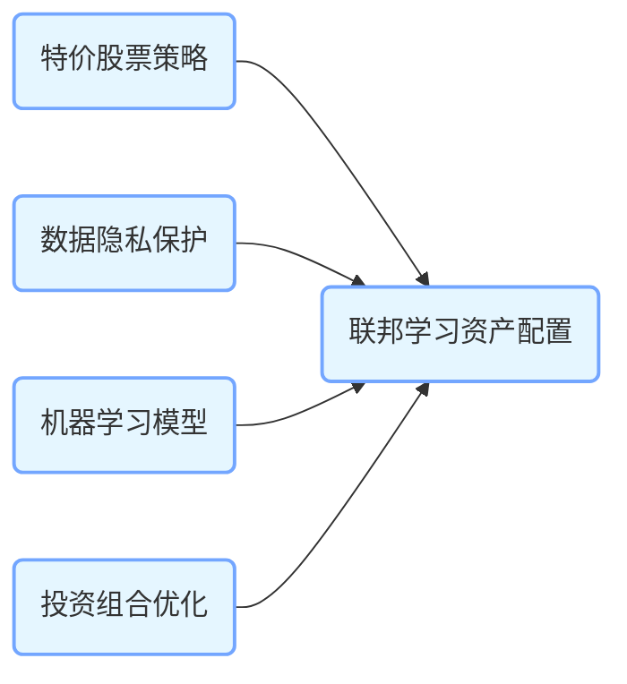

# 如何将特价股票策略与联邦学习资产配置相结合

> 关键词：特价股票策略、联邦学习、资产配置、金融科技、隐私保护、机器学习

> 摘要：本文聚焦于如何将特价股票策略与联邦学习资产配置相结合。首先介绍了相关背景，包括目的、预期读者等内容。接着阐述了特价股票策略、联邦学习和资产配置的核心概念及其联系，给出了相应的原理和架构示意图与流程图。详细讲解了核心算法原理和具体操作步骤，通过Python代码进行了示例。还介绍了相关的数学模型和公式，并举例说明。在项目实战部分，进行了开发环境搭建，给出了源代码实现和解读。探讨了该结合方式的实际应用场景，推荐了学习、开发工具和相关论文著作。最后总结了未来发展趋势与挑战，解答了常见问题，并提供了扩展阅读和参考资料。旨在为金融领域从业者和研究者提供一种创新的资产配置思路和技术实现方法。

## 1. 背景介绍 
### 1.1 目的和范围
在金融投资领域，特价股票策略旨在寻找被市场低估的股票，通过合理的投资获得超额收益。而联邦学习作为一种新兴的机器学习技术，能够在保护数据隐私的前提下进行模型训练。本文章的目的是探索如何将特价股票策略与联邦学习资产配置相结合，以充分利用两者的优势，提高资产配置的效率和收益，同时保护参与方的数据隐私。

范围涵盖了特价股票策略的基本原理、联邦学习的技术架构、资产配置的方法，以及如何将三者有机结合的具体实现。我们将从理论层面深入剖析，通过代码示例进行实践验证，并探讨其在实际金融市场中的应用场景。

### 1.2 预期读者
本文预期读者包括金融领域的从业者，如投资经理、分析师、交易员等，他们可以从中获取新的投资策略和技术手段；计算机科学领域的研究者和开发者，尤其是对金融科技和隐私计算感兴趣的人员，能够了解联邦学习在金融资产配置中的具体应用；以及对金融市场和机器学习有一定了解的爱好者，通过阅读本文可以拓宽知识面，深入了解跨领域的技术融合。

### 1.3 文档结构概述
本文将按照以下结构进行阐述：首先介绍核心概念与联系，包括特价股票策略、联邦学习和资产配置的原理和相互关系；接着详细讲解核心算法原理和具体操作步骤，并给出Python代码示例；然后介绍相关的数学模型和公式，并举例说明；在项目实战部分，进行开发环境搭建，给出源代码实现和详细解读；探讨实际应用场景；推荐学习资源、开发工具和相关论文著作；最后总结未来发展趋势与挑战，解答常见问题，并提供扩展阅读和参考资料。

### 1.4 术语表
#### 1.4.1 核心术语定义
- **特价股票策略**：一种投资策略，通过分析股票的基本面、市场情绪等因素，寻找价格低于其内在价值的股票进行投资，以期在股票价格回归价值时获得收益。
- **联邦学习**：一种机器学习技术，多个参与方在不共享原始数据的情况下，通过交换模型参数或梯度信息，共同训练一个全局模型，从而在保护数据隐私的前提下实现数据的联合利用。
- **资产配置**：根据投资者的风险偏好、投资目标和市场情况，将资金分配到不同的资产类别（如股票、债券、基金等）中，以实现投资组合的最优风险-收益平衡。

#### 1.4.2 相关概念解释
- **数据隐私**：指数据所有者对其数据的访问、使用和披露具有控制权，确保数据不被未经授权的第三方获取和利用。
- **模型参数**：在机器学习模型中，用于描述模型结构和行为的数值，通过训练过程不断调整以优化模型性能。
- **梯度信息**：表示损失函数相对于模型参数的变化率，用于指导模型参数的更新方向。

#### 1.4.3 缩略词列表
- **FL**：联邦学习（Federated Learning）
- **ML**：机器学习（Machine Learning）
- **ROI**：投资回报率（Return on Investment）

## 2. 核心概念与联系 

### 特价股票策略原理
特价股票策略的核心在于寻找被市场低估的股票。其基本原理基于价值投资理论，认为股票的价格会围绕其内在价值波动。通过对公司的财务报表、行业前景、竞争优势等基本面因素进行分析，评估股票的内在价值。当股票价格低于其内在价值时，认为该股票被低估，具有投资价值。

### 联邦学习原理
联邦学习是一种分布式机器学习技术，其核心思想是在不共享原始数据的情况下，多个参与方共同训练一个全局模型。联邦学习主要分为横向联邦学习、纵向联邦学习和联邦迁移学习。以横向联邦学习为例，参与方的数据特征相同但样本不同。训练过程如下：
1. 服务器初始化全局模型参数，并分发给各个参与方。
2. 参与方使用本地数据对模型进行训练，计算梯度信息。
3. 参与方将梯度信息加密后上传到服务器。
4. 服务器对收到的梯度信息进行聚合，更新全局模型参数。
5. 服务器将更新后的全局模型参数分发给各个参与方，重复步骤2-4，直到模型收敛。

### 资产配置原理
资产配置的目的是通过将资金分散投资于不同的资产类别，降低投资组合的风险，同时实现预期的收益目标。常见的资产配置方法包括均值-方差模型、风险平价模型等。均值-方差模型通过优化投资组合的预期收益率和方差，找到最优的资产配置比例。

### 核心概念架构示意图


### 核心概念联系
特价股票策略为联邦学习资产配置提供了具体的投资标的选择依据。通过特价股票策略筛选出的股票，可以作为资产配置的候选资产。联邦学习则为资产配置提供了一种安全、高效的数据利用方式。在多个金融机构或投资者合作进行资产配置时，联邦学习可以在保护各方数据隐私的前提下，实现数据的联合分析和模型训练。资产配置则是将特价股票策略和联邦学习的结果进行整合，通过合理的资金分配，实现投资组合的最优风险-收益平衡。

## 3. 核心算法原理 & 具体操作步骤 

### 核心算法原理
我们采用横向联邦学习框架，结合特价股票策略进行资产配置。具体算法步骤如下：
1. **数据预处理**：各个参与方对本地的股票数据进行清洗、归一化等预处理操作。
2. **模型初始化**：服务器初始化一个机器学习模型，如神经网络模型，用于预测股票的收益率。
3. **本地训练**：参与方使用本地的特价股票数据对模型进行训练，计算本地模型的梯度信息。
4. **梯度上传**：参与方将本地模型的梯度信息加密后上传到服务器。
5. **梯度聚合**：服务器对收到的梯度信息进行聚合，更新全局模型的参数。
6. **模型分发**：服务器将更新后的全局模型参数分发给各个参与方。
7. **重复训练**：重复步骤3-6，直到模型收敛。
8. **资产配置**：根据训练好的模型预测股票的收益率，使用资产配置算法（如均值-方差模型）确定投资组合中各个股票的权重。

### Python代码实现

```python
import numpy as np
import tensorflow as tf
from tensorflow.keras.models import Sequential
from tensorflow.keras.layers import Dense
from sklearn.preprocessing import StandardScaler

# 模拟参与方数据
class Party:
    def __init__(self, data, labels):
        self.data = data
        self.labels = labels
        self.scaler = StandardScaler()
        self.data = self.scaler.fit_transform(self.data)
        self.model = self.build_model()

    def build_model(self):
        model = Sequential([
            Dense(64, activation='relu', input_shape=(self.data.shape[1],)),
            Dense(32, activation='relu'),
            Dense(1)
        ])
        model.compile(optimizer='adam', loss='mse')
        return model

    def local_train(self):
        self.model.fit(self.data, self.labels, epochs=1, batch_size=32, verbose=0)
        gradients = []
        for layer in self.model.layers:
            if layer.trainable_weights:
                gradients.extend([tf.keras.backend.eval(tf.gradients(self.model.total_loss, w)[0]) for w in layer.trainable_weights])
        return gradients

    def update_model(self, global_weights):
        self.model.set_weights(global_weights)

# 模拟服务器
class Server:
    def __init__(self, parties):
        self.parties = parties
        self.global_model = parties[0].build_model()

    def aggregate_gradients(self, gradients_list):
        num_parties = len(gradients_list)
        aggregated_gradients = []
        for i in range(len(gradients_list[0])):
            grad_sum = sum([gradients_list[j][i] for j in range(num_parties)])
            aggregated_gradients.append(grad_sum / num_parties)
        return aggregated_gradients

    def update_global_model(self, gradients):
        weights = self.global_model.get_weights()
        new_weights = []
        for i in range(len(weights)):
            new_weights.append(weights[i] - 0.01 * gradients[i])  # 学习率为0.01
        self.global_model.set_weights(new_weights)
        return new_weights

    def train(self, epochs):
        for epoch in range(epochs):
            gradients_list = []
            for party in self.parties:
                gradients = party.local_train()
                gradients_list.append(gradients)
            aggregated_gradients = self.aggregate_gradients(gradients_list)
            global_weights = self.update_global_model(aggregated_gradients)
            for party in self.parties:
                party.update_model(global_weights)
        return self.global_model

# 模拟数据
np.random.seed(42)
num_parties = 3
num_samples = 1000
num_features = 10

parties = []
for _ in range(num_parties):
    data = np.random.randn(num_samples, num_features)
    labels = np.random.randn(num_samples, 1)
    party = Party(data, labels)
    parties.append(party)

server = Server(parties)
trained_model = server.train(epochs=10)

# 资产配置示例（简单的均值-方差模型）
def mean_variance_allocation(returns, cov_matrix, risk_aversion=1):
    inv_cov = np.linalg.inv(cov_matrix)
    ones = np.ones(len(returns))
    A = ones.T @ inv_cov @ ones
    B = returns.T @ inv_cov @ ones
    C = returns.T @ inv_cov @ returns
    delta = A * C - B ** 2
    lambda_ = (C - risk_aversion * B) / delta
    gamma_ = (risk_aversion * A - B) / delta
    weights = lambda_ * inv_cov @ ones + gamma_ * inv_cov @ returns
    return weights

# 假设有5只股票的预测收益率和协方差矩阵
predicted_returns = np.random.randn(5)
cov_matrix = np.random.randn(5, 5)
cov_matrix = cov_matrix @ cov_matrix.T  # 确保协方差矩阵是正定的
weights = mean_variance_allocation(predicted_returns, cov_matrix)
print("资产配置权重:", weights)
```

### 代码解释
1. **Party类**：模拟参与方，负责本地数据的预处理、模型的构建和本地训练。`local_train`方法计算本地模型的梯度信息，`update_model`方法根据服务器分发的全局模型参数更新本地模型。
2. **Server类**：模拟服务器，负责梯度的聚合和全局模型的更新。`aggregate_gradients`方法对各个参与方上传的梯度信息进行聚合，`update_global_model`方法根据聚合后的梯度信息更新全局模型的参数。
3. **训练过程**：通过循环调用参与方的`local_train`方法和服务器的`aggregate_gradients`、`update_global_model`方法，实现模型的迭代训练。
4. **资产配置**：使用`mean_variance_allocation`函数实现简单的均值-方差模型，根据预测的股票收益率和协方差矩阵计算资产配置的权重。

## 4. 数学模型和公式 & 详细讲解 & 举例说明 

### 联邦学习中的梯度聚合公式
在横向联邦学习中，服务器对各个参与方上传的梯度信息进行聚合。假设共有 $n$ 个参与方，第 $i$ 个参与方上传的梯度信息为 $\nabla w_i$，则聚合后的梯度信息 $\nabla w_{agg}$ 计算公式为：
$$\nabla w_{agg} = \frac{1}{n} \sum_{i=1}^{n} \nabla w_i$$

### 均值-方差模型公式
均值-方差模型的目标是在给定预期收益率的情况下，最小化投资组合的方差。设投资组合中各个资产的权重为 $w = [w_1, w_2, \cdots, w_m]^T$，预期收益率为 $\mu = [\mu_1, \mu_2, \cdots, \mu_m]^T$，协方差矩阵为 $\Sigma$，则投资组合的预期收益率 $R_p$ 和方差 $\sigma_p^2$ 计算公式为：
$$R_p = w^T \mu$$
$$\sigma_p^2 = w^T \Sigma w$$

均值-方差模型的优化问题可以表示为：
$$\min_{w} w^T \Sigma w$$
$$s.t. \quad w^T \mu = R_{target}$$
$$\sum_{i=1}^{m} w_i = 1$$
其中 $R_{target}$ 是目标预期收益率。

### 举例说明
假设有三只股票，其预期收益率分别为 $\mu = [0.1, 0.15, 0.2]^T$，协方差矩阵为：
$$\Sigma = \begin{bmatrix}
0.04 & 0.02 & 0.01 \\
0.02 & 0.06 & 0.03 \\
0.01 & 0.03 & 0.08
\end{bmatrix}$$
目标预期收益率 $R_{target} = 0.16$。

使用拉格朗日乘数法求解上述优化问题：
设拉格朗日函数为：
$$L(w, \lambda, \gamma) = w^T \Sigma w + \lambda (w^T \mu - R_{target}) + \gamma (\sum_{i=1}^{3} w_i - 1)$$
分别对 $w$、$\lambda$ 和 $\gamma$ 求偏导数并令其为零，得到：
$$\frac{\partial L}{\partial w} = 2\Sigma w + \lambda \mu + \gamma \mathbf{1} = 0$$
$$\frac{\partial L}{\partial \lambda} = w^T \mu - R_{target} = 0$$
$$\frac{\partial L}{\partial \gamma} = \sum_{i=1}^{3} w_i - 1 = 0$$
解上述方程组，得到最优资产配置权重 $w$。

在Python中可以使用`scipy.optimize.minimize`函数求解：
```python
import numpy as np
from scipy.optimize import minimize

mu = np.array([0.1, 0.15, 0.2])
Sigma = np.array([[0.04, 0.02, 0.01],
                  [0.02, 0.06, 0.03],
                  [0.01, 0.03, 0.08]])
R_target = 0.16

def objective(w):
    return w.T @ Sigma @ w

def constraint1(w):
    return w.T @ mu - R_target

def constraint2(w):
    return np.sum(w) - 1

cons = [{'type': 'eq', 'fun': constraint1},
        {'type': 'eq', 'fun': constraint2}]

bounds = [(0, 1) for _ in range(len(mu))]
w0 = np.ones(len(mu)) / len(mu)

result = minimize(objective, w0, method='SLSQP', bounds=bounds, constraints=cons)
optimal_weights = result.x
print("最优资产配置权重:", optimal_weights)
```

## 5. 项目实战：代码实际案例和详细解释说明 

### 5.1  开发环境搭建
#### 安装Python
首先需要安装Python环境，建议使用Python 3.7及以上版本。可以从Python官方网站（https://www.python.org/downloads/）下载安装包进行安装。

#### 安装依赖库
使用`pip`安装所需的依赖库，包括`tensorflow`、`numpy`、`scikit-learn`等：
```sh
pip install tensorflow numpy scikit-learn
```

### 5.2  源代码详细实现和代码解读
```python
import numpy as np
import tensorflow as tf
from tensorflow.keras.models import Sequential
from tensorflow.keras.layers import Dense
from sklearn.preprocessing import StandardScaler

# 模拟参与方数据
class Party:
    def __init__(self, data, labels):
        self.data = data
        self.labels = labels
        self.scaler = StandardScaler()
        self.data = self.scaler.fit_transform(self.data)
        self.model = self.build_model()

    def build_model(self):
        model = Sequential([
            Dense(64, activation='relu', input_shape=(self.data.shape[1],)),
            Dense(32, activation='relu'),
            Dense(1)
        ])
        model.compile(optimizer='adam', loss='mse')
        return model

    def local_train(self):
        self.model.fit(self.data, self.labels, epochs=1, batch_size=32, verbose=0)
        gradients = []
        for layer in self.model.layers:
            if layer.trainable_weights:
                gradients.extend([tf.keras.backend.eval(tf.gradients(self.model.total_loss, w)[0]) for w in layer.trainable_weights])
        return gradients

    def update_model(self, global_weights):
        self.model.set_weights(global_weights)

# 模拟服务器
class Server:
    def __init__(self, parties):
        self.parties = parties
        self.global_model = parties[0].build_model()

    def aggregate_gradients(self, gradients_list):
        num_parties = len(gradients_list)
        aggregated_gradients = []
        for i in range(len(gradients_list[0])):
            grad_sum = sum([gradients_list[j][i] for j in range(num_parties)])
            aggregated_gradients.append(grad_sum / num_parties)
        return aggregated_gradients

    def update_global_model(self, gradients):
        weights = self.global_model.get_weights()
        new_weights = []
        for i in range(len(weights)):
            new_weights.append(weights[i] - 0.01 * gradients[i])  # 学习率为0.01
        self.global_model.set_weights(new_weights)
        return new_weights

    def train(self, epochs):
        for epoch in range(epochs):
            gradients_list = []
            for party in self.parties:
                gradients = party.local_train()
                gradients_list.append(gradients)
            aggregated_gradients = self.aggregate_gradients(gradients_list)
            global_weights = self.update_global_model(aggregated_gradients)
            for party in self.parties:
                party.update_model(global_weights)
        return self.global_model

# 模拟数据
np.random.seed(42)
num_parties = 3
num_samples = 1000
num_features = 10

parties = []
for _ in range(num_parties):
    data = np.random.randn(num_samples, num_features)
    labels = np.random.randn(num_samples, 1)
    party = Party(data, labels)
    parties.append(party)

server = Server(parties)
trained_model = server.train(epochs=10)

# 资产配置示例（简单的均值-方差模型）
def mean_variance_allocation(returns, cov_matrix, risk_aversion=1):
    inv_cov = np.linalg.inv(cov_matrix)
    ones = np.ones(len(returns))
    A = ones.T @ inv_cov @ ones
    B = returns.T @ inv_cov @ ones
    C = returns.T @ inv_cov @ returns
    delta = A * C - B ** 2
    lambda_ = (C - risk_aversion * B) / delta
    gamma_ = (risk_aversion * A - B) / delta
    weights = lambda_ * inv_cov @ ones + gamma_ * inv_cov @ returns
    return weights

# 假设有5只股票的预测收益率和协方差矩阵
predicted_returns = np.random.randn(5)
cov_matrix = np.random.randn(5, 5)
cov_matrix = cov_matrix @ cov_matrix.T  # 确保协方差矩阵是正定的
weights = mean_variance_allocation(predicted_returns, cov_matrix)
print("资产配置权重:", weights)
```

### 代码解读与分析
#### Party类
- `__init__`方法：初始化参与方的本地数据和模型。对数据进行标准化处理，构建一个简单的神经网络模型。
- `build_model`方法：构建一个包含两个隐藏层的神经网络模型，使用`adam`优化器和均方误差损失函数。
- `local_train`方法：使用本地数据对模型进行一轮训练，计算本地模型的梯度信息。
- `update_model`方法：根据服务器分发的全局模型参数更新本地模型。

#### Server类
- `__init__`方法：初始化服务器，构建一个与参与方相同的全局模型。
- `aggregate_gradients`方法：对各个参与方上传的梯度信息进行聚合，计算平均梯度。
- `update_global_model`方法：根据聚合后的梯度信息更新全局模型的参数，使用固定的学习率。
- `train`方法：循环调用参与方的`local_train`方法和服务器的`aggregate_gradients`、`update_global_model`方法，实现模型的迭代训练。

#### 资产配置部分
- `mean_variance_allocation`函数：实现简单的均值-方差模型，根据预测的股票收益率和协方差矩阵计算资产配置的权重。

通过上述代码，我们模拟了一个横向联邦学习的过程，结合特价股票策略进行资产配置。各个参与方在本地进行模型训练，上传梯度信息到服务器，服务器进行梯度聚合和全局模型更新，最后根据训练好的模型进行资产配置。

## 6. 实际应用场景 
### 金融机构合作投资
多个金融机构（如银行、证券公司、基金公司等）可以合作进行投资。每个金融机构拥有自己的客户数据和股票分析数据，但出于数据隐私和竞争的考虑，不愿意共享原始数据。通过联邦学习技术，各个金融机构可以在不共享数据的情况下，共同训练一个股票收益率预测模型。根据特价股票策略筛选出的股票，结合训练好的模型进行资产配置，实现合作投资，提高投资收益。

### 投资者联盟
一群投资者可以组成投资者联盟，各自拥有不同的股票投资经验和数据。通过联邦学习，投资者可以共同训练一个投资模型，结合特价股票策略进行资产配置。这样可以充分利用每个投资者的优势，提高投资决策的准确性和效率。

### 监管机构数据融合
监管机构可以利用联邦学习技术，在保护金融机构数据隐私的前提下，融合多个金融机构的数据，进行市场监测和风险评估。结合特价股票策略，监管机构可以及时发现市场中的异常情况，采取相应的监管措施。

## 7. 工具和资源推荐
### 7.1 学习资源推荐
#### 7.1.1 书籍推荐
- 《机器学习》（周志华）：全面介绍了机器学习的基本概念、算法和应用，是机器学习领域的经典教材。
- 《深度学习》（Ian Goodfellow、Yoshua Bengio和Aaron Courville）：深入介绍了深度学习的原理、模型和应用，是深度学习领域的权威著作。
- 《金融科技：应用与创新》：介绍了金融科技的各个方面，包括区块链、人工智能、大数据等在金融领域的应用，对于理解金融科技的发展趋势和应用场景有很大帮助。

#### 7.1.2 在线课程
- Coursera上的“机器学习”课程（Andrew Ng教授主讲）：经典的机器学习课程，讲解详细，案例丰富，适合初学者入门。
- edX上的“深度学习专项课程”：由深度学习领域的知名学者授课，深入讲解了深度学习的各个方面，包括卷积神经网络、循环神经网络等。
- 中国大学MOOC上的“金融科技概论”课程：介绍了金融科技的基本概念、技术和应用，对于了解金融科技在金融领域的应用有很大帮助。

#### 7.1.3 技术博客和网站
- Medium：有很多关于机器学习、金融科技的技术博客文章，涵盖了最新的研究成果和应用案例。
- arXiv：提供了大量的学术论文，包括机器学习、联邦学习等领域的最新研究成果。
- 金融界网站：提供了丰富的金融市场数据和分析报告，对于了解金融市场动态和投资策略有很大帮助。

### 7.2 开发工具框架推荐
#### 7.2.1 IDE和编辑器
- PyCharm：功能强大的Python集成开发环境，提供了代码编辑、调试、版本控制等功能，适合Python开发。
- Jupyter Notebook：交互式的开发环境，支持代码、文本、图表等多种形式的展示，适合数据分析和机器学习实验。
- Visual Studio Code：轻量级的代码编辑器，支持多种编程语言，有丰富的插件扩展，适合快速开发和调试。

#### 7.2.2 调试和性能分析工具
- TensorBoard：TensorFlow的可视化工具，用于监控模型训练过程、可视化模型结构和分析性能指标。
- Py-Spy：Python性能分析工具，可以分析Python代码的CPU使用率和内存占用情况，帮助优化代码性能。
- cProfile：Python标准库中的性能分析模块，可以统计函数调用时间和次数，帮助找出代码中的性能瓶颈。

#### 7.2.3 相关框架和库
- TensorFlow Federated：Google开发的联邦学习框架，提供了丰富的联邦学习算法和工具，支持多种机器学习模型。
- PySyft：OpenMined开发的开源库，用于隐私保护和联邦学习，提供了安全的张量操作和模型训练功能。
- Scikit-learn：Python中常用的机器学习库，提供了丰富的机器学习算法和工具，适合数据预处理、模型选择和评估等任务。

### 7.3 相关论文著作推荐
#### 7.3.1 经典论文
- 《Communication-Efficient Learning of Deep Networks from Decentralized Data》：介绍了联邦学习的基本概念和算法，是联邦学习领域的经典论文。
- 《Markowitz Portfolio Selection》：提出了均值-方差模型，奠定了现代资产配置理论的基础。
- 《Value Investing: The Use of Historical Financial Statement Information to Separate Winners from Losers》：阐述了价值投资的理论和方法，对于理解特价股票策略有很大帮助。

#### 7.3.2 最新研究成果
- 《Federated Learning: Challenges, Methods, and Future Directions》：综述了联邦学习的发展现状、面临的挑战和未来的研究方向。
- 《Deep Learning for Stock Market Prediction: A Review》：总结了深度学习在股票市场预测中的应用，包括模型架构、数据处理和性能评估等方面。
- 《Risk Parity Portfolio Optimization》：介绍了风险平价模型的原理和应用，是资产配置领域的最新研究成果。

#### 7.3.3 应用案例分析
- 《Federated Learning in the Financial Industry: A Case Study》：介绍了联邦学习在金融行业的应用案例，包括数据隐私保护、模型训练和资产配置等方面。
- 《Value Investing Strategies in Emerging Markets: Evidence from China》：分析了特价股票策略在中国新兴市场的应用效果和投资机会。
- 《Asset Allocation Strategies for Pension Funds: A Case Study》：以养老基金为例，介绍了不同资产配置策略的应用和效果评估。

## 8. 总结：未来发展趋势与挑战
### 未来发展趋势
- **更广泛的应用场景**：随着金融科技的不断发展，特价股票策略与联邦学习资产配置的结合将在更多的金融领域得到应用，如保险、信贷等。
- **技术创新**：联邦学习技术将不断创新，如引入更高效的加密算法、优化梯度聚合方法等，提高模型训练的效率和安全性。
- **跨领域融合**：将与区块链、物联网等技术进行更深入的融合，实现数据的可信共享和资产的智能配置。

### 挑战
- **数据隐私保护**：虽然联邦学习可以在一定程度上保护数据隐私，但仍然面临着数据泄露的风险。需要不断完善加密算法和隐私保护机制，确保数据的安全性。
- **模型性能优化**：在多个参与方的数据和模型存在差异的情况下，如何提高模型的性能和泛化能力是一个挑战。需要研究更有效的模型融合和优化方法。
- **法律法规和监管**：金融领域的创新应用需要遵守严格的法律法规和监管要求。如何在合规的前提下开展特价股票策略与联邦学习资产配置的应用是一个需要解决的问题。

## 9. 附录：常见问题与解答
### 1. 联邦学习如何保证数据隐私？
联邦学习通过加密技术和分布式训练机制保证数据隐私。参与方在本地对数据进行处理和模型训练，只上传加密后的梯度信息或模型参数到服务器，而不共享原始数据。服务器对上传的信息进行聚合和更新，返回给参与方的也是更新后的模型参数，不包含任何原始数据信息。

### 2. 特价股票策略一定能获得超额收益吗？
特价股票策略并不一定能保证获得超额收益。市场是复杂多变的，股票价格受到多种因素的影响，如宏观经济环境、行业竞争、公司内部管理等。即使股票被低估，其价格也可能长期不回归价值，甚至继续下跌。因此，特价股票策略需要结合其他分析方法和风险管理措施，降低投资风险。

### 3. 如何选择合适的资产配置方法？
选择合适的资产配置方法需要考虑多个因素，如投资者的风险偏好、投资目标、投资期限等。如果投资者风险偏好较低，可以选择风险平价模型等较为稳健的资产配置方法；如果投资者风险偏好较高，可以选择均值-方差模型等追求收益最大化的资产配置方法。同时，还需要根据市场情况和投资组合的表现进行动态调整。

### 4. 联邦学习的计算效率如何？
联邦学习的计算效率受到多个因素的影响，如参与方的数量、数据规模、模型复杂度等。在实际应用中，可以通过优化梯度聚合方法、采用并行计算等技术提高计算效率。同时，还可以根据数据的特点和模型的需求，选择合适的联邦学习框架和算法。

## 10. 扩展阅读 & 参考资料
### 扩展阅读
- 《区块链与金融科技：从理论到实践》：介绍了区块链技术在金融科技领域的应用，包括数字货币、智能合约等。
- 《人工智能时代的金融风险管理》：探讨了人工智能技术在金融风险管理中的应用，如信用风险评估、市场风险预测等。
- 《量化投资：策略与技术》：介绍了量化投资的基本概念、策略和技术，包括数据挖掘、机器学习等在投资领域的应用。

### 参考资料
- 《联邦学习白皮书》：由相关机构发布的联邦学习领域的权威报告，介绍了联邦学习的技术原理、应用场景和发展趋势。
- 《金融市场技术分析》：经典的金融市场分析书籍，介绍了技术分析的基本方法和工具，对于理解股票市场走势有很大帮助。
- 《Python机器学习实战》：结合实际案例介绍了Python在机器学习领域的应用，包括数据处理、模型训练和评估等方面。

作者：AI天才研究院/AI Genius Institute & 禅与计算机程序设计艺术 /Zen And The Art of Computer Programming