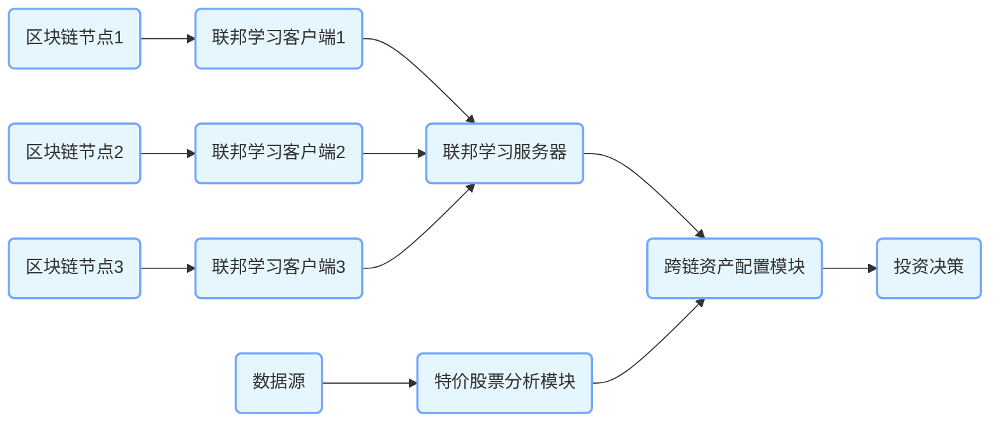

# 如何将特价股票策略与联邦学习跨链资产配置相结合

> 关键词：特价股票策略、联邦学习、跨链资产配置、金融科技、数据隐私保护

> 摘要：本文旨在探讨如何将特价股票策略与联邦学习跨链资产配置相结合。首先介绍了相关背景知识，包括目的范围、预期读者等。接着阐述了核心概念及它们之间的联系，详细讲解了核心算法原理与操作步骤，通过数学模型和公式进一步剖析。然后给出项目实战案例，涵盖开发环境搭建、源代码实现与解读。还介绍了实际应用场景，推荐了学习资源、开发工具框架和相关论文著作。最后总结未来发展趋势与挑战，并提供常见问题解答和扩展阅读参考资料，为金融领域利用新技术进行资产配置提供了全面的指导。

## 1. 背景介绍 
### 1.1 目的和范围
在当今复杂多变的金融市场中，投资者面临着如何优化资产配置以获取更高收益的挑战。特价股票策略旨在寻找价格被低估的股票，通过合理投资这些股票来实现资产增值。而联邦学习和跨链技术的出现为资产配置提供了新的思路和方法。联邦学习允许在不共享原始数据的情况下进行模型训练，保护了数据隐私；跨链技术则可以实现不同区块链之间的资产交互和流通。本文章的目的就是探讨如何将特价股票策略与联邦学习跨链资产配置相结合，为投资者提供更有效的资产配置方案。范围涵盖了相关技术的原理、算法实现、实际应用场景以及未来发展趋势等方面。

### 1.2 预期读者
本文预期读者包括金融行业从业者，如投资经理、金融分析师等，他们希望通过新技术提升资产配置的效率和收益；计算机科学领域的研究人员和开发者，对联邦学习、跨链技术在金融领域的应用感兴趣；以及对金融科技有一定了解，希望深入学习相关知识的投资者。

### 1.3 文档结构概述
本文首先介绍背景知识，让读者了解研究的目的和意义。接着阐述核心概念及它们之间的联系，为后续的算法和应用奠定基础。然后详细讲解核心算法原理和操作步骤，通过数学模型和公式进行深入分析。再通过项目实战案例展示如何将理论应用到实际中。之后介绍实际应用场景，让读者了解该方法的实际价值。还会推荐相关的学习资源、开发工具框架和论文著作，方便读者进一步学习。最后总结未来发展趋势与挑战，并提供常见问题解答和扩展阅读参考资料。

### 1.4 术语表
#### 1.4.1 核心术语定义
- **特价股票策略**：一种投资策略，通过分析股票的基本面、市场情况等因素，寻找价格被低估的股票进行投资，以期望在未来获得较高的收益。
- **联邦学习**：一种机器学习技术，多个参与方在不共享原始数据的情况下，通过交换模型参数来共同训练一个全局模型，保护了数据的隐私性。
- **跨链资产配置**：利用跨链技术，将资产在不同的区块链之间进行合理分配和管理，以实现资产的多元化和优化配置。

#### 1.4.2 相关概念解释
- **区块链**：一种分布式账本技术，具有去中心化、不可篡改、可追溯等特点，广泛应用于金融、供应链等领域。
- **数据隐私保护**：在数据处理和分析过程中，采取一系列技术和管理措施，确保数据的保密性、完整性和可用性，防止数据泄露和滥用。

#### 1.4.3 缩略词列表
- **FL**：联邦学习（Federated Learning）
- **DLT**：分布式账本技术（Distributed Ledger Technology）

## 2. 核心概念与联系 
### 核心概念原理
#### 特价股票策略原理
特价股票策略的核心在于识别被市场低估的股票。这通常需要对股票的基本面进行深入分析，包括公司的财务状况、盈利能力、行业竞争力等。常用的分析方法有市盈率（P/E）、市净率（P/B）等指标。例如，如果一只股票的市盈率低于同行业平均水平，且公司的业绩稳定增长，那么这只股票可能被低估，具有投资价值。

#### 联邦学习原理
联邦学习允许多个参与方在不共享原始数据的情况下进行模型训练。其基本原理是，每个参与方在本地数据上训练模型，然后将模型参数上传到服务器。服务器对这些参数进行聚合，得到一个全局模型，并将其返回给各个参与方。参与方再根据全局模型更新本地模型，重复这个过程直到模型收敛。这样，既可以利用多个参与方的数据进行模型训练，又能保护数据的隐私。

#### 跨链资产配置原理
跨链资产配置是指在不同的区块链之间进行资产的分配和管理。不同的区块链可能具有不同的特点和优势，如以太坊的智能合约功能强大，比特币的价值存储属性较好等。通过跨链技术，可以实现资产在不同区块链之间的流通和交互，从而实现资产的多元化配置，降低投资风险。

### 架构示意图

该架构图展示了特价股票策略与联邦学习跨链资产配置相结合的整体流程。数据源为特价股票分析模块提供数据，不同的区块链节点上的联邦学习客户端将本地模型参数上传到联邦学习服务器进行聚合，然后将全局模型参数发送到跨链资产配置模块。特价股票分析模块的结果也会输入到跨链资产配置模块，最终该模块根据这些信息做出投资决策。

## 3. 核心算法原理 & 具体操作步骤 
### 特价股票筛选算法
```python
import pandas as pd

def special_stock_selection(data):
    """
    特价股票筛选算法
    :param data: 包含股票信息的DataFrame，列包括 'PE_ratio'（市盈率）、'PB_ratio'（市净率）等
    :return: 筛选出的特价股票列表
    """
    # 筛选市盈率低于行业平均水平的股票
    industry_avg_pe = data['PE_ratio'].mean()
    low_pe_stocks = data[data['PE_ratio'] < industry_avg_pe]
    
    # 筛选市净率低于一定阈值的股票
    pb_threshold = 1.5
    low_pb_stocks = low_pe_stocks[low_pe_stocks['PB_ratio'] < pb_threshold]
    
    return low_pb_stocks['stock_code'].tolist()

# 示例数据
data = pd.DataFrame({
    'stock_code': ['000001', '000002', '000003'],
    'PE_ratio': [10, 20, 5],
    'PB_ratio': [1.2, 1.8, 0.9]
})

special_stocks = special_stock_selection(data)
print("筛选出的特价股票代码:", special_stocks)
```
### 算法原理
该算法首先计算所有股票的市盈率平均值作为行业平均市盈率，然后筛选出市盈率低于该平均值的股票。接着，设置一个市净率阈值，筛选出市净率低于该阈值的股票。最终返回这些特价股票的代码列表。

### 联邦学习算法（以联邦平均算法为例）
```python
import numpy as np

class FederatedLearning:
    def __init__(self, num_clients, num_epochs, learning_rate):
        self.num_clients = num_clients
        self.num_epochs = num_epochs
        self.learning_rate = learning_rate
        self.global_model = np.zeros(10)  # 假设模型参数为10维向量

    def client_train(self, client_data):
        """
        客户端本地训练
        :param client_data: 客户端本地数据
        :return: 训练后的本地模型参数
        """
        local_model = self.global_model.copy()
        for _ in range(self.num_epochs):
            # 简单示例：梯度下降更新
            gradient = np.random.randn(10)  # 模拟梯度
            local_model -= self.learning_rate * gradient
        return local_model

    def server_aggregate(self, local_models):
        """
        服务器聚合模型参数
        :param local_models: 所有客户端的本地模型参数列表
        :return: 聚合后的全局模型参数
        """
        aggregated_model = np.mean(local_models, axis=0)
        return aggregated_model

    def train(self, client_datas):
        """
        联邦学习训练过程
        :param client_datas: 所有客户端的本地数据列表
        """
        for _ in range(10):  # 训练10轮
            local_models = []
            for i in range(self.num_clients):
                local_model = self.client_train(client_datas[i])
                local_models.append(local_model)
            self.global_model = self.server_aggregate(local_models)
        return self.global_model

# 示例
num_clients = 3
num_epochs = 5
learning_rate = 0.01
client_datas = [np.random.randn(100, 10) for _ in range(num_clients)]
fl = FederatedLearning(num_clients, num_epochs, learning_rate)
final_model = fl.train(client_datas)
print("最终全局模型参数:", final_model)
```
### 算法原理
联邦平均算法是一种常用的联邦学习算法。在每个训练轮次中，各个客户端在本地数据上进行模型训练，得到本地模型参数。然后将这些本地模型参数上传到服务器，服务器对它们进行平均聚合，得到全局模型参数。最后将全局模型参数返回给各个客户端，客户端根据全局模型更新本地模型。重复这个过程直到达到指定的训练轮次。

### 跨链资产配置算法
```python
def cross_chain_asset_allocation(special_stocks, global_model):
    """
    跨链资产配置算法
    :param special_stocks: 特价股票列表
    :param global_model: 联邦学习得到的全局模型
    :return: 资产配置方案
    """
    # 简单示例：根据全局模型的某个特征分配资产
    asset_allocation = {}
    for stock in special_stocks:
        asset_allocation[stock] = np.random.uniform(0, 1)  # 随机分配权重
    total_weight = sum(asset_allocation.values())
    for stock in asset_allocation:
        asset_allocation[stock] /= total_weight  # 归一化权重
    return asset_allocation

# 调用示例
allocation = cross_chain_asset_allocation(special_stocks, final_model)
print("资产配置方案:", allocation)
```
### 算法原理
该算法根据筛选出的特价股票列表和联邦学习得到的全局模型进行资产配置。在简单示例中，为每只特价股票随机分配一个权重，然后将所有权重归一化，得到最终的资产配置方案。

### 具体操作步骤
1. **数据收集**：收集股票的基本面数据、不同区块链上的资产数据等。
2. **特价股票筛选**：使用特价股票筛选算法，从收集的数据中筛选出被低估的股票。
3. **联邦学习训练**：各个参与方在本地数据上进行模型训练，将本地模型参数上传到服务器进行聚合，重复这个过程直到模型收敛。
4. **跨链资产配置**：根据筛选出的特价股票和联邦学习得到的全局模型，使用跨链资产配置算法制定资产配置方案。
5. **投资决策**：根据资产配置方案进行投资操作。

## 4. 数学模型和公式 & 详细讲解 & 举例说明 
### 特价股票筛选的数学模型
在特价股票筛选中，常用的指标有市盈率（P/E）和市净率（P/B）。市盈率的计算公式为：
$$ P/E = \frac{股价}{每股收益} $$
市净率的计算公式为：
$$ P/B = \frac{股价}{每股净资产} $$
我们可以根据这两个指标来筛选特价股票。例如，假设我们有以下三只股票的数据：

| 股票代码 | 股价 | 每股收益 | 每股净资产 |
| ---- | ---- | ---- | ---- |
| 000001 | 10 | 1 | 5 |
| 000002 | 20 | 2 | 10 |
| 000003 | 5 | 0.5 | 2 |

计算它们的市盈率和市净率：

| 股票代码 | P/E | P/B |
| ---- | ---- | ---- |
| 000001 | 10 | 2 |
| 000002 | 10 | 2 |
| 000003 | 10 | 2.5 |

如果我们设定市盈率阈值为12，市净率阈值为2.2，那么股票000001和000002将被筛选为特价股票。

### 联邦学习的数学模型
联邦学习的核心是模型参数的聚合。假设我们有 $n$ 个客户端，第 $i$ 个客户端的本地模型参数为 $\theta_i$，那么服务器聚合后的全局模型参数 $\theta_{global}$ 可以通过以下公式计算：
$$ \theta_{global} = \frac{1}{n} \sum_{i=1}^{n} \theta_i $$
例如，假设我们有三个客户端，它们的本地模型参数分别为 $\theta_1 = [1, 2, 3]$，$\theta_2 = [2, 3, 4]$，$\theta_3 = [3, 4, 5]$，那么聚合后的全局模型参数为：
$$ \theta_{global} = \frac{1}{3} ([1, 2, 3] + [2, 3, 4] + [3, 4, 5]) = [2, 3, 4] $$

### 跨链资产配置的数学模型
在跨链资产配置中，我们需要确定每只资产的投资权重。假设我们有 $m$ 只资产，第 $j$ 只资产的投资权重为 $w_j$，那么资产配置方案需要满足以下条件：
$$ \sum_{j=1}^{m} w_j = 1 $$
$$ w_j \geq 0, j = 1, 2, \cdots, m $$
例如，假设我们筛选出了三只特价股票，我们可以通过某种方法（如随机分配）得到它们的初始权重分别为 $w_1 = 0.2$，$w_2 = 0.3$，$w_3 = 0.5$，这些权重满足上述条件，即为一个有效的资产配置方案。

## 5. 项目实战：代码实际案例和详细解释说明 
### 5.1  开发环境搭建
#### 硬件环境
- 服务器：建议使用具有较高计算性能的服务器，如配备多核CPU和大容量内存的服务器，以满足联邦学习和数据处理的需求。
- 客户端：可以使用普通的台式机或笔记本电脑，确保安装有Python环境。

#### 软件环境
- **操作系统**：推荐使用Linux系统，如Ubuntu 18.04及以上版本。
- **Python环境**：安装Python 3.7及以上版本，可以使用Anaconda进行Python环境的管理。
- **相关库**：安装必要的Python库，如`pandas`、`numpy`等。可以使用以下命令进行安装：
```sh
pip install pandas numpy
```

### 5.2  源代码详细实现和代码解读
#### 完整代码示例
```python
import pandas as pd
import numpy as np

# 特价股票筛选算法
def special_stock_selection(data):
    industry_avg_pe = data['PE_ratio'].mean()
    low_pe_stocks = data[data['PE_ratio'] < industry_avg_pe]
    pb_threshold = 1.5
    low_pb_stocks = low_pe_stocks[low_pe_stocks['PB_ratio'] < pb_threshold]
    return low_pb_stocks['stock_code'].tolist()

# 联邦学习类
class FederatedLearning:
    def __init__(self, num_clients, num_epochs, learning_rate):
        self.num_clients = num_clients
        self.num_epochs = num_epochs
        self.learning_rate = learning_rate
        self.global_model = np.zeros(10)

    def client_train(self, client_data):
        local_model = self.global_model.copy()
        for _ in range(self.num_epochs):
            gradient = np.random.randn(10)
            local_model -= self.learning_rate * gradient
        return local_model

    def server_aggregate(self, local_models):
        aggregated_model = np.mean(local_models, axis=0)
        return aggregated_model

    def train(self, client_datas):
        for _ in range(10):
            local_models = []
            for i in range(self.num_clients):
                local_model = self.client_train(client_datas[i])
                local_models.append(local_model)
            self.global_model = self.server_aggregate(local_models)
        return self.global_model

# 跨链资产配置算法
def cross_chain_asset_allocation(special_stocks, global_model):
    asset_allocation = {}
    for stock in special_stocks:
        asset_allocation[stock] = np.random.uniform(0, 1)
    total_weight = sum(asset_allocation.values())
    for stock in asset_allocation:
        asset_allocation[stock] /= total_weight
    return asset_allocation

# 主程序
if __name__ == "__main__":
    # 示例股票数据
    data = pd.DataFrame({
        'stock_code': ['000001', '000002', '000003'],
        'PE_ratio': [10, 20, 5],
        'PB_ratio': [1.2, 1.8, 0.9]
    })

    # 筛选特价股票
    special_stocks = special_stock_selection(data)
    print("筛选出的特价股票代码:", special_stocks)

    # 模拟联邦学习数据
    num_clients = 3
    num_epochs = 5
    learning_rate = 0.01
    client_datas = [np.random.randn(100, 10) for _ in range(num_clients)]

    # 联邦学习训练
    fl = FederatedLearning(num_clients, num_epochs, learning_rate)
    final_model = fl.train(client_datas)
    print("最终全局模型参数:", final_model)

    # 跨链资产配置
    allocation = cross_chain_asset_allocation(special_stocks, final_model)
    print("资产配置方案:", allocation)
```
#### 代码解读
1. **特价股票筛选算法**：`special_stock_selection` 函数接受一个包含股票信息的`DataFrame`作为输入，通过计算市盈率平均值和设置市净率阈值，筛选出特价股票的代码列表。
2. **联邦学习类**：`FederatedLearning` 类实现了联邦学习的核心功能，包括客户端本地训练（`client_train` 方法）、服务器聚合（`server_aggregate` 方法）和整体训练过程（`train` 方法）。
3. **跨链资产配置算法**：`cross_chain_asset_allocation` 函数根据筛选出的特价股票列表和联邦学习得到的全局模型，随机分配资产权重并进行归一化，得到资产配置方案。
4. **主程序**：在主程序中，首先创建示例股票数据，调用特价股票筛选算法得到特价股票列表。然后模拟联邦学习数据，进行联邦学习训练得到全局模型。最后调用跨链资产配置算法得到资产配置方案，并打印结果。

### 5.3  代码解读与分析
#### 优点
- **模块化设计**：代码采用模块化设计，将特价股票筛选、联邦学习和跨链资产配置分别封装成独立的函数和类，提高了代码的可读性和可维护性。
- **易于扩展**：各个模块可以独立进行修改和扩展，例如可以替换特价股票筛选的指标，或者使用更复杂的联邦学习算法。

#### 不足之处
- **数据模拟**：代码中使用了随机数据进行联邦学习训练，实际应用中需要使用真实的金融数据。
- **算法简单**：跨链资产配置算法采用了简单的随机分配权重的方法，在实际应用中可能需要使用更复杂的优化算法。

## 6. 实际应用场景 
### 金融机构资产配置
金融机构，如银行、基金公司等，可以利用特价股票策略与联邦学习跨链资产配置相结合的方法，优化其资产配置方案。通过筛选特价股票，结合联邦学习得到的市场趋势和风险评估模型，在不同的区块链上合理分配资产，提高资产的收益率和抗风险能力。

### 个人投资者投资决策
个人投资者可以借助相关的金融科技平台，使用该方法进行投资决策。平台可以为投资者提供特价股票筛选和资产配置建议，帮助投资者在保护个人隐私的前提下，实现资产的优化配置。

### 跨境金融交易
在跨境金融交易中，不同国家和地区的金融市场存在差异。通过跨链技术，可以实现资产在不同区块链之间的流通，结合特价股票策略和联邦学习，可以更好地把握不同市场的投资机会，提高跨境金融交易的效率和收益。

## 7. 工具和资源推荐
### 7.1 学习资源推荐
#### 7.1.1 书籍推荐
- 《金融市场学》：介绍了金融市场的基本概念、运行机制和投资策略，为理解特价股票策略提供了理论基础。
- 《联邦学习》：全面介绍了联邦学习的原理、算法和应用，适合深入学习联邦学习技术。
- 《区块链技术原理与应用》：详细讲解了区块链的技术原理和实际应用，有助于了解跨链技术的背景和实现方法。

#### 7.1.2 在线课程
- Coursera上的“Machine Learning”课程：由Andrew Ng教授主讲，介绍了机器学习的基本算法和应用，为理解联邦学习提供了基础。
- edX上的“Blockchain and Cryptocurrency Technologies”课程：深入讲解了区块链和加密货币的技术原理和应用场景。

#### 7.1.3 技术博客和网站
- Medium：上面有很多关于金融科技、联邦学习和区块链的技术文章和研究成果分享。
- 巴比特：专注于区块链技术和应用的资讯平台，提供了丰富的区块链行业动态和技术文章。

### 7.2 开发工具框架推荐
#### 7.2.1 IDE和编辑器
- PyCharm：一款功能强大的Python集成开发环境，提供了代码编辑、调试、版本控制等功能，适合Python项目的开发。
- Visual Studio Code：一款轻量级的代码编辑器，支持多种编程语言和插件扩展，方便进行快速开发和调试。

#### 7.2.2 调试和性能分析工具
- TensorBoard：用于可视化深度学习模型的训练过程和性能指标，帮助开发者进行模型调试和优化。
- cProfile：Python内置的性能分析工具，可以分析代码的运行时间和函数调用情况，找出性能瓶颈。

#### 7.2.3 相关框架和库
- TensorFlow Federated：一个用于实现联邦学习的开源框架，提供了丰富的工具和接口，方便开发者进行联邦学习模型的开发和训练。
- Polkadot：一个跨链平台，支持不同区块链之间的资产交互和数据共享，为跨链资产配置提供了技术支持。

### 7.3 相关论文著作推荐
#### 7.3.1 经典论文
- “Communication-Efficient Learning of Deep Networks from Decentralized Data”：提出了联邦平均算法，是联邦学习领域的经典论文。
- “Blockchain-based Cross-chain Asset Exchange: A Survey”：对基于区块链的跨链资产交换技术进行了全面的综述。

#### 7.3.2 最新研究成果
- 关注顶级学术会议，如NeurIPS、ICML等，这些会议上会有关于联邦学习和金融科技的最新研究成果发表。

#### 7.3.3 应用案例分析
- 可以关注一些金融科技公司的官方网站和研究报告，了解他们在特价股票策略和跨链资产配置方面的应用案例和实践经验。

## 8. 总结：未来发展趋势与挑战
### 未来发展趋势
- **技术融合加深**：特价股票策略、联邦学习和跨链技术将进一步融合，产生更高效、更智能的资产配置方案。例如，利用深度学习算法对股票数据进行更精准的分析，结合联邦学习实现多机构数据的协同分析，通过跨链技术实现全球资产的自由流通。
- **应用场景拓展**：除了金融领域，该方法还可能应用于其他领域，如供应链金融、医疗金融等。在供应链金融中，可以通过筛选优质供应商的股票，结合联邦学习和跨链技术进行资产配置，提高供应链的稳定性和效率。
- **监管政策完善**：随着技术的发展，监管部门将出台更加完善的政策和法规，规范特价股票策略与联邦学习跨链资产配置的应用，保障投资者的权益和金融市场的稳定。

### 挑战
- **数据隐私保护**：虽然联邦学习可以在一定程度上保护数据隐私，但在实际应用中，仍然存在数据泄露的风险。如何进一步加强数据隐私保护，是需要解决的重要问题。
- **跨链技术成熟度**：目前跨链技术还处于发展阶段，存在兼容性、安全性等问题。如何提高跨链技术的成熟度，实现不同区块链之间的高效、安全交互，是跨链资产配置面临的挑战。
- **市场波动风险**：金融市场具有不确定性和波动性，特价股票策略和资产配置方案可能无法完全抵御市场风险。如何在市场波动的情况下，保证资产的稳定收益，是投资者需要面对的挑战。

## 9. 附录：常见问题与解答
### 1. 联邦学习如何保证数据隐私？
联邦学习通过在本地数据上进行模型训练，只交换模型参数而不共享原始数据，从而保护了数据的隐私。此外，还可以采用差分隐私等技术进一步增强数据隐私保护。

### 2. 跨链资产配置有哪些风险？
跨链资产配置可能面临跨链技术风险，如兼容性问题、交易延迟等；市场风险，如不同区块链上资产价格波动不一致；以及监管风险，不同国家和地区对跨链资产交易的监管政策可能不同。

### 3. 如何评估特价股票的投资价值？
可以从多个方面评估特价股票的投资价值，如公司的财务状况、盈利能力、行业竞争力、市盈率、市净率等指标。同时，还需要考虑宏观经济环境和市场趋势等因素。

### 4. 联邦学习的训练效率如何提高？
可以通过优化算法、减少通信开销、并行计算等方法提高联邦学习的训练效率。例如，采用分层联邦学习架构，减少服务器与客户端之间的通信次数。

## 10. 扩展阅读 & 参考资料
### 扩展阅读
- 《人工智能与金融科技》：探讨了人工智能技术在金融领域的应用和发展趋势。
- 《金融科技前沿》：介绍了金融科技领域的最新研究成果和应用案例。

### 参考资料
- [TensorFlow Federated官方文档](https://www.tensorflow.org/federated)
- [Polkadot官方网站](https://polkadot.network/)

作者：AI天才研究院/AI Genius Institute & 禅与计算机程序设计艺术 /Zen And The Art of Computer Programming