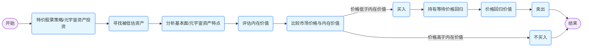

# 如何将特价股票策略应用于元宇宙资产(MA)投资

> 关键词：特价股票策略、元宇宙资产、投资、策略应用、风险控制

> 摘要：本文聚焦于如何将特价股票策略应用于元宇宙资产（MA）投资。首先介绍了特价股票策略和元宇宙资产的背景知识，阐述了两者结合的目的和范围。接着详细讲解了核心概念与联系，包括特价股票策略的原理和元宇宙资产的特点。通过Python代码展示了核心算法原理和具体操作步骤，并给出了相关的数学模型和公式。在项目实战部分，搭建了开发环境，实现并解读了源代码。分析了实际应用场景，推荐了学习、开发工具和相关论文著作。最后总结了未来发展趋势与挑战，解答了常见问题，并提供了扩展阅读和参考资料，旨在为投资者提供全面、深入的指导，帮助其在元宇宙资产投资中运用特价股票策略实现更好的投资效果。

## 1. 背景介绍 
### 1.1 目的和范围
随着元宇宙概念的兴起，元宇宙资产（MA）逐渐成为投资领域的热门话题。特价股票策略作为一种传统且有效的投资策略，其核心思想是寻找被市场低估的股票，以较低的价格买入并在价格回归价值时卖出获利。本研究的目的在于探讨如何将特价股票策略应用于元宇宙资产投资中，为投资者提供一种新的投资思路和方法。

研究范围涵盖了元宇宙资产的主要类型，如虚拟土地、数字艺术品、虚拟角色等，以及特价股票策略的核心原则和方法。通过对两者的结合分析，研究如何筛选具有投资价值的元宇宙资产，制定合理的投资计划，并评估投资风险和收益。

### 1.2 预期读者
本文预期读者包括对元宇宙资产投资感兴趣的个人投资者、金融机构从业者、投资研究人员等。无论是初学者希望了解元宇宙资产投资的基本方法，还是有经验的投资者寻求新的投资策略，都可以从本文中获得有价值的信息和启示。

### 1.3 文档结构概述
本文将按照以下结构进行阐述：首先介绍核心概念与联系，包括特价股票策略和元宇宙资产的基本原理和它们之间的联系；接着详细讲解核心算法原理和具体操作步骤，通过Python代码实现策略的关键环节；然后给出相关的数学模型和公式，并举例说明；在项目实战部分，搭建开发环境，实现源代码并进行详细解读；分析实际应用场景，为投资者提供实际操作的参考；推荐学习、开发工具和相关论文著作，帮助读者进一步深入学习；最后总结未来发展趋势与挑战，解答常见问题，并提供扩展阅读和参考资料。

### 1.4 术语表
#### 1.4.1 核心术语定义
- **特价股票策略**：一种投资策略，通过分析股票的基本面和市场价格，寻找被低估的股票进行投资，期望在股票价格回归其内在价值时获得收益。
- **元宇宙资产（MA）**：存在于元宇宙中的各类数字化资产，包括虚拟土地、数字艺术品、虚拟角色、虚拟货币等，具有独特的价值和交易属性。
- **内在价值**：资产在合理的市场环境下所应具有的价值，通常通过对资产的基本面因素进行分析和评估得出。
- **市场价格**：资产在市场上实际交易的价格，受供求关系、市场情绪等多种因素影响。

#### 1.4.2 相关概念解释
- **元宇宙**：一个虚拟的数字世界，融合了虚拟现实（VR）、增强现实（AR）、区块链等技术，用户可以在其中进行社交、娱乐、工作、交易等活动。
- **区块链技术**：一种去中心化的分布式账本技术，具有不可篡改、可追溯等特点，为元宇宙资产的所有权和交易提供了安全可靠的保障。
- **NFT（非同质化代币）**：基于区块链技术的一种数字资产凭证，每个NFT都是独一无二的，用于表示特定的元宇宙资产，如数字艺术品、虚拟土地等的所有权。

#### 1.4.3 缩略词列表
- **MA**：元宇宙资产（Metaverse Assets）
- **NFT**：非同质化代币（Non - Fungible Token）
- **VR**：虚拟现实（Virtual Reality）
- **AR**：增强现实（Augmented Reality）

## 2. 核心概念与联系 

### 2.1 特价股票策略原理
特价股票策略的核心思想是基于价值投资理论，认为市场有时会出现对股票价值的错误定价，导致股票价格低于其内在价值。投资者通过深入分析公司的财务状况、行业前景、竞争优势等基本面因素，评估股票的内在价值，并在股票价格低于内在价值时买入，等待市场发现其真实价值，价格回归内在价值时卖出，从而获得投资收益。

例如，一家公司具有良好的盈利能力、稳定的现金流和广阔的市场前景，但由于短期的市场波动或负面消息影响，其股票价格大幅下跌。此时，按照特价股票策略，投资者可以对该公司进行详细分析，如果判断其内在价值仍然较高，就可以在低价时买入该股票。

### 2.2 元宇宙资产特点
元宇宙资产具有以下特点：
- **数字化**：元宇宙资产以数字形式存在，依托于虚拟世界和区块链技术。
- **独特性**：许多元宇宙资产通过NFT技术实现了唯一性，如特定的数字艺术品、虚拟土地等，每一个都具有独特的属性和价值。
- **稀缺性**：部分元宇宙资产的数量是有限的，如虚拟土地的总量是固定的，这种稀缺性增加了资产的价值。
- **创新性**：元宇宙是一个新兴的领域，元宇宙资产不断涌现出各种创新的形式和应用场景，具有较高的发展潜力。

### 2.3 两者联系
特价股票策略和元宇宙资产投资之间存在一定的联系。虽然元宇宙资产与传统股票在形式和交易机制上有所不同，但价值投资的理念同样适用。就像寻找被低估的股票一样，投资者可以通过分析元宇宙资产的内在价值和市场价格，寻找被低估的元宇宙资产进行投资。

例如，对于一个具有独特设计和良好社区生态的虚拟土地，由于市场对元宇宙概念的认知不足或短期的市场波动，其价格可能低于其实际价值。投资者可以借鉴特价股票策略的分析方法，评估该虚拟土地的内在价值，如考虑其地理位置、周边设施、开发潜力等因素，当价格低于内在价值时进行投资。

### 2.4 文本示意图
```plaintext
特价股票策略
|-- 寻找被低估股票
|   |-- 分析基本面
|   |   |-- 财务状况
|   |   |-- 行业前景
|   |   |-- 竞争优势
|   |-- 评估内在价值
|   |-- 比较市场价格与内在价值
|       |-- 价格低于内在价值时买入
|       |-- 价格回归价值时卖出

元宇宙资产投资
|-- 寻找被低估元宇宙资产
|   |-- 分析元宇宙资产特点
|   |   |-- 数字化
|   |   |-- 独特性
|   |   |-- 稀缺性
|   |   |-- 创新性
|   |-- 评估内在价值
|   |   |-- 考虑地理位置（虚拟土地）
|   |   |-- 周边设施（虚拟土地）
|   |   |-- 开发潜力（虚拟土地）
|   |   |-- 艺术价值（数字艺术品）
|   |-- 比较市场价格与内在价值
|       |-- 价格低于内在价值时买入
|       |-- 价格回归价值时卖出
```

### 2.5 Mermaid流程图


## 3. 核心算法原理 & 具体操作步骤 

### 3.1 核心算法原理
在将特价股票策略应用于元宇宙资产投资时，核心算法的目标是评估元宇宙资产的内在价值，并与市场价格进行比较。以下是一种基于多因素评估的算法原理：

#### 3.1.1 因素选择
选择影响元宇宙资产价值的关键因素，如对于虚拟土地，可以选择地理位置、周边设施、开发潜力等因素；对于数字艺术品，可以选择艺术价值、创作者知名度、稀缺性等因素。

#### 3.1.2 因素量化
为每个因素设定相应的量化指标和权重。例如，对于虚拟土地的地理位置因素，可以根据其在元宇宙中的中心程度、交通便利性等进行量化评分，并赋予一定的权重。

#### 3.1.3 内在价值计算
根据各因素的量化得分和权重，计算元宇宙资产的内在价值。计算公式为：

$$V = \sum_{i=1}^{n} w_i \times s_i$$

其中，$V$ 表示元宇宙资产的内在价值，$w_i$ 表示第 $i$ 个因素的权重，$s_i$ 表示第 $i$ 个因素的量化得分，$n$ 表示因素的数量。

#### 3.1.4 投资决策
将计算得到的内在价值与市场价格进行比较，如果市场价格低于内在价值，则认为该元宇宙资产被低估，可以考虑买入；反之，则不建议买入。

### 3.2 具体操作步骤

#### 3.2.1 数据收集
收集元宇宙资产的相关数据，包括市场价格、各项影响因素的信息等。可以通过元宇宙资产交易平台、相关社区论坛、行业报告等渠道获取数据。

#### 3.2.2 因素分析与量化
对收集到的数据进行分析，确定影响元宇宙资产价值的关键因素，并对每个因素进行量化评分。例如，对于虚拟土地的地理位置因素，可以将其分为中心区域、次中心区域、边缘区域，分别赋予不同的分数。

#### 3.2.3 权重设定
根据各因素对元宇宙资产价值的影响程度，设定相应的权重。可以通过专家评估、历史数据分析等方法确定权重。

#### 3.2.4 内在价值计算
使用上述公式计算元宇宙资产的内在价值。

#### 3.2.5 投资决策
比较内在价值和市场价格，做出投资决策。

### 3.3 Python源代码实现
```python
# 定义元宇宙资产类
class MetaverseAsset:
    def __init__(self, market_price, factors, weights):
        self.market_price = market_price
        self.factors = factors  # 因素量化得分列表
        self.weights = weights  # 因素权重列表

    def calculate_intrinsic_value(self):
        intrinsic_value = 0
        for i in range(len(self.factors)):
            intrinsic_value += self.weights[i] * self.factors[i]
        return intrinsic_value

    def make_investment_decision(self):
        intrinsic_value = self.calculate_intrinsic_value()
        if self.market_price < intrinsic_value:
            return "买入"
        else:
            return "不买入"

# 示例数据
market_price = 100
factors = [8, 7, 6]  # 假设三个因素的量化得分
weights = [0.4, 0.3, 0.3]  # 假设三个因素的权重

# 创建元宇宙资产对象
asset = MetaverseAsset(market_price, factors, weights)

# 计算内在价值
intrinsic_value = asset.calculate_intrinsic_value()
print(f"内在价值: {intrinsic_value}")

# 做出投资决策
decision = asset.make_investment_decision()
print(f"投资决策: {decision}")
```

### 3.4 代码解释
- **MetaverseAsset类**：用于表示元宇宙资产，包含市场价格、因素量化得分列表和因素权重列表。
- **calculate_intrinsic_value方法**：根据上述公式计算元宇宙资产的内在价值。
- **make_investment_decision方法**：比较内在价值和市场价格，做出投资决策。
- **示例数据**：设定了市场价格、因素量化得分和因素权重，创建元宇宙资产对象，并调用相应方法计算内在价值和做出投资决策。

## 4. 数学模型和公式 & 详细讲解 & 举例说明 

### 4.1 内在价值计算模型
如前文所述，内在价值的计算模型为：

$$V = \sum_{i=1}^{n} w_i \times s_i$$

其中，$V$ 表示元宇宙资产的内在价值，$w_i$ 表示第 $i$ 个因素的权重，$s_i$ 表示第 $i$ 个因素的量化得分，$n$ 表示因素的数量。

### 4.2 详细讲解
- **因素选择**：选择合适的因素是准确评估元宇宙资产内在价值的关键。不同类型的元宇宙资产，其影响价值的因素可能不同。例如，对于虚拟土地，地理位置、周边设施、开发潜力等因素较为重要；对于数字艺术品，艺术价值、创作者知名度、稀缺性等因素更为关键。
- **因素量化**：将每个因素转化为具体的量化得分，以便进行数学计算。量化得分的标准可以根据实际情况进行设定。例如，对于虚拟土地的地理位置因素，可以将其分为中心区域（得分8 - 10分）、次中心区域（得分5 - 7分）、边缘区域（得分1 - 4分）。
- **权重设定**：权重反映了每个因素对元宇宙资产价值的影响程度。权重的设定需要综合考虑各种因素，可以通过专家评估、历史数据分析等方法确定。例如，对于虚拟土地，地理位置因素的权重可能较高，设为0.4；周边设施因素的权重设为0.3；开发潜力因素的权重设为0.3。

### 4.3 举例说明
假设我们要评估一个虚拟土地的内在价值，选择了地理位置、周边设施、开发潜力三个因素，其量化得分分别为8分、7分、6分，对应的权重分别为0.4、0.3、0.3。

根据公式计算内在价值：

$$V = 0.4 \times 8 + 0.3 \times 7 + 0.3 \times 6$$
$$V = 3.2 + 2.1 + 1.8$$
$$V = 7.1$$

如果该虚拟土地的市场价格为6，由于市场价格低于内在价值（6 < 7.1），根据特价股票策略，我们可以考虑买入该虚拟土地。

## 5. 项目实战：代码实际案例和详细解释说明 

### 5.1  开发环境搭建
#### 5.1.1 Python环境安装
首先需要安装Python环境，建议使用Python 3.7及以上版本。可以从Python官方网站（https://www.python.org/downloads/）下载对应操作系统的安装包，按照安装向导进行安装。

#### 5.1.2 开发工具选择
可以选择使用集成开发环境（IDE）如PyCharm，它具有强大的代码编辑、调试和项目管理功能。也可以使用轻量级的文本编辑器如Visual Studio Code，并安装Python相关插件。

#### 5.1.3 第三方库安装
在项目中，可能需要使用一些第三方库来处理数据和进行分析。可以使用pip命令进行安装，例如：
```bash
pip install pandas  # 用于数据处理
pip install matplotlib  # 用于数据可视化
```

### 5.2  源代码详细实现和代码解读

#### 5.2.1 数据收集与处理
```python
import pandas as pd

# 模拟从交易平台获取元宇宙资产数据
data = {
    "asset_id": [1, 2, 3],
    "market_price": [100, 120, 80],
    "location_score": [8, 7, 9],  # 地理位置得分
    "facility_score": [7, 8, 6],  # 周边设施得分
    "development_score": [6, 7, 8],  # 开发潜力得分
    "location_weight": [0.4, 0.4, 0.4],
    "facility_weight": [0.3, 0.3, 0.3],
    "development_weight": [0.3, 0.3, 0.3]
}

df = pd.DataFrame(data)

# 显示数据
print(df)
```
**代码解读**：
- 导入pandas库用于数据处理。
- 模拟从交易平台获取元宇宙资产数据，存储在字典中。
- 使用pandas的DataFrame将数据转换为表格形式，并显示数据。

#### 5.2.2 内在价值计算
```python
def calculate_intrinsic_value(row):
    factors = [row["location_score"], row["facility_score"], row["development_score"]]
    weights = [row["location_weight"], row["facility_weight"], row["development_weight"]]
    intrinsic_value = 0
    for i in range(len(factors)):
        intrinsic_value += weights[i] * factors[i]
    return intrinsic_value

df["intrinsic_value"] = df.apply(calculate_intrinsic_value, axis=1)

# 显示计算结果
print(df[["asset_id", "market_price", "intrinsic_value"]])
```
**代码解读**：
- 定义`calculate_intrinsic_value`函数，用于计算单个元宇宙资产的内在价值。
- 使用pandas的`apply`方法将该函数应用到DataFrame的每一行，计算每个资产的内在价值，并添加到新的列中。
- 显示资产ID、市场价格和内在价值。

#### 5.2.3 投资决策
```python
def make_investment_decision(row):
    if row["market_price"] < row["intrinsic_value"]:
        return "买入"
    else:
        return "不买入"

df["investment_decision"] = df.apply(make_investment_decision, axis=1)

# 显示投资决策结果
print(df[["asset_id", "market_price", "intrinsic_value", "investment_decision"]])
```
**代码解读**：
- 定义`make_investment_decision`函数，根据市场价格和内在价值的比较结果做出投资决策。
- 使用pandas的`apply`方法将该函数应用到DataFrame的每一行，添加投资决策结果到新的列中。
- 显示资产ID、市场价格、内在价值和投资决策结果。

### 5.3  代码解读与分析
#### 5.3.1 数据处理
使用pandas库可以方便地处理和分析元宇宙资产数据。通过将数据存储在DataFrame中，可以进行各种数据操作，如筛选、排序、计算等。

#### 5.3.2 内在价值计算
通过定义函数并使用pandas的`apply`方法，可以高效地计算每个元宇宙资产的内在价值。这种方式避免了使用循环遍历每一行数据，提高了代码的执行效率。

#### 5.3.3 投资决策
根据内在价值和市场价格的比较结果，使用函数做出投资决策，并将结果存储在DataFrame中。这样可以直观地看到每个资产的投资建议。

#### 5.3.4 扩展性
代码具有一定的扩展性。可以根据需要添加更多的因素和权重，只需修改数据和相应的计算函数即可。同时，可以结合其他数据分析和机器学习方法，进一步优化投资决策。

## 6. 实际应用场景 
### 6.1 个人投资者
个人投资者可以使用特价股票策略投资元宇宙资产，实现资产的增值。例如，一位对元宇宙概念感兴趣的投资者，通过分析虚拟土地的内在价值和市场价格，发现某块虚拟土地被低估，于是以较低的价格买入。随着元宇宙的发展和该虚拟土地周边设施的完善，其价值逐渐提升，投资者可以在合适的时机卖出，获得投资收益。

### 6.2 投资机构
投资机构可以将特价股票策略应用于元宇宙资产投资组合的构建。通过筛选被低估的元宇宙资产，如数字艺术品、虚拟角色等，组合成具有一定风险收益特征的投资组合。投资机构还可以利用专业的研究团队和数据分析工具，对元宇宙资产进行更深入的分析和评估，提高投资决策的准确性。

### 6.3 元宇宙项目开发者
元宇宙项目开发者可以借鉴特价股票策略的思想，对自己项目中的元宇宙资产进行合理定价。通过评估资产的内在价值，制定合理的价格策略，吸引投资者和用户。同时，开发者还可以根据市场反馈，及时调整资产价格，提高项目的市场竞争力。

### 6.4 风险投资
风险投资机构可以使用特价股票策略寻找具有潜力的元宇宙项目进行投资。通过分析项目的核心资产、团队实力、市场前景等因素，评估项目的内在价值。当项目处于早期阶段，资产价格相对较低时，风险投资机构可以进行投资，等待项目发展壮大，资产价值提升后获得高额回报。

## 7. 工具和资源推荐
### 7.1 学习资源推荐
#### 7.1.1 书籍推荐
- 《价值投资实战手册》：详细介绍了价值投资的基本原理和方法，包括如何评估股票的内在价值，对将特价股票策略应用于元宇宙资产投资有很好的理论指导作用。
- 《元宇宙通证》：全面阐述了元宇宙的概念、技术架构和经济体系，深入介绍了元宇宙资产的特点和交易机制，有助于投资者了解元宇宙资产的基本情况。
- 《区块链技术原理与应用》：区块链是元宇宙资产的重要支撑技术，该书系统介绍了区块链的原理、共识算法、智能合约等内容，为理解元宇宙资产的所有权和交易提供了技术基础。

#### 7.1.2 在线课程
- Coursera上的“Investment Management Specialization”：该课程由知名高校教授授课，涵盖了投资管理的各个方面，包括价值投资策略的应用，对提升投资分析能力有很大帮助。
- Udemy上的“Metaverse Development and Investment”：专门针对元宇宙开发和投资的课程，介绍了元宇宙的发展趋势、资产类型和投资方法，适合对元宇宙投资感兴趣的初学者。
- edX上的“Blockchain and Cryptocurrency Technologies”：深入讲解了区块链和加密货币技术，对于理解元宇宙资产的底层技术和交易机制有重要意义。

#### 7.1.3 技术博客和网站
- CoinDesk：提供最新的区块链和加密货币行业新闻、分析和研究报告，对元宇宙资产投资有一定的参考价值。
- Decrypt：专注于元宇宙、NFT等新兴领域的报道，分享行业动态、项目评测和投资建议。
- Medium上的区块链和元宇宙相关博客：许多行业专家和从业者在Medium上分享他们的见解和研究成果，可以从中获取最新的技术和市场信息。

### 7.2 开发工具框架推荐
#### 7.2.1 IDE和编辑器
- PyCharm：功能强大的Python集成开发环境，具有代码自动补全、调试、版本控制等功能，适合进行Python代码开发和项目管理。
- Visual Studio Code：轻量级的文本编辑器，支持多种编程语言和插件扩展，可通过安装Python插件实现Python代码的开发和调试。
- Remix：专门用于Solidity智能合约开发的在线集成开发环境，对于开发基于区块链的元宇宙资产智能合约非常方便。

#### 7.2.2 调试和性能分析工具
- PDB：Python自带的调试器，可以帮助开发者定位代码中的错误和问题。
- cProfile：Python的性能分析工具，用于分析代码的执行时间和资源消耗，帮助优化代码性能。
- Truffle Suite：一套用于开发、测试和部署以太坊智能合约的工具，提供了调试和性能分析功能，适用于元宇宙资产智能合约的开发。

#### 7.2.3 相关框架和库
- Pandas：用于数据处理和分析的Python库，提供了高效的数据结构和数据分析工具，可用于处理元宇宙资产的相关数据。
- NumPy：Python的科学计算库，提供了多维数组对象和各种数学函数，可用于进行数值计算和数据分析。
- Web3.py：用于与以太坊区块链进行交互的Python库，可用于开发基于以太坊的元宇宙资产应用。

### 7.3 相关论文著作推荐
#### 7.3.1 经典论文
- “The Theory of Investment Value” by John Burr Williams：价值投资理论的经典论文，阐述了股票内在价值的计算方法和投资决策的基本原则，对特价股票策略有重要的理论基础。
- “Bitcoin: A Peer - to - Peer Electronic Cash System” by Satoshi Nakamoto：比特币的白皮书，介绍了区块链技术的基本原理和比特币的运行机制，为元宇宙资产的区块链基础提供了理论支持。

#### 7.3.2 最新研究成果
- 关注顶级学术会议如ACM SIGGRAPH、IEEE VR等的研究论文，这些会议会发表关于元宇宙技术和应用的最新研究成果，有助于了解元宇宙的前沿技术和发展趋势。
- 查阅知名学术期刊如“Journal of Financial Economics”、“ACM Transactions on Graphics”等，获取关于投资策略和元宇宙技术的最新研究动态。

#### 7.3.3 应用案例分析
- 分析一些成功的元宇宙项目案例，如Decentraland、The Sandbox等，了解它们的资产运营模式、投资策略和市场表现。可以通过项目官方网站、行业报告和相关研究论文获取这些案例的详细信息。

## 8. 总结：未来发展趋势与挑战
### 8.1 未来发展趋势
#### 8.1.1 市场规模扩大
随着元宇宙概念的普及和技术的不断发展，元宇宙资产市场规模有望持续扩大。越来越多的投资者和用户将关注元宇宙资产，推动市场的繁荣。

#### 8.1.2 资产类型丰富
未来，元宇宙资产的类型将不断丰富，除了现有的虚拟土地、数字艺术品、虚拟角色等，还可能出现更多创新的资产形式，如虚拟企业股权、虚拟知识产权等。

#### 8.1.3 与实体经济融合加深
元宇宙与实体经济的融合将越来越紧密，元宇宙资产的价值将与现实世界的经济活动产生更多的关联。例如，虚拟土地可以与现实中的商业活动相结合，开展虚拟展览、虚拟会议等业务。

#### 8.1.4 技术创新推动
区块链、虚拟现实、人工智能等技术的不断创新将为元宇宙资产的发展提供更强大的支持。例如，更高效的区块链共识算法将提高元宇宙资产交易的速度和安全性；人工智能技术将为元宇宙资产的创作和运营提供更多的智能化服务。

### 8.2 挑战
#### 8.2.1 市场不确定性
元宇宙市场仍处于发展初期，存在较大的不确定性。市场价格波动较大，资产价值难以准确评估，投资者面临较高的投资风险。

#### 8.2.2 监管政策不完善
目前，针对元宇宙资产的监管政策还不完善，缺乏明确的法律法规和监管标准。这可能导致市场乱象丛生，如虚假宣传、欺诈等行为，损害投资者的利益。

#### 8.2.3 技术瓶颈
虽然元宇宙相关技术发展迅速，但仍存在一些技术瓶颈，如虚拟现实设备的沉浸感和舒适度有待提高，区块链技术的扩展性和性能需要进一步优化等。这些技术问题可能会限制元宇宙资产的发展。

#### 8.2.4 安全风险
元宇宙资产的安全问题不容忽视。由于元宇宙资产基于数字技术和区块链，面临着黑客攻击、数据泄露等安全风险。保障元宇宙资产的安全需要不断加强技术防范和安全管理。

## 9. 附录：常见问题与解答
### 9.1 特价股票策略是否适用于所有元宇宙资产？
特价股票策略的核心思想是寻找被低估的资产，但并非所有元宇宙资产都适合使用该策略。一些新兴的、缺乏足够市场数据和价值评估标准的元宇宙资产，可能难以准确评估其内在价值，使用该策略的效果可能不佳。因此，在应用该策略时，需要根据具体的资产类型和市场情况进行分析。

### 9.2 如何准确评估元宇宙资产的内在价值？
评估元宇宙资产的内在价值需要综合考虑多个因素，如资产的特点、市场需求、发展潜力等。可以采用多因素评估方法，选择关键因素并进行量化评分，设定合理的权重，计算内在价值。同时，还可以参考市场上类似资产的交易价格和行业报告，结合专家意见进行综合判断。

### 9.3 元宇宙资产投资存在哪些风险？
元宇宙资产投资存在市场风险、技术风险、监管风险等。市场风险表现为价格波动较大，资产价值难以预测；技术风险包括区块链技术的安全性和性能问题、虚拟现实设备的体验不佳等；监管风险是指由于监管政策不完善，可能导致市场秩序混乱和投资者权益受损。

### 9.4 如何降低元宇宙资产投资的风险？
可以通过分散投资、深入研究、关注市场动态等方式降低投资风险。分散投资可以将资金分配到不同类型的元宇宙资产中，降低单一资产的风险；深入研究资产的内在价值和市场情况，避免盲目投资；关注市场动态和监管政策变化，及时调整投资策略。

## 10. 扩展阅读 & 参考资料
### 10.1 扩展阅读
- 《元宇宙改变一切》：深入探讨了元宇宙对社会、经济和生活的影响，以及元宇宙资产的发展前景。
- 《区块链革命》：介绍了区块链技术在各个领域的应用，包括元宇宙资产的交易和管理。
- 《投资最重要的事》：强调了投资中的风险控制和价值判断，对元宇宙资产投资有重要的启示作用。

### 10.2 参考资料
- 元宇宙资产交易平台官方网站，如Decentraland、The Sandbox等，获取资产交易数据和项目信息。
- 行业研究报告，如艾瑞咨询、Gartner等发布的关于元宇宙和区块链的研究报告，了解行业发展趋势和市场规模。
- 相关学术论文数据库，如IEEE Xplore、ACM Digital Library等，查阅关于元宇宙技术和投资策略的学术研究成果。

作者：AI天才研究院/AI Genius Institute & 禅与计算机程序设计艺术 /Zen And The Art of Computer Programming